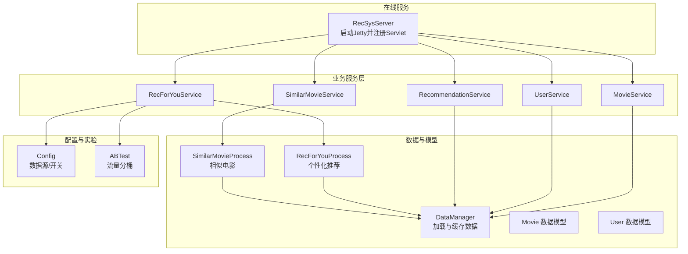
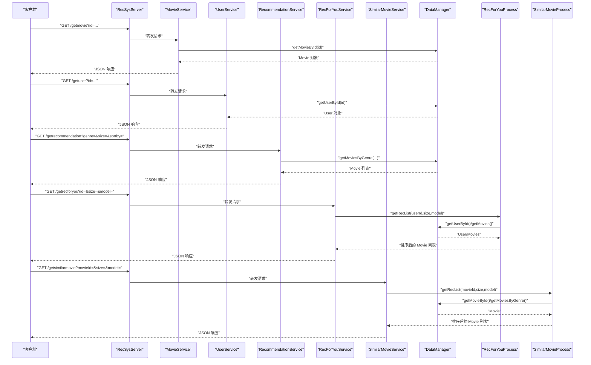
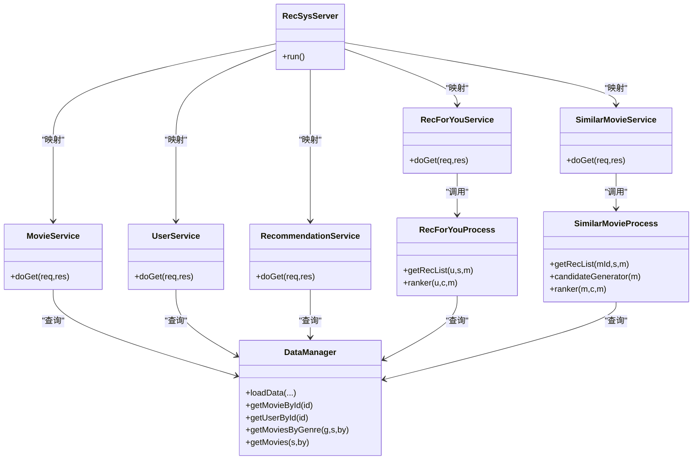

# API参考

<cite>
**本文引用的文件**
- [src/main/java/com/sparrowrecsys/online/RecSysServer.java](file://src/main/java/com/sparrowrecsys/online/RecSysServer.java)
- [src/main/java/com/sparrowrecsys/online/service/MovieService.java](file://src/main/java/com/sparrowrecsys/online/service/MovieService.java)
- [src/main/java/com/sparrowrecsys/online/service/UserService.java](file://src/main/java/com/sparrowrecsys/online/service/UserService.java)
- [src/main/java/com/sparrowrecsys/online/service/RecommendationService.java](file://src/main/java/com/sparrowrecsys/online/service/RecommendationService.java)
- [src/main/java/com/sparrowrecsys/online/service/RecForYouService.java](file://src/main/java/com/sparrowrecsys/online/service/RecForYouService.java)
- [src/main/java/com/sparrowrecsys/online/service/SimilarMovieService.java](file://src/main/java/com/sparrowrecsys/online/service/SimilarMovieService.java)
- [src/main/java/com/sparrowrecsys/online/datamanager/DataManager.java](file://src/main/java/com/sparrowrecsys/online/datamanager/DataManager.java)
- [src/main/java/com/sparrowrecsys/online/datamanager/Movie.java](file://src/main/java/com/sparrowrecsys/online/datamanager/Movie.java)
- [src/main/java/com/sparrowrecsys/online/datamanager/User.java](file://src/main/java/com/sparrowrecsys/online/datamanager/User.java)
- [src/main/java/com/sparrowrecsys/online/recprocess/RecForYouProcess.java](file://src/main/java/com/sparrowrecsys/online/recprocess/RecForYouProcess.java)
- [src/main/java/com/sparrowrecsys/online/recprocess/SimilarMovieProcess.java](file://src/main/java/com/sparrowrecsys/online/recprocess/SimilarMovieProcess.java)
- [src/main/java/com/sparrowrecsys/online/util/Config.java](file://src/main/java/com/sparrowrecsys/online/util/Config.java)
- [src/main/java/com/sparrowrecsys/online/util/ABTest.java](file://src/main/java/com/sparrowrecsys/online/util/ABTest.java)
- [src/main/resources/webroot/index.html](file://src/main/resources/webroot/index.html)
</cite>

## 目录
1. [简介](#简介)
2. [项目结构](#项目结构)
3. [核心组件](#核心组件)
4. [架构总览](#架构总览)
5. [详细组件分析](#详细组件分析)
6. [依赖关系分析](#依赖关系分析)
7. [性能与可扩展性](#性能与可扩展性)
8. [故障排查指南](#故障排查指南)
9. [结论](#结论)
10. [附录：API规范与示例](#附录api规范与示例)

## 简介
本文件为 SparrowRecSys 在线推荐服务的完整 API 参考文档。系统基于嵌入式数据与简单排序策略提供电影信息查询、用户信息查询、通用推荐、个性化推荐（“为你推荐”）、相似电影推荐等 REST 接口，并通过 Jetty 提供 HTTP 服务。本文档覆盖各端点的 HTTP 方法、URL 模式、请求参数、响应格式、错误处理、示例调用（含 curl）以及与配置相关的版本化行为说明。

## 项目结构
在线服务由一个主入口启动 Jetty 服务器，并将不同 API 映射到对应的 Servlet 实现；数据加载与缓存由 DataManager 负责；推荐流程由 RecForYouProcess 和 SimilarMovieProcess 执行；配置与 AB 实验由 Config 与 ABTest 控制。

图表来源
- [src/main/java/com/sparrowrecsys/online/RecSysServer.java](file://src/main/java/com/sparrowrecsys/online/RecSysServer.java#L64-L69)
- [src/main/java/com/sparrowrecsys/online/service/MovieService.java](file://src/main/java/com/sparrowrecsys/online/service/MovieService.java#L16-L45)
- [src/main/java/com/sparrowrecsys/online/service/UserService.java](file://src/main/java/com/sparrowrecsys/online/service/UserService.java#L15-L44)
- [src/main/java/com/sparrowrecsys/online/service/RecommendationService.java](file://src/main/java/com/sparrowrecsys/online/service/RecommendationService.java#L18-L47)
- [src/main/java/com/sparrowrecsys/online/service/RecForYouService.java](file://src/main/java/com/sparrowrecsys/online/service/RecForYouService.java#L20-L54)
- [src/main/java/com/sparrowrecsys/online/service/SimilarMovieService.java](file://src/main/java/com/sparrowrecsys/online/service/SimilarMovieService.java#L16-L45)
- [src/main/java/com/sparrowrecsys/online/datamanager/DataManager.java](file://src/main/java/com/sparrowrecsys/online/datamanager/DataManager.java#L13-L50)
- [src/main/java/com/sparrowrecsys/online/recprocess/RecForYouProcess.java](file://src/main/java/com/sparrowrecsys/online/recprocess/RecForYouProcess.java#L29-L60)
- [src/main/java/com/sparrowrecsys/online/recprocess/SimilarMovieProcess.java](file://src/main/java/com/sparrowrecsys/online/recprocess/SimilarMovieProcess.java#L20-L32)
- [src/main/java/com/sparrowrecsys/online/util/Config.java](file://src/main/java/com/sparrowrecsys/online/util/Config.java#L3-L13)
- [src/main/java/com/sparrowrecsys/online/util/ABTest.java](file://src/main/java/com/sparrowrecsys/online/util/ABTest.java#L11-L26)

章节来源
- [src/main/java/com/sparrowrecsys/online/RecSysServer.java](file://src/main/java/com/sparrowrecsys/online/RecSysServer.java#L27-L78)

## 核心组件
- RecSysServer：启动 Jetty，绑定静态资源与各 API Servlet。
- 各 Service：对应 GET 端点，负责解析参数、调用 DataManager 或推荐处理器、序列化 JSON 响应。
- DataManager：单例数据管理器，负责加载电影、链接、评分、嵌入向量等数据，维护索引与缓存。
- RecForYouProcess：个性化推荐流程，支持嵌入相似度与神经协同过滤（TF Serving）两种排序模型。
- SimilarMovieProcess：相似电影流程，支持基于流派、评分、嵌入相似度等策略生成候选与打分。
- Config/ABTest：运行时配置与 A/B 流量分桶逻辑。

章节来源
- [src/main/java/com/sparrowrecsys/online/service/MovieService.java](file://src/main/java/com/sparrowrecsys/online/service/MovieService.java#L16-L45)
- [src/main/java/com/sparrowrecsys/online/service/UserService.java](file://src/main/java/com/sparrowrecsys/online/service/UserService.java#L15-L44)
- [src/main/java/com/sparrowrecsys/online/service/RecommendationService.java](file://src/main/java/com/sparrowrecsys/online/service/RecommendationService.java#L18-L47)
- [src/main/java/com/sparrowrecsys/online/service/RecForYouService.java](file://src/main/java/com/sparrowrecsys/online/service/RecForYouService.java#L20-L54)
- [src/main/java/com/sparrowrecsys/online/service/SimilarMovieService.java](file://src/main/java/com/sparrowrecsys/online/service/SimilarMovieService.java#L16-L45)
- [src/main/java/com/sparrowrecsys/online/datamanager/DataManager.java](file://src/main/java/com/sparrowrecsys/online/datamanager/DataManager.java#L13-L50)
- [src/main/java/com/sparrowrecsys/online/recprocess/RecForYouProcess.java](file://src/main/java/com/sparrowrecsys/online/recprocess/RecForYouProcess.java#L29-L92)
- [src/main/java/com/sparrowrecsys/online/recprocess/SimilarMovieProcess.java](file://src/main/java/com/sparrowrecsys/online/recprocess/SimilarMovieProcess.java#L20-L137)
- [src/main/java/com/sparrowrecsys/online/util/Config.java](file://src/main/java/com/sparrowrecsys/online/util/Config.java#L3-L13)
- [src/main/java/com/sparrowrecsys/online/util/ABTest.java](file://src/main/java/com/sparrowrecsys/online/util/ABTest.java#L11-L26)

## 架构总览
下图展示了从客户端到后端服务、数据与推荐处理的整体交互路径。

图表来源
- [src/main/java/com/sparrowrecsys/online/RecSysServer.java](file://src/main/java/com/sparrowrecsys/online/RecSysServer.java#L64-L69)
- [src/main/java/com/sparrowrecsys/online/service/MovieService.java](file://src/main/java/com/sparrowrecsys/online/service/MovieService.java#L17-L39)
- [src/main/java/com/sparrowrecsys/online/service/UserService.java](file://src/main/java/com/sparrowrecsys/online/service/UserService.java#L16-L38)
- [src/main/java/com/sparrowrecsys/online/service/RecommendationService.java](file://src/main/java/com/sparrowrecsys/online/service/RecommendationService.java#L19-L40)
- [src/main/java/com/sparrowrecsys/online/service/RecForYouService.java](file://src/main/java/com/sparrowrecsys/online/service/RecForYouService.java#L21-L47)
- [src/main/java/com/sparrowrecsys/online/service/SimilarMovieService.java](file://src/main/java/com/sparrowrecsys/online/service/SimilarMovieService.java#L17-L38)
- [src/main/java/com/sparrowrecsys/online/datamanager/DataManager.java](file://src/main/java/com/sparrowrecsys/online/datamanager/DataManager.java#L253-L293)
- [src/main/java/com/sparrowrecsys/online/recprocess/RecForYouProcess.java](file://src/main/java/com/sparrowrecsys/online/recprocess/RecForYouProcess.java#L29-L60)
- [src/main/java/com/sparrowrecsys/online/recprocess/SimilarMovieProcess.java](file://src/main/java/com/sparrowrecsys/online/recprocess/SimilarMovieProcess.java#L20-L32)

## 详细组件分析

### MovieService（/getmovie）
- HTTP 方法：GET
- URL 模式：/getmovie
- 请求头：无特殊要求
- 查询参数：
  - id：整数，电影 ID
- 成功响应：application/json，Movie 对象的 JSON 序列化结果
- 失败响应：空字符串（当未找到或异常时）
- 错误处理：捕获异常并返回空字符串
- 示例调用（curl）：
  - curl "http://localhost:6010/getmovie?id=1"
- 注意事项：
  - 若未启用 CORS，跨域请求可能被浏览器拦截；当前实现已设置允许任意来源的响应头

章节来源
- [src/main/java/com/sparrowrecsys/online/service/MovieService.java](file://src/main/java/com/sparrowrecsys/online/service/MovieService.java#L17-L44)
- [src/main/java/com/sparrowrecsys/online/datamanager/DataManager.java](file://src/main/java/com/sparrowrecsys/online/datamanager/DataManager.java#L285-L288)

### UserService（/getuser）
- HTTP 方法：GET
- URL 模式：/getuser
- 请求头：无特殊要求
- 查询参数：
  - id：整数，用户 ID
- 成功响应：application/json，User 对象的 JSON 序列化结果
- 失败响应：空字符串（当未找到或异常时）
- 错误处理：捕获异常并返回空字符串
- 示例调用（curl）：
  - curl "http://localhost:6010/getuser?id=1"
- 注意事项：
  - 当前实现未设置自定义 Content-Type 外的额外响应头

章节来源
- [src/main/java/com/sparrowrecsys/online/service/UserService.java](file://src/main/java/com/sparrowrecsys/online/service/UserService.java#L16-L43)
- [src/main/java/com/sparrowrecsys/online/datamanager/DataManager.java](file://src/main/java/com/sparrowrecsys/online/datamanager/DataManager.java#L290-L293)

### RecommendationService（/getrecommendation）
- HTTP 方法：GET
- URL 模式：/getrecommendation
- 请求头：无特殊要求
- 查询参数：
  - genre：字符串，电影类型（如 Action、Romance 等）
  - size：整数，返回数量上限
  - sortby：字符串，排序依据，支持 "rating"、"releaseYear"
- 成功响应：application/json，Movie 列表的 JSON 序列化结果
- 失败响应：空字符串（当异常时）
- 错误处理：捕获异常并返回空字符串
- 示例调用（curl）：
  - curl "http://localhost:6010/getrecommendation?genre=Drama&size=10&sortby=rating"
- 注意事项：
  - 当 genre 为空时，返回 null（上层返回空字符串）

章节来源
- [src/main/java/com/sparrowrecsys/online/service/RecommendationService.java](file://src/main/java/com/sparrowrecsys/online/service/RecommendationService.java#L19-L46)
- [src/main/java/com/sparrowrecsys/online/datamanager/DataManager.java](file://src/main/java/com/sparrowrecsys/online/datamanager/DataManager.java#L252-L268)

### RecForYouService（/getrecforyou）
- HTTP 方法：GET
- URL 模式：/getrecforyou
- 请求头：无特殊要求
- 查询参数：
  - id：整数，用户 ID
  - size：整数，返回数量上限
  - model：字符串，排序模型，支持 "emb"、"nerualcf"；默认为 "emb"
- 成功响应：application/json，Movie 列表的 JSON 序列化结果
- 失败响应：空字符串（当异常时）
- 错误处理：捕获异常并返回空字符串
- A/B 实验：若启用，根据用户 ID 将流量分配到不同模型
- 示例调用（curl）：
  - curl "http://localhost:6010/getrecforyou?id=1&size=10&model=emb"
- 注意事项：
  - 当 Config.IS_ENABLE_AB_TEST 为 true 时，会根据用户 ID 进行流量分桶
  - "nerualcf" 模型需要外部 TensorFlow Serving 提供预测服务

章节来源
- [src/main/java/com/sparrowrecsys/online/service/RecForYouService.java](file://src/main/java/com/sparrowrecsys/online/service/RecForYouService.java#L21-L53)
- [src/main/java/com/sparrowrecsys/online/recprocess/RecForYouProcess.java](file://src/main/java/com/sparrowrecsys/online/recprocess/RecForYouProcess.java#L29-L92)
- [src/main/java/com/sparrowrecsys/online/util/ABTest.java](file://src/main/java/com/sparrowrecsys/online/util/ABTest.java#L11-L26)
- [src/main/java/com/sparrowrecsys/online/util/Config.java](file://src/main/java/com/sparrowrecsys/online/util/Config.java#L11)

### SimilarMovieService（/getsimilarmovie）
- HTTP 方法：GET
- URL 模式：/getsimilarmovie
- 请求头：无特殊要求
- 查询参数：
  - movieId：整数，输入电影 ID
  - size：整数，返回数量上限
  - model：字符串，相似度计算模型，支持 "emb"、默认（基于流派与评分）
- 成功响应：application/json，Movie 列表的 JSON 序列化结果
- 失败响应：空字符串（当异常时）
- 错误处理：捕获异常并返回空字符串
- 示例调用（curl）：
  - curl "http://localhost:6010/getsimilarmovie?movieId=1&size=10&model=emb"
- 注意事项：
  - 默认模型综合考虑共同流派与平均评分权重
  - "emb" 模型依赖嵌入向量相似度

章节来源
- [src/main/java/com/sparrowrecsys/online/service/SimilarMovieService.java](file://src/main/java/com/sparrowrecsys/online/service/SimilarMovieService.java#L17-L44)
- [src/main/java/com/sparrowrecsys/online/recprocess/SimilarMovieProcess.java](file://src/main/java/com/sparrowrecsys/online/recprocess/SimilarMovieProcess.java#L20-L137)

## 依赖关系分析
- Servlet 绑定：RecSysServer 将各 API 映射到对应 Servlet。
- 数据访问：MovieService/UserService/RecommendationService 直接依赖 DataManager；RecForYouService/SimilarMovieService 依赖各自处理类与 DataManager。
- 推荐流程：RecForYouProcess 支持嵌入相似度与 TF Serving；SimilarMovieProcess 支持多路召回与嵌入相似度。
- 配置影响：Config 决定嵌入数据来源与特性加载开关；ABTest 决定模型选择。

图表来源
- [src/main/java/com/sparrowrecsys/online/RecSysServer.java](file://src/main/java/com/sparrowrecsys/online/RecSysServer.java#L64-L69)
- [src/main/java/com/sparrowrecsys/online/service/MovieService.java](file://src/main/java/com/sparrowrecsys/online/service/MovieService.java#L16-L45)
- [src/main/java/com/sparrowrecsys/online/service/UserService.java](file://src/main/java/com/sparrowrecsys/online/service/UserService.java#L15-L44)
- [src/main/java/com/sparrowrecsys/online/service/RecommendationService.java](file://src/main/java/com/sparrowrecsys/online/service/RecommendationService.java#L18-L47)
- [src/main/java/com/sparrowrecsys/online/service/RecForYouService.java](file://src/main/java/com/sparrowrecsys/online/service/RecForYouService.java#L20-L54)
- [src/main/java/com/sparrowrecsys/online/service/SimilarMovieService.java](file://src/main/java/com/sparrowrecsys/online/service/SimilarMovieService.java#L16-L45)
- [src/main/java/com/sparrowrecsys/online/datamanager/DataManager.java](file://src/main/java/com/sparrowrecsys/online/datamanager/DataManager.java#L252-L293)
- [src/main/java/com/sparrowrecsys/online/recprocess/RecForYouProcess.java](file://src/main/java/com/sparrowrecsys/online/recprocess/RecForYouProcess.java#L29-L92)
- [src/main/java/com/sparrowrecsys/online/recprocess/SimilarMovieProcess.java](file://src/main/java/com/sparrowrecsys/online/recprocess/SimilarMovieProcess.java#L20-L137)

## 性能与可扩展性
- 端口与部署：默认监听 6010 端口，可通过环境变量 PORT 覆盖；服务绑定根路径并提供静态页面。
- 数据加载：DataManager 在启动时加载电影、链接、评分与嵌入数据，构建流派反向索引以加速按类型检索。
- 排序策略：RecommendationService 的通用推荐按指定字段排序；RecForYouService 的个性化推荐支持嵌入相似度与 TF Serving 推理；SimilarMovieService 的相似度计算可选嵌入相似度。
- 可扩展建议：
  - 引入限流与熔断（如基于用户 ID 或 IP 的令牌桶）
  - 缓存热门用户/电影的推荐结果
  - 将 TF Serving 调用异步化并增加超时与重试
  - 支持分页与更丰富的筛选条件

章节来源
- [src/main/java/com/sparrowrecsys/online/RecSysServer.java](file://src/main/java/com/sparrowrecsys/online/RecSysServer.java#L24-L36)
- [src/main/java/com/sparrowrecsys/online/datamanager/DataManager.java](file://src/main/java/com/sparrowrecsys/online/datamanager/DataManager.java#L40-L50)
- [src/main/java/com/sparrowrecsys/online/recprocess/RecForYouProcess.java](file://src/main/java/com/sparrowrecsys/online/recprocess/RecForYouProcess.java#L113-L138)
- [src/main/java/com/sparrowrecsys/online/recprocess/SimilarMovieProcess.java](file://src/main/java/com/sparrowrecsys/online/recprocess/SimilarMovieProcess.java#L121-L137)

## 故障排查指南
- 404/路由问题：确认服务已启动且端点 URL 正确；检查 RecSysServer 中的 Servlet 映射。
- 参数缺失：确保 id、movieId、size、genre、sortby、model 等参数均传入有效值。
- 返回空字符串：通常表示未找到对象或发生异常；可在服务端查看异常堆栈。
- CORS 问题：当前实现设置了允许任意来源的响应头，若仍被拦截，请检查浏览器网络面板与代理设置。
- A/B 实验未生效：确认 Config.IS_ENABLE_AB_TEST 为 true，且用户 ID 非空。
- TF Serving 不可用：当 model=nerualcf 时，需确保本地 8501 端口的 TensorFlow Serving 已启动并提供模型预测接口。

章节来源
- [src/main/java/com/sparrowrecsys/online/RecSysServer.java](file://src/main/java/com/sparrowrecsys/online/RecSysServer.java#L64-L69)
- [src/main/java/com/sparrowrecsys/online/service/MovieService.java](file://src/main/java/com/sparrowrecsys/online/service/MovieService.java#L40-L44)
- [src/main/java/com/sparrowrecsys/online/service/UserService.java](file://src/main/java/com/sparrowrecsys/online/service/UserService.java#L39-L43)
- [src/main/java/com/sparrowrecsys/online/service/RecommendationService.java](file://src/main/java/com/sparrowrecsys/online/service/RecommendationService.java#L42-L46)
- [src/main/java/com/sparrowrecsys/online/service/RecForYouService.java](file://src/main/java/com/sparrowrecsys/online/service/RecForYouService.java#L49-L53)
- [src/main/java/com/sparrowrecsys/online/service/SimilarMovieService.java](file://src/main/java/com/sparrowrecsys/online/service/SimilarMovieService.java#L40-L44)
- [src/main/java/com/sparrowrecsys/online/util/ABTest.java](file://src/main/java/com/sparrowrecsys/online/util/ABTest.java#L11-L26)

## 结论
SparrowRecSys 的在线 API 以简洁的 GET 端点为核心，结合 DataManager 的数据缓存与多种推荐流程，实现了从电影/用户查询到通用与个性化推荐的完整链路。通过 Config 与 ABTest 可灵活控制运行时行为。建议在生产环境中引入限流、缓存与可观测性能力，以提升稳定性与性能。

## 附录：API规范与示例

### /getmovie
- 方法：GET
- URL：/getmovie
- 查询参数：
  - id：整数，电影 ID
- 响应：
  - 成功：application/json，Movie 对象
  - 失败：空字符串
- 示例：
  - curl "http://localhost:6010/getmovie?id=1"

章节来源
- [src/main/java/com/sparrowrecsys/online/service/MovieService.java](file://src/main/java/com/sparrowrecsys/online/service/MovieService.java#L17-L39)
- [src/main/java/com/sparrowrecsys/online/datamanager/DataManager.java](file://src/main/java/com/sparrowrecsys/online/datamanager/DataManager.java#L285-L288)

### /getuser
- 方法：GET
- URL：/getuser
- 查询参数：
  - id：整数，用户 ID
- 响应：
  - 成功：application/json，User 对象
  - 失败：空字符串
- 示例：
  - curl "http://localhost:6010/getuser?id=1"

章节来源
- [src/main/java/com/sparrowrecsys/online/service/UserService.java](file://src/main/java/com/sparrowrecsys/online/service/UserService.java#L16-L38)
- [src/main/java/com/sparrowrecsys/online/datamanager/DataManager.java](file://src/main/java/com/sparrowrecsys/online/datamanager/DataManager.java#L290-L293)

### /getrecommendation
- 方法：GET
- URL：/getrecommendation
- 查询参数：
  - genre：字符串，类型
  - size：整数，数量
  - sortby：字符串，排序字段（rating/releaseYear）
- 响应：
  - 成功：application/json，Movie 列表
  - 失败：空字符串
- 示例：
  - curl "http://localhost:6010/getrecommendation?genre=Drama&size=10&sortby=rating"

章节来源
- [src/main/java/com/sparrowrecsys/online/service/RecommendationService.java](file://src/main/java/com/sparrowrecsys/online/service/RecommendationService.java#L19-L40)
- [src/main/java/com/sparrowrecsys/online/datamanager/DataManager.java](file://src/main/java/com/sparrowrecsys/online/datamanager/DataManager.java#L252-L268)

### /getrecforyou
- 方法：GET
- URL：/getrecforyou
- 查询参数：
  - id：整数，用户 ID
  - size：整数，数量
  - model：字符串，排序模型（emb/nerualcf），默认 emb
- 响应：
  - 成功：application/json，Movie 列表
  - 失败：空字符串
- 示例：
  - curl "http://localhost:6010/getrecforyou?id=1&size=10&model=emb"
- A/B 实验：当 IS_ENABLE_AB_TEST=true 时，按用户 ID 分桶选择模型

章节来源
- [src/main/java/com/sparrowrecsys/online/service/RecForYouService.java](file://src/main/java/com/sparrowrecsys/online/service/RecForYouService.java#L21-L47)
- [src/main/java/com/sparrowrecsys/online/recprocess/RecForYouProcess.java](file://src/main/java/com/sparrowrecsys/online/recprocess/RecForYouProcess.java#L29-L92)
- [src/main/java/com/sparrowrecsys/online/util/ABTest.java](file://src/main/java/com/sparrowrecsys/online/util/ABTest.java#L11-L26)
- [src/main/java/com/sparrowrecsys/online/util/Config.java](file://src/main/java/com/sparrowrecsys/online/util/Config.java#L11)

### /getsimilarmovie
- 方法：GET
- URL：/getsimilarmovie
- 查询参数：
  - movieId：整数，输入电影 ID
  - size：整数，数量
  - model：字符串，相似度模型（emb/默认）
- 响应：
  - 成功：application/json，Movie 列表
  - 失败：空字符串
- 示例：
  - curl "http://localhost:6010/getsimilarmovie?movieId=1&size=10&model=emb"

章节来源
- [src/main/java/com/sparrowrecsys/online/service/SimilarMovieService.java](file://src/main/java/com/sparrowrecsys/online/service/SimilarMovieService.java#L17-L38)
- [src/main/java/com/sparrowrecsys/online/recprocess/SimilarMovieProcess.java](file://src/main/java/com/sparrowrecsys/online/recprocess/SimilarMovieProcess.java#L20-L137)

### 版本控制与兼容性
- 当前版本：1.0.0（来自前端页面中的版本信息）
- 兼容性：API 以 GET 查询参数形式暴露，便于无状态扩展与缓存

章节来源
- [src/main/resources/webroot/index.html](file://src/main/resources/webroot/index.html#L98)

### 安全与认证
- 认证：未实现鉴权与签名机制
- CORS：已设置允许任意来源的响应头
- 建议：生产环境应引入 JWT、IP 白名单、速率限制与 HTTPS

章节来源
- [src/main/java/com/sparrowrecsys/online/service/MovieService.java](file://src/main/java/com/sparrowrecsys/online/service/MovieService.java#L23)
- [src/main/java/com/sparrowrecsys/online/service/UserService.java](file://src/main/java/com/sparrowrecsys/online/service/UserService.java#L22)
- [src/main/java/com/sparrowrecsys/online/service/RecommendationService.java](file://src/main/java/com/sparrowrecsys/online/service/RecommendationService.java#L26)
- [src/main/java/com/sparrowrecsys/online/service/RecForYouService.java](file://src/main/java/com/sparrowrecsys/online/service/RecForYouService.java#L28)
- [src/main/java/com/sparrowrecsys/online/service/SimilarMovieService.java](file://src/main/java/com/sparrowrecsys/online/service/SimilarMovieService.java#L23)

### 限流策略
- 当前实现：未内置限流
- 建议：基于用户 ID/IP 的令牌桶限流，或集成网关层限流

章节来源
- [src/main/java/com/sparrowrecsys/online/RecSysServer.java](file://src/main/java/com/sparrowrecsys/online/RecSysServer.java#L24-L36)