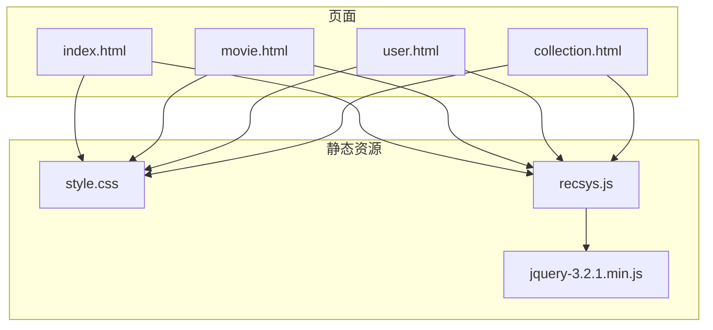
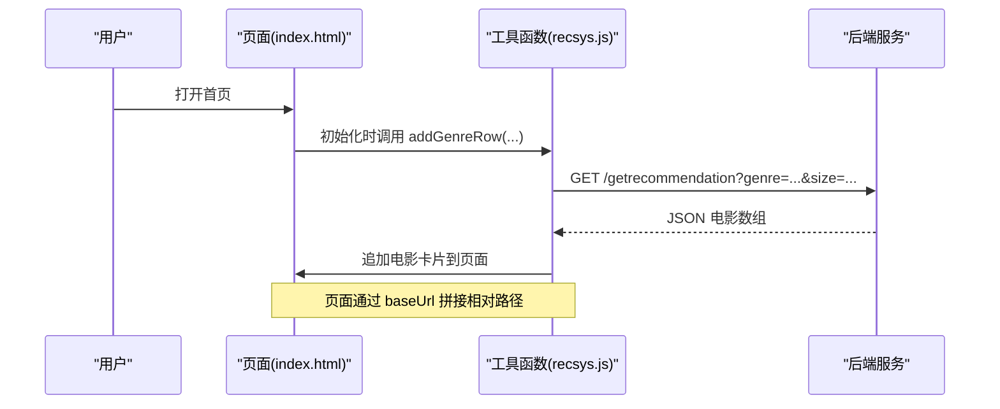
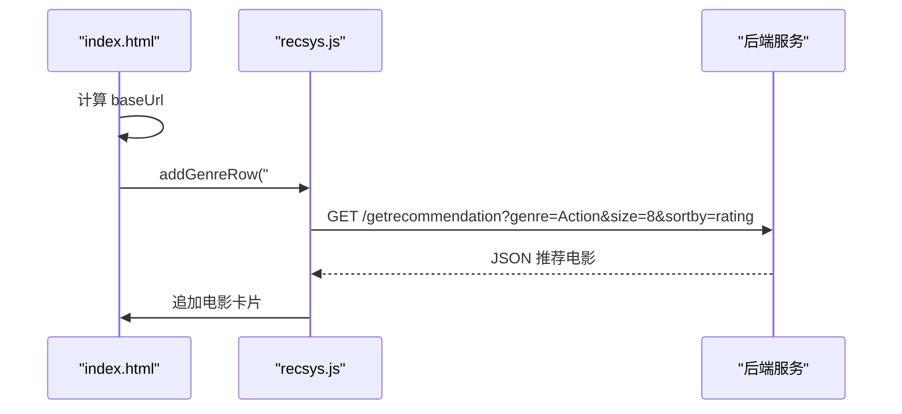
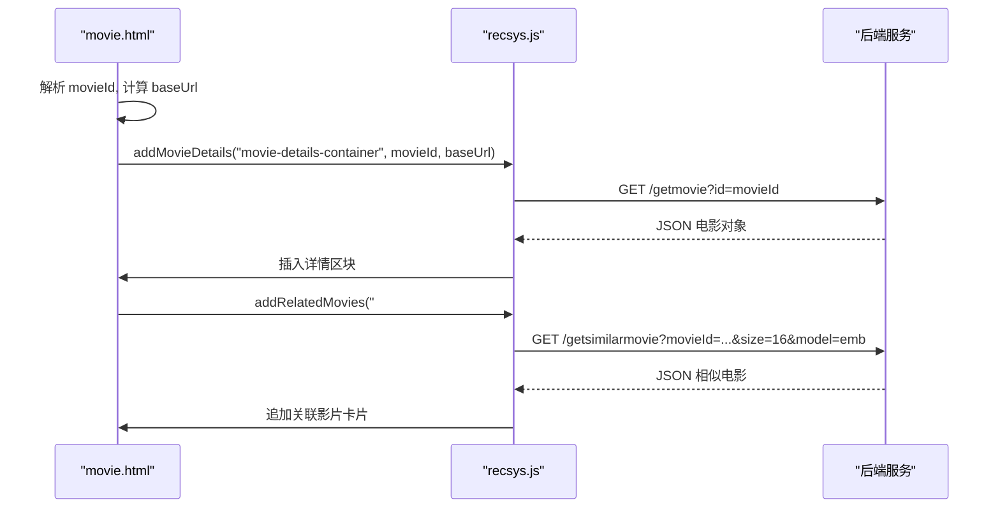
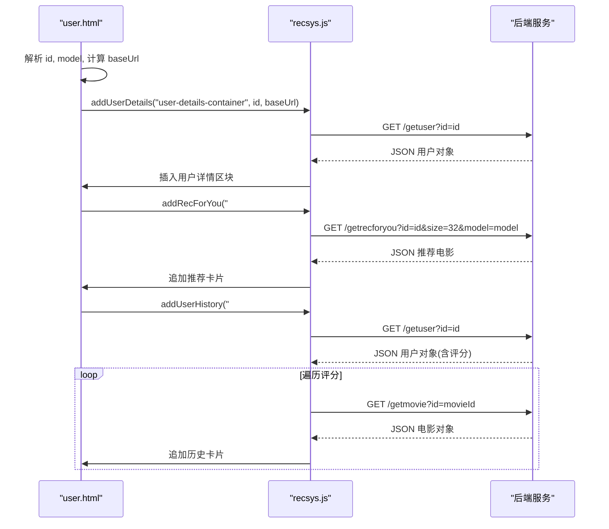
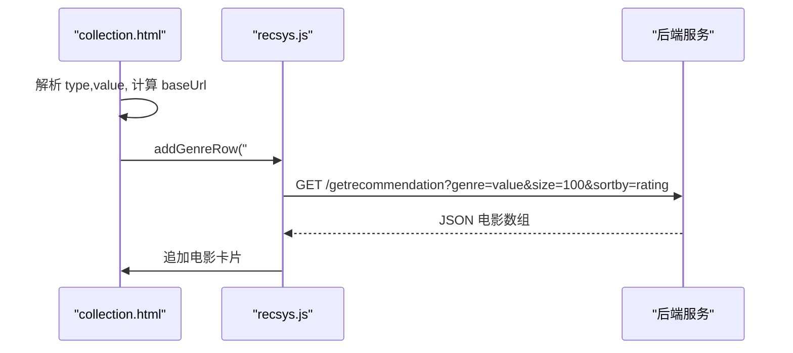
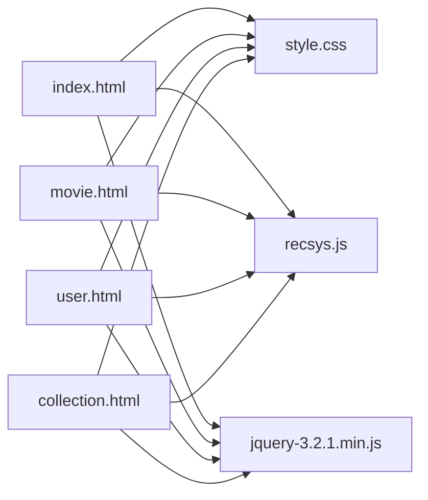

# 前端界面

<cite>
**本文引用的文件**
- [index.html](file://src/main/resources/webroot/index.html)
- [movie.html](file://src/main/resources/webroot/movie.html)
- [user.html](file://src/main/resources/webroot/user.html)
- [collection.html](file://src/main/resources/webroot/collection.html)
- [style.css](file://src/main/resources/webroot/css/style.css)
- [recsys.js](file://src/main/resources/webroot/js/recsys.js)
- [jquery-3.2.1.min.js](file://src/main/resources/webroot/js/jquery-3.2.1.min.js)
- [README.md](file://README.md)
</cite>

## 目录
1. [简介](#简介)
2. [项目结构](#项目结构)
3. [核心组件](#核心组件)
4. [架构总览](#架构总览)
5. [详细组件分析](#详细组件分析)
6. [依赖关系分析](#依赖关系分析)
7. [性能考虑](#性能考虑)
8. [故障排查指南](#故障排查指南)
9. [结论](#结论)
10. [附录](#附录)

## 简介
本文件面向前端开发者，系统性梳理 SparrowRecSys 的前端界面与交互实现，涵盖页面结构、JavaScript 交互逻辑、CSS 样式与响应式布局、前后端数据交互机制、组件复用与模块化设计思路，以及前端性能优化最佳实践。读者可据此理解并扩展首页、电影详情页、用户主页、收藏夹等页面的功能与布局。

## 项目结构
前端资源位于 webroot 目录，主要由 HTML 页面、CSS 样式表与 JavaScript 脚本组成。页面通过统一的头部与页脚模板复用，核心交互逻辑集中在 recsys.js 中，使用 jQuery 进行 DOM 操作与 AJAX 请求。

图表来源
- [index.html](file://src/main/resources/webroot/index.html#L1-L121)
- [movie.html](file://src/main/resources/webroot/movie.html#L1-L140)
- [user.html](file://src/main/resources/webroot/user.html#L1-L146)
- [collection.html](file://src/main/resources/webroot/collection.html#L1-L138)
- [style.css](file://src/main/resources/webroot/css/style.css#L1-L139)
- [recsys.js](file://src/main/resources/webroot/js/recsys.js#L1-L297)
- [jquery-3.2.1.min.js](file://src/main/resources/webroot/js/jquery-3.2.1.min.js)

章节来源
- [index.html](file://src/main/resources/webroot/index.html#L1-L121)
- [movie.html](file://src/main/resources/webroot/movie.html#L1-L140)
- [user.html](file://src/main/resources/webroot/user.html#L1-L146)
- [collection.html](file://src/main/resources/webroot/collection.html#L1-L138)
- [style.css](file://src/main/resources/webroot/css/style.css#L1-L139)
- [recsys.js](file://src/main/resources/webroot/js/recsys.js#L1-L297)

## 核心组件
- 页面骨架与导航
  - 统一的顶部导航栏包含 Logo、搜索框与下拉菜单区域；页脚包含版权与外部链接。
  - 各页面均引入相同的样式表与脚本，确保视觉与交互一致性。
- 推荐内容容器
  - 使用“电影行”组件展示推荐列表，支持横向滚动与动态追加内容。
- 详情区
  - 电影详情页与用户主页分别渲染对应实体的元信息与统计摘要。
- 收藏夹/分类页
  - 通过查询参数 type/value 动态加载指定类型的电影集合。

章节来源
- [index.html](file://src/main/resources/webroot/index.html#L20-L105)
- [movie.html](file://src/main/resources/webroot/movie.html#L29-L118)
- [user.html](file://src/main/resources/webroot/user.html#L29-L118)
- [collection.html](file://src/main/resources/webroot/collection.html#L29-L115)
- [style.css](file://src/main/resources/webroot/css/style.css#L119-L139)

## 架构总览
前端采用“页面 + 工具函数”的轻量架构：页面负责结构与占位，工具函数负责数据获取与 DOM 渲染。页面通过 URL 查询参数传递上下文（如用户 ID、电影 ID、类型与值），工具函数拼装 API 请求并回填页面。

图表来源
- [index.html](file://src/main/resources/webroot/index.html#L110-L121)
- [recsys.js](file://src/main/resources/webroot/js/recsys.js#L100-L107)

章节来源
- [index.html](file://src/main/resources/webroot/index.html#L110-L121)
- [recsys.js](file://src/main/resources/webroot/js/recsys.js#L100-L107)

## 详细组件分析

### 首页（index.html）
- 结构要点
  - 顶部导航与页脚复用，主体区域包含“反馈”引导与推荐内容容器。
  - 页面底部通过脚本调用工具函数，按类型加载多组推荐内容。
- 交互逻辑
  - 获取当前协议与主机，拼装 baseUrl。
  - 调用 addGenreRow(...) 为 Action、Romance、Thriller、Comedy、Drama、Adventure 等类型生成推荐行。
- 数据渲染
  - 工具函数通过 AJAX 获取推荐结果，逐条调用 appendMovie2Row(...) 渲染卡片。

图表来源
- [index.html](file://src/main/resources/webroot/index.html#L110-L121)
- [recsys.js](file://src/main/resources/webroot/js/recsys.js#L100-L107)

章节来源
- [index.html](file://src/main/resources/webroot/index.html#L110-L121)
- [recsys.js](file://src/main/resources/webroot/js/recsys.js#L100-L107)

### 电影详情页（movie.html）
- 结构要点
  - 顶部导航与页脚复用，详情区容器用于渲染电影元信息，下方推荐区用于展示关联影片。
- 交互逻辑
  - 解析 URL 查询参数 movieId，计算 baseUrl。
  - 调用 addMovieDetails(...) 渲染电影详情，addRelatedMovies(...) 加载关联影片。
- 数据渲染
  - 详情页通过 AJAX 获取电影对象，渲染标题、年份、评分、类型与高分评价者。
  - 关联影片通过相似度接口返回，逐条渲染卡片。

图表来源
- [movie.html](file://src/main/resources/webroot/movie.html#L120-L140)
- [recsys.js](file://src/main/resources/webroot/js/recsys.js#L181-L247)
- [recsys.js](file://src/main/resources/webroot/js/recsys.js#L109-L130)

章节来源
- [movie.html](file://src/main/resources/webroot/movie.html#L120-L140)
- [recsys.js](file://src/main/resources/webroot/js/recsys.js#L181-L247)
- [recsys.js](file://src/main/resources/webroot/js/recsys.js#L109-L130)

### 用户主页（user.html）
- 结构要点
  - 顶部导航与页脚复用，详情区容器用于渲染用户画像，下方两个推荐区分别展示“为你推荐”与“历史观看”。
- 交互逻辑
  - 解析 URL 查询参数 id 与 model，计算 baseUrl。
  - 调用 addUserDetails(...) 渲染用户信息，addRecForYou(...) 加载“为你推荐”，addUserHistory(...) 加载历史。
- 数据渲染
  - 用户详情通过 AJAX 获取用户对象，渲染评分统计与偏好概览。
  - “为你推荐”根据用户与模型参数请求推荐结果。
  - 历史记录遍历用户评分，逐条请求电影详情并渲染卡片。

图表来源
- [user.html](file://src/main/resources/webroot/user.html#L120-L146)
- [recsys.js](file://src/main/resources/webroot/js/recsys.js#L249-L291)
- [recsys.js](file://src/main/resources/webroot/js/recsys.js#L157-L178)
- [recsys.js](file://src/main/resources/webroot/js/recsys.js#L132-L155)

章节来源
- [user.html](file://src/main/resources/webroot/user.html#L120-L146)
- [recsys.js](file://src/main/resources/webroot/js/recsys.js#L249-L291)
- [recsys.js](file://src/main/resources/webroot/js/recsys.js#L157-L178)
- [recsys.js](file://src/main/resources/webroot/js/recsys.js#L132-L155)

### 收藏夹/分类页（collection.html）
- 结构要点
  - 顶部导航与页脚复用，主体区域用于展示指定类型的电影集合。
- 交互逻辑
  - 解析 URL 查询参数 type 与 value，计算 baseUrl。
  - 当 type=genre 时，调用 addGenreRow(...) 加载该类型全部电影。
- 数据渲染
  - 通过 AJAX 获取电影列表，逐条渲染卡片。

图表来源
- [collection.html](file://src/main/resources/webroot/collection.html#L117-L138)
- [recsys.js](file://src/main/resources/webroot/js/recsys.js#L100-L107)

章节来源
- [collection.html](file://src/main/resources/webroot/collection.html#L117-L138)
- [recsys.js](file://src/main/resources/webroot/js/recsys.js#L100-L107)

### JavaScript 交互逻辑与工具函数
- 工具函数职责
  - addRowFrame(...) / addRowFrameWithoutLink(...): 生成“电影行”容器框架。
  - addGenreRow(...): 按类型加载推荐并渲染卡片。
  - addRelatedMovies(...): 加载关联影片并渲染。
  - addUserHistory(...): 加载用户历史并渲染。
  - addRecForYou(...): 加载“为你推荐”并渲染。
  - addMovieDetails(...): 渲染电影详情。
  - addUserDetails(...): 渲染用户详情。
  - appendMovie2Row(...): 将单个电影卡片追加到指定容器。
- AJAX 与 DOM
  - 使用 jQuery 的 $.getJSON(...) 发起请求，成功回调中拼装 HTML 字符串并追加到页面。
  - 通过 $(pageId).prepend(...) 或 $('#'+rowId).append(...) 实现 DOM 插入。
- 事件绑定
  - 页面内未见显式的 click/change 等事件绑定；交互以页面初始化时的工具函数调用为主。

章节来源
- [recsys.js](file://src/main/resources/webroot/js/recsys.js#L68-L291)

### CSS 样式设计与响应式布局
- 视觉规范
  - 使用 .movie-card-md1、.movie-row、.movie-row-bounds 等类名定义电影卡片与横向滚动容器的布局与悬停效果。
  - 通过 .rating-or-prediction、.star-icon 等类名控制评分显示与交互状态。
- 响应式策略
  - 利用媒体查询针对不同屏幕宽度调整表格列、标签搜索框宽度、导航栏布局等。
  - 使用 Bootstrap 常用栅格类（.col-md-*）实现多列布局与断点切换。
- 可访问性
  - 提供 hover 状态下的可见性变化与过渡动画，增强交互反馈。

章节来源
- [style.css](file://src/main/resources/webroot/css/style.css#L1-L139)

### 前后端数据交互机制
- API 调用
  - 首页：/getrecommendation?genre=...&size=...&sortby=rating
  - 电影详情：/getmovie?id=...
  - 关联影片：/getsimilarmovie?movieId=...&size=...&model=...
  - 用户主页：/getuser?id=...，/getrecforyou?id=...&size=...&model=...
- 数据格式
  - 返回 JSON 对象，前端解析后渲染到页面。
- 错误处理
  - 代码中未见显式的错误捕获与降级提示；建议在生产环境增加 try/catch 与失败重试策略。

章节来源
- [recsys.js](file://src/main/resources/webroot/js/recsys.js#L100-L178)
- [recsys.js](file://src/main/resources/webroot/js/recsys.js#L181-L247)
- [recsys.js](file://src/main/resources/webroot/js/recsys.js#L249-L291)

### 页面组件的复用与模块化设计
- 复用策略
  - 顶部导航与页脚在各页面重复出现，建议抽象为独立片段并在构建阶段注入。
  - 电影卡片渲染逻辑集中于 appendMovie2Row(...)，便于跨页面复用。
- 模块化建议
  - 将工具函数拆分为模块（如 recsys-api.js、recsys-ui.js），按职责划分，提升可维护性。
  - 引入模板引擎或轻量组件库，减少字符串拼接与 DOM 操作复杂度。

章节来源
- [recsys.js](file://src/main/resources/webroot/js/recsys.js#L3-L65)
- [recsys.js](file://src/main/resources/webroot/js/recsys.js#L68-L98)

## 依赖关系分析
- 页面依赖
  - 所有页面均依赖 style.css 与 recsys.js；部分页面额外依赖 jquery-3.2.1.min.js。
- 工具函数依赖
  - recsys.js 依赖 jQuery 的 AJAX 与 DOM 操作能力。
- 外部依赖
  - 无第三方前端框架依赖，采用原生 DOM 与 jQuery。

图表来源
- [index.html](file://src/main/resources/webroot/index.html#L13-L16)
- [movie.html](file://src/main/resources/webroot/movie.html#L13-L16)
- [user.html](file://src/main/resources/webroot/user.html#L13-L16)
- [collection.html](file://src/main/resources/webroot/collection.html#L13-L16)
- [jquery-3.2.1.min.js](file://src/main/resources/webroot/js/jquery-3.2.1.min.js)
- [recsys.js](file://src/main/resources/webroot/js/recsys.js)
- [style.css](file://src/main/resources/webroot/css/style.css)

章节来源
- [index.html](file://src/main/resources/webroot/index.html#L13-L16)
- [movie.html](file://src/main/resources/webroot/movie.html#L13-L16)
- [user.html](file://src/main/resources/webroot/user.html#L13-L16)
- [collection.html](file://src/main/resources/webroot/collection.html#L13-L16)
- [jquery-3.2.1.min.js](file://src/main/resources/webroot/js/jquery-3.2.1.min.js)
- [recsys.js](file://src/main/resources/webroot/js/recsys.js)
- [style.css](file://src/main/resources/webroot/css/style.css)

## 性能考虑
- 资源压缩
  - 建议对 CSS 与 JS 进行压缩与合并，减少请求数量与体积。
- 缓存策略
  - 为静态资源设置合理的 Cache-Control 与 ETag，提升二次访问速度。
- 异步加载
  - 将非关键脚本（如统计或分析脚本）改为异步加载，避免阻塞首屏渲染。
- 图片优化
  - 为海报图提供多种尺寸与格式（如 WebP），按设备像素比选择加载，减少带宽占用。
- 分页与懒加载
  - 对长列表采用分页或虚拟滚动，降低一次性渲染压力。
- 错误与降级
  - 在 AJAX 失败时提供默认占位与重试按钮，改善用户体验。

## 故障排查指南
- 页面空白或样式错乱
  - 检查 style.css 是否正确加载，确认 baseUrl 拼接是否正确。
- 推荐内容不显示
  - 检查网络面板中的 AJAX 请求是否成功返回 JSON；确认后端接口可用。
- 电影/用户详情为空
  - 确认 URL 参数（如 movieId、userId）是否正确传入；检查后端是否返回对应实体。
- 交互无效
  - 确认 jQuery 已正确加载且版本兼容；检查页面中是否存在冲突的全局变量。

章节来源
- [recsys.js](file://src/main/resources/webroot/js/recsys.js#L100-L178)
- [recsys.js](file://src/main/resources/webroot/js/recsys.js#L181-L247)
- [recsys.js](file://src/main/resources/webroot/js/recsys.js#L249-L291)

## 结论
SparrowRecSys 前端以简洁的页面结构与统一的工具函数实现推荐系统的可视化展示。通过清晰的模块划分与一致的样式规范，开发者可以快速扩展新页面与新功能。建议在后续迭代中引入模板化与模块化方案、完善错误处理与性能优化策略，以进一步提升可维护性与用户体验。

## 附录
- 快速启动
  - 使用 IntelliJ 运行 RecSysServer，访问 http://localhost:6010/ 查看前端效果。
- 开发指南
  - 新增页面时，复用现有头部与页脚结构，按需引入 recsys.js 并在页面脚本中调用相应工具函数。
  - 修改样式时，优先使用现有类名与媒体查询，避免破坏整体风格。

章节来源
- [README.md](file://README.md#L13-L14)