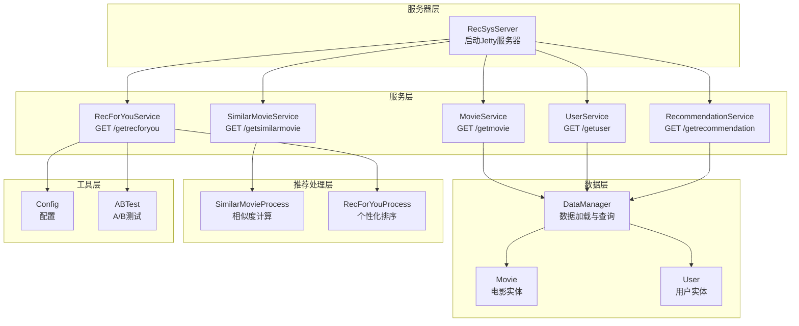
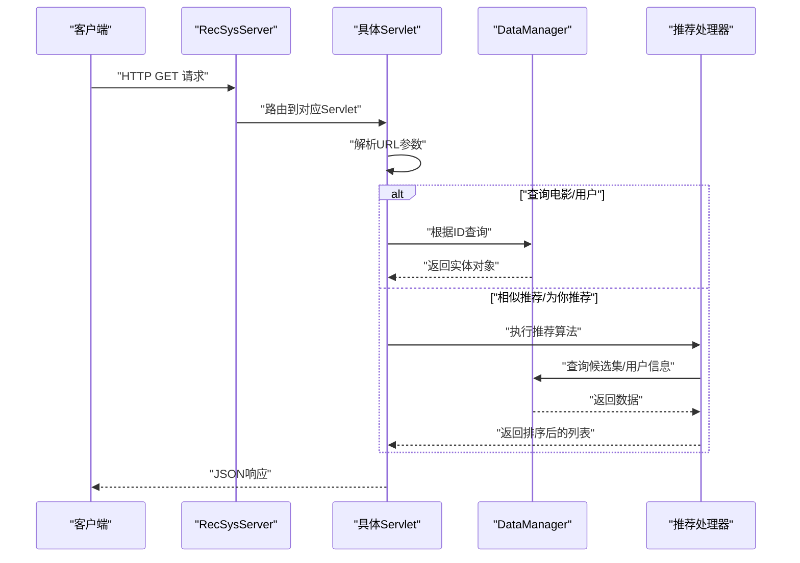
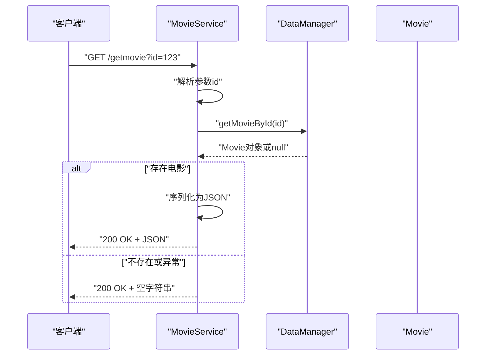
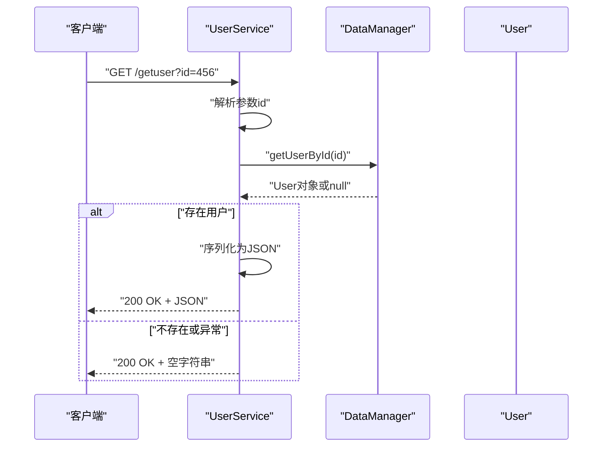
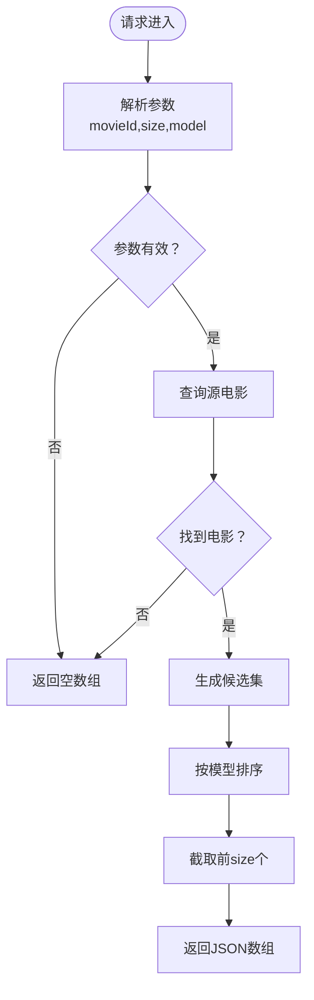
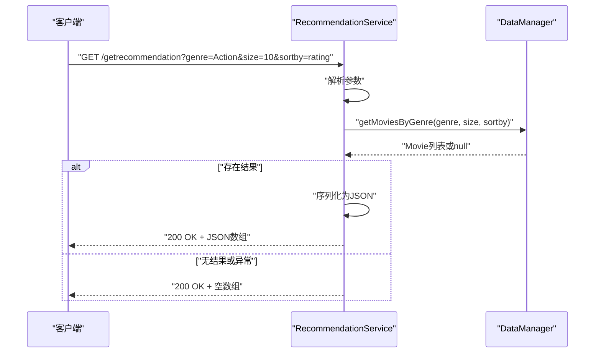
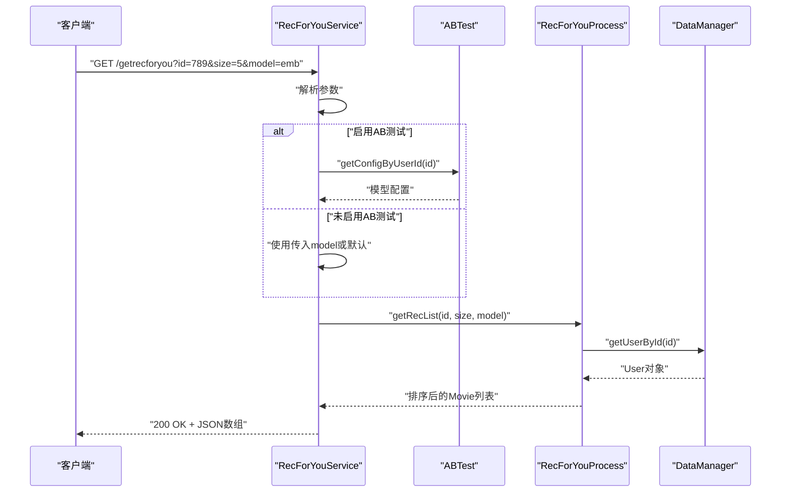
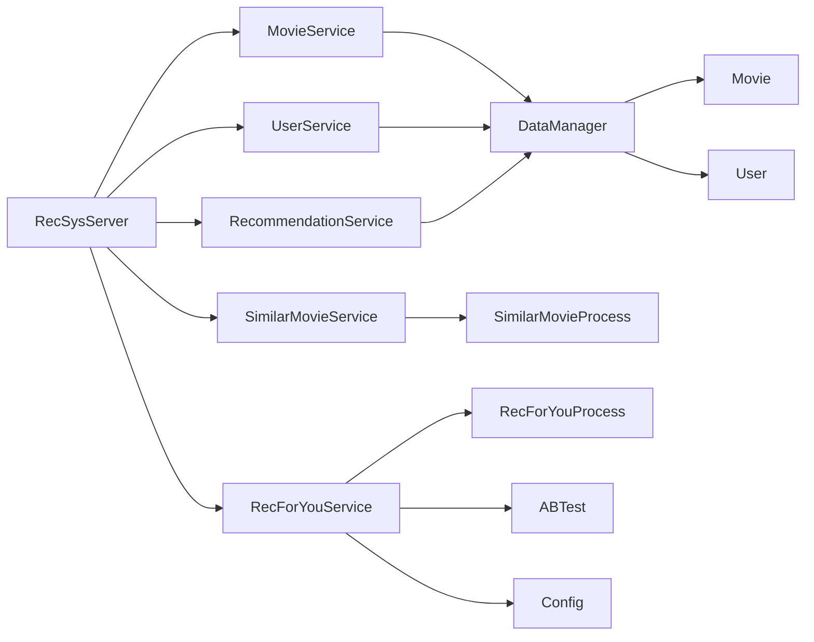

# API接口文档

<cite>
**本文档引用的文件**
- [RecSysServer.java](file://src/main/java/com/sparrowrecsys/online/RecSysServer.java)
- [MovieService.java](file://src/main/java/com/sparrowrecsys/online/service/MovieService.java)
- [UserService.java](file://src/main/java/com/sparrowrecsys/online/service/UserService.java)
- [SimilarMovieService.java](file://src/main/java/com/sparrowrecsys/online/service/SimilarMovieService.java)
- [RecommendationService.java](file://src/main/java/com/sparrowrecsys/online/service/RecommendationService.java)
- [RecForYouService.java](file://src/main/java/com/sparrowrecsys/online/service/RecForYouService.java)
- [DataManager.java](file://src/main/java/com/sparrowrecsys/online/datamanager/DataManager.java)
- [Movie.java](file://src/main/java/com/sparrowrecsys/online/datamanager/Movie.java)
- [User.java](file://src/main/java/com/sparrowrecsys/online/datamanager/User.java)
- [SimilarMovieProcess.java](file://src/main/java/com/sparrowrecsys/online/recprocess/SimilarMovieProcess.java)
- [RecForYouProcess.java](file://src/main/java/com/sparrowrecsys/online/recprocess/RecForYouProcess.java)
- [Config.java](file://src/main/java/com/sparrowrecsys/online/util/Config.java)
- [ABTest.java](file://src/main/java/com/sparrowrecsys/online/util/ABTest.java)
- [README.md](file://README.md)
</cite>

## 目录
1. [简介](#简介)
2. [项目结构](#项目结构)
3. [核心组件](#核心组件)
4. [架构总览](#架构总览)
5. [详细组件分析](#详细组件分析)
6. [依赖关系分析](#依赖关系分析)
7. [性能考虑](#性能考虑)
8. [故障排除指南](#故障排除指南)
9. [结论](#结论)
10. [附录](#附录)

## 简介
本API为在线推荐服务的RESTful接口集合，提供电影查询、用户查询、相似电影推荐、通用电影推荐以及“为你推荐”等功能。所有接口均通过HTTP GET方式访问，返回JSON格式数据。接口采用Jetty嵌入式服务器提供服务，默认监听端口为6010。

## 项目结构
- 在线服务入口：RecSysServer负责启动Jetty服务器并注册各Servlet端点
- 服务层：各功能端点对应独立的Servlet类，负责接收请求、参数解析、调用业务逻辑并返回JSON响应
- 数据管理层：DataManager统一管理电影、用户、评分、嵌入向量等数据的加载与查询
- 推荐处理层：SimilarMovieProcess和RecForYouProcess实现具体的推荐算法与排序逻辑
- 工具层：Config和ABTest提供配置与A/B测试支持

**图表来源**
- [RecSysServer.java](file://src/main/java/com/sparrowrecsys/online/RecSysServer.java#L65-L69)
- [MovieService.java](file://src/main/java/com/sparrowrecsys/online/service/MovieService.java#L16-L45)
- [UserService.java](file://src/main/java/com/sparrowrecsys/online/service/UserService.java#L15-L44)
- [SimilarMovieService.java](file://src/main/java/com/sparrowrecsys/online/service/SimilarMovieService.java#L16-L45)
- [RecommendationService.java](file://src/main/java/com/sparrowrecsys/online/service/RecommendationService.java#L18-L47)
- [RecForYouService.java](file://src/main/java/com/sparrowrecsys/online/service/RecForYouService.java#L20-L54)
- [DataManager.java](file://src/main/java/com/sparrowrecsys/online/datamanager/DataManager.java#L13-L37)
- [Movie.java](file://src/main/java/com/sparrowrecsys/online/datamanager/Movie.java#L15-L51)
- [User.java](file://src/main/java/com/sparrowrecsys/online/datamanager/User.java#L14-L35)
- [SimilarMovieProcess.java](file://src/main/java/com/sparrowrecsys/online/recprocess/SimilarMovieProcess.java#L11-L32)
- [RecForYouProcess.java](file://src/main/java/com/sparrowrecsys/online/recprocess/RecForYouProcess.java#L20-L60)
- [Config.java](file://src/main/java/com/sparrowrecsys/online/util/Config.java#L3-L13)
- [ABTest.java](file://src/main/java/com/sparrowrecsys/online/util/ABTest.java#L3-L27)

**章节来源**
- [RecSysServer.java](file://src/main/java/com/sparrowrecsys/online/RecSysServer.java#L1-L80)
- [README.md](file://README.md#L1-L57)

## 核心组件
- RecSysServer：应用入口，初始化Jetty服务器，注册各Servlet端点，加载样本数据，设置静态资源路径。
- 各服务Servlet：分别处理对应端点的GET请求，解析URL参数，调用数据层或推荐处理层，返回JSON响应。
- DataManager：单例数据管理器，负责从文件或Redis加载电影、用户、评分、嵌入向量等数据，提供查询接口。
- 推荐处理器：SimilarMovieProcess实现基于内容与嵌入的相似度计算；RecForYouProcess实现个性化排序与可选的TensorFlow Serving推理。
- 实体模型：Movie和User封装数据字段与序列化控制，支持JSON输出。

**章节来源**
- [RecSysServer.java](file://src/main/java/com/sparrowrecsys/online/RecSysServer.java#L27-L78)
- [DataManager.java](file://src/main/java/com/sparrowrecsys/online/datamanager/DataManager.java#L13-L294)
- [Movie.java](file://src/main/java/com/sparrowrecsys/online/datamanager/Movie.java#L15-L158)
- [User.java](file://src/main/java/com/sparrowrecsys/online/datamanager/User.java#L14-L115)

## 架构总览
API采用分层架构：服务器层负责网络通信与静态资源托管；服务层负责业务接口；数据层负责数据加载与查询；推荐处理层负责算法实现；工具层提供配置与A/B测试能力。所有接口均为同步阻塞式处理，返回JSON字符串。

**图表来源**
- [RecSysServer.java](file://src/main/java/com/sparrowrecsys/online/RecSysServer.java#L65-L69)
- [MovieService.java](file://src/main/java/com/sparrowrecsys/online/service/MovieService.java#L17-L44)
- [UserService.java](file://src/main/java/com/sparrowrecsys/online/service/UserService.java#L16-L43)
- [SimilarMovieService.java](file://src/main/java/com/sparrowrecsys/online/service/SimilarMovieService.java#L17-L44)
- [RecommendationService.java](file://src/main/java/com/sparrowrecsys/online/service/RecommendationService.java#L19-L46)
- [RecForYouService.java](file://src/main/java/com/sparrowrecsys/online/service/RecForYouService.java#L21-L53)
- [DataManager.java](file://src/main/java/com/sparrowrecsys/online/datamanager/DataManager.java#L285-L293)
- [SimilarMovieProcess.java](file://src/main/java/com/sparrowrecsys/online/recprocess/SimilarMovieProcess.java#L20-L32)
- [RecForYouProcess.java](file://src/main/java/com/sparrowrecsys/online/recprocess/RecForYouProcess.java#L29-L60)

## 详细组件分析

### /getmovie 接口
- 方法：GET
- URL：/getmovie
- 参数：
  - id：整数，电影ID（必填）
- 成功响应：返回Movie对象的JSON表示
- 错误处理：
  - 参数缺失或解析异常时返回空字符串
  - 未找到对应电影时返回空字符串
- 输入验证：
  - id必须为有效整数
- 输出数据结构：Movie对象字段（包含标题、年份、类型、评分统计、嵌入向量等）

**图表来源**
- [MovieService.java](file://src/main/java/com/sparrowrecsys/online/service/MovieService.java#L17-L44)
- [DataManager.java](file://src/main/java/com/sparrowrecsys/online/datamanager/DataManager.java#L285-L288)
- [Movie.java](file://src/main/java/com/sparrowrecsys/online/datamanager/Movie.java#L15-L51)

**章节来源**
- [MovieService.java](file://src/main/java/com/sparrowrecsys/online/service/MovieService.java#L16-L45)
- [DataManager.java](file://src/main/java/com/sparrowrecsys/online/datamanager/DataManager.java#L285-L288)
- [Movie.java](file://src/main/java/com/sparrowrecsys/online/datamanager/Movie.java#L15-L158)

### /getuser 接口
- 方法：GET
- URL：/getuser
- 参数：
  - id：整数，用户ID（必填）
- 成功响应：返回User对象的JSON表示
- 错误处理：
  - 参数缺失或解析异常时返回空字符串
  - 未找到对应用户时返回空字符串
- 输入验证：
  - id必须为有效整数
- 输出数据结构：User对象字段（包含评分统计、嵌入向量等）

**图表来源**
- [UserService.java](file://src/main/java/com/sparrowrecsys/online/service/UserService.java#L16-L43)
- [DataManager.java](file://src/main/java/com/sparrowrecsys/online/datamanager/DataManager.java#L290-L293)
- [User.java](file://src/main/java/com/sparrowrecsys/online/datamanager/User.java#L14-L115)

**章节来源**
- [UserService.java](file://src/main/java/com/sparrowrecsys/online/service/UserService.java#L15-L44)
- [DataManager.java](file://src/main/java/com/sparrowrecsys/online/datamanager/DataManager.java#L290-L293)
- [User.java](file://src/main/java/com/sparrowrecsys/online/datamanager/User.java#L14-L115)

### /getsimilarmovie 接口
- 方法：GET
- URL：/getsimilarmovie
- 参数：
  - movieId：整数，源电影ID（必填）
  - size：整数，返回数量（必填）
  - model：字符串，相似度模型（可选，默认按内容相似度；支持"emb"使用嵌入向量）
- 成功响应：返回Movie对象数组的JSON表示
- 错误处理：
  - 参数缺失或解析异常时返回空数组
  - 源电影不存在时返回空数组
- 输入验证：
  - movieId、size必须为有效整数
  - model可选，支持"emb"
- 输出数据结构：Movie对象数组，按相似度降序排列

**图表来源**
- [SimilarMovieService.java](file://src/main/java/com/sparrowrecsys/online/service/SimilarMovieService.java#L17-L44)
- [SimilarMovieProcess.java](file://src/main/java/com/sparrowrecsys/online/recprocess/SimilarMovieProcess.java#L20-L32)
- [SimilarMovieProcess.java](file://src/main/java/com/sparrowrecsys/online/recprocess/SimilarMovieProcess.java#L121-L137)

**章节来源**
- [SimilarMovieService.java](file://src/main/java/com/sparrowrecsys/online/service/SimilarMovieService.java#L16-L45)
- [SimilarMovieProcess.java](file://src/main/java/com/sparrowrecsys/online/recprocess/SimilarMovieProcess.java#L11-L174)

### /getrecommendation 接口
- 方法：GET
- URL：/getrecommendation
- 参数：
  - genre：字符串，电影类型（必填）
  - size：整数，返回数量（必填）
  - sortby：字符串，排序方式（可选，默认不排序；支持"rating"按评分排序、"releaseYear"按上映年份排序）
- 成功响应：返回Movie对象数组的JSON表示
- 错误处理：
  - 参数缺失或解析异常时返回空数组
  - 未找到对应类型电影时返回null
- 输入验证：
  - genre非空
  - size为有效整数
  - sortby可选，支持"rating"、"releaseYear"
- 输出数据结构：Movie对象数组，按指定方式排序

**图表来源**
- [RecommendationService.java](file://src/main/java/com/sparrowrecsys/online/service/RecommendationService.java#L19-L46)
- [DataManager.java](file://src/main/java/com/sparrowrecsys/online/datamanager/DataManager.java#L252-L268)

**章节来源**
- [RecommendationService.java](file://src/main/java/com/sparrowrecsys/online/service/RecommendationService.java#L18-L47)
- [DataManager.java](file://src/main/java/com/sparrowrecsys/online/datamanager/DataManager.java#L252-L268)

### /getrecforyou 接口
- 方法：GET
- URL：/getrecforyou
- 参数：
  - id：整数，用户ID（必填）
  - size：整数，返回数量（必填）
  - model：字符串，排序模型（可选，默认"emb"；支持"emb"嵌入相似度、"nerualcf"神经协同过滤）
- 成功响应：返回Movie对象数组的JSON表示
- 错误处理：
  - 参数缺失或解析异常时返回空数组
  - 用户不存在时返回空数组
- 输入验证：
  - id、size必须为有效整数
  - model可选，支持"emb"、"nerualcf"
- 输出数据结构：Movie对象数组，按模型打分降序排列
- A/B测试：当启用Config.IS_ENABLE_AB_TEST时，根据用户ID动态选择模型

**图表来源**
- [RecForYouService.java](file://src/main/java/com/sparrowrecsys/online/service/RecForYouService.java#L21-L53)
- [ABTest.java](file://src/main/java/com/sparrowrecsys/online/util/ABTest.java#L11-L26)
- [RecForYouProcess.java](file://src/main/java/com/sparrowrecsys/online/recprocess/RecForYouProcess.java#L29-L60)

**章节来源**
- [RecForYouService.java](file://src/main/java/com/sparrowrecsys/online/service/RecForYouService.java#L20-L54)
- [ABTest.java](file://src/main/java/com/sparrowrecsys/online/util/ABTest.java#L3-L27)
- [RecForYouProcess.java](file://src/main/java/com/sparrowrecsys/online/recprocess/RecForYouProcess.java#L20-L140)

## 依赖关系分析
- 服务器绑定：RecSysServer在上下文中注册五个Servlet，映射到对应URL路径
- 服务依赖：各Servlet依赖DataManager进行数据查询；相似推荐与“为你推荐”依赖对应的推荐处理器
- 配置依赖：RecForYouService依赖Config与ABTest进行A/B测试分流
- 数据模型：Movie与User作为JSON序列化的载体，包含评分列表的定制序列化

**图表来源**
- [RecSysServer.java](file://src/main/java/com/sparrowrecsys/online/RecSysServer.java#L65-L69)
- [MovieService.java](file://src/main/java/com/sparrowrecsys/online/service/MovieService.java#L16-L45)
- [UserService.java](file://src/main/java/com/sparrowrecsys/online/service/UserService.java#L15-L44)
- [SimilarMovieService.java](file://src/main/java/com/sparrowrecsys/online/service/SimilarMovieService.java#L16-L45)
- [RecommendationService.java](file://src/main/java/com/sparrowrecsys/online/service/RecommendationService.java#L18-L47)
- [RecForYouService.java](file://src/main/java/com/sparrowrecsys/online/service/RecForYouService.java#L20-L54)
- [DataManager.java](file://src/main/java/com/sparrowrecsys/online/datamanager/DataManager.java#L13-L37)
- [SimilarMovieProcess.java](file://src/main/java/com/sparrowrecsys/online/recprocess/SimilarMovieProcess.java#L11-L32)
- [RecForYouProcess.java](file://src/main/java/com/sparrowrecsys/online/recprocess/RecForYouProcess.java#L20-L60)
- [ABTest.java](file://src/main/java/com/sparrowrecsys/online/util/ABTest.java#L3-L27)
- [Config.java](file://src/main/java/com/sparrowrecsys/online/util/Config.java#L3-L13)

**章节来源**
- [RecSysServer.java](file://src/main/java/com/sparrowrecsys/online/RecSysServer.java#L65-L69)
- [DataManager.java](file://src/main/java/com/sparrowrecsys/online/datamanager/DataManager.java#L13-L37)

## 性能考虑
- 同步阻塞：所有Servlet采用同步阻塞处理，适合低并发场景；高并发建议引入异步或连接池优化
- 数据加载：DataManager在启动时一次性加载数据至内存，查询O(1)，但启动耗时较长
- 排序复杂度：相似度计算与排序为O(n log n)，n为候选集大小；可通过减少候选集规模或缓存中间结果优化
- 嵌入向量：嵌入相似度计算依赖向量相似度函数，建议确保向量维度合理且预归一化
- A/B测试：ABTest基于用户ID哈希分流，简单高效，注意流量分配比例
- TensorFlow Serving：神经协同过滤推理需要外部服务，需关注网络延迟与失败重试

[本节为通用性能指导，无需特定文件来源]

## 故障排除指南
- 空响应问题：
  - 检查URL参数是否正确传递（id、movieId、size、genre、model等）
  - 确认数据已正确加载（启动日志中包含数据加载完成提示）
- 404/路由错误：
  - 确认请求路径与注册的Servlet路径一致
  - 检查服务器是否正常启动（控制台输出"RecSys Server has started."）
- 排序异常：
  - 确认sortby参数值为"rating"或"releaseYear"
  - 检查model参数值为"emb"或"nerualcf"
- A/B测试未生效：
  - 确认Config.IS_ENABLE_AB_TEST为true
  - 检查用户ID是否为空
- TensorFlow Serving错误：
  - 确认外部服务地址与端口正确
  - 检查请求体格式与实例字段

**章节来源**
- [RecSysServer.java](file://src/main/java/com/sparrowrecsys/online/RecSysServer.java#L73-L78)
- [RecForYouService.java](file://src/main/java/com/sparrowrecsys/online/service/RecForYouService.java#L37-L39)
- [RecForYouProcess.java](file://src/main/java/com/sparrowrecsys/online/recprocess/RecForYouProcess.java#L130-L138)

## 结论
该API提供了完整的电影与用户信息服务，涵盖相似度推荐与个性化推荐两大核心能力。接口设计简洁，参数明确，响应标准化为JSON。通过配置与A/B测试机制，可灵活扩展推荐策略。建议在生产环境中结合异步处理、缓存与限流策略以提升性能与稳定性。

[本节为总结性内容，无需特定文件来源]

## 附录

### 安全考虑
- CORS：所有Servlet设置"Access-Control-Allow-Origin: *"，便于跨域访问，生产环境建议限制具体域名
- 认证授权：当前未实现认证授权机制，建议在网关或反向代理层添加鉴权
- 参数校验：仅做基本类型检查，建议增加更严格的参数校验与白名单机制

**章节来源**
- [MovieService.java](file://src/main/java/com/sparrowrecsys/online/service/MovieService.java#L23-L23)
- [UserService.java](file://src/main/java/com/sparrowrecsys/online/service/UserService.java#L22-L22)
- [SimilarMovieService.java](file://src/main/java/com/sparrowrecsys/online/service/SimilarMovieService.java#L23-L23)
- [RecommendationService.java](file://src/main/java/com/sparrowrecsys/online/service/RecommendationService.java#L26-L26)
- [RecForYouService.java](file://src/main/java/com/sparrowrecsys/online/service/RecForYouService.java#L28-L28)

### 限流策略
- 当前未实现内置限流机制，建议在网关或反向代理层配置QPS限制、IP白名单与熔断保护
- 对于"/getrecforyou"等计算密集型接口，建议单独限流

[本节为通用指导，无需特定文件来源]

### 版本管理
- 当前未实现API版本号管理，建议在URL中加入版本前缀（如/v1/getmovie）或通过请求头区分版本

[本节为通用指导，无需特定文件来源]

### 客户端集成指南
- 基础URL：http://localhost:6010
- 建议使用HTTP客户端库发送GET请求，设置Accept: application/json
- 处理空响应：当返回空字符串或空数组时，视为无匹配结果
- 错误码：所有接口返回200状态码，错误通过空响应标识

**章节来源**
- [RecSysServer.java](file://src/main/java/com/sparrowrecsys/online/RecSysServer.java#L25-L32)

### SDK使用示例
- Java示例：使用HttpURLConnection或Apache HttpClient发送GET请求，解析JSON响应
- JavaScript示例：使用fetch或axios发送GET请求，解析JSON响应
- 注意：示例代码请参考各语言HTTP客户端库的官方文档

[本节为通用指导，无需特定文件来源]

### 调试技巧
- 查看服务器启动日志，确认数据加载完成
- 使用curl或浏览器直接访问接口URL进行快速验证
- 对于"/getrecforyou"，可临时设置Config.IS_ENABLE_AB_TEST=false以固定模型

**章节来源**
- [RecSysServer.java](file://src/main/java/com/sparrowrecsys/online/RecSysServer.java#L49-L54)
- [RecForYouService.java](file://src/main/java/com/sparrowrecsys/online/service/RecForYouService.java#L37-L39)