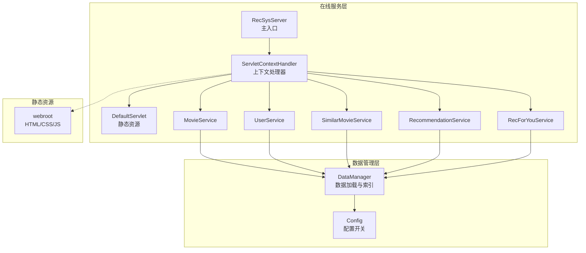
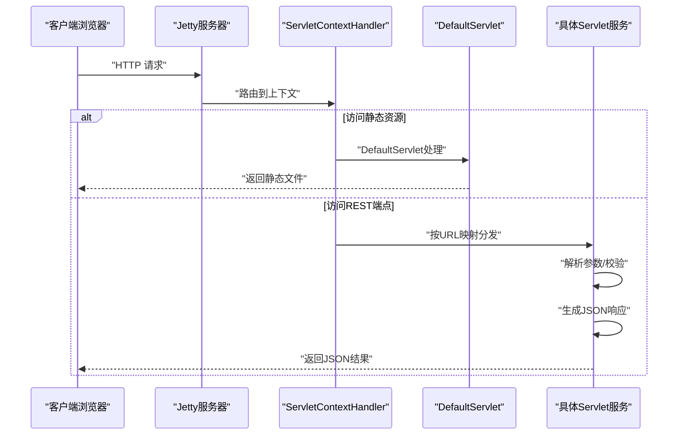
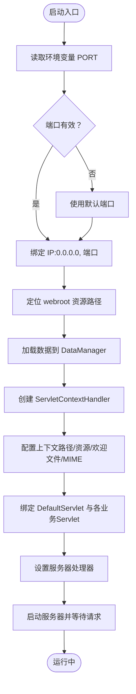
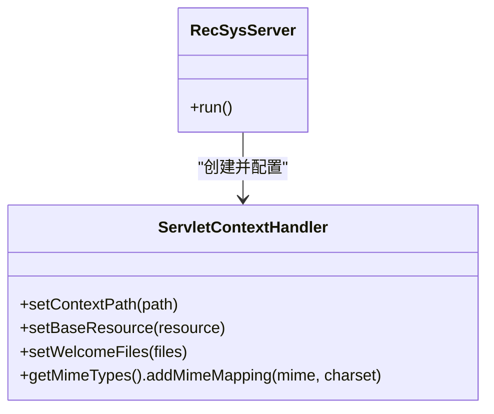
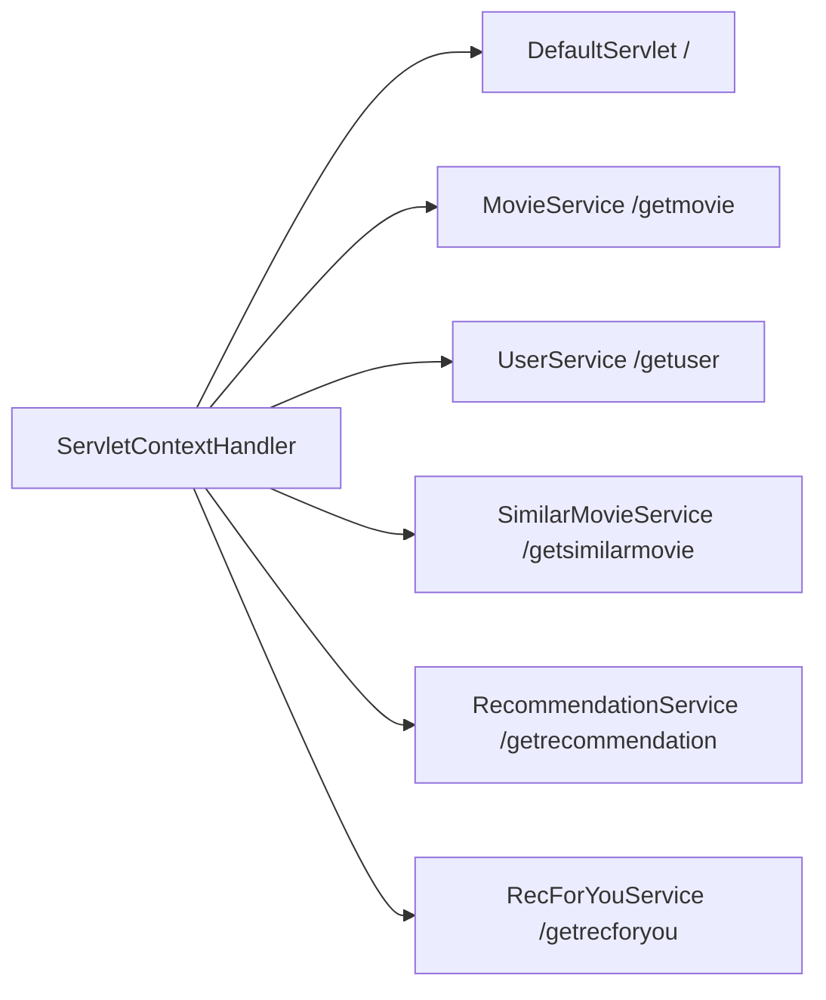
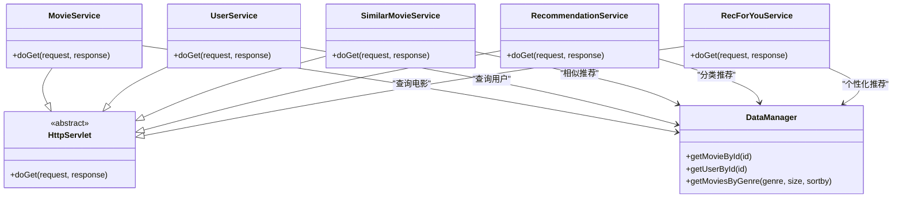
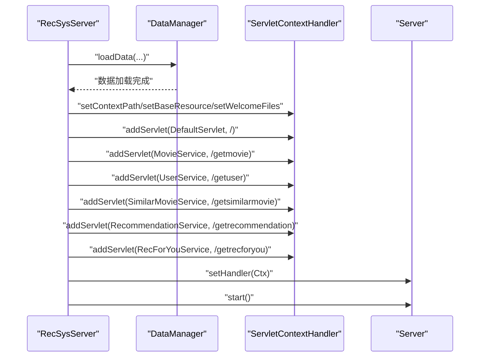
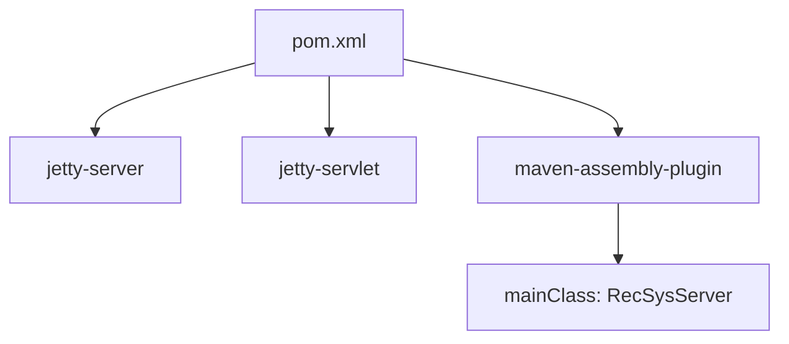

# Jetty服务器配置

<cite>
**本文档引用的文件**
- [RecSysServer.java](file://src/main/java/com/sparrowrecsys/online/RecSysServer.java)
- [MovieService.java](file://src/main/java/com/sparrowrecsys/online/service/MovieService.java)
- [UserService.java](file://src/main/java/com/sparrowrecsys/online/service/UserService.java)
- [RecommendationService.java](file://src/main/java/com/sparrowrecsys/online/service/RecommendationService.java)
- [SimilarMovieService.java](file://src/main/java/com/sparrowrecsys/online/service/SimilarMovieService.java)
- [RecForYouService.java](file://src/main/java/com/sparrowrecsys/online/service/RecForYouService.java)
- [DataManager.java](file://src/main/java/com/sparrowrecsys/online/datamanager/DataManager.java)
- [Config.java](file://src/main/java/com/sparrowrecsys/online/util/Config.java)
- [index.html](file://src/main/resources/webroot/index.html)
- [movie.html](file://src/main/resources/webroot/movie.html)
- [user.html](file://src/main/resources/webroot/user.html)
- [recsys.js](file://src/main/resources/webroot/js/recsys.js)
- [pom.xml](file://pom.xml)
- [README.md](file://README.md)
</cite>

## 目录
1. [简介](#简介)
2. [项目结构](#项目结构)
3. [核心组件](#核心组件)
4. [架构概览](#架构概览)
5. [详细组件分析](#详细组件分析)
6. [依赖关系分析](#依赖关系分析)
7. [性能考虑](#性能考虑)
8. [故障排除指南](#故障排除指南)
9. [结论](#结论)
10. [附录](#附录)

## 简介
本文件详细阐述了基于Jetty的Web服务器在RecSysServer中的实现与配置。内容涵盖服务器初始化、端口配置、IP地址绑定、环境变量处理、ServletContextHandler配置（上下文路径、静态资源映射、MIME类型、欢迎文件）、Servlet绑定机制（将服务类映射到URL端点）、服务器启动流程（数据加载、上下文配置、启动顺序）以及生产环境部署建议。通过结合源码分析与可视化图表，帮助开发者快速理解并定制服务器配置。

## 项目结构
该项目采用多模块混合架构，包含离线（Spark、TensorFlow）、近线（Flink）与在线（Jetty）服务层。在线推荐服务的核心入口为RecSysServer，负责启动Jetty服务器并提供REST风格的推荐接口。

**图表来源**
- [RecSysServer.java](file://src/main/java/com/sparrowrecsys/online/RecSysServer.java#L27-L78)
- [MovieService.java](file://src/main/java/com/sparrowrecsys/online/service/MovieService.java#L16-L45)
- [DataManager.java](file://src/main/java/com/sparrowrecsys/online/datamanager/DataManager.java#L13-L50)

**章节来源**
- [RecSysServer.java](file://src/main/java/com/sparrowrecsys/online/RecSysServer.java#L1-L80)
- [pom.xml](file://pom.xml#L60-L75)

## 核心组件
- RecSysServer：应用主入口，负责读取环境变量、创建Jetty服务器、配置ServletContextHandler、绑定Servlet、加载数据并启动服务器。
- Servlet服务类：各业务服务通过继承HttpServlet暴露REST接口，参数从URL查询字符串解析，返回JSON响应。
- DataManager：单例数据管理器，负责加载电影、用户、评分、嵌入向量等数据，并维护反向索引以支持快速查询。
- Config：运行时配置开关，控制数据源（文件或Redis）与AB测试开关等。

**章节来源**
- [RecSysServer.java](file://src/main/java/com/sparrowrecsys/online/RecSysServer.java#L24-L78)
- [MovieService.java](file://src/main/java/com/sparrowrecsys/online/service/MovieService.java#L16-L45)
- [DataManager.java](file://src/main/java/com/sparrowrecsys/online/datamanager/DataManager.java#L13-L50)
- [Config.java](file://src/main/java/com/sparrowrecsys/online/util/Config.java#L3-L14)

## 架构概览
下图展示了从客户端请求到服务端处理再到数据返回的完整链路，包括静态资源访问与REST API调用。

**图表来源**
- [RecSysServer.java](file://src/main/java/com/sparrowrecsys/online/RecSysServer.java#L57-L72)
- [MovieService.java](file://src/main/java/com/sparrowrecsys/online/service/MovieService.java#L17-L44)

## 详细组件分析

### 服务器初始化与启动流程
- 环境变量与端口：优先读取环境变量PORT，若无效则使用默认端口；绑定IP为0.0.0.0，允许外网访问。
- 静态资源定位：通过类路径定位webroot目录，确保在打包后仍可正确访问。
- 数据加载：在启动前加载电影、链接、评分、嵌入向量等数据，构建内存索引。
- 上下文配置：设置根上下文路径、基础资源路径、欢迎文件与MIME映射。
- Servlet绑定：注册DefaultServlet用于静态资源，以及各业务服务的URL映射。
- 启动与监听：设置处理器并启动服务器，等待请求。

**图表来源**
- [RecSysServer.java](file://src/main/java/com/sparrowrecsys/online/RecSysServer.java#L27-L78)

**章节来源**
- [RecSysServer.java](file://src/main/java/com/sparrowrecsys/online/RecSysServer.java#L24-L78)

### ServletContextHandler配置详解
- 上下文路径："/" 表示根路径。
- 基础资源：指向webroot目录，使静态文件可被DefaultServlet访问。
- 欢迎文件：设置为index.html，作为根路径的默认页面。
- MIME类型：添加"text/plain"的charset映射，确保文本文件正确编码。

**图表来源**
- [RecSysServer.java](file://src/main/java/com/sparrowrecsys/online/RecSysServer.java#L57-L62)

**章节来源**
- [RecSysServer.java](file://src/main/java/com/sparrowrecsys/online/RecSysServer.java#L57-L62)

### Servlet绑定机制与URL映射
- DefaultServlet：处理静态资源请求，映射到根路径"/"。
- 业务服务映射：
  - /getmovie → MovieService
  - /getuser → UserService
  - /getsimilarmovie → SimilarMovieService
  - /getrecommendation → RecommendationService
  - /getrecforyou → RecForYouService

**图表来源**
- [RecSysServer.java](file://src/main/java/com/sparrowrecsys/online/RecSysServer.java#L64-L69)

**章节来源**
- [RecSysServer.java](file://src/main/java/com/sparrowrecsys/online/RecSysServer.java#L64-L69)

### 业务服务实现模式
所有服务均继承HttpServlet，统一设置响应头（JSON、字符集、跨域），从URL参数解析业务参数，调用DataManager或相关处理流程获取数据，最后序列化为JSON返回。

**图表来源**
- [MovieService.java](file://src/main/java/com/sparrowrecsys/online/service/MovieService.java#L16-L45)
- [UserService.java](file://src/main/java/com/sparrowrecsys/online/service/UserService.java#L15-L45)
- [SimilarMovieService.java](file://src/main/java/com/sparrowrecsys/online/service/SimilarMovieService.java#L16-L46)
- [RecommendationService.java](file://src/main/java/com/sparrowrecsys/online/service/RecommendationService.java#L18-L48)
- [RecForYouService.java](file://src/main/java/com/sparrowrecsys/online/service/RecForYouService.java#L20-L55)
- [DataManager.java](file://src/main/java/com/sparrowrecsys/online/datamanager/DataManager.java#L285-L293)

**章节来源**
- [MovieService.java](file://src/main/java/com/sparrowrecsys/online/service/MovieService.java#L16-L45)
- [UserService.java](file://src/main/java/com/sparrowrecsys/online/service/UserService.java#L15-L45)
- [SimilarMovieService.java](file://src/main/java/com/sparrowrecsys/online/service/SimilarMovieService.java#L16-L46)
- [RecommendationService.java](file://src/main/java/com/sparrowrecsys/online/service/RecommendationService.java#L18-L48)
- [RecForYouService.java](file://src/main/java/com/sparrowrecsys/online/service/RecForYouService.java#L20-L55)

### 数据加载与上下文配置顺序
- 服务器启动前必须完成数据加载，以保证后续请求能直接命中内存数据结构。
- 上下文配置需在服务器启动之前完成，确保静态资源与Servlet映射生效。

**图表来源**
- [RecSysServer.java](file://src/main/java/com/sparrowrecsys/online/RecSysServer.java#L49-L72)
- [DataManager.java](file://src/main/java/com/sparrowrecsys/online/datamanager/DataManager.java#L40-L50)

**章节来源**
- [RecSysServer.java](file://src/main/java/com/sparrowrecsys/online/RecSysServer.java#L49-L72)
- [DataManager.java](file://src/main/java/com/sparrowrecsys/online/datamanager/DataManager.java#L40-L50)

## 依赖关系分析
- Jetty依赖：使用jetty-server与jetty-servlet，版本为9.4.17.v20190418。
- 打包方式：通过maven-assembly-plugin生成包含所有依赖的可执行JAR，主类为RecSysServer。
- 运行要求：Java 8，确保兼容性与性能。

**图表来源**
- [pom.xml](file://pom.xml#L60-L75)
- [pom.xml](file://pom.xml#L32-L56)

**章节来源**
- [pom.xml](file://pom.xml#L60-L75)
- [pom.xml](file://pom.xml#L32-L56)

## 性能考虑
- 静态资源优化：通过ServletContextHandler的baseResource指向webroot，减少文件系统查找开销。
- JSON序列化：使用Jackson ObjectMapper进行对象到JSON的转换，注意在高并发场景下的序列化性能与内存占用。
- 数据预加载：在启动阶段完成数据加载与索引构建，避免首次请求的冷启动延迟。
- CORS与字符集：统一设置Access-Control-Allow-Origin与字符集，减少浏览器兼容性问题。
- 端口与绑定：使用0.0.0.0绑定允许外部访问，生产环境建议结合防火墙与反向代理限制访问范围。

[本节为通用指导，无需特定文件引用]

## 故障排除指南
- 端口冲突：若PORT环境变量无效或被占用，服务器将使用默认端口。可通过检查环境变量或修改启动脚本解决。
- webroot定位失败：若无法确定webroot路径，将抛出异常。请确认资源打包位置与类路径配置。
- 数据加载异常：若数据文件缺失或格式不正确，可能导致加载失败。请核对数据文件路径与格式。
- CORS问题：若前端跨域请求失败，请检查Access-Control-Allow-Origin设置与浏览器安全策略。
- 业务参数错误：若URL参数为空或类型不匹配，服务会捕获异常并返回空结果。请检查前端调用参数。

**章节来源**
- [RecSysServer.java](file://src/main/java/com/sparrowrecsys/online/RecSysServer.java#L30-L47)
- [MovieService.java](file://src/main/java/com/sparrowrecsys/online/service/MovieService.java#L40-L44)
- [UserService.java](file://src/main/java/com/sparrowrecsys/online/service/UserService.java#L39-L43)
- [RecommendationService.java](file://src/main/java/com/sparrowrecsys/online/service/RecommendationService.java#L42-L46)
- [SimilarMovieService.java](file://src/main/java/com/sparrowrecsys/online/service/SimilarMovieService.java#L40-L44)
- [RecForYouService.java](file://src/main/java/com/sparrowrecsys/online/service/RecForYouService.java#L49-L53)

## 结论
本项目通过简洁的Jetty配置实现了在线推荐服务的快速启动与稳定运行。RecSysServer承担了服务器初始化、资源定位、数据加载与上下文配置的职责，各业务服务通过清晰的URL映射提供REST能力。结合本文档的配置说明与最佳实践，开发者可以轻松定制端口、静态资源、MIME类型与欢迎文件，并在生产环境中进行安全与性能优化。

[本节为总结，无需特定文件引用]

## 附录

### 端口与环境变量配置
- 默认端口：6010
- 环境变量：PORT（可覆盖默认端口）
- 绑定地址：0.0.0.0（允许外网访问）

**章节来源**
- [RecSysServer.java](file://src/main/java/com/sparrowrecsys/online/RecSysServer.java#L24-L36)

### 静态资源与欢迎文件
- 静态资源根：webroot目录
- 欢迎文件：index.html
- MIME类型：text/plain;charset=utf-8

**章节来源**
- [RecSysServer.java](file://src/main/java/com/sparrowrecsys/online/RecSysServer.java#L38-L62)
- [index.html](file://src/main/resources/webroot/index.html#L1-L121)

### 业务端点与参数
- /getmovie?id={整数}
- /getuser?id={整数}
- /getsimilarmovie?movieId={整数}&size={整数}&model={字符串}
- /getrecommendation?genre={字符串}&size={整数}&sortby={字符串}
- /getrecforyou?id={整数}&size={整数}&model={字符串}

**章节来源**
- [MovieService.java](file://src/main/java/com/sparrowrecsys/online/service/MovieService.java#L25-L29)
- [UserService.java](file://src/main/java/com/sparrowrecsys/online/service/UserService.java#L24-L28)
- [SimilarMovieService.java](file://src/main/java/com/sparrowrecsys/online/service/SimilarMovieService.java#L25-L30)
- [RecommendationService.java](file://src/main/java/com/sparrowrecsys/online/service/RecommendationService.java#L28-L33)
- [RecForYouService.java](file://src/main/java/com/sparrowrecsys/online/service/RecForYouService.java#L30-L35)

### 生产环境部署建议
- 使用反向代理（如Nginx）统一入口与SSL终止。
- 将PORT环境变量与容器编排工具（如Docker/Kubernetes）集成。
- 在启动脚本中设置JVM参数以优化GC与堆大小。
- 对静态资源启用缓存与压缩（Gzip/Brotli）提升加载速度。
- 结合监控与日志系统跟踪请求量、错误率与响应时间。

[本节为通用指导，无需特定文件引用]