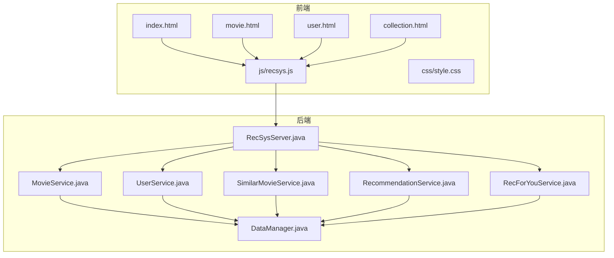
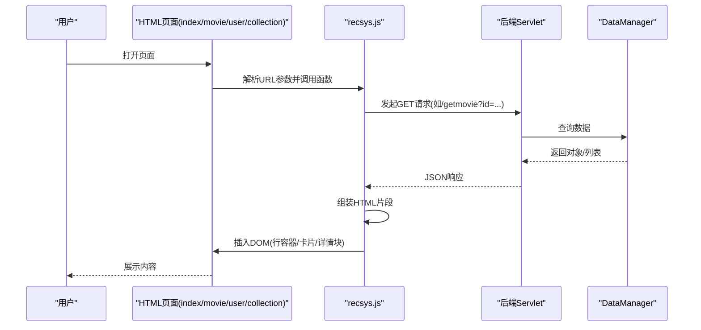
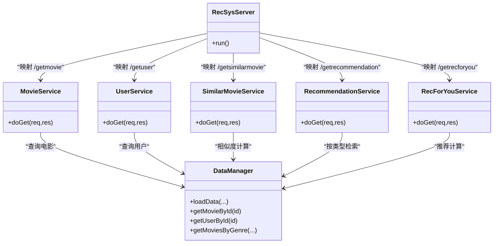
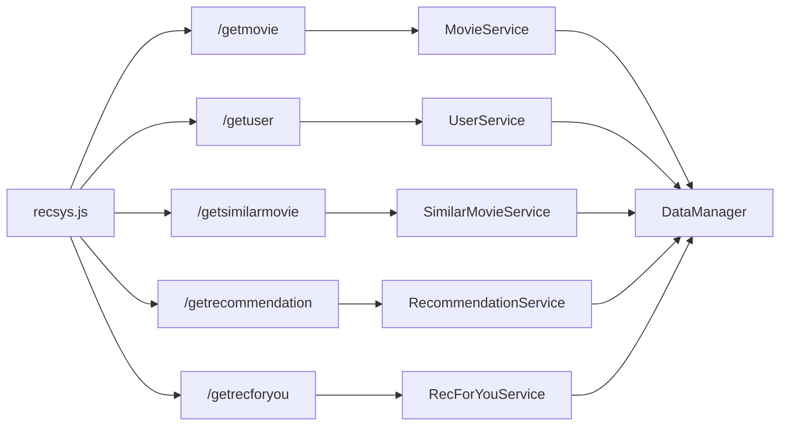

# 前端集成

<cite>
**本文引用的文件**
- [index.html](file://src/main/resources/webroot/index.html)
- [movie.html](file://src/main/resources/webroot/movie.html)
- [user.html](file://src/main/resources/webroot/user.html)
- [collection.html](file://src/main/resources/webroot/collection.html)
- [recsys.js](file://src/main/resources/webroot/js/recsys.js)
- [style.css](file://src/main/resources/webroot/css/style.css)
- [RecSysServer.java](file://src/main/java/com/sparrowrecsys/online/RecSysServer.java)
- [MovieService.java](file://src/main/java/com/sparrowrecsys/online/service/MovieService.java)
- [UserService.java](file://src/main/java/com/sparrowrecsys/online/service/UserService.java)
- [SimilarMovieService.java](file://src/main/java/com/sparrowrecsys/online/service/SimilarMovieService.java)
- [RecommendationService.java](file://src/main/java/com/sparrowrecsys/online/service/RecommendationService.java)
- [RecForYouService.java](file://src/main/java/com/sparrowrecsys/online/service/RecForYouService.java)
- [DataManager.java](file://src/main/java/com/sparrowrecsys/online/datamanager/DataManager.java)
- [README.md](file://README.md)
</cite>

## 目录
1. [简介](#简介)
2. [项目结构](#项目结构)
3. [核心组件](#核心组件)
4. [架构总览](#架构总览)
5. [详细组件分析](#详细组件分析)
6. [依赖关系分析](#依赖关系分析)
7. [性能考虑](#性能考虑)
8. [故障排查指南](#故障排查指南)
9. [结论](#结论)
10. [附录](#附录)

## 简介
本文件面向前端开发者，系统性阐述该推荐系统前端与后端API的集成方式，涵盖以下主题：
- 前端JavaScript与后端REST API的交互机制（AJAX请求、数据渲染、UI更新）
- HTML页面结构与CSS样式设计（主页、电影详情页、用户页、分类页）
- 前端路由与参数解析（查询字符串解析、页面跳转）
- 状态管理与用户体验优化策略（加载提示、错误兜底、图片占位）
- 最佳实践（异步处理、错误处理、性能优化）
- 完整集成示例与调试方法

## 项目结构
前端静态资源位于 webroot 目录，包含HTML页面、CSS样式与JS脚本；后端通过嵌入式Jetty对外暴露REST接口。

图表来源
- [index.html](file://src/main/resources/webroot/index.html#L1-L121)
- [movie.html](file://src/main/resources/webroot/movie.html#L1-L140)
- [user.html](file://src/main/resources/webroot/user.html#L1-L146)
- [collection.html](file://src/main/resources/webroot/collection.html#L1-L138)
- [recsys.js](file://src/main/resources/webroot/js/recsys.js#L1-L297)
- [style.css](file://src/main/resources/webroot/css/style.css#L1-L139)
- [RecSysServer.java](file://src/main/java/com/sparrowrecsys/online/RecSysServer.java#L1-L79)
- [MovieService.java](file://src/main/java/com/sparrowrecsys/online/service/MovieService.java#L1-L45)
- [UserService.java](file://src/main/java/com/sparrowrecsys/online/service/UserService.java#L1-L44)
- [SimilarMovieService.java](file://src/main/java/com/sparrowrecsys/online/service/SimilarMovieService.java#L1-L46)
- [RecommendationService.java](file://src/main/java/com/sparrowrecsys/online/service/RecommendationService.java#L1-L35)
- [RecForYouService.java](file://src/main/java/com/sparrowrecsys/online/service/RecForYouService.java#L1-L55)
- [DataManager.java](file://src/main/java/com/sparrowrecsys/online/datamanager/DataManager.java#L1-L200)

章节来源
- [index.html](file://src/main/resources/webroot/index.html#L1-L121)
- [movie.html](file://src/main/resources/webroot/movie.html#L1-L140)
- [user.html](file://src/main/resources/webroot/user.html#L1-L146)
- [collection.html](file://src/main/resources/webroot/collection.html#L1-L138)
- [recsys.js](file://src/main/resources/webroot/js/recsys.js#L1-L297)
- [style.css](file://src/main/resources/webroot/css/style.css#L1-L139)
- [RecSysServer.java](file://src/main/java/com/sparrowrecsys/online/RecSysServer.java#L1-L79)

## 核心组件
- 页面层：主页、电影详情页、用户页、分类页，均通过内联脚本解析URL参数并调用recsys.js函数拉取数据。
- 业务脚本层：recsys.js封装了通用的卡片渲染、行容器构建、AJAX请求与DOM更新逻辑。
- 样式层：style.css定义了电影卡片、评分星形、滚动行、响应式布局等样式。
- 后端服务层：各Servlet根据路径映射提供JSON接口，返回电影、用户、相似影片、推荐列表等数据。
- 数据管理层：DataManager负责加载CSV与嵌入向量，维护内存索引与缓存。

章节来源
- [index.html](file://src/main/resources/webroot/index.html#L108-L121)
- [movie.html](file://src/main/resources/webroot/movie.html#L120-L140)
- [user.html](file://src/main/resources/webroot/user.html#L120-L146)
- [collection.html](file://src/main/resources/webroot/collection.html#L117-L138)
- [recsys.js](file://src/main/resources/webroot/js/recsys.js#L3-L297)
- [style.css](file://src/main/resources/webroot/css/style.css#L1-L139)
- [MovieService.java](file://src/main/java/com/sparrowrecsys/online/service/MovieService.java#L1-L45)
- [UserService.java](file://src/main/java/com/sparrowrecsys/online/service/UserService.java#L1-L44)
- [SimilarMovieService.java](file://src/main/java/com/sparrowrecsys/online/service/SimilarMovieService.java#L1-L46)
- [RecommendationService.java](file://src/main/java/com/sparrowrecsys/online/service/RecommendationService.java#L1-L35)
- [RecForYouService.java](file://src/main/java/com/sparrowrecsys/online/service/RecForYouService.java#L1-L55)
- [DataManager.java](file://src/main/java/com/sparrowrecsys/online/datamanager/DataManager.java#L1-L200)

## 架构总览
前端通过jQuery发起AJAX请求，后端Servlet以JSON格式返回数据，前端脚本将数据渲染为卡片或详情块，最终更新DOM。

图表来源
- [index.html](file://src/main/resources/webroot/index.html#L108-L121)
- [movie.html](file://src/main/resources/webroot/movie.html#L120-L140)
- [user.html](file://src/main/resources/webroot/user.html#L120-L146)
- [collection.html](file://src/main/resources/webroot/collection.html#L117-L138)
- [recsys.js](file://src/main/resources/webroot/js/recsys.js#L100-L178)
- [MovieService.java](file://src/main/java/com/sparrowrecsys/online/service/MovieService.java#L16-L44)
- [UserService.java](file://src/main/java/com/sparrowrecsys/online/service/UserService.java#L15-L44)
- [SimilarMovieService.java](file://src/main/java/com/sparrowrecsys/online/service/SimilarMovieService.java#L16-L46)
- [RecommendationService.java](file://src/main/java/com/sparrowrecsys/online/service/RecommendationService.java#L18-L35)
- [RecForYouService.java](file://src/main/java/com/sparrowrecsys/online/service/RecForYouService.java#L20-L55)
- [DataManager.java](file://src/main/java/com/sparrowrecsys/online/datamanager/DataManager.java#L1-L200)

## 详细组件分析

### 页面与路由
- 主页：解析基础路径，动态添加多个“类型-集合”行，每行从/getrecommendation拉取数据。
- 电影详情页：解析movieId，分别渲染电影详情与“相关影片”、“为你推荐”等区域。
- 用户页：解析id与可选model参数，渲染用户画像与“为你推荐”、“历史观看”等区域。
- 分类页：解析type与value，按类型渲染对应集合。

章节来源
- [index.html](file://src/main/resources/webroot/index.html#L108-L121)
- [movie.html](file://src/main/resources/webroot/movie.html#L120-L140)
- [user.html](file://src/main/resources/webroot/user.html#L120-L146)
- [collection.html](file://src/main/resources/webroot/collection.html#L117-L138)

### AJAX请求与数据渲染（recsys.js）
- 行容器构建：addRowFrame/addRowFrameWithoutLink用于插入“头部标题+横向滚动容器”的结构。
- 卡片渲染：appendMovie2Row生成单个电影卡片，包含海报、标题、评分、年份、类型等信息。
- 业务方法：
  - addGenreRow：从/getrecommendation按类型拉取并渲染。
  - addRelatedMovies：从/getsimilarmovie按相似度拉取并渲染。
  - addUserHistory：先从/getuser获取用户评分，再逐条调用/getmovie渲染。
  - addRecForYou：从/getrecforyou按模型拉取并渲染。
  - addMovieDetails：从/getmovie渲染详情块。
  - addUserDetails：从/getuser渲染用户画像块。

章节来源
- [recsys.js](file://src/main/resources/webroot/js/recsys.js#L3-L297)

### 后端API与数据模型
- 接口映射（由RecSysServer绑定）：
  - GET /getmovie → MovieService
  - GET /getuser → UserService
  - GET /getsimilarmovie → SimilarMovieService
  - GET /getrecommendation → RecommendationService
  - GET /getrecforyou → RecForYouService
- 数据模型（DataManager）：
  - 加载movies.csv、links.csv、ratings.csv
  - 支持从文件或Redis加载电影/用户嵌入向量
  - 提供按类型检索、相似度计算等能力

章节来源
- [RecSysServer.java](file://src/main/java/com/sparrowrecsys/online/RecSysServer.java#L64-L70)
- [MovieService.java](file://src/main/java/com/sparrowrecsys/online/service/MovieService.java#L16-L44)
- [UserService.java](file://src/main/java/com/sparrowrecsys/online/service/UserService.java#L15-L44)
- [SimilarMovieService.java](file://src/main/java/com/sparrowrecsys/online/service/SimilarMovieService.java#L16-L46)
- [RecommendationService.java](file://src/main/java/com/sparrowrecsys/online/service/RecommendationService.java#L18-L35)
- [RecForYouService.java](file://src/main/java/com/sparrowrecsys/online/service/RecForYouService.java#L20-L55)
- [DataManager.java](file://src/main/java/com/sparrowrecsys/online/datamanager/DataManager.java#L39-L200)

### HTML页面结构与CSS样式
- 页面结构：统一采用Bootstrap风格的容器、导航、主内容区与页脚。
- CSS样式：重点包括电影卡片布局、评分星形图标、横向滚动行、响应式断点等。
- 图片与占位：海报默认从/posters/{id}.jpg加载；头像来自/images/avatar/{userId%10}.png。

章节来源
- [index.html](file://src/main/resources/webroot/index.html#L1-L121)
- [movie.html](file://src/main/resources/webroot/movie.html#L1-L140)
- [user.html](file://src/main/resources/webroot/user.html#L1-L146)
- [collection.html](file://src/main/resources/webroot/collection.html#L1-L138)
- [style.css](file://src/main/resources/webroot/css/style.css#L1-L139)

### 类关系与调用链（代码级）

图表来源
- [RecSysServer.java](file://src/main/java/com/sparrowrecsys/online/RecSysServer.java#L64-L70)
- [MovieService.java](file://src/main/java/com/sparrowrecsys/online/service/MovieService.java#L16-L44)
- [UserService.java](file://src/main/java/com/sparrowrecsys/online/service/UserService.java#L15-L44)
- [SimilarMovieService.java](file://src/main/java/com/sparrowrecsys/online/service/SimilarMovieService.java#L16-L46)
- [RecommendationService.java](file://src/main/java/com/sparrowrecsys/online/service/RecommendationService.java#L18-L35)
- [RecForYouService.java](file://src/main/java/com/sparrowrecsys/online/service/RecForYouService.java#L20-L55)
- [DataManager.java](file://src/main/java/com/sparrowrecsys/online/datamanager/DataManager.java#L1-L200)

## 依赖关系分析
- 前端对后端的耦合点集中在URL路径与参数名（genre、size、sortby、movieId、userId、model）。
- recsys.js对jQuery有直接依赖，用于DOM操作与AJAX请求。
- 后端对数据源的耦合点在于DataManager的数据加载与缓存策略（文件/Redis）。

图表来源
- [recsys.js](file://src/main/resources/webroot/js/recsys.js#L100-L178)
- [RecSysServer.java](file://src/main/java/com/sparrowrecsys/online/RecSysServer.java#L64-L70)
- [MovieService.java](file://src/main/java/com/sparrowrecsys/online/service/MovieService.java#L16-L44)
- [UserService.java](file://src/main/java/com/sparrowrecsys/online/service/UserService.java#L15-L44)
- [SimilarMovieService.java](file://src/main/java/com/sparrowrecsys/online/service/SimilarMovieService.java#L16-L46)
- [RecommendationService.java](file://src/main/java/com/sparrowrecsys/online/service/RecommendationService.java#L18-L35)
- [RecForYouService.java](file://src/main/java/com/sparrowrecsys/online/service/RecForYouService.java#L20-L55)
- [DataManager.java](file://src/main/java/com/sparrowrecsys/online/datamanager/DataManager.java#L1-L200)

章节来源
- [recsys.js](file://src/main/resources/webroot/js/recsys.js#L100-L178)
- [RecSysServer.java](file://src/main/java/com/sparrowrecsys/online/RecSysServer.java#L64-L70)

## 性能考虑
- 请求合并与并发：当前页面通过多次独立AJAX请求渲染不同区域。建议在复杂页面中对同源请求进行合并或并发控制，减少RTT与阻塞。
- 缓存策略：后端已支持从Redis读取嵌入与特征，前端可引入本地缓存（如IndexedDB）存储热门卡片数据，降低重复请求。
- 懒加载与虚拟滚动：当卡片数量增长时，采用懒加载与虚拟滚动提升首屏与滚动性能。
- 资源压缩与CDN：CSS/JS可启用Gzip/Brotli压缩，静态资源可接入CDN加速。
- 预取与预连接：对可能访问的相似影片/推荐列表进行预取，缩短用户点击后的等待时间。
- 错误与降级：网络异常时返回骨架屏或默认占位，避免空白与闪烁。

## 故障排查指南
- 网络请求失败
  - 症状：页面空白或部分区域不显示
  - 排查：检查浏览器开发者工具Network面板，确认后端接口是否返回200；关注CORS头（Access-Control-Allow-Origin）是否正确设置
  - 参考
    - [MovieService.java](file://src/main/java/com/sparrowrecsys/online/service/MovieService.java#L23)
    - [UserService.java](file://src/main/java/com/sparrowrecsys/online/service/UserService.java#L22)
    - [SimilarMovieService.java](file://src/main/java/com/sparrowrecsys/online/service/SimilarMovieService.java#L23)
    - [RecommendationService.java](file://src/main/java/com/sparrowrecsys/online/service/RecommendationService.java#L26)
    - [RecForYouService.java](file://src/main/java/com/sparrowrecsys/online/service/RecForYouService.java#L28)
- 参数解析问题
  - 症状：电影详情页/用户页未展示数据
  - 排查：确认URL中id或movieId参数是否存在；检查getQueryString函数是否正确提取
  - 参考
    - [movie.html](file://src/main/resources/webroot/movie.html#L122-L132)
    - [user.html](file://src/main/resources/webroot/user.html#L122-L137)
- 数据为空
  - 症状：接口返回空串或空数组
  - 排查：确认DataManager是否成功加载数据；核对CSV路径与字段映射
  - 参考
    - [DataManager.java](file://src/main/java/com/sparrowrecsys/online/datamanager/DataManager.java#L40-L50)
- 跨域与端口
  - 症状：跨域报错或无法访问
  - 排查：确保后端已设置允许跨域头；确认前端baseUrl与后端端口一致
  - 参考
    - [RecSysServer.java](file://src/main/java/com/sparrowrecsys/online/RecSysServer.java#L25-L36)
- 启动与访问
  - 症状：无法访问页面
  - 排查：运行RecSysServer后，访问http://localhost:6010/；确认端口未被占用
  - 参考
    - [README.md](file://README.md#L13-L14)

章节来源
- [MovieService.java](file://src/main/java/com/sparrowrecsys/online/service/MovieService.java#L23)
- [UserService.java](file://src/main/java/com/sparrowrecsys/online/service/UserService.java#L22)
- [SimilarMovieService.java](file://src/main/java/com/sparrowrecsys/online/service/SimilarMovieService.java#L23)
- [RecommendationService.java](file://src/main/java/com/sparrowrecsys/online/service/RecommendationService.java#L26)
- [RecForYouService.java](file://src/main/java/com/sparrowrecsys/online/service/RecForYouService.java#L28)
- [DataManager.java](file://src/main/java/com/sparrowrecsys/online/datamanager/DataManager.java#L40-L50)
- [RecSysServer.java](file://src/main/java/com/sparrowrecsys/online/RecSysServer.java#L25-L36)
- [README.md](file://README.md#L13-L14)

## 结论
该前端集成以轻量的jQuery脚本为核心，通过明确的REST接口与统一的卡片/详情渲染模板，实现了主页、电影详情、用户页与分类页的快速开发与扩展。建议在后续迭代中引入更完善的错误处理、缓存与性能优化策略，并逐步将DOM操作与AJAX封装为更现代的前端框架模式，以提升可维护性与可测试性。

## 附录

### 前端最佳实践清单
- 异步处理
  - 使用Promise/async-await封装AJAX，避免回调地狱
  - 对并发请求使用Promise.all或超时控制
- 错误处理
  - 统一拦截HTTP错误码与异常响应，提供用户友好的提示
  - 对空数据与网络失败分别处理，避免页面崩溃
- 性能优化
  - 骨架屏/占位符先行，真实数据到达后再替换
  - 对高频请求进行节流/防抖
  - 图片懒加载与尺寸适配
- 可维护性
  - 将URL常量与参数名集中管理
  - 抽象通用渲染器（卡片、列表、详情）复用
  - 为关键函数编写单元测试与集成测试

### 调试方法
- 浏览器开发者工具
  - Network：观察请求路径、参数、响应体与CORS头
  - Console：查看脚本报错与日志
  - Elements：验证DOM结构与样式类名
- 后端日志
  - 关注RecSysServer启动日志与数据加载进度
  - Servlet异常堆栈定位问题
- 快速验证
  - 直接在浏览器地址栏访问后端接口，确认返回JSON格式正确
  - 在movie.html/user.html中临时硬编码id，快速定位问题范围