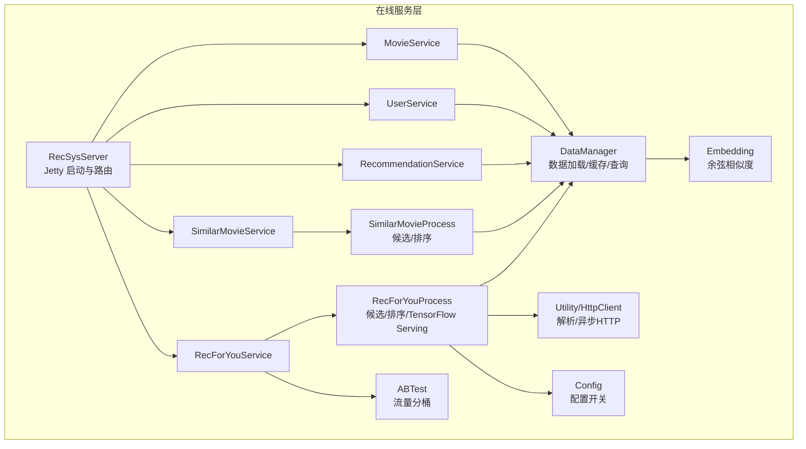
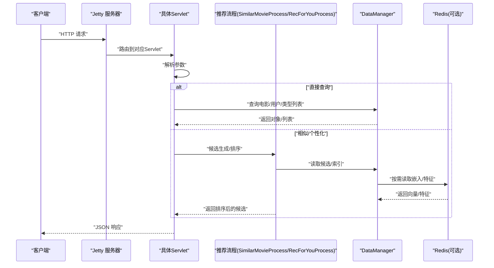
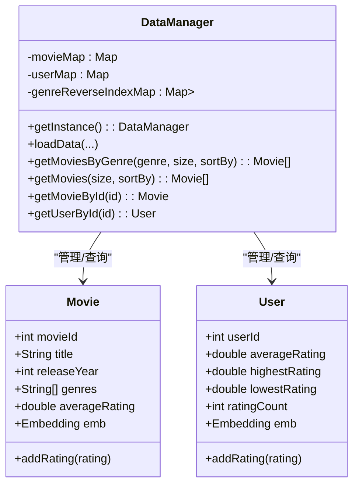
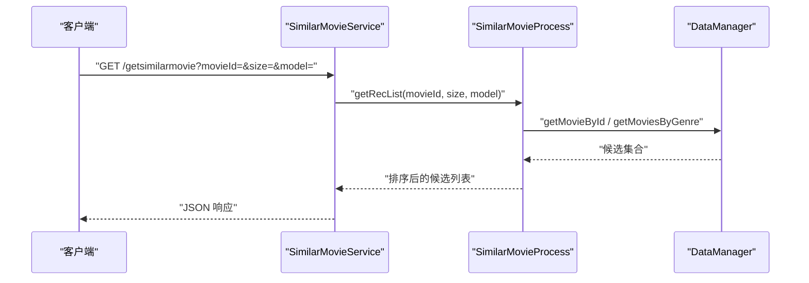
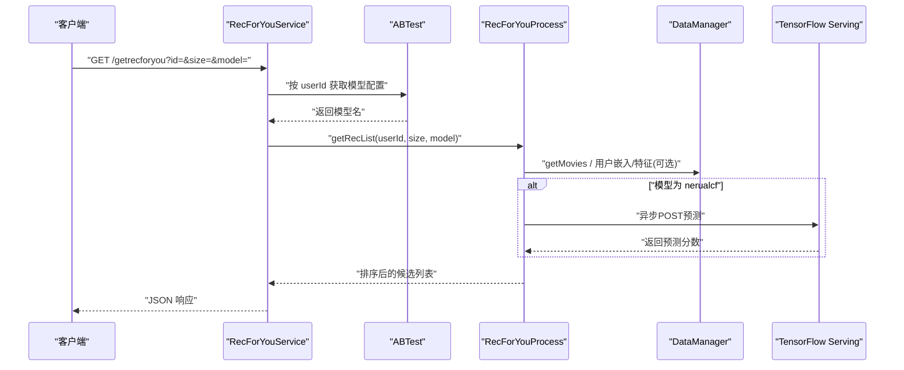
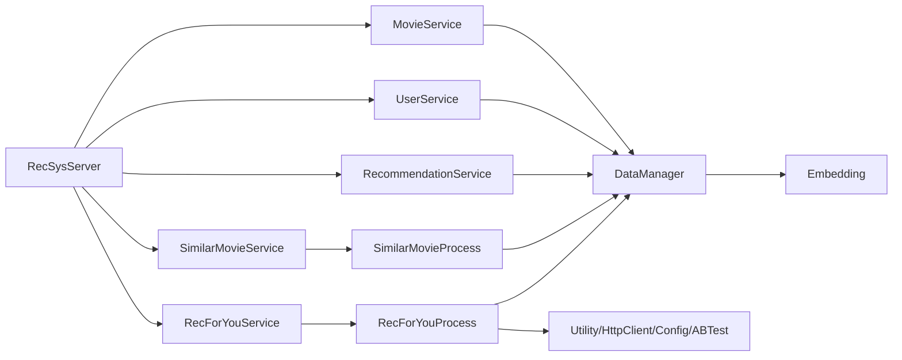

# 在线服务层

<cite>
**本文引用的文件**
- [src/main/java/com/sparrowrecsys/online/RecSysServer.java](file://src/main/java/com/sparrowrecsys/online/RecSysServer.java)
- [src/main/java/com/sparrowrecsys/online/datamanager/DataManager.java](file://src/main/java/com/sparrowrecsys/online/datamanager/DataManager.java)
- [src/main/java/com/sparrowrecsys/online/datamanager/Movie.java](file://src/main/java/com/sparrowrecsys/online/datamanager/Movie.java)
- [src/main/java/com/sparrowrecsys/online/datamanager/User.java](file://src/main/java/com/sparrowrecsys/online/datamanager/User.java)
- [src/main/java/com/sparrowrecsys/online/service/MovieService.java](file://src/main/java/com/sparrowrecsys/online/service/MovieService.java)
- [src/main/java/com/sparrowrecsys/online/service/UserService.java](file://src/main/java/com/sparrowrecsys/online/service/UserService.java)
- [src/main/java/com/sparrowrecsys/online/service/RecommendationService.java](file://src/main/java/com/sparrowrecsys/online/service/RecommendationService.java)
- [src/main/java/com/sparrowrecsys/online/service/SimilarMovieService.java](file://src/main/java/com/sparrowrecsys/online/service/SimilarMovieService.java)
- [src/main/java/com/sparrowrecsys/online/service/RecForYouService.java](file://src/main/java/com/sparrowrecsys/online/service/RecForYouService.java)
- [src/main/java/com/sparrowrecsys/online/recprocess/SimilarMovieProcess.java](file://src/main/java/com/sparrowrecsys/online/recprocess/SimilarMovieProcess.java)
- [src/main/java/com/sparrowrecsys/online/recprocess/RecForYouProcess.java](file://src/main/java/com/sparrowrecsys/online/recprocess/RecForYouProcess.java)
- [src/main/java/com/sparrowrecsys/online/util/Config.java](file://src/main/java/com/sparrowrecsys/online/util/Config.java)
- [src/main/java/com/sparrowrecsys/online/util/ABTest.java](file://src/main/java/com/sparrowrecsys/online/util/ABTest.java)
- [src/main/java/com/sparrowrecsys/online/util/Utility.java](file://src/main/java/com/sparrowrecsys/online/util/Utility.java)
- [src/main/java/com/sparrowrecsys/online/util/HttpClient.java](file://src/main/java/com/sparrowrecsys/online/util/HttpClient.java)
- [src/main/java/com/sparrowrecsys/online/model/Embedding.java](file://src/main/java/com/sparrowrecsys/online/model/Embedding.java)
- [src/main/resources/webroot/index.html](file://src/main/resources/webroot/index.html)
- [README.md](file://README.md)
</cite>

## 目录
1. [简介](#简介)
2. [项目结构](#项目结构)
3. [核心组件](#核心组件)
4. [架构总览](#架构总览)
5. [详细组件分析](#详细组件分析)
6. [依赖关系分析](#依赖关系分析)
7. [性能考量](#性能考量)
8. [故障排查指南](#故障排查指南)
9. [结论](#结论)
10. [附录：API 接口文档](#附录api-接口文档)

## 简介
本文件面向在线服务层，围绕基于 Jetty 的 Web 服务器配置与 RESTful API 设计，系统性阐述以下内容：
- 服务端启动与路由绑定：如何通过 RecSysServer 启动 Jetty 并将各端点映射到对应 Servlet。
- 核心服务类职责与实现：RecommendationService、MovieService、UserService、SimilarMovieService、RecForYouService 的功能边界、参数与返回格式。
- 数据管理层 DataManager 的设计与作用：数据加载、缓存管理、全局数据访问机制。
- 服务层与数据层交互模式：如何在高并发下安全地共享内存态数据。
- 并发与状态管理：当前实现的状态与潜在优化方向。
- 完整 API 文档：列举并说明 /getmovie、/getuser、/getrecommendation、/getsimilarmovie、/getrecforyou 等端点。

## 项目结构
在线服务层位于 src/main/java/com/sparrowrecsys/online 下，主要由以下子包构成：
- datamanager：数据模型与数据加载器（DataManager）
- service：对外暴露的 RESTful 服务（Servlet）
- recprocess：推荐流程编排（候选生成、排序）
- util：配置、AB 实验、HTTP 工具、通用解析工具
- model：向量表示模型 Embedding
- webroot：静态资源与前端页面入口

图表来源
- [src/main/java/com/sparrowrecsys/online/RecSysServer.java](file://src/main/java/com/sparrowrecsys/online/RecSysServer.java#L56-L78)
- [src/main/java/com/sparrowrecsys/online/service/MovieService.java](file://src/main/java/com/sparrowrecsys/online/service/MovieService.java#L16-L45)
- [src/main/java/com/sparrowrecsys/online/service/UserService.java](file://src/main/java/com/sparrowrecsys/online/service/UserService.java#L15-L44)
- [src/main/java/com/sparrowrecsys/online/service/SimilarMovieService.java](file://src/main/java/com/sparrowrecsys/online/service/SimilarMovieService.java#L16-L45)
- [src/main/java/com/sparrowrecsys/online/service/RecommendationService.java](file://src/main/java/com/sparrowrecsys/online/service/RecommendationService.java#L18-L47)
- [src/main/java/com/sparrowrecsys/online/service/RecForYouService.java](file://src/main/java/com/sparrowrecsys/online/service/RecForYouService.java#L20-L54)
- [src/main/java/com/sparrowrecsys/online/recprocess/SimilarMovieProcess.java](file://src/main/java/com/sparrowrecsys/online/recprocess/SimilarMovieProcess.java#L20-L137)
- [src/main/java/com/sparrowrecsys/online/recprocess/RecForYouProcess.java](file://src/main/java/com/sparrowrecsys/online/recprocess/RecForYouProcess.java#L29-L138)
- [src/main/java/com/sparrowrecsys/online/datamanager/DataManager.java](file://src/main/java/com/sparrowrecsys/online/datamanager/DataManager.java#L39-L50)
- [src/main/java/com/sparrowrecsys/online/util/Config.java](file://src/main/java/com/sparrowrecsys/online/util/Config.java#L3-L13)
- [src/main/java/com/sparrowrecsys/online/util/ABTest.java](file://src/main/java/com/sparrowrecsys/online/util/ABTest.java#L11-L26)
- [src/main/java/com/sparrowrecsys/online/util/Utility.java](file://src/main/java/com/sparrowrecsys/online/util/Utility.java#L6-L13)
- [src/main/java/com/sparrowrecsys/online/util/HttpClient.java](file://src/main/java/com/sparrowrecsys/online/util/HttpClient.java#L21-L40)
- [src/main/java/com/sparrowrecsys/online/model/Embedding.java](file://src/main/java/com/sparrowrecsys/online/model/Embedding.java#L32-L47)

章节来源
- [src/main/java/com/sparrowrecsys/online/RecSysServer.java](file://src/main/java/com/sparrowrecsys/online/RecSysServer.java#L27-L78)
- [README.md](file://README.md#L13-L17)

## 核心组件
- RecSysServer：负责启动 Jetty 服务器、设置静态资源根目录、加载数据、注册各 Servlet 路由。
- DataManager：单例数据管理器，负责从 CSV 文件与 Redis 加载电影、用户、评分、嵌入向量与特征；维护内存索引（如按类型反向索引）；提供查询接口。
- 服务类（Servlet）：MovieService、UserService、RecommendationService、SimilarMovieService、RecForYouService，均继承自 HttpServlet，负责参数解析、调用 DataManager 或推荐流程、序列化为 JSON 返回。
- 推荐流程：SimilarMovieProcess、RecForYouProcess，封装候选生成与排序策略，支持多种模型（如基于嵌入的相似度、神经协同过滤 TF Serving 预测）。
- 工具与配置：Config、ABTest、Utility、HttpClient、Embedding，分别负责配置开关、AB 流量分桶、字符串解析、异步 HTTP 请求与向量相似度计算。

章节来源
- [src/main/java/com/sparrowrecsys/online/RecSysServer.java](file://src/main/java/com/sparrowrecsys/online/RecSysServer.java#L18-L78)
- [src/main/java/com/sparrowrecsys/online/datamanager/DataManager.java](file://src/main/java/com/sparrowrecsys/online/datamanager/DataManager.java#L13-L50)
- [src/main/java/com/sparrowrecsys/online/service/MovieService.java](file://src/main/java/com/sparrowrecsys/online/service/MovieService.java#L16-L45)
- [src/main/java/com/sparrowrecsys/online/service/UserService.java](file://src/main/java/com/sparrowrecsys/online/service/UserService.java#L15-L44)
- [src/main/java/com/sparrowrecsys/online/service/RecommendationService.java](file://src/main/java/com/sparrowrecsys/online/service/RecommendationService.java#L18-L47)
- [src/main/java/com/sparrowrecsys/online/service/SimilarMovieService.java](file://src/main/java/com/sparrowrecsys/online/service/SimilarMovieService.java#L16-L45)
- [src/main/java/com/sparrowrecsys/online/service/RecForYouService.java](file://src/main/java/com/sparrowrecsys/online/service/RecForYouService.java#L20-L54)
- [src/main/java/com/sparrowrecsys/online/recprocess/SimilarMovieProcess.java](file://src/main/java/com/sparrowrecsys/online/recprocess/SimilarMovieProcess.java#L20-L137)
- [src/main/java/com/sparrowrecsys/online/recprocess/RecForYouProcess.java](file://src/main/java/com/sparrowrecsys/online/recprocess/RecForYouProcess.java#L29-L138)
- [src/main/java/com/sparrowrecsys/online/util/Config.java](file://src/main/java/com/sparrowrecsys/online/util/Config.java#L3-L13)
- [src/main/java/com/sparrowrecsys/online/util/ABTest.java](file://src/main/java/com/sparrowrecsys/online/util/ABTest.java#L11-L26)
- [src/main/java/com/sparrowrecsys/online/util/Utility.java](file://src/main/java/com/sparrowrecsys/online/util/Utility.java#L6-L13)
- [src/main/java/com/sparrowrecsys/online/util/HttpClient.java](file://src/main/java/com/sparrowrecsys/online/util/HttpClient.java#L21-L40)
- [src/main/java/com/sparrowrecsys/online/model/Embedding.java](file://src/main/java/com/sparrowrecsys/online/model/Embedding.java#L32-L47)

## 架构总览
在线服务层采用“单机多 Servlet”的轻量级架构：
- Jetty 作为 Web 容器，承载静态资源与 REST 接口。
- RecSysServer 在启动时加载数据至 DataManager，并将 /getmovie、/getuser、/getrecommendation、/getsimilarmovie、/getrecforyou 绑定到各自 Servlet。
- 业务逻辑集中在 Servlet 中，或委托给 RecForYouProcess/SimilarMovieProcess 进行候选生成与排序。
- 数据访问统一经由 DataManager，支持从文件或 Redis 加载嵌入与特征。

图表来源
- [src/main/java/com/sparrowrecsys/online/RecSysServer.java](file://src/main/java/com/sparrowrecsys/online/RecSysServer.java#L64-L69)
- [src/main/java/com/sparrowrecsys/online/service/SimilarMovieService.java](file://src/main/java/com/sparrowrecsys/online/service/SimilarMovieService.java#L32-L38)
- [src/main/java/com/sparrowrecsys/online/service/RecForYouService.java](file://src/main/java/com/sparrowrecsys/online/service/RecForYouService.java#L42-L47)
- [src/main/java/com/sparrowrecsys/online/recprocess/SimilarMovieProcess.java](file://src/main/java/com/sparrowrecsys/online/recprocess/SimilarMovieProcess.java#L20-L32)
- [src/main/java/com/sparrowrecsys/online/recprocess/RecForYouProcess.java](file://src/main/java/com/sparrowrecsys/online/recprocess/RecForYouProcess.java#L29-L60)
- [src/main/java/com/sparrowrecsys/online/datamanager/DataManager.java](file://src/main/java/com/sparrowrecsys/online/datamanager/DataManager.java#L39-L50)

## 详细组件分析

### RecSysServer（Jetty 启动与路由）
- 启动方式：读取环境变量 PORT，若未设置则使用默认端口；绑定 0.0.0.0 地址。
- 静态资源：设置 webroot 为欢迎页 index.html，并映射静态资源路径。
- 数据加载：在启动阶段调用 DataManager.loadData，加载 movies.csv、links.csv、ratings.csv、item2vec 嵌入、user 嵌入等。
- 路由绑定：将 /getmovie、/getuser、/getsimilarmovie、/getrecommendation、/getrecforyou 分别绑定到对应 Servlet。

章节来源
- [src/main/java/com/sparrowrecsys/online/RecSysServer.java](file://src/main/java/com/sparrowrecsys/online/RecSysServer.java#L24-L78)
- [src/main/resources/webroot/index.html](file://src/main/resources/webroot/index.html#L1-L121)

### DataManager（数据管理器）
- 单例模式：提供 getInstance 获取全局实例。
- 数据加载：
  - 电影数据：解析 movies.csv，构建 Movie 对象与类型反向索引。
  - 链接数据：解析 links.csv，填充 IMDb/TMDb ID。
  - 评分数据：解析 ratings.csv，构建 Movie 与 User 的评分列表。
  - 嵌入向量：从文件或 Redis 加载电影/用户嵌入；可选加载电影/用户特征。
- 查询接口：
  - 按类型获取电影列表（支持按评分/年份排序）。
  - 按类型筛选并排序。
  - 按 ID 获取电影/用户对象。

图表来源
- [src/main/java/com/sparrowrecsys/online/datamanager/DataManager.java](file://src/main/java/com/sparrowrecsys/online/datamanager/DataManager.java#L13-L50)
- [src/main/java/com/sparrowrecsys/online/datamanager/Movie.java](file://src/main/java/com/sparrowrecsys/online/datamanager/Movie.java#L15-L51)
- [src/main/java/com/sparrowrecsys/online/datamanager/User.java](file://src/main/java/com/sparrowrecsys/online/datamanager/User.java#L14-L35)

章节来源
- [src/main/java/com/sparrowrecsys/online/datamanager/DataManager.java](file://src/main/java/com/sparrowrecsys/online/datamanager/DataManager.java#L13-L294)

### MovieService（获取电影详情）
- 功能：根据 id 查询电影详情，返回 JSON。
- 参数：id（URL 查询参数）。
- 处理：调用 DataManager.getMovieById，序列化为 JSON 返回。

章节来源
- [src/main/java/com/sparrowrecsys/online/service/MovieService.java](file://src/main/java/com/sparrowrecsys/online/service/MovieService.java#L16-L45)

### UserService（获取用户详情）
- 功能：根据 id 查询用户详情，返回 JSON。
- 参数：id（URL 查询参数）。
- 处理：调用 DataManager.getUserById，序列化为 JSON 返回。

章节来源
- [src/main/java/com/sparrowrecsys/online/service/UserService.java](file://src/main/java/com/sparrowrecsys/online/service/UserService.java#L15-L44)

### RecommendationService（按类型推荐）
- 功能：按类型与排序规则返回电影列表。
- 参数：genre（类型）、size（数量）、sortby（排序依据，如 rating/releaseYear）。
- 处理：调用 DataManager.getMoviesByGenre，序列化为 JSON 返回。

章节来源
- [src/main/java/com/sparrowrecsys/online/service/RecommendationService.java](file://src/main/java/com/sparrowrecsys/online/service/RecommendationService.java#L18-L47)

### SimilarMovieService（相似电影推荐）
- 功能：给定电影，返回相似电影列表。
- 参数：movieId（输入电影 id）、size（数量）、model（相似度模型，如 emb）。
- 处理：调用 SimilarMovieProcess.getRecList 生成候选并排序，序列化为 JSON 返回。

图表来源
- [src/main/java/com/sparrowrecsys/online/service/SimilarMovieService.java](file://src/main/java/com/sparrowrecsys/online/service/SimilarMovieService.java#L16-L45)
- [src/main/java/com/sparrowrecsys/online/recprocess/SimilarMovieProcess.java](file://src/main/java/com/sparrowrecsys/online/recprocess/SimilarMovieProcess.java#L20-L32)

章节来源
- [src/main/java/com/sparrowrecsys/online/service/SimilarMovieService.java](file://src/main/java/com/sparrowrecsys/online/service/SimilarMovieService.java#L16-L45)
- [src/main/java/com/sparrowrecsys/online/recprocess/SimilarMovieProcess.java](file://src/main/java/com/sparrowrecsys/online/recprocess/SimilarMovieProcess.java#L20-L137)

### RecForYouService（为你推荐）
- 功能：根据用户与模型返回个性化电影列表。
- 参数：id（用户 id）、size（数量）、model（模型，如 emb、nerualcf）。
- 处理：可选启用 ABTest 决定模型；调用 RecForYouProcess.getRecList，序列化为 JSON 返回。

图表来源
- [src/main/java/com/sparrowrecsys/online/service/RecForYouService.java](file://src/main/java/com/sparrowrecsys/online/service/RecForYouService.java#L20-L54)
- [src/main/java/com/sparrowrecsys/online/util/ABTest.java](file://src/main/java/com/sparrowrecsys/online/util/ABTest.java#L11-L26)
- [src/main/java/com/sparrowrecsys/online/recprocess/RecForYouProcess.java](file://src/main/java/com/sparrowrecsys/online/recprocess/RecForYouProcess.java#L29-L138)
- [src/main/java/com/sparrowrecsys/online/util/HttpClient.java](file://src/main/java/com/sparrowrecsys/online/util/HttpClient.java#L21-L40)

章节来源
- [src/main/java/com/sparrowrecsys/online/service/RecForYouService.java](file://src/main/java/com/sparrowrecsys/online/service/RecForYouService.java#L20-L54)
- [src/main/java/com/sparrowrecsys/online/recprocess/RecForYouProcess.java](file://src/main/java/com/sparrowrecsys/online/recprocess/RecForYouProcess.java#L29-L138)
- [src/main/java/com/sparrowrecsys/online/util/ABTest.java](file://src/main/java/com/sparrowrecsys/online/util/ABTest.java#L11-L26)

### SimilarMovieProcess（相似电影候选与排序）
- 候选生成：基于输入电影的类型，从 DataManager 获取候选；可选多路召回（类型 + 高分 + 最新）。
- 排序：支持“类型相似 + 评分权重”与“嵌入相似度”两种策略。
- 嵌入相似：通过 Embedding.calculateSimilarity 计算余弦相似度。

章节来源
- [src/main/java/com/sparrowrecsys/online/recprocess/SimilarMovieProcess.java](file://src/main/java/com/sparrowrecsys/online/recprocess/SimilarMovieProcess.java#L20-L137)
- [src/main/java/com/sparrowrecsys/online/model/Embedding.java](file://src/main/java/com/sparrowrecsys/online/model/Embedding.java#L32-L47)

### RecForYouProcess（个性化候选与排序）
- 候选生成：从 DataManager 获取 TopN 电影作为候选池。
- 排序：
  - 嵌入相似：使用用户/电影嵌入计算相似度。
  - 神经协同过滤：异步调用 TensorFlow Serving 获取预测分数。
  - 默认：按候选顺序打分。
- 特征与嵌入：可从 Redis 加载用户/电影特征与嵌入，受 Config 控制。

章节来源
- [src/main/java/com/sparrowrecsys/online/recprocess/RecForYouProcess.java](file://src/main/java/com/sparrowrecsys/online/recprocess/RecForYouProcess.java#L29-L138)
- [src/main/java/com/sparrowrecsys/online/util/HttpClient.java](file://src/main/java/com/sparrowrecsys/online/util/HttpClient.java#L21-L40)
- [src/main/java/com/sparrowrecsys/online/util/Config.java](file://src/main/java/com/sparrowrecsys/online/util/Config.java#L3-L13)

### 工具与配置
- Config：控制嵌入数据源（文件/Redis）、是否加载用户/电影特征、是否启用 ABTest。
- ABTest：基于用户 id 的简单哈希分流，默认返回 emb 模型。
- Utility：将字符串解析为 Embedding 向量。
- HttpClient：提供异步 POST 请求能力，用于调用 TensorFlow Serving。

章节来源
- [src/main/java/com/sparrowrecsys/online/util/Config.java](file://src/main/java/com/sparrowrecsys/online/util/Config.java#L3-L13)
- [src/main/java/com/sparrowrecsys/online/util/ABTest.java](file://src/main/java/com/sparrowrecsys/online/util/ABTest.java#L11-L26)
- [src/main/java/com/sparrowrecsys/online/util/Utility.java](file://src/main/java/com/sparrowrecsys/online/util/Utility.java#L6-L13)
- [src/main/java/com/sparrowrecsys/online/util/HttpClient.java](file://src/main/java/com/sparrowrecsys/online/util/HttpClient.java#L21-L40)

## 依赖关系分析
- 服务层对数据层的依赖：所有 Servlet 与推荐流程最终依赖 DataManager 提供的数据与索引。
- 推荐流程对工具链的依赖：Embedding、Utility、HttpClient、Config、ABTest。
- 启动器对服务层的依赖：RecSysServer 将各 Servlet 注册到 Jetty。

图表来源
- [src/main/java/com/sparrowrecsys/online/RecSysServer.java](file://src/main/java/com/sparrowrecsys/online/RecSysServer.java#L64-L69)
- [src/main/java/com/sparrowrecsys/online/service/MovieService.java](file://src/main/java/com/sparrowrecsys/online/service/MovieService.java#L29)
- [src/main/java/com/sparrowrecsys/online/service/UserService.java](file://src/main/java/com/sparrowrecsys/online/service/UserService.java#L28)
- [src/main/java/com/sparrowrecsys/online/service/RecommendationService.java](file://src/main/java/com/sparrowrecsys/online/service/RecommendationService.java#L35)
- [src/main/java/com/sparrowrecsys/online/service/SimilarMovieService.java](file://src/main/java/com/sparrowrecsys/online/service/SimilarMovieService.java#L33)
- [src/main/java/com/sparrowrecsys/online/service/RecForYouService.java](file://src/main/java/com/sparrowrecsys/online/service/RecForYouService.java#L42)
- [src/main/java/com/sparrowrecsys/online/recprocess/SimilarMovieProcess.java](file://src/main/java/com/sparrowrecsys/online/recprocess/SimilarMovieProcess.java#L20-L32)
- [src/main/java/com/sparrowrecsys/online/recprocess/RecForYouProcess.java](file://src/main/java/com/sparrowrecsys/online/recprocess/RecForYouProcess.java#L29-L60)
- [src/main/java/com/sparrowrecsys/online/datamanager/DataManager.java](file://src/main/java/com/sparrowrecsys/online/datamanager/DataManager.java#L39-L50)
- [src/main/java/com/sparrowrecsys/online/util/Utility.java](file://src/main/java/com/sparrowrecsys/online/util/Utility.java#L6-L13)
- [src/main/java/com/sparrowrecsys/online/util/HttpClient.java](file://src/main/java/com/sparrowrecsys/online/util/HttpClient.java#L21-L40)
- [src/main/java/com/sparrowrecsys/online/model/Embedding.java](file://src/main/java/com/sparrowrecsys/online/model/Embedding.java#L32-L47)

## 性能考量
- 数据加载与内存占用：DataManager 在启动时一次性加载电影、链接、评分、嵌入与特征，适合中小规模数据；大规模数据建议分页/懒加载或引入缓存层。
- 排序复杂度：相似度计算与排序在内存中完成，时间复杂度与候选池大小相关；可通过候选池上限与预过滤降低开销。
- 异步调用：RecForYouProcess 调用 TensorFlow Serving 使用异步 HTTP 客户端，避免阻塞主线程。
- 并发与线程安全：当前 Servlet 与推荐流程未显式加锁，依赖不可变数据结构与只读访问；若后续引入写操作，需考虑同步与一致性。
- 缓存策略：可考虑对热门查询结果做本地缓存，减少重复计算；对嵌入与特征可结合 Redis 实现热数据缓存。

## 故障排查指南
- 端口冲突：确认环境变量 PORT 设置或默认端口 6010 是否被占用。
- 数据路径：确保 webroot 下 sampledata 与 modeldata 路径正确，RecSysServer 启动时会拼接绝对路径加载数据。
- 嵌入与特征来源：若使用 Redis 作为嵌入/特征来源，需确认 Config 中数据源配置与 Redis 可达性。
- TF Serving：当 model 为 nerualcf 时，需确保本地 8501 端口可用且模型已部署。
- 参数校验：Servlet 对非法参数会返回空字符串，检查客户端传参是否符合预期。

章节来源
- [src/main/java/com/sparrowrecsys/online/RecSysServer.java](file://src/main/java/com/sparrowrecsys/online/RecSysServer.java#L29-L32)
- [src/main/java/com/sparrowrecsys/online/util/Config.java](file://src/main/java/com/sparrowrecsys/online/util/Config.java#L3-L13)
- [src/main/java/com/sparrowrecsys/online/recprocess/RecForYouProcess.java](file://src/main/java/com/sparrowrecsys/online/recprocess/RecForYouProcess.java#L130)

## 结论
该在线服务层以轻量级 Jetty 为核心，通过 Servlet 将业务接口与数据层解耦，借助 DataManager 提供统一的数据访问与索引能力。推荐流程封装在独立类中，便于扩展与测试。整体架构清晰、易于上手，适合教学与原型验证；在生产环境中可进一步增强并发控制、缓存与可观测性。

## 附录：API 接口文档

- GET /getmovie
  - 描述：根据电影 id 返回电影详情。
  - 参数：id（必填，整数）
  - 返回：JSON 对象（电影信息），失败返回空字符串
  - 示例：GET /getmovie?id=1

- GET /getuser
  - 描述：根据用户 id 返回用户详情。
  - 参数：id（必填，整数）
  - 返回：JSON 对象（用户信息），失败返回空字符串
  - 示例：GET /getuser?id=101

- GET /getrecommendation
  - 描述：按类型与排序规则返回电影列表。
  - 参数：genre（必填，字符串）、size（必填，整数）、sortby（可选，rating 或 releaseYear）
  - 返回：JSON 数组（电影列表），失败返回空字符串
  - 示例：GET /getrecommendation?genre=Action&size=10&sortby=rating

- GET /getsimilarmovie
  - 描述：给定电影，返回相似电影列表。
  - 参数：movieId（必填，整数）、size（必填，整数）、model（可选，emb 等）
  - 返回：JSON 数组（电影列表），失败返回空字符串
  - 示例：GET /getsimilarmovie?movieId=1&size=10&model=emb

- GET /getrecforyou
  - 描述：根据用户与模型返回个性化电影列表。
  - 参数：id（必填，整数）、size（必填，整数）、model（可选，emb 或 nerualcf）
  - 返回：JSON 数组（电影列表），失败返回空字符串
  - 示例：GET /getrecforyou?id=101&size=10&model=emb

章节来源
- [src/main/java/com/sparrowrecsys/online/service/MovieService.java](file://src/main/java/com/sparrowrecsys/online/service/MovieService.java#L16-L45)
- [src/main/java/com/sparrowrecsys/online/service/UserService.java](file://src/main/java/com/sparrowrecsys/online/service/UserService.java#L15-L44)
- [src/main/java/com/sparrowrecsys/online/service/RecommendationService.java](file://src/main/java/com/sparrowrecsys/online/service/RecommendationService.java#L18-L47)
- [src/main/java/com/sparrowrecsys/online/service/SimilarMovieService.java](file://src/main/java/com/sparrowrecsys/online/service/SimilarMovieService.java#L16-L45)
- [src/main/java/com/sparrowrecsys/online/service/RecForYouService.java](file://src/main/java/com/sparrowrecsys/online/service/RecForYouService.java#L20-L54)