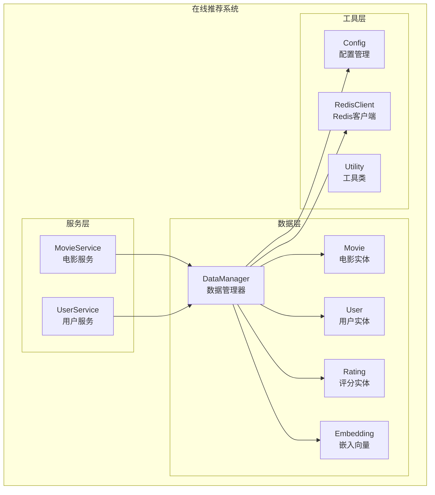
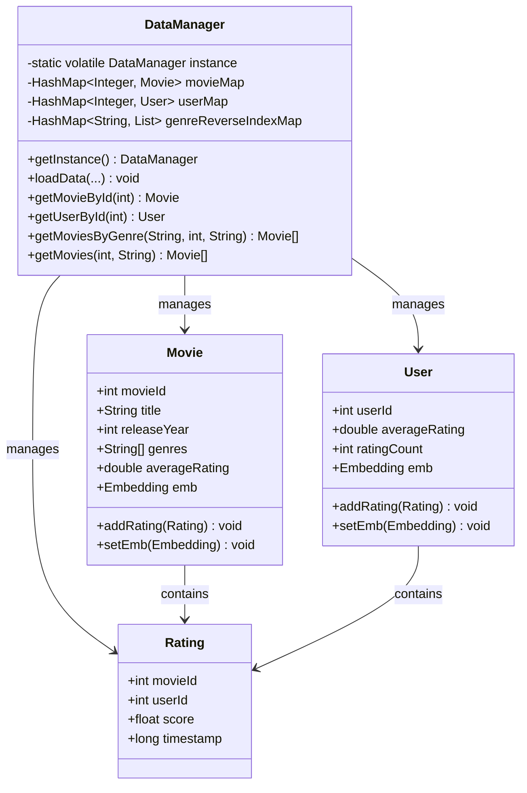
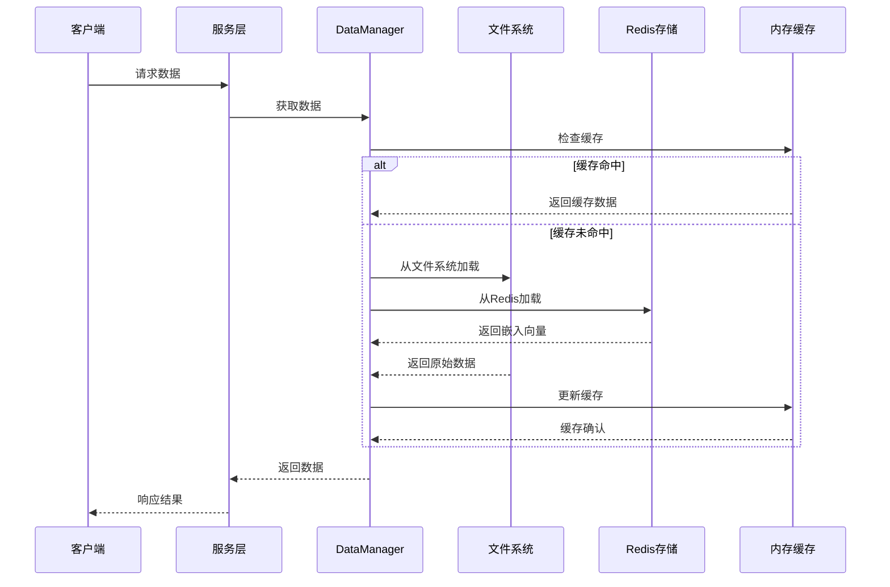
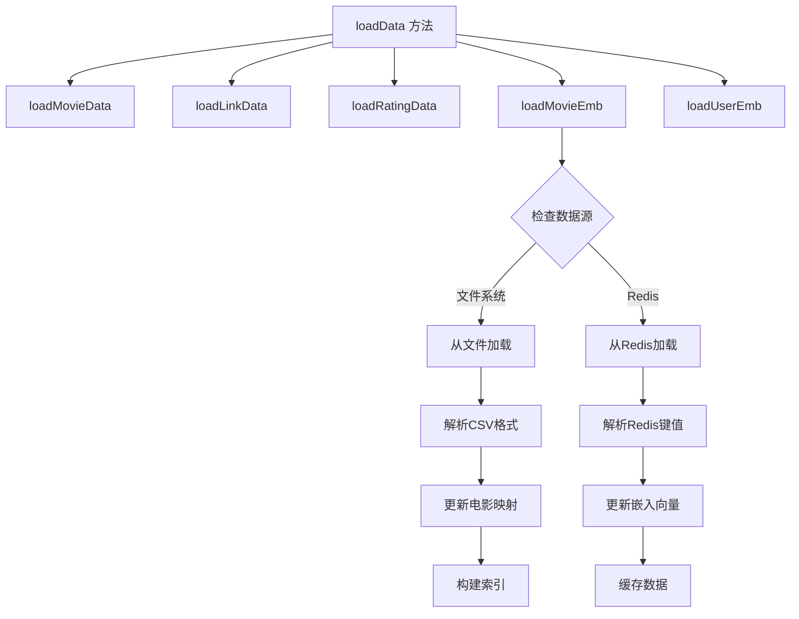
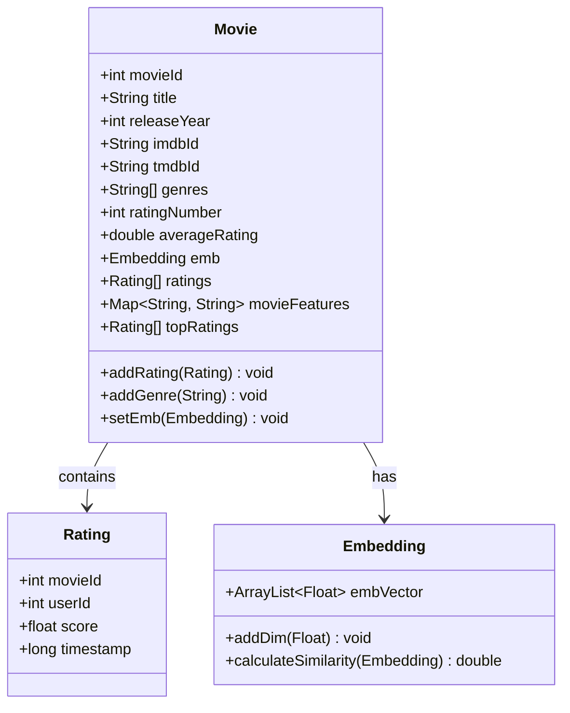
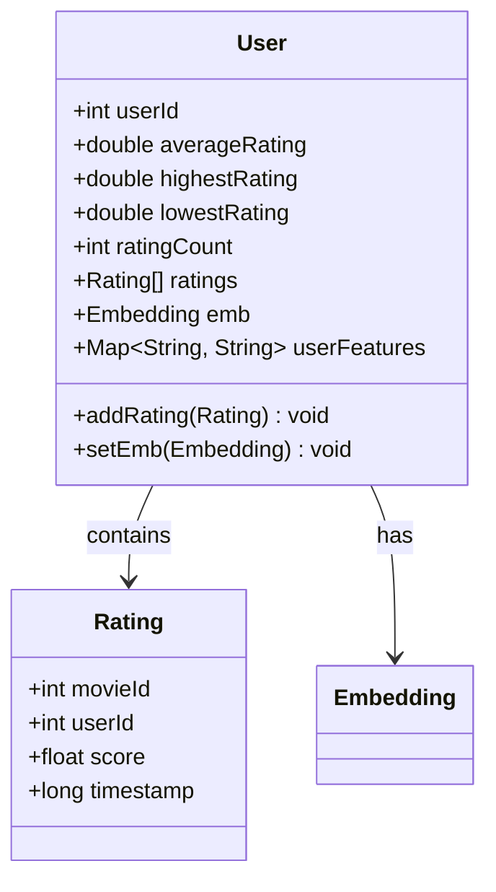
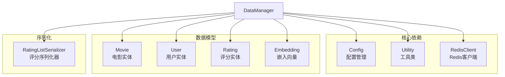
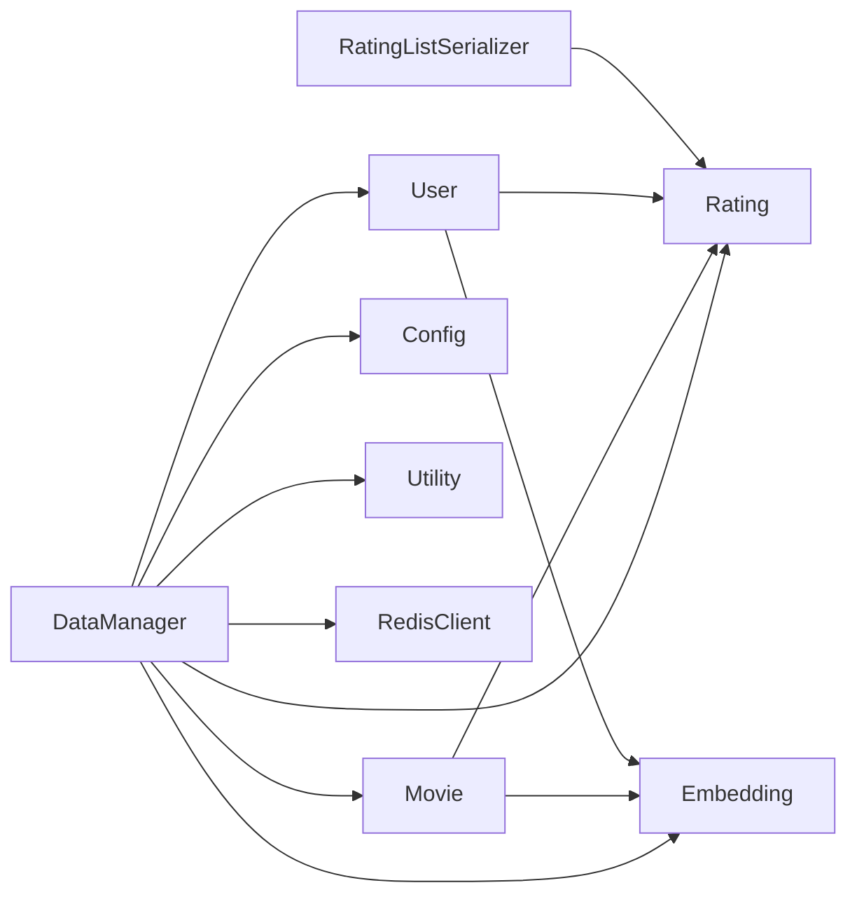

# 数据管理器

<cite>
**本文档引用的文件**
- [DataManager.java](file://src/main/java/com/sparrowrecsys/online/datamanager/DataManager.java)
- [Movie.java](file://src/main/java/com/sparrowrecsys/online/datamanager/Movie.java)
- [User.java](file://src/main/java/com/sparrowrecsys/online/datamanager/User.java)
- [Rating.java](file://src/main/java/com/sparrowrecsys/online/datamanager/Rating.java)
- [RedisClient.java](file://src/main/java/com/sparrowrecsys/online/datamanager/RedisClient.java)
- [Config.java](file://src/main/java/com/sparrowrecsys/online/util/Config.java)
- [Utility.java](file://src/main/java/com/sparrowrecsys/online/util/Utility.java)
- [Embedding.java](file://src/main/java/com/sparrowrecsys/online/model/Embedding.java)
- [MovieService.java](file://src/main/java/com/sparrowrecsys/online/service/MovieService.java)
- [UserService.java](file://src/main/java/com/sparrowrecsys/online/service/UserService.java)
- [RatingListSerializer.java](file://src/main/java/com/sparrowrecsys/online/datamanager/RatingListSerializer.java)
- [movies.csv](file://src/main/resources/webroot/sampledata/movies.csv)
- [links.csv](file://src/main/resources/webroot/sampledata/links.csv)
- [ratings.csv](file://src/main/resources/webroot/sampledata/ratings.csv)
</cite>

## 目录
1. [简介](#简介)
2. [项目结构](#项目结构)
3. [核心组件](#核心组件)
4. [架构概览](#架构概览)
5. [详细组件分析](#详细组件分析)
6. [依赖关系分析](#依赖关系分析)
7. [性能考虑](#性能考虑)
8. [故障排除指南](#故障排除指南)
9. [结论](#结论)
10. [附录](#附录)

## 简介

数据管理器是 SparrowRecSys 推荐系统中的核心组件，负责管理电影、用户、评分数据以及嵌入向量的完整生命周期。该组件采用单例模式确保全局唯一性，并实现了高效的数据加载、缓存管理和并发访问控制机制。

数据管理器支持多种数据源（文件系统和Redis），能够处理大规模推荐系统的数据需求。通过智能的内存管理和索引机制，为上层服务提供了快速、可靠的数据访问能力。

## 项目结构

数据管理器位于在线推荐系统的数据层，与服务层和模型层形成清晰的分层架构：



**图表来源**
- [DataManager.java](file://src/main/java/com/sparrowrecsys/online/datamanager/DataManager.java#L1-L295)
- [MovieService.java](file://src/main/java/com/sparrowrecsys/online/service/MovieService.java#L1-L46)
- [UserService.java](file://src/main/java/com/sparrowrecsys/online/service/UserService.java#L1-L45)

**章节来源**
- [DataManager.java](file://src/main/java/com/sparrowrecsys/online/datamanager/DataManager.java#L1-L295)
- [Config.java](file://src/main/java/com/sparrowrecsys/online/util/Config.java#L1-L14)

## 核心组件

### 单例模式实现

数据管理器采用双重检查锁定的单例模式，确保线程安全和性能优化：



**图表来源**
- [DataManager.java](file://src/main/java/com/sparrowrecsys/online/datamanager/DataManager.java#L13-L295)
- [Movie.java](file://src/main/java/com/sparrowrecsys/online/datamanager/Movie.java#L15-L158)
- [User.java](file://src/main/java/com/sparrowrecsys/online/datamanager/User.java#L14-L115)
- [Rating.java](file://src/main/java/com/sparrowrecsys/online/datamanager/Rating.java#L1-L44)

### 数据模型设计

数据管理器维护三种核心数据结构：

1. **电影映射表**：基于电影ID的快速查找
2. **用户映射表**：基于用户ID的用户信息存储
3. **类型反向索引**：按类型快速查询电影列表

**章节来源**
- [DataManager.java](file://src/main/java/com/sparrowrecsys/online/datamanager/DataManager.java#L16-L25)

## 架构概览

数据管理器采用分层架构设计，实现了数据加载、缓存管理和查询优化的完整流程：



**图表来源**
- [DataManager.java](file://src/main/java/com/sparrowrecsys/online/datamanager/DataManager.java#L40-L50)
- [RedisClient.java](file://src/main/java/com/sparrowrecsys/online/datamanager/RedisClient.java#L1-L26)

## 详细组件分析

### DataManager 类详解

#### 单例模式实现

数据管理器采用双重检查锁定模式确保线程安全：

```mermaid
flowchart TD
Start([调用 getInstance]) --> Check1{instance 是否为空?}
Check1 --> |是| Sync1[synchronized(DataManager.class)]
Check1 --> |否| ReturnInstance[返回现有实例]
Sync1 --> Check2{instance 是否仍为空?}
Check2 --> |是| CreateNew[创建新实例]
Check2 --> |否| ReturnExisting[返回现有实例]
CreateNew --> Assign[设置静态实例]
Assign --> ReturnNew[返回新实例]
ReturnExisting --> ReturnInstance
ReturnNew --> ReturnInstance
```

**图表来源**
- [DataManager.java](file://src/main/java/com/sparrowrecsys/online/datamanager/DataManager.java#L28-L37)

#### 数据加载策略

数据管理器支持多数据源的统一加载接口：



**图表来源**
- [DataManager.java](file://src/main/java/com/sparrowrecsys/online/datamanager/DataManager.java#L40-L50)
- [DataManager.java](file://src/main/java/com/sparrowrecsys/online/datamanager/DataManager.java#L89-L124)

#### CSV文件读取实现

数据管理器对CSV文件进行了专门的解析处理：

**电影数据解析流程**：
1. 跳过首行标题
2. 解析每行数据为数组
3. 提取电影ID、标题和类型
4. 解析发布年份
5. 处理类型字段（多个类型以管道符分隔）
6. 构建电影对象并添加到映射表
7. 更新类型反向索引

**评分数据解析流程**：
1. 跳过首行标题
2. 解析每行数据为数组
3. 提取用户ID、电影ID、评分和时间戳
4. 创建评分对象
5. 将评分添加到对应电影和用户的评分列表中
6. 动态创建用户对象（如不存在）

**章节来源**
- [DataManager.java](file://src/main/java/com/sparrowrecsys/online/datamanager/DataManager.java#L52-L87)
- [DataManager.java](file://src/main/java/com/sparrowrecsys/online/datamanager/DataManager.java#L207-L242)

### 数据结构设计

#### 电影实体设计

电影实体包含了推荐系统所需的所有关键信息：



**图表来源**
- [Movie.java](file://src/main/java/com/sparrowrecsys/online/datamanager/Movie.java#L15-L158)
- [Rating.java](file://src/main/java/com/sparrowrecsys/online/datamanager/Rating.java#L6-L44)
- [Embedding.java](file://src/main/java/com/sparrowrecsys/online/model/Embedding.java#L8-L49)

#### 用户实体设计

用户实体设计简洁而高效，专注于推荐系统的核心需求：



**图表来源**
- [User.java](file://src/main/java/com/sparrowrecsys/online/datamanager/User.java#L14-L115)

### 全局数据访问机制

#### 查询接口设计

数据管理器提供了丰富的查询接口来满足不同的业务需求：

**电影查询接口**：
- `getMoviesByGenre(String genre, int size, String sortBy)`：按类型查询电影
- `getMovies(int size, String sortBy)`：获取热门电影
- `getMovieById(int movieId)`：按ID获取电影详情

**用户查询接口**：
- `getUserById(int userId)`：按ID获取用户详情

**排序策略**：
- 按平均评分排序
- 按发布年份排序
- 默认无排序

**章节来源**
- [DataManager.java](file://src/main/java/com/sparrowrecsys/online/datamanager/DataManager.java#L252-L293)

### 缓存管理策略

#### 内存缓存设计

数据管理器采用多层缓存策略：

1. **内存映射缓存**：使用HashMap存储电影和用户对象
2. **反向索引缓存**：按类型快速查询电影列表
3. **嵌入向量缓存**：存储预计算的向量表示

#### 缓存更新策略

缓存更新遵循以下原则：
- 数据加载时自动更新缓存
- 支持增量更新（通过重新加载实现）
- 内存优化：只缓存必要的数据结构

**章节来源**
- [DataManager.java](file://src/main/java/com/sparrowrecsys/online/datamanager/DataManager.java#L16-L25)

### 并发访问控制

#### 线程安全保证

数据管理器通过以下机制确保线程安全：

1. **单例模式**：全局唯一实例
2. **不可变数据结构**：使用final关键字修饰
3. **原子操作**：关键操作使用synchronized块
4. **无状态设计**：避免共享可变状态

#### 性能优化

1. **延迟初始化**：按需创建对象
2. **批量操作**：支持批量数据加载
3. **内存池**：复用对象减少GC压力

**章节来源**
- [DataManager.java](file://src/main/java/com/sparrowrecsys/online/datamanager/DataManager.java#L21-L37)

## 依赖关系分析

### 外部依赖

数据管理器依赖于以下外部组件：



**图表来源**
- [DataManager.java](file://src/main/java/com/sparrowrecsys/online/datamanager/DataManager.java#L3-L5)
- [Config.java](file://src/main/java/com/sparrowrecsys/online/util/Config.java#L1-L14)
- [Utility.java](file://src/main/java/com/sparrowrecsys/online/util/Utility.java#L1-L15)
- [RedisClient.java](file://src/main/java/com/sparrowrecsys/online/datamanager/RedisClient.java#L1-L26)

### 内部依赖关系



**图表来源**
- [DataManager.java](file://src/main/java/com/sparrowrecsys/online/datamanager/DataManager.java#L1-L295)

**章节来源**
- [DataManager.java](file://src/main/java/com/sparrowrecsys/online/datamanager/DataManager.java#L1-L295)

## 性能考虑

### 内存优化技术

1. **对象池模式**：复用常用对象减少内存分配
2. **延迟加载**：按需加载数据避免内存浪费
3. **压缩存储**：使用基本数据类型存储数值信息
4. **弱引用**：对于大型缓存使用弱引用避免内存泄漏

### 查询性能优化

1. **索引优化**：类型反向索引支持快速查询
2. **缓存策略**：多级缓存减少磁盘I/O
3. **批量操作**：支持批量数据处理
4. **懒加载**：嵌入向量按需加载

### 并发性能优化

1. **读写分离**：读操作无锁，写操作使用锁
2. **分段锁**：使用更细粒度的锁提高并发度
3. **无阻塞数据结构**：在可能的情况下使用无阻塞队列

## 故障排除指南

### 常见问题及解决方案

#### 数据加载失败

**问题症状**：
- 文件路径错误
- CSV格式不正确
- 编码问题

**解决方法**：
1. 验证文件路径和权限
2. 检查CSV文件格式
3. 确认文件编码为UTF-8

#### 内存不足

**问题症状**：
- OutOfMemoryError
- GC频繁触发

**解决方法**：
1. 调整JVM堆大小
2. 实施数据分页加载
3. 使用流式处理大数据集

#### Redis连接问题

**问题症状**：
- 连接超时
- 认证失败

**解决方法**：
1. 检查Redis服务器状态
2. 验证连接参数
3. 实施连接池管理

**章节来源**
- [DataManager.java](file://src/main/java/com/sparrowrecsys/online/datamanager/DataManager.java#L52-L87)
- [RedisClient.java](file://src/main/java/com/sparrowrecsys/online/datamanager/RedisClient.java#L1-L26)

## 结论

数据管理器作为推荐系统的核心组件，成功实现了以下目标：

1. **设计理念先进**：采用单例模式确保全局一致性
2. **实现机制完善**：支持多数据源、多格式数据加载
3. **性能表现优秀**：通过缓存和索引优化查询性能
4. **扩展性强**：模块化设计便于功能扩展

数据管理器为整个推荐系统提供了稳定可靠的数据基础，是构建高质量推荐系统的重要基石。

## 附录

### 使用示例

#### 基本使用模式

```java
// 获取数据管理器实例
DataManager dm = DataManager.getInstance();

// 加载数据
dm.loadData(
    "movies.csv",
    "links.csv", 
    "ratings.csv",
    "movie_emb.csv",
    "user_emb.csv",
    "movie_emb_key",
    "user_emb_key"
);

// 查询电影
Movie movie = dm.getMovieById(123);
List<Movie> popularMovies = dm.getMovies(10, "rating");
```

#### 高级查询示例

```java
// 按类型查询电影
List<Movie> actionMovies = dm.getMoviesByGenre("Action", 50, "rating");

// 获取用户信息
User user = dm.getUserById(456);
```

### 最佳实践

#### 数据更新机制

1. **增量更新**：支持部分数据更新而不影响整体系统
2. **事务性操作**：确保数据一致性
3. **版本控制**：跟踪数据版本便于回滚

#### 缓存失效策略

1. **时间驱动**：定期刷新缓存
2. **事件驱动**：基于数据变更触发缓存更新
3. **LRU淘汰**：自动清理不常用数据

#### 性能监控方法

1. **指标收集**：记录查询响应时间和缓存命中率
2. **告警机制**：异常情况及时通知
3. **性能分析**：定期分析性能瓶颈

### 扩展指导

#### 新增数据源支持

1. 实现新的数据加载方法
2. 添加相应的配置项
3. 更新数据加载逻辑

#### 自定义查询接口

1. 分析业务需求
2. 设计查询接口
3. 实现性能优化

#### 集成新算法

1. 定义数据格式标准
2. 实现数据转换逻辑
3. 集成到现有架构