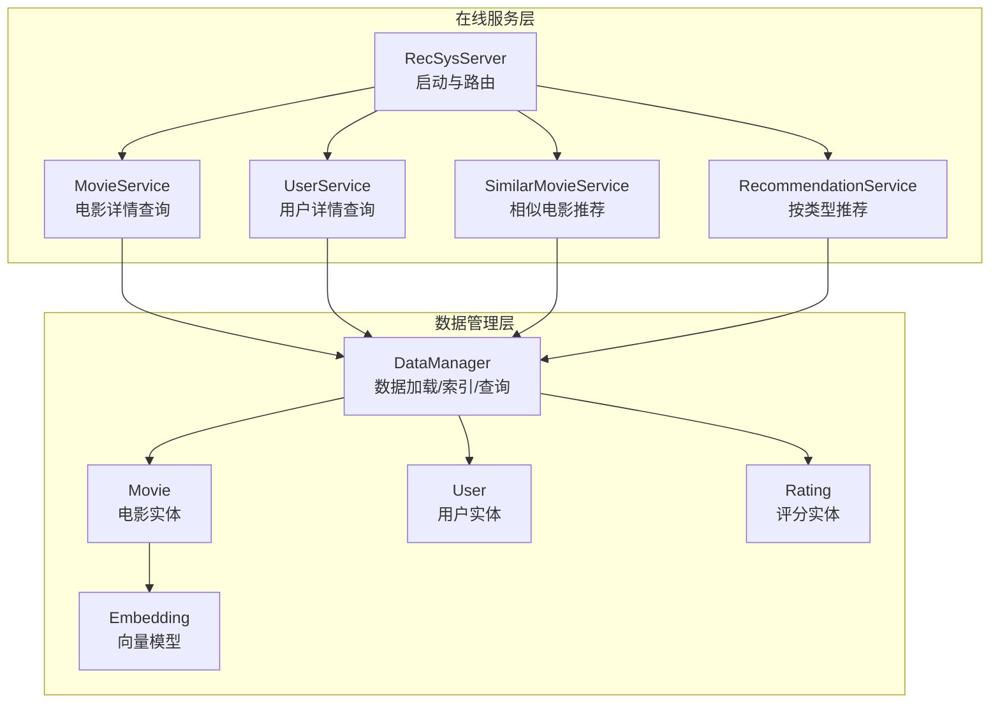
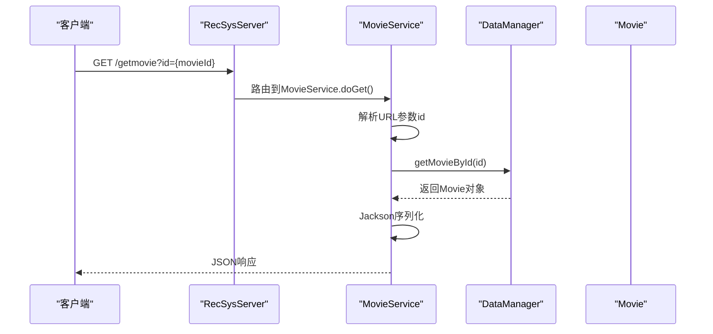
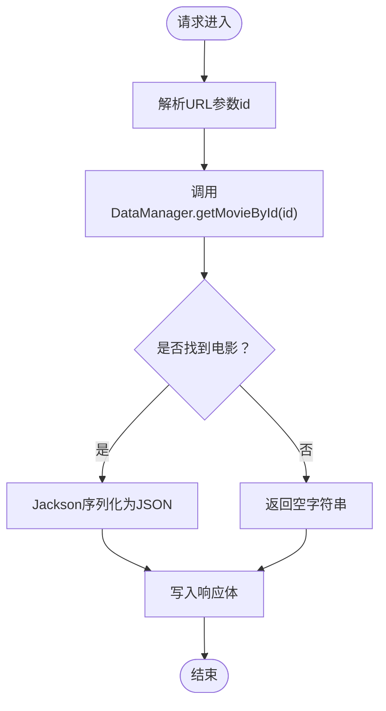
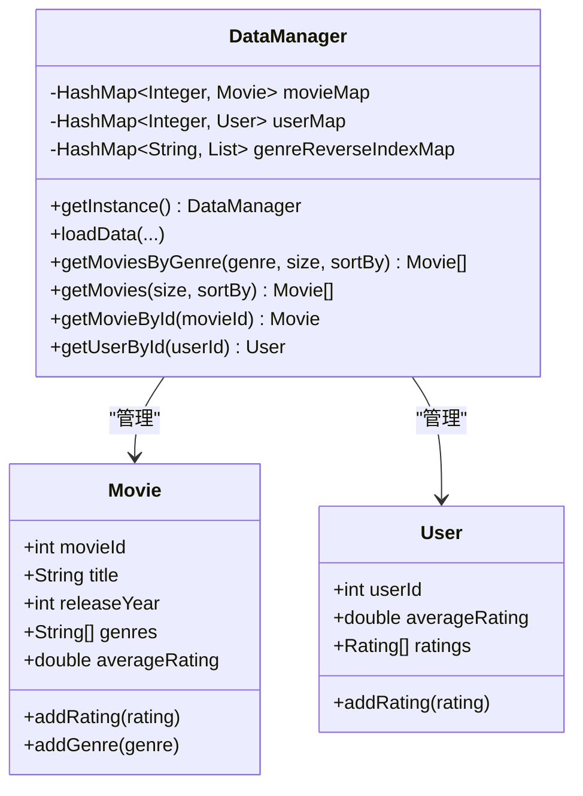
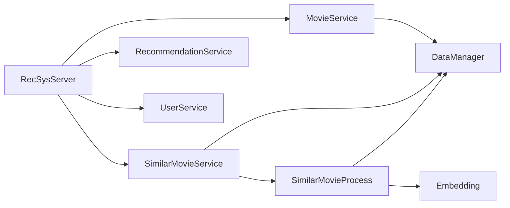
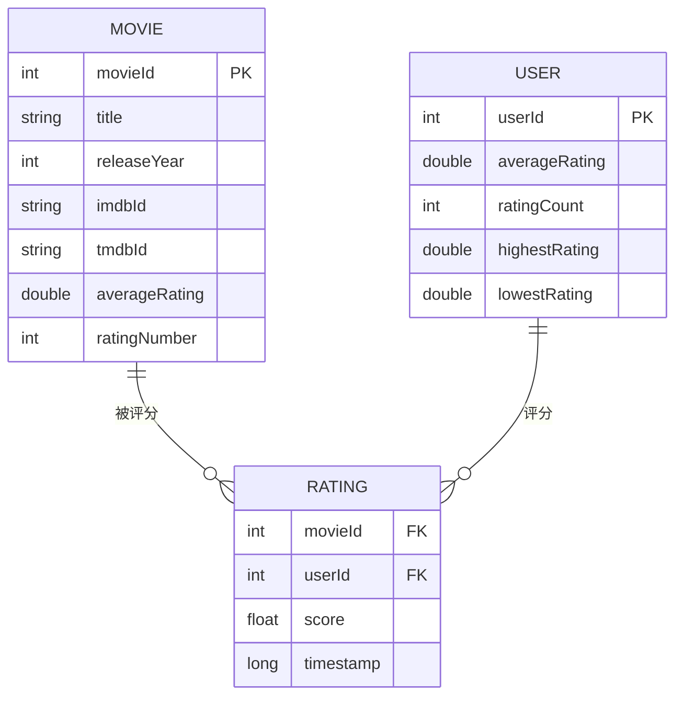

# MovieService电影信息服务

<cite>
**本文档引用的文件**
- [MovieService.java](file://src/main/java/com/sparrowrecsys/online/service/MovieService.java)
- [DataManager.java](file://src/main/java/com/sparrowrecsys/online/datamanager/DataManager.java)
- [Movie.java](file://src/main/java/com/sparrowrecsys/online/datamanager/Movie.java)
- [RecSysServer.java](file://src/main/java/com/sparrowrecsys/online/RecSysServer.java)
- [Config.java](file://src/main/java/com/sparrowrecsys/online/util/Config.java)
- [Utility.java](file://src/main/java/com/sparrowrecsys/online/util/Utility.java)
- [Rating.java](file://src/main/java/com/sparrowrecsys/online/datamanager/Rating.java)
- [User.java](file://src/main/java/com/sparrowrecsys/online/datamanager/User.java)
- [Embedding.java](file://src/main/java/com/sparrowrecsys/online/model/Embedding.java)
- [SimilarMovieService.java](file://src/main/java/com/sparrowrecsys/online/service/SimilarMovieService.java)
- [RecommendationService.java](file://src/main/java/com/sparrowrecsys/online/service/RecommendationService.java)
- [UserService.java](file://src/main/java/com/sparrowrecsys/online/service/UserService.java)
- [SimilarMovieProcess.java](file://src/main/java/com/sparrowrecsys/online/recprocess/SimilarMovieProcess.java)
- [HttpClient.java](file://src/main/java/com/sparrowrecsys/online/util/HttpClient.java)
- [movies.csv](file://src/main/resources/webroot/sampledata/movies.csv)
</cite>

## 目录
1. [简介](#简介)
2. [项目结构](#项目结构)
3. [核心组件](#核心组件)
4. [架构总览](#架构总览)
5. [详细组件分析](#详细组件分析)
6. [依赖关系分析](#依赖关系分析)
7. [性能考虑](#性能考虑)
8. [故障排除指南](#故障排除指南)
9. [结论](#结论)
10. [附录](#附录)

## 简介
本文件系统性阐述MovieService电影信息服务的设计与实现，覆盖以下关键主题：
- 电影信息查询机制：基于电影ID的单条查询、电影详情获取、电影列表分页（通过推荐与筛选服务）
- 与DataManager的数据交互模式：内存级数据加载、索引构建与查询
- 缓存策略与性能优化：内存缓存、排序与候选集生成、相似度计算
- 完整API接口文档：请求参数、响应格式、错误码说明
- 扩展指南：新增查询功能、自定义筛选条件、搜索功能实现
- 数据一致性、并发访问处理与最佳实践

## 项目结构
在线推荐系统采用Jetty嵌入式服务器，通过Servlet绑定不同业务服务，数据由DataManager统一管理。

**图表来源**
- [RecSysServer.java](file://src/main/java/com/sparrowrecsys/online/RecSysServer.java#L64-L70)
- [MovieService.java](file://src/main/java/com/sparrowrecsys/online/service/MovieService.java#L16-L45)
- [DataManager.java](file://src/main/java/com/sparrowrecsys/online/datamanager/DataManager.java#L13-L50)
- [Movie.java](file://src/main/java/com/sparrowrecsys/online/datamanager/Movie.java#L15-L51)
- [User.java](file://src/main/java/com/sparrowrecsys/online/datamanager/User.java#L14-L35)
- [Rating.java](file://src/main/java/com/sparrowrecsys/online/datamanager/Rating.java#L6-L11)
- [Embedding.java](file://src/main/java/com/sparrowrecsys/online/model/Embedding.java#L8-L18)

**章节来源**
- [RecSysServer.java](file://src/main/java/com/sparrowrecsys/online/RecSysServer.java#L27-L78)

## 核心组件
- MovieService：提供电影详情查询的HTTP接口，基于URL参数id从DataManager获取电影对象并序列化为JSON返回。
- DataManager：单例数据管理器，负责从CSV文件加载电影、链接、评分等数据，构建内存索引（如流派反向索引），并提供查询方法。
- Movie：电影实体，包含基础属性、评分统计、流派集合、嵌入向量、特征字典等。
- RecSysServer：启动Jetty服务器，加载数据并注册各Servlet路由。

**章节来源**
- [MovieService.java](file://src/main/java/com/sparrowrecsys/online/service/MovieService.java#L16-L45)
- [DataManager.java](file://src/main/java/com/sparrowrecsys/online/datamanager/DataManager.java#L13-L50)
- [Movie.java](file://src/main/java/com/sparrowrecsys/online/datamanager/Movie.java#L15-L51)
- [RecSysServer.java](file://src/main/java/com/sparrowrecsys/online/RecSysServer.java#L64-L70)

## 架构总览
MovieService作为入口，调用DataManager的getMovieById方法获取电影对象；Movie对象内部维护评分、流派、嵌入等信息，最终通过Jackson序列化为JSON响应客户端。

**图表来源**
- [RecSysServer.java](file://src/main/java/com/sparrowrecsys/online/RecSysServer.java#L64-L70)
- [MovieService.java](file://src/main/java/com/sparrowrecsys/online/service/MovieService.java#L17-L44)
- [DataManager.java](file://src/main/java/com/sparrowrecsys/online/datamanager/DataManager.java#L285-L288)
- [Movie.java](file://src/main/java/com/sparrowrecsys/online/datamanager/Movie.java#L15-L51)

## 详细组件分析

### MovieService电影信息服务
- 功能职责：接收GET请求，解析id参数，调用DataManager获取电影，序列化后返回JSON。
- 错误处理：捕获异常并返回空字符串，确保HTTP状态正常但内容为空。
- 响应头：设置JSON类型、字符集、跨域允许。

**图表来源**
- [MovieService.java](file://src/main/java/com/sparrowrecsys/online/service/MovieService.java#L17-L44)

**章节来源**
- [MovieService.java](file://src/main/java/com/sparrowrecsys/online/service/MovieService.java#L16-L45)

### DataManager数据管理器
- 单例模式：双重检查锁定实现线程安全的实例获取。
- 数据加载：从movies.csv、links.csv、ratings.csv加载基础数据；支持从文件或Redis加载嵌入与特征。
- 索引构建：流派反向索引用于快速按类型检索；评分聚合在Movie中完成。
- 查询接口：按类型获取TopN电影、按ID获取电影、按ID获取用户。

**图表来源**
- [DataManager.java](file://src/main/java/com/sparrowrecsys/online/datamanager/DataManager.java#L13-L50)
- [Movie.java](file://src/main/java/com/sparrowrecsys/online/datamanager/Movie.java#L15-L51)
- [User.java](file://src/main/java/com/sparrowrecsys/online/datamanager/User.java#L14-L35)

**章节来源**
- [DataManager.java](file://src/main/java/com/sparrowrecsys/online/datamanager/DataManager.java#L13-L295)

### Movie电影实体
- 属性：电影ID、标题、上映年份、IMDB/TMDb标识、流派列表、评分统计、嵌入向量、特征字典。
- 行为：动态维护平均分、评分数量、Top评分列表；提供添加评分与流派的方法。

**章节来源**
- [Movie.java](file://src/main/java/com/sparrowrecsys/online/datamanager/Movie.java#L15-L158)

### 相关服务与扩展
- SimilarMovieService：基于相似度模型（默认、嵌入）返回相似电影列表。
- RecommendationService：按类型与排序规则返回TopN电影。
- UserService：按用户ID返回用户信息。

**章节来源**
- [SimilarMovieService.java](file://src/main/java/com/sparrowrecsys/online/service/SimilarMovieService.java#L16-L45)
- [RecommendationService.java](file://src/main/java/com/sparrowrecsys/online/service/RecommendationService.java#L18-L47)
- [UserService.java](file://src/main/java/com/sparrowrecsys/online/service/UserService.java#L15-L44)

## 依赖关系分析
- MovieService依赖DataManager进行数据查询。
- RecSysServer负责启动与路由，注册各Servlet。
- SimilarMovieProcess提供相似度计算与候选生成逻辑，供SimilarMovieService使用。
- Embedding提供向量相似度计算能力。

**图表来源**
- [MovieService.java](file://src/main/java/com/sparrowrecsys/online/service/MovieService.java#L3-L5)
- [RecSysServer.java](file://src/main/java/com/sparrowrecsys/online/RecSysServer.java#L64-L70)
- [SimilarMovieProcess.java](file://src/main/java/com/sparrowrecsys/online/recprocess/SimilarMovieProcess.java#L11-L32)
- [Embedding.java](file://src/main/java/com/sparrowrecsys/online/model/Embedding.java#L32-L47)

**章节来源**
- [RecSysServer.java](file://src/main/java/com/sparrowrecsys/online/RecSysServer.java#L64-L70)
- [SimilarMovieProcess.java](file://src/main/java/com/sparrowrecsys/online/recprocess/SimilarMovieProcess.java#L11-L174)

## 性能考虑
- 内存数据结构：HashMap提供O(1)级别的查找；排序在内存中完成，时间复杂度取决于排序算法。
- 流派反向索引：通过genreReverseIndexMap实现按类型快速检索，避免全表扫描。
- 排序策略：支持按平均分与上映年份排序，排序后截取前N条。
- 嵌入与特征：支持从文件或Redis加载嵌入与特征，减少重复I/O。
- 相似度计算：Embedding.calculateSimilarity提供余弦相似度计算，适合高维稀疏向量场景。
- 并发访问：DataManager单例通过同步块保护实例创建，查询方法未显式加锁，需注意线程安全。

**章节来源**
- [DataManager.java](file://src/main/java/com/sparrowrecsys/online/datamanager/DataManager.java#L252-L283)
- [Embedding.java](file://src/main/java/com/sparrowrecsys/online/model/Embedding.java#L32-L47)

## 故障排除指南
- 无结果返回：当传入的电影ID不存在时，MovieService返回空字符串；建议前端检测响应内容长度。
- 异常处理：捕获异常并返回空字符串，便于前端统一处理；可在日志中记录异常堆栈以定位问题。
- 跨域问题：响应头已设置Access-Control-Allow-Origin为*，若仍出现跨域，请检查浏览器控制台与网络面板。
- 数据加载失败：确认movies.csv、links.csv、ratings.csv路径正确且可读；检查文件编码与字段分隔符。

**章节来源**
- [MovieService.java](file://src/main/java/com/sparrowrecsys/online/service/MovieService.java#L40-L44)

## 结论
MovieService通过简洁的Servlet接口与DataManager的高效内存查询，实现了低延迟的电影信息服务。结合相似度计算与类型筛选，系统具备良好的扩展性与性能表现。建议在生产环境中引入缓存层与限流策略，并对异常进行更细粒度的分类处理。

## 附录

### API接口文档

- 电影详情查询
  - 方法：GET
  - 路径：/getmovie
  - 参数：
    - id：电影ID（整数）
  - 成功响应：JSON格式的电影对象
  - 失败响应：空字符串
  - 示例：
    - 请求：GET /getmovie?id=1
    - 响应：包含电影ID、标题、上映年份、流派、评分统计等字段的JSON对象

- 相似电影推荐
  - 方法：GET
  - 路径：/getsimilarmovie
  - 参数：
    - movieId：输入电影ID（整数）
    - size：返回数量（整数）
    - model：相似度模型（字符串，如"emb"表示嵌入相似度，默认为通用相似度）
  - 成功响应：JSON格式的电影数组
  - 失败响应：空字符串

- 按类型推荐
  - 方法：GET
  - 路径：/getrecommendation
  - 参数：
    - genre：电影类型（字符串）
    - size：返回数量（整数）
    - sortby：排序方式（字符串，如"rating"或"releaseYear"）
  - 成功响应：JSON格式的电影数组
  - 失败响应：空字符串

- 用户详情查询
  - 方法：GET
  - 路径：/getuser
  - 参数：
    - id：用户ID（整数）
  - 成功响应：JSON格式的用户对象
  - 失败响应：空字符串

- 错误码说明
  - 200：成功
  - 500：服务器内部错误（异常被捕获并返回空字符串）

**章节来源**
- [MovieService.java](file://src/main/java/com/sparrowrecsys/online/service/MovieService.java#L17-L44)
- [SimilarMovieService.java](file://src/main/java/com/sparrowrecsys/online/service/SimilarMovieService.java#L17-L44)
- [RecommendationService.java](file://src/main/java/com/sparrowrecsys/online/service/RecommendationService.java#L19-L46)
- [UserService.java](file://src/main/java/com/sparrowrecsys/online/service/UserService.java#L16-L43)

### 数据模型与字段说明

**图表来源**
- [Movie.java](file://src/main/java/com/sparrowrecsys/online/datamanager/Movie.java#L15-L51)
- [User.java](file://src/main/java/com/sparrowrecsys/online/datamanager/User.java#L14-L35)
- [Rating.java](file://src/main/java/com/sparrowrecsys/online/datamanager/Rating.java#L6-L11)

### 扩展与最佳实践

- 新增电影查询功能
  - 在DataManager中增加新的查询方法（如按年份范围、按IMDB/TMDb ID查询），并在对应Servlet中暴露REST接口。
  - 注意：新增查询需考虑索引与缓存策略，避免全表扫描。

- 自定义电影筛选条件
  - 可在DataManager中扩展过滤逻辑（如按评分阈值、流派交集/并集），SimilarMovieProcess中可复用候选生成与排序流程。

- 实现电影搜索功能
  - 当前系统未提供全文搜索，可通过在Movie中维护标题索引或引入搜索引擎（如Elasticsearch）实现模糊匹配与排序。
  - 建议：先在内存中做预过滤，再交由搜索引擎处理高精度匹配。

- 数据一致性与并发
  - DataManager单例在实例创建阶段已加锁；查询方法未加锁，若需要强一致读，可在查询前加读锁或使用不可变快照。
  - 建议：对外提供只读接口，避免并发修改共享状态。

- 性能优化建议
  - 使用流式处理与分页：大数据量时采用分页与游标，避免一次性加载全部数据。
  - 合理缓存：对热点电影详情与热门类型TopN结果进行缓存，降低重复计算。
  - 异步处理：对耗时操作（如远程模型预测）采用异步客户端（参考HttpClient），提升吞吐。

**章节来源**
- [DataManager.java](file://src/main/java/com/sparrowrecsys/online/datamanager/DataManager.java#L285-L288)
- [SimilarMovieProcess.java](file://src/main/java/com/sparrowrecsys/online/recprocess/SimilarMovieProcess.java#L121-L137)
- [HttpClient.java](file://src/main/java/com/sparrowrecsys/online/util/HttpClient.java#L21-L40)