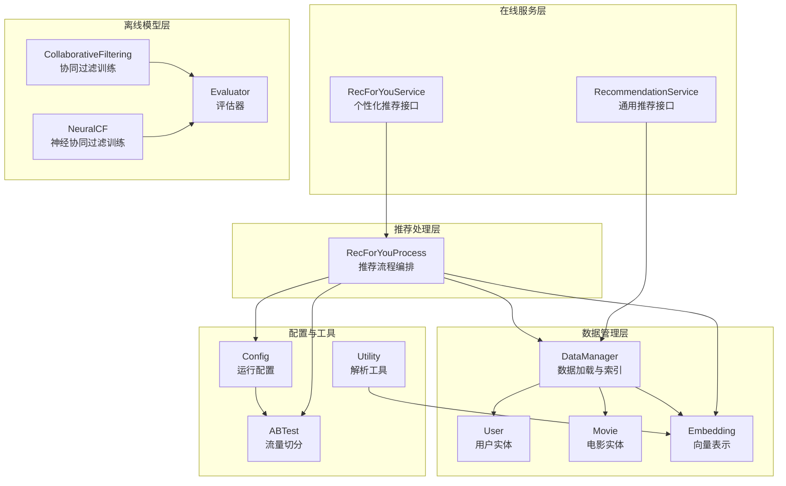
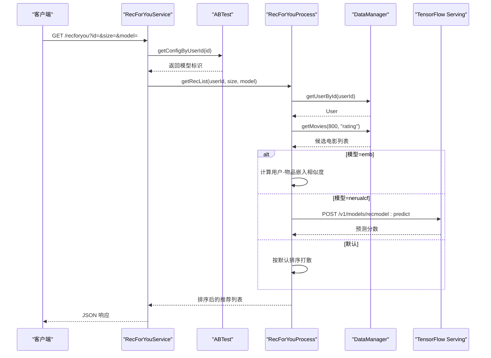
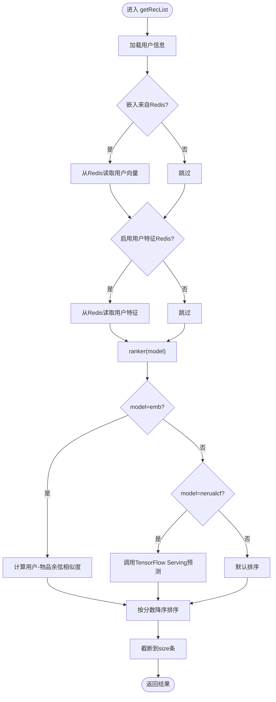
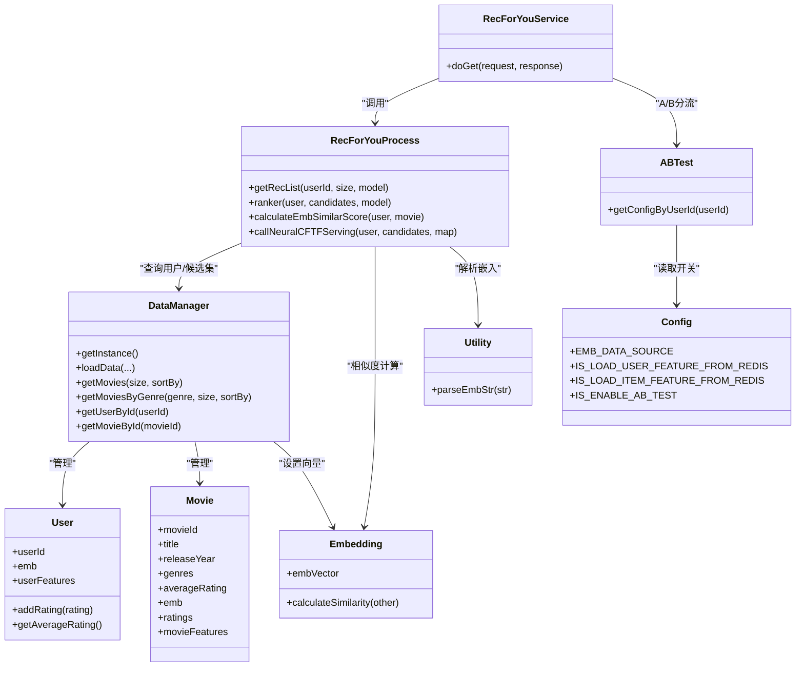

# RecForYouService个性化推荐服务

<cite>
**本文档引用的文件**
- [RecForYouService.java](file://src/main/java/com/sparrowrecsys/online/service/RecForYouService.java)
- [RecForYouProcess.java](file://src/main/java/com/sparrowrecsys/online/recprocess/RecForYouProcess.java)
- [RecommendationService.java](file://src/main/java/com/sparrowrecsys/online/service/RecommendationService.java)
- [DataManager.java](file://src/main/java/com/sparrowrecsys/online/datamanager/DataManager.java)
- [User.java](file://src/main/java/com/sparrowrecsys/online/datamanager/User.java)
- [Movie.java](file://src/main/java/com/sparrowrecsys/online/datamanager/Movie.java)
- [Embedding.java](file://src/main/java/com/sparrowrecsys/online/model/Embedding.java)
- [ABTest.java](file://src/main/java/com/sparrowrecsys/online/util/ABTest.java)
- [Config.java](file://src/main/java/com/sparrowrecsys/online/util/Config.java)
- [Utility.java](file://src/main/java/com/sparrowrecsys/online/util/Utility.java)
- [CollaborativeFiltering.scala](file://src/main/java/com/sparrowrecsys/offline/spark/model/CollaborativeFiltering.scala)
- [Evaluator.scala](file://src/main/java/com/sparrowrecsys/offline/spark/evaluate/Evaluator.scala)
- [NeuralCF.py](file://TFRecModel/src/com/sparrowrecsys/offline/tensorflow/NeuralCF.py)
- [README.md](file://README.md)
</cite>

## 目录
1. [简介](#简介)
2. [项目结构](#项目结构)
3. [核心组件](#核心组件)
4. [架构总览](#架构总览)
5. [详细组件分析](#详细组件分析)
6. [依赖关系分析](#依赖关系分析)
7. [性能考虑](#性能考虑)
8. [故障排除指南](#故障排除指南)
9. [结论](#结论)
10. [附录](#附录)

## 简介
本文件为 RecForYouService 个性化推荐服务的综合技术文档，聚焦于“为你推荐”场景下的算法实现与工程化落地。文档从系统架构、核心组件、算法原理、API 设计、A/B 测试与实时调整、质量评估、冷启动与多样性保障等方面进行全面阐述，并提供可扩展的集成指南。

## 项目结构
项目采用多语言混合架构：Java/Scala 负责离线模型训练与评估、在线服务与数据管理；Python/TensorFlow 提供深度学习模型训练脚本；前端通过 Jetty 提供简单页面与交互。

图表来源
- [RecForYouService.java](file://src/main/java/com/sparrowrecsys/online/service/RecForYouService.java#L20-L55)
- [RecForYouProcess.java](file://src/main/java/com/sparrowrecsys/online/recprocess/RecForYouProcess.java#L20-L140)
- [DataManager.java](file://src/main/java/com/sparrowrecsys/online/datamanager/DataManager.java#L13-L295)
- [ABTest.java](file://src/main/java/com/sparrowrecsys/online/util/ABTest.java#L3-L28)
- [Config.java](file://src/main/java/com/sparrowrecsys/online/util/Config.java#L3-L14)
- [CollaborativeFiltering.scala](file://src/main/java/com/sparrowrecsys/offline/spark/model/CollaborativeFiltering.scala#L10-L85)
- [Evaluator.scala](file://src/main/java/com/sparrowrecsys/offline/spark/evaluate/Evaluator.scala#L7-L22)
- [NeuralCF.py](file://TFRecModel/src/com/sparrowrecsys/offline/tensorflow/NeuralCF.py#L1-L106)

章节来源
- [README.md](file://README.md#L1-L57)

## 核心组件
- RecForYouService：对外提供个性化推荐 REST 接口，支持用户 ID、返回数量、算法模型参数，内置可选的 A/B 流量切分。
- RecForYouProcess：个性化推荐的核心处理逻辑，负责候选集生成、用户画像加载、相似度计算或模型推理、结果排序。
- DataManager：单例数据管理器，负责从文件或 Redis 加载电影、用户、评分、嵌入向量与特征，维护按类型排序的候选集。
- Embedding：向量表示与余弦相似度计算工具类，支撑基于嵌入的协同过滤。
- ABTest：基于用户 ID 的简单哈希分流，支持 A/B 实验切换不同模型。
- Config：全局配置开关，控制嵌入数据源、是否启用 A/B、是否从 Redis 加载用户/物品特征等。
- RecommendationService：通用推荐接口（按类别与排序字段返回），用于对比与验证。

章节来源
- [RecForYouService.java](file://src/main/java/com/sparrowrecsys/online/service/RecForYouService.java#L20-L55)
- [RecForYouProcess.java](file://src/main/java/com/sparrowrecsys/online/recprocess/RecForYouProcess.java#L20-L140)
- [DataManager.java](file://src/main/java/com/sparrowrecsys/online/datamanager/DataManager.java#L13-L295)
- [Embedding.java](file://src/main/java/com/sparrowrecsys/online/model/Embedding.java#L8-L49)
- [ABTest.java](file://src/main/java/com/sparrowrecsys/online/util/ABTest.java#L3-L28)
- [Config.java](file://src/main/java/com/sparrowrecsys/online/util/Config.java#L3-L14)
- [RecommendationService.java](file://src/main/java/com/sparrowrecsys/online/service/RecommendationService.java#L18-L48)

## 架构总览
个性化推荐服务的请求链路如下：

图表来源
- [RecForYouService.java](file://src/main/java/com/sparrowrecsys/online/service/RecForYouService.java#L21-L53)
- [RecForYouProcess.java](file://src/main/java/com/sparrowrecsys/online/recprocess/RecForYouProcess.java#L29-L92)
- [ABTest.java](file://src/main/java/com/sparrowrecsys/online/util/ABTest.java#L11-L26)

## 详细组件分析

### RecForYouService 个性化推荐接口
- 功能：接收用户 ID、返回条数、模型标识，返回 JSON 格式的推荐电影列表。
- 参数：
  - id：用户 ID（整数）
  - size：返回数量（整数）
  - model：推荐模型标识（字符串，如 emb、nerualcf 或默认）
- A/B 流量：当启用时，根据用户 ID 哈希分流至不同模型桶。
- 错误处理：异常捕获并返回空字符串，便于前端容错。

章节来源
- [RecForYouService.java](file://src/main/java/com/sparrowrecsys/online/service/RecForYouService.java#L21-L53)
- [ABTest.java](file://src/main/java/com/sparrowrecsys/online/util/ABTest.java#L11-L26)

### RecForYouProcess 推荐流程编排
- 候选集生成：从 DataManager 获取高分电影集合（固定大小），作为初始候选池。
- 用户画像加载：
  - 若嵌入数据源为 Redis，则从 Redis 拉取用户向量并注入 User。
  - 可选从 Redis 加载用户特征字典。
- 排序策略：
  - emb：基于用户向量与物品向量的余弦相似度。
  - nerualcf：调用 TensorFlow Serving 进行模型推理，使用预测分数排序。
  - 默认：按候选集顺序打散（用于兜底或对照）。
- 结果截断：返回前 size 条。

图表来源
- [RecForYouProcess.java](file://src/main/java/com/sparrowrecsys/online/recprocess/RecForYouProcess.java#L29-L92)
- [RecForYouProcess.java](file://src/main/java/com/sparrowrecsys/online/recprocess/RecForYouProcess.java#L113-L138)

章节来源
- [RecForYouProcess.java](file://src/main/java/com/sparrowrecsys/online/recprocess/RecForYouProcess.java#L29-L140)

### DataManager 数据管理与候选集
- 单例模式：全局唯一实例，避免重复加载。
- 数据加载：
  - 电影元数据、链接、评分、嵌入向量、特征（支持文件与 Redis）。
  - 支持从 Redis 批量加载电影/用户嵌入与特征。
- 候选集接口：
  - getMovies(size, sortBy)：按平均分或上映年份排序返回前 N 个电影。
  - getMoviesByGenre(genre, size, sortBy)：按类别与排序字段返回电影列表。
- 用户画像：通过评分统计计算平均分、最高/最低评分、评分次数等。

章节来源
- [DataManager.java](file://src/main/java/com/sparrowrecsys/online/datamanager/DataManager.java#L13-L295)

### Embedding 向量与相似度
- 向量结构：浮点数组。
- 相似度：余弦相似度，维度不一致或为空时返回无效值。
- 用途：支撑用户-物品相似度计算，作为 emb 模型的核心。

章节来源
- [Embedding.java](file://src/main/java/com/sparrowrecsys/online/model/Embedding.java#L8-L49)

### ABTest 流量切分
- 切分依据：用户 ID 的哈希模常数，分为多个桶。
- 模型映射：桶 A → emb，桶 B → nerualcf，默认 → emb。
- 开关：由 Config 控制是否启用。

章节来源
- [ABTest.java](file://src/main/java/com/sparrowrecsys/online/util/ABTest.java#L3-L28)
- [Config.java](file://src/main/java/com/sparrowrecsys/online/util/Config.java#L11-L11)

### RecommendationService 通用推荐接口
- 功能：按类别与排序字段返回电影列表，便于与个性化推荐对比。
- 参数：genre、size、sortby（如 rating、releaseYear）。

章节来源
- [RecommendationService.java](file://src/main/java/com/sparrowrecsys/online/service/RecommendationService.java#L18-L48)

### 离线模型与评估
- 协同过滤（ALS）：Spark ML 使用 MovieLens 数据训练，输出用户/物品因子，支持推荐与评估。
- 评估器：二分类 AUC（ROC/PR）。
- 神经协同过滤（NeuralCF）：Keras 定义双塔嵌入+MLP 架构，保存为 SavedModel 供 TensorFlow Serving 使用。

章节来源
- [CollaborativeFiltering.scala](file://src/main/java/com/sparrowrecsys/offline/spark/model/CollaborativeFiltering.scala#L10-L85)
- [Evaluator.scala](file://src/main/java/com/sparrowrecsys/offline/spark/evaluate/Evaluator.scala#L7-L22)
- [NeuralCF.py](file://TFRecModel/src/com/sparrowrecsys/offline/tensorflow/NeuralCF.py#L44-L106)

## 依赖关系分析

图表来源
- [RecForYouService.java](file://src/main/java/com/sparrowrecsys/online/service/RecForYouService.java#L20-L55)
- [RecForYouProcess.java](file://src/main/java/com/sparrowrecsys/online/recprocess/RecForYouProcess.java#L20-L140)
- [DataManager.java](file://src/main/java/com/sparrowrecsys/online/datamanager/DataManager.java#L13-L295)
- [User.java](file://src/main/java/com/sparrowrecsys/online/datamanager/User.java#L14-L115)
- [Movie.java](file://src/main/java/com/sparrowrecsys/online/datamanager/Movie.java#L15-L158)
- [Embedding.java](file://src/main/java/com/sparrowrecsys/online/model/Embedding.java#L8-L49)
- [ABTest.java](file://src/main/java/com/sparrowrecsys/online/util/ABTest.java#L3-L28)
- [Config.java](file://src/main/java/com/sparrowrecsys/online/util/Config.java#L3-L14)
- [Utility.java](file://src/main/java/com/sparrowrecsys/online/util/Utility.java#L5-L15)

## 性能考虑
- 候选集规模：固定较大候选集（如 800）以提升召回覆盖率，排序后再截断，平衡召回与效率。
- 向量化相似度：余弦相似度计算在内存中完成，适合中小规模候选集；大规模场景建议引入近似最近邻（ANN）加速。
- 模型推理：神经协同过滤通过异步 HTTP 请求调用 TensorFlow Serving，注意超时与重试策略。
- 缓存与预热：用户向量与特征可从 Redis 预加载，减少 IO；模型服务需保持稳定与弹性伸缩。
- 排序复杂度：当前为 O(n log n)，可结合索引与分片策略优化。

## 故障排除指南
- 推荐为空：
  - 用户不存在：检查用户 ID 是否正确，确认 DataManager 已加载用户数据。
  - 嵌入为空：确认嵌入数据源配置与 Redis 键是否存在。
- 模型推理失败：
  - 检查 TensorFlow Serving 地址与端口是否可达，请求体格式是否符合预期。
- A/B 分流异常：
  - 确认 Config 中 IS_ENABLE_AB_TEST 开关状态，以及 ABTest 的哈希桶划分。
- 排序异常：
  - 确认 sortBy 参数与候选集是否匹配，必要时回退到默认排序。

章节来源
- [RecForYouService.java](file://src/main/java/com/sparrowrecsys/online/service/RecForYouService.java#L49-L52)
- [RecForYouProcess.java](file://src/main/java/com/sparrowrecsys/online/recprocess/RecForYouProcess.java#L113-L138)
- [ABTest.java](file://src/main/java/com/sparrowrecsys/online/util/ABTest.java#L11-L26)
- [Config.java](file://src/main/java/com/sparrowrecsys/online/util/Config.java#L7-L11)

## 结论
RecForYouService 将离线训练的协同过滤与深度学习模型无缝接入在线服务，结合用户画像与嵌入相似度，实现了可扩展、可实验的个性化推荐能力。通过 A/B 测试与配置开关，系统具备灵活的算法选择与实时调整能力。建议后续引入更高效的相似度计算与排序策略、完善的监控与评估体系，以及多样性和公平性保障机制。

## 附录

### 个性化推荐 API 文档
- 接口路径：GET /recforyou
- 请求参数：
  - id：用户 ID（整数）
  - size：返回数量（整数）
  - model：算法模型（字符串，可选值：emb、nerualcf；默认按 A/B 或默认策略）
- 响应：JSON 数组，元素为电影对象（包含 ID、标题、评分、标签等字段）
- 示例：/recforyou?id=1&size=10&model=emb

章节来源
- [RecForYouService.java](file://src/main/java/com/sparrowrecsys/online/service/RecForYouService.java#L31-L47)

### 算法选择逻辑与权重分配
- 选择逻辑：
  - 当启用 A/B 时，按用户 ID 哈希分流至不同模型桶；否则使用默认模型。
- 权重分配：
  - 当前实现未显式加权融合多路信号；若需融合，可在 ranker 中对不同分数进行加权聚合后统一排序。
- 实时个性化调整：
  - 可通过动态配置开关、Redis 特征注入、模型热更新等方式实现。

章节来源
- [ABTest.java](file://src/main/java/com/sparrowrecsys/online/util/ABTest.java#L11-L26)
- [RecForYouProcess.java](file://src/main/java/com/sparrowrecsys/online/recprocess/RecForYouProcess.java#L69-L92)

### 集成新推荐算法步骤
- 新增模型标识：在 ranker 中新增 case 分支。
- 数据准备：确保用户/物品向量或特征已加载到内存或 Redis。
- 推理对接：如需远程推理，封装 HTTP 请求并解析响应。
- A/B 配置：在 ABTest 中增加新桶映射，或通过配置中心动态下发。

章节来源
- [RecForYouProcess.java](file://src/main/java/com/sparrowrecsys/online/recprocess/RecForYouProcess.java#L69-L92)
- [ABTest.java](file://src/main/java/com/sparrowrecsys/online/util/ABTest.java#L11-L26)

### A/B 测试与用户反馈
- A/B 流量：基于用户 ID 的哈希分流，支持快速对比不同模型效果。
- 用户反馈：可扩展埋点上报点击、观看时长、评分等信号，驱动在线重排与模型再训练。

章节来源
- [ABTest.java](file://src/main/java/com/sparrowrecsys/online/util/ABTest.java#L11-L26)

### 推荐质量评估指标
- 离线评估：ALS 使用回归 RMSE；二分类 AUC（ROC/PR）由 Evaluator 计算。
- 在线评估：可通过点击率、转化率、停留时长、多样性、覆盖率等指标持续监控。

章节来源
- [CollaborativeFiltering.scala](file://src/main/java/com/sparrowrecsys/offline/spark/model/CollaborativeFiltering.scala#L47-L52)
- [Evaluator.scala](file://src/main/java/com/sparrowrecsys/offline/spark/evaluate/Evaluator.scala#L16-L19)

### 冷启动与多样性保障
- 冷启动：
  - 新用户：可采用热门榜兜底或默认排序；结合基础特征（如注册时间、地域）做粗排。
  - 新物品：基于内容特征（标签、年份）与热门度进行曝光。
- 多样性：
  - 在候选阶段引入标签/导演/演员等维度去重或采样；在排序阶段加入多样性惩罚项。

### 用户画像构建要点
- 基础统计：平均评分、最高/最低评分、评分次数。
- 行为序列：TopN 评分列表可用于兴趣演化建模（可扩展）。
- 特征来源：评分、嵌入向量、Redis 特征字典。

章节来源
- [User.java](file://src/main/java/com/sparrowrecsys/online/datamanager/User.java#L53-L65)
- [Movie.java](file://src/main/java/com/sparrowrecsys/online/datamanager/Movie.java#L93-L116)
- [DataManager.java](file://src/main/java/com/sparrowrecsys/online/datamanager/DataManager.java#L271-L283)