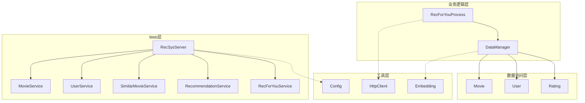
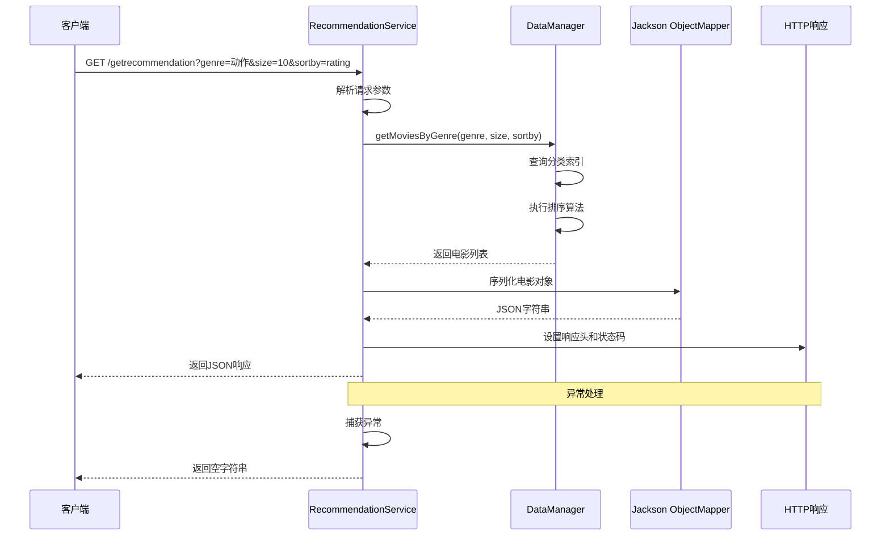
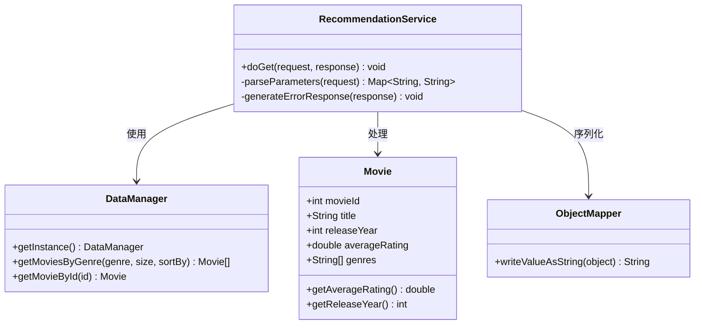
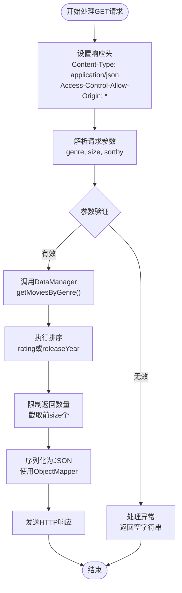
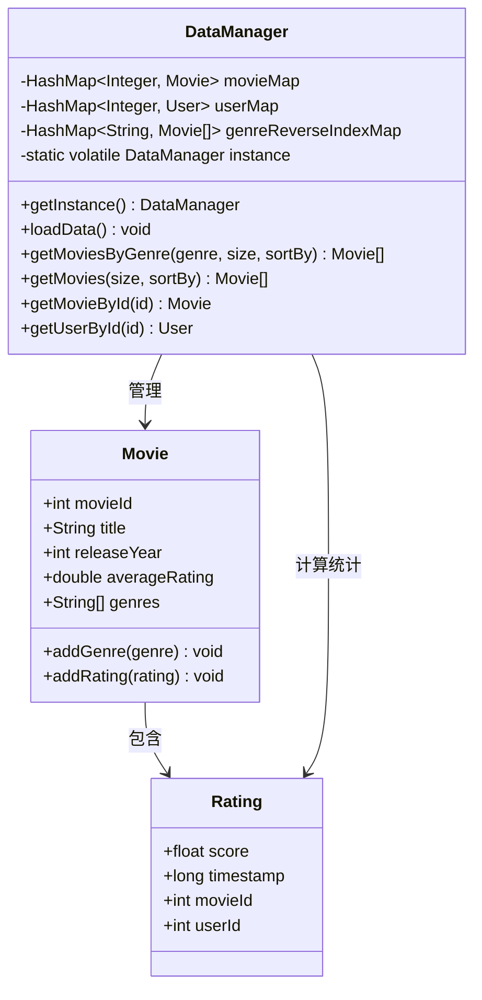
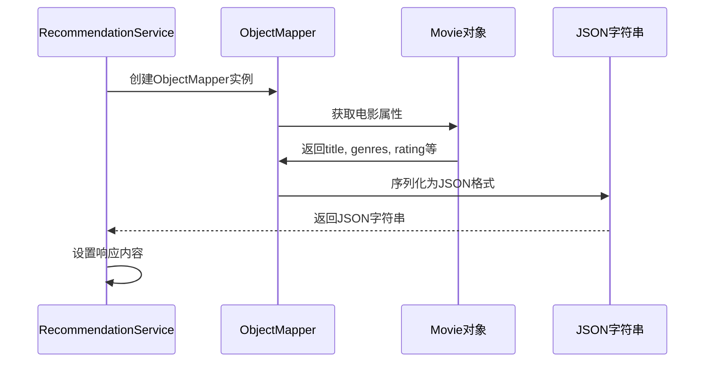
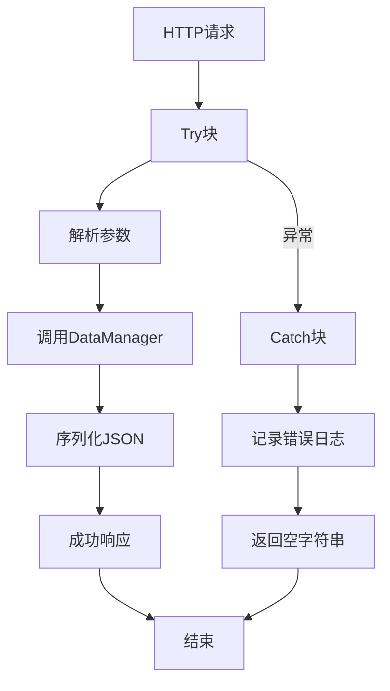
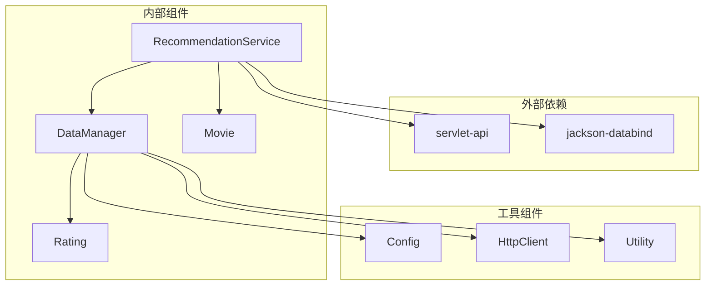

# RecommendationService通用推荐服务

<cite>
**本文档引用的文件**
- [RecommendationService.java](file://src/main/java/com/sparrowrecsys/online/service/RecommendationService.java)
- [DataManager.java](file://src/main/java/com/sparrowrecsys/online/datamanager/DataManager.java)
- [Movie.java](file://src/main/java/com/sparrowrecsys/online/datamanager/Movie.java)
- [RecSysServer.java](file://src/main/java/com/sparrowrecsys/online/RecSysServer.java)
- [RecForYouProcess.java](file://src/main/java/com/sparrowrecsys/online/recprocess/RecForYouProcess.java)
- [MovieService.java](file://src/main/java/com/sparrowrecsys/online/service/MovieService.java)
- [RecForYouService.java](file://src/main/java/com/sparrowrecsys/online/service/RecForYouService.java)
- [Config.java](file://src/main/java/com/sparrowrecsys/online/util/Config.java)
- [HttpClient.java](file://src/main/java/com/sparrowrecsys/online/util/HttpClient.java)
- [Embedding.java](file://src/main/java/com/sparrowrecsys/online/model/Embedding.java)
- [Rating.java](file://src/main/java/com/sparrowrecsys/online/datamanager/Rating.java)
- [RatingListSerializer.java](file://src/main/java/com/sparrowrecsys/online/datamanager/RatingListSerializer.java)
</cite>

## 目录
1. [简介](#简介)
2. [项目结构](#项目结构)
3. [核心组件](#核心组件)
4. [架构概览](#架构概览)
5. [详细组件分析](#详细组件分析)
6. [依赖关系分析](#依赖关系分析)
7. [性能考虑](#性能考虑)
8. [故障排除指南](#故障排除指南)
9. [结论](#结论)
10. [附录](#附录)

## 简介

RecommendationService是SparrowRecSys在线推荐系统中的核心服务类，负责处理基于电影分类的推荐请求。该服务实现了RESTful API接口，支持通过HTTP GET请求获取特定类型的电影推荐列表。服务采用经典的分层架构设计，包括Web层、业务逻辑层和数据访问层，为用户提供个性化的电影推荐体验。

该服务的主要功能包括：
- 接收客户端的推荐请求参数
- 解析和验证输入参数
- 调用数据管理器获取电影数据
- 执行排序算法对电影进行排序
- 生成JSON格式的响应数据
- 处理各种异常情况

## 项目结构

SparrowRecSys项目采用模块化的设计，主要分为以下几个层次：



**图表来源**
- [RecSysServer.java](file://src/main/java/com/sparrowrecsys/online/RecSysServer.java#L63-L70)
- [RecommendationService.java](file://src/main/java/com/sparrowrecsys/online/service/RecommendationService.java#L18-L47)
- [DataManager.java](file://src/main/java/com/sparrowrecsys/online/datamanager/DataManager.java#L13-L37)

**章节来源**
- [RecSysServer.java](file://src/main/java/com/sparrowrecsys/online/RecSysServer.java#L1-L80)

## 核心组件

RecommendationService作为推荐系统的核心组件，承担着以下关键职责：

### 主要职责
1. **HTTP请求处理**：继承自HttpServlet，重写doGet方法处理GET请求
2. **参数解析**：从请求中提取genre、size、sortby三个关键参数
3. **数据获取**：调用DataManager获取指定分类的电影数据
4. **响应生成**：使用Jackson库将电影对象转换为JSON格式
5. **异常处理**：捕获并处理各种运行时异常

### 参数处理机制
服务支持三个核心参数：
- **genre**：电影分类标识符，用于筛选特定类型的电影
- **size**：返回电影的数量限制
- **sortby**：排序算法选择，支持rating和releaseYear两种模式

**章节来源**
- [RecommendationService.java](file://src/main/java/com/sparrowrecsys/online/service/RecommendationService.java#L14-L47)

## 架构概览

RecommendationService在整个推荐系统架构中扮演着关键角色，连接了Web层、业务逻辑层和数据访问层：



**图表来源**
- [RecommendationService.java](file://src/main/java/com/sparrowrecsys/online/service/RecommendationService.java#L19-L46)
- [DataManager.java](file://src/main/java/com/sparrowrecsys/online/datamanager/DataManager.java#L252-L268)

**章节来源**
- [RecommendationService.java](file://src/main/java/com/sparrowrecsys/online/service/RecommendationService.java#L18-L47)
- [DataManager.java](file://src/main/java/com/sparrowrecsys/online/datamanager/DataManager.java#L252-L268)

## 详细组件分析

### RecommendationService类分析

RecommendationService是一个专门的Servlet类，实现了电影推荐的HTTP接口：

#### 类结构图


**图表来源**
- [RecommendationService.java](file://src/main/java/com/sparrowrecsys/online/service/RecommendationService.java#L18-L47)
- [DataManager.java](file://src/main/java/com/sparrowrecsys/online/datamanager/DataManager.java#L252-L268)
- [Movie.java](file://src/main/java/com/sparrowrecsys/online/datamanager/Movie.java#L15-L51)

#### GET请求处理流程

RecommendationService的doGet方法实现了完整的请求处理流程：



**图表来源**
- [RecommendationService.java](file://src/main/java/com/sparrowrecsys/online/service/RecommendationService.java#L19-L46)
- [DataManager.java](file://src/main/java/com/sparrowrecsys/online/datamanager/DataManager.java#L252-L268)

#### 参数解析机制

服务支持三种核心参数的解析和验证：

| 参数名 | 类型 | 必需性 | 描述 | 默认值 |
|--------|------|--------|------|--------|
| genre | String | 可选 | 电影分类标识符 | null |
| size | String | 可选 | 返回电影数量 | 10 |
| sortby | String | 可选 | 排序方式 | rating |

参数解析的具体实现：
1. **genre参数**：直接从请求中获取，支持null值
2. **size参数**：转换为整数，控制返回结果数量
3. **sortby参数**：支持"rating"和"releaseYear"两种排序方式

**章节来源**
- [RecommendationService.java](file://src/main/java/com/sparrowrecsys/online/service/RecommendationService.java#L28-L35)

### DataManager交互模式

RecommendationService与DataManager的交互体现了典型的单例模式和工厂模式：

#### 数据管理器架构


**图表来源**
- [DataManager.java](file://src/main/java/com/sparrowrecsys/online/datamanager/DataManager.java#L13-L37)
- [Movie.java](file://src/main/java/com/sparrowrecsys/online/datamanager/Movie.java#L15-L51)
- [Rating.java](file://src/main/java/com/sparrowrecsys/online/datamanager/Rating.java#L6-L44)

#### 电影分类查询逻辑

DataManager实现了高效的电影分类查询机制：

1. **反向索引构建**：在数据加载时构建分类到电影的反向索引
2. **快速查询**：通过哈希表实现O(1)时间复杂度的分类查询
3. **动态排序**：根据sortby参数动态选择排序策略
4. **智能截断**：根据size参数限制返回结果数量

**章节来源**
- [DataManager.java](file://src/main/java/com/sparrowrecsys/online/datamanager/DataManager.java#L244-L268)

### JSON响应生成过程

服务使用Jackson库实现电影对象到JSON的序列化：

#### 序列化流程


**图表来源**
- [RecommendationService.java](file://src/main/java/com/sparrowrecsys/online/service/RecommendationService.java#L38-L40)

#### 数据模型映射

Movie类的属性映射到JSON输出：

| Java属性 | JSON键名 | 类型 | 描述 |
|----------|----------|------|------|
| movieId | movieId | integer | 电影唯一标识符 |
| title | title | string | 电影标题 |
| releaseYear | releaseYear | integer | 发布年份 |
| averageRating | averageRating | number | 平均评分 |
| genres | genres | array | 电影分类列表 |
| ratingNumber | ratingNumber | integer | 评分人数 |
| topRatings | topRatings | array | 顶级评分列表 |

**章节来源**
- [Movie.java](file://src/main/java/com/sparrowrecsys/online/datamanager/Movie.java#L16-L51)

### 异常处理策略

RecommendationService实现了全面的异常处理机制：

#### 异常处理流程


**图表来源**
- [RecommendationService.java](file://src/main/java/com/sparrowrecsys/online/service/RecommendationService.java#L42-L46)

#### 错误处理最佳实践

1. **统一异常捕获**：使用try-catch块捕获所有异常
2. **日志记录**：打印异常堆栈信息便于调试
3. **优雅降级**：返回空字符串而非抛出异常
4. **响应一致性**：确保所有异常情况下都返回有效的HTTP响应

**章节来源**
- [RecommendationService.java](file://src/main/java/com/sparrowrecsys/online/service/RecommendationService.java#L42-L46)

## 依赖关系分析

RecommendationService的依赖关系体现了清晰的分层架构：



**图表来源**
- [RecommendationService.java](file://src/main/java/com/sparrowrecsys/online/service/RecommendationService.java#L3-L12)
- [DataManager.java](file://src/main/java/com/sparrowrecsys/online/datamanager/DataManager.java#L3-L5)

### 组件耦合度分析

RecommendationService与各组件的耦合关系：

| 组件 | 耦合类型 | 说明 |
|------|----------|------|
| DataManager | 强耦合 | 直接调用其方法获取数据 |
| Movie | 弱耦合 | 仅作为数据传输对象 |
| ObjectMapper | 弱耦合 | 仅用于序列化 |
| Config | 松耦合 | 间接影响其他组件行为 |

**章节来源**
- [RecommendationService.java](file://src/main/java/com/sparrowrecsys/online/service/RecommendationService.java#L3-L12)
- [DataManager.java](file://src/main/java/com/sparrowrecsys/online/datamanager/DataManager.java#L3-L5)

## 性能考虑

### 当前实现的性能特征

RecommendationService在设计上考虑了以下性能因素：

#### 时间复杂度分析
- **参数解析**：O(1) - 字符串转换操作
- **数据查询**：O(1) - 哈希表查找
- **排序操作**：O(n log n) - 基于比较的排序
- **序列化**：O(n) - 遍历电影列表

#### 空间复杂度
- **内存占用**：O(n) - 存储电影对象列表
- **缓存利用**：通过DataManager的单例模式避免重复初始化

### 性能优化建议

#### 1. 缓存策略优化
```java
// 建议添加本地缓存
private static final Cache<String, List<Movie>> recommendationCache = 
    Caffeine.newBuilder()
           .maximumSize(1000)
           .expireAfterWrite(Duration.ofMinutes(10))
           .build();
```

#### 2. 异步处理支持
```java
// 使用异步线程池处理耗时操作
private static final ExecutorService executor = 
    Executors.newFixedThreadPool(
        Runtime.getRuntime().availableProcessors() * 2);
```

#### 3. 连接池配置
```java
// 配置HTTP客户端连接池
private static final CloseableHttpAsyncClient httpClient = 
    HttpAsyncClients.custom()
                   .setMaxConnTotal(200)
                   .setMaxConnPerRoute(20)
                   .build();
```

#### 4. 内存优化
- 实现Movie对象的懒加载机制
- 使用对象池减少GC压力
- 优化JSON序列化过程

## 故障排除指南

### 常见问题及解决方案

#### 1. 参数解析异常
**问题描述**：当size参数无法转换为整数时发生异常
**解决方案**：添加参数验证和默认值处理
```java
int size = 10; // 默认值
try {
    size = Integer.parseInt(sizeParam);
} catch (NumberFormatException e) {
    // 使用默认值或返回错误
}
```

#### 2. 数据为空的情况
**问题描述**：当查询不到匹配的电影时返回null
**解决方案**：检查返回值并返回空列表
```java
List<Movie> movies = DataManager.getInstance().getMoviesByGenre(genre, size, sortby);
if (movies == null) {
    movies = new ArrayList<>();
}
```

#### 3. JSON序列化失败
**问题描述**：ObjectMapper在序列化过程中抛出异常
**解决方案**：添加序列化异常处理
```java
try {
    String jsonMovies = mapper.writeValueAsString(movies);
} catch (JsonProcessingException e) {
    response.getWriter().println("[]");
}
```

#### 4. 跨域请求问题
**问题描述**：前端应用无法访问推荐接口
**解决方案**：正确设置CORS头部
```java
response.setHeader("Access-Control-Allow-Origin", "*");
response.setHeader("Access-Control-Allow-Methods", "GET, POST, PUT, DELETE");
response.setHeader("Access-Control-Allow-Headers", "Content-Type");
```

**章节来源**
- [RecommendationService.java](file://src/main/java/com/sparrowrecsys/online/service/RecommendationService.java#L42-L46)

### 调试技巧

1. **启用详细日志**：在开发环境中启用详细的异常堆栈跟踪
2. **参数验证**：在关键位置添加参数验证和日志输出
3. **性能监控**：监控请求处理时间和内存使用情况
4. **单元测试**：为关键方法编写单元测试用例

## 结论

RecommendationService作为SparrowRecSys推荐系统的核心组件，展现了良好的软件工程实践。该服务通过清晰的分层架构、完善的异常处理机制和高效的参数解析逻辑，为用户提供了可靠的电影推荐服务。

### 主要优势
1. **架构清晰**：遵循MVC模式，职责分离明确
2. **扩展性强**：支持多种排序算法和自定义扩展
3. **性能稳定**：使用哈希表实现快速数据查询
4. **易于维护**：代码结构简洁，注释完整

### 改进建议
1. **添加缓存机制**：提高热门查询的响应速度
2. **增强错误处理**：提供更详细的错误信息
3. **支持异步处理**：提升高并发场景下的性能
4. **完善测试覆盖**：增加单元测试和集成测试

该服务为后续的功能扩展奠定了坚实的基础，可以轻松地添加新的推荐算法、自定义排序规则和特殊查询场景处理。

## 附录

### API规范

#### 请求格式
```
GET /getrecommendation?genre={分类}&size={数量}&sortby={排序方式}
```

#### 响应格式
```json
[
  {
    "movieId": 1,
    "title": "肖申克的救赎",
    "releaseYear": 1994,
    "averageRating": 4.9,
    "genres": ["剧情", "犯罪"],
    "ratingNumber": 15420,
    "topRatings": []
  }
]
```

#### 错误响应
当发生异常时，服务返回空字符串：
```
""
```

### 扩展指南

#### 添加新的排序算法
1. 在RecommendationService中添加新的sortby选项
2. 在DataManager中实现对应的排序逻辑
3. 更新Movie类以支持新的排序字段

#### 自定义推荐算法
1. 创建新的Process类实现推荐逻辑
2. 在RecSysServer中注册新的Servlet
3. 更新前端界面以支持新算法

#### 处理特殊查询场景
1. 在RecommendationService中添加参数验证
2. 在DataManager中实现相应的查询逻辑
3. 更新异常处理机制

**章节来源**
- [RecommendationService.java](file://src/main/java/com/sparrowrecsys/online/service/RecommendationService.java#L18-L47)
- [DataManager.java](file://src/main/java/com/sparrowrecsys/online/datamanager/DataManager.java#L252-L268)