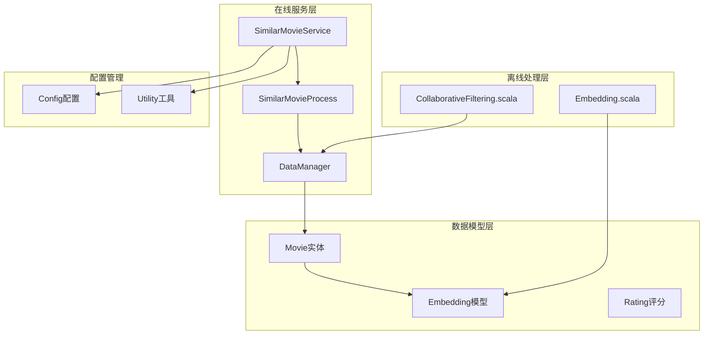
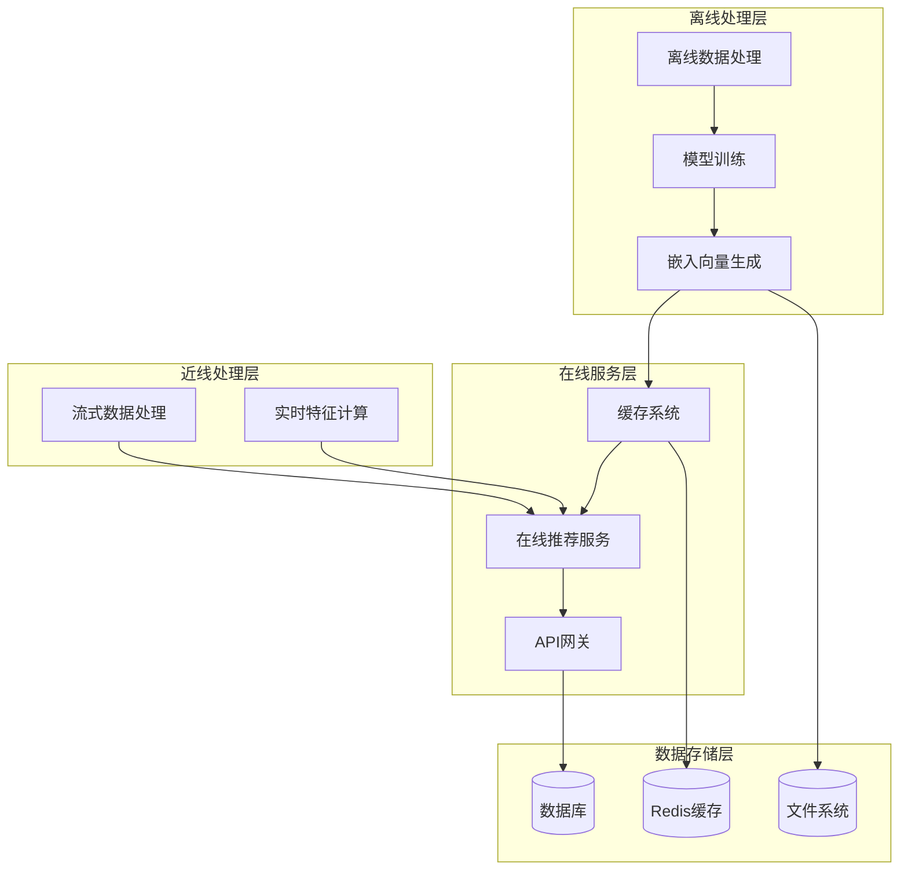
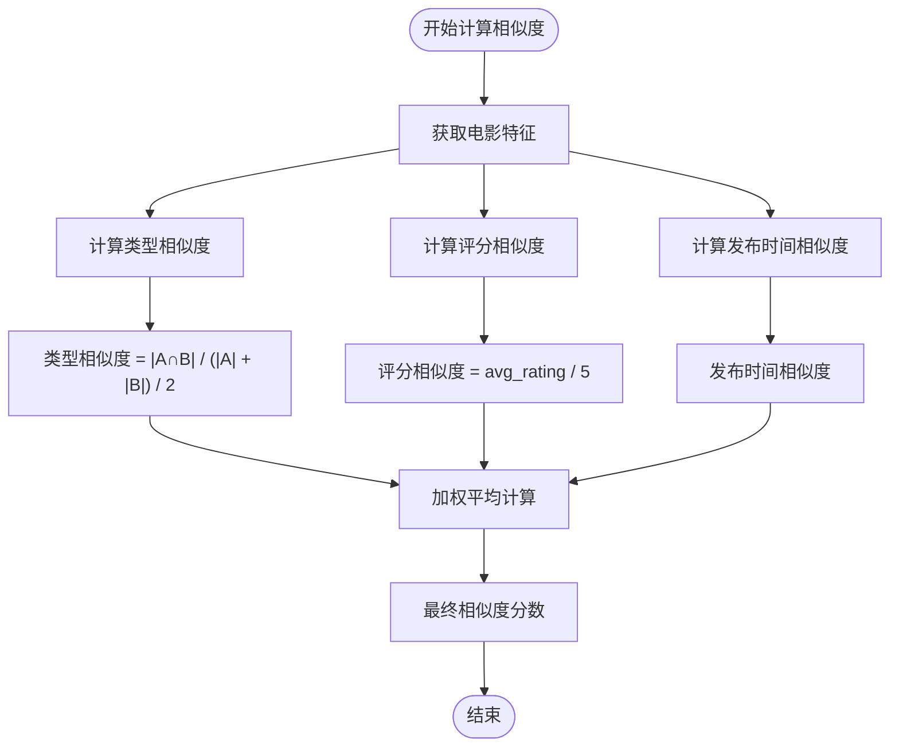
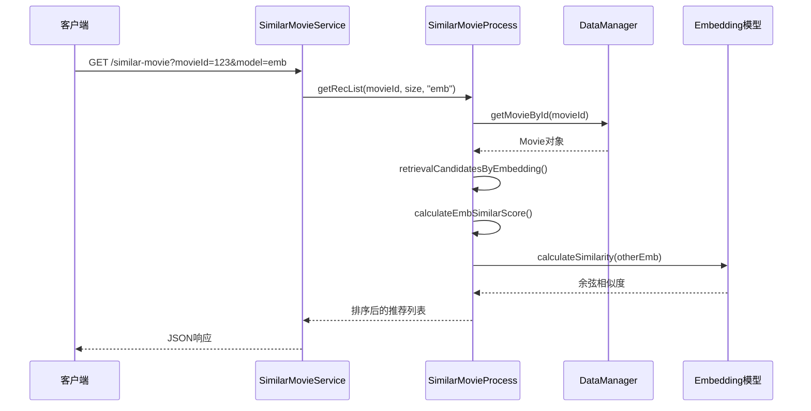
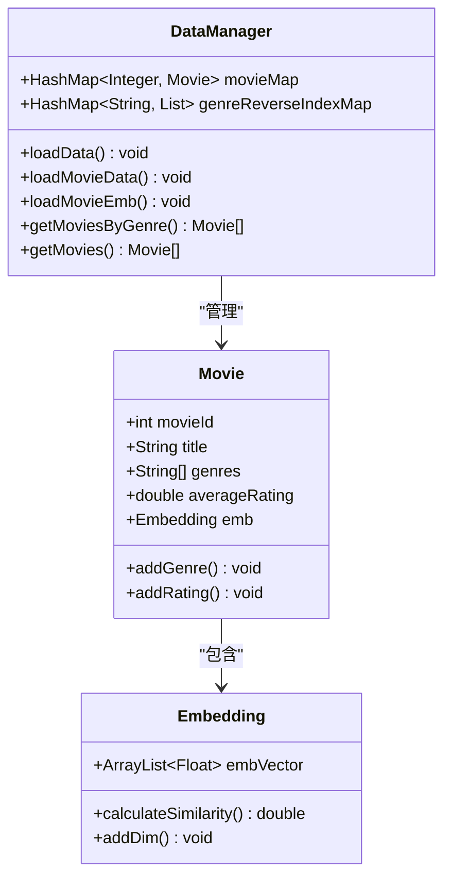
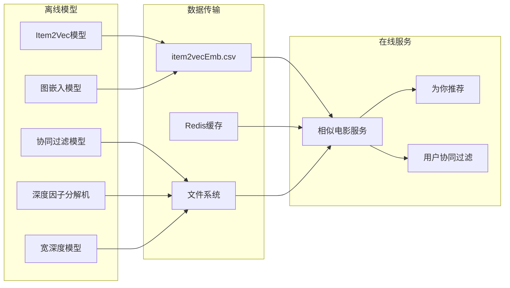
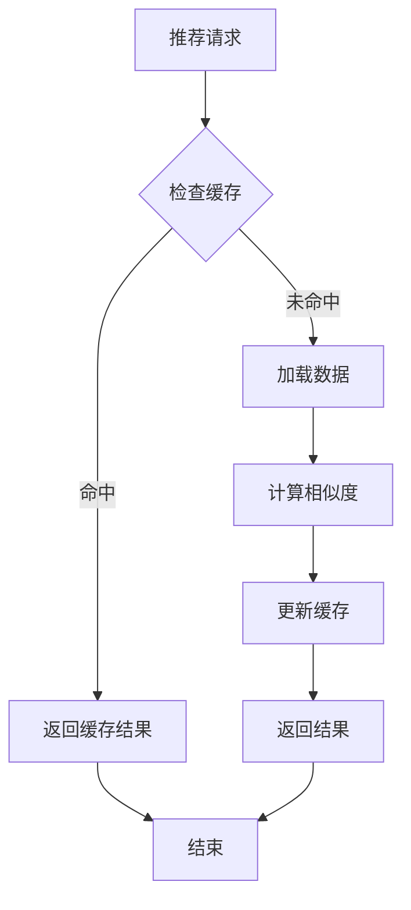

# SimilarMovieService相似电影推荐服务

<cite>
**本文档引用的文件**
- [SimilarMovieService.java](file://src/main/java/com/sparrowrecsys/online/service/SimilarMovieService.java)
- [SimilarMovieProcess.java](file://src/main/java/com/sparrowrecsys/online/recprocess/SimilarMovieProcess.java)
- [Movie.java](file://src/main/java/com/sparrowrecsys/online/datamanager/Movie.java)
- [Embedding.java](file://src/main/java/com/sparrowrecsys/online/model/Embedding.java)
- [DataManager.java](file://src/main/java/com/sparrowrecsys/online/datamanager/DataManager.java)
- [Utility.java](file://src/main/java/com/sparrowrecsys/online/util/Utility.java)
- [Config.java](file://src/main/java/com/sparrowrecsys/online/util/Config.java)
- [Embedding.scala](file://src/main/java/com/sparrowrecsys/offline/spark/embedding/Embedding.scala)
- [CollaborativeFiltering.scala](file://src/main/java/com/sparrowrecsys/offline/spark/model/CollaborativeFiltering.scala)
- [movies.csv](file://src/main/resources/webroot/sampledata/movies.csv)
- [item2vecEmb.csv](file://src/main/resources/webroot/modeldata/item2vecEmb.csv)
- [README.md](file://README.md)
</cite>

## 目录
1. [简介](#简介)
2. [项目结构](#项目结构)
3. [核心组件](#核心组件)
4. [架构概览](#架构概览)
5. [详细组件分析](#详细组件分析)
6. [依赖关系分析](#依赖关系分析)
7. [性能考虑](#性能考虑)
8. [故障排除指南](#故障排除指南)
9. [结论](#结论)
10. [附录](#附录)

## 简介

SimilarMovieService是SparrowRecSys电影推荐系统中的核心相似电影推荐服务，负责为指定电影生成相似电影推荐列表。该服务实现了基于内容的相似性计算算法，支持多种相似度计算模式，包括传统的基于特征的相似度计算和基于嵌入向量的相似度计算。

该项目采用混合语言架构，结合了Java、Scala、Python等多种技术栈，涵盖了从离线数据处理、模型训练到在线服务的完整推荐系统生命周期。系统基于MovieLens数据集，提供了从基础的基于内容的推荐到复杂的深度学习模型的全面实现。

## 项目结构

SparrowRecSys项目采用分层架构设计，主要包含以下核心模块：



**图表来源**
- [SimilarMovieService.java](file://src/main/java/com/sparrowrecsys/online/service/SimilarMovieService.java#L1-L46)
- [SimilarMovieProcess.java](file://src/main/java/com/sparrowrecsys/online/recprocess/SimilarMovieProcess.java#L1-L174)
- [DataManager.java](file://src/main/java/com/sparrowrecsys/online/datamanager/DataManager.java#L1-L295)

**章节来源**
- [README.md](file://README.md#L1-L57)

## 核心组件

### SimilarMovieService - 推荐服务入口

SimilarMovieService是HTTP Servlet入口点，负责接收相似电影推荐请求并返回JSON格式的推荐结果。

**主要功能特性：**
- 支持RESTful API接口设计
- 参数验证和错误处理
- JSON响应格式化
- CORS跨域支持

**API端点：**
```
GET /similar-movie?movieId={id}&size={count}&model={algorithm}
```

**章节来源**
- [SimilarMovieService.java](file://src/main/java/com/sparrowrecsys/online/service/SimilarMovieService.java#L16-L45)

### SimilarMovieProcess - 推荐流程处理器

SimilarMovieProcess是推荐算法的核心实现，包含完整的推荐流程：

**核心算法流程：**
1. **候选生成** - 基于电影类型、评分、发布时间等特征生成候选集
2. **相似度计算** - 使用多种算法计算相似度分数
3. **结果排序** - 按相似度分数降序排列
4. **结果截断** - 返回指定数量的推荐结果

**算法支持：**
- 基于内容的相似度计算
- 基于嵌入向量的余弦相似度
- 多种候选生成策略

**章节来源**
- [SimilarMovieProcess.java](file://src/main/java/com/sparrowrecsys/online/recprocess/SimilarMovieProcess.java#L20-L173)

### Embedding模型 - 嵌入向量表示

Embedding类实现了电影的向量表示和相似度计算：

**核心功能：**
- 向量维度动态扩展
- 余弦相似度计算
- 数值稳定性保证

**相似度计算公式：**
```
cos(θ) = (A · B) / (||A|| × ||B||)
```

其中A和B分别为两个电影的嵌入向量。

**章节来源**
- [Embedding.java](file://src/main/java/com/sparrowrecsys/online/model/Embedding.java#L32-L47)

## 架构概览

SparrowRecSys采用了典型的工业级推荐系统架构，分为离线、近线和在线三个层次：



**图表来源**
- [Embedding.scala](file://src/main/java/com/sparrowrecsys/offline/spark/embedding/Embedding.scala#L268-L286)
- [CollaborativeFiltering.scala](file://src/main/java/com/sparrowrecsys/offline/spark/model/CollaborativeFiltering.scala#L12-L84)

## 详细组件分析

### 相似度计算算法

#### 基于内容的相似度计算

SimilarMovieProcess实现了综合相似度计算算法，结合了多个特征维度：



**图表来源**
- [SimilarMovieProcess.java](file://src/main/java/com/sparrowrecsys/online/recprocess/SimilarMovieProcess.java#L145-L159)

**算法权重配置：**
- 类型相似度权重：0.7
- 评分相似度权重：0.3

#### 嵌入向量相似度计算

基于Word2Vec的电影嵌入向量相似度计算：

**流程图：**


**图表来源**
- [SimilarMovieProcess.java](file://src/main/java/com/sparrowrecsys/online/recprocess/SimilarMovieProcess.java#L91-L112)
- [Embedding.java](file://src/main/java/com/sparrowrecsys/online/model/Embedding.java#L32-L47)

**章节来源**
- [SimilarMovieProcess.java](file://src/main/java/com/sparrowrecsys/online/recprocess/SimilarMovieProcess.java#L121-L172)

### 候选生成策略

SimilarMovieProcess提供了三种候选生成策略：

#### 基于类型的候选生成
- 通过电影类型反向索引快速获取同类型电影
- 支持按评分和发布时间排序
- 避免重复添加目标电影

#### 多重检索候选生成
- 结合类型、高评分、最新发布等多个维度
- 提供更丰富的候选池
- 支持去重和大小控制

#### 嵌入向量候选生成
- 利用预训练的电影嵌入向量
- 计算所有电影的相似度分数
- 基于相似度阈值筛选候选

**章节来源**
- [SimilarMovieProcess.java](file://src/main/java/com/sparrowrecsys/online/recprocess/SimilarMovieProcess.java#L39-L112)

### 数据加载和缓存机制

DataManager实现了完整的数据加载和缓存管理：



**图表来源**
- [DataManager.java](file://src/main/java/com/sparrowrecsys/online/datamanager/DataManager.java#L13-L294)
- [Movie.java](file://src/main/java/com/sparrowrecsys/online/datamanager/Movie.java#L15-L157)
- [Embedding.java](file://src/main/java/com/sparrowrecsys/online/model/Embedding.java#L8-L48)

**章节来源**
- [DataManager.java](file://src/main/java/com/sparrowrecsys/online/datamanager/DataManager.java#L40-L124)

## 依赖关系分析

### 离线模型集成

系统集成了多种离线机器学习模型：



**图表来源**
- [Embedding.scala](file://src/main/java/com/sparrowrecsys/offline/spark/embedding/Embedding.scala#L103-L137)
- [CollaborativeFiltering.scala](file://src/main/java/com/sparrowrecsys/offline/spark/model/CollaborativeFiltering.scala#L29-L79)

### 外部依赖关系

**核心依赖：**
- **Apache Spark** - 离线数据处理和模型训练
- **Redis** - 实时缓存和嵌入向量存储
- **Jetty Server** - 在线服务容器
- **Jackson** - JSON序列化处理

**章节来源**
- [Embedding.scala](file://src/main/java/com/sparrowrecsys/offline/spark/embedding/Embedding.scala#L1-L20)
- [CollaborativeFiltering.scala](file://src/main/java/com/sparrowrecsys/offline/spark/model/CollaborativeFiltering.scala#L1-L9)

## 性能考虑

### 内存优化策略

1. **懒加载机制** - 嵌入向量仅在需要时加载
2. **缓存策略** - 使用Redis缓存热门电影的嵌入向量
3. **数据结构优化** - 使用HashMap实现O(1)查找
4. **流式处理** - 对大数据集采用流式处理减少内存占用

### 算法性能优化

1. **候选池大小控制** - 通过参数控制候选池大小避免过度计算
2. **相似度阈值过滤** - 在候选生成阶段就进行相似度阈值过滤
3. **并行计算** - 利用Spark的分布式计算能力
4. **向量化操作** - 使用向量运算提高计算效率

### 缓存优化方案



**章节来源**
- [DataManager.java](file://src/main/java/com/sparrowrecsys/online/datamanager/DataManager.java#L109-L123)

## 故障排除指南

### 常见问题诊断

**1. 嵌入向量加载失败**
- 检查item2vecEmb.csv文件格式
- 验证嵌入向量维度一致性
- 确认Redis连接状态

**2. 推荐结果为空**
- 验证电影ID有效性
- 检查候选生成策略配置
- 确认相似度阈值设置合理

**3. 性能问题**
- 监控内存使用情况
- 检查缓存命中率
- 分析算法执行时间

### 调试工具和方法

**日志监控：**
- 关键算法执行时间记录
- 数据加载进度跟踪
- 错误信息详细记录

**性能监控：**
- 推荐响应时间统计
- 候选池大小分析
- 相似度计算耗时分析

**章节来源**
- [SimilarMovieService.java](file://src/main/java/com/sparrowrecsys/online/service/SimilarMovieService.java#L40-L43)
- [DataManager.java](file://src/main/java/com/sparrowrecsys/online/datamanager/DataManager.java#L91-L123)

## 结论

SimilarMovieService作为SparrowRecSys的核心组件，展现了现代推荐系统的设计理念和技术实现。该服务通过灵活的算法选择、高效的候选生成策略和完善的缓存机制，为用户提供了高质量的相似电影推荐体验。

系统的主要优势包括：
- **算法多样性** - 支持基于内容和基于嵌入的双重推荐策略
- **可扩展性** - 模块化设计便于算法扩展和性能优化
- **实时性** - 结合离线模型和在线缓存实现低延迟响应
- **稳定性** - 完善的错误处理和性能监控机制

未来可以进一步优化的方向包括：
- 实现更复杂的深度学习推荐算法
- 扩展多模态特征融合
- 增强个性化推荐能力
- 优化大规模数据处理性能

## 附录

### API参考文档

**相似电影推荐API**

**端点：**
```
GET /similar-movie
```

**查询参数：**
- `movieId` (必需) - 目标电影ID
- `size` (可选) - 返回推荐数量，默认10
- `model` (可选) - 相似度计算模型，默认"content"

**响应格式：**
```json
[
  {
    "movieId": 123,
    "title": "电影标题",
    "genres": ["动作", "科幻"],
    "averageRating": 4.5,
    "releaseYear": 2023
  },
  ...
]
```

**状态码：**
- 200 OK - 请求成功
- 400 Bad Request - 参数错误
- 500 Internal Server Error - 服务器错误

### 自定义开发指南

**扩展相似度算法：**
1. 在SimilarMovieProcess中添加新的相似度计算方法
2. 更新ranker方法以支持新算法
3. 添加相应的候选生成策略

**扩展电影特征：**
1. 在Movie类中添加新的特征字段
2. 在DataManager中实现特征加载逻辑
3. 更新相似度计算算法

**实现多算法融合：**
1. 设计算法权重配置系统
2. 实现投票或加权融合策略
3. 添加在线A/B测试支持

**章节来源**
- [SimilarMovieService.java](file://src/main/java/com/sparrowrecsys/online/service/SimilarMovieService.java#L25-L33)
- [SimilarMovieProcess.java](file://src/main/java/com/sparrowrecsys/online/recprocess/SimilarMovieProcess.java#L121-L137)