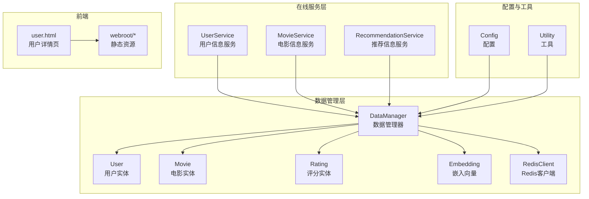
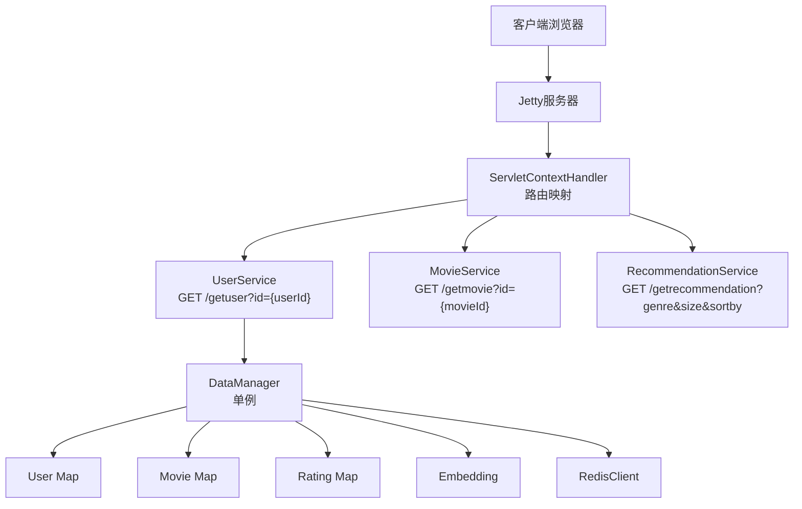
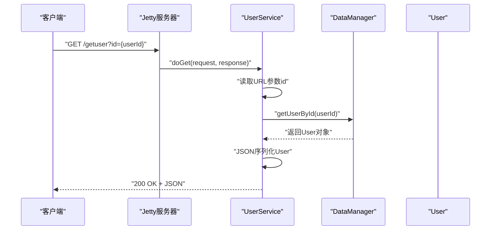
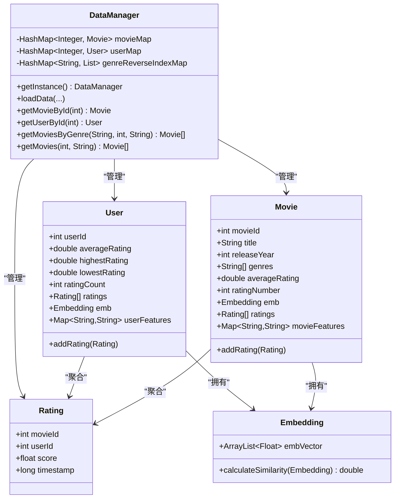
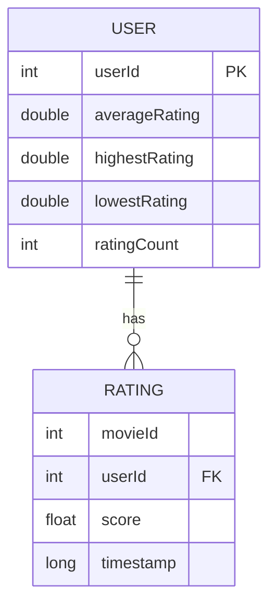
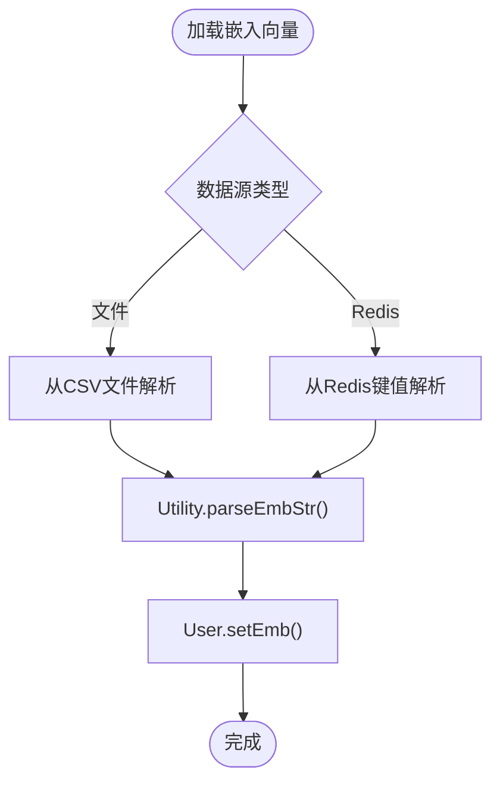
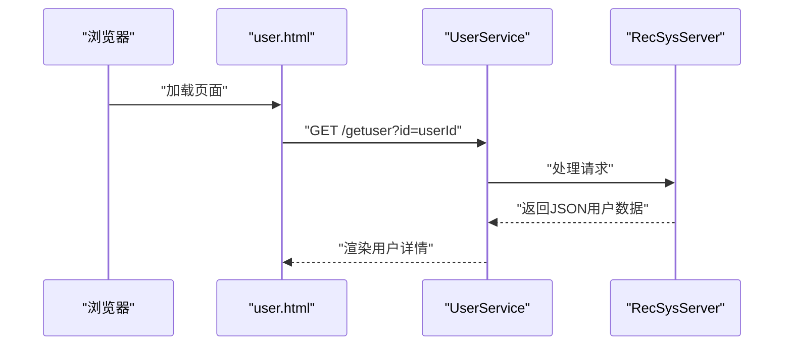
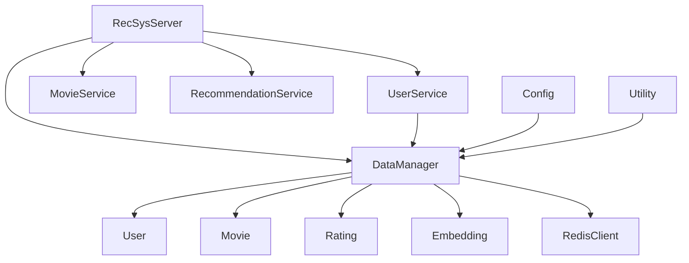

# UserService用户信息服务

<cite>
**本文档引用的文件**
- [UserService.java](file://src/main/java/com/sparrowrecsys/online/service/UserService.java)
- [DataManager.java](file://src/main/java/com/sparrowrecsys/online/datamanager/DataManager.java)
- [User.java](file://src/main/java/com/sparrowrecsys/online/datamanager/User.java)
- [Rating.java](file://src/main/java/com/sparrowrecsys/online/datamanager/Rating.java)
- [Movie.java](file://src/main/java/com/sparrowrecsys/online/datamanager/Movie.java)
- [Embedding.java](file://src/main/java/com/sparrowrecsys/online/model/Embedding.java)
- [RecSysServer.java](file://src/main/java/com/sparrowrecsys/online/RecSysServer.java)
- [Config.java](file://src/main/java/com/sparrowrecsys/online/util/Config.java)
- [Utility.java](file://src/main/java/com/sparrowrecsys/online/util/Utility.java)
- [RedisClient.java](file://src/main/java/com/sparrowrecsys/online/datamanager/RedisClient.java)
- [MovieService.java](file://src/main/java/com/sparrowrecsys/online/service/MovieService.java)
- [RecommendationService.java](file://src/main/java/com/sparrowrecsys/online/service/RecommendationService.java)
- [user.html](file://src/main/resources/webroot/user.html)
- [README.md](file://README.md)
</cite>

## 目录
1. [简介](#简介)
2. [项目结构](#项目结构)
3. [核心组件](#核心组件)
4. [架构概览](#架构概览)
5. [详细组件分析](#详细组件分析)
6. [依赖关系分析](#依赖关系分析)
7. [性能考虑](#性能考虑)
8. [故障排除指南](#故障排除指南)
9. [结论](#结论)
10. [附录](#附录)

## 简介
本文件为UserService用户信息服务的详细技术文档，深入解析用户信息管理的实现逻辑与架构设计。当前系统采用经典的工业级推荐系统架构，包含离线数据处理、模型训练、近线流处理、线上服务与前端展示等模块。UserService作为线上服务层的核心组件之一，负责向客户端提供用户信息查询能力。

系统支持通过REST风格的HTTP接口返回JSON格式的用户数据，底层数据由DataManager统一加载与管理，支持从文件系统或Redis加载嵌入向量与特征数据。用户数据来源于MovieLens数据集，包含用户评分、平均分、最高分、最低分等统计信息，以及可选的用户嵌入向量与特征映射。

## 项目结构
项目采用多模块混合架构，核心在线服务基于Java + Jetty实现，前端静态资源位于webroot目录。主要目录结构如下：
- 在线服务层：com.sparrowrecsys.online.service.* 提供各类REST服务
- 数据管理层：com.sparrowrecsys.online.datamanager.* 负责数据加载与缓存
- 模型层：com.sparrowrecsys.online.model.* 定义嵌入向量等模型对象
- 工具与配置：com.sparrowrecsys.online.util.* 提供配置与工具方法
- 前端资源：webroot/* 包含HTML、CSS、JS与示例数据

**图表来源**
- [UserService.java](file://src/main/java/com/sparrowrecsys/online/service/UserService.java#L1-L45)
- [DataManager.java](file://src/main/java/com/sparrowrecsys/online/datamanager/DataManager.java#L1-L295)
- [User.java](file://src/main/java/com/sparrowrecsys/online/datamanager/User.java#L1-L115)
- [Movie.java](file://src/main/java/com/sparrowrecsys/online/datamanager/Movie.java#L1-L158)
- [Rating.java](file://src/main/java/com/sparrowrecsys/online/datamanager/Rating.java#L1-L44)
- [Embedding.java](file://src/main/java/com/sparrowrecsys/online/model/Embedding.java#L1-L49)
- [RedisClient.java](file://src/main/java/com/sparrowrecsys/online/datamanager/RedisClient.java#L1-L26)
- [Config.java](file://src/main/java/com/sparrowrecsys/online/util/Config.java#L1-L14)
- [Utility.java](file://src/main/java/com/sparrowrecsys/online/util/Utility.java#L1-L15)
- [user.html](file://src/main/resources/webroot/user.html#L1-L146)

**章节来源**
- [RecSysServer.java](file://src/main/java/com/sparrowrecsys/online/RecSysServer.java#L1-L80)
- [README.md](file://README.md#L1-L57)

## 核心组件
本节聚焦UserService及其直接依赖的核心组件，阐述其职责、数据结构与交互关系。

- UserService：基于Servlet实现的HTTP GET服务，接收用户ID参数，调用DataManager获取User对象，序列化为JSON后返回给客户端。
- DataManager：单例数据管理器，负责加载电影、链接、评分数据与嵌入向量，维护内存中的用户与电影映射表，并提供按ID查询的方法。
- User：用户实体，包含用户ID、评分统计（平均分、最高分、最低分、评分次数）、评分列表、嵌入向量与用户特征映射等字段。
- Rating：评分实体，包含电影ID、用户ID、评分分数与时间戳。
- Embedding：嵌入向量模型，提供向量维度与余弦相似度计算方法。
- RedisClient：单例Redis客户端，用于从Redis加载嵌入向量与特征数据（当前未在用户服务中直接使用）。
- Config：全局配置，控制嵌入数据源、是否从Redis加载特征等开关。
- Utility：工具类，提供嵌入字符串解析为Embedding对象的能力。

**章节来源**
- [UserService.java](file://src/main/java/com/sparrowrecsys/online/service/UserService.java#L1-L45)
- [DataManager.java](file://src/main/java/com/sparrowrecsys/online/datamanager/DataManager.java#L1-L295)
- [User.java](file://src/main/java/com/sparrowrecsys/online/datamanager/User.java#L1-L115)
- [Rating.java](file://src/main/java/com/sparrowrecsys/online/datamanager/Rating.java#L1-L44)
- [Embedding.java](file://src/main/java/com/sparrowrecsys/online/model/Embedding.java#L1-L49)
- [RedisClient.java](file://src/main/java/com/sparrowrecsys/online/datamanager/RedisClient.java#L1-L26)
- [Config.java](file://src/main/java/com/sparrowrecsys/online/util/Config.java#L1-L14)
- [Utility.java](file://src/main/java/com/sparrowrecsys/online/util/Utility.java#L1-L15)

## 架构概览
系统采用分层架构，线上服务通过Jetty容器启动，绑定多个Servlet以提供REST接口。RecSysServer负责初始化数据加载与路由绑定，各Service通过DataManager访问内存中的用户与电影数据。

**图表来源**
- [RecSysServer.java](file://src/main/java/com/sparrowrecsys/online/RecSysServer.java#L64-L70)
- [UserService.java](file://src/main/java/com/sparrowrecsys/online/service/UserService.java#L16-L43)
- [DataManager.java](file://src/main/java/com/sparrowrecsys/online/datamanager/DataManager.java#L28-L37)

**章节来源**
- [RecSysServer.java](file://src/main/java/com/sparrowrecsys/online/RecSysServer.java#L1-L80)

## 详细组件分析

### UserService组件分析
UserService是用户信息服务的核心入口，负责处理HTTP GET请求并返回用户JSON数据。其处理流程如下：

- 请求参数：id（必需，整数类型）
- 响应格式：application/json；若用户不存在则返回空字符串
- 错误处理：捕获异常并返回空字符串，便于前端容错

**图表来源**
- [UserService.java](file://src/main/java/com/sparrowrecsys/online/service/UserService.java#L16-L43)
- [DataManager.java](file://src/main/java/com/sparrowrecsys/online/datamanager/DataManager.java#L290-L293)

**章节来源**
- [UserService.java](file://src/main/java/com/sparrowrecsys/online/service/UserService.java#L1-L45)

### DataManager组件分析
DataManager是系统的核心数据管理器，承担以下职责：
- 单例模式确保全局唯一实例
- 加载电影、链接、评分数据，构建内存映射表
- 加载电影与用户嵌入向量，支持从文件或Redis加载
- 提供按ID查询用户与电影的方法

**图表来源**
- [DataManager.java](file://src/main/java/com/sparrowrecsys/online/datamanager/DataManager.java#L13-L295)
- [User.java](file://src/main/java/com/sparrowrecsys/online/datamanager/User.java#L14-L115)
- [Movie.java](file://src/main/java/com/sparrowrecsys/online/datamanager/Movie.java#L15-L158)
- [Rating.java](file://src/main/java/com/sparrowrecsys/online/datamanager/Rating.java#L6-L44)
- [Embedding.java](file://src/main/java/com/sparrowrecsys/online/model/Embedding.java#L8-L49)

**章节来源**
- [DataManager.java](file://src/main/java/com/sparrowrecsys/online/datamanager/DataManager.java#L1-L295)

### 用户数据模型与序列化
User实体包含用户的基本统计信息与关联数据，通过Jackson注解控制序列化行为：
- 平均分、最高分、最低分、评分次数等统计字段
- 评分列表通过自定义序列化器输出，避免循环引用
- 嵌入向量与用户特征映射标记为忽略序列化，防止敏感信息泄露

**图表来源**
- [User.java](file://src/main/java/com/sparrowrecsys/online/datamanager/User.java#L14-L115)
- [Rating.java](file://src/main/java/com/sparrowrecsys/online/datamanager/Rating.java#L6-L44)

**章节来源**
- [User.java](file://src/main/java/com/sparrowrecsys/online/datamanager/User.java#L1-L115)
- [Rating.java](file://src/main/java/com/sparrowrecsys/online/datamanager/Rating.java#L1-L44)

### 嵌入向量与相似度计算
Embedding类提供向量维度与余弦相似度计算，用于后续的协同过滤与个性化推荐。Utility类提供嵌入字符串解析能力，支持从文件或Redis加载嵌入向量。

**图表来源**
- [DataManager.java](file://src/main/java/com/sparrowrecsys/online/datamanager/DataManager.java#L144-L164)
- [Utility.java](file://src/main/java/com/sparrowrecsys/online/util/Utility.java#L6-L13)
- [Embedding.java](file://src/main/java/com/sparrowrecsys/online/model/Embedding.java#L32-L47)

**章节来源**
- [Embedding.java](file://src/main/java/com/sparrowrecsys/online/model/Embedding.java#L1-L49)
- [Utility.java](file://src/main/java/com/sparrowrecsys/online/util/Utility.java#L1-L15)
- [DataManager.java](file://src/main/java/com/sparrowrecsys/online/datamanager/DataManager.java#L144-L164)

### 前端集成与用户页面
前端user.html通过JavaScript动态加载用户详情、个性化推荐与历史记录，支持通过URL参数传递用户ID与模型类型。该页面展示了UserService的典型调用方式与数据消费场景。

**图表来源**
- [user.html](file://src/main/resources/webroot/user.html#L131-L142)
- [RecSysServer.java](file://src/main/java/com/sparrowrecsys/online/RecSysServer.java#L65-L66)

**章节来源**
- [user.html](file://src/main/resources/webroot/user.html#L1-L146)
- [RecSysServer.java](file://src/main/java/com/sparrowrecsys/online/RecSysServer.java#L1-L80)

## 依赖关系分析
系统组件之间的依赖关系如下：
- RecSysServer启动时初始化DataManager并绑定Servlet路由
- UserService依赖DataManager进行用户查询
- DataManager内部依赖User、Movie、Rating等实体与Embedding模型
- Config与Utility提供配置与工具支持
- RedisClient为可选的数据源，当前未在用户服务中直接使用

**图表来源**
- [RecSysServer.java](file://src/main/java/com/sparrowrecsys/online/RecSysServer.java#L64-L70)
- [UserService.java](file://src/main/java/com/sparrowrecsys/online/service/UserService.java#L1-L45)
- [DataManager.java](file://src/main/java/com/sparrowrecsys/online/datamanager/DataManager.java#L1-L295)

**章节来源**
- [RecSysServer.java](file://src/main/java/com/sparrowrecsys/online/RecSysServer.java#L1-L80)
- [UserService.java](file://src/main/java/com/sparrowrecsys/online/service/UserService.java#L1-L45)
- [DataManager.java](file://src/main/java/com/sparrowrecsys/online/datamanager/DataManager.java#L1-L295)

## 性能考虑
- 内存数据结构：DataManager使用HashMap存储用户与电影映射，查询复杂度为O(1)，适合高并发场景
- 序列化开销：UserService使用Jackson进行JSON序列化，建议在高频调用场景下启用压缩或缓存策略
- 嵌入向量加载：支持从文件或Redis加载，Redis可提供更好的横向扩展能力
- 线程安全：DataManager与RedisClient采用双重检查锁定实现单例，注意在多线程环境下的并发访问
- 前端渲染：user.html通过异步请求加载数据，建议结合懒加载与分页策略提升用户体验

[本节提供一般性指导，无需特定文件分析]

## 故障排除指南
- 用户不存在：当用户ID无效或未加载时，UserService返回空字符串，前端需进行空值判断
- 异常处理：服务端捕获异常并返回空字符串，便于前端容错；建议在生产环境记录日志并返回标准错误码
- 数据加载失败：检查RecSysServer启动时的数据路径与文件完整性
- Redis连接问题：如启用Redis数据源，请确认Redis服务可用与网络连通性
- CORS跨域：服务端已设置允许跨域访问，如遇跨域问题需检查客户端请求头与预检请求

**章节来源**
- [UserService.java](file://src/main/java/com/sparrowrecsys/online/service/UserService.java#L39-L42)
- [RecSysServer.java](file://src/main/java/com/sparrowrecsys/online/RecSysServer.java#L49-L54)

## 结论
UserService作为推荐系统线上服务的重要组成部分，提供了简洁高效的用户信息查询能力。通过DataManager统一管理数据与嵌入向量，系统实现了良好的可扩展性与性能表现。当前版本专注于用户信息查询，后续可在此基础上扩展用户注册、登录验证、偏好设置与行为追踪等高级功能，以满足更复杂的业务需求。

[本节为总结性内容，无需特定文件分析]

## 附录

### API定义与使用规范
- 服务地址：GET /getuser
- 参数
  - id：用户ID（整数，必填）
- 响应
  - 成功：application/json，返回User对象的JSON表示
  - 失败：application/json，返回空字符串
- 示例
  - GET /getuser?id=1
  - 返回：包含用户统计信息与评分列表的JSON对象

**章节来源**
- [UserService.java](file://src/main/java/com/sparrowrecsys/online/service/UserService.java#L16-L43)

### 数据安全与隐私保护
- 敏感字段控制：User实体中标记为忽略序列化的字段不会出现在JSON响应中
- CORS策略：服务端允许跨域访问，需结合HTTPS与白名单策略保障传输安全
- 配置开关：通过Config控制数据源与特性开关，便于在不同环境间切换

**章节来源**
- [User.java](file://src/main/java/com/sparrowrecsys/online/datamanager/User.java#L25-L29)
- [Config.java](file://src/main/java/com/sparrowrecsys/online/util/Config.java#L1-L14)

### 扩展建议
- 用户注册与登录：新增用户注册与登录接口，结合会话管理与权限控制
- 权限控制：引入角色与权限模型，限制对敏感数据的访问
- 行为追踪：记录用户浏览、评分等行为，用于个性化推荐与A/B测试
- 个性化设置：提供用户偏好设置接口，支持动态调整推荐策略
- 性能优化：引入缓存层、数据库持久化与异步处理机制

[本节为概念性内容，无需特定文件分析]