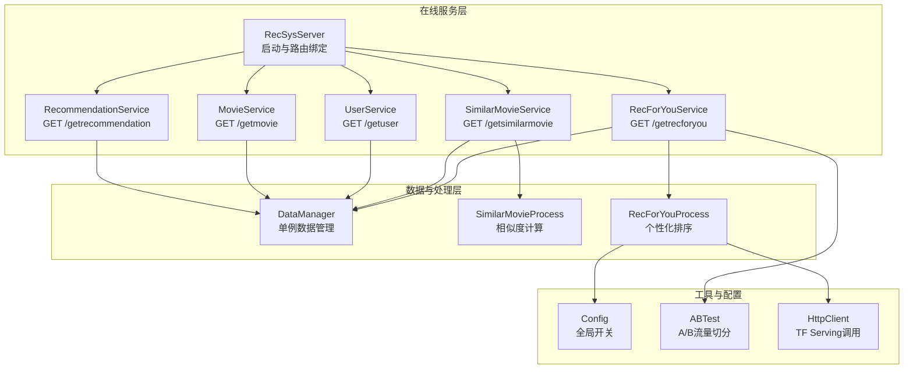
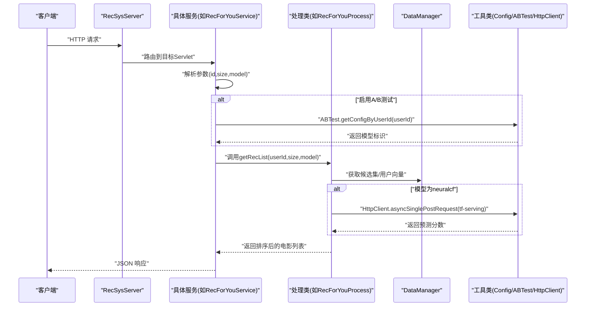
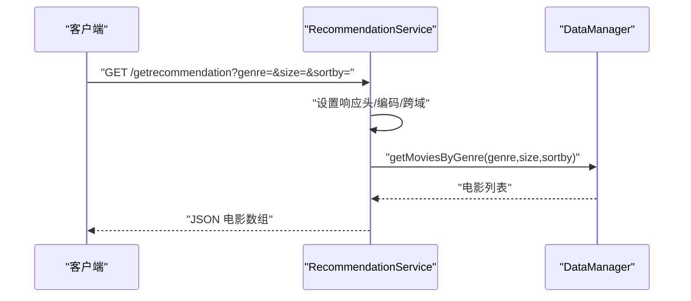
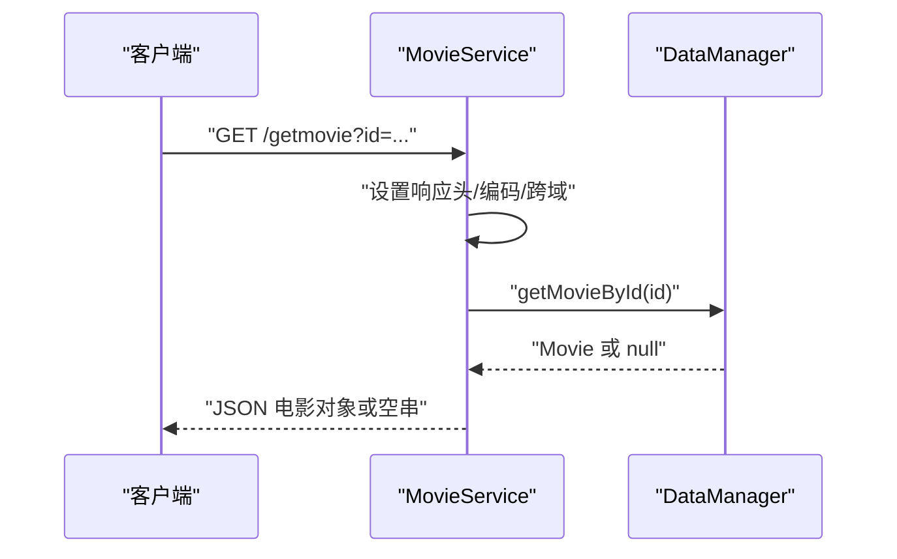
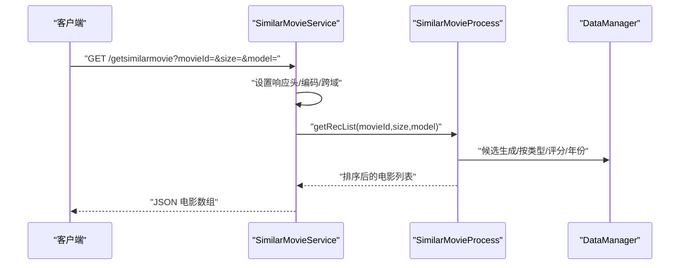
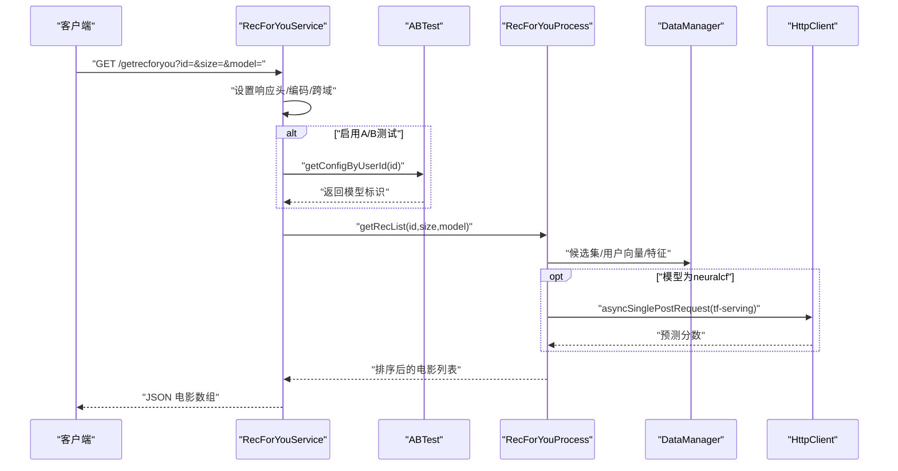
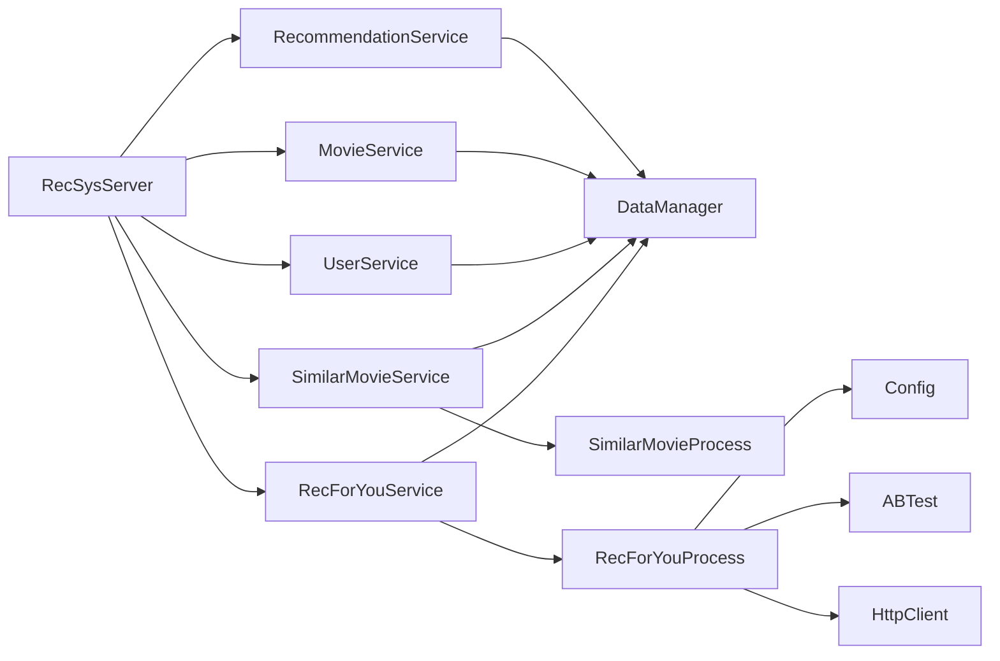

# 服务类详解

<cite>
**本文引用的文件**
- [RecSysServer.java](file://src/main/java/com/sparrowrecsys/online/RecSysServer.java)
- [RecommendationService.java](file://src/main/java/com/sparrowrecsys/online/service/RecommendationService.java)
- [MovieService.java](file://src/main/java/com/sparrowrecsys/online/service/MovieService.java)
- [UserService.java](file://src/main/java/com/sparrowrecsys/online/service/UserService.java)
- [SimilarMovieService.java](file://src/main/java/com/sparrowrecsys/online/service/SimilarMovieService.java)
- [RecForYouService.java](file://src/main/java/com/sparrowrecsys/online/service/RecForYouService.java)
- [DataManager.java](file://src/main/java/com/sparrowrecsys/online/datamanager/DataManager.java)
- [Movie.java](file://src/main/java/com/sparrowrecsys/online/datamanager/Movie.java)
- [User.java](file://src/main/java/com/sparrowrecsys/online/datamanager/User.java)
- [SimilarMovieProcess.java](file://src/main/java/com/sparrowrecsys/online/recprocess/SimilarMovieProcess.java)
- [RecForYouProcess.java](file://src/main/java/com/sparrowrecsys/online/recprocess/RecForYouProcess.java)
- [Config.java](file://src/main/java/com/sparrowrecsys/online/util/Config.java)
- [ABTest.java](file://src/main/java/com/sparrowrecsys/online/util/ABTest.java)
- [HttpClient.java](file://src/main/java/com/sparrowrecsys/online/util/HttpClient.java)
- [README.md](file://README.md)
</cite>

## 目录
1. [引言](#引言)
2. [项目结构](#项目结构)
3. [核心组件](#核心组件)
4. [架构总览](#架构总览)
5. [详细组件分析](#详细组件分析)
6. [依赖关系分析](#依赖关系分析)
7. [性能考虑](#性能考虑)
8. [故障排查指南](#故障排查指南)
9. [结论](#结论)
10. [附录：扩展与最佳实践](#附录扩展与最佳实践)

## 引言
本文件面向在线推荐服务的开发与维护人员，系统性梳理并解读在线服务层的五大核心服务类：RecommendationService（通用推荐）、MovieService（电影信息查询）、UserService（用户信息管理）、SimilarMovieService（相似电影推荐）与 RecForYouService（个性化推荐）。文档从职责边界、请求处理流程、参数校验、数据访问模式、响应格式、服务间协作与依赖注入机制等方面进行深入剖析，并提供可扩展的实践建议与性能优化要点。

## 项目结构
在线服务层位于 online 子包内，采用 Jetty 作为嵌入式 Web 容器，通过 Servlet 将各服务暴露为 REST 风格的 HTTP 接口；数据加载与缓存由 DataManager 统一负责；推荐算法封装在 recprocess 包下的处理类中；工具类集中在 util 包下。

图表来源
- [RecSysServer.java](file://src/main/java/com/sparrowrecsys/online/RecSysServer.java#L63-L70)
- [RecommendationService.java](file://src/main/java/com/sparrowrecsys/online/service/RecommendationService.java#L18-L47)
- [MovieService.java](file://src/main/java/com/sparrowrecsys/online/service/MovieService.java#L16-L45)
- [UserService.java](file://src/main/java/com/sparrowrecsys/online/service/UserService.java#L15-L44)
- [SimilarMovieService.java](file://src/main/java/com/sparrowrecsys/online/service/SimilarMovieService.java#L16-L45)
- [RecForYouService.java](file://src/main/java/com/sparrowrecsys/online/service/RecForYouService.java#L20-L54)
- [DataManager.java](file://src/main/java/com/sparrowrecsys/online/datamanager/DataManager.java#L13-L50)
- [SimilarMovieProcess.java](file://src/main/java/com/sparrowrecsys/online/recprocess/SimilarMovieProcess.java#L20-L32)
- [RecForYouProcess.java](file://src/main/java/com/sparrowrecsys/online/recprocess/RecForYouProcess.java#L29-L60)
- [Config.java](file://src/main/java/com/sparrowrecsys/online/util/Config.java#L3-L13)
- [ABTest.java](file://src/main/java/com/sparrowrecsys/online/util/ABTest.java#L11-L26)
- [HttpClient.java](file://src/main/java/com/sparrowrecsys/online/util/HttpClient.java#L21-L40)

章节来源
- [RecSysServer.java](file://src/main/java/com/sparrowrecsys/online/RecSysServer.java#L27-L78)
- [README.md](file://README.md#L13-L17)

## 核心组件
- RecommendationService：按类型与排序策略返回电影列表，依赖 DataManager 的按类型检索与排序能力。
- MovieService：根据电影 ID 返回电影详情，依赖 DataManager 的电影映射。
- UserService：根据用户 ID 返回用户画像，依赖 DataManager 的用户映射。
- SimilarMovieService：基于候选生成与排序策略返回相似电影列表，依赖 SimilarMovieProcess。
- RecForYouService：面向用户的个性化推荐，支持 A/B 流量切分与多模型排序，依赖 RecForYouProcess。

章节来源
- [RecommendationService.java](file://src/main/java/com/sparrowrecsys/online/service/RecommendationService.java#L18-L47)
- [MovieService.java](file://src/main/java/com/sparrowrecsys/online/service/MovieService.java#L16-L45)
- [UserService.java](file://src/main/java/com/sparrowrecsys/online/service/UserService.java#L15-L44)
- [SimilarMovieService.java](file://src/main/java/com/sparrowrecsys/online/service/SimilarMovieService.java#L16-L45)
- [RecForYouService.java](file://src/main/java/com/sparrowrecsys/online/service/RecForYouService.java#L20-L54)

## 架构总览
在线服务层以 RecSysServer 为中心，负责：
- 初始化端口与静态资源根路径
- 加载样本数据至 DataManager 单例
- 将各服务绑定到对应 URL 路径
- 启动 Jetty 服务器

服务类均继承自 HttpServlet，统一设置响应头、字符集与跨域策略，随后解析查询参数、调用数据或处理类、序列化为 JSON 并输出。

图表来源
- [RecSysServer.java](file://src/main/java/com/sparrowrecsys/online/RecSysServer.java#L63-L70)
- [RecForYouService.java](file://src/main/java/com/sparrowrecsys/online/service/RecForYouService.java#L37-L42)
- [RecForYouProcess.java](file://src/main/java/com/sparrowrecsys/online/recprocess/RecForYouProcess.java#L69-L92)
- [HttpClient.java](file://src/main/java/com/sparrowrecsys/online/util/HttpClient.java#L21-L40)
- [ABTest.java](file://src/main/java/com/sparrowrecsys/online/util/ABTest.java#L11-L26)

## 详细组件分析

### RecommendationService（通用推荐）
- 职责：根据类型与排序策略返回电影列表。
- 请求处理流程：
  - 设置响应头与编码
  - 解析参数：genre、size、sortby
  - 调用 DataManager.getMoviesByGenre 获取候选并排序
  - 使用 Jackson 序列化为 JSON 输出
- 参数验证：未做显式校验，直接转换为整数/字符串；异常时返回空字符串。
- 数据访问模式：读取 genre->电影的反向索引，按排序字段排序后截断。
- 响应格式：JSON 数组，元素为电影对象。

图表来源
- [RecommendationService.java](file://src/main/java/com/sparrowrecsys/online/service/RecommendationService.java#L19-L40)
- [DataManager.java](file://src/main/java/com/sparrowrecsys/online/datamanager/DataManager.java#L253-L268)

章节来源
- [RecommendationService.java](file://src/main/java/com/sparrowrecsys/online/service/RecommendationService.java#L18-L47)
- [DataManager.java](file://src/main/java/com/sparrowrecsys/online/datamanager/DataManager.java#L253-L268)

### MovieService（电影信息查询）
- 职责：根据电影 ID 返回电影详情。
- 请求处理流程：
  - 设置响应头与编码
  - 解析参数 id
  - 调用 DataManager.getMovieById 获取电影对象
  - 序列化为空对象时返回空字符串
- 参数验证：未做显式校验，直接转换为整数；异常时返回空字符串。
- 数据访问模式：O(1) 字典查找。
- 响应格式：JSON 对象，元素为电影对象。

图表来源
- [MovieService.java](file://src/main/java/com/sparrowrecsys/online/service/MovieService.java#L17-L38)
- [DataManager.java](file://src/main/java/com/sparrowrecsys/online/datamanager/DataManager.java#L285-L288)

章节来源
- [MovieService.java](file://src/main/java/com/sparrowrecsys/online/service/MovieService.java#L16-L45)
- [DataManager.java](file://src/main/java/com/sparrowrecsys/online/datamanager/DataManager.java#L285-L288)

### UserService（用户信息管理）
- 职责：根据用户 ID 返回用户画像。
- 请求处理流程：
  - 设置响应头与编码
  - 解析参数 id
  - 调用 DataManager.getUserById 获取用户对象
  - 序列化为空对象时返回空字符串
- 参数验证：未做显式校验，直接转换为整数；异常时返回空字符串。
- 数据访问模式：O(1) 字典查找。
- 响应格式：JSON 对象，元素为用户对象。

图表来源
- [UserService.java](file://src/main/java/com/sparrowrecsys/online/service/UserService.java#L16-L37)
- [DataManager.java](file://src/main/java/com/sparrowrecsys/online/datamanager/DataManager.java#L290-L293)

章节来源
- [UserService.java](file://src/main/java/com/sparrowrecsys/online/service/UserService.java#L15-L44)
- [DataManager.java](file://src/main/java/com/sparrowrecsys/online/datamanager/DataManager.java#L290-L293)

### SimilarMovieService（相似电影推荐）
- 职责：给定一部电影，返回相似电影列表。
- 请求处理流程：
  - 设置响应头与编码
  - 解析参数：movieId、size、model
  - 调用 SimilarMovieProcess.getRecList 生成候选并排序
  - 序列化为 JSON 输出
- 参数验证：未做显式校验，直接转换为整数/字符串；异常时返回空字符串。
- 数据访问模式：先按类型生成候选，再按相似度模型打分排序。
- 响应格式：JSON 数组，元素为电影对象。

图表来源
- [SimilarMovieService.java](file://src/main/java/com/sparrowrecsys/online/service/SimilarMovieService.java#L17-L38)
- [SimilarMovieProcess.java](file://src/main/java/com/sparrowrecsys/online/recprocess/SimilarMovieProcess.java#L20-L32)
- [DataManager.java](file://src/main/java/com/sparrowrecsys/online/datamanager/DataManager.java#L253-L268)

章节来源
- [SimilarMovieService.java](file://src/main/java/com/sparrowrecsys/online/service/SimilarMovieService.java#L16-L45)
- [SimilarMovieProcess.java](file://src/main/java/com/sparrowrecsys/online/recprocess/SimilarMovieProcess.java#L20-L32)

### RecForYouService（个性化推荐）
- 职责：面向用户返回个性化推荐列表。
- 请求处理流程：
  - 设置响应头与编码
  - 解析参数：id、size、model
  - 若启用 A/B 测试，则根据用户 ID 切换模型
  - 调用 RecForYouProcess.getRecList 生成候选并排序
  - 序列化为 JSON 输出
- 参数验证：未做显式校验，直接转换为整数/字符串；异常时返回空字符串。
- 数据访问模式：加载候选集，必要时从 Redis 注入用户/物品特征与向量，按模型打分排序。
- 响应格式：JSON 数组，元素为电影对象。

图表来源
- [RecForYouService.java](file://src/main/java/com/sparrowrecsys/online/service/RecForYouService.java#L21-L47)
- [ABTest.java](file://src/main/java/com/sparrowrecsys/online/util/ABTest.java#L11-L26)
- [RecForYouProcess.java](file://src/main/java/com/sparrowrecsys/online/recprocess/RecForYouProcess.java#L29-L60)
- [HttpClient.java](file://src/main/java/com/sparrowrecsys/online/util/HttpClient.java#L21-L40)

章节来源
- [RecForYouService.java](file://src/main/java/com/sparrowrecsys/online/service/RecForYouService.java#L20-L54)
- [RecForYouProcess.java](file://src/main/java/com/sparrowrecsys/online/recprocess/RecForYouProcess.java#L29-L60)

## 依赖关系分析
- 服务类与数据层：RecommendationService、MovieService、UserService、SimilarMovieService、RecForYouService 均依赖 DataManager 提供的数据与索引。
- 服务类与处理层：SimilarMovieService 依赖 SimilarMovieProcess；RecForYouService 依赖 RecForYouProcess。
- 处理层与工具层：RecForYouProcess 依赖 Config、ABTest、HttpClient；SimilarMovieProcess 依赖 DataManager。
- 服务器与服务：RecSysServer 在启动时绑定各 Servlet 并加载数据。

图表来源
- [RecSysServer.java](file://src/main/java/com/sparrowrecsys/online/RecSysServer.java#L63-L70)
- [RecommendationService.java](file://src/main/java/com/sparrowrecsys/online/service/RecommendationService.java#L35)
- [MovieService.java](file://src/main/java/com/sparrowrecsys/online/service/MovieService.java#L29)
- [UserService.java](file://src/main/java/com/sparrowrecsys/online/service/UserService.java#L28)
- [SimilarMovieService.java](file://src/main/java/com/sparrowrecsys/online/service/SimilarMovieService.java#L33)
- [RecForYouService.java](file://src/main/java/com/sparrowrecsys/online/service/RecForYouService.java#L42)
- [SimilarMovieProcess.java](file://src/main/java/com/sparrowrecsys/online/recprocess/SimilarMovieProcess.java#L21)
- [RecForYouProcess.java](file://src/main/java/com/sparrowrecsys/online/recprocess/RecForYouProcess.java#L30)
- [Config.java](file://src/main/java/com/sparrowrecsys/online/util/Config.java#L7-L11)
- [ABTest.java](file://src/main/java/com/sparrowrecsys/online/util/ABTest.java#L11-L26)
- [HttpClient.java](file://src/main/java/com/sparrowrecsys/online/util/HttpClient.java#L21-L40)

章节来源
- [RecSysServer.java](file://src/main/java/com/sparrowrecsys/online/RecSysServer.java#L63-L70)
- [DataManager.java](file://src/main/java/com/sparrowrecsys/online/datamanager/DataManager.java#L13-L50)

## 性能考虑
- 数据加载与缓存
  - DataManager 在启动时一次性加载电影、链接、评分、嵌入与特征，构建内存索引（如类型反向索引），避免重复 IO。
  - 支持从文件或 Redis 加载嵌入与特征，可通过 Config 开关切换。
- 排序与截断
  - RecommendationService 与 RecForYouProcess 均对候选集进行排序后截断，控制响应规模。
- 模型选择
  - RecForYouProcess 支持多种模型：emb（向量相似度）、nerualcf（TF Serving 推理）、默认（按评分排序）。
- 异步调用
  - RecForYouProcess 通过 HttpClient 异步调用 TF Serving，减少阻塞。
- 建议
  - 对高频参数增加显式校验与默认值处理，避免异常导致空响应。
  - 对排序字段与候选池大小设置上限，防止 OOM。
  - 对 Redis 访问增加超时与重试策略。
  - 对 TF Serving 调用增加熔断与降级策略。

[本节为通用性能建议，不直接分析具体文件]

## 故障排查指南
- 无结果或空响应
  - 检查 URL 参数是否正确传递（id、size、model、genre、sortby）。
  - 确认 RecSysServer 已成功加载数据并启动。
- 404 或路由失败
  - 确认 RecSysServer 中 Servlet 绑定路径与前端调用一致。
- TF Serving 推理失败
  - 检查 RecForYouProcess 中 TF Serving 地址与实例格式。
  - 查看 HttpClient 的异步请求返回内容。
- A/B 测试未生效
  - 确认 Config.IS_ENABLE_AB_TEST 已开启，检查 ABTest 的流量切分逻辑。

章节来源
- [RecSysServer.java](file://src/main/java/com/sparrowrecsys/online/RecSysServer.java#L63-L70)
- [RecForYouProcess.java](file://src/main/java/com/sparrowrecsys/online/recprocess/RecForYouProcess.java#L113-L138)
- [HttpClient.java](file://src/main/java/com/sparrowrecsys/online/util/HttpClient.java#L21-L40)
- [ABTest.java](file://src/main/java/com/sparrowrecsys/online/util/ABTest.java#L11-L26)
- [Config.java](file://src/main/java/com/sparrowrecsys/online/util/Config.java#L11)

## 结论
该在线服务层以轻量级 Servlet 为核心，结合 DataManager 的内存索引与 recprocess 的推荐算法，实现了从电影查询、用户画像到个性化与相似度推荐的完整链路。通过 Config、ABTest 与 HttpClient 等工具类，系统具备灵活的配置、分流与外部模型集成能力。建议在参数校验、缓存命中率、推理稳定性与可观测性方面持续优化，以满足生产环境的高可用需求。

[本节为总结性内容，不直接分析具体文件]

## 附录：扩展与最佳实践

### 如何扩展新的服务类
- 新建 Servlet 类，继承 HttpServlet，实现 doGet/doPost。
- 在 RecSysServer 中绑定新路由。
- 在服务类中解析参数、调用 DataManager 或处理类、序列化响应。
- 参考路径
  - [RecSysServer.java](file://src/main/java/com/sparrowrecsys/online/RecSysServer.java#L63-L70)
  - [MovieService.java](file://src/main/java/com/sparrowrecsys/online/service/MovieService.java#L16-L45)
  - [RecommendationService.java](file://src/main/java/com/sparrowrecsys/online/service/RecommendationService.java#L18-L47)

### 自定义业务逻辑
- 在 DataManager 中新增数据加载与索引方法，提升查询效率。
- 在 recprocess 下新增处理类，封装复杂排序或召回策略。
- 在 Config 中新增开关，控制新功能的启用与降级。
- 参考路径
  - [DataManager.java](file://src/main/java/com/sparrowrecsys/online/datamanager/DataManager.java#L40-L50)
  - [RecForYouProcess.java](file://src/main/java/com/sparrowrecsys/online/recprocess/RecForYouProcess.java#L69-L92)
  - [Config.java](file://src/main/java/com/sparrowrecsys/online/util/Config.java#L7-L11)

### 错误处理策略
- 服务类统一捕获异常并返回空字符串，建议改为返回标准错误码与错误信息。
- 对关键路径（TF Serving、Redis、文件加载）增加重试与熔断。
- 参考路径
  - [RecForYouProcess.java](file://src/main/java/com/sparrowrecsys/online/recprocess/RecForYouProcess.java#L113-L138)
  - [HttpClient.java](file://src/main/java/com/sparrowrecsys/online/util/HttpClient.java#L21-L40)

### 性能优化技巧
- 缓存热点数据（如热门电影、用户画像）。
- 控制候选池大小与排序字段，避免全表扫描。
- 使用异步与并发策略处理 TF Serving 推理。
- 参考路径
  - [RecForYouProcess.java](file://src/main/java/com/sparrowrecsys/online/recprocess/RecForYouProcess.java#L34-L60)
  - [HttpClient.java](file://src/main/java/com/sparrowrecsys/online/util/HttpClient.java#L21-L40)