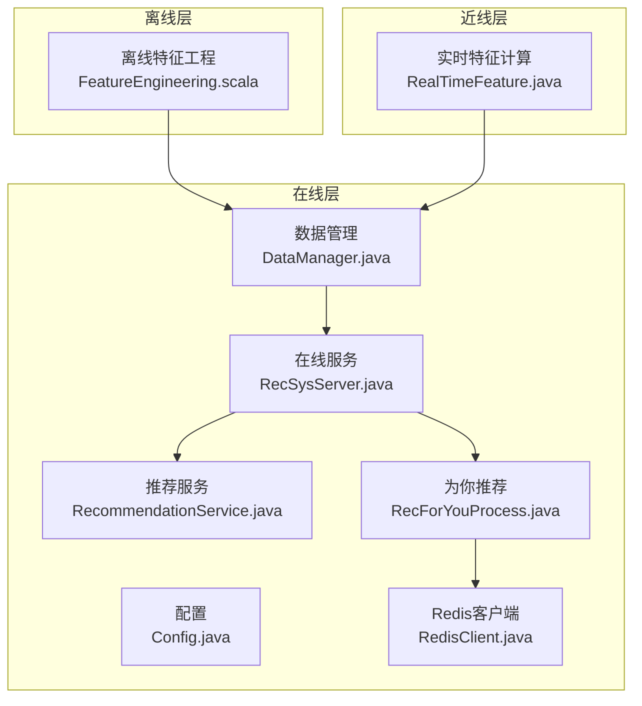
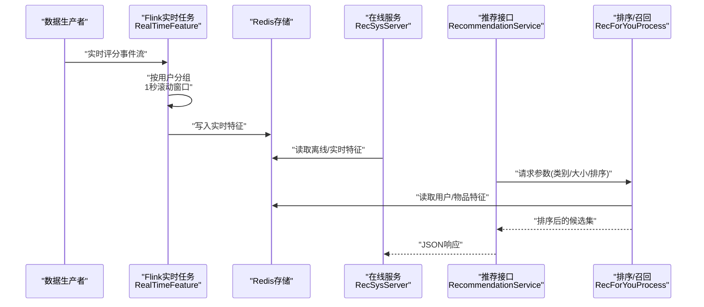
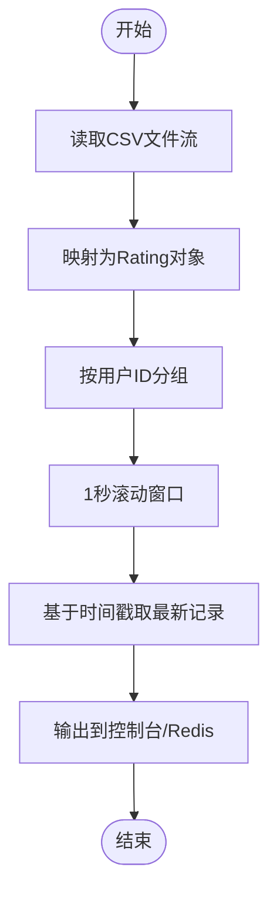
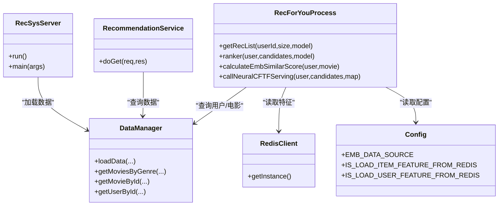
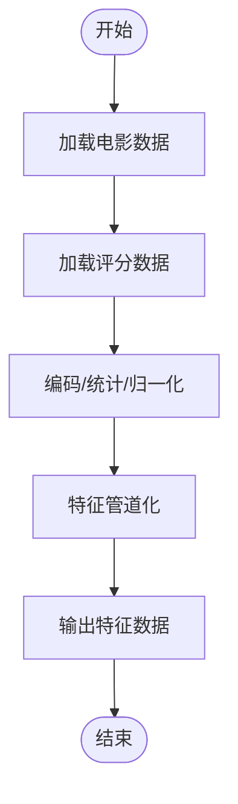
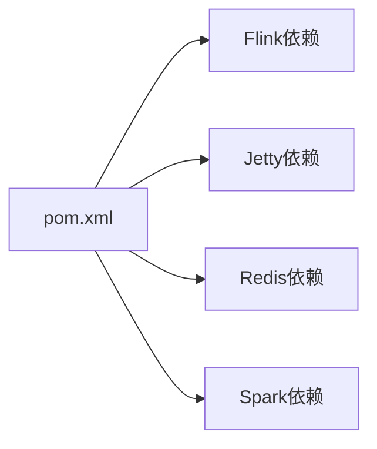

# 实时处理

<cite>
**本文引用的文件列表**
- [RealTimeFeature.java](file://src/main/java/com/sparrowrecsys/nearline/flink/RealTimeFeature.java)
- [RecSysServer.java](file://src/main/java/com/sparrowrecsys/online/RecSysServer.java)
- [DataManager.java](file://src/main/java/com/sparrowrecsys/online/datamanager/DataManager.java)
- [RecommendationService.java](file://src/main/java/com/sparrowrecsys/online/service/RecommendationService.java)
- [RecForYouProcess.java](file://src/main/java/com/sparrowrecsys/online/recprocess/RecForYouProcess.java)
- [Config.java](file://src/main/java/com/sparrowrecsys/online/util/Config.java)
- [RedisClient.java](file://src/main/java/com/sparrowrecsys/online/datamanager/RedisClient.java)
- [FeatureEngineering.scala](file://src/main/java/com/sparrowrecsys/offline/spark/featureeng/FeatureEngineering.scala)
- [pom.xml](file://pom.xml)
- [ratings.csv](file://src/main/resources/webroot/sampledata/ratings.csv)
- [README.md](file://README.md)
</cite>

## 目录
1. [简介](#简介)
2. [项目结构](#项目结构)
3. [核心组件](#核心组件)
4. [架构总览](#架构总览)
5. [详细组件分析](#详细组件分析)
6. [依赖分析](#依赖分析)
7. [性能考量](#性能考量)
8. [故障排查指南](#故障排查指南)
9. [结论](#结论)
10. [附录](#附录)

## 简介
本章节面向SparrowRecSys的实时处理模块，重点围绕基于Apache Flink的流式数据处理实现，解释实时特征更新与动态推荐的机制设计；阐述实时处理与离线批处理的差异与互补关系；说明实时特征计算的触发条件与更新频率，以及如何保证数据一致性与准确性；介绍流式处理中的窗口计算、状态管理、事件时间处理等关键技术；解释实时处理与在线服务的集成方式，以及如何将实时特征融入到推荐算法中；最后提供监控与调试方法，包括延迟监控、吞吐量统计、错误处理等，并给出实际的代码示例路径与配置说明，帮助开发者理解和优化实时处理系统。

## 项目结构
SparrowRecSys采用混合架构：离线批处理（Spark）负责特征工程与模型训练；近线流处理（Flink）负责实时特征与动态推荐；在线服务（Jetty）提供REST接口与前端页面。实时处理模块位于nearline/flink包下，当前实现以Flink批读取CSV文件演示流式窗口聚合，作为实时特征计算的原型。

图表来源
- [RealTimeFeature.java](file://src/main/java/com/sparrowrecsys/nearline/flink/RealTimeFeature.java#L30-L74)
- [RecSysServer.java](file://src/main/java/com/sparrowrecsys/online/RecSysServer.java#L18-L80)
- [DataManager.java](file://src/main/java/com/sparrowrecsys/online/datamanager/DataManager.java#L13-L295)
- [RecommendationService.java](file://src/main/java/com/sparrowrecsys/online/service/RecommendationService.java#L18-L48)
- [RecForYouProcess.java](file://src/main/java/com/sparrowrecsys/online/recprocess/RecForYouProcess.java#L20-L140)
- [Config.java](file://src/main/java/com/sparrowrecsys/online/util/Config.java#L3-L14)
- [RedisClient.java](file://src/main/java/com/sparrowrecsys/online/datamanager/RedisClient.java#L5-L26)
- [FeatureEngineering.scala](file://src/main/java/com/sparrowrecsys/offline/spark/featureeng/FeatureEngineering.scala#L11-L120)

章节来源
- [README.md](file://README.md#L19-L22)
- [pom.xml](file://pom.xml#L11-L228)

## 核心组件
- 实时特征计算（Flink）
  - RealTimeFeature.java：演示基于Flink的流式窗口聚合，按用户分组、1秒滚动窗口、基于时间戳的最新电影选择。
- 在线服务与数据管理
  - RecSysServer.java：启动Jetty服务，加载本地样本数据，绑定REST端点。
  - DataManager.java：统一加载电影、评分、嵌入向量、特征等数据，支持从文件或Redis加载。
  - RecommendationService.java：提供基于类别与排序的推荐接口。
  - RecForYouProcess.java：根据用户与候选集进行相似度打分或调用TF Serving进行预测。
  - Config.java：运行时配置项，如数据源、AB测试开关、是否从Redis加载特征。
  - RedisClient.java：单例Jedis连接，用于从Redis读取嵌入与特征。
- 离线特征工程
  - FeatureEngineering.scala：离线特征工程示例，包含one-hot、多热编码、评分统计与归一化等。

章节来源
- [RealTimeFeature.java](file://src/main/java/com/sparrowrecsys/nearline/flink/RealTimeFeature.java#L30-L74)
- [RecSysServer.java](file://src/main/java/com/sparrowrecsys/online/RecSysServer.java#L18-L80)
- [DataManager.java](file://src/main/java/com/sparrowrecsys/online/datamanager/DataManager.java#L39-L50)
- [RecommendationService.java](file://src/main/java/com/sparrowrecsys/online/service/RecommendationService.java#L18-L48)
- [RecForYouProcess.java](file://src/main/java/com/sparrowrecsys/online/recprocess/RecForYouProcess.java#L29-L60)
- [Config.java](file://src/main/java/com/sparrowrecsys/online/util/Config.java#L3-L14)
- [RedisClient.java](file://src/main/java/com/sparrowrecsys/online/datamanager/RedisClient.java#L5-L26)
- [FeatureEngineering.scala](file://src/main/java/com/sparrowrecsys/offline/spark/featureeng/FeatureEngineering.scala#L11-L120)

## 架构总览
实时处理与离线批处理的关系：
- 离线批处理：通过Spark完成大规模特征工程与模型训练，产出嵌入向量、特征缓存等。
- 近线流处理：通过Flink对实时事件流进行窗口化处理，生成实时特征（如用户最近交互、评分趋势等）。
- 在线服务：Jetty提供REST接口，结合离线与实时特征，返回推荐结果。

图表来源
- [RealTimeFeature.java](file://src/main/java/com/sparrowrecsys/nearline/flink/RealTimeFeature.java#L32-L68)
- [DataManager.java](file://src/main/java/com/sparrowrecsys/online/datamanager/DataManager.java#L39-L50)
- [RecommendationService.java](file://src/main/java/com/sparrowrecsys/online/service/RecommendationService.java#L18-L48)
- [RecForYouProcess.java](file://src/main/java/com/sparrowrecsys/online/recprocess/RecForYouProcess.java#L29-L60)
- [RedisClient.java](file://src/main/java/com/sparrowrecsys/online/datamanager/RedisClient.java#L5-L26)

## 详细组件分析

### 实时特征计算（Flink）
- 数据源与输入
  - 使用文件监控模式持续读取ratings.csv，模拟实时事件流。
- 分组与窗口
  - 按用户ID分组，使用1秒滚动窗口，窗口内基于时间戳选择最新电影。
- 输出与集成
  - 将窗口聚合结果输出到控制台，可扩展为写入Redis或Kafka供在线服务消费。

图表来源
- [RealTimeFeature.java](file://src/main/java/com/sparrowrecsys/nearline/flink/RealTimeFeature.java#L32-L68)
- [ratings.csv](file://src/main/resources/webroot/sampledata/ratings.csv#L1-L10)

章节来源
- [RealTimeFeature.java](file://src/main/java/com/sparrowrecsys/nearline/flink/RealTimeFeature.java#L30-L74)
- [ratings.csv](file://src/main/resources/webroot/sampledata/ratings.csv#L1-L800)

### 在线服务与数据管理
- 在线服务启动
  - RecSysServer启动Jetty，加载本地样本数据，注册多个REST端点。
- 数据管理
  - DataManager统一加载电影、链接、评分、嵌入向量与特征，支持从文件或Redis加载。
- 推荐服务
  - RecommendationService根据类别与排序参数返回电影列表。
- 为你推荐
  - RecForYouProcess根据用户与候选集进行相似度打分或调用TF Serving进行预测，支持从Redis加载用户特征。

图表来源
- [RecSysServer.java](file://src/main/java/com/sparrowrecsys/online/RecSysServer.java#L18-L80)
- [DataManager.java](file://src/main/java/com/sparrowrecsys/online/datamanager/DataManager.java#L39-L50)
- [RecommendationService.java](file://src/main/java/com/sparrowrecsys/online/service/RecommendationService.java#L18-L48)
- [RecForYouProcess.java](file://src/main/java/com/sparrowrecsys/online/recprocess/RecForYouProcess.java#L29-L60)
- [Config.java](file://src/main/java/com/sparrowrecsys/online/util/Config.java#L3-L14)
- [RedisClient.java](file://src/main/java/com/sparrowrecsys/online/datamanager/RedisClient.java#L5-L26)

章节来源
- [RecSysServer.java](file://src/main/java/com/sparrowrecsys/online/RecSysServer.java#L18-L80)
- [DataManager.java](file://src/main/java/com/sparrowrecsys/online/datamanager/DataManager.java#L39-L50)
- [RecommendationService.java](file://src/main/java/com/sparrowrecsys/online/service/RecommendationService.java#L18-L48)
- [RecForYouProcess.java](file://src/main/java/com/sparrowrecsys/online/recprocess/RecForYouProcess.java#L29-L60)
- [Config.java](file://src/main/java/com/sparrowrecsys/online/util/Config.java#L3-L14)
- [RedisClient.java](file://src/main/java/com/sparrowrecsys/online/datamanager/RedisClient.java#L5-L26)

### 离线特征工程（Spark）
- 功能概述
  - 提供one-hot、多热编码、评分统计、分桶与归一化等离线特征工程示例。
- 关键流程
  - 读取电影与评分数据，进行特征变换与管道化处理，输出处理后的特征数据。

图表来源
- [FeatureEngineering.scala](file://src/main/java/com/sparrowrecsys/offline/spark/featureeng/FeatureEngineering.scala#L11-L120)

章节来源
- [FeatureEngineering.scala](file://src/main/java/com/sparrowrecsys/offline/spark/featureeng/FeatureEngineering.scala#L11-L120)

## 依赖分析
- Maven依赖
  - Flink核心依赖：flink-java、flink-streaming-java、flink-clients。
  - Jetty：jetty-server、jetty-servlet。
  - Redis：jedis。
  - Spark：spark-core、spark-sql、spark-mllib。
- 版本与构建
  - Java 8、Scala 2.11、Flink 1.11.1、Spark 2.4.3。

图表来源
- [pom.xml](file://pom.xml#L60-L228)

章节来源
- [pom.xml](file://pom.xml#L11-L228)

## 性能考量
- 窗口与状态
  - 使用1秒滚动窗口进行高频更新，需关注状态大小与内存占用；建议在生产环境中根据业务QPS调整窗口大小与并行度。
- 事件时间与乱序
  - 当前实现未显式设置事件时间与水位线，若存在乱序事件，可能导致窗口结果不准确；建议启用事件时间语义与适当的乱序容忍。
- 并发与背压
  - 在线服务与实时任务共享资源时，需监控背压指标，避免下游阻塞。
- 缓存与一致性
  - 实时特征写入Redis后，需确保读取端的缓存一致性策略（如TTL、版本号）；对于高并发场景，建议引入分布式锁或幂等写入。

## 故障排查指南
- 启动与端口
  - RecSysServer默认监听端口可通过环境变量PORT覆盖；若端口冲突，检查系统端口占用。
- 数据加载
  - DataManager在加载电影、评分、嵌入与特征时会打印日志，若加载失败，检查数据路径与格式。
- Redis连接
  - RedisClient为单例Jedis，默认连接localhost:6379；若连接失败，检查Redis服务状态与网络连通性。
- 实时任务执行
  - RealTimeFeature使用文件监控模式读取CSV；若无新数据，确认文件路径与权限；若窗口无输出，检查时间戳字段与分组键。

章节来源
- [RecSysServer.java](file://src/main/java/com/sparrowrecsys/online/RecSysServer.java#L20-L33)
- [DataManager.java](file://src/main/java/com/sparrowrecsys/online/datamanager/DataManager.java#L53-L87)
- [RedisClient.java](file://src/main/java/com/sparrowrecsys/online/datamanager/RedisClient.java#L5-L26)
- [RealTimeFeature.java](file://src/main/java/com/sparrowrecsys/nearline/flink/RealTimeFeature.java#L32-L47)

## 结论
SparrowRecSys的实时处理模块以Flink演示了流式窗口聚合与实时特征输出，为后续接入真实事件源（如Kafka）与在线服务提供了基础框架。通过离线批处理与近线流处理的协同，系统能够在保证离线特征稳定性的同时，快速响应实时行为变化，提升推荐的时效性与准确性。建议在生产环境中完善事件时间、状态管理、容错与监控体系，并将实时特征与在线服务的接口进行解耦与幂等化设计。

## 附录
- 实时处理与离线批处理的互补关系
  - 离线批处理负责稳定、大规模的特征工程与模型训练；近线流处理负责实时行为的快速响应与短期趋势捕捉；在线服务统一融合两类特征，提供最终推荐结果。
- 实时特征计算的触发条件与更新频率
  - 触发条件：实时事件到达（如评分、点击）；更新频率：由窗口大小决定（当前示例为1秒滚动窗口）；建议根据业务场景调整窗口大小与并行度。
- 数据一致性与准确性保障
  - 通过Redis写入/读取的幂等设计、版本号或TTL策略，以及事件时间与水位线的正确配置，确保窗口计算的准确性与时序一致性。
- 流式处理的关键技术
  - 窗口计算：滚动窗口、滑动窗口、会话窗口；状态管理： keyed state、operator state；事件时间：watermark与乱序容忍。
- 实时处理与在线服务的集成
  - 实时特征写入Redis，推荐服务在请求时读取离线与实时特征，结合相似度或模型预测进行排序与返回。
- 监控与调试方法
  - 延迟监控：窗口计算延迟、Redis写入延迟；吞吐量统计：事件速率、窗口触发次数；错误处理：异常日志、重试与死信队列。