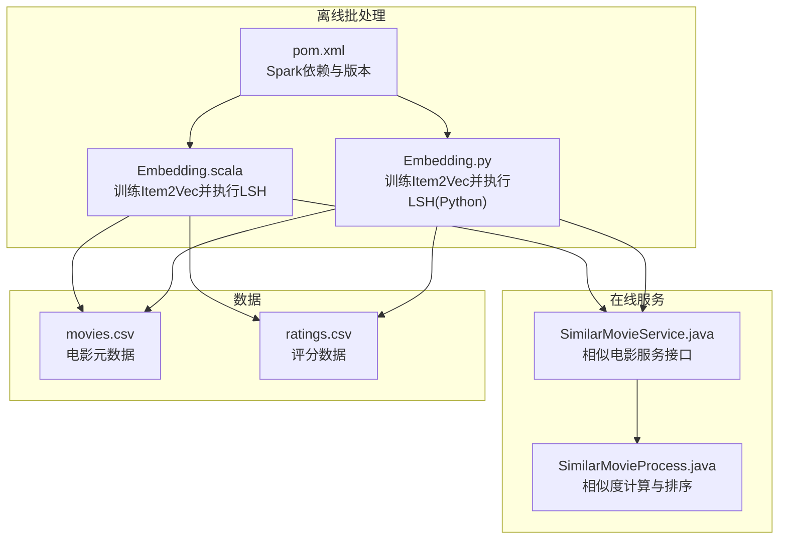
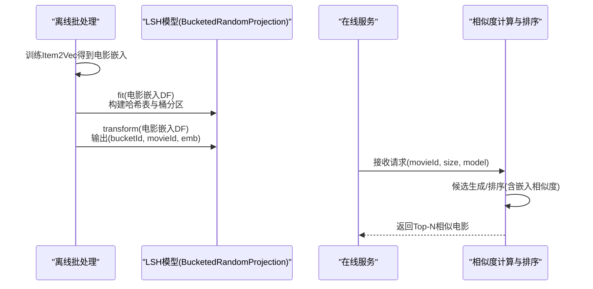
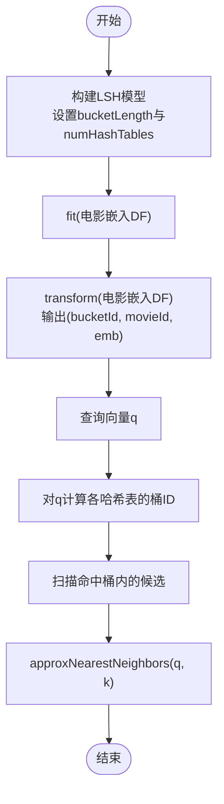
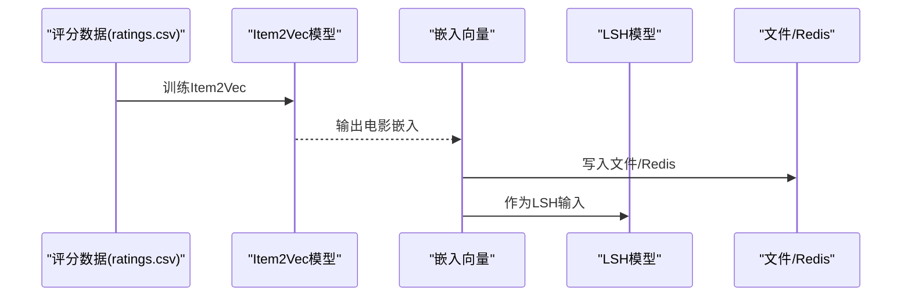
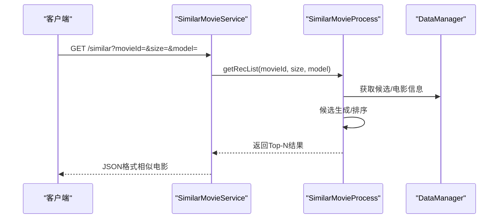
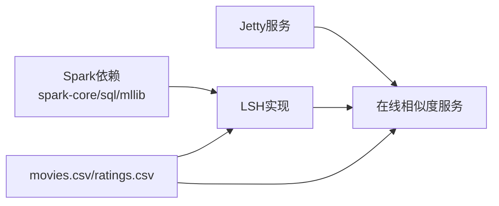

# LSH近似相似度搜索

<cite>
**本文引用的文件**
- [README.md](file://README.md)
- [Embedding.scala](file://src/main/java/com/sparrowrecsys/offline/spark/embedding/Embedding.scala)
- [Embedding.py](file://RecPySpark/src/com/sparrowrecsys/offline/pyspark/embedding/Embedding.py)
- [pom.xml](file://pom.xml)
- [movies.csv](file://src/main/resources/webroot/sampledata/movies.csv)
- [ratings.csv](file://src/main/resources/webroot/sampledata/ratings.csv)
- [SimilarMovieService.java](file://src/main/java/com/sparrowrecsys/online/service/SimilarMovieService.java)
- [SimilarMovieProcess.java](file://src/main/java/com/sparrowrecsys/online/recprocess/SimilarMovieProcess.java)
</cite>

## 目录
1. [引言](#引言)
2. [项目结构](#项目结构)
3. [核心组件](#核心组件)
4. [架构总览](#架构总览)
5. [详细组件分析](#详细组件分析)
6. [依赖关系分析](#依赖关系分析)
7. [性能考量](#性能考量)
8. [故障排查指南](#故障排查指南)
9. [结论](#结论)
10. [附录](#附录)

## 引言
本技术文档聚焦于LSH（局部敏感哈希）在高维嵌入向量相似度搜索中的应用，结合仓库中已有的Spark MLlib LSH实现，系统阐述以下内容：
- 哈希表构建与桶分区策略
- 近似最近邻搜索流程
- 相比精确KNN的优势（计算复杂度与内存消耗）
- 使用Spark MLlib进行电影嵌入的快速相似度检索的完整流程
- 参数调优方法（桶长与哈希表数量）
- 在推荐系统中的实际场景与最佳实践
- 搜索精度评估与性能对比思路
- 常见问题与解决方案

## 项目结构
该项目为混合语言的推荐系统，包含离线批处理（Spark）、在线服务（Jetty）、特征工程与模型训练等模块。与LSH直接相关的核心实现位于离线批处理的嵌入模块中，分别提供了Scala与Python两种实现方式。

图表来源
- [Embedding.scala](file://src/main/java/com/sparrowrecsys/offline/spark/embedding/Embedding.scala#L103-L138)
- [Embedding.py](file://RecPySpark/src/com/sparrowrecsys/offline/pyspark/embedding/Embedding.py#L67-L81)
- [pom.xml](file://pom.xml#L77-L96)
- [SimilarMovieService.java](file://src/main/java/com/sparrowrecsys/online/service/SimilarMovieService.java#L16-L38)
- [SimilarMovieProcess.java](file://src/main/java/com/sparrowrecsys/online/recprocess/SimilarMovieProcess.java#L20-L32)

章节来源
- [README.md](file://README.md#L1-L57)
- [pom.xml](file://pom.xml#L11-L227)

## 核心组件
- LSH模型与桶分区：通过BucketedRandomProjectionLSH在嵌入向量上构建哈希表与桶分区，加速相似度检索。
- Item2Vec嵌入：使用Word2Vec生成电影嵌入向量，作为LSH输入。
- 在线相似度服务：在线服务接收请求，调用候选生成与排序逻辑，支持多种相似度计算模式（含嵌入相似度）。

章节来源
- [Embedding.scala](file://src/main/java/com/sparrowrecsys/offline/spark/embedding/Embedding.scala#L103-L138)
- [Embedding.py](file://RecPySpark/src/com/sparrowrecsys/offline/pyspark/embedding/Embedding.py#L67-L81)
- [SimilarMovieService.java](file://src/main/java/com/sparrowrecsys/online/service/SimilarMovieService.java#L16-L38)
- [SimilarMovieProcess.java](file://src/main/java/com/sparrowrecsys/online/recprocess/SimilarMovieProcess.java#L20-L32)

## 架构总览
下图展示了从离线训练到在线相似度检索的整体流程，重点体现LSH在批处理阶段完成向量化与索引构建，在线阶段通过相似度服务调用候选生成与排序。

图表来源
- [Embedding.scala](file://src/main/java/com/sparrowrecsys/offline/spark/embedding/Embedding.scala#L103-L138)
- [Embedding.scala](file://src/main/java/com/sparrowrecsys/offline/spark/embedding/Embedding.scala#L230-L252)
- [Embedding.py](file://RecPySpark/src/com/sparrowrecsys/offline/pyspark/embedding/Embedding.py#L48-L64)
- [SimilarMovieService.java](file://src/main/java/com/sparrowrecsys/online/service/SimilarMovieService.java#L16-L38)
- [SimilarMovieProcess.java](file://src/main/java/com/sparrowrecsys/online/recprocess/SimilarMovieProcess.java#L20-L32)

## 详细组件分析

### LSH算法与桶分区策略
- 哈希函数族：采用随机投影（Random Projection）构造多条哈希函数，将高维向量映射到低位空间，使相似向量落入相同或相近桶的概率较高。
- 桶分区：通过设置桶长（bucketLength）控制桶的覆盖范围；桶越宽，碰撞概率越高但查询时需要扫描更多桶；桶越窄，桶内更稀疏但可能漏掉邻居。
- 哈希表数量（numHashTables）：增加哈希表数量可提升召回率，但会增加存储与查询开销；需在精度与性能间权衡。
- 近似最近邻（ANN）：通过approxNearestNeighbors在目标向量上查找命中桶内的候选，再进行精排或直接返回。

图表来源
- [Embedding.scala](file://src/main/java/com/sparrowrecsys/offline/spark/embedding/Embedding.scala#L230-L252)
- [Embedding.py](file://RecPySpark/src/com/sparrowrecsys/offline/pyspark/embedding/Embedding.py#L48-L64)

章节来源
- [Embedding.scala](file://src/main/java/com/sparrowrecsys/offline/spark/embedding/Embedding.scala#L230-L252)
- [Embedding.py](file://RecPySpark/src/com/sparrowrecsys/offline/pyspark/embedding/Embedding.py#L48-L64)

### Item2Vec嵌入与数据准备
- 使用评分序列训练Item2Vec，得到每部电影的稠密嵌入向量。
- 将嵌入向量写入本地文件或Redis，供后续离线LSH与在线相似度服务使用。
- 在线侧SimilarMovieProcess根据传入的model参数选择不同的相似度计算方式（如emb模式使用嵌入相似度）。

图表来源
- [Embedding.scala](file://src/main/java/com/sparrowrecsys/offline/spark/embedding/Embedding.scala#L103-L138)
- [Embedding.py](file://RecPySpark/src/com/sparrowrecsys/offline/pyspark/embedding/Embedding.py#L67-L81)
- [ratings.csv](file://src/main/resources/webroot/sampledata/ratings.csv#L1-L200)

章节来源
- [Embedding.scala](file://src/main/java/com/sparrowrecsys/offline/spark/embedding/Embedding.scala#L103-L138)
- [Embedding.py](file://RecPySpark/src/com/sparrowrecsys/offline/pyspark/embedding/Embedding.py#L67-L81)
- [ratings.csv](file://src/main/resources/webroot/sampledata/ratings.csv#L1-L200)

### 在线相似度服务与候选排序
- SimilarMovieService接收movieId、size、model等参数，调用SimilarMovieProcess获取相似电影列表。
- SimilarMovieProcess在emb模式下使用嵌入相似度计算；在默认模式下使用基于题材与评分的简单相似度。
- 支持多路候选生成（如按题材、评分、上映年份等）以扩大候选池，再进行排序。

图表来源
- [SimilarMovieService.java](file://src/main/java/com/sparrowrecsys/online/service/SimilarMovieService.java#L16-L38)
- [SimilarMovieProcess.java](file://src/main/java/com/sparrowrecsys/online/recprocess/SimilarMovieProcess.java#L20-L32)
- [SimilarMovieProcess.java](file://src/main/java/com/sparrowrecsys/online/recprocess/SimilarMovieProcess.java#L91-L112)
- [SimilarMovieProcess.java](file://src/main/java/com/sparrowrecsys/online/recprocess/SimilarMovieProcess.java#L121-L137)

章节来源
- [SimilarMovieService.java](file://src/main/java/com/sparrowrecsys/online/service/SimilarMovieService.java#L16-L38)
- [SimilarMovieProcess.java](file://src/main/java/com/sparrowrecsys/online/recprocess/SimilarMovieProcess.java#L20-L32)
- [SimilarMovieProcess.java](file://src/main/java/com/sparrowrecsys/online/recprocess/SimilarMovieProcess.java#L91-L112)
- [SimilarMovieProcess.java](file://src/main/java/com/sparrowrecsys/online/recprocess/SimilarMovieProcess.java#L121-L137)

### LSH参数调优方法
- 桶长（bucketLength）：影响桶的覆盖范围与碰撞密度。较小的桶长可减少桶内噪声，但可能遗漏邻居；较大的桶长提升召回但增加扫描成本。建议通过验证集评估不同桶长下的召回与延迟。
- 哈希表数量（numHashTables）：增加哈希表数量可提高召回率，但会增大存储与查询开销。建议先固定桶长，逐步增加哈希表数量观察指标变化。
- 查询规模与候选池：结合在线侧的候选生成策略（如按题材、评分、年份等），在保证覆盖率的前提下控制候选池大小，避免LSH扫描过多桶导致延迟上升。

章节来源
- [Embedding.scala](file://src/main/java/com/sparrowrecsys/offline/spark/embedding/Embedding.scala#L236-L240)
- [Embedding.py](file://RecPySpark/src/com/sparrowrecsys/offline/pyspark/embedding/Embedding.py#L54-L55)
- [SimilarMovieProcess.java](file://src/main/java/com/sparrowrecsys/online/recprocess/SimilarMovieProcess.java#L39-L83)

### LSH在推荐系统中的应用场景
- 实时相似电影推荐：在线服务通过emb模式调用嵌入相似度，结合LSH快速定位候选，满足低延迟需求。
- 大规模向量检索：离线阶段完成LSH索引构建，线上仅做近似检索与排序，显著降低计算与内存压力。
- 多模态融合：在候选生成阶段可融合题材、评分、时间等特征，LSH负责高维向量相似度的快速近似。

章节来源
- [SimilarMovieService.java](file://src/main/java/com/sparrowrecsys/online/service/SimilarMovieService.java#L16-L38)
- [SimilarMovieProcess.java](file://src/main/java/com/sparrowrecsys/online/recprocess/SimilarMovieProcess.java#L91-L112)
- [SimilarMovieProcess.java](file://src/main/java/com/sparrowrecsys/online/recprocess/SimilarMovieProcess.java#L121-L137)

### 搜索精度评估与性能对比
- 精度评估：可使用召回率（Recall@K）与平均倒数排名（MRR@K）等指标，对比LSH与精确KNN在相同查询集上的表现。建议在验证集上固定查询样本，比较不同参数组合下的指标。
- 性能对比：记录LSH与精确KNN在查询延迟、吞吐量、内存占用等方面的差异；结合候选池大小与桶参数，绘制延迟-召回曲线，辅助参数选择。

[本节为通用方法论，不直接分析具体文件]

## 依赖关系分析
- Spark依赖：项目使用Spark SQL与MLlib进行向量处理与LSH实现。
- 在线服务：使用Jetty提供HTTP接口，调用相似度计算与排序逻辑。
- 数据源：使用本地CSV文件（movies.csv、ratings.csv）作为离线训练与在线查询的数据基础。

图表来源
- [pom.xml](file://pom.xml#L77-L96)
- [SimilarMovieService.java](file://src/main/java/com/sparrowrecsys/online/service/SimilarMovieService.java#L16-L38)
- [Embedding.scala](file://src/main/java/com/sparrowrecsys/offline/spark/embedding/Embedding.scala#L103-L138)

章节来源
- [pom.xml](file://pom.xml#L77-L96)
- [movies.csv](file://src/main/resources/webroot/sampledata/movies.csv#L1-L200)
- [ratings.csv](file://src/main/resources/webroot/sampledata/ratings.csv#L1-L200)

## 性能考量
- LSH优势：通过桶分区与多表哈希，将高维向量相似度搜索从O(Nd)降至近似O(1/β)查询复杂度（β为碰撞概率），显著降低计算与内存消耗。
- 存储与内存：LSH索引占用与哈希表数量、桶长、向量维度相关；应结合业务规模与硬件资源进行容量规划。
- 延迟与吞吐：可通过调整桶长与哈希表数量平衡延迟与吞吐；同时优化候选池大小与在线排序策略。

[本节为通用指导，不直接分析具体文件]

## 故障排查指南
- LSH模型未生效：确认是否正确调用fit与transform，检查输入列名与向量类型。
- 查询无结果：检查bucketLength是否过大导致命中桶为空，或numHashTables过少导致召回不足。
- 在线相似度异常：确认emb模式下电影嵌入是否加载成功，以及候选生成逻辑是否正确过滤输入电影自身。
- 性能退化：监控候选池大小与桶扫描数量，必要时缩小桶长或减少哈希表数量。

章节来源
- [Embedding.scala](file://src/main/java/com/sparrowrecsys/offline/spark/embedding/Embedding.scala#L230-L252)
- [Embedding.py](file://RecPySpark/src/com/sparrowrecsys/offline/pyspark/embedding/Embedding.py#L48-L64)
- [SimilarMovieProcess.java](file://src/main/java/com/sparrowrecsys/online/recprocess/SimilarMovieProcess.java#L91-L112)

## 结论
本项目在离线阶段通过Item2Vec生成电影嵌入，并使用Spark MLlib的BucketedRandomProjectionLSH构建高效索引；在线阶段通过相似度服务与候选排序实现低延迟的相似电影推荐。通过合理设置桶长与哈希表数量，可在精度与性能之间取得良好平衡，满足实时推荐场景的需求。

[本节为总结性内容，不直接分析具体文件]

## 附录

### 使用Spark MLlib进行LSH的完整流程（步骤说明）
- 准备嵌入向量：使用Item2Vec训练得到电影嵌入，确保向量维度一致且归一化（可选）。
- 构建LSH模型：设置bucketLength与numHashTables，调用fit对嵌入数据进行建模。
- 批量打标：对所有电影嵌入调用transform，输出(bucketId, movieId, emb)，用于后续查询加速。
- 近似查询：对目标向量调用approxNearestNeighbors，返回Top-K候选。
- 在线集成：在SimilarMovieService中根据model参数选择emb模式，调用嵌入相似度计算与排序。

章节来源
- [Embedding.scala](file://src/main/java/com/sparrowrecsys/offline/spark/embedding/Embedding.scala#L103-L138)
- [Embedding.scala](file://src/main/java/com/sparrowrecsys/offline/spark/embedding/Embedding.scala#L230-L252)
- [Embedding.py](file://RecPySpark/src/com/sparrowrecsys/offline/pyspark/embedding/Embedding.py#L48-L64)
- [SimilarMovieService.java](file://src/main/java/com/sparrowrecsys/online/service/SimilarMovieService.java#L16-L38)
- [SimilarMovieProcess.java](file://src/main/java/com/sparrowrecsys/online/recprocess/SimilarMovieProcess.java#L121-L137)