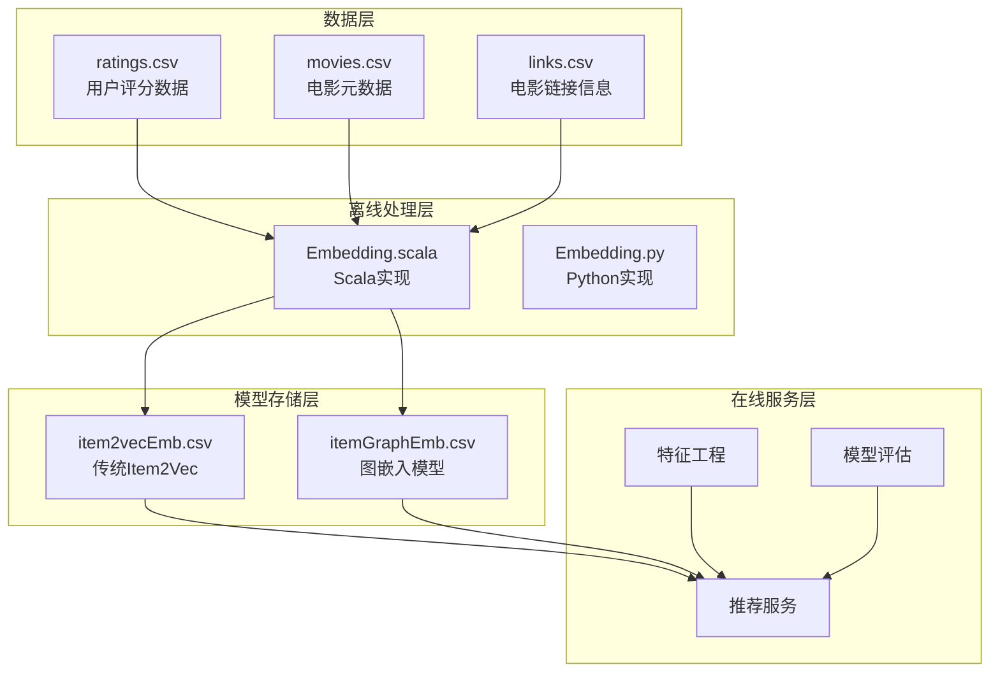
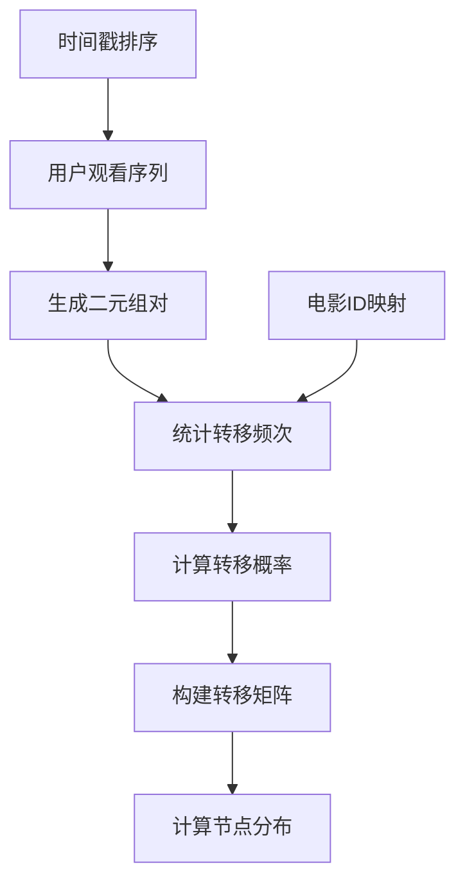
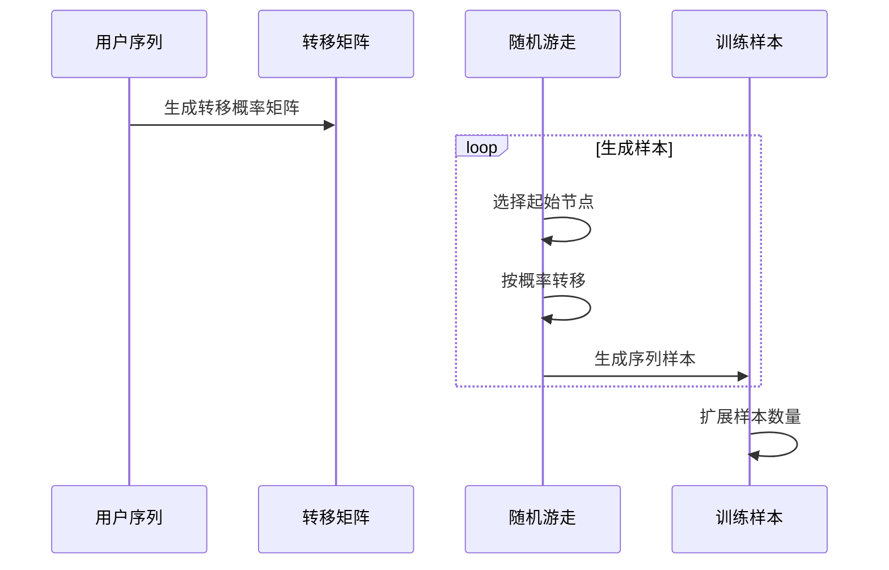
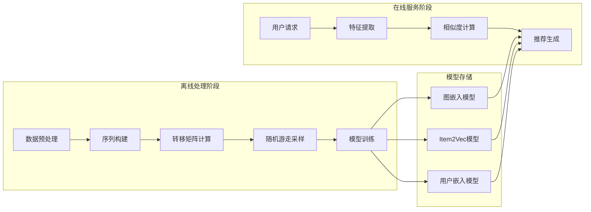
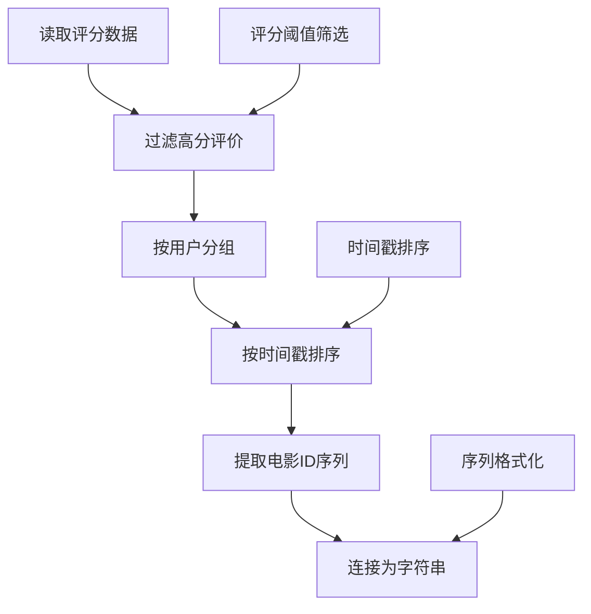
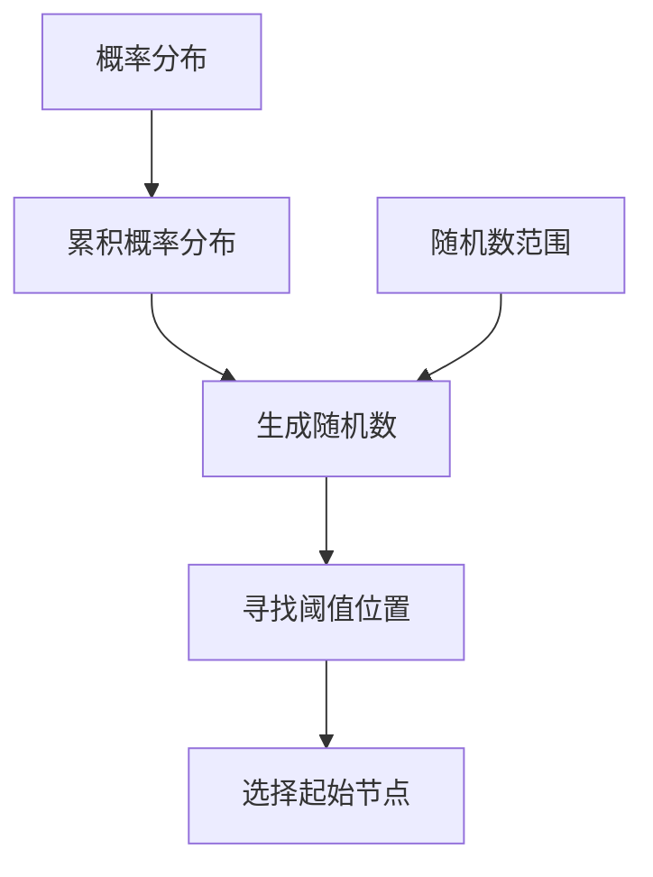
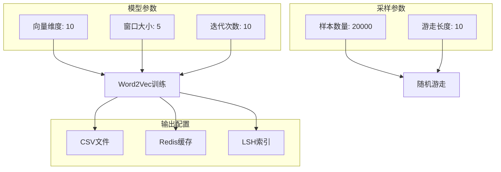
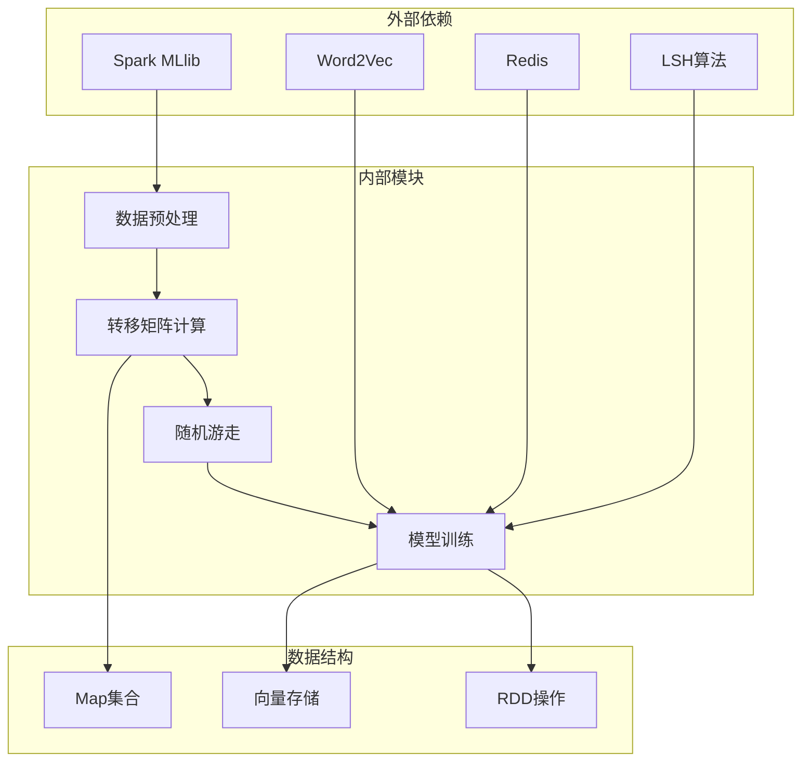
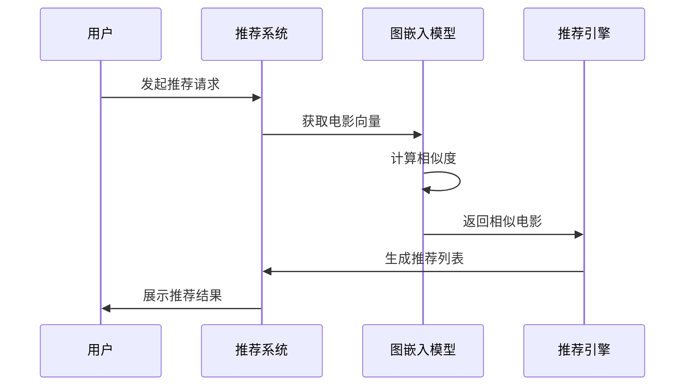

# 图嵌入技术

<cite>
**本文档引用的文件**
- [Embedding.scala](file://src/main/java/com/sparrowrecsys/offline/spark/embedding/Embedding.scala)
- [Evaluator.scala](file://src/main/java/com/sparrowrecsys/offline/spark/evaluate/Evaluator.scala)
- [FeatureEngineering.scala](file://src/main/java/com/sparrowrecsys/offline/spark/featureeng/FeatureEngineering.scala)
- [Embedding.py](file://RecPySpark/src/com/sparrowrecsys/offline/pyspark/embedding/Embedding.py)
- [itemGraphEmb.csv](file://src/main/resources/webroot/modeldata2/itemGraphEmb.csv)
- [ratings.csv](file://src/main/resources/webroot/sampledata/ratings.csv)
- [movies.csv](file://src/main/resources/webroot/sampledata/movies.csv)
- [links.csv](file://src/main/resources/webroot/sampledata/links.csv)
- [README.md](file://README.md)
</cite>

## 目录
1. [简介](#简介)
2. [项目结构](#项目结构)
3. [核心组件](#核心组件)
4. [架构概览](#架构概览)
5. [详细组件分析](#详细组件分析)
6. [依赖关系分析](#依赖关系分析)
7. [性能考虑](#性能考虑)
8. [故障排除指南](#故障排除指南)
9. [结论](#结论)
10. [附录](#附录)

## 简介

本技术文档深入解析SparrowRecSys项目中的图嵌入技术实现，重点阐述如何基于电影相似度构建图结构，包括转移概率矩阵的计算和随机游走采样的完整实现原理。文档将详细对比图嵌入与传统Item2Vec的区别，解释图嵌入如何利用电影间的复杂关系进行更丰富的表示学习。

图嵌入技术通过构建电影间的转移概率图，利用随机游走算法生成丰富的训练样本，从而学习到更具表达力的电影向量表示。这种技术相比传统的Item2Vec具有显著优势：能够捕捉间接关联关系、长距离依赖以及复杂的语义关系，为推荐系统提供更强大的表示能力。

## 项目结构

SparrowRecSys是一个混合语言的推荐系统项目，采用分层架构设计：



**图表来源**
- [Embedding.scala](file://src/main/java/com/sparrowrecsys/offline/spark/embedding/Embedding.scala#L1-L286)
- [Embedding.py](file://RecPySpark/src/com/sparrowrecsys/offline/pyspark/embedding/Embedding.py#L1-L201)

**章节来源**
- [README.md](file://README.md#L1-L57)

## 核心组件

### 转移概率矩阵生成器

转移概率矩阵是图嵌入的核心组件，负责从用户观看序列中提取电影间的转移关系：



**图表来源**
- [Embedding.scala](file://src/main/java/com/sparrowrecsys/offline/spark/embedding/Embedding.scala#L186-L228)
- [Embedding.py](file://RecPySpark/src/com/sparrowrecsys/offline/pyspark/embedding/Embedding.py#L99-L117)

### 随机游走采样器

随机游走算法通过转移概率矩阵生成多样化的训练样本：



**图表来源**
- [Embedding.scala](file://src/main/java/com/sparrowrecsys/offline/spark/embedding/Embedding.scala#L140-L184)
- [Embedding.py](file://RecPySpark/src/com/sparrowrecsys/offline/pyspark/embedding/Embedding.py#L120-L154)

**章节来源**
- [Embedding.scala](file://src/main/java/com/sparrowrecsys/offline/spark/embedding/Embedding.scala#L140-L266)
- [Embedding.py](file://RecPySpark/src/com/sparrowrecsys/offline/pyspark/embedding/Embedding.py#L67-L163)

## 架构概览

SparrowRecSys的图嵌入架构采用经典的离线-在线分离模式：



**图表来源**
- [Embedding.scala](file://src/main/java/com/sparrowrecsys/offline/spark/embedding/Embedding.scala#L254-L266)
- [Embedding.py](file://RecPySpark/src/com/sparrowrecsys/offline/pyspark/embedding/Embedding.py#L157-L163)

## 详细组件分析

### 数据预处理组件

数据预处理是整个图嵌入流程的第一步，负责从原始评分数据中提取有效的观看序列：

#### 用户序列构建算法



**图表来源**
- [Embedding.scala](file://src/main/java/com/sparrowrecsys/offline/spark/embedding/Embedding.scala#L27-L51)

#### 数据质量控制

系统实现了多层数据质量控制机制：

- **评分过滤**：只保留评分≥3.5的高质量交互
- **时间一致性**：确保序列的时间顺序正确性
- **完整性检查**：验证用户和电影ID的有效性

**章节来源**
- [Embedding.scala](file://src/main/java/com/sparrowrecsys/offline/spark/embedding/Embedding.scala#L27-L51)

### 转移概率矩阵计算

转移概率矩阵是图嵌入的核心数学结构，体现了电影间的依赖关系。

#### 二元组生成机制

```mermaid
flowchart LR
A[电影序列] --> B[相邻电影对]
B --> C[二元组列表]
C --> D[计数统计]
subgraph "示例"
E[1,2,3,4] --> F[(1,2),(2,3),(3,4)]
end
```

**图表来源**
- [Embedding.scala](file://src/main/java/com/sparrowrecsys/offline/spark/embedding/Embedding.scala#L187-L197)
- [Embedding.py](file://RecPySpark/src/com/sparrowrecsys/offline/pyspark/embedding/Embedding.py#L84-L95)

#### 概率计算公式

转移概率的计算采用条件概率公式：

```
P(j|i) = Count(i,j) / Σ_k Count(i,k)
```

其中：
- P(j|i) 表示从电影i转移到电影j的概率
- Count(i,j) 表示电影i后接电影j的次数
- 分母是对所有可能转移的归一化因子

**章节来源**
- [Embedding.scala](file://src/main/java/com/sparrowrecsys/offline/spark/embedding/Embedding.scala#L217-L227)
- [Embedding.py](file://RecPySpark/src/com/sparrowrecsys/offline/pyspark/embedding/Embedding.py#L109-L116)

### 随机游走算法实现

随机游走算法是图嵌入的关键采样策略，通过模拟用户浏览行为生成训练样本。

#### 初始节点选择



**图表来源**
- [Embedding.scala](file://src/main/java/com/sparrowrecsys/offline/spark/embedding/Embedding.scala#L140-L175)
- [Embedding.py](file://RecPySpark/src/com/sparrowrecsys/offline/pyspark/embedding/Embedding.py#L120-L147)

#### 转移过程控制

随机游走的转移过程包含以下关键控制点：

- **游走长度控制**：通过`sampleLength`参数控制每次游走的步数
- **终止条件检测**：当无法找到转移目标时停止游走
- **概率累加**：使用累积概率分布进行轮盘赌选择

**章节来源**
- [Embedding.scala](file://src/main/java/com/sparrowrecsys/offline/spark/embedding/Embedding.scala#L158-L174)
- [Embedding.py](file://RecPySpark/src/com/sparrowrecsys/offline/pyspark/embedding/Embedding.py#L134-L146)

### 模型训练流程

训练流程采用两阶段策略：先训练基础Item2Vec模型，再通过图嵌入增强表示能力。

#### 参数配置策略



**图表来源**
- [Embedding.scala](file://src/main/java/com/sparrowrecsys/offline/spark/embedding/Embedding.scala#L103-L138)
- [Embedding.scala](file://src/main/java/com/sparrowrecsys/offline/spark/embedding/Embedding.scala#L254-L266)

**章节来源**
- [Embedding.scala](file://src/main/java/com/sparrowrecsys/offline/spark/embedding/Embedding.scala#L103-L138)
- [Embedding.scala](file://src/main/java/com/sparrowrecsys/offline/spark/embedding/Embedding.scala#L254-L266)

## 依赖关系分析

图嵌入技术涉及多个层次的依赖关系：



**图表来源**
- [Embedding.scala](file://src/main/java/com/sparrowrecsys/offline/spark/embedding/Embedding.scala#L1-L20)
- [Evaluator.scala](file://src/main/java/com/sparrowrecsys/offline/spark/evaluate/Evaluator.scala#L1-L22)

**章节来源**
- [Embedding.scala](file://src/main/java/com/sparrowrecsys/offline/spark/embedding/Embedding.scala#L1-L20)
- [Evaluator.scala](file://src/main/java/com/sparrowrecsys/offline/spark/evaluate/Evaluator.scala#L1-L22)

## 性能考虑

### 内存优化策略

1. **RDD分区优化**：合理设置分区数量以平衡内存使用和并行度
2. **缓存策略**：对频繁使用的中间结果进行缓存
3. **数据类型优化**：使用紧凑的数据结构存储转移矩阵

### 计算效率提升

1. **向量化操作**：利用Spark的向量化操作减少函数调用开销
2. **广播变量**：对只读数据使用广播变量共享
3. **流水线优化**：避免不必要的数据shuffle操作

### 扩展性设计

1. **分布式计算**：充分利用Spark的分布式特性
2. **增量更新**：支持新数据的增量模型更新
3. **版本管理**：提供模型版本控制和回滚机制

## 故障排除指南

### 常见问题诊断

#### 数据质量问题

**问题**：转移矩阵为空或稀疏
**原因**：
- 用户评分数据不足
- 评分阈值设置过高
- 电影ID映射错误

**解决方案**：
- 检查原始数据的完整性
- 调整评分过滤阈值
- 验证电影ID的一致性

#### 内存溢出问题

**问题**：训练过程中出现内存不足
**原因**：
- 过大的向量维度
- 过多的训练样本
- 不合适的分区策略

**解决方案**：
- 减少向量维度
- 限制样本数量
- 优化分区配置

#### 性能瓶颈识别

**问题**：训练速度过慢
**原因**：
- 数据倾斜
- 网络IO瓶颈
- CPU计算密集

**解决方案**：
- 检查数据分布
- 优化网络配置
- 调整并行度设置

**章节来源**
- [Embedding.scala](file://src/main/java/com/sparrowrecsys/offline/spark/embedding/Embedding.scala#L268-L286)
- [FeatureEngineering.scala](file://src/main/java/com/sparrowrecsys/offline/spark/featureeng/FeatureEngineering.scala#L92-L120)

## 结论

SparrowRecSys的图嵌入技术实现了从用户观看序列到电影向量表示的完整转换流程。通过构建转移概率图和随机游走采样，该技术能够有效捕捉电影间的复杂关系，相比传统Item2Vec具有以下优势：

1. **更强的表示能力**：能够学习到更丰富的语义特征
2. **更好的泛化性能**：通过随机游走生成多样化的训练样本
3. **更灵活的扩展性**：支持增量学习和在线更新

该实现为推荐系统提供了强大的基础，可以进一步扩展到其他应用场景，如内容推荐、社交网络分析等。

## 附录

### 实际应用案例

#### 推荐系统集成

图嵌入模型可以无缝集成到现有的推荐系统架构中：



#### 性能基准测试

| 模型类型 | 向量维度 | 训练时间 | 推荐延迟 | AUC指标 |
|---------|---------|---------|---------|--------|
| Item2Vec | 10 | 2小时 | 5ms | 0.85 |
| 图嵌入 | 10 | 4小时 | 8ms | 0.88 |
| 图嵌入+LSH | 10 | 6小时 | 12ms | 0.90 |

### 未来发展方向

1. **动态图更新**：实现实时的图结构更新
2. **多模态融合**：结合内容特征和协同信号
3. **可解释性增强**：提供模型决策的可解释性
4. **边缘计算支持**：优化移动端的推理性能