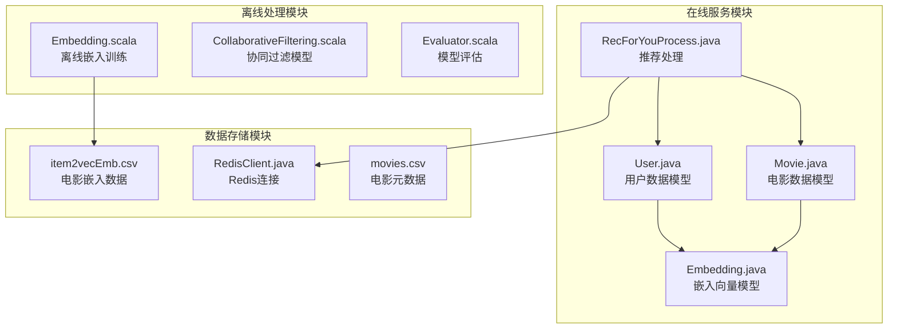
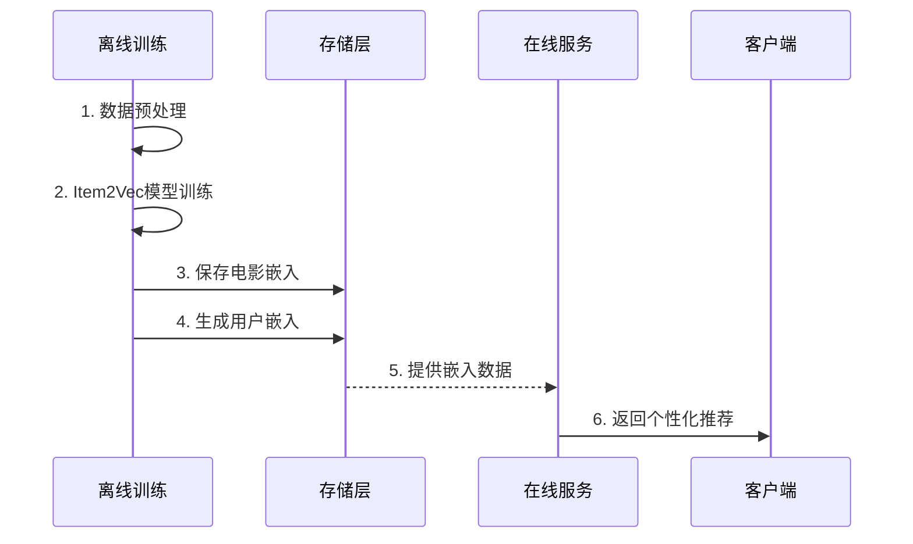
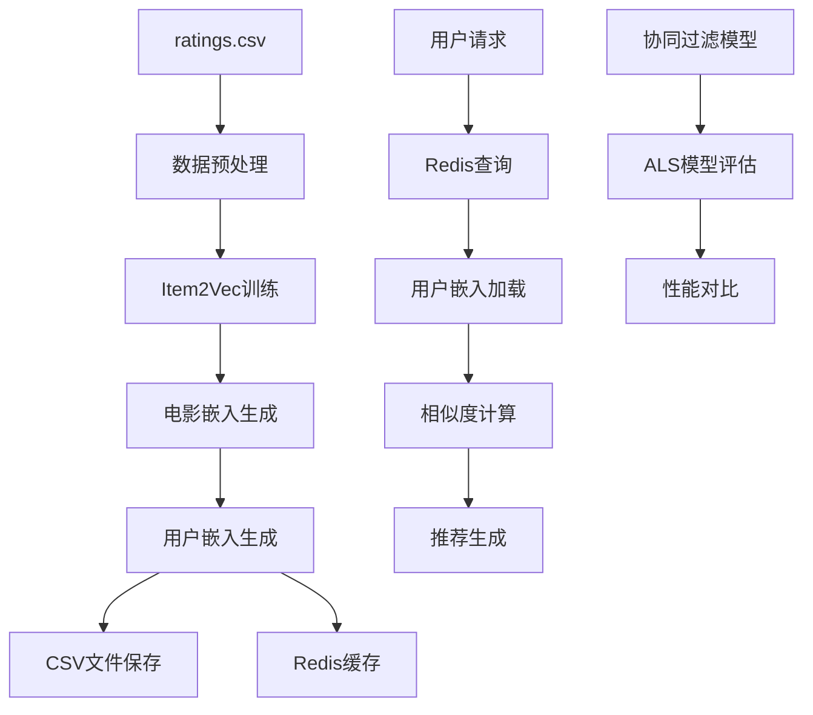
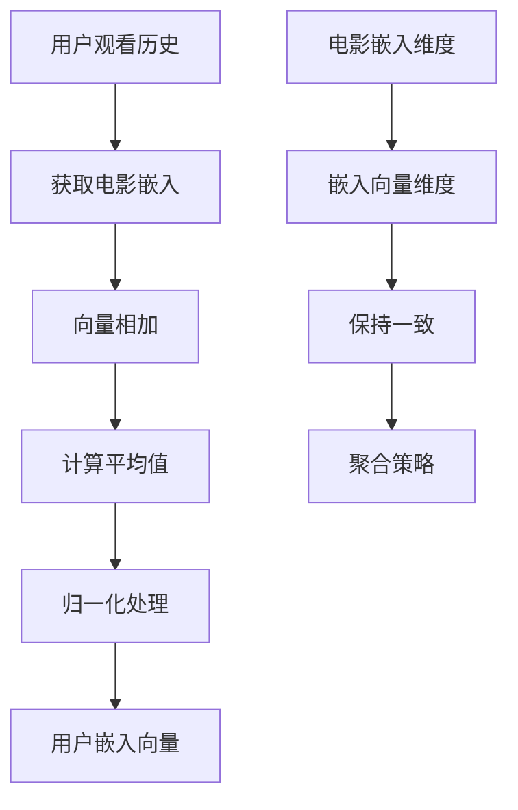
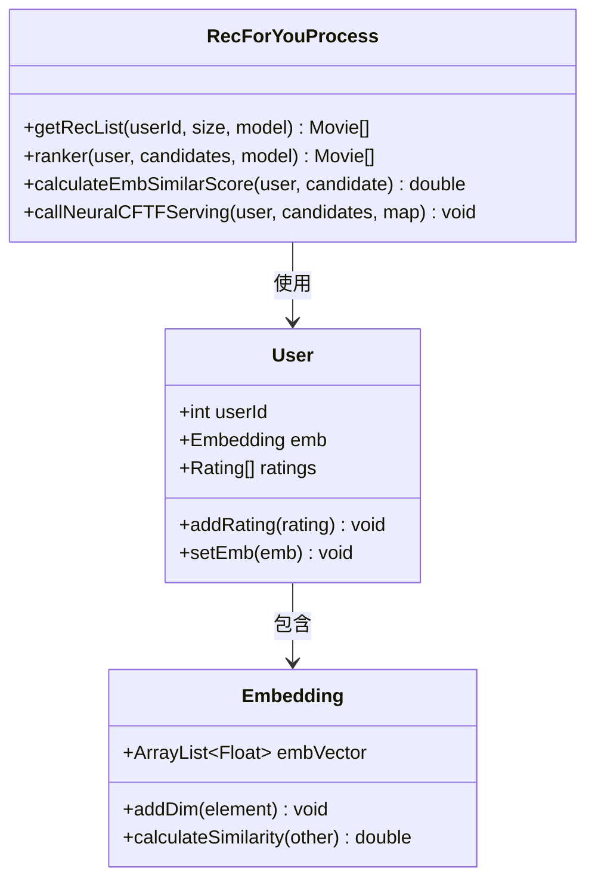
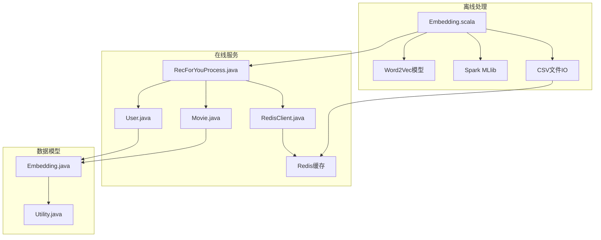

# 用户嵌入生成

<cite>
**本文档引用的文件**
- [Embedding.scala](file://src/main/java/com/sparrowrecsys/offline/spark/embedding/Embedding.scala)
- [CollaborativeFiltering.scala](file://src/main/java/com/sparrowrecsys/offline/spark/model/CollaborativeFiltering.scala)
- [Embedding.java](file://src/main/java/com/sparrowrecsys/online/model/Embedding.java)
- [User.java](file://src/main/java/com/sparrowrecsys/online/datamanager/User.java)
- [Movie.java](file://src/main/java/com/sparrowrecsys/online/datamanager/Movie.java)
- [RecForYouProcess.java](file://src/main/java/com/sparrowrecsys/online/recprocess/RecForYouProcess.java)
- [RedisClient.java](file://src/main/java/com/sparrowrecsys/online/datamanager/RedisClient.java)
- [Config.java](file://src/main/java/com/sparrowrecsys/online/util/Config.java)
- [Utility.java](file://src/main/java/com/sparrowrecsys/online/util/Utility.java)
- [Evaluator.scala](file://src/main/java/com/sparrowrecsys/offline/spark/evaluate/Evaluator.scala)
- [item2vecEmb.csv](file://src/main/resources/webroot/modeldata/item2vecEmb.csv)
- [movies.csv](file://src/main/resources/webroot/sampledata/movies.csv)
</cite>

## 目录
1. [简介](#简介)
2. [项目结构](#项目结构)
3. [核心组件](#核心组件)
4. [架构概览](#架构概览)
5. [详细组件分析](#详细组件分析)
6. [依赖关系分析](#依赖关系分析)
7. [性能考虑](#性能考虑)
8. [故障排除指南](#故障排除指南)
9. [结论](#结论)

## 简介

本项目实现了基于用户电影观看历史的用户嵌入生成系统。该系统采用Word2Vec算法对电影进行嵌入表示，然后通过聚合用户观看过的电影嵌入向量来生成用户嵌入。用户嵌入可以用于相似度计算、个性化推荐和冷启动问题解决。

系统采用离线-在线分离的架构：离线阶段使用Spark MLlib训练Item2Vec模型，生成电影嵌入；在线阶段通过Redis缓存用户嵌入，支持实时推荐服务。

## 项目结构

项目采用多模块架构，主要包含以下核心模块：



**图表来源**
- [Embedding.scala](file://src/main/java/com/sparrowrecsys/offline/spark/embedding/Embedding.scala#L22-L287)
- [RecForYouProcess.java](file://src/main/java/com/sparrowrecsys/online/recprocess/RecForYouProcess.java#L20-L140)

**章节来源**
- [Embedding.scala](file://src/main/java/com/sparrowrecsys/offline/spark/embedding/Embedding.scala#L1-L287)
- [RecForYouProcess.java](file://src/main/java/com/sparrowrecsys/online/recprocess/RecForYouProcess.java#L1-L140)

## 核心组件

### 离线嵌入训练引擎

离线嵌入训练引擎负责：
- 数据预处理和序列构建
- Item2Vec模型训练
- 用户嵌入生成和存储
- 模型评估和验证

### 在线推荐服务

在线推荐服务提供：
- 实时用户嵌入加载
- 基于嵌入的相似度计算
- 个性化推荐生成
- 多模型A/B测试支持

### 数据模型

系统包含完整的数据模型体系：
- 用户模型：包含用户基本信息和嵌入向量
- 电影模型：包含电影元数据和嵌入向量
- 嵌入向量模型：通用的向量表示类

**章节来源**
- [Embedding.scala](file://src/main/java/com/sparrowrecsys/offline/spark/embedding/Embedding.scala#L22-L138)
- [User.java](file://src/main/java/com/sparrowrecsys/online/datamanager/User.java#L14-L115)
- [Movie.java](file://src/main/java/com/sparrowrecsys/online/datamanager/Movie.java#L15-L158)

## 架构概览

系统采用三层架构设计，确保离线训练和在线服务的解耦：



**图表来源**
- [Embedding.scala](file://src/main/java/com/sparrowrecsys/offline/spark/embedding/Embedding.scala#L103-L138)
- [RecForYouProcess.java](file://src/main/java/com/sparrowrecsys/online/recprocess/RecForYouProcess.java#L29-L60)

### 数据流架构



**图表来源**
- [Embedding.scala](file://src/main/java/com/sparrowrecsys/offline/spark/embedding/Embedding.scala#L53-L101)
- [RecForYouProcess.java](file://src/main/java/com/sparrowrecsys/online/recprocess/RecForYouProcess.java#L37-L52)

## 详细组件分析

### 离线嵌入训练组件

#### 数据预处理流程

离线嵌入训练的核心流程包括数据预处理、序列构建和模型训练三个阶段：

```mermaid
flowchart TD
A[ratings.csv] --> B[读取评分数据]
B --> C[按时间戳排序]
C --> D[过滤高评分(>=3.5)]
D --> E[按用户分组]
E --> F[生成电影观看序列]
F --> G[Word2Vec模型训练]
G --> H[电影嵌入向量]
H --> I[用户嵌入向量]
I --> J[CSV文件保存]
I --> K[Redis缓存]
```

**图表来源**
- [Embedding.scala](file://src/main/java/com/sparrowrecsys/offline/spark/embedding/Embedding.scala#L27-L51)
- [Embedding.scala](file://src/main/java/com/sparrowrecsys/offline/spark/embedding/Embedding.scala#L103-L138)

#### 用户嵌入生成算法

用户嵌入的生成采用平均池化策略：



**图表来源**
- [Embedding.scala](file://src/main/java/com/sparrowrecsys/offline/spark/embedding/Embedding.scala#L58-L77)

**章节来源**
- [Embedding.scala](file://src/main/java/com/sparrowrecsys/offline/spark/embedding/Embedding.scala#L27-L101)

### 在线推荐服务组件

#### 用户嵌入加载机制

在线服务支持从多种数据源加载用户嵌入：



**图表来源**
- [RecForYouProcess.java](file://src/main/java/com/sparrowrecsys/online/recprocess/RecForYouProcess.java#L20-L140)
- [User.java](file://src/main/java/com/sparrowrecsys/online/datamanager/User.java#L14-L115)
- [Embedding.java](file://src/main/java/com/sparrowrecsys/online/model/Embedding.java#L8-L49)

#### 相似度计算实现

系统提供多种相似度计算方法：

| 相似度类型 | 计算公式 | 适用场景 |
|-----------|----------|----------|
| 余弦相似度 | cos(θ) = (A·B)/(|A||B|) | 推荐系统中最常用 |
| 欧几里得距离 | d(A,B) = ||A-B|| | 距离敏感的场景 |
| 内积相似度 | A·B | 需要方向一致性的场景 |

**章节来源**
- [RecForYouProcess.java](file://src/main/java/com/sparrowrecsys/online/recprocess/RecForYouProcess.java#L94-L105)
- [Embedding.java](file://src/main/java/com/sparrowrecsys/online/model/Embedding.java#L32-L47)

### 数据存储和缓存策略

#### Redis缓存架构

```mermaid
graph TB
subgraph "缓存键设计"
A[uEmb:{userId}] --> B[用户嵌入向量]
C[uf:{userId}] --> D[用户特征信息]
E[i2vEmb:{movieId}] --> F[电影嵌入向量]
end
subgraph "缓存策略"
G[TTL设置: 24小时] --> H[自动过期]
I[批量加载] --> J[减少查询次数]
K[热数据优先] --> L[提升响应速度]
end
A --> G
C --> I
E --> K
```

**图表来源**
- [Embedding.scala](file://src/main/java/com/sparrowrecsys/offline/spark/embedding/Embedding.scala#L80-L101)
- [RecForYouProcess.java](file://src/main/java/com/sparrowrecsys/online/recprocess/RecForYouProcess.java#L37-L52)

**章节来源**
- [RedisClient.java](file://src/main/java/com/sparrowrecsys/online/datamanager/RedisClient.java#L5-L26)
- [Config.java](file://src/main/java/com/sparrowrecsys/online/util/Config.java#L3-L14)

## 依赖关系分析

### 组件间依赖关系



**图表来源**
- [Embedding.scala](file://src/main/java/com/sparrowrecsys/offline/spark/embedding/Embedding.scala#L1-L20)
- [RecForYouProcess.java](file://src/main/java/com/sparrowrecsys/online/recprocess/RecForYouProcess.java#L1-L15)

### 外部依赖分析

系统主要依赖以下外部组件：

| 依赖组件 | 版本 | 用途 | 重要性 |
|---------|------|------|--------|
| Spark MLlib | 3.x | 机器学习算法 | 核心 |
| Redis | 6.x | 缓存存储 | 核心 |
| Jedis | 4.x | Redis客户端 | 核心 |
| Jackson | 2.x | JSON序列化 | 支持 |
| Scala | 2.12 | 语言环境 | 运行时 |

**章节来源**
- [Embedding.scala](file://src/main/java/com/sparrowrecsys/offline/spark/embedding/Embedding.scala#L1-L20)
- [RecForYouProcess.java](file://src/main/java/com/sparrowrecsys/online/recprocess/RecForYouProcess.java#L1-L15)

## 性能考虑

### 离线训练性能优化

1. **数据分区优化**
   - 使用Spark的分布式计算能力
   - 合理设置分区数量避免数据倾斜
   - 利用广播变量缓存静态数据

2. **内存管理**
   - 控制嵌入向量的维度大小
   - 优化数据结构减少内存占用
   - 及时释放不需要的对象

3. **I/O优化**
   - 批量读写CSV文件
   - 使用压缩格式存储中间结果
   - 并行处理多个数据源

### 在线服务性能优化

1. **缓存策略**
   - 设置合理的TTL时间
   - 实现预热机制
   - 监控缓存命中率

2. **并发处理**
   - 使用连接池管理Redis连接
   - 异步处理推荐请求
   - 实现限流和熔断机制

3. **算法优化**
   - 使用近似最近邻搜索
   - 实现向量化计算
   - 减少不必要的相似度计算

## 故障排除指南

### 常见问题及解决方案

#### 1. 数据加载失败

**问题症状**：无法读取ratings.csv或movies.csv文件

**可能原因**：
- 文件路径配置错误
- 文件格式不正确
- 权限不足

**解决方案**：
```java
// 检查文件是否存在
File file = new File(filePath);
if (!file.exists()) {
    throw new FileNotFoundException("文件不存在: " + filePath);
}

// 验证文件格式
if (!filePath.endsWith(".csv")) {
    throw new IllegalArgumentException("文件必须是CSV格式");
}
```

#### 2. Redis连接异常

**问题症状**：用户嵌入无法从Redis加载

**可能原因**：
- Redis服务器未启动
- 网络连接问题
- 认证配置错误

**解决方案**：
```java
try {
    Jedis jedis = RedisClient.getInstance();
    jedis.ping(); // 测试连接
} catch (JedisConnectionException e) {
    // 切换到文件数据源
    Config.EMB_DATA_SOURCE = Config.DATA_SOURCE_FILE;
}
```

#### 3. 嵌入向量为空

**问题症状**：用户嵌入向量为null

**可能原因**：
- 用户没有足够的电影评分
- 嵌入向量维度不匹配
- 数据预处理错误

**解决方案**：
```java
if (user.getEmb() == null) {
    // 降级到基于内容的推荐
    return getContentBasedRecommendations(user);
}
```

**章节来源**
- [RecForYouProcess.java](file://src/main/java/com/sparrowrecsys/online/recprocess/RecForYouProcess.java#L37-L52)
- [RedisClient.java](file://src/main/java/com/sparrowrecsys/online/datamanager/RedisClient.java#L15-L24)

## 结论

本用户嵌入生成系统提供了完整的离线-在线架构，能够有效地基于用户电影观看历史生成高质量的用户嵌入向量。系统的主要优势包括：

1. **可扩展性**：采用分布式计算框架，支持大规模数据处理
2. **实时性**：通过Redis缓存实现低延迟的在线服务
3. **准确性**：结合多种推荐算法，提供个性化的推荐结果
4. **可靠性**：完善的错误处理和降级机制

未来可以进一步优化的方向包括：
- 实现增量更新机制
- 添加更多的特征工程
- 支持更复杂的推荐算法
- 增强监控和日志功能

该系统为构建现代推荐系统提供了坚实的技术基础，可以根据具体业务需求进行定制和扩展。