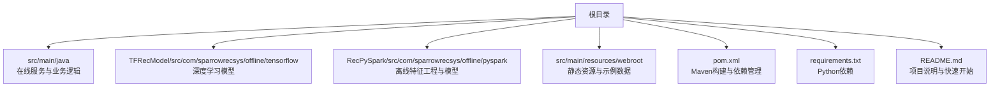
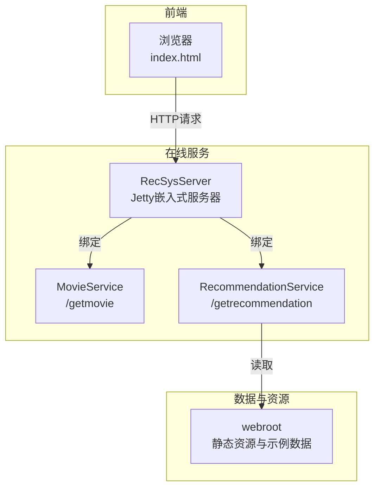
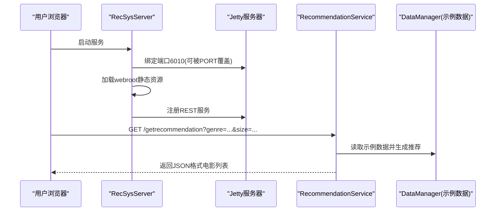
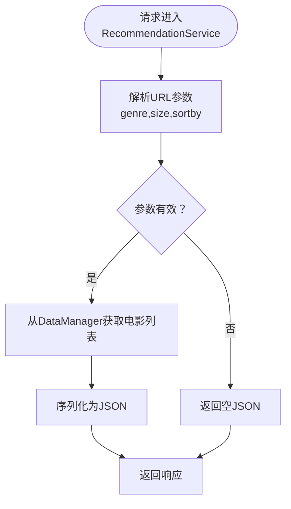

# 快速开始

<cite>
**本文引用的文件列表**
- [README.md](file://README.md)
- [pom.xml](file://pom.xml)
- [requirements.txt](file://requirements.txt)
- [RecSysServer.java](file://src/main/java/com/sparrowrecsys/online/RecSysServer.java)
- [MovieService.java](file://src/main/java/com/sparrowrecsys/online/service/MovieService.java)
- [RecommendationService.java](file://src/main/java/com/sparrowrecsys/online/service/RecommendationService.java)
- [index.html](file://src/main/resources/webroot/index.html)
- [movies.csv](file://src/main/resources/webroot/sampledata/movies.csv)
- [links.csv](file://src/main/resources/webroot/sampledata/links.csv)
- [ratings.csv](file://src/main/resources/webroot/sampledata/ratings.csv)
</cite>

## 目录
1. [简介](#简介)
2. [项目结构](#项目结构)
3. [核心组件](#核心组件)
4. [架构总览](#架构总览)
5. [详细组件分析](#详细组件分析)
6. [依赖关系分析](#依赖关系分析)
7. [性能注意事项](#性能注意事项)
8. [故障排查指南](#故障排查指南)
9. [结论](#结论)
10. [附录](#附录)

## 简介
本指南面向新手开发者，帮助你在最短时间内完成SparrowRecSys项目的环境准备、代码搭建与启动，最终在浏览器中看到推荐系统的效果。项目采用混合语言架构，包含Java在线服务、Python离线脚本、TensorFlow模型以及Spark/Flink等大数据处理能力。默认推荐服务端口为6010，可通过浏览器直接访问首页并体验推荐功能。

## 项目结构
仓库采用多模块与多语言结合的组织方式：
- 在线服务：基于Jetty嵌入式HTTP服务器，提供REST风格的推荐API与静态页面。
- 离线脚本：包含Python脚本用于特征工程与模型训练。
- 深度学习模型：包含多种经典推荐模型的实现。
- 数据与资源：内置示例数据集与前端静态资源。

图表来源
- [pom.xml](file://pom.xml#L1-L228)
- [requirements.txt](file://requirements.txt#L1-L4)

章节来源
- [README.md](file://README.md#L1-L57)
- [pom.xml](file://pom.xml#L1-L228)
- [requirements.txt](file://requirements.txt#L1-L4)

## 核心组件
- 在线服务入口：通过嵌入式Jetty启动HTTP服务，默认监听6010端口，加载静态资源与绑定REST服务。
- 推荐API：提供按类型、数量、排序策略返回电影列表的接口。
- 示例数据：内置精简的MovieLens数据集，便于快速验证。

章节来源
- [RecSysServer.java](file://src/main/java/com/sparrowrecsys/online/RecSysServer.java#L1-L80)
- [RecommendationService.java](file://src/main/java/com/sparrowrecsys/online/service/RecommendationService.java#L1-L48)
- [movies.csv](file://src/main/resources/webroot/sampledata/movies.csv#L1-L200)
- [links.csv](file://src/main/resources/webroot/sampledata/links.csv#L1-L200)
- [ratings.csv](file://src/main/resources/webroot/sampledata/ratings.csv#L1-L200)

## 架构总览
SparrowRecSys遵循经典的工业级推荐系统分层架构：离线数据处理、模型训练、近线流处理、线上服务与前端展示。在线服务通过Jetty承载，前端通过REST接口调用后端服务，实现推荐结果的即时呈现。

图表来源
- [RecSysServer.java](file://src/main/java/com/sparrowrecsys/online/RecSysServer.java#L25-L78)
- [MovieService.java](file://src/main/java/com/sparrowrecsys/online/service/MovieService.java#L16-L45)
- [RecommendationService.java](file://src/main/java/com/sparrowrecsys/online/service/RecommendationService.java#L18-L47)
- [index.html](file://src/main/resources/webroot/index.html#L1-L121)

## 详细组件分析

### 在线服务入口：RecSysServer
- 职责：初始化Jetty服务器、加载静态资源、注册REST服务、启动服务。
- 端口：默认6010；可通过环境变量PORT覆盖。
- 静态资源：从classpath的webroot目录加载HTML/CSS/JS与示例数据。
- 绑定服务：/getmovie、/getuser、/getsimilarmovie、/getrecommendation、/getrecforyou。

图表来源
- [RecSysServer.java](file://src/main/java/com/sparrowrecsys/online/RecSysServer.java#L25-L78)
- [RecommendationService.java](file://src/main/java/com/sparrowrecsys/online/service/RecommendationService.java#L18-L47)

章节来源
- [RecSysServer.java](file://src/main/java/com/sparrowrecsys/online/RecSysServer.java#L1-L80)

### 推荐服务：RecommendationService
- 功能：根据类型、数量与排序策略返回电影列表。
- 输入参数：genre（类型）、size（数量）、sortby（排序）。
- 输出：JSON数组，包含电影信息。

图表来源
- [RecommendationService.java](file://src/main/java/com/sparrowrecsys/online/service/RecommendationService.java#L18-L47)

章节来源
- [RecommendationService.java](file://src/main/java/com/sparrowrecsys/online/service/RecommendationService.java#L1-L48)

### 电影详情服务：MovieService
- 功能：根据电影ID返回电影详情。
- 输入参数：id（电影ID）。
- 输出：JSON对象，包含电影信息。

章节来源
- [MovieService.java](file://src/main/java/com/sparrowrecsys/online/service/MovieService.java#L1-L46)

### 示例数据与前端页面
- 示例数据：movies.csv、links.csv、ratings.csv，用于演示推荐与搜索。
- 前端页面：index.html，加载CSS/JS与示例数据，发起推荐请求。

章节来源
- [index.html](file://src/main/resources/webroot/index.html#L1-L121)
- [movies.csv](file://src/main/resources/webroot/sampledata/movies.csv#L1-L200)
- [links.csv](file://src/main/resources/webroot/sampledata/links.csv#L1-L200)
- [ratings.csv](file://src/main/resources/webroot/sampledata/ratings.csv#L1-L200)

## 依赖关系分析
- Maven依赖：管理Java在线服务所需的核心库（Jetty、Spark、Flink、HTTP客户端、Redis等）。
- Python依赖：管理离线脚本与模型训练所需的库（TensorFlow、PySpark、psutil等）。
- 运行时依赖：Java 8、Scala 2.11、Python 3.6+、TensorFlow 2.0+。

图表来源
- [pom.xml](file://pom.xml#L60-L226)
- [requirements.txt](file://requirements.txt#L1-L4)

章节来源
- [pom.xml](file://pom.xml#L1-L228)
- [requirements.txt](file://requirements.txt#L1-L4)

## 性能注意事项
- 默认端口6010：建议在本地开发时保持该端口，避免跨域与代理复杂性。
- 示例数据规模：内置数据集已精简，适合快速验证；生产场景建议使用更大规模数据集。
- 依赖版本：确保Java 8、Scala 2.11、Python 3.6+与TensorFlow 2.0+版本匹配，避免兼容性问题。
- 依赖下载：首次构建可能需要较长时间下载Maven与Python依赖，请耐心等待。

## 故障排查指南
- 端口占用
  - 现象：启动失败或端口冲突。
  - 处理：修改环境变量PORT为其他可用端口，或释放6010端口。
  - 参考：端口设置逻辑与默认值定义。
- Maven依赖下载缓慢
  - 现象：依赖下载超时或卡顿。
  - 处理：配置Maven镜像源、检查网络代理、重试构建。
  - 参考：pom.xml中的依赖声明。
- Python虚拟环境
  - 现象：找不到Python包或版本不匹配。
  - 处理：创建独立Python 3.6+虚拟环境，安装requirements.txt中的依赖。
  - 参考：requirements.txt中的依赖声明。
- 静态资源路径
  - 现象：页面无法加载样式或脚本。
  - 处理：确认webroot目录存在且路径正确，确保资源打包进最终产物。
  - 参考：RecSysServer中静态资源加载逻辑。
- 推荐接口无返回
  - 现象：/getrecommendation返回空。
  - 处理：检查genre、size、sortby参数是否正确；确认示例数据已加载。
  - 参考：RecommendationService参数解析与序列化逻辑。

章节来源
- [RecSysServer.java](file://src/main/java/com/sparrowrecsys/online/RecSysServer.java#L25-L78)
- [RecommendationService.java](file://src/main/java/com/sparrowrecsys/online/service/RecommendationService.java#L18-L47)
- [pom.xml](file://pom.xml#L60-L226)
- [requirements.txt](file://requirements.txt#L1-L4)

## 结论
通过本指南，你可以快速完成SparrowRecSys的环境准备与项目启动，体验推荐系统的基本功能。建议在熟悉基础流程后，逐步探索离线脚本与深度学习模型部分，以加深对推荐系统全流程的理解。

## 附录

### 环境要求与安装步骤
- Java 8
  - 安装并配置JAVA_HOME，确保java -version输出为1.8.x。
- Scala 2.11
  - 安装Scala 2.11，确保scalac -version正常。
- Python 3.6+
  - 创建Python 3.6+虚拟环境，激活后安装依赖。
- TensorFlow 2.0+
  - 安装与项目匹配的TensorFlow版本，确保tf.__version__符合要求。

章节来源
- [README.md](file://README.md#L7-L11)
- [requirements.txt](file://requirements.txt#L1-L4)

### 项目搭建步骤
- 克隆代码
  - 使用Git克隆仓库至本地。
- 安装依赖
  - Maven：执行mvn clean package以下载并编译依赖。
  - Python：在Python虚拟环境中执行pip install -r requirements.txt。
- 启动项目
  - 在IDE中运行RecSysServer.main()，或使用命令行启动打包后的可执行JAR。
  - 打开浏览器访问 http://localhost:6010/ 查看效果。

章节来源
- [README.md](file://README.md#L13-L14)
- [pom.xml](file://pom.xml#L21-L58)

### 使用IntelliJ IDEA打开与运行
- 导入项目：选择Maven项目导入，等待依赖解析完成。
- 运行入口：找到RecSysServer类，右键Run或Debug。
- 端口与日志：关注控制台输出的端口与启动日志，确认服务已启动。

章节来源
- [README.md](file://README.md#L13-L14)
- [RecSysServer.java](file://src/main/java/com/sparrowrecsys/online/RecSysServer.java#L18-L22)

### 浏览器访问与推荐效果
- 访问地址：http://localhost:6010/
- 首页展示：index.html加载示例数据并发起推荐请求。
- 推荐接口：/getrecommendation?genre=...&size=...，返回JSON格式电影列表。

章节来源
- [README.md](file://README.md#L13-L14)
- [index.html](file://src/main/resources/webroot/index.html#L110-L120)
- [RecommendationService.java](file://src/main/java/com/sparrowrecsys/online/service/RecommendationService.java#L18-L47)