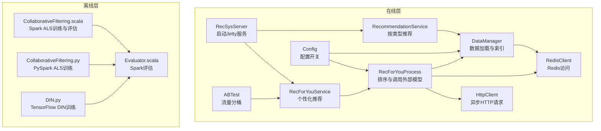
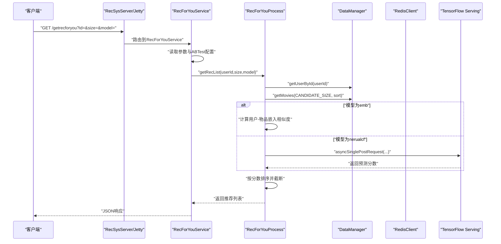
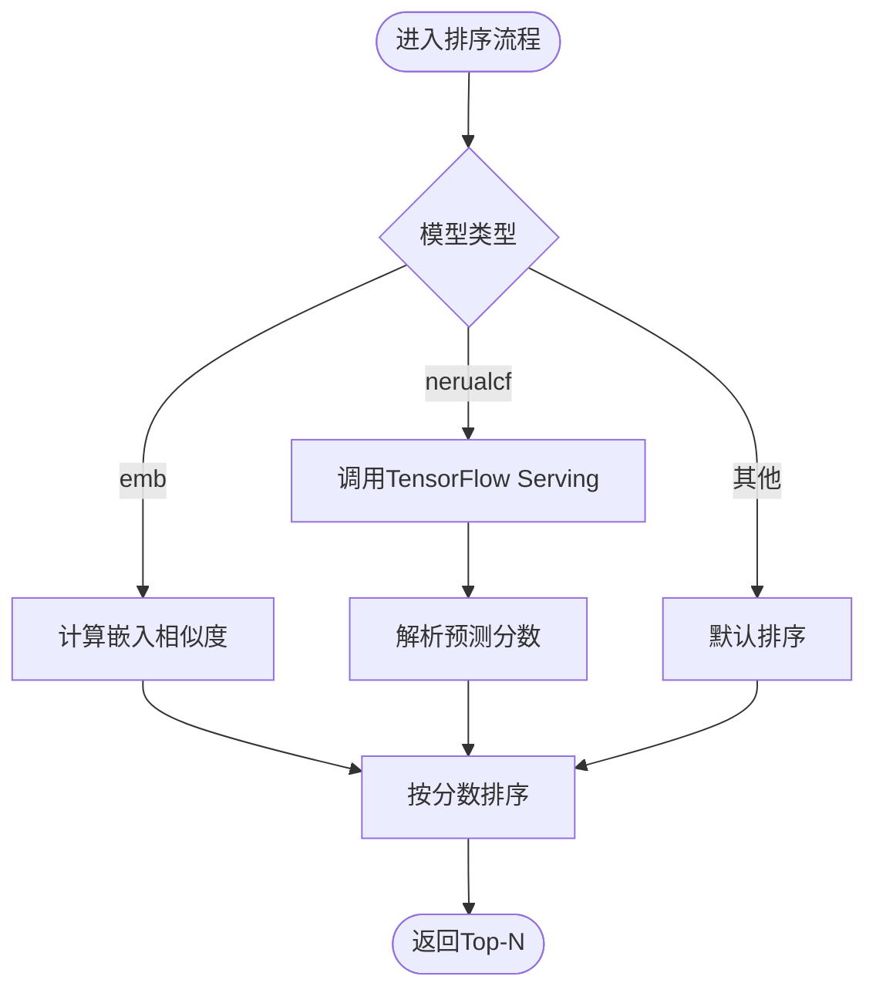
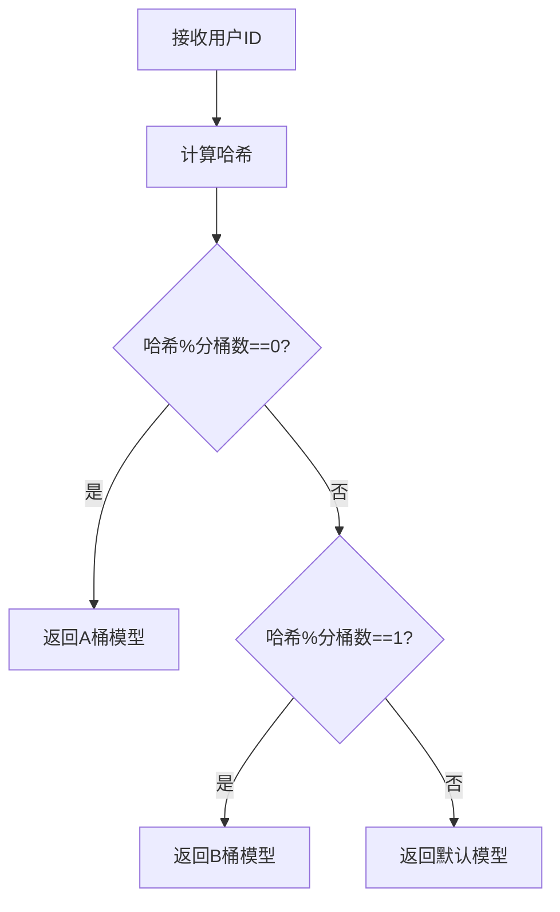
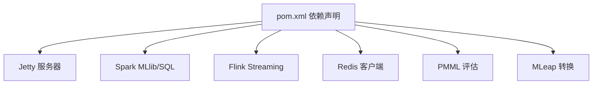

# 扩展定制

<cite>
**本文引用的文件**
- [README.md](file://README.md)
- [pom.xml](file://pom.xml)
- [requirements.txt](file://requirements.txt)
- [RecPySpark/src/com/sparrowrecsys/offline/pyspark/model/CollaborativeFiltering.py](file://RecPySpark/src/com/sparrowrecsys/offline/pyspark/model/CollaborativeFiltering.py)
- [TFRecModel/src/com/sparrowrecsys/offline/tensorflow/DIN.py](file://TFRecModel/src/com/sparrowrecsys/offline/tensorflow/DIN.py)
- [src/main/java/com/sparrowrecsys/offline/spark/model/CollaborativeFiltering.scala](file://src/main/java/com/sparrowrecsys/offline/spark/model/CollaborativeFiltering.scala)
- [src/main/java/com/sparrowrecsys/offline/spark/evaluate/Evaluator.scala](file://src/main/java/com/sparrowrecsys/offline/spark/evaluate/Evaluator.scala)
- [src/main/java/com/sparrowrecsys/online/util/Config.java](file://src/main/java/com/sparrowrecsys/online/util/Config.java)
- [src/main/java/com/sparrowrecsys/online/util/HttpClient.java](file://src/main/java/com/sparrowrecsys/online/util/HttpClient.java)
- [src/main/java/com/sparrowrecsys/online/util/ABTest.java](file://src/main/java/com/sparrowrecsys/online/util/ABTest.java)
- [src/main/java/com/sparrowrecsys/online/RecSysServer.java](file://src/main/java/com/sparrowrecsys/online/RecSysServer.java)
- [src/main/java/com/sparrowrecsys/online/service/RecommendationService.java](file://src/main/java/com/sparrowrecsys/online/service/RecommendationService.java)
- [src/main/java/com/sparrowrecsys/online/service/RecForYouService.java](file://src/main/java/com/sparrowrecsys/online/service/RecForYouService.java)
- [src/main/java/com/sparrowrecsys/online/recprocess/RecForYouProcess.java](file://src/main/java/com/sparrowrecsys/online/recprocess/RecForYouProcess.java)
- [src/main/java/com/sparrowrecsys/online/datamanager/DataManager.java](file://src/main/java/com/sparrowrecsys/online/datamanager/DataManager.java)
- [src/main/java/com/sparrowrecsys/online/datamanager/RedisClient.java](file://src/main/java/com/sparrowrecsys/online/datamanager/RedisClient.java)
</cite>

## 目录
1. [简介](#简介)
2. [项目结构](#项目结构)
3. [核心组件](#核心组件)
4. [架构总览](#架构总览)
5. [详细组件分析](#详细组件分析)
6. [依赖关系分析](#依赖关系分析)
7. [性能考量](#性能考量)
8. [故障排查指南](#故障排查指南)
9. [结论](#结论)
10. [附录](#附录)

## 简介
本指南面向需要在现有SparrowRecSys架构上进行扩展与定制的开发者，围绕以下目标展开：新增推荐算法、扩展数据源、配置定制、A/B测试框架使用、HttpClient集成外部服务、扩展在线服务API与业务逻辑、以及插件化架构的设计思路与实现方法。文档结合仓库中的实际代码，提供可操作的步骤、可视化图示与最佳实践，帮助快速落地。

## 项目结构
SparrowRecSys采用多语言混合架构，包含离线（Spark、PySpark、TensorFlow）、近线（Flink，见nearline包）与在线（Jetty + Servlet）三层。核心模块如下：
- 在线服务：Jetty服务器、Servlet路由、数据管理、推荐流程与工具类
- 离线训练：Spark ALS、PySpark ALS、TensorFlow DIN等模型
- 评估：Spark二分类指标评估器
- 数据：CSV文件与Redis双数据源支持
- 工具：HTTP客户端、A/B测试、配置开关

图表来源
- [RecSysServer.java](file://src/main/java/com/sparrowrecsys/online/RecSysServer.java#L64-L70)
- [RecommendationService.java](file://src/main/java/com/sparrowrecsys/online/service/RecommendationService.java#L18-L47)
- [RecForYouService.java](file://src/main/java/com/sparrowrecsys/online/service/RecForYouService.java#L20-L54)
- [RecForYouProcess.java](file://src/main/java/com/sparrowrecsys/online/recprocess/RecForYouProcess.java#L29-L92)
- [DataManager.java](file://src/main/java/com/sparrowrecsys/online/datamanager/DataManager.java#L40-L50)
- [RedisClient.java](file://src/main/java/com/sparrowrecsys/online/datamanager/RedisClient.java#L15-L24)
- [Config.java](file://src/main/java/com/sparrowrecsys/online/util/Config.java#L3-L13)
- [ABTest.java](file://src/main/java/com/sparrowrecsys/online/util/ABTest.java#L11-L26)
- [HttpClient.java](file://src/main/java/com/sparrowrecsys/online/util/HttpClient.java#L21-L83)
- [CollaborativeFiltering.scala](file://src/main/java/com/sparrowrecsys/offline/spark/model/CollaborativeFiltering.scala#L10-L85)
- [CollaborativeFiltering.py](file://RecPySpark/src/com/sparrowrecsys/offline/pyspark/model/CollaborativeFiltering.py#L1-L85)
- [DIN.py](file://TFRecModel/src/com/sparrowrecsys/offline/tensorflow/DIN.py#L1-L190)
- [Evaluator.scala](file://src/main/java/com/sparrowrecsys/offline/spark/evaluate/Evaluator.scala#L7-L21)

章节来源
- [README.md](file://README.md#L1-L57)
- [pom.xml](file://pom.xml#L1-L228)
- [requirements.txt](file://requirements.txt#L1-L4)

## 核心组件
- 在线服务入口与路由
  - 通过Jetty启动，绑定多个Servlet端点，提供电影、用户、相似电影、通用推荐、个性化推荐等接口。
- 数据管理
  - 支持从CSV文件与Redis加载电影、评分、嵌入向量与特征；提供按类型筛选、排序与缓存索引。
- 推荐流程
  - 个性化推荐流程封装在处理器中，支持基于嵌入相似度与外部TensorFlow Serving推理两种排序策略。
- 工具与配置
  - 配置开关控制数据源、是否启用AB测试、是否从Redis加载用户/物品特征。
  - A/B测试按用户ID哈希分流至不同模型。
  - HTTP客户端封装异步POST请求，便于对接外部模型服务或API。
- 离线训练与评估
  - Spark ALS与PySpark ALS用于协同过滤训练与评估；TensorFlow DIN用于序列建模；Spark评估器输出PR-AUC与ROC-AUC。

章节来源
- [RecSysServer.java](file://src/main/java/com/sparrowrecsys/online/RecSysServer.java#L27-L78)
- [RecommendationService.java](file://src/main/java/com/sparrowrecsys/online/service/RecommendationService.java#L18-L47)
- [RecForYouService.java](file://src/main/java/com/sparrowrecsys/online/service/RecForYouService.java#L20-L54)
- [RecForYouProcess.java](file://src/main/java/com/sparrowrecsys/online/recprocess/RecForYouProcess.java#L29-L138)
- [DataManager.java](file://src/main/java/com/sparrowrecsys/online/datamanager/DataManager.java#L13-L295)
- [RedisClient.java](file://src/main/java/com/sparrowrecsys/online/datamanager/RedisClient.java#L5-L26)
- [Config.java](file://src/main/java/com/sparrowrecsys/online/util/Config.java#L3-L13)
- [ABTest.java](file://src/main/java/com/sparrowrecsys/online/util/ABTest.java#L3-L27)
- [HttpClient.java](file://src/main/java/com/sparrowrecsys/online/util/HttpClient.java#L20-L164)
- [CollaborativeFiltering.scala](file://src/main/java/com/sparrowrecsys/offline/spark/model/CollaborativeFiltering.scala#L10-L85)
- [Evaluator.scala](file://src/main/java/com/sparrowrecsys/offline/spark/evaluate/Evaluator.scala#L7-L21)

## 架构总览
下图展示从请求到响应的关键路径，以及离线训练与在线服务的衔接。

图表来源
- [RecForYouService.java](file://src/main/java/com/sparrowrecsys/online/service/RecForYouService.java#L20-L54)
- [RecForYouProcess.java](file://src/main/java/com/sparrowrecsys/online/recprocess/RecForYouProcess.java#L29-L138)
- [DataManager.java](file://src/main/java/com/sparrowrecsys/online/datamanager/DataManager.java#L285-L293)
- [HttpClient.java](file://src/main/java/com/sparrowrecsys/online/util/HttpClient.java#L21-L40)
- [RecSysServer.java](file://src/main/java/com/sparrowrecsys/online/RecSysServer.java#L64-L70)

## 详细组件分析

### 在线服务扩展：新增API端点与业务逻辑
- 新增Servlet端点
  - 在在线服务器中注册新Servlet，映射到新的URL路径。
  - 示例参考：[在线服务器路由注册](file://src/main/java/com/sparrowrecsys/online/RecSysServer.java#L64-L70)
- 编写业务服务
  - 继承HttpServlet，解析参数、调用数据层与处理层、序列化响应。
  - 示例参考：[个性化推荐服务](file://src/main/java/com/sparrowrecsys/online/service/RecForYouService.java#L20-L54)
- 扩展推荐流程
  - 在推荐处理器中增加新的排序策略分支，或新增候选生成逻辑。
  - 示例参考：[个性化推荐流程](file://src/main/java/com/sparrowrecsys/online/recprocess/RecForYouProcess.java#L29-L92)

最佳实践
- 参数校验与异常捕获，统一设置响应头与编码。
- 将业务逻辑集中在处理器中，避免在Servlet中直接拼装复杂逻辑。
- 使用配置开关控制新功能的灰度发布。

章节来源
- [RecSysServer.java](file://src/main/java/com/sparrowrecsys/online/RecSysServer.java#L64-L70)
- [RecForYouService.java](file://src/main/java/com/sparrowrecsys/online/service/RecForYouService.java#L20-L54)
- [RecForYouProcess.java](file://src/main/java/com/sparrowrecsys/online/recprocess/RecForYouProcess.java#L29-L92)

### 推荐算法扩展：接口设计与模型集成
- 排序接口设计
  - 在推荐处理器中新增case分支，调用新的相似度/打分函数或外部推理服务。
  - 参考：[排序与模型分支](file://src/main/java/com/sparrowrecsys/online/recprocess/RecForYouProcess.java#L69-L92)
- 嵌入相似度
  - 若使用向量相似度，确保用户/物品向量已加载，调用相似度计算。
  - 参考：[嵌入相似度计算](file://src/main/java/com/sparrowrecsys/online/recprocess/RecForYouProcess.java#L100-L105)
- 外部模型集成
  - 通过HTTP客户端向TensorFlow Serving发起批量预测请求，解析返回分数并排序。
  - 参考：[调用TensorFlow Serving](file://src/main/java/com/sparrowrecsys/online/recprocess/RecForYouProcess.java#L113-L138) 与 [HTTP客户端](file://src/main/java/com/sparrowrecsys/online/util/HttpClient.java#L21-L83)
- 离线训练与评估
  - Spark ALS与PySpark ALS示例展示了数据准备、训练、评估与交叉验证流程。
  - 参考：[Spark ALS](file://src/main/java/com/sparrowrecsys/offline/spark/model/CollaborativeFiltering.scala#L10-L85)、[PySpark ALS](file://RecPySpark/src/com/sparrowrecsys/offline/pyspark/model/CollaborativeFiltering.py#L1-L85)、[评估器](file://src/main/java/com/sparrowrecsys/offline/spark/evaluate/Evaluator.scala#L7-L21)
  - TensorFlow DIN示例展示了特征输入、模型定义与训练评估。
  - 参考：[DIN训练脚本](file://TFRecModel/src/com/sparrowrecsys/offline/tensorflow/DIN.py#L1-L190)

扩展步骤
- 定义新模型的输入特征与输出格式，确保与HTTP客户端请求体一致。
- 在推荐处理器中新增模型分支，调用推理服务或本地相似度函数。
- 在离线阶段完成训练与评估，导出或部署推理服务（如TensorFlow Serving）。

图表来源
- [RecForYouProcess.java](file://src/main/java/com/sparrowrecsys/online/recprocess/RecForYouProcess.java#L69-L92)
- [HttpClient.java](file://src/main/java/com/sparrowrecsys/online/util/HttpClient.java#L21-L83)

章节来源
- [RecForYouProcess.java](file://src/main/java/com/sparrowrecsys/online/recprocess/RecForYouProcess.java#L69-L138)
- [HttpClient.java](file://src/main/java/com/sparrowrecsys/online/util/HttpClient.java#L21-L83)
- [CollaborativeFiltering.scala](file://src/main/java/com/sparrowrecsys/offline/spark/model/CollaborativeFiltering.scala#L10-L85)
- [CollaborativeFiltering.py](file://RecPySpark/src/com/sparrowrecsys/offline/pyspark/model/CollaborativeFiltering.py#L1-L85)
- [Evaluator.scala](file://src/main/java/com/sparrowrecsys/offline/spark/evaluate/Evaluator.scala#L7-L21)
- [DIN.py](file://TFRecModel/src/com/sparrowrecsys/offline/tensorflow/DIN.py#L1-L190)

### 数据源扩展：接入新数据格式与存储系统
- 文件数据源
  - DataManager支持从CSV文件加载电影、链接、评分与嵌入向量；可通过扩展字段解析与索引构建支持新列。
  - 参考：[数据加载主流程](file://src/main/java/com/sparrowrecsys/online/datamanager/DataManager.java#L40-L50)、[电影数据加载](file://src/main/java/com/sparrowrecsys/online/datamanager/DataManager.java#L52-L87)、[评分数据加载](file://src/main/java/com/sparrowrecsys/online/datamanager/DataManager.java#L207-L242)
- Redis数据源
  - 通过RedisClient连接Redis，支持嵌入向量与特征键空间的读取。
  - 参考：[Redis连接与单例](file://src/main/java/com/sparrowrecsys/online/datamanager/RedisClient.java#L5-L26)、[从Redis加载嵌入与特征](file://src/main/java/com/sparrowrecsys/online/datamanager/DataManager.java#L89-L164)、[从Redis加载特征](file://src/main/java/com/sparrowrecsys/online/datamanager/DataManager.java#L126-L141)
- 配置开关
  - 通过Config控制数据源类型、是否从Redis加载用户/物品特征、是否启用AB测试。
  - 参考：[配置项](file://src/main/java/com/sparrowrecsys/online/util/Config.java#L3-L13)

扩展建议
- 新增数据格式时，在DataManager中新增对应loadXxx方法，并在loadData主流程中调用。
- 新增存储系统时，新增对应的Client类与读取逻辑，保持与现有接口一致的数据结构。

章节来源
- [DataManager.java](file://src/main/java/com/sparrowrecsys/online/datamanager/DataManager.java#L40-L164)
- [RedisClient.java](file://src/main/java/com/sparrowrecsys/online/datamanager/RedisClient.java#L5-L26)
- [Config.java](file://src/main/java/com/sparrowrecsys/online/util/Config.java#L3-L13)

### 配置定制：参数调优、模型选择与服务配置
- 模型选择
  - 通过URL参数model选择排序模型；也可通过ABTest根据用户ID自动分流。
  - 参考：[模型参数与ABTest](file://src/main/java/com/sparrowrecsys/online/service/RecForYouService.java#L35-L39)
- 数据源与特性加载
  - 通过Config切换嵌入向量来源（文件/Redis）与是否从Redis加载用户/物品特征。
  - 参考：[配置开关](file://src/main/java/com/sparrowrecsys/online/util/Config.java#L7-L13)、[加载逻辑](file://src/main/java/com/sparrowrecsys/online/datamanager/DataManager.java#L45-L49)
- 服务端口与环境变量
  - 通过环境变量PORT设置Jetty端口，默认6010。
  - 参考：[端口设置](file://src/main/java/com/sparrowrecsys/online/RecSysServer.java#L25-L32)

最佳实践
- 将可变参数集中于Config或环境变量，避免硬编码。
- 对关键参数（候选规模、Top-N）建立监控与告警阈值。

章节来源
- [RecForYouService.java](file://src/main/java/com/sparrowrecsys/online/service/RecForYouService.java#L35-L39)
- [Config.java](file://src/main/java/com/sparrowrecsys/online/util/Config.java#L3-L13)
- [DataManager.java](file://src/main/java/com/sparrowrecsys/online/datamanager/DataManager.java#L45-L49)
- [RecSysServer.java](file://src/main/java/com/sparrowrecsys/online/RecSysServer.java#L25-L32)

### A/B测试框架：使用方法与实验设计原则
- 流量分桶
  - 通过用户ID哈希决定进入A桶（如emb）或B桶（如nerualcf），其余用户走默认模型。
  - 参考：[流量分桶逻辑](file://src/main/java/com/sparrowrecsys/online/util/ABTest.java#L11-L26)
- 实验设计
  - 明确指标（如点击率、观看时长、转化率），设定对照组与实验组，控制样本量与持续时间。
  - 在服务端通过ABTest动态分流，避免硬编码模型选择。

图表来源
- [ABTest.java](file://src/main/java/com/sparrowrecsys/online/util/ABTest.java#L11-L26)

章节来源
- [ABTest.java](file://src/main/java/com/sparrowrecsys/online/util/ABTest.java#L3-L27)
- [RecForYouService.java](file://src/main/java/com/sparrowrecsys/online/service/RecForYouService.java#L37-L39)

### HttpClient使用指南：集成外部API与服务
- 异步请求
  - 提供单请求与多实例并发请求方法，支持字符串Body与Map形式。
  - 参考：[异步单请求](file://src/main/java/com/sparrowrecsys/online/util/HttpClient.java#L21-L40)、[异步多请求](file://src/main/java/com/sparrowrecsys/online/util/HttpClient.java#L42-L72)
- 响应解析
  - 统一读取HTTP响应内容，便于后续JSON解析。
  - 参考：[响应内容读取](file://src/main/java/com/sparrowrecsys/online/util/HttpClient.java#L74-L83)
- 推理服务集成
  - 在推荐处理器中调用TensorFlow Serving，构造instances数组并解析predictions。
  - 参考：[调用推理服务](file://src/main/java/com/sparrowrecsys/online/recprocess/RecForYouProcess.java#L113-L138)

最佳实践
- 对外部服务设置超时与重试策略，避免阻塞。
- 统一封装请求体结构，保证与推理服务期望一致。

章节来源
- [HttpClient.java](file://src/main/java/com/sparrowrecsys/online/util/HttpClient.java#L21-L83)
- [RecForYouProcess.java](file://src/main/java/com/sparrowrecsys/online/recprocess/RecForYouProcess.java#L113-L138)

### 插件化架构设计思路与实现方法
- 接口抽象
  - 在推荐处理器中以字符串模型名作为插件标识，通过switch/case扩展新模型分支。
  - 参考：[模型分支](file://src/main/java/com/sparrowrecsys/online/recprocess/RecForYouProcess.java#L69-L92)
- 配置驱动
  - 通过Config与环境变量控制插件启用与参数，实现灰度与回滚。
  - 参考：[配置开关](file://src/main/java/com/sparrowrecsys/online/util/Config.java#L7-L13)
- 外部服务解耦
  - 通过HttpClient与URL可配置，降低对特定推理平台的耦合。
  - 参考：[HTTP客户端](file://src/main/java/com/sparrowrecsys/online/util/HttpClient.java#L21-L40)

实现要点
- 将“模型选择”与“模型实现”解耦，新增模型只需在处理器中注册分支。
- 将“数据源”与“特征来源”抽象为可配置项，便于切换文件/Redis。

章节来源
- [RecForYouProcess.java](file://src/main/java/com/sparrowrecsys/online/recprocess/RecForYouProcess.java#L69-L92)
- [Config.java](file://src/main/java/com/sparrowrecsys/online/util/Config.java#L7-L13)
- [HttpClient.java](file://src/main/java/com/sparrowrecsys/online/util/HttpClient.java#L21-L40)

## 依赖关系分析
- Maven依赖
  - 在线服务依赖Jetty、HTTP组件；离线依赖Spark、Flink、PMML、MLeap、Redis客户端等。
  - 参考：[Maven依赖清单](file://pom.xml#L60-L226)
- Python运行时
  - TensorFlow、PySpark、psutil等。
  - 参考：[Python依赖清单](file://requirements.txt#L1-L4)

图表来源
- [pom.xml](file://pom.xml#L60-L226)

章节来源
- [pom.xml](file://pom.xml#L60-L226)
- [requirements.txt](file://requirements.txt#L1-L4)

## 性能考量
- 排序候选规模
  - 候选池大小与Top-N需平衡召回质量与延迟，建议在处理器中设置合理上限并做截断。
  - 参考：[候选规模与截断](file://src/main/java/com/sparrowrecsys/online/recprocess/RecForYouProcess.java#L34-L60)
- 向量化相似度
  - 嵌入相似度计算通常较高效，但需确保向量维度与归一化策略一致。
  - 参考：[相似度计算](file://src/main/java/com/sparrowrecsys/online/recprocess/RecForYouProcess.java#L100-L105)
- 异步HTTP调用
  - 使用异步客户端减少等待时间，建议限制并发数量并设置超时。
  - 参考：[异步请求](file://src/main/java/com/sparrowrecsys/online/util/HttpClient.java#L21-L72)
- 数据加载与索引
  - CSV解析与Redis读取应尽量在启动阶段完成，运行时只做查询与缓存命中。
  - 参考：[数据加载](file://src/main/java/com/sparrowrecsys/online/datamanager/DataManager.java#L40-L50)

## 故障排查指南
- 推荐为空
  - 检查用户是否存在、候选池是否为空、模型分支是否正确。
  - 参考：[空用户返回](file://src/main/java/com/sparrowrecsys/online/recprocess/RecForYouProcess.java#L31-L33)
- 嵌入向量缺失
  - 确认数据源配置（文件/Redis）与键空间是否匹配。
  - 参考：[嵌入加载逻辑](file://src/main/java/com/sparrowrecsys/online/datamanager/DataManager.java#L89-L164)
- TensorFlow Serving未响应
  - 检查推理服务地址、请求体结构与返回格式。
  - 参考：[推理调用](file://src/main/java/com/sparrowrecsys/online/recprocess/RecForYouProcess.java#L113-L138)、[HTTP客户端](file://src/main/java/com/sparrowrecsys/online/util/HttpClient.java#L21-L83)
- AB测试分流异常
  - 检查用户ID合法性与哈希分桶逻辑。
  - 参考：[ABTest分流](file://src/main/java/com/sparrowrecsys/online/util/ABTest.java#L11-L26)

章节来源
- [RecForYouProcess.java](file://src/main/java/com/sparrowrecsys/online/recprocess/RecForYouProcess.java#L31-L33)
- [DataManager.java](file://src/main/java/com/sparrowrecsys/online/datamanager/DataManager.java#L89-L164)
- [RecForYouService.java](file://src/main/java/com/sparrowrecsys/online/service/RecForYouService.java#L37-L39)
- [ABTest.java](file://src/main/java/com/sparrowrecsys/online/util/ABTest.java#L11-L26)
- [HttpClient.java](file://src/main/java/com/sparrowrecsys/online/util/HttpClient.java#L21-L83)

## 结论
通过本文档的步骤与图示，开发者可以在SparrowRecSys现有架构上快速扩展推荐算法、接入新数据源、定制配置、启用A/B测试、集成外部服务，并以插件化方式扩展在线服务。建议在扩展过程中遵循“接口抽象、配置驱动、异步解耦、性能优先”的原则，确保系统稳定与可维护性。

## 附录
- 快速开始
  - 运行在线服务入口，访问本地端口查看前端效果。
  - 参考：[快速开始说明](file://README.md#L13-L14)
- 离线训练与评估
  - Spark ALS、PySpark ALS与TensorFlow DIN均可作为新算法的参考实现。
  - 参考：[Spark ALS](file://src/main/java/com/sparrowrecsys/offline/spark/model/CollaborativeFiltering.scala#L10-L85)、[PySpark ALS](file://RecPySpark/src/com/sparrowrecsys/offline/pyspark/model/CollaborativeFiltering.py#L1-L85)、[DIN](file://TFRecModel/src/com/sparrowrecsys/offline/tensorflow/DIN.py#L1-L190)