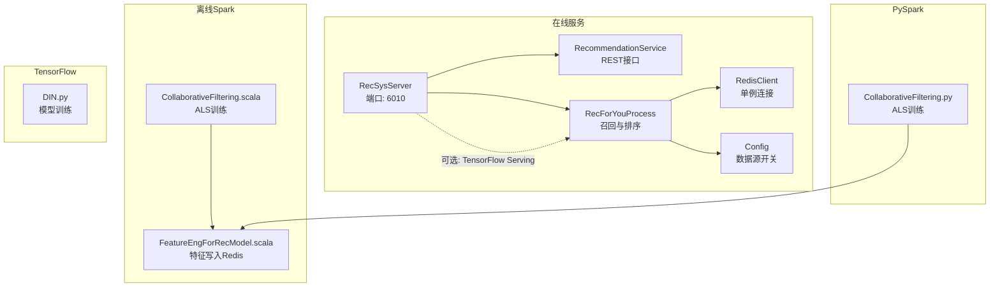
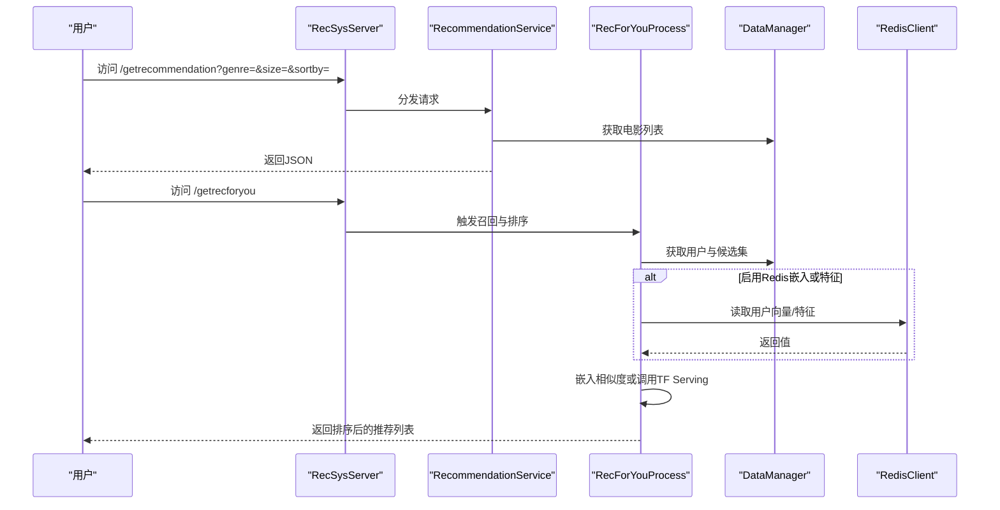
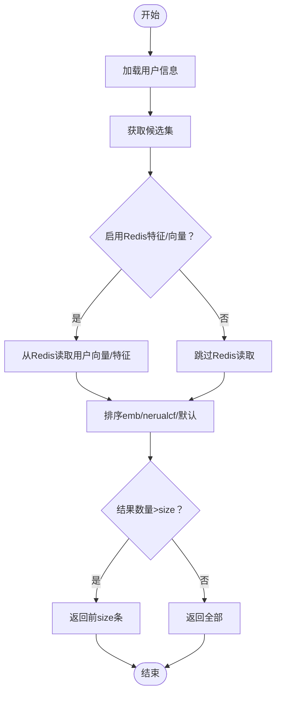
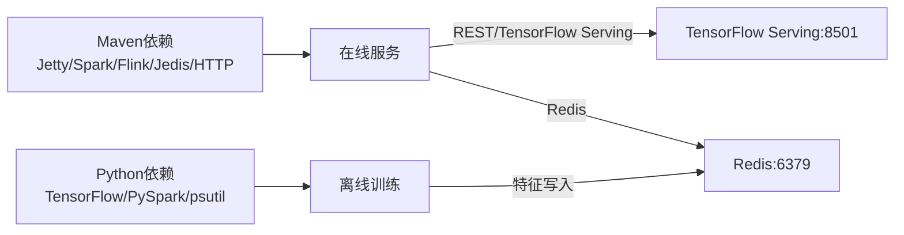

# 故障排除

<cite>
**本文引用的文件**
- [README.md](file://README.md)
- [pom.xml](file://pom.xml)
- [requirements.txt](file://requirements.txt)
- [RecSysServer.java](file://src/main/java/com/sparrowrecsys/online/RecSysServer.java)
- [Config.java](file://src/main/java/com/sparrowrecsys/online/util/Config.java)
- [RedisClient.java](file://src/main/java/com/sparrowrecsys/online/datamanager/RedisClient.java)
- [RecommendationService.java](file://src/main/java/com/sparrowrecsys/online/service/RecommendationService.java)
- [RecForYouProcess.java](file://src/main/java/com/sparrowrecsys/online/recprocess/RecForYouProcess.java)
- [CollaborativeFiltering.scala](file://src/main/java/com/sparrowrecsys/offline/spark/model/CollaborativeFiltering.scala)
- [CollaborativeFiltering.py](file://RecPySpark/src/com/sparrowrecsys/offline/pyspark/model/CollaborativeFiltering.py)
- [DIN.py](file://TFRecModel/src/com/sparrowrecsys/offline/tensorflow/DIN.py)
- [FeatureEngForRecModel.scala](file://src/main/java/com/sparrowrecsys/offline/spark/featureeng/FeatureEngForRecModel.scala)
</cite>

## 目录
1. [简介](#简介)
2. [项目结构](#项目结构)
3. [核心组件](#核心组件)
4. [架构总览](#架构总览)
5. [详细组件分析](#详细组件分析)
6. [依赖关系分析](#依赖关系分析)
7. [性能考虑](#性能考虑)
8. [故障排除指南](#故障排除指南)
9. [结论](#结论)
10. [附录](#附录)

## 简介
本文件面向SparrowRecSys的开发者与运维人员，聚焦于开发与部署阶段的常见问题与排错方法，涵盖Maven依赖下载失败、Python环境与TensorFlow版本兼容性、系统运行时错误诊断（日志、性能、内存）、推荐系统特有问题（模型不收敛、效果不佳、在线响应慢）、Redis缓存相关问题、性能调优策略以及调试工具使用与社区支持渠道。

## 项目结构
SparrowRecSys为多模块混合语言项目，包含：
- 在线服务：基于Jetty的Java服务，提供REST接口与静态页面
- 离线Spark批处理：ALS协同过滤训练与特征工程
- PySpark离线模块：ALS协同过滤训练
- TensorFlow离线模型：DIN等模型训练脚本
- Redis缓存：特征与向量的存储与读取

图表来源
- [RecSysServer.java](file://src/main/java/com/sparrowrecsys/online/RecSysServer.java#L24-L78)
- [Config.java](file://src/main/java/com/sparrowrecsys/online/util/Config.java#L3-L13)
- [RedisClient.java](file://src/main/java/com/sparrowrecsys/online/datamanager/RedisClient.java#L5-L25)
- [RecommendationService.java](file://src/main/java/com/sparrowrecsys/online/service/RecommendationService.java#L18-L47)
- [RecForYouProcess.java](file://src/main/java/com/sparrowrecsys/online/recprocess/RecForYouProcess.java#L29-L92)
- [CollaborativeFiltering.scala](file://src/main/java/com/sparrowrecsys/offline/spark/model/CollaborativeFiltering.scala#L10-L84)
- [FeatureEngForRecModel.scala](file://src/main/java/com/sparrowrecsys/offline/spark/featureeng/FeatureEngForRecModel.scala#L140-L173)
- [CollaborativeFiltering.py](file://RecPySpark/src/com/sparrowrecsys/offline/pyspark/model/CollaborativeFiltering.py#L9-L50)
- [DIN.py](file://TFRecModel/src/com/sparrowrecsys/offline/tensorflow/DIN.py#L1-L190)

章节来源
- [README.md](file://README.md#L1-L57)
- [pom.xml](file://pom.xml#L1-L228)
- [requirements.txt](file://requirements.txt#L1-L4)

## 核心组件
- 在线服务入口：启动Jetty服务器，绑定多个REST服务端点，加载本地样例数据与静态资源。
- 配置开关：通过Config控制嵌入向量与特征是否从Redis加载、AB测试开关等。
- Redis客户端：单例Jedis连接，提供主机与端口常量。
- 推荐服务：根据参数返回按类别与排序规则筛选的电影列表。
- 排序与召回：支持基于嵌入相似度与神经协同过滤（可调用TensorFlow Serving）两种排序方式；可从Redis读取用户向量与特征。

章节来源
- [RecSysServer.java](file://src/main/java/com/sparrowrecsys/online/RecSysServer.java#L24-L78)
- [Config.java](file://src/main/java/com/sparrowrecsys/online/util/Config.java#L3-L13)
- [RedisClient.java](file://src/main/java/com/sparrowrecsys/online/datamanager/RedisClient.java#L5-L25)
- [RecommendationService.java](file://src/main/java/com/sparrowrecsys/online/service/RecommendationService.java#L18-L47)
- [RecForYouProcess.java](file://src/main/java/com/sparrowrecsys/online/recprocess/RecForYouProcess.java#L29-L92)

## 架构总览

图表来源
- [RecSysServer.java](file://src/main/java/com/sparrowrecsys/online/RecSysServer.java#L63-L70)
- [RecommendationService.java](file://src/main/java/com/sparrowrecsys/online/service/RecommendationService.java#L18-L47)
- [RecForYouProcess.java](file://src/main/java/com/sparrowrecsys/online/recprocess/RecForYouProcess.java#L29-L92)
- [RedisClient.java](file://src/main/java/com/sparrowrecsys/online/datamanager/RedisClient.java#L15-L24)

## 详细组件分析

### 在线服务与端口配置
- 默认端口：6010；可通过环境变量PORT覆盖。
- 静态资源根路径来自classpath下的webroot，需确保打包后资源可用。
- 绑定REST端点：/getmovie、/getuser、/getsimilarmovie、/getrecommendation、/getrecforyou。

章节来源
- [RecSysServer.java](file://src/main/java/com/sparrowrecsys/online/RecSysServer.java#L24-L78)

### 推荐服务（按类别与排序）
- 参数：genre（类别）、size（数量）、sortby（排序字段）。
- 数据来源：DataManager按类别与排序规则返回电影列表。
- 异常处理：捕获异常并输出空字符串，便于前端容错。

章节来源
- [RecommendationService.java](file://src/main/java/com/sparrowrecsys/online/service/RecommendationService.java#L18-L47)

### “为你推荐”流程（召回与排序）
- 召回：固定候选规模，从DataManager获取候选集。
- 特征加载：若启用Redis，按配置读取用户向量与特征。
- 排序：支持“emb”（嵌入相似度）与“nerualcf”（调用TensorFlow Serving）两种模式；默认按候选序打分。
- TF Serving：向本地8501端点发送预测请求，解析返回分数作为排序依据。

图表来源
- [RecForYouProcess.java](file://src/main/java/com/sparrowrecsys/online/recprocess/RecForYouProcess.java#L29-L92)

章节来源
- [RecForYouProcess.java](file://src/main/java/com/sparrowrecsys/online/recprocess/RecForYouProcess.java#L29-L138)

### 配置与数据源
- EMB_DATA_SOURCE：嵌入向量来源（file/redis）。
- IS_LOAD_USER_FEATURE_FROM_REDIS / IS_LOAD_ITEM_FEATURE_FROM_REDIS：是否从Redis读取用户/物品特征。
- IS_ENABLE_AB_TEST：AB测试开关。

章节来源
- [Config.java](file://src/main/java/com/sparrowrecsys/online/util/Config.java#L3-L13)

### Redis客户端与特征写入
- 单例Jedis连接，默认localhost:6379。
- 离线特征工程将用户/物品特征写入Redis，设置TTL为约30天。
- 在线侧可按前缀读取用户特征与向量。

章节来源
- [RedisClient.java](file://src/main/java/com/sparrowrecsys/online/datamanager/RedisClient.java#L5-L25)
- [FeatureEngForRecModel.scala](file://src/main/java/com/sparrowrecsys/offline/spark/featureeng/FeatureEngForRecModel.scala#L140-L173)
- [FeatureEngForRecModel.scala](file://src/main/java/com/sparrowrecsys/offline/spark/featureeng/FeatureEngForRecModel.scala#L223-L248)

### 离线ALS训练（Spark与PySpark）
- Spark ALS：本地模式训练，计算RMSE并输出部分因子。
- PySpark ALS：本地模式训练，参数网格与交叉验证示例。

章节来源
- [CollaborativeFiltering.scala](file://src/main/java/com/sparrowrecsys/offline/spark/model/CollaborativeFiltering.scala#L10-L84)
- [CollaborativeFiltering.py](file://RecPySpark/src/com/sparrowrecsys/offline/pyspark/model/CollaborativeFiltering.py#L9-L50)

### TensorFlow模型训练（DIN）
- 使用Keras从本地CSV构建Dataset，定义输入与网络结构，编译并训练。
- 注意：训练数据路径为本地文件系统路径，需确保路径正确。

章节来源
- [DIN.py](file://TFRecModel/src/com/sparrowrecsys/offline/tensorflow/DIN.py#L1-L190)

## 依赖关系分析
- Maven依赖：Jetty、Spark、Flink、Jedis、HTTP组件等。
- Python依赖：TensorFlow、PySpark、psutil。
- 运行时端口：在线服务6010；TensorFlow Serving 8501；Redis 6379。

图表来源
- [pom.xml](file://pom.xml#L60-L227)
- [requirements.txt](file://requirements.txt#L1-L4)

章节来源
- [pom.xml](file://pom.xml#L1-L228)
- [requirements.txt](file://requirements.txt#L1-L4)

## 性能考虑
- 并发与线程：Jetty默认线程池与业务线程数未显式配置，建议结合负载压测调整。
- 内存管理：离线ALS训练与特征工程涉及大量collect与哈希表，注意内存峰值；可考虑广播小表、分片处理。
- 缓存命中：Redis特征与向量命中率直接影响在线延迟；建议预热与合理TTL。
- 模型推理：TF Serving需评估批大小、并发与GPU/MPS资源；必要时开启模型量化或混合精度。
- I/O与磁盘：离线训练与特征写入涉及大量磁盘IO，建议SSD与合适的HDFS配置。

## 故障排除指南

### 一、环境与依赖问题

1) Maven依赖下载失败
- 症状：mvn clean package卡住或超时。
- 排查要点：
  - 检查网络代理与仓库镜像配置。
  - 清理本地仓库缓存后重试。
  - 确认pom.xml中的版本与仓库可达性。
- 相关文件
  - [pom.xml](file://pom.xml#L1-L228)

2) Python环境与TensorFlow版本不兼容
- 症状：安装失败、导入报错、运行时报dtype或API不匹配。
- 排查要点：
  - 确认requirements.txt中的版本与当前Python版本兼容。
  - 若使用Apple Silicon，确认是否启用Metal后端。
  - 离线训练脚本中的本地路径需与实际一致。
- 相关文件
  - [requirements.txt](file://requirements.txt#L1-L4)
  - [DIN.py](file://TFRecModel/src/com/sparrowrecsys/offline/tensorflow/DIN.py#L1-L190)

3) 在线服务端口占用
- 症状：启动失败或端口冲突。
- 排查要点：
  - 确认6010端口未被占用；可通过环境变量PORT覆盖。
- 相关文件
  - [RecSysServer.java](file://src/main/java/com/sparrowrecsys/online/RecSysServer.java#L24-L36)

### 二、运行时错误与日志分析

1) 静态资源无法加载
- 症状：访问首页白屏或404。
- 排查要点：
  - 确认webroot路径与打包产物一致；检查资源URL定位逻辑。
- 相关文件
  - [RecSysServer.java](file://src/main/java/com/sparrowrecsys/online/RecSysServer.java#L38-L61)

2) 推荐接口返回空
- 症状：/getrecommendation返回空数组或空字符串。
- 排查要点：
  - 检查genre/size/ sortby参数是否合法。
  - 查看RecommendationService异常分支输出。
- 相关文件
  - [RecommendationService.java](file://src/main/java/com/sparrowrecsys/online/service/RecommendationService.java#L42-L46)

3) “为你推荐”无结果或异常
- 症状：/getrecforyou返回空列表。
- 排查要点：
  - 用户不存在则直接返回空列表。
  - 检查候选集是否为空。
  - 若启用Redis，确认Redis连通性与键是否存在。
- 相关文件
  - [RecForYouProcess.java](file://src/main/java/com/sparrowrecsys/online/recprocess/RecForYouProcess.java#L30-L33)
  - [RecForYouProcess.java](file://src/main/java/com/sparrowrecsys/online/recprocess/RecForYouProcess.java#L34-L52)

4) TensorFlow Serving未就绪
- 症状：调用TF Serving失败或超时。
- 排查要点：
  - 确认本地TF Serving已启动且监听8501端口。
  - 检查模型名称与预测格式是否与调用一致。
- 相关文件
  - [RecForYouProcess.java](file://src/main/java/com/sparrowrecsys/online/recprocess/RecForYouProcess.java#L129-L137)

### 三、推荐系统特有问题

1) 模型训练不收敛或效果差
- 症状：ALS RMSE异常或DIN指标不提升。
- 排查要点：
  - 调整正则化参数、迭代轮次、特征维度。
  - 检查数据分布与缺失值处理。
  - 对比PySpark与Scala版本的实现差异。
- 相关文件
  - [CollaborativeFiltering.scala](file://src/main/java/com/sparrowrecsys/offline/spark/model/CollaborativeFiltering.scala#L29-L52)
  - [CollaborativeFiltering.py](file://RecPySpark/src/com/sparrowrecsys/offline/pyspark/model/CollaborativeFiltering.py#L20-L31)
  - [DIN.py](file://TFRecModel/src/com/sparrowrecsys/offline/tensorflow/DIN.py#L170-L182)

2) 推荐效果不佳
- 症状：多样性不足、热门偏移严重。
- 排查要点：
  - 检查候选集规模与采样策略。
  - 调整排序权重或引入再排序模块。
  - 对比“emb”与“nerualcf”两种排序策略的效果。
- 相关文件
  - [RecForYouProcess.java](file://src/main/java/com/sparrowrecsys/online/recprocess/RecForYouProcess.java#L69-L92)

3) 在线服务响应慢
- 症状：接口超时或QPS下降。
- 排查要点：
  - 检查Redis延迟与连接池配置。
  - 评估候选集规模与排序复杂度。
  - 对TF Serving进行压力测试与资源配额调整。
- 相关文件
  - [RedisClient.java](file://src/main/java/com/sparrowrecsys/online/datamanager/RedisClient.java#L15-L24)
  - [RecForYouProcess.java](file://src/main/java/com/sparrowrecsys/online/recprocess/RecForYouProcess.java#L113-L138)

### 四、Redis缓存相关问题

1) 连接失败或超时
- 症状：在线侧读取用户向量/特征失败。
- 排查要点：
  - 确认Redis服务运行与端口开放。
  - 检查单例Jedis实例初始化与连接状态。
- 相关文件
  - [RedisClient.java](file://src/main/java/com/sparrowrecsys/online/datamanager/RedisClient.java#L5-L25)

2) 键缺失或数据未写入
- 症状：用户向量/特征为空。
- 排查要点：
  - 确认离线特征工程已执行并将数据写入Redis。
  - 检查键前缀与TTL设置。
- 相关文件
  - [FeatureEngForRecModel.scala](file://src/main/java/com/sparrowrecsys/offline/spark/featureeng/FeatureEngForRecModel.scala#L140-L173)
  - [FeatureEngForRecModel.scala](file://src/main/java/com/sparrowrecsys/offline/spark/featureeng/FeatureEngForRecModel.scala#L223-L248)

### 五、性能调优建议

- 参数调优
  - ALS：regParam、maxIter；DIN：batch_size、epoch、学习率。
  - 排序候选规模：CANDIDATE_SIZE（RecForYouProcess）。
- 资源配置
  - Spark本地模式适合演示，生产建议集群部署与合理executor/内存分配。
  - TensorFlow Serving启用GPU/MPS与批处理优化。
- 并发控制
  - Jetty线程池与业务线程数应结合CPU核数与QPS目标调优。
  - Redis连接池大小与超时阈值需与吞吐匹配。

### 六、调试工具与最佳实践

- 日志与错误输出
  - 在线服务异常会打印堆栈；建议接入统一日志框架。
  - 离线训练输出RMSE等指标，便于快速对比。
- 性能监控
  - 使用psutil监控进程CPU/内存；结合系统监控工具观察整体负载。
  - 对Redis与TF Serving分别进行延迟与吞吐测试。
- 最佳实践
  - 先离线验证数据与模型，再上线集成。
  - 逐步开启Redis特征与向量，观察性能与效果变化。
  - 对关键路径（候选生成、排序）做基准测试与回归测试。

### 七、社区支持与问题反馈

- 课程与资料
  - 项目配套实践课程与论文链接详见README。
- 问题反馈
  - 建议在仓库Issue区提交问题，附带环境信息、复现步骤与日志片段。

章节来源
- [README.md](file://README.md#L1-L57)

## 结论
通过梳理在线服务、离线训练、Redis缓存与TensorFlow Serving的交互关系，本指南提供了从环境准备到运行时诊断、从性能调优到问题反馈的完整排错路径。建议以“先离线、后在线”的顺序验证，优先解决依赖与数据问题，再聚焦于性能与效果优化。

## 附录

### A. 关键端口与默认地址
- 在线服务：6010（可由环境变量PORT覆盖）
- TensorFlow Serving：8501
- Redis：localhost:6379

章节来源
- [RecSysServer.java](file://src/main/java/com/sparrowrecsys/online/RecSysServer.java#L24-L36)
- [RecForYouProcess.java](file://src/main/java/com/sparrowrecsys/online/recprocess/RecForYouProcess.java#L129-L137)
- [RedisClient.java](file://src/main/java/com/sparrowrecsys/online/datamanager/RedisClient.java#L8-L9)