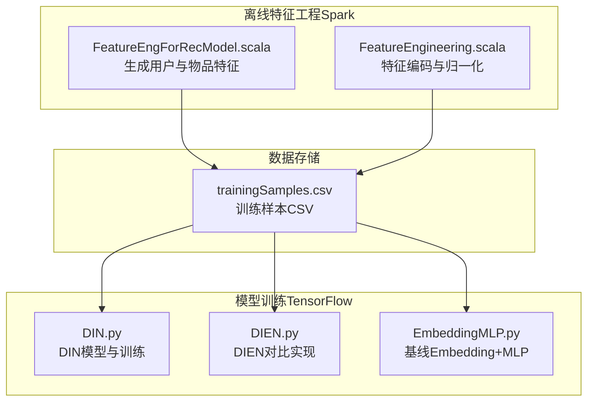
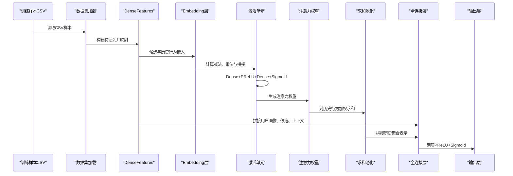
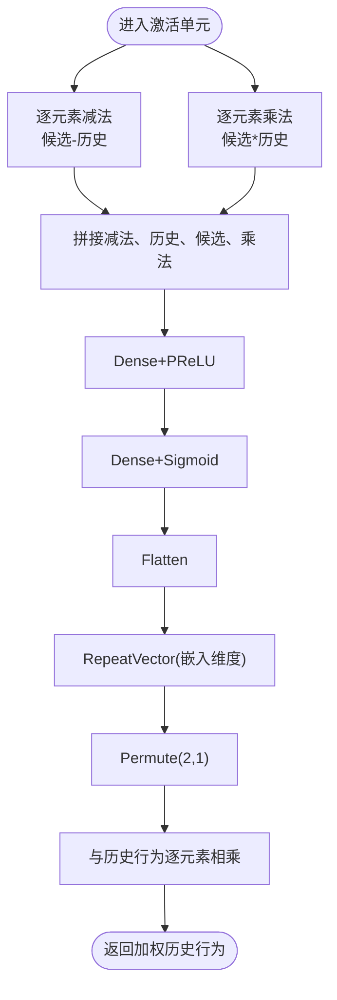

# DIN深度兴趣网络

<cite>
**本文档引用的文件**
- [DIN.py](file://TFRecModel/src/com/sparrowrecsys/offline/tensorflow/DIN.py)
- [EmbeddingMLP.py](file://TFRecModel/src/com/sparrowrecsys/offline/tensorflow/EmbeddingMLP.py)
- [DIEN.py](file://TFRecModel/src/com/sparrowrecsys/offline/tensorflow/DIEN.py)
- [FeatureEngForRecModel.scala](file://src/main/java/com/sparrowrecsys/offline/spark/featureeng/FeatureEngForRecModel.scala)
- [FeatureEngineering.scala](file://src/main/java/com/sparrowrecsys/offline/spark/featureeng/FeatureEngineering.scala)
- [trainingSamples.csv](file://src/main/resources/webroot/sampledata/trainingSamples.csv)
- [README.md](file://README.md)
</cite>

## 目录
1. [简介](#简介)
2. [项目结构](#项目结构)
3. [核心组件](#核心组件)
4. [架构总览](#架构总览)
5. [详细组件分析](#详细组件分析)
6. [依赖关系分析](#依赖关系分析)
7. [性能考虑](#性能考虑)
8. [故障排查指南](#故障排查指南)
9. [结论](#结论)
10. [附录](#附录)

## 简介
本文件面向开发者与算法工程师，系统性解析DIN（深度兴趣网络）在SparrowRecSys项目中的实现与应用。内容涵盖：
- DIN注意力机制与用户行为序列建模
- 候选物品与历史行为的交互计算
- 激活单元（Activation Unit）设计：减法、乘法与PReLU激活
- 用户画像、上下文与行为序列特征融合
- 完整模型构建流程：输入层、嵌入层、注意力权重计算、池化与全连接层
- 训练流程：数据集准备、损失函数、优化器与评估指标
- 实际训练与预测示例，帮助理解DIN在个性化推荐中的价值

## 项目结构
SparrowRecSys采用多语言混合架构，包含离线特征工程（Spark）、在线服务（Java/Scala）、以及TensorFlow模型训练（Python）。DIN模型位于TensorFlow模块中，配合Spark特征工程生成训练样本。

图表来源
- [FeatureEngForRecModel.scala](file://src/main/java/com/sparrowrecsys/offline/spark/featureeng/FeatureEngForRecModel.scala#L261-L290)
- [trainingSamples.csv](file://src/main/resources/webroot/sampledata/trainingSamples.csv#L1-L20)
- [DIN.py](file://TFRecModel/src/com/sparrowrecsys/offline/tensorflow/DIN.py#L1-L190)
- [DIEN.py](file://TFRecModel/src/com/sparrowrecsys/offline/tensorflow/DIEN.py#L1-L316)
- [EmbeddingMLP.py](file://TFRecModel/src/com/sparrowrecsys/offline/tensorflow/EmbeddingMLP.py#L1-L154)

章节来源
- [README.md](file://README.md#L19-L31)
- [FeatureEngForRecModel.scala](file://src/main/java/com/sparrowrecsys/offline/spark/featureeng/FeatureEngForRecModel.scala#L261-L290)
- [trainingSamples.csv](file://src/main/resources/webroot/sampledata/trainingSamples.csv#L1-L20)
- [DIN.py](file://TFRecModel/src/com/sparrowrecsys/offline/tensorflow/DIN.py#L1-L190)
- [DIEN.py](file://TFRecModel/src/com/sparrowrecsys/offline/tensorflow/DIEN.py#L1-L316)
- [EmbeddingMLP.py](file://TFRecModel/src/com/sparrowrecsys/offline/tensorflow/EmbeddingMLP.py#L1-L154)

## 核心组件
- 输入层与特征列：定义用户画像、上下文与行为序列特征列，使用DenseFeatures统一映射到张量空间。
- 嵌入层：对电影ID与用户ID进行嵌入，行为序列通过嵌入矩阵映射为稠密向量序列。
- 激活单元（Activation Unit）：对候选物品与历史行为序列逐时刻计算交互特征，包含减法、乘法与PReLU非线性。
- 注意力权重计算：基于激活单元输出生成时序注意力权重，用于加权聚合历史行为表示。
- 池化与融合：对加权后的历史行为进行求和池化，与用户画像、候选物品、上下文特征拼接后进入全连接层。
- 输出层：两层PReLU后接Sigmoid输出，二分类概率。

章节来源
- [DIN.py](file://TFRecModel/src/com/sparrowrecsys/offline/tensorflow/DIN.py#L34-L169)

## 架构总览
DIN整体流程从CSV样本读取开始，经由特征列与嵌入层得到候选与历史行为的向量表示，通过激活单元与注意力机制计算时序权重，对历史行为进行加权聚合，最终与用户画像、上下文特征融合完成预测。

图表来源
- [DIN.py](file://TFRecModel/src/com/sparrowrecsys/offline/tensorflow/DIN.py#L14-L27)
- [DIN.py](file://TFRecModel/src/com/sparrowrecsys/offline/tensorflow/DIN.py#L125-L169)

## 详细组件分析

### 输入层与特征列
- 用户画像特征：用户ID嵌入、用户偏好类型嵌入、用户评分统计（计数、均值、标准差）。
- 上下文特征：物品类型嵌入、上映年份、物品评分统计（计数、均值、标准差）。
- 行为序列特征：最近5部观看过的电影ID（数值列），用于构造历史行为序列。
- DenseFeatures层将上述特征列统一映射到张量空间，供后续层使用。

章节来源
- [DIN.py](file://TFRecModel/src/com/sparrowrecsys/offline/tensorflow/DIN.py#L66-L128)

### 嵌入层与行为序列建模
- 电影ID嵌入：使用Embedding层，input_dim=1001，output_dim=EMBEDDING_SIZE，mask_zero=True以忽略填充。
- 候选物品嵌入：squeeze降维至(batch, EMBEDDING_SIZE)。
- 历史行为嵌入：对最近5部电影ID进行嵌入，形成(batch, 5, EMBEDDING_SIZE)的序列。

章节来源
- [DIN.py](file://TFRecModel/src/com/sparrowrecsys/offline/tensorflow/DIN.py#L132-L137)

### 激活单元（Activation Unit）
激活单元是DIN的关键创新，用于刻画候选物品与历史行为的交互：
- 减法操作：逐元素相减，衡量候选与历史行为的差异。
- 乘法操作：逐元素相乘，捕获候选与历史行为的共同特征。
- 拼接：将减法、乘法与原始历史嵌入拼接，形成交互特征。
- 非线性变换：两层Dense+PReLU，最后一层输出Sigmoid注意力权重。
- 权重广播：将注意力权重重复扩展到嵌入维度，与历史行为逐元素相乘，得到加权的历史行为表示。

图表来源
- [DIN.py](file://TFRecModel/src/com/sparrowrecsys/offline/tensorflow/DIN.py#L139-L155)

章节来源
- [DIN.py](file://TFRecModel/src/com/sparrowrecsys/offline/tensorflow/DIN.py#L130-L155)

### 注意力权重计算与池化
- 注意力权重：激活单元输出的权重向量经RepeatVector与Permute调整形状，与历史行为逐元素相乘，得到加权序列。
- 池化：对加权序列沿时间轴求和，得到固定长度的用户兴趣向量，作为历史行为的聚合表示。

章节来源
- [DIN.py](file://TFRecModel/src/com/sparrowrecsys/offline/tensorflow/DIN.py#L157-L158)

### 特征融合与全连接层
- 融合：将用户画像、候选物品、上下文特征与历史行为聚合向量拼接。
- 全连接层：两层Dense+PReLU，最后Dense+Sigmoid输出预测概率。

章节来源
- [DIN.py](file://TFRecModel/src/com/sparrowrecsys/offline/tensorflow/DIN.py#L160-L167)

### 模型编译与训练
- 损失函数：binary_crossentropy。
- 优化器：Adam。
- 评估指标：accuracy、ROC AUC、PR AUC。
- 训练：model.fit(train_dataset, epochs=5)，评估与预测同文件内演示。

章节来源
- [DIN.py](file://TFRecModel/src/com/sparrowrecsys/offline/tensorflow/DIN.py#L171-L189)

### 与DIEN的对比
DIEN在DIN基础上引入GRU与注意力更新门（AUGRU），并通过辅助损失增强训练稳定性。两者共享相似的激活单元思想，但DIEN在序列建模上更复杂。

章节来源
- [DIEN.py](file://TFRecModel/src/com/sparrowrecsys/offline/tensorflow/DIEN.py#L1-L11)
- [DIEN.py](file://TFRecModel/src/com/sparrowrecsys/offline/tensorflow/DIEN.py#L169-L250)

## 依赖关系分析
DIN模型依赖于：
- TensorFlow/Keras：构建模型、层与训练流程。
- CSV数据集：训练与测试样本，包含用户画像、上下文与行为序列字段。
- Spark特征工程：生成训练样本CSV，提供标签与特征。

图表来源
- [DIN.py](file://TFRecModel/src/com/sparrowrecsys/offline/tensorflow/DIN.py#L14-L27)
- [DIN.py](file://TFRecModel/src/com/sparrowrecsys/offline/tensorflow/DIN.py#L125-L169)

章节来源
- [DIN.py](file://TFRecModel/src/com/sparrowrecsys/offline/tensorflow/DIN.py#L14-L27)
- [DIN.py](file://TFRecModel/src/com/sparrowrecsys/offline/tensorflow/DIN.py#L125-L169)

## 性能考虑
- 嵌入维度：EMBEDDING_SIZE=10，兼顾表达能力与计算效率。
- 数据管道：建议在生产环境使用shuffle、cache与prefetch提升吞吐量（参考EmbeddingMLP的优化策略）。
- 归一化与正则：数值特征可采用log或标准化；EmbeddingMLP展示了数值特征归一化与L2正则的实践。
- 早停与学习率调度：EmbeddingMLP提供了基于验证集的早停与学习率调度策略，可借鉴到DIN训练中。

章节来源
- [EmbeddingMLP.py](file://TFRecModel/src/com/sparrowrecsys/offline/tensorflow/EmbeddingMLP.py#L13-L28)
- [EmbeddingMLP.py](file://TFRecModel/src/com/sparrowrecsys/offline/tensorflow/EmbeddingMLP.py#L70-L85)
- [EmbeddingMLP.py](file://TFRecModel/src/com/sparrowrecsys/offline/tensorflow/EmbeddingMLP.py#L119-L141)

## 故障排查指南
- 数据路径问题：确保trainingSamples.csv与testSamples.csv路径正确，或修改为本地绝对路径。
- 字段不匹配：确认CSV字段与输入层定义一致（如movieId、userId、userRatedMovie1~5等）。
- 嵌入维度与类别数：确保Embedding的input_dim覆盖所有ID范围，否则会触发未知类别错误。
- 内存与显存：大批量训练时注意batch_size与序列长度，必要时降低RECENT_MOVIES或EMBEDDING_SIZE。
- 指标异常：若AUC为NaN，检查标签分布是否极端或阈值设置是否合理。

章节来源
- [DIN.py](file://TFRecModel/src/com/sparrowrecsys/offline/tensorflow/DIN.py#L4-L10)
- [DIN.py](file://TFRecModel/src/com/sparrowrecsys/offline/tensorflow/DIN.py#L34-L59)
- [DIN.py](file://TFRecModel/src/com/sparrowrecsys/offline/tensorflow/DIN.py#L171-L174)

## 结论
DIN通过激活单元与注意力机制，有效建模了候选物品与用户历史行为之间的交互，实现了对用户兴趣的动态建模。结合用户画像与上下文特征，DIN在推荐场景中具备良好的表达能力与可解释性。在生产环境中，建议结合Spark特征工程与EmbeddingMLP的优化策略，进一步提升训练稳定性与推理效率。

## 附录

### 训练与评估流程（步骤说明）
- 准备数据：使用Spark特征工程生成trainingSamples.csv与testSamples.csv。
- 加载数据：make_csv_dataset读取CSV，指定label列与批大小。
- 构建模型：定义输入层、特征列、嵌入层、激活单元、池化与全连接层。
- 编译模型：选择损失函数、优化器与评估指标。
- 训练与评估：fit与evaluate，打印测试指标。
- 预测示例：predict输出概率并打印前若干条预测结果。

章节来源
- [DIN.py](file://TFRecModel/src/com/sparrowrecsys/offline/tensorflow/DIN.py#L14-L27)
- [DIN.py](file://TFRecModel/src/com/sparrowrecsys/offline/tensorflow/DIN.py#L171-L189)

### 特征工程要点（Spark）
- 样本标签：根据评分阈值生成二分类标签。
- 用户画像：提取用户近期观看历史、评分统计与偏好类型。
- 物品特征：提取上映年份、评分统计与类型列表。
- 数据划分：按比例随机分割为训练与测试集。

章节来源
- [FeatureEngForRecModel.scala](file://src/main/java/com/sparrowrecsys/offline/spark/featureeng/FeatureEngForRecModel.scala#L21-L29)
- [FeatureEngForRecModel.scala](file://src/main/java/com/sparrowrecsys/offline/spark/featureeng/FeatureEngForRecModel.scala#L86-L130)
- [FeatureEngForRecModel.scala](file://src/main/java/com/sparrowrecsys/offline/spark/featureeng/FeatureEngForRecModel.scala#L176-L205)