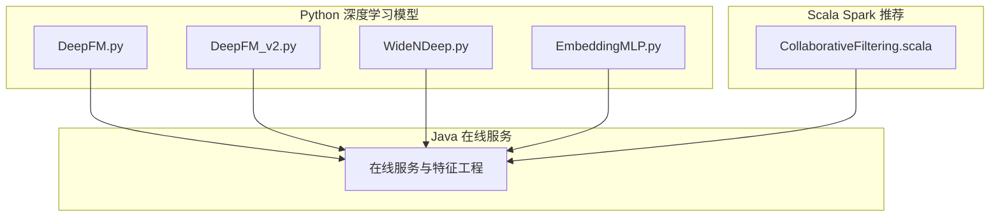
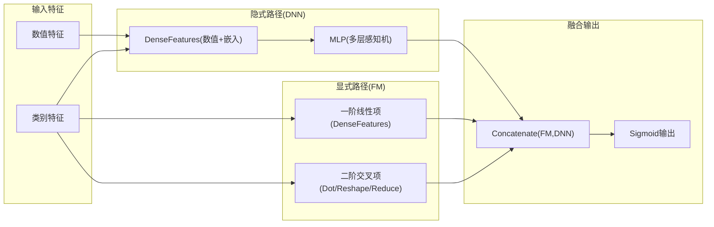
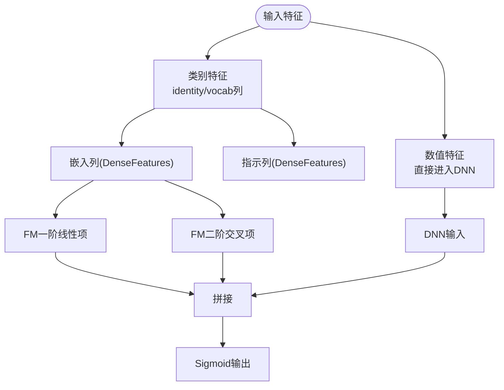
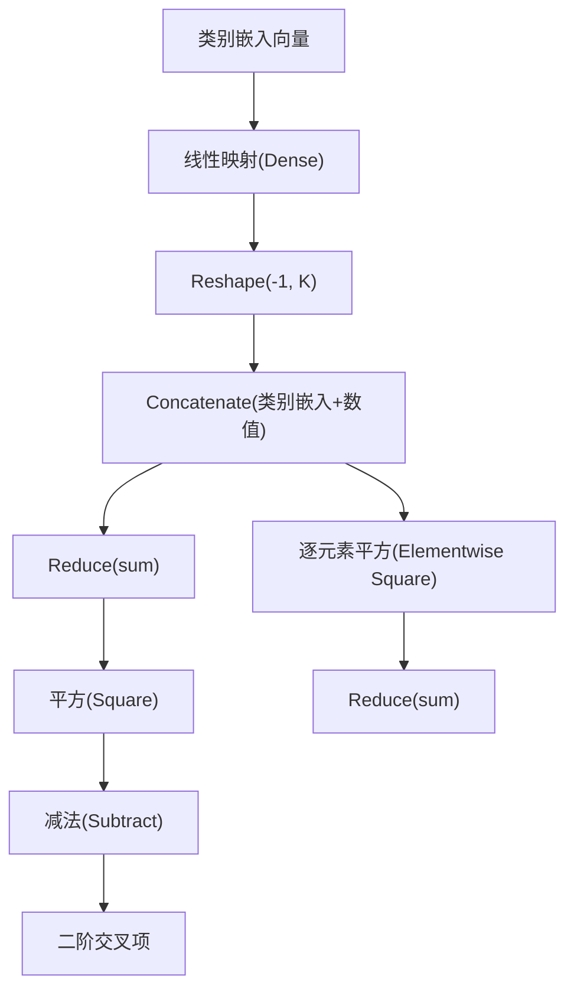
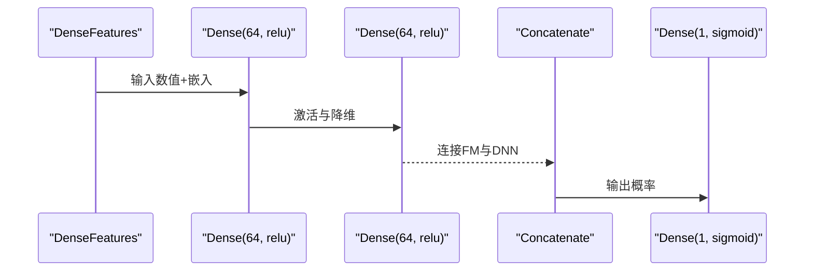
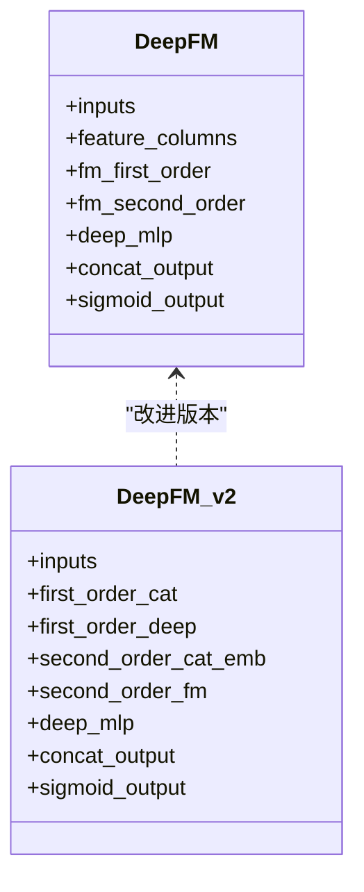
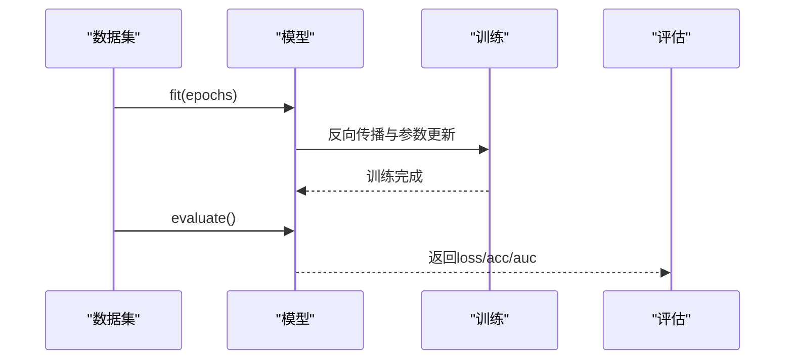
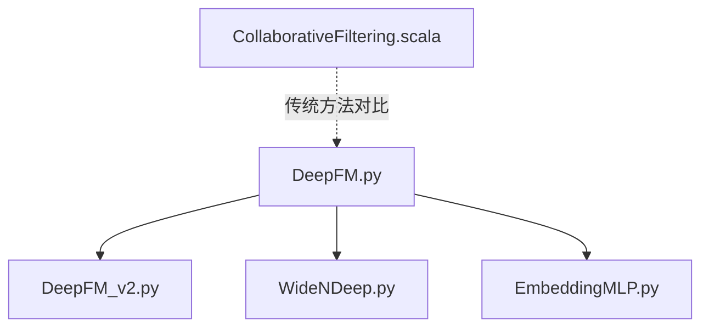

# DeepFM因子分解机

<cite>
**本文引用的文件**
- [DeepFM.py](file://TFRecModel/src/com/sparrowrecsys/offline/tensorflow/DeepFM.py)
- [DeepFM_v2.py](file://TFRecModel/src/com/sparrowrecsys/offline/tensorflow/DeepFM_v2.py)
- [WideNDeep.py](file://TFRecModel/src/com/sparrowrecsys/offline/tensorflow/WideNDeep.py)
- [EmbeddingMLP.py](file://TFRecModel/src/com/sparrowrecsys/offline/tensorflow/EmbeddingMLP.py)
- [CollaborativeFiltering.scala](file://src/main/java/com/sparrowrecsys/offline/spark/model/CollaborativeFiltering.scala)
- [README.md](file://README.md)
</cite>

## 目录
1. [简介](#简介)
2. [项目结构](#项目结构)
3. [核心组件](#核心组件)
4. [架构总览](#架构总览)
5. [详细组件分析](#详细组件分析)
6. [依赖关系分析](#依赖关系分析)
7. [性能考量](#性能考量)
8. [故障排查指南](#故障排查指南)
9. [结论](#结论)
10. [附录](#附录)

## 简介
本文件面向开发者与研究者，系统梳理并解析DeepFM（深度因子分解机）在本仓库中的实现与使用方式。DeepFM融合了显式因子分解机（FM）与隐式深度神经网络（DNN）两部分，既能高效建模低阶特征交互（如一阶线性项与二阶交叉项），又能通过深度网络学习高阶非线性交互，形成“显式+隐式”的双重特征交互优势。本文将从架构设计、数据流、训练流程、性能评估与调参与实践建议等方面进行全面阐述。

## 项目结构
本仓库采用多语言混合架构：Python/TensorFlow用于离线深度学习模型训练与推理；Scala/Spark用于协同过滤等传统推荐算法；Java/在线服务负责实时特征与在线服务集成。与DeepFM直接相关的实现位于Python模块中，主要文件如下：
- DeepFM.py：基础版本的DeepFM实现，包含特征嵌入、FM二阶交叉与DNN深度分支的拼接输出。
- DeepFM_v2.py：改进版DeepFM，分离一阶与二阶处理，采用完全交叉的FM二阶特征构造与自定义归约层。
- WideNDeep.py：对比模型，展示宽深架构思路，便于理解DeepFM的“显式+隐式”互补设计。
- EmbeddingMLP.py：通用嵌入+MLP范式与训练优化技巧，可借鉴其数据管道、正则化与回调策略。
- CollaborativeFiltering.scala：ALS协同过滤示例，体现传统矩阵分解方法在推荐场景中的地位。
- README.md：项目总体介绍与所实现模型清单。

图表来源
- [DeepFM.py](file://TFRecModel/src/com/sparrowrecsys/offline/tensorflow/DeepFM.py#L1-L135)
- [DeepFM_v2.py](file://TFRecModel/src/com/sparrowrecsys/offline/tensorflow/DeepFM_v2.py#L1-L178)
- [WideNDeep.py](file://TFRecModel/src/com/sparrowrecsys/offline/tensorflow/WideNDeep.py#L1-L130)
- [EmbeddingMLP.py](file://TFRecModel/src/com/sparrowrecsys/offline/tensorflow/EmbeddingMLP.py#L1-L154)
- [CollaborativeFiltering.scala](file://src/main/java/com/sparrowrecsys/offline/spark/model/CollaborativeFiltering.scala#L1-L85)

章节来源
- [README.md](file://README.md#L1-L57)

## 核心组件
- 特征输入与类型定义：模型接收数值型与分类型特征，分别映射到嵌入向量与指示向量。
- 显式因子分解层（FM）：包含一阶线性项与二阶交叉项，二阶交叉通过嵌入向量逐元素乘积与求和实现。
- 隐式深度神经网络层（DNN）：对数值型与嵌入型特征进行堆叠变换，学习高阶非线性交互。
- 输出层：将FM与DNN的表征拼接后经全连接层输出概率。

章节来源
- [DeepFM.py](file://TFRecModel/src/com/sparrowrecsys/offline/tensorflow/DeepFM.py#L30-L115)
- [DeepFM_v2.py](file://TFRecModel/src/com/sparrowrecsys/offline/tensorflow/DeepFM_v2.py#L37-L157)

## 架构总览
DeepFM的双线性架构由两条并行路径组成：
- 显式路径（FM）：以特征嵌入为输入，计算一阶线性项与二阶交叉项，捕捉低阶、可解释的特征交互。
- 隐式路径（DNN）：对数值型与嵌入型特征进行深度变换，学习高阶复杂交互。
- 融合输出：将两类路径的表征拼接后进入输出层，完成最终预测。

图表来源
- [DeepFM.py](file://TFRecModel/src/com/sparrowrecsys/offline/tensorflow/DeepFM.py#L78-L115)
- [DeepFM_v2.py](file://TFRecModel/src/com/sparrowrecsys/offline/tensorflow/DeepFM_v2.py#L87-L157)

## 详细组件分析

### 组件A：特征工程与嵌入
- 分类型特征：通过身份列或词汇表列构建嵌入列与指示列，分别用于FM一阶与二阶交叉。
- 数值型特征：直接进入DNN路径，亦可加入FM一阶线性项。
- 嵌入维度：根据类别数量与稀疏程度选择合适维度，避免过拟合与计算开销。

图表来源
- [DeepFM.py](file://TFRecModel/src/com/sparrowrecsys/offline/tensorflow/DeepFM.py#L53-L89)
- [DeepFM_v2.py](file://TFRecModel/src/com/sparrowrecsys/offline/tensorflow/DeepFM_v2.py#L60-L96)

章节来源
- [DeepFM.py](file://TFRecModel/src/com/sparrowrecsys/offline/tensorflow/DeepFM.py#L53-L89)
- [DeepFM_v2.py](file://TFRecModel/src/com/sparrowrecsys/offline/tensorflow/DeepFM_v2.py#L60-L96)

### 组件B：显式因子分解层（FM）
- 一阶线性项：对类别特征的指示向量进行线性变换，得到一阶贡献。
- 二阶交叉项：对嵌入向量进行逐元素乘积与求和，实现低阶交互建模。
- v2版本：将类别与数值特征分离，先对类别嵌入做线性映射与展平，再进行完全交叉构造，最后通过自定义归约层计算平方和与平方的差，得到二阶交叉项。

图表来源
- [DeepFM_v2.py](file://TFRecModel/src/com/sparrowrecsys/offline/tensorflow/DeepFM_v2.py#L106-L152)

章节来源
- [DeepFM_v2.py](file://TFRecModel/src/com/sparrowrecsys/offline/tensorflow/DeepFM_v2.py#L87-L152)

### 组件C：隐式深度神经网络层（DNN）
- 输入：数值型特征与各类别嵌入向量。
- 结构：多层全连接网络，激活函数常用ReLU，最后一层输出与FM拼接。
- v2版本：对类别嵌入先做线性映射与展平，再与数值特征拼接，形成统一的二阶FM特征，随后进入DNN。

图表来源
- [DeepFM.py](file://TFRecModel/src/com/sparrowrecsys/offline/tensorflow/DeepFM.py#L105-L115)
- [DeepFM_v2.py](file://TFRecModel/src/com/sparrowrecsys/offline/tensorflow/DeepFM_v2.py#L118-L126)

章节来源
- [DeepFM.py](file://TFRecModel/src/com/sparrowrecsys/offline/tensorflow/DeepFM.py#L105-L115)
- [DeepFM_v2.py](file://TFRecModel/src/com/sparrowrecsys/offline/tensorflow/DeepFM_v2.py#L118-L126)

### 组件D：融合与输出
- 将FM一阶线性项与二阶交叉项以及DNN输出进行拼接，再经一层全连接与Sigmoid得到最终预测概率。
- v2版本：先将类别与数值特征分别映射到同一维度，再进行完全交叉构造，最后拼接输出。

图表来源
- [DeepFM.py](file://TFRecModel/src/com/sparrowrecsys/offline/tensorflow/DeepFM.py#L96-L115)
- [DeepFM_v2.py](file://TFRecModel/src/com/sparrowrecsys/offline/tensorflow/DeepFM_v2.py#L98-L157)

章节来源
- [DeepFM.py](file://TFRecModel/src/com/sparrowrecsys/offline/tensorflow/DeepFM.py#L96-L115)
- [DeepFM_v2.py](file://TFRecModel/src/com/sparrowrecsys/offline/tensorflow/DeepFM_v2.py#L98-L157)

### 组件E：训练流程与评估
- 数据加载：CSV数据集通过tf.data加载，支持批大小、标签列、缺失值处理与错误忽略。
- 模型编译：损失函数为二元交叉熵，优化器为Adam，评估指标包含准确率与ROC/PR AUC。
- 训练与评估：fit与evaluate接口完成训练与测试集评估，predict输出预测结果。

图表来源
- [DeepFM.py](file://TFRecModel/src/com/sparrowrecsys/offline/tensorflow/DeepFM.py#L116-L128)
- [DeepFM_v2.py](file://TFRecModel/src/com/sparrowrecsys/offline/tensorflow/DeepFM_v2.py#L158-L170)

章节来源
- [DeepFM.py](file://TFRecModel/src/com/sparrowrecsys/offline/tensorflow/DeepFM.py#L116-L128)
- [DeepFM_v2.py](file://TFRecModel/src/com/sparrowrecsys/offline/tensorflow/DeepFM_v2.py#L158-L170)

## 依赖关系分析
- DeepFM与DeepFM_v2：v2在v1基础上改进了FM二阶构造方式与一阶/二阶分离策略，提升表达能力与可解释性。
- 与WideNDeep对比：WideNDeep强调宽深互补，DeepFM强调显式+隐式的融合，二者均可建模低阶与高阶交互。
- 与EmbeddingMLP对比：EmbeddingMLP展示了数据管道优化、正则化、早停与学习率调度等训练技巧，可直接借鉴至DeepFM训练实践中。

图表来源
- [DeepFM.py](file://TFRecModel/src/com/sparrowrecsys/offline/tensorflow/DeepFM.py#L1-L135)
- [DeepFM_v2.py](file://TFRecModel/src/com/sparrowrecsys/offline/tensorflow/DeepFM_v2.py#L1-L178)
- [WideNDeep.py](file://TFRecModel/src/com/sparrowrecsys/offline/tensorflow/WideNDeep.py#L1-L130)
- [EmbeddingMLP.py](file://TFRecModel/src/com/sparrowrecsys/offline/tensorflow/EmbeddingMLP.py#L1-L154)
- [CollaborativeFiltering.scala](file://src/main/java/com/sparrowrecsys/offline/spark/model/CollaborativeFiltering.scala#L1-L85)

章节来源
- [DeepFM.py](file://TFRecModel/src/com/sparrowrecsys/offline/tensorflow/DeepFM.py#L1-L135)
- [DeepFM_v2.py](file://TFRecModel/src/com/sparrowrecsys/offline/tensorflow/DeepFM_v2.py#L1-L178)
- [WideNDeep.py](file://TFRecModel/src/com/sparrowrecsys/offline/tensorflow/WideNDeep.py#L1-L130)
- [EmbeddingMLP.py](file://TFRecModel/src/com/sparrowrecsys/offline/tensorflow/EmbeddingMLP.py#L1-L154)
- [CollaborativeFiltering.scala](file://src/main/java/com/sparrowrecsys/offline/spark/model/CollaborativeFiltering.scala#L1-L85)

## 性能考量
- 数据管道优化：参考EmbeddingMLP的数据管道优化策略，包括打乱、缓存与异步预取，提升吞吐与稳定性。
- 特征归一化：对数值特征进行标准化或log变换，有助于加速收敛与稳定训练。
- 嵌入维度选择：类别数量大时适当降低嵌入维度，避免过拟合；同时保持足够的表达能力。
- 正则化与正则化策略：可借鉴EmbeddingMLP的L2正则与Dropout设置，结合BatchNormalization提升泛化能力。
- 学习率调度与早停：使用验证集监控loss，采用ReduceLROnPlateau与EarlyStopping，防止过拟合并加速收敛。
- 模型融合对比：DeepFM与WideNDeep在低阶与高阶交互上各有侧重，可按任务需求选择或组合。

章节来源
- [EmbeddingMLP.py](file://TFRecModel/src/com/sparrowrecsys/offline/tensorflow/EmbeddingMLP.py#L13-L28)
- [EmbeddingMLP.py](file://TFRecModel/src/com/sparrowrecsys/offline/tensorflow/EmbeddingMLP.py#L70-L85)
- [EmbeddingMLP.py](file://TFRecModel/src/com/sparrowrecsys/offline/tensorflow/EmbeddingMLP.py#L112-L141)

## 故障排查指南
- 数据加载异常：检查CSV路径与列名是否匹配，确认标签列与缺失值处理策略。
- 梯度爆炸/消失：调整学习率、使用梯度裁剪、增加BatchNormalization与Dropout。
- 过拟合：增加L2正则、减少网络深度、使用早停与学习率调度。
- 内存不足：降低batch size、减少嵌入维度、关闭不必要的缓存。
- 评估指标不收敛：检查数据分布、特征归一化与标签平滑策略。

章节来源
- [DeepFM.py](file://TFRecModel/src/com/sparrowrecsys/offline/tensorflow/DeepFM.py#L116-L128)
- [DeepFM_v2.py](file://TFRecModel/src/com/sparrowrecsys/offline/tensorflow/DeepFM_v2.py#L158-L170)
- [EmbeddingMLP.py](file://TFRecModel/src/com/sparrowrecsys/offline/tensorflow/EmbeddingMLP.py#L112-L141)

## 结论
DeepFM通过显式因子分解与隐式深度网络的协同，实现了低阶与高阶特征交互的统一建模。v2版本进一步提升了二阶交叉的表达能力与训练稳定性。结合EmbeddingMLP的训练优化策略，可在实际项目中取得更好的收敛速度与泛化性能。对于对比实验，WideNDeep提供了另一种宽深互补的思路，而ALS等传统方法则体现了矩阵分解在推荐领域的基础地位。

## 附录
- 实践建议
  - 数据准备：确保CSV字段与模型输入一致，必要时进行特征归一化与缺失值处理。
  - 模型选择：若需强解释性与低阶交互优先，可偏向DeepFM；若需更灵活的宽深融合，可考虑WideNDeep。
  - 训练配置：参考EmbeddingMLP的早停与学习率调度策略，结合验证集监控训练状态。
  - 评估方法：关注AUC（ROC/PR）、准确率与损失曲线，结合业务指标（如点击率、转化率）进行综合评估。

章节来源
- [README.md](file://README.md#L23-L31)
- [EmbeddingMLP.py](file://TFRecModel/src/com/sparrowrecsys/offline/tensorflow/EmbeddingMLP.py#L112-L141)
- [CollaborativeFiltering.scala](file://src/main/java/com/sparrowrecsys/offline/spark/model/CollaborativeFiltering.scala#L29-L52)