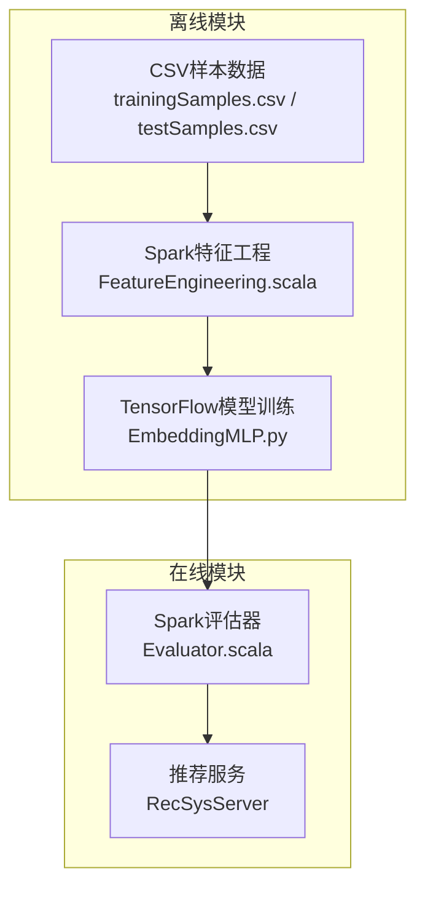
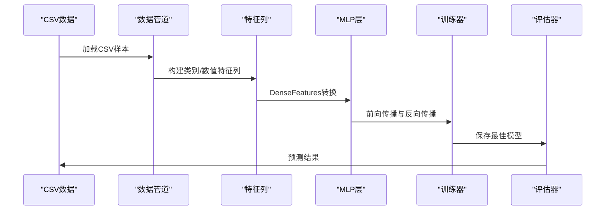
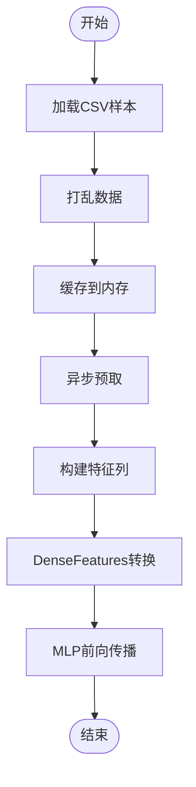
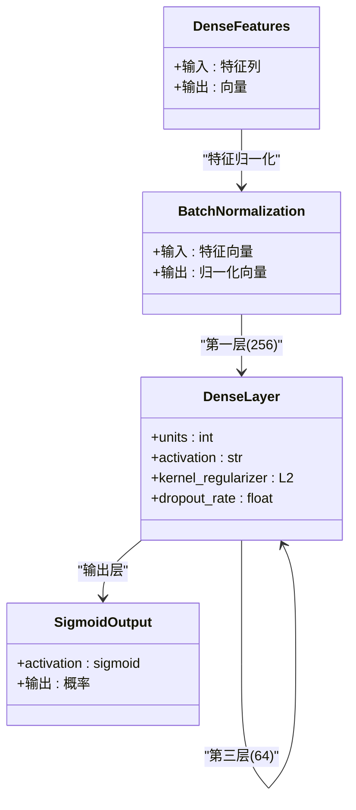
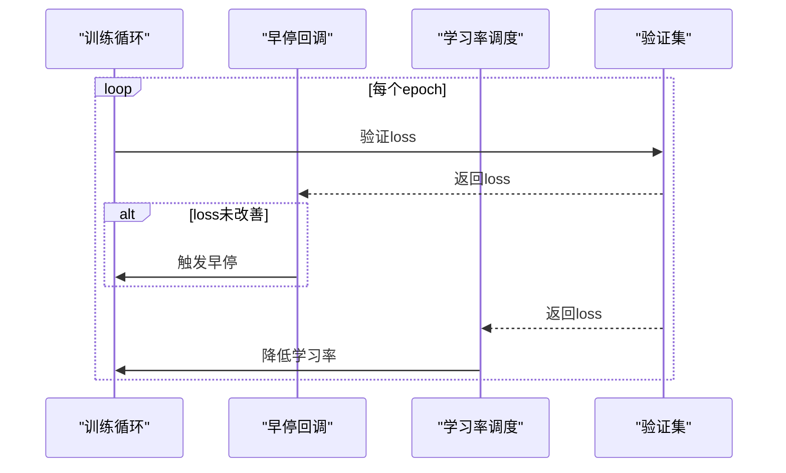
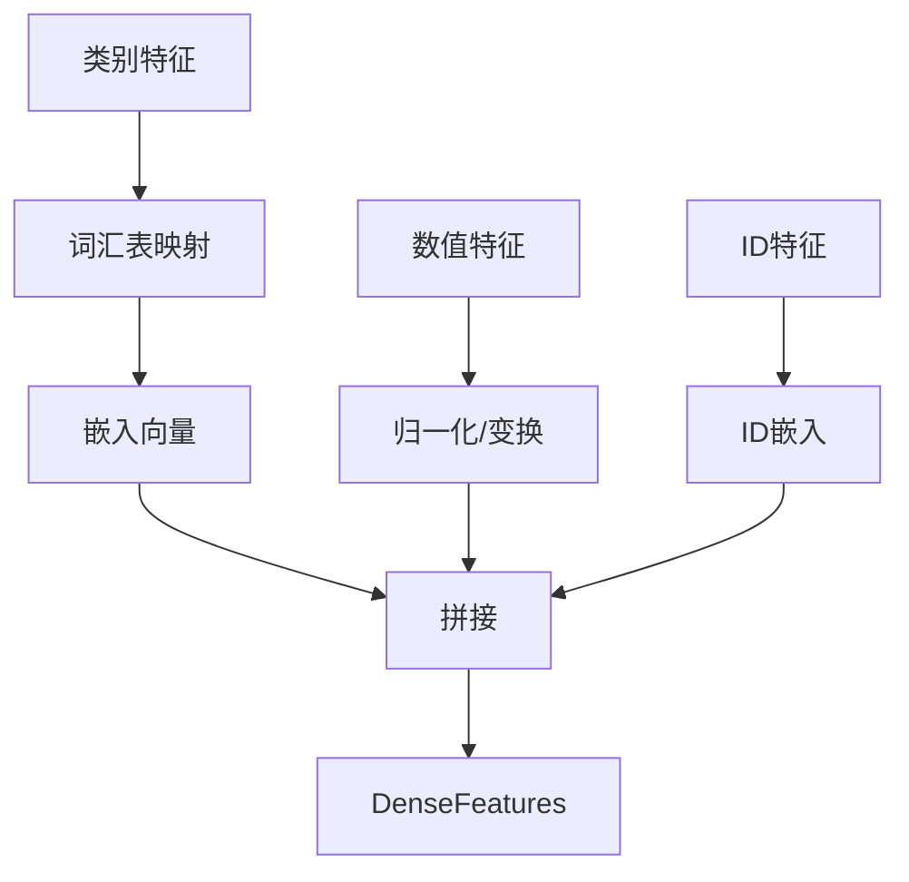
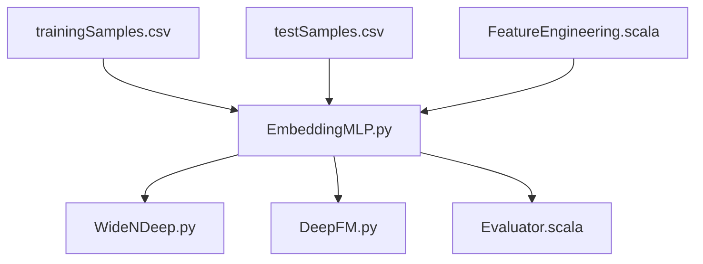

# EmbeddingMLP模型

<cite>
**本文档引用的文件**
- [EmbeddingMLP.py](file://TFRecModel/src/com/sparrowrecsys/offline/tensorflow/EmbeddingMLP.py)
- [README.md](file://README.md)
- [FeatureEngineering.scala](file://src/main/java/com/sparrowrecsys/offline/spark/featureeng/FeatureEngineering.scala)
- [Evaluator.scala](file://src/main/java/com/sparrowrecsys/offline/spark/evaluate/Evaluator.scala)
- [WideNDeep.py](file://TFRecModel/src/com/sparrowrecsys/offline/tensorflow/WideNDeep.py)
- [DeepFM.py](file://TFRecModel/src/com/sparrowrecsys/offline/tensorflow/DeepFM.py)
- [trainingSamples.csv](file://src/main/resources/webroot/sampledata/trainingSamples.csv)
- [testSamples.csv](file://src/main/resources/webroot/sampledata/testSamples.csv)
</cite>

## 目录
1. [简介](#简介)
2. [项目结构](#项目结构)
3. [核心组件](#核心组件)
4. [架构总览](#架构总览)
5. [详细组件分析](#详细组件分析)
6. [依赖关系分析](#依赖关系分析)
7. [性能考量](#性能考量)
8. [故障排查指南](#故障排查指南)
9. [结论](#结论)
10. [附录](#附录)

## 简介
EmbeddingMLP是一种将嵌入技术与多层感知机相结合的推荐模型。该模型通过嵌入层对类别特征进行低维稠密向量表示，再通过MLP层进行特征组合与非线性变换，最终输出二分类概率用于评分预测。本项目提供了完整的数据管道、特征工程、模型训练与评估流程，适用于电影评分预测等二分类推荐任务。

## 项目结构
SparrowRecSys是一个混合语言的推荐系统项目，包含离线数据处理、模型训练、在线服务等多个模块。EmbeddingMLP模型位于TensorFlow离线模块中，配合Spark离线特征工程与评估工具共同构成完整的推荐系统链路。

**图表来源**
- [EmbeddingMLP.py](file://TFRecModel/src/com/sparrowrecsys/offline/tensorflow/EmbeddingMLP.py#L1-L154)
- [FeatureEngineering.scala](file://src/main/java/com/sparrowrecsys/offline/spark/featureeng/FeatureEngineering.scala#L1-L120)
- [Evaluator.scala](file://src/main/java/com/sparrowrecsys/offline/spark/evaluate/Evaluator.scala#L1-L22)

**章节来源**
- [README.md](file://README.md#L1-L57)
- [EmbeddingMLP.py](file://TFRecModel/src/com/sparrowrecsys/offline/tensorflow/EmbeddingMLP.py#L1-L154)

## 核心组件
EmbeddingMLP模型的核心由以下组件构成：
- 数据管道：使用tf.data从CSV加载样本，支持shuffle、cache、prefetch优化
- 特征列：类别特征使用嵌入列，数值特征使用归一化列
- 模型架构：DenseFeatures + BatchNormalization + 多层Dense + Dropout + BatchNormalization + 输出层
- 训练配置：Adam优化器、BinaryCrossentropy损失、早停与学习率调度

关键特性：
- 嵌入维度优化：用户ID(32维)、电影ID(16维)、类型(8维)，平衡表达能力与计算开销
- 数值特征归一化：年份标准化、评分log变换，提升收敛稳定性
- 正则化与正则化：L2正则、Dropout、BatchNormalization防止过拟合
- 标签平滑：降低过拟合风险，提升泛化性能

**章节来源**
- [EmbeddingMLP.py](file://TFRecModel/src/com/sparrowrecsys/offline/tensorflow/EmbeddingMLP.py#L13-L154)

## 架构总览
EmbeddingMLP采用端到端的数据流架构，从CSV样本到模型训练再到评估与部署。

**图表来源**
- [EmbeddingMLP.py](file://TFRecModel/src/com/sparrowrecsys/offline/tensorflow/EmbeddingMLP.py#L14-L141)

## 详细组件分析

### 数据管道与特征工程
- 数据管道优化：shuffle缓冲区、内存缓存、异步预取，显著提升吞吐量
- 类别特征：使用词汇表列表构建嵌入列，支持多类型特征
- 数值特征：年份标准化、评分计数log变换、平均分标准化，改善分布特性
- ID特征：用户ID(30001类)、电影ID(1001类)分别映射到32维与16维嵌入

**图表来源**
- [EmbeddingMLP.py](file://TFRecModel/src/com/sparrowrecsys/offline/tensorflow/EmbeddingMLP.py#L14-L89)

**章节来源**
- [EmbeddingMLP.py](file://TFRecModel/src/com/sparrowrecsys/offline/tensorflow/EmbeddingMLP.py#L14-L85)

### 模型架构设计
- 输入层：DenseFeatures聚合所有特征列
- 隐藏层：三层递减结构(256→128→64)，每层包含ReLU激活、L2正则、BatchNormalization与Dropout
- 输出层：单神经元sigmoid输出，二分类概率
- 正则化策略：L2权重衰减(1e-5)、Dropout(0.3→0.2→0)、BatchNormalization稳定训练

**图表来源**
- [EmbeddingMLP.py](file://TFRecModel/src/com/sparrowrecsys/offline/tensorflow/EmbeddingMLP.py#L88-L110)

**章节来源**
- [EmbeddingMLP.py](file://TFRecModel/src/com/sparrowrecsys/offline/tensorflow/EmbeddingMLP.py#L87-L110)

### 训练策略与优化
- 损失函数：BinaryCrossentropy，支持标签平滑(0.1)提升鲁棒性
- 优化器：Adam，学习率0.001，梯度裁剪(clipnorm=1.0)
- 回调函数：早停(监控验证集loss，patience=3)、学习率调度(patience=2，衰减0.5)
- 评估指标：准确率、ROC AUC、PR AUC

**图表来源**
- [EmbeddingMLP.py](file://TFRecModel/src/com/sparrowrecsys/offline/tensorflow/EmbeddingMLP.py#L114-L141)

**章节来源**
- [EmbeddingMLP.py](file://TFRecModel/src/com/sparrowrecsys/offline/tensorflow/EmbeddingMLP.py#L112-L141)

### 模型输入特征处理流程
- 类别特征处理：词汇表→ID→嵌入向量，多类型特征独立映射
- 数值特征处理：年份标准化、评分计数log变换、平均分标准化
- ID特征处理：用户ID与电影ID分别映射到不同维度的嵌入空间
- 特征融合：通过DenseFeatures统一转换为固定长度向量

**图表来源**
- [EmbeddingMLP.py](file://TFRecModel/src/com/sparrowrecsys/offline/tensorflow/EmbeddingMLP.py#L40-L85)

**章节来源**
- [EmbeddingMLP.py](file://TFRecModel/src/com/sparrowrecsys/offline/tensorflow/EmbeddingMLP.py#L40-L85)

### 模型训练配置与调参与建议
- 嵌入维度调优：用户ID(32维)、电影ID(16维)、类型(8维)，可根据数据规模调整
- 数值特征归一化：年份标准化、评分log变换，确保数值稳定性
- 正则化强度：L2(1e-5)、Dropout(0.3→0.2→0)、BatchNormalization，可按过拟合程度调整
- 学习率策略：初始0.001，早停触发时减半，建议监控验证集loss
- 数据管道：shuffle缓冲区大小、prefetch级别可按硬件性能调整

**章节来源**
- [EmbeddingMLP.py](file://TFRecModel/src/com/sparrowrecsys/offline/tensorflow/EmbeddingMLP.py#L13-L154)

## 依赖关系分析
EmbeddingMLP模型与项目其他模块存在以下依赖关系：

**图表来源**
- [EmbeddingMLP.py](file://TFRecModel/src/com/sparrowrecsys/offline/tensorflow/EmbeddingMLP.py#L1-L154)
- [WideNDeep.py](file://TFRecModel/src/com/sparrowrecsys/offline/tensorflow/WideNDeep.py#L1-L130)
- [DeepFM.py](file://TFRecModel/src/com/sparrowrecsys/offline/tensorflow/DeepFM.py#L1-L135)

**章节来源**
- [EmbeddingMLP.py](file://TFRecModel/src/com/sparrowrecsys/offline/tensorflow/EmbeddingMLP.py#L1-L154)
- [WideNDeep.py](file://TFRecModel/src/com/sparrowrecsys/offline/tensorflow/WideNDeep.py#L1-L130)
- [DeepFM.py](file://TFRecModel/src/com/sparrowrecsys/offline/tensorflow/DeepFM.py#L1-L135)

## 性能考量
- 计算效率：嵌入维度与MLP层数的权衡，可通过网格搜索确定最优配置
- 内存占用：BatchNormalization与Dropout增加少量内存，但显著提升稳定性
- 收敛速度：标签平滑与学习率调度有助于稳定训练过程
- 泛化能力：早停与正则化组合有效防止过拟合

## 故障排查指南
- 数据加载问题：检查CSV路径与字段名称一致性
- 过拟合症状：观察训练/验证loss差异，适当增加Dropout或减少模型复杂度
- 收敛困难：调整学习率、检查数据归一化是否正确
- 性能瓶颈：优化数据管道参数，如prefetch级别与shuffle缓冲区大小

**章节来源**
- [EmbeddingMLP.py](file://TFRecModel/src/com/sparrowrecsys/offline/tensorflow/EmbeddingMLP.py#L13-L154)

## 结论
EmbeddingMLP模型通过嵌入层与MLP层的有机结合，实现了对类别特征与数值特征的有效建模。其优化的数据管道、合理的特征工程与稳健的训练策略，使其在推荐任务中具有良好的性能表现。建议根据具体业务场景调整嵌入维度与正则化强度，以获得最佳效果。

## 附录
- 模型适用场景：二分类评分预测、点击率预测等
- 与其他模型对比：相比Wide&Deep的宽深架构、DeepFM的因子分解机与MLP结合，EmbeddingMLP更简洁高效
- 在线部署：可将训练好的模型集成到推荐服务中，提供实时预测能力

**章节来源**
- [README.md](file://README.md#L23-L31)
- [EmbeddingMLP.py](file://TFRecModel/src/com/sparrowrecsys/offline/tensorflow/EmbeddingMLP.py#L1-L154)