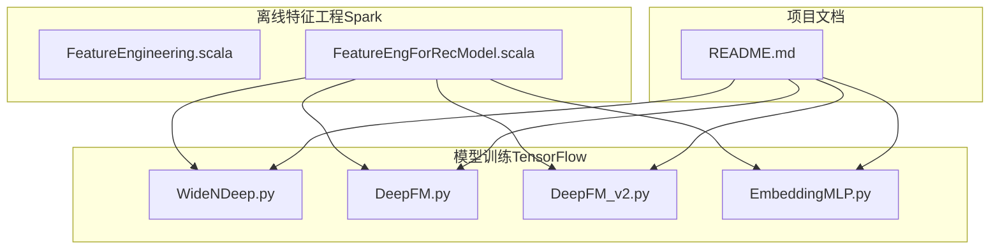
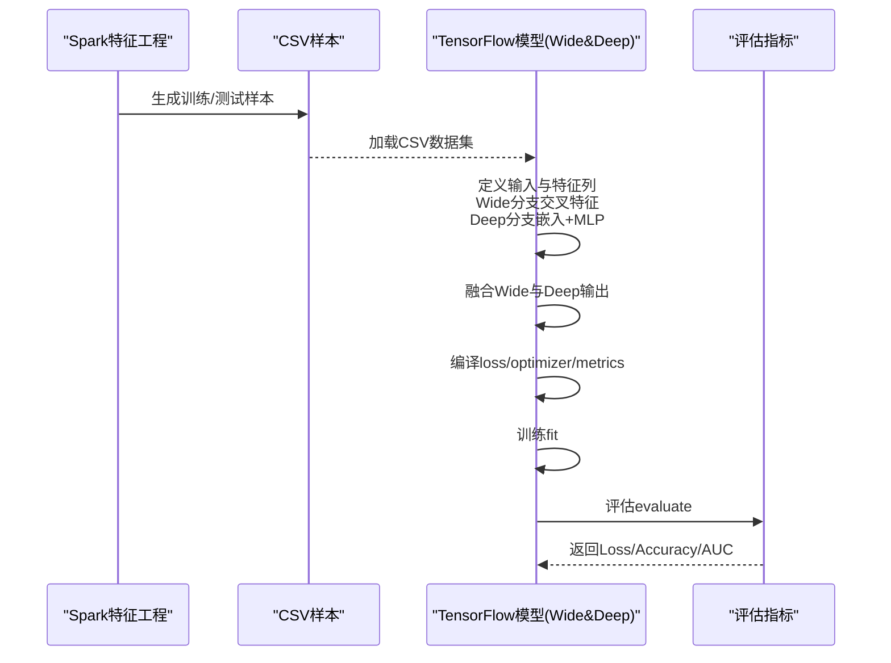
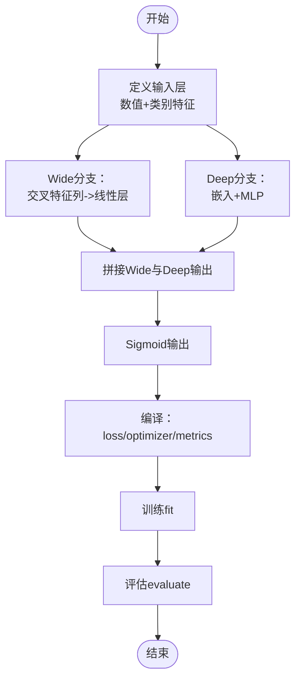
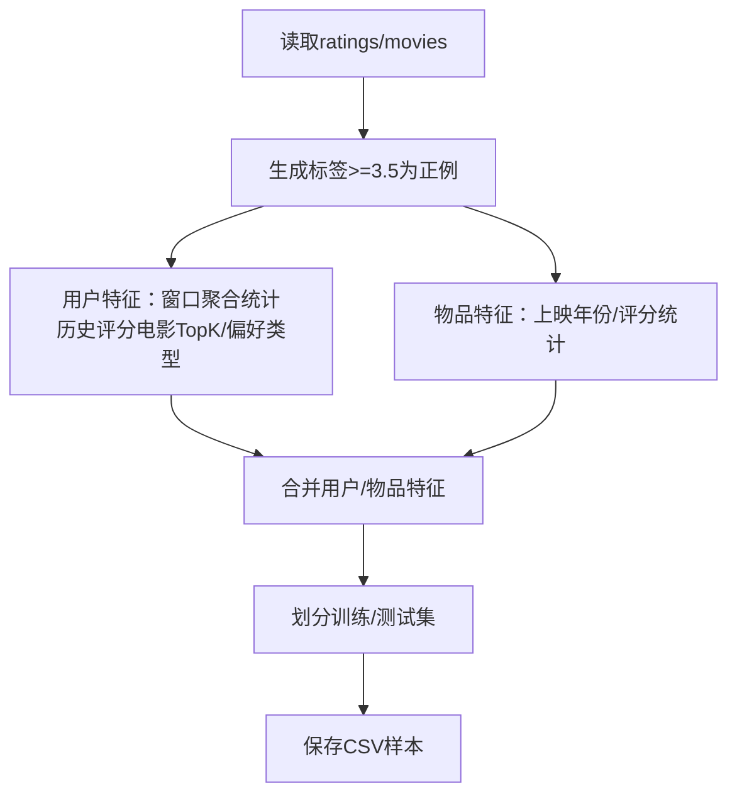

# Wide&Deep组合模型

<cite>
**本文引用的文件列表**
- [WideNDeep.py](file://TFRecModel/src/com/sparrowrecsys/offline/tensorflow/WideNDeep.py)
- [DeepFM.py](file://TFRecModel/src/com/sparrowrecsys/offline/tensorflow/DeepFM.py)
- [DeepFM_v2.py](file://TFRecModel/src/com/sparrowrecsys/offline/tensorflow/DeepFM_v2.py)
- [EmbeddingMLP.py](file://TFRecModel/src/com/sparrowrecsys/offline/tensorflow/EmbeddingMLP.py)
- [FeatureEngineering.scala](file://src/main/java/com/sparrowrecsys/offline/spark/featureeng/FeatureEngineering.scala)
- [FeatureEngForRecModel.scala](file://src/main/java/com/sparrowrecsys/offline/spark/featureeng/FeatureEngForRecModel.scala)
- [README.md](file://README.md)
</cite>

## 目录
1. [简介](#简介)
2. [项目结构](#项目结构)
3. [核心组件](#核心组件)
4. [架构总览](#架构总览)
5. [组件详解](#组件详解)
6. [依赖关系分析](#依赖关系分析)
7. [性能与训练要点](#性能与训练要点)
8. [故障排查指南](#故障排查指南)
9. [结论](#结论)
10. [附录：训练案例与参数调优建议](#附录训练案例与参数调优建议)

## 简介
本文件围绕Wide&Deep组合模型展开，结合仓库中的实现与配套特征工程脚本，系统阐述以下内容：
- Wide&Deep架构的设计理念：记忆（Wide）与泛化（Deep）两路互补，分别负责显式特征交叉的记忆能力和隐式高阶非线性关系的表征学习。
- 特征工程策略：离线Spark侧生成样本与特征，TensorFlow侧进行特征列与嵌入、交叉特征构造、数据管道优化与模型训练。
- 模型构建与联合训练：共享输入特征表示，端到端的梯度传播，Wide与Deep分支融合输出。
- 训练关键技术：稀疏特征处理（嵌入与指示向量）、稠密特征归一化、正则化与早停、梯度裁剪等。
- 评估指标与性能优化：AUC（ROC/PR）、准确率、标签平滑、数据管道优化、金字塔式网络结构等。
- 实战案例与调优经验：从特征工程到模型训练的完整流程与参数选择建议。

## 项目结构
本项目采用多语言混合架构，包含离线特征工程（Spark）、模型训练（TensorFlow）与在线服务（Java/Scala）。与Wide&Deep直接相关的实现主要位于：
- TensorFlow侧：WideNDeep、DeepFM、DeepFM_v2、EmbeddingMLP等模型示例
- Spark侧：特征工程与样本生成脚本
- README：项目背景与模型清单

图表来源
- [FeatureEngForRecModel.scala](file://src/main/java/com/sparrowrecsys/offline/spark/featureeng/FeatureEngForRecModel.scala#L1-L293)
- [WideNDeep.py](file://TFRecModel/src/com/sparrowrecsys/offline/tensorflow/WideNDeep.py#L1-L130)
- [DeepFM.py](file://TFRecModel/src/com/sparrowrecsys/offline/tensorflow/DeepFM.py#L1-L135)
- [DeepFM_v2.py](file://TFRecModel/src/com/sparrowrecsys/offline/tensorflow/DeepFM_v2.py#L1-L178)
- [EmbeddingMLP.py](file://TFRecModel/src/com/sparrowrecsys/offline/tensorflow/EmbeddingMLP.py#L1-L154)
- [README.md](file://README.md#L1-L57)

章节来源
- [README.md](file://README.md#L1-L57)

## 核心组件
- Wide分支（记忆）：通过特征交叉（如电影ID与用户历史评分电影ID的交叉）构造显式特征，保持对特定组合的“记忆”能力。
- Deep分支（泛化）：通过嵌入层与多层感知机学习特征间的复杂非线性关系，具备强大的泛化能力。
- 联合训练：两分支共享输入特征表示，最终拼接后经Sigmoid输出，端到端反向传播。
- 特征工程：离线Spark侧提取用户/物品特征、历史交互窗口特征、标签生成与样本划分；TensorFlow侧完成特征列、嵌入、交叉特征与模型构建。

章节来源
- [WideNDeep.py](file://TFRecModel/src/com/sparrowrecsys/offline/tensorflow/WideNDeep.py#L100-L108)
- [FeatureEngForRecModel.scala](file://src/main/java/com/sparrowrecsys/offline/spark/featureeng/FeatureEngForRecModel.scala#L31-L130)

## 架构总览
Wide&Deep在本仓库中的落地路径如下：
- Spark离线：生成训练/测试CSV样本，写入resources目录供TensorFlow加载。
- TensorFlow训练：定义输入层、特征列、Wide与Deep分支、融合与输出层，编译并训练。
- 评估：使用binary_crossentropy损失、AUC（ROC/PR）与准确率指标。

图表来源
- [FeatureEngForRecModel.scala](file://src/main/java/com/sparrowrecsys/offline/spark/featureeng/FeatureEngForRecModel.scala#L176-L205)
- [WideNDeep.py](file://TFRecModel/src/com/sparrowrecsys/offline/tensorflow/WideNDeep.py#L14-L22)
- [WideNDeep.py](file://TFRecModel/src/com/sparrowrecsys/offline/tensorflow/WideNDeep.py#L111-L114)

## 组件详解

### Wide&Deep模型构建与训练流程
- 输入定义：涵盖数值特征（年份、评分统计等）与类别特征（用户/电影ID、用户历史评分电影ID、用户/电影类型等）。
- Wide分支：使用交叉特征列（电影ID与用户历史评分电影ID的交叉）构造Wide输入，映射到线性层。
- Deep分支：使用所有数值与嵌入特征列，经过若干ReLU层的MLP。
- 融合与输出：将Wide与Deep输出拼接，经Sigmoid得到预测概率。
- 编译与训练：二元交叉熵损失、Adam优化器、AUC（ROC/PR）与准确率指标；训练若干轮次并评估。

图表来源
- [WideNDeep.py](file://TFRecModel/src/com/sparrowrecsys/offline/tensorflow/WideNDeep.py#L76-L108)
- [WideNDeep.py](file://TFRecModel/src/com/sparrowrecsys/offline/tensorflow/WideNDeep.py#L111-L122)

章节来源
- [WideNDeep.py](file://TFRecModel/src/com/sparrowrecsys/offline/tensorflow/WideNDeep.py#L14-L129)

### 特征工程策略（Spark侧）
- 用户特征：基于最近N条交互窗口计算用户平均/标准差、历史评分电影TopK、用户偏好类型等。
- 物品特征：提取上映年份、评分统计等。
- 标签生成：根据评分阈值生成二分类标签。
- 样本划分：按比例或时间戳划分训练/测试集，保存为CSV供TensorFlow加载。

图表来源
- [FeatureEngForRecModel.scala](file://src/main/java/com/sparrowrecsys/offline/spark/featureeng/FeatureEngForRecModel.scala#L21-L130)
- [FeatureEngForRecModel.scala](file://src/main/java/com/sparrowrecsys/offline/spark/featureeng/FeatureEngForRecModel.scala#L176-L205)

章节来源
- [FeatureEngForRecModel.scala](file://src/main/java/com/sparrowrecsys/offline/spark/featureeng/FeatureEngForRecModel.scala#L31-L130)
- [FeatureEngForRecModel.scala](file://src/main/java/com/sparrowrecsys/offline/spark/featureeng/FeatureEngForRecModel.scala#L176-L205)

### DeepFM与Wide&Deep的关系与对比
- DeepFM：显式FM一阶项（指示向量）与二阶项（嵌入点积）+ Deep MLP融合，强调因子分解机与深度网络的统一。
- Wide&Deep：Wide侧显式交叉记忆，Deep侧隐式非线性泛化，二者互补，适合大规模稀疏特征场景。
- 本仓库同时提供了DeepFM与DeepFM_v2的实现，便于对比理解Wide分支与Deep分支的差异与融合方式。

章节来源
- [DeepFM.py](file://TFRecModel/src/com/sparrowrecsys/offline/tensorflow/DeepFM.py#L78-L113)
- [DeepFM_v2.py](file://TFRecModel/src/com/sparrowrecsys/offline/tensorflow/DeepFM_v2.py#L87-L155)

### 模型训练关键技巧（来自EmbeddingMLP）
- 数据管道优化：shuffle、cache、prefetch提升吞吐与稳定性。
- 数值特征归一化：对计数类特征做log变换，对年份做标准化，改善收敛。
- 嵌入维度优化：针对高基数ID特征采用更高维度嵌入，降低稀疏性带来的信息损失。
- 正则化与归一化：BatchNormalization、L2正则、Dropout抑制过拟合。
- 早停与学习率调度：以验证集loss为基准，动态调整学习率。
- 梯度裁剪与标签平滑：防止梯度爆炸与过拟合。

章节来源
- [EmbeddingMLP.py](file://TFRecModel/src/com/sparrowrecsys/offline/tensorflow/EmbeddingMLP.py#L13-L28)
- [EmbeddingMLP.py](file://TFRecModel/src/com/sparrowrecsys/offline/tensorflow/EmbeddingMLP.py#L70-L85)
- [EmbeddingMLP.py](file://TFRecModel/src/com/sparrowrecsys/offline/tensorflow/EmbeddingMLP.py#L87-L110)
- [EmbeddingMLP.py](file://TFRecModel/src/com/sparrowrecsys/offline/tensorflow/EmbeddingMLP.py#L112-L141)

## 依赖关系分析
- Spark侧特征工程为TensorFlow模型提供统一格式的CSV样本，确保Wide&Deep训练数据的一致性。
- TensorFlow侧Wide&Deep模型依赖于特征列（嵌入与交叉）与数据管道（CSV Dataset）。
- 模型评估依赖AUC（ROC/PR）与准确率指标，用于衡量记忆与泛化的综合表现。

图表来源
- [FeatureEngForRecModel.scala](file://src/main/java/com/sparrowrecsys/offline/spark/featureeng/FeatureEngForRecModel.scala#L176-L205)
- [WideNDeep.py](file://TFRecModel/src/com/sparrowrecsys/offline/tensorflow/WideNDeep.py#L14-L22)
- [WideNDeep.py](file://TFRecModel/src/com/sparrowrecsys/offline/tensorflow/WideNDeep.py#L111-L122)

## 性能与训练要点
- 稀疏特征处理
  - 使用嵌入层对高基数ID特征（用户ID、电影ID）进行低维稠密表征，减少参数规模与内存占用。
  - 使用指示向量或交叉特征保留显式组合的记忆能力。
- 稠密特征归一化
  - 年份、评分等数值特征进行标准化或log变换，提升收敛稳定性与泛化能力。
- 正则化与早停
  - L2正则、BatchNormalization、Dropout与早停结合，防止过拟合。
- 梯度裁剪与学习率调度
  - 在不稳定训练阶段启用梯度裁剪，配合学习率衰减提升收敛鲁棒性。
- 数据管道优化
  - shuffle、cache、prefetch提升I/O与吞吐，缩短训练时间。

章节来源
- [WideNDeep.py](file://TFRecModel/src/com/sparrowrecsys/offline/tensorflow/WideNDeep.py#L45-L74)
- [EmbeddingMLP.py](file://TFRecModel/src/com/sparrowrecsys/offline/tensorflow/EmbeddingMLP.py#L13-L28)
- [EmbeddingMLP.py](file://TFRecModel/src/com/sparrowrecsys/offline/tensorflow/EmbeddingMLP.py#L70-L85)
- [EmbeddingMLP.py](file://TFRecModel/src/com/sparrowrecsys/offline/tensorflow/EmbeddingMLP.py#L112-L141)

## 故障排查指南
- 数据加载问题
  - 确认CSV路径与字段名一致，标签列名为label；缺失值处理与忽略错误选项已设置。
- 特征列不匹配
  - 检查输入层名称与特征列键一致；交叉特征需确保参与交叉的类别列存在且类型正确。
- 指标异常
  - 若AUC异常，检查标签分布是否严重不平衡；可尝试标签平滑与重采样。
- 收敛困难
  - 调整学习率、启用梯度裁剪、增加BatchNormalization与Dropout、使用早停与学习率调度。
- 内存与显存
  - 减少batch size、降低嵌入维度、使用prefetch与cache优化数据管道。

章节来源
- [WideNDeep.py](file://TFRecModel/src/com/sparrowrecsys/offline/tensorflow/WideNDeep.py#L14-L22)
- [EmbeddingMLP.py](file://TFRecModel/src/com/sparrowrecsys/offline/tensorflow/EmbeddingMLP.py#L112-L141)

## 结论
Wide&Deep通过“记忆+泛化”的双通道设计，在推荐系统中实现了对显式特征交叉的记忆与对隐式高阶关系的建模。结合Spark离线特征工程与TensorFlow端到端训练，本仓库提供了可复现的完整实现路径。实践中应重视稀疏特征嵌入、稠密特征归一化、正则化与早停策略，以获得稳定且高效的模型性能。

## 附录：训练案例与参数调优建议
- 训练案例
  - 使用Spark生成训练/测试CSV样本，TensorFlow加载并训练Wide&Deep模型，评估AUC（ROC/PR）与准确率。
- 参数调优经验
  - 嵌入维度：高基数ID特征适当增大维度；类别特征根据唯一值数量与召回需求平衡维度。
  - 网络结构：Deep分支采用金字塔式递减宽度，配合BatchNormalization与Dropout。
  - 优化器与正则：Adam为主，必要时启用梯度裁剪；L2正则与标签平滑辅助泛化。
  - 学习率与早停：以验证集loss为基准进行早停与学习率衰减，避免过拟合。

章节来源
- [FeatureEngForRecModel.scala](file://src/main/java/com/sparrowrecsys/offline/spark/featureeng/FeatureEngForRecModel.scala#L176-L205)
- [WideNDeep.py](file://TFRecModel/src/com/sparrowrecsys/offline/tensorflow/WideNDeep.py#L111-L122)
- [EmbeddingMLP.py](file://TFRecModel/src/com/sparrowrecsys/offline/tensorflow/EmbeddingMLP.py#L87-L110)
- [EmbeddingMLP.py](file://TFRecModel/src/com/sparrowrecsys/offline/tensorflow/EmbeddingMLP.py#L112-L141)