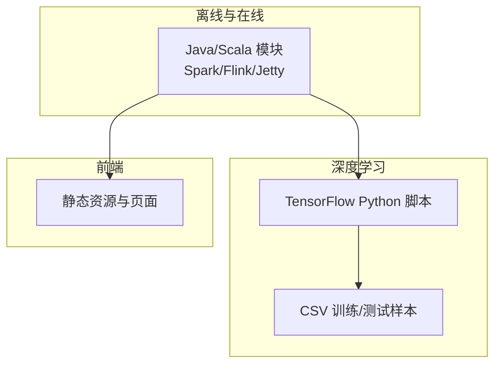
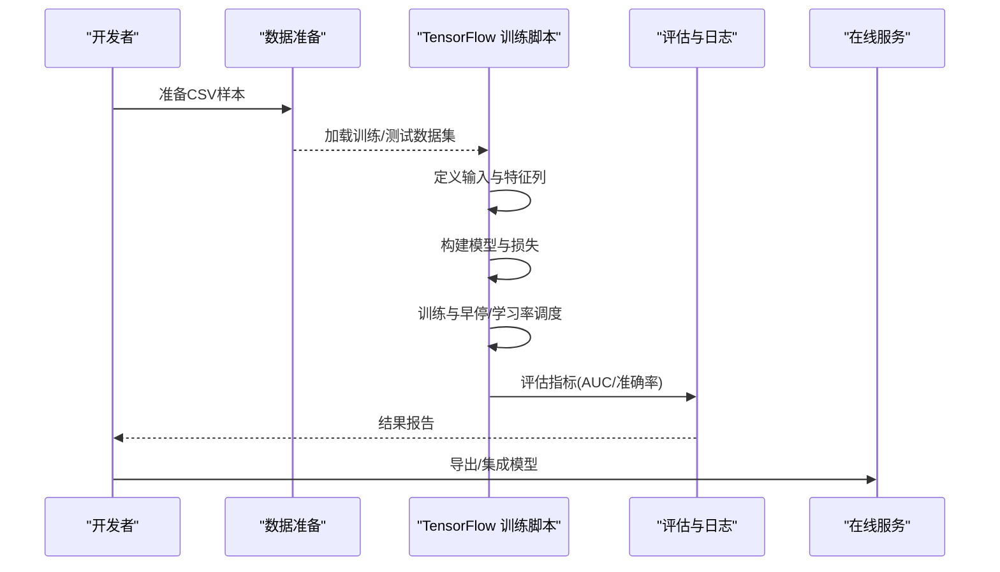
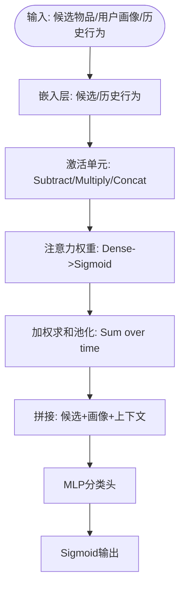
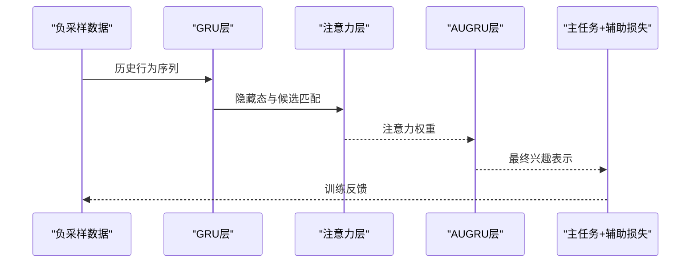
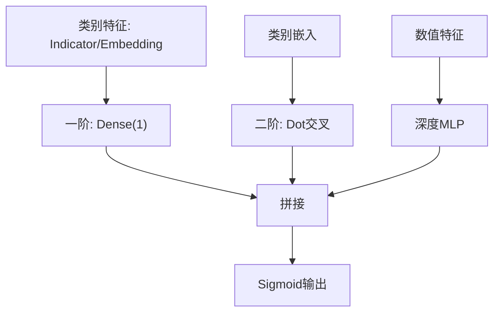
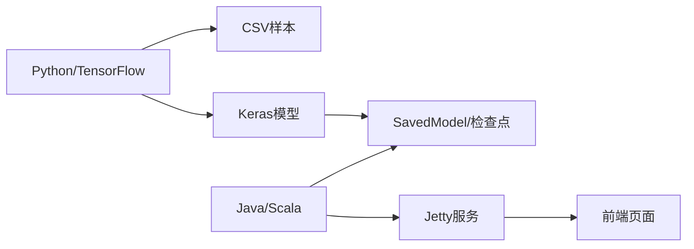

# 深度学习模型

<cite>
**本文引用的文件列表**
- [DIN.py](file://TFRecModel/src/com/sparrowrecsys/offline/tensorflow/DIN.py)
- [DIEN.py](file://TFRecModel/src/com/sparrowrecsys/offline/tensorflow/DIEN.py)
- [DeepFM.py](file://TFRecModel/src/com/sparrowrecsys/offline/tensorflow/DeepFM.py)
- [DeepFM_v2.py](file://TFRecModel/src/com/sparrowrecsys/offline/tensorflow/DeepFM_v2.py)
- [EmbeddingMLP.py](file://TFRecModel/src/com/sparrowrecsys/offline/tensorflow/EmbeddingMLP.py)
- [NeuralCF.py](file://TFRecModel/src/com/sparrowrecsys/offline/tensorflow/NeuralCF.py)
- [WideNDeep.py](file://TFRecModel/src/com/sparrowrecsys/offline/tensorflow/WideNDeep.py)
- [TestModel.py](file://TFRecModel/src/com/sparrowrecsys/offline/tensorflow/TestModel.py)
- [README.md](file://README.md)
- [requirements.txt](file://requirements.txt)
- [pom.xml](file://pom.xml)
- [RecSysServer.java](file://src/main/java/com/sparrowrecsys/online/RecSysServer.java)
- [RecommendationService.java](file://src/main/java/com/sparrowrecsys/online/service/RecommendationService.java)
</cite>

## 目录
1. [简介](#简介)
2. [项目结构](#项目结构)
3. [核心组件](#核心组件)
4. [架构总览](#架构总览)
5. [详细组件分析](#详细组件分析)
6. [依赖关系分析](#依赖关系分析)
7. [性能与训练实践](#性能与训练实践)
8. [故障排查指南](#故障排查指南)
9. [结论](#结论)
10. [附录](#附录)

## 简介
本文件面向开发者与研究者，系统梳理SparrowRecSys项目中的深度学习推荐模型实现，涵盖DIN（深度兴趣网络）、DIEN（深度兴趣演化网络）、DeepFM（因子分解机）、DeepFM变体、Wide&Deep组合模型、NeuralCF（神经协同过滤）与EmbeddingMLP等。文档从架构设计、实现细节、训练流程、评估指标、部署与在线推理等方面展开，并结合项目实际代码路径给出可操作的参数调优建议与最佳实践。

## 项目结构
该项目采用多语言混合架构：Java/Scala负责离线批处理、近线流处理与在线服务；Python/TensorFlow负责深度学习模型训练与评估；前端静态资源通过Jetty提供Web界面。深度学习模型集中在TFRecModel的TensorFlow子模块中，各模型以独立脚本形式呈现，便于快速复现与实验。

图表来源
- [RecSysServer.java](file://src/main/java/com/sparrowrecsys/online/RecSysServer.java#L1-L80)
- [README.md](file://README.md#L1-L57)

章节来源
- [README.md](file://README.md#L1-L57)
- [pom.xml](file://pom.xml#L1-L228)

## 核心组件
本节概述各深度学习模型的核心目标、关键模块与适用场景：
- DIN：引入注意力机制对候选物品与用户历史行为序列进行加权聚合，适合显式建模用户兴趣演化。
- DIEN：在DIN基础上引入GRU注意力更新门（AUGRU）与辅助损失，提升兴趣演化建模与长序列稳定性。
- DeepFM：将FM的一阶与二阶交叉与深度MLP融合，兼顾线性可解释性与非线性表达能力。
- DeepFM_v2：分离类别与数值特征的一阶/二阶处理，采用完全交叉的FM特征，增强交叉表达。
- Wide&Deep：宽侧（交叉特征）与深侧（稠密特征）并行，结合记忆与泛化能力。
- NeuralCF：双塔结构或嵌入+MLP交互，将协同过滤与深度学习结合，适合显式矩阵分解扩展。
- EmbeddingMLP：端到端嵌入+MLP，强调数据管道优化、正则与早停策略，适合作为基线模型。

章节来源
- [DIN.py](file://TFRecModel/src/com/sparrowrecsys/offline/tensorflow/DIN.py#L1-L190)
- [DIEN.py](file://TFRecModel/src/com/sparrowrecsys/offline/tensorflow/DIEN.py#L1-L317)
- [DeepFM.py](file://TFRecModel/src/com/sparrowrecsys/offline/tensorflow/DeepFM.py#L1-L135)
- [DeepFM_v2.py](file://TFRecModel/src/com/sparrowrecsys/offline/tensorflow/DeepFM_v2.py#L1-L178)
- [WideNDeep.py](file://TFRecModel/src/com/sparrowrecsys/offline/tensorflow/WideNDeep.py#L1-L130)
- [NeuralCF.py](file://TFRecModel/src/com/sparrowrecsys/offline/tensorflow/NeuralCF.py#L1-L106)
- [EmbeddingMLP.py](file://TFRecModel/src/com/sparrowrecsys/offline/tensorflow/EmbeddingMLP.py#L1-L154)

## 架构总览
下图展示深度学习模型训练与评估的整体流程，以及与在线服务的衔接思路。

图表来源
- [DIN.py](file://TFRecModel/src/com/sparrowrecsys/offline/tensorflow/DIN.py#L14-L22)
- [DeepFM.py](file://TFRecModel/src/com/sparrowrecsys/offline/tensorflow/DeepFM.py#L14-L22)
- [WideNDeep.py](file://TFRecModel/src/com/sparrowrecsys/offline/tensorflow/WideNDeep.py#L14-L22)
- [NeuralCF.py](file://TFRecModel/src/com/sparrowrecsys/offline/tensorflow/NeuralCF.py#L14-L22)
- [EmbeddingMLP.py](file://TFRecModel/src/com/sparrowrecsys/offline/tensorflow/EmbeddingMLP.py#L14-L28)

## 详细组件分析

### DIN（深度兴趣网络）
- 核心创新点
  - 用户行为序列嵌入与候选物品嵌入拼接，构造激活单元（Subtract/Multiply/Concat）。
  - 注意力权重通过可训练子网络生成，对历史行为进行加权求和池化。
  - 将用户画像、上下文特征与兴趣聚合向量拼接，经MLP输出概率。
- 关键模块
  - 输入定义与特征列：数值特征、类别特征（用户ID、电影ID、用户/电影类型）。
  - 嵌入层与激活单元：候选物品嵌入、历史行为序列嵌入、注意力权重计算。
  - 兴趣聚合：RepeatVector、Permute、Multiply实现注意力加权求和。
  - 分类头：多层前馈与PReLU激活，最终Sigmoid输出。
- 适用场景
  - 需要显式建模用户兴趣随时间演化的点击/评分预测任务。
- 训练流程要点
  - CSV加载、Batch、Epochs设置。
  - 编译：二元交叉熵、Adam优化器、AUC/准确率指标。
  - fit/evaluate/predict用于训练与评估。
- 参数调优建议
  - 嵌入维度与激活单元隐藏层规模；注意力权重的归一化与掩码（mask_zero）。
  - 学习率、Batch大小与序列长度RECENT_MOVIES平衡。

图表来源
- [DIN.py](file://TFRecModel/src/com/sparrowrecsys/offline/tensorflow/DIN.py#L132-L167)

章节来源
- [DIN.py](file://TFRecModel/src/com/sparrowrecsys/offline/tensorflow/DIN.py#L1-L190)

### DIEN（深度兴趣演化网络）
- 核心创新点
  - 在DIN基础上引入GRU演化与注意力更新门（AUGRU），对兴趣状态进行动态更新。
  - 辅助损失：利用负采样历史行为与当前候选的交互，强化序列建模。
- 关键模块
  - 负采样数据管道：随机生成负样本序列，构造训练批次。
  - AUGRU层：按注意力权重更新隐藏状态，输出最终兴趣表示。
  - 注意力层：候选与GRU隐藏态的逐时刻相似度打分。
  - 辅助损失层：对相邻时刻的正/负样本交互进行监督。
- 适用场景
  - 长序列、强时序依赖的点击/转化预测，需要更稳定的兴趣演化建模。
- 训练流程要点
  - 自定义数据生成与Batch；模型输出主任务与辅助损失。
  - 编译优化器；fit/evaluate；打印预测结果。
- 参数调优建议
  - GRU隐藏维度、注意力维度、AUGRU门控参数；辅助损失权重alpha。

图表来源
- [DIEN.py](file://TFRecModel/src/com/sparrowrecsys/offline/tensorflow/DIEN.py#L169-L248)
- [DIEN.py](file://TFRecModel/src/com/sparrowrecsys/offline/tensorflow/DIEN.py#L261-L294)

章节来源
- [DIEN.py](file://TFRecModel/src/com/sparrowrecsys/offline/tensorflow/DIEN.py#L1-L317)

### DeepFM（因子分解机）
- 核心创新点
  - 显式建模类别特征间的二阶交叉（FM二次项），与深度MLP融合，兼顾线性与非线性。
- 关键模块
  - 一阶项：类别特征indicator直接映射；数值特征直接进入深度分支。
  - 二阶项：类别嵌入两两Dot积，体现交叉特征重要性。
  - 深度分支：数值特征经MLP提取高阶非线性关系。
  - 拼接与输出：一阶+二阶+深度拼接，Sigmoid输出。
- 适用场景
  - 特征稀疏但存在强交叉关系的任务，如点击率预测。
- 训练流程要点
  - CSV加载、编译、fit/evaluate/predict。
- 参数调优建议
  - 嵌入维度、MLP层数与宽度、二阶交叉项选择。

图表来源
- [DeepFM.py](file://TFRecModel/src/com/sparrowrecsys/offline/tensorflow/DeepFM.py#L96-L113)

章节来源
- [DeepFM.py](file://TFRecModel/src/com/sparrowrecsys/offline/tensorflow/DeepFM.py#L1-L135)

### DeepFM_v2（改进版DeepFM）
- 核心创新点
  - 分离类别与数值特征的一阶/二阶处理，二阶部分采用完全交叉（Fully Crossed）。
- 关键模块
  - 类别特征一阶：Dense(1)；数值特征一阶：Dense(1)；相加得到一阶特征。
  - 二阶特征：将各类别嵌入与数值特征映射到统一维度，拼接后做平方差交叉。
  - 深度分支：展平后的二阶特征经MLP。
  - 拼接与输出：一阶+二阶+深度拼接，Sigmoid输出。
- 适用场景
  - 更强调交叉特征表达与非线性泛化的场景。
- 训练流程要点
  - 同DeepFM，增加自定义ReduceLayer与交叉特征构造。
- 参数调优建议
  - 交叉维度、MLP深度与Dropout。

章节来源
- [DeepFM_v2.py](file://TFRecModel/src/com/sparrowrecsys/offline/tensorflow/DeepFM_v2.py#L1-L178)

### Wide&Deep（组合模型）
- 核心创新点
  - 宽侧（交叉特征）捕获记忆能力，深侧（稠密特征）提供泛化能力，二者融合。
- 关键模块
  - 深侧：数值+类别嵌入经MLP。
  - 宽侧：类别交叉特征（movie-user历史）indicator。
  - 拼接后分类输出。
- 适用场景
  - 需要兼顾记忆与泛化的推荐/点击预测任务。
- 训练流程要点
  - 定义交叉特征列；构建深侧与宽侧；拼接与输出。
- 参数调优建议
  - 交叉特征桶数、深侧MLP宽度与层数。

章节来源
- [WideNDeep.py](file://TFRecModel/src/com/sparrowrecsys/offline/tensorflow/WideNDeep.py#L1-L130)

### NeuralCF（神经协同过滤）
- 核心创新点
  - 双塔结构或嵌入+MLP交互，将协同过滤思想与深度学习结合。
- 关键模块
  - 两种架构：双塔仅嵌入后拼接MLP；或双塔先MLP再Dot。
  - Dot输出经Sigmoid，模拟评分/点击概率。
- 适用场景
  - 显式矩阵分解的深度扩展，适合评分/偏好预测。
- 训练流程要点
  - CSV加载、编译、fit/evaluate/predict；保存模型。
- 参数调优建议
  - 嵌入维度、MLP隐藏单元数量与激活函数。

章节来源
- [NeuralCF.py](file://TFRecModel/src/com/sparrowrecsys/offline/tensorflow/NeuralCF.py#L1-L106)

### EmbeddingMLP（端到端嵌入+MLP）
- 核心创新点
  - 端到端数据管道优化（shuffle/cache/prefetch）、数值特征归一化、金字塔式MLP、L2正则与BatchNorm、标签平滑、早停与学习率调度。
- 关键模块
  - 数据管道：CSV加载、打散、缓存、异步预取。
  - 特征工程：类别特征嵌入维度优化；数值特征log变换与标准化。
  - 模型：BatchNorm、Dropout、L2正则的金字塔MLP。
  - 训练：BinaryCrossentropy（带标签平滑）、早停、学习率调度。
- 适用场景
  - 作为基线模型快速验证特征工程与训练策略的有效性。
- 训练流程要点
  - 数据管道优化；模型编译与回调；fit/evaluate/predict。
- 参数调优建议
  - 嵌入维度、MLP宽度与深度、正则强度、Dropout比率、学习率与早停patience。

章节来源
- [EmbeddingMLP.py](file://TFRecModel/src/com/sparrowrecsys/offline/tensorflow/EmbeddingMLP.py#L1-L154)

## 依赖关系分析
- 运行环境
  - Python 3.6+，TensorFlow 2.x，PySpark 3.5.0（离线特征工程）。
  - Maven管理的Java/Scala模块，包含Spark/Flink/Jetty等依赖。
- 模型依赖
  - 各模型脚本均依赖tf.data加载CSV、tf.feature_column定义特征列、Keras构建模型与训练。
- 在线服务依赖
  - Jetty提供HTTP服务，绑定多个Servlet处理电影、用户、相似电影与推荐请求。

图表来源
- [requirements.txt](file://requirements.txt#L1-L4)
- [pom.xml](file://pom.xml#L60-L227)
- [RecSysServer.java](file://src/main/java/com/sparrowrecsys/online/RecSysServer.java#L56-L70)

章节来源
- [requirements.txt](file://requirements.txt#L1-L4)
- [pom.xml](file://pom.xml#L1-L228)
- [RecSysServer.java](file://src/main/java/com/sparrowrecsys/online/RecSysServer.java#L1-L80)

## 性能与训练实践
- 数据管道优化（EmbeddingMLP）
  - shuffle、cache、prefetch提升吞吐与稳定性。
  - 数值特征归一化与log变换改善收敛。
- 正则与正向技巧
  - L2正则、BatchNorm、Dropout降低过拟合风险。
  - 标签平滑缓解过自信倾向。
- 训练策略
  - 早停监控验证集loss，学习率调度自适应调整。
- 模型评估
  - AUC（ROC/PR）与准确率作为主要指标，结合预测概率可视化。

章节来源
- [EmbeddingMLP.py](file://TFRecModel/src/com/sparrowrecsys/offline/tensorflow/EmbeddingMLP.py#L13-L28)
- [EmbeddingMLP.py](file://TFRecModel/src/com/sparrowrecsys/offline/tensorflow/EmbeddingMLP.py#L70-L85)
- [EmbeddingMLP.py](file://TFRecModel/src/com/sparrowrecsys/offline/tensorflow/EmbeddingMLP.py#L112-L141)

## 故障排查指南
- 数据路径与权限
  - 训练/测试CSV路径需正确且可访问；若路径错误，导致数据加载失败。
- 版本兼容
  - TensorFlow版本与依赖库版本需匹配；EmbeddingMLP中使用了特定优化器与回调API，请确保版本支持。
- 模型保存与加载
  - 保存路径需存在且有写权限；加载时注意签名与格式一致性。
- 在线服务端口与资源
  - 默认端口6010，可通过环境变量PORT覆盖；静态资源路径需正确映射。

章节来源
- [NeuralCF.py](file://TFRecModel/src/com/sparrowrecsys/offline/tensorflow/NeuralCF.py#L97-L105)
- [RecSysServer.java](file://src/main/java/com/sparrowrecsys/online/RecSysServer.java#L24-L35)
- [RecommendationService.java](file://src/main/java/com/sparrowrecsys/online/service/RecommendationService.java#L18-L46)

## 结论
SparrowRecSys提供了从数据到模型再到在线服务的完整链路，深度学习模型脚本清晰展示了主流推荐算法的实现要点。开发者可基于这些脚本快速搭建与调优模型，结合EmbeddingMLP的最佳实践与Wide&Deep的组合策略，构建稳健的推荐系统。

## 附录
- 快速开始
  - 启动在线服务：在IDE中运行RecSysServer，访问本地Web页面。
  - 运行模型脚本：在Python环境中执行各模型脚本完成训练与评估。
- 参考资料
  - README中列出的论文与课程链接，有助于深入理解模型背景与实现细节。

章节来源
- [README.md](file://README.md#L13-L17)
- [RecSysServer.java](file://src/main/java/com/sparrowrecsys/online/RecSysServer.java#L18-L22)