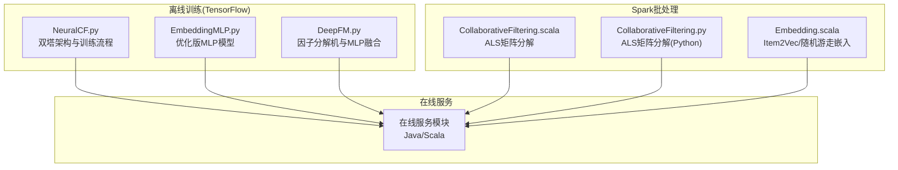
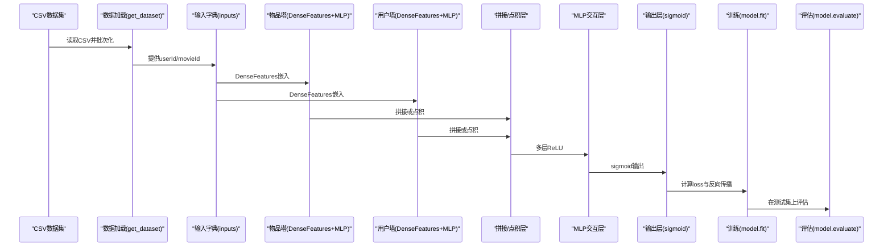
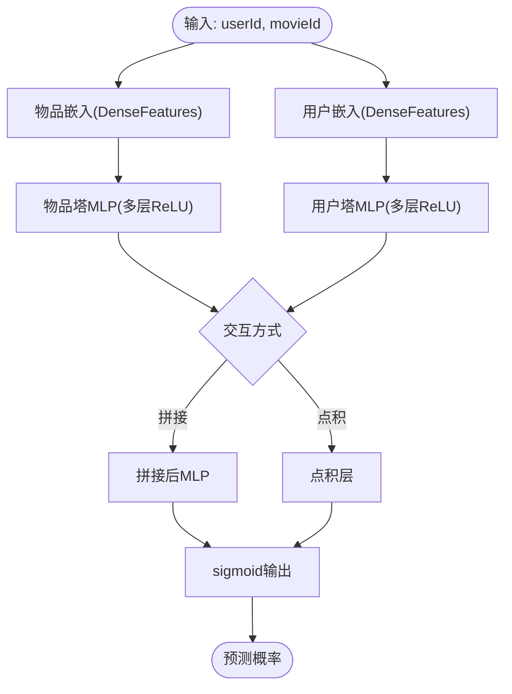
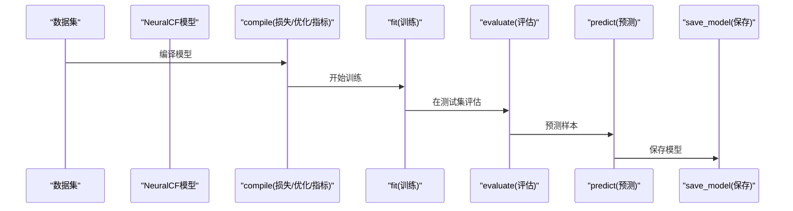
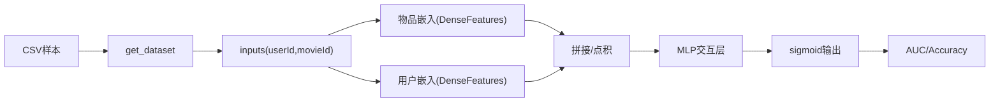

# 神经协同过滤

<cite>
**本文引用的文件**
- [NeuralCF.py](file://TFRecModel/src/com/sparrowrecsys/offline/tensorflow/NeuralCF.py)
- [EmbeddingMLP.py](file://TFRecModel/src/com/sparrowrecsys/offline/tensorflow/EmbeddingMLP.py)
- [DeepFM.py](file://TFRecModel/src/com/sparrowrecsys/offline/tensorflow/DeepFM.py)
- [CollaborativeFiltering.scala](file://src/main/java/com/sparrowrecsys/offline/spark/model/CollaborativeFiltering.scala)
- [CollaborativeFiltering.py](file://RecPySpark/src/com/sparrowrecsys/offline/pyspark/model/CollaborativeFiltering.py)
- [Embedding.scala](file://src/main/java/com/sparrowrecsys/offline/spark/embedding/Embedding.scala)
- [README.md](file://README.md)
</cite>

## 目录
1. [简介](#简介)
2. [项目结构](#项目结构)
3. [核心组件](#核心组件)
4. [架构总览](#架构总览)
5. [详细组件分析](#详细组件分析)
6. [依赖关系分析](#依赖关系分析)
7. [性能考量](#性能考量)
8. [故障排查指南](#故障排查指南)
9. [结论](#结论)
10. [附录](#附录)

## 简介
本技术文档围绕神经协同过滤（NeuralCF）模型展开，系统阐述其如何将传统的矩阵分解思想与深度神经网络结合，以实现更强大的用户-物品交互建模。文档重点涵盖：
- 双塔架构：用户嵌入路径与物品嵌入路径的设计原理与实现差异
- 非线性变换层：通过MLP学习用户偏好与物品特征之间的复杂关系
- 完整实现解析：嵌入维度、激活函数、正则化、损失函数、优化器与收敛控制
- 训练流程：数据加载、编译、训练、评估与预测
- 相比传统协同过滤的优势：对稀疏数据与隐式反馈的建模能力
- 性能评估方法与部署建议

## 项目结构
该仓库为混合语言的推荐系统工程，包含离线训练（TensorFlow）、Spark批处理与ALS、在线服务等模块。与NeuralCF直接相关的实现位于TensorFlow离线训练目录与Spark协同过滤实现。

图表来源
- [NeuralCF.py](file://TFRecModel/src/com/sparrowrecsys/offline/tensorflow/NeuralCF.py#L1-L106)
- [EmbeddingMLP.py](file://TFRecModel/src/com/sparrowrecsys/offline/tensorflow/EmbeddingMLP.py#L1-L154)
- [DeepFM.py](file://TFRecModel/src/com/sparrowrecsys/offline/tensorflow/DeepFM.py#L1-L135)
- [CollaborativeFiltering.scala](file://src/main/java/com/sparrowrecsys/offline/spark/model/CollaborativeFiltering.scala#L1-L85)
- [CollaborativeFiltering.py](file://RecPySpark/src/com/sparrowrecsys/offline/pyspark/model/CollaborativeFiltering.py#L1-L51)
- [Embedding.scala](file://src/main/java/com/sparrowrecsys/offline/spark/embedding/Embedding.scala#L1-L287)

章节来源
- [README.md](file://README.md#L1-L57)

## 核心组件
- 双塔NeuralCF模型：提供两种架构变体，分别强调拼接后MLP交互或两塔各自MLP后再做点积的组合方式
- 特征工程与嵌入：使用tf.feature_column定义类别与数值特征，构建用户/物品ID嵌入
- 训练与评估：二元交叉熵损失、Adam优化器、准确率与AUC指标；支持保存模型
- 优化策略：在EmbeddingMLP中引入数据管道优化、数值特征归一化、BatchNorm、Dropout、L2正则、标签平滑、早停与学习率调度

章节来源
- [NeuralCF.py](file://TFRecModel/src/com/sparrowrecsys/offline/tensorflow/NeuralCF.py#L37-L105)
- [EmbeddingMLP.py](file://TFRecModel/src/com/sparrowrecsys/offline/tensorflow/EmbeddingMLP.py#L13-L154)

## 架构总览
下图展示NeuralCF双塔架构与训练流程的关键节点与数据流。

图表来源
- [NeuralCF.py](file://TFRecModel/src/com/sparrowrecsys/offline/tensorflow/NeuralCF.py#L14-L87)

## 详细组件分析

### 双塔架构与交互层设计
- 架构变体一（拼接+MLP）：物品与用户分别通过DenseFeatures得到嵌入，随后拼接进入多层ReLU的MLP，最后sigmoid输出
- 架构变体二（两塔+点积）：两塔各自先经过MLP，再对向量做点积，最后sigmoid输出
- 设计要点：双塔共享输入但独立学习各自的表征，交互层可灵活选择拼接或内积，便于探索不同偏好-特征关系

图表来源
- [NeuralCF.py](file://TFRecModel/src/com/sparrowrecsys/offline/tensorflow/NeuralCF.py#L44-L70)

章节来源
- [NeuralCF.py](file://TFRecModel/src/com/sparrowrecsys/offline/tensorflow/NeuralCF.py#L44-L70)

### 特征工程与嵌入维度
- 类别特征：使用categorical_column_with_identity定义用户ID与物品ID的嵌入，num_buckets与embedding维度分别为1001与30001，嵌入维度分别为10与10
- 输入定义：通过Input层接收userId与movieId，dtype为int32，shape为标量
- 优化参考：EmbeddingMLP中对类别特征采用更细粒度的词表与更大嵌入维度（如电影类型19类→8维，movieId→16维，userId→32维）

章节来源
- [NeuralCF.py](file://TFRecModel/src/com/sparrowrecsys/offline/tensorflow/NeuralCF.py#L29-L41)
- [EmbeddingMLP.py](file://TFRecModel/src/com/sparrowrecsys/offline/tensorflow/EmbeddingMLP.py#L40-L68)

### 非线性变换层与激活函数
- 激活函数：ReLU用于隐藏层，sigmoid用于输出层
- 层数与宽度：示例中使用两层隐藏层，每层10个节点；EmbeddingMLP采用更深的金字塔结构（256→128→64）
- 归一化与正则：BatchNormalization与Dropout减少过拟合并稳定训练；L2正则抑制权重增长

章节来源
- [NeuralCF.py](file://TFRecModel/src/com/sparrowrecsys/offline/tensorflow/NeuralCF.py#L49-L50)
- [EmbeddingMLP.py](file://TFRecModel/src/com/sparrowrecsys/offline/tensorflow/EmbeddingMLP.py#L88-L110)

### 损失函数、优化器与收敛控制
- 损失函数：二元交叉熵（binary_crossentropy）
- 优化器：Adam（默认超参）
- 指标：准确率、ROC-AUC、PR-AUC
- 收敛控制：EmbeddingMLP中使用早停（monitor验证集loss）与学习率调度（monitor验证集loss），并采用标签平滑降低过拟合风险

章节来源
- [NeuralCF.py](file://TFRecModel/src/com/sparrowrecsys/offline/tensorflow/NeuralCF.py#L76-L80)
- [EmbeddingMLP.py](file://TFRecModel/src/com/sparrowrecsys/offline/tensorflow/EmbeddingMLP.py#L113-L132)

### 训练与评估流程
- 数据加载：使用make_csv_dataset读取CSV，batch_size、label_name、忽略错误等参数配置
- 训练：fit执行epochs轮次；EmbeddingMLP中使用validation_data与回调
- 评估：evaluate返回loss与指标；predict输出概率
- 模型保存：save_model保存完整模型与优化器状态

图表来源
- [NeuralCF.py](file://TFRecModel/src/com/sparrowrecsys/offline/tensorflow/NeuralCF.py#L76-L105)

章节来源
- [NeuralCF.py](file://TFRecModel/src/com/sparrowrecsys/offline/tensorflow/NeuralCF.py#L14-L105)

### 与传统协同过滤的对比与优势
- 传统ALS（Spark）：基于矩阵分解，适合显式评分的回归任务，RMSE作为评估指标
- NeuralCF：面向二分类/隐式偏好，通过嵌入与MLP学习非线性交互，更适合稀疏场景与复杂特征组合
- 实践建议：在有显式评分时可先用ALS做基线；在隐式反馈或需要复杂特征交互时，优先考虑NeuralCF

章节来源
- [CollaborativeFiltering.scala](file://src/main/java/com/sparrowrecsys/offline/spark/model/CollaborativeFiltering.scala#L29-L52)
- [CollaborativeFiltering.py](file://RecPySpark/src/com/sparrowrecsys/offline/pyspark/model/CollaborativeFiltering.py#L20-L31)

### 相关模型与扩展
- DeepFM：FM的一阶项与二阶交叉，结合MLP进行广义特征交互，与NeuralCF的点积思路类似但更强调因子分解
- EmbeddingMLP：在NeuralCF基础上引入更多特征与优化策略，适合作为对比与迁移的基础模型

章节来源
- [DeepFM.py](file://TFRecModel/src/com/sparrowrecsys/offline/tensorflow/DeepFM.py#L96-L115)
- [EmbeddingMLP.py](file://TFRecModel/src/com/sparrowrecsys/offline/tensorflow/EmbeddingMLP.py#L87-L110)

## 依赖关系分析
- 数据依赖：CSV样本文件路径通过Keras工具下载至本地，确保训练与评估数据可用
- 特征依赖：userId与movieId作为输入，类别特征映射到嵌入空间
- 模型依赖：双塔架构相互独立，交互层可替换为拼接或点积
- 评估依赖：AUC（ROC/PR）与准确率共同衡量模型判别能力

图表来源
- [NeuralCF.py](file://TFRecModel/src/com/sparrowrecsys/offline/tensorflow/NeuralCF.py#L14-L87)

章节来源
- [NeuralCF.py](file://TFRecModel/src/com/sparrowrecsys/offline/tensorflow/NeuralCF.py#L14-L87)

## 性能考量
- 数据管道优化：打乱、缓存、异步预取，提升吞吐与稳定性
- 特征工程：数值特征归一化（log变换、标准化），类别特征嵌入维度调优
- 正则化与归一化：BatchNorm、Dropout、L2正则，降低过拟合风险
- 收敛控制：早停与学习率调度，基于验证集指标动态调整
- 指标选择：AUC（ROC/PR）与准确率综合评估模型性能

章节来源
- [EmbeddingMLP.py](file://TFRecModel/src/com/sparrowrecsys/offline/tensorflow/EmbeddingMLP.py#L13-L28)
- [EmbeddingMLP.py](file://TFRecModel/src/com/sparrowrecsys/offline/tensorflow/EmbeddingMLP.py#L70-L85)
- [EmbeddingMLP.py](file://TFRecModel/src/com/sparrowrecsys/offline/tensorflow/EmbeddingMLP.py#L113-L132)

## 故障排查指南
- 数据路径问题：确认CSV样本路径正确且可访问
- 嵌入维度不匹配：检查num_buckets与embedding维度是否一致
- 指标异常：若出现NaN，检查标签分布与AUC计算条件
- 过拟合：增加Dropout、L2正则，启用早停与学习率调度
- 内存不足：减小batch_size或关闭不必要的缓存

章节来源
- [NeuralCF.py](file://TFRecModel/src/com/sparrowrecsys/offline/tensorflow/NeuralCF.py#L4-L10)
- [EmbeddingMLP.py](file://TFRecModel/src/com/sparrowrecsys/offline/tensorflow/EmbeddingMLP.py#L113-L132)

## 结论
NeuralCF通过双塔嵌入与非线性交互层，有效提升了对用户-物品交互的建模能力，尤其适用于稀疏与隐式反馈场景。结合EmbeddingMLP中的多项优化策略，可在训练稳定性、泛化能力与评估指标上取得显著提升。在实际部署中，建议结合业务数据规模与延迟要求，选择合适的嵌入维度、网络深度与正则强度，并持续监控AUC与准确率变化以指导迭代。

## 附录
- 数据来源：MovieLens精简数据集，支持快速原型开发与教学演示
- 在线服务：前端页面与推荐服务集成，便于端到端验证模型效果

章节来源
- [README.md](file://README.md#L16-L17)