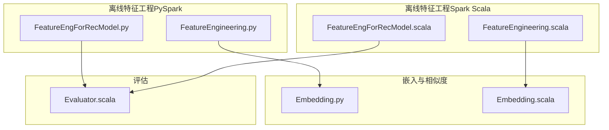
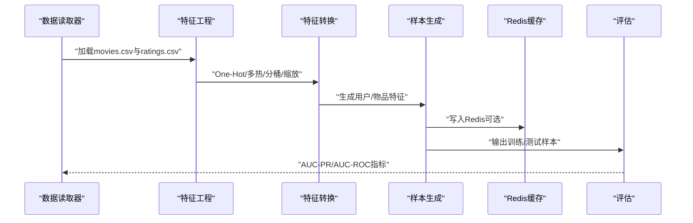
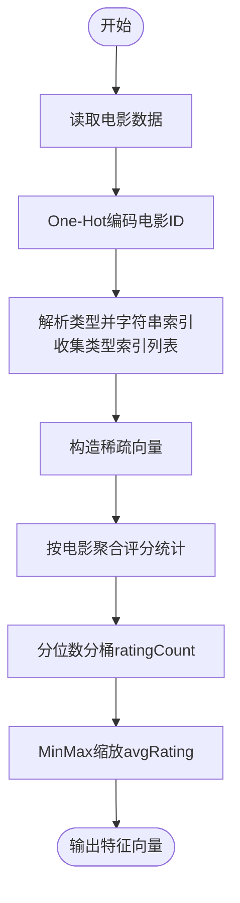
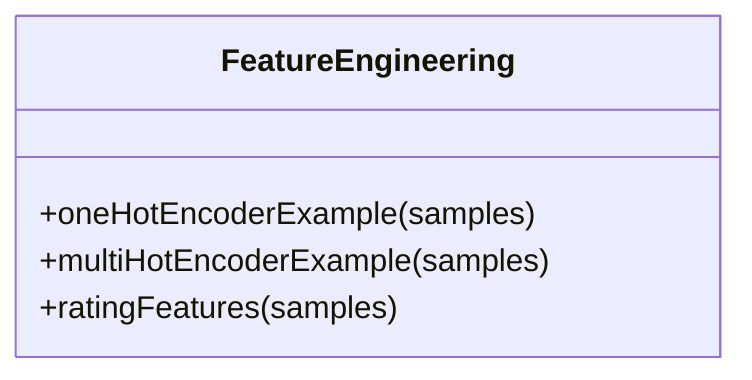
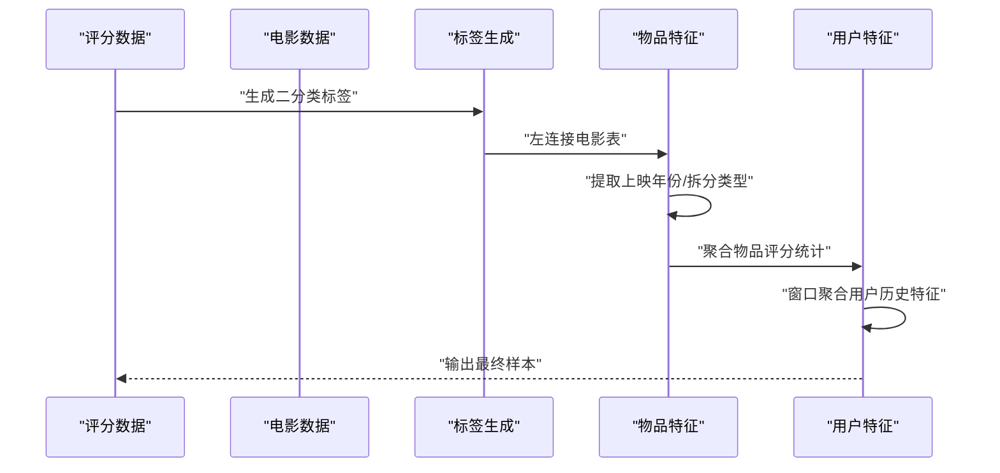
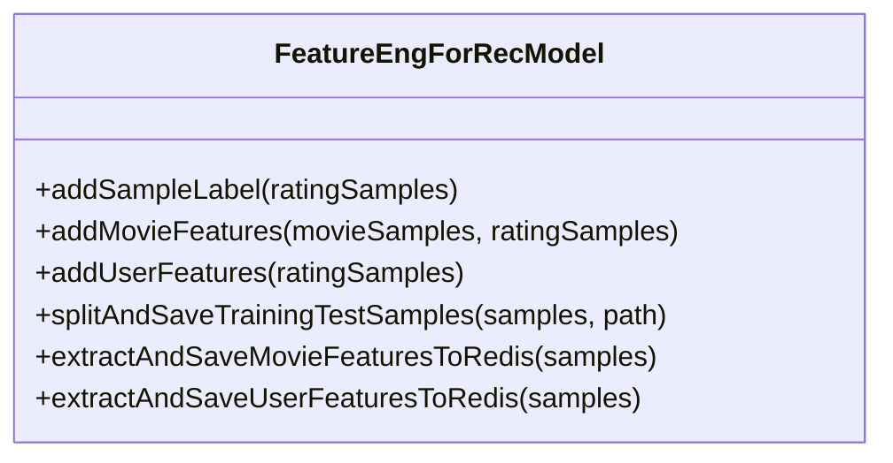
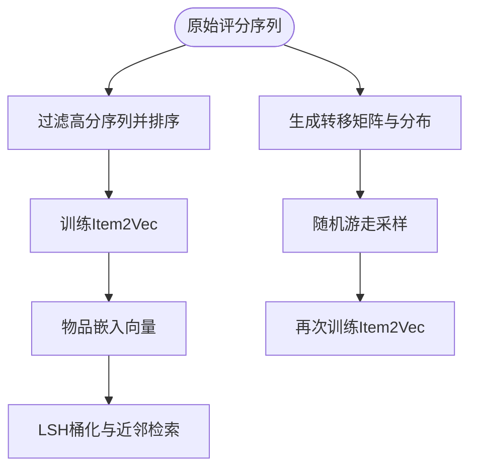
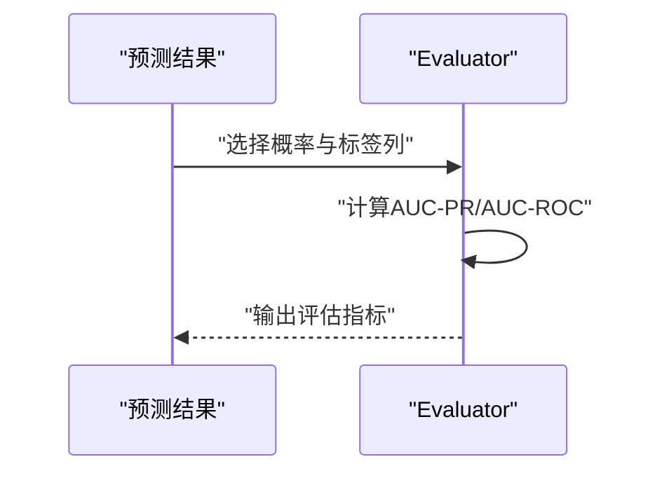
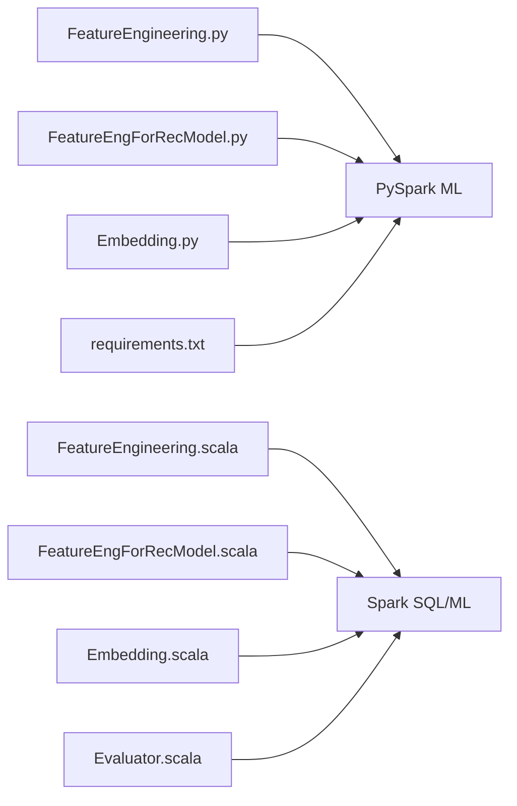

# 特征工程

<cite>
**本文引用的文件**
- [FeatureEngineering.py](file://RecPySpark/src/com/sparrowrecsys/offline/pyspark/featureeng/FeatureEngineering.py)
- [FeatureEngForRecModel.py](file://RecPySpark/src/com/sparrowrecsys/offline/pyspark/featureeng/FeatureEngForRecModel.py)
- [FeatureEngineering.scala](file://src/main/java/com/sparrowrecsys/offline/spark/featureeng/FeatureEngineering.scala)
- [FeatureEngForRecModel.scala](file://src/main/java/com/sparrowrecsys/offline/spark/featureeng/FeatureEngForRecModel.scala)
- [Embedding.py](file://RecPySpark/src/com/sparrowrecsys/offline/pyspark/embedding/Embedding.py)
- [Embedding.scala](file://src/main/java/com/sparrowrecsys/offline/spark/embedding/Embedding.scala)
- [Evaluator.scala](file://src/main/java/com/sparrowrecsys/offline/spark/evaluate/Evaluator.scala)
- [README.md](file://README.md)
- [requirements.txt](file://requirements.txt)
</cite>

## 目录
1. [引言](#引言)
2. [项目结构](#项目结构)
3. [核心组件](#核心组件)
4. [架构总览](#架构总览)
5. [详细组件分析](#详细组件分析)
6. [依赖关系分析](#依赖关系分析)
7. [性能考量](#性能考量)
8. [故障排查指南](#故障排查指南)
9. [结论](#结论)
10. [附录](#附录)

## 引言
本文件围绕SparrowRecSys的特征工程模块，系统阐述推荐系统中特征工程的重要性与实现方法。内容涵盖：
- 预处理：缺失值处理、异常值检测、特征缩放等基础步骤
- 分类特征：多热编码（One-Hot Encoding）与稀疏多热编码（Multi-Hot Encoding）
- 数值特征：标准化、归一化、分桶（Bucketing）
- 特征交叉与组合：窗口聚合、历史序列、类别统计等
- Scala与Python实现对比与性能特点
- 完整特征工程流水线：数据读取、特征转换、特征选择与保存
- 最佳实践与常见问题排查

## 项目结构
SparrowRecSys采用混合语言架构，特征工程模块主要分布在以下位置：
- PySpark实现：离线特征工程与样本生成
- Spark Scala实现：离线特征工程与在线特征缓存
- 嵌入模块：Item2Vec、随机游走、LSH近似最近邻
- 评估模块：二分类指标评估

图表来源
- [FeatureEngineering.py](file://RecPySpark/src/com/sparrowrecsys/offline/pyspark/featureeng/FeatureEngineering.py#L1-L77)
- [FeatureEngForRecModel.py](file://RecPySpark/src/com/sparrowrecsys/offline/pyspark/featureeng/FeatureEngForRecModel.py#L1-L156)
- [FeatureEngineering.scala](file://src/main/java/com/sparrowrecsys/offline/spark/featureeng/FeatureEngineering.scala#L1-L120)
- [FeatureEngForRecModel.scala](file://src/main/java/com/sparrowrecsys/offline/spark/featureeng/FeatureEngForRecModel.scala#L1-L293)
- [Embedding.py](file://RecPySpark/src/com/sparrowrecsys/offline/pyspark/embedding/Embedding.py#L1-L202)
- [Embedding.scala](file://src/main/java/com/sparrowrecsys/offline/spark/embedding/Embedding.scala#L1-L287)
- [Evaluator.scala](file://src/main/java/com/sparrowrecsys/offline/spark/evaluate/Evaluator.scala#L1-L21)

章节来源
- [README.md](file://README.md#L1-L57)

## 核心组件
- PySpark特征工程：提供One-Hot编码、多热编码、数值特征分桶与缩放、评分统计特征等示例。
- Spark Scala特征工程：与PySpark对应的功能实现，支持窗口聚合、用户/物品特征抽取、Redis缓存导出。
- 嵌入模块：Item2Vec词向量训练、随机游走生成序列、LSH近似最近邻检索。
- 评估模块：基于概率向量计算AUC-PR与AUC-ROC。

章节来源
- [FeatureEngineering.py](file://RecPySpark/src/com/sparrowrecsys/offline/pyspark/featureeng/FeatureEngineering.py#L11-L76)
- [FeatureEngineering.scala](file://src/main/java/com/sparrowrecsys/offline/spark/featureeng/FeatureEngineering.scala#L16-L90)
- [FeatureEngForRecModel.py](file://RecPySpark/src/com/sparrowrecsys/offline/pyspark/featureeng/FeatureEngForRecModel.py#L12-L156)
- [FeatureEngForRecModel.scala](file://src/main/java/com/sparrowrecsys/offline/spark/featureeng/FeatureEngForRecModel.scala#L21-L293)
- [Embedding.py](file://RecPySpark/src/com/sparrowrecsys/offline/pyspark/embedding/Embedding.py#L67-L81)
- [Embedding.scala](file://src/main/java/com/sparrowrecsys/offline/spark/embedding/Embedding.scala#L103-L138)
- [Evaluator.scala](file://src/main/java/com/sparrowrecsys/offline/spark/evaluate/Evaluator.scala#L7-L20)

## 架构总览
特征工程在SparrowRecSys中的角色：
- 数据准备：从CSV读取电影与评分数据
- 特征提取：分类特征（电影ID、类型）、数值特征（评分均值、方差、计数）、窗口统计（用户/物品历史）
- 特征转换：One-Hot、多热、分桶、缩放
- 样本生成：构造正负样本标签，划分训练/测试集
- 在线缓存：将最终特征写入Redis供线上服务使用
- 模型评估：使用二分类指标评估预测性能

图表来源
- [FeatureEngForRecModel.py](file://RecPySpark/src/com/sparrowrecsys/offline/pyspark/featureeng/FeatureEngForRecModel.py#L116-L156)
- [FeatureEngForRecModel.scala](file://src/main/java/com/sparrowrecsys/offline/spark/featureeng/FeatureEngForRecModel.scala#L176-L205)
- [Evaluator.scala](file://src/main/java/com/sparrowrecsys/offline/spark/evaluate/Evaluator.scala#L7-L20)

## 详细组件分析

### PySpark特征工程（FeatureEngineering.py）
- One-Hot编码示例：对电影ID进行整数转换后使用One-Hot编码，输出向量列。
- 多热编码示例：对电影类型字段进行字符串索引，收集类型索引列表，构造稀疏向量。
- 数值特征处理：按电影聚合评分统计（计数、均值、方差），使用分位数分桶与MinMax缩放，形成可训练向量。

图表来源
- [FeatureEngineering.py](file://RecPySpark/src/com/sparrowrecsys/offline/pyspark/featureeng/FeatureEngineering.py#L11-L76)

章节来源
- [FeatureEngineering.py](file://RecPySpark/src/com/sparrowrecsys/offline/pyspark/featureeng/FeatureEngineering.py#L11-L76)

### Spark Scala特征工程（FeatureEngineering.scala）
- One-Hot编码与多热编码：与PySpark版本对应，使用StringIndexer与UDF构造稀疏向量。
- 数值特征：聚合评分统计，分桶与缩放，输出向量列。

图表来源
- [FeatureEngineering.scala](file://src/main/java/com/sparrowrecsys/offline/spark/featureeng/FeatureEngineering.scala#L16-L90)

章节来源
- [FeatureEngineering.scala](file://src/main/java/com/sparrowrecsys/offline/spark/featureeng/FeatureEngineering.scala#L16-L90)

### 标签生成与特征组合（PySpark）
- 标签生成：根据评分阈值生成二分类标签。
- 物品特征：连接电影表，提取上映年份、拆分类型字段，聚合评分统计。
- 用户特征：基于滑动窗口聚合用户历史评分、观看序列、类型偏好Top-N等。

图表来源
- [FeatureEngForRecModel.py](file://RecPySpark/src/com/sparrowrecsys/offline/pyspark/featureeng/FeatureEngForRecModel.py#L12-L113)

章节来源
- [FeatureEngForRecModel.py](file://RecPySpark/src/com/sparrowrecsys/offline/pyspark/featureeng/FeatureEngForRecModel.py#L12-L113)

### 标签生成与特征组合（Spark Scala）
- 标签生成：同PySpark版本。
- 物品特征：连接电影表，提取上映年份与标题，拆分类型字段，聚合评分统计。
- 用户特征：使用窗口函数计算用户历史评分、观看序列、类型偏好Top-N等。
- Redis缓存：将最新用户/物品特征写入Redis，设置TTL。

图表来源
- [FeatureEngForRecModel.scala](file://src/main/java/com/sparrowrecsys/offline/spark/featureeng/FeatureEngForRecModel.scala#L21-L293)

章节来源
- [FeatureEngForRecModel.scala](file://src/main/java/com/sparrowrecsys/offline/spark/featureeng/FeatureEngForRecModel.scala#L21-L293)

### 嵌入与相似度（Item2Vec、随机游走、LSH）
- Item2Vec：对用户观看序列进行词向量训练，生成物品嵌入。
- 随机游走：从转移矩阵与分布采样生成新序列，再训练Item2Vec。
- LSH：对嵌入向量进行桶化，近似检索邻居。

图表来源
- [Embedding.py](file://RecPySpark/src/com/sparrowrecsys/offline/pyspark/embedding/Embedding.py#L33-L81)
- [Embedding.scala](file://src/main/java/com/sparrowrecsys/offline/spark/embedding/Embedding.scala#L27-L138)

章节来源
- [Embedding.py](file://RecPySpark/src/com/sparrowrecsys/offline/pyspark/embedding/Embedding.py#L33-L81)
- [Embedding.scala](file://src/main/java/com/sparrowrecsys/offline/spark/embedding/Embedding.scala#L27-L138)

### 评估（二分类指标）
- 使用预测概率向量计算AUC-PR与AUC-ROC，用于模型评估。

图表来源
- [Evaluator.scala](file://src/main/java/com/sparrowrecsys/offline/spark/evaluate/Evaluator.scala#L7-L20)

章节来源
- [Evaluator.scala](file://src/main/java/com/sparrowrecsys/offline/spark/evaluate/Evaluator.scala#L7-L20)

## 依赖关系分析
- PySpark依赖：pyspark、tensorflow（用于GPU测试）、psutil
- Spark依赖：Spark SQL、MLlib、ML Pipeline、窗口函数、UDF
- 嵌入依赖：Word2Vec、LSH、Redis客户端
- 评估依赖：BinaryClassificationMetrics

图表来源
- [requirements.txt](file://requirements.txt#L1-L4)
- [FeatureEngineering.py](file://RecPySpark/src/com/sparrowrecsys/offline/pyspark/featureeng/FeatureEngineering.py#L1-L8)
- [FeatureEngForRecModel.py](file://RecPySpark/src/com/sparrowrecsys/offline/pyspark/featureeng/FeatureEngForRecModel.py#L1-L7)
- [FeatureEngineering.scala](file://src/main/java/com/sparrowrecsys/offline/spark/featureeng/FeatureEngineering.scala#L1-L9)
- [FeatureEngForRecModel.scala](file://src/main/java/com/sparrowrecsys/offline/spark/featureeng/FeatureEngForRecModel.scala#L1-L8)
- [Embedding.py](file://RecPySpark/src/com/sparrowrecsys/offline/pyspark/embedding/Embedding.py#L1-L12)
- [Embedding.scala](file://src/main/java/com/sparrowrecsys/offline/spark/embedding/Embedding.scala#L1-L15)
- [Evaluator.scala](file://src/main/java/com/sparrowrecsys/offline/spark/evaluate/Evaluator.scala#L1-L6)

章节来源
- [requirements.txt](file://requirements.txt#L1-L4)

## 性能考量
- 并行与分区：使用repartition控制输出分区数量，避免单文件过大；使用approxQuantile进行时间戳切分，保证时序稳定性。
- 内存与持久化：窗口聚合与groupBy操作可能产生大量中间数据，建议在生产环境合理设置执行参数与内存配置。
- 缓存策略：将最终特征写入Redis，设置合适TTL，减少线上查询延迟。
- GPU支持：通过TensorFlow测试脚本验证GPU可用性，便于后续深度学习模型训练加速。

章节来源
- [FeatureEngForRecModel.py](file://RecPySpark/src/com/sparrowrecsys/offline/pyspark/featureeng/FeatureEngForRecModel.py#L116-L138)
- [FeatureEngForRecModel.scala](file://src/main/java/com/sparrowrecsys/offline/spark/featureeng/FeatureEngForRecModel.scala#L176-L205)
- [test_gpu.py](file://RecPySpark/test/test_gpu.py#L1-L10)

## 故障排查指南
- 缺失值与异常值
  - 分类特征：字符串索引前确保类型正确，必要时进行清洗或填充默认值。
  - 数值特征：聚合统计时注意空值处理，使用fillna或过滤策略。
- 分桶与缩放
  - 分桶需确保输入列非常量；缩放前确保向量维度一致。
- 窗口聚合
  - 窗口大小与排序列需明确，避免历史窗口越界或数据错配。
- Redis写入
  - 检查Redis连接端口与TTL设置，确认键前缀与字段映射正确。
- 评估指标
  - 确保概率向量第二维为正样本概率，标签为0/1整数。

章节来源
- [FeatureEngForRecModel.py](file://RecPySpark/src/com/sparrowrecsys/offline/pyspark/featureeng/FeatureEngForRecModel.py#L44-L50)
- [FeatureEngForRecModel.scala](file://src/main/java/com/sparrowrecsys/offline/spark/featureeng/FeatureEngForRecModel.scala#L58-L63)
- [Evaluator.scala](file://src/main/java/com/sparrowrecsys/offline/spark/evaluate/Evaluator.scala#L7-L20)

## 结论
SparrowRecSys的特征工程模块通过PySpark与Spark Scala双实现，覆盖了推荐系统中从数据读取、特征提取、转换、组合到样本生成与评估的完整流水线。分类特征的One-Hot与多热编码、数值特征的分桶与缩放、窗口聚合与历史序列特征，共同构成了高质量特征集的基础。结合嵌入与相似度检索，进一步提升了模型表达能力。建议在生产环境中关注数据质量、内存与分区策略、缓存与评估流程的稳定性与性能。

## 附录

### 完整特征工程流水线（步骤说明）
- 数据读取：加载movies.csv与ratings.csv
- 标签生成：按评分阈值生成二分类标签
- 物品特征：连接电影表，提取上映年份、拆分类型，聚合评分统计
- 用户特征：滑动窗口聚合用户历史评分、观看序列、类型偏好Top-N
- 特征转换：One-Hot/多热编码、分桶、缩放
- 样本保存：划分训练/测试集并保存为CSV
- 在线缓存：将最终特征写入Redis（可选）

章节来源
- [FeatureEngForRecModel.py](file://RecPySpark/src/com/sparrowrecsys/offline/pyspark/featureeng/FeatureEngForRecModel.py#L116-L156)
- [FeatureEngForRecModel.scala](file://src/main/java/com/sparrowrecsys/offline/spark/featureeng/FeatureEngForRecModel.scala#L176-L205)

### Scala与Python实现对比
- 实现方式
  - PySpark：使用SparkSession、Pipeline、UDF、窗口函数与ML库组件
  - Spark Scala：使用SparkSession、Pipeline、UDF、窗口表达式与ML库组件
- 性能特点
  - 两者在功能上高度对应，性能取决于数据规模、分区数、内存与执行引擎优化
  - 可通过GPU测试脚本验证硬件加速能力（TensorFlow）

章节来源
- [FeatureEngineering.py](file://RecPySpark/src/com/sparrowrecsys/offline/pyspark/featureeng/FeatureEngineering.py#L1-L77)
- [FeatureEngineering.scala](file://src/main/java/com/sparrowrecsys/offline/spark/featureeng/FeatureEngineering.scala#L1-L120)
- [requirements.txt](file://requirements.txt#L1-L4)
- [test_gpu.py](file://RecPySpark/test/test_gpu.py#L1-L10)