# Spark分布式训练

<cite>
**本文档引用的文件**
- [README.md](file://README.md)
- [pom.xml](file://pom.xml)
- [requirements.txt](file://requirements.txt)
- [CollaborativeFiltering.scala](file://src/main/java/com/sparrowrecsys/offline/spark/model/CollaborativeFiltering.scala)
- [CollaborativeFiltering.py](file://RecPySpark/src/com/sparrowrecsys/offline/pyspark/model/CollaborativeFiltering.py)
- [Embedding.scala](file://src/main/java/com/sparrowrecsys/offline/spark/embedding/Embedding.scala)
- [FeatureEngForRecModel.scala](file://src/main/java/com/sparrowrecsys/offline/spark/featureeng/FeatureEngForRecModel.scala)
- [FeatureEngineering.scala](file://src/main/java/com/sparrowrecsys/offline/spark/featureeng/FeatureEngineering.scala)
- [Evaluator.scala](file://src/main/java/com/sparrowrecsys/offline/spark/evaluate/Evaluator.scala)
</cite>

## 目录
1. [简介](#简介)
2. [项目结构](#项目结构)
3. [核心组件](#核心组件)
4. [架构概览](#架构概览)
5. [详细组件分析](#详细组件分析)
6. [依赖关系分析](#依赖关系分析)
7. [性能考虑](#性能考虑)
8. [故障排查指南](#故障排查指南)
9. [结论](#结论)
10. [附录](#附录)

## 简介

SparrowRecSys是一个基于Apache Spark的电影推荐系统，采用了混合语言架构，同时包含了Scala、Python、TensorFlow等多种技术栈。该项目展示了现代推荐系统从离线特征工程、模型训练到在线推理的完整流程。

本项目特别专注于Spark分布式训练系统，通过Apache Spark的分布式计算能力，实现了大规模推荐系统的高效训练和推理。项目支持多种推荐算法，包括协同过滤ALS算法、嵌入式模型（Word2Vec）以及各种特征工程技术。

## 项目结构

SparrowRecSys采用模块化的项目结构，主要分为以下几个核心部分：

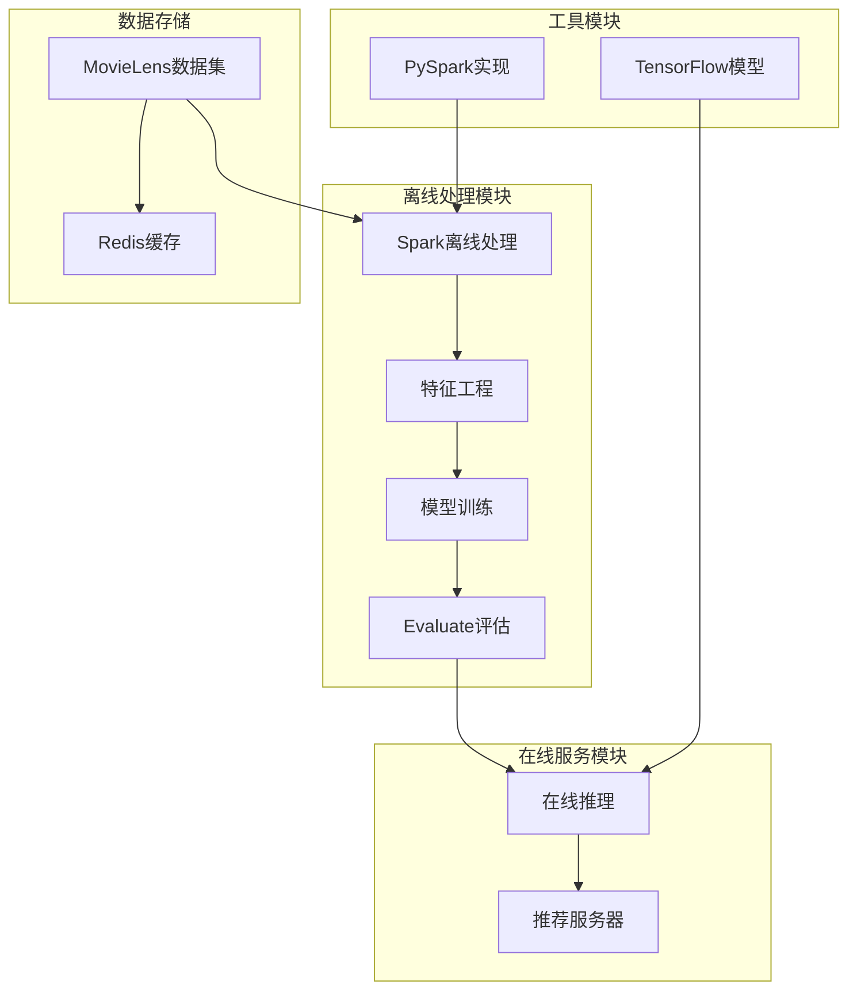

**图表来源**
- [pom.xml](file://pom.xml#L60-L227)
- [README.md](file://README.md#L19-L21)

**章节来源**
- [README.md](file://README.md#L1-L57)
- [pom.xml](file://pom.xml#L1-L228)

## 核心组件

### Spark分布式计算框架

项目基于Apache Spark 2.4.3版本构建，提供了强大的分布式计算能力：

- **Spark Core**: 提供基础的分布式计算框架
- **Spark SQL**: 支持结构化数据处理和SQL查询
- **Spark MLlib**: 包含机器学习算法库
- **PySpark**: Python接口支持

### 协同过滤ALS算法

项目实现了基于Apache Spark的ALS（交替最小二乘法）协同过滤算法，用于矩阵分解推荐：

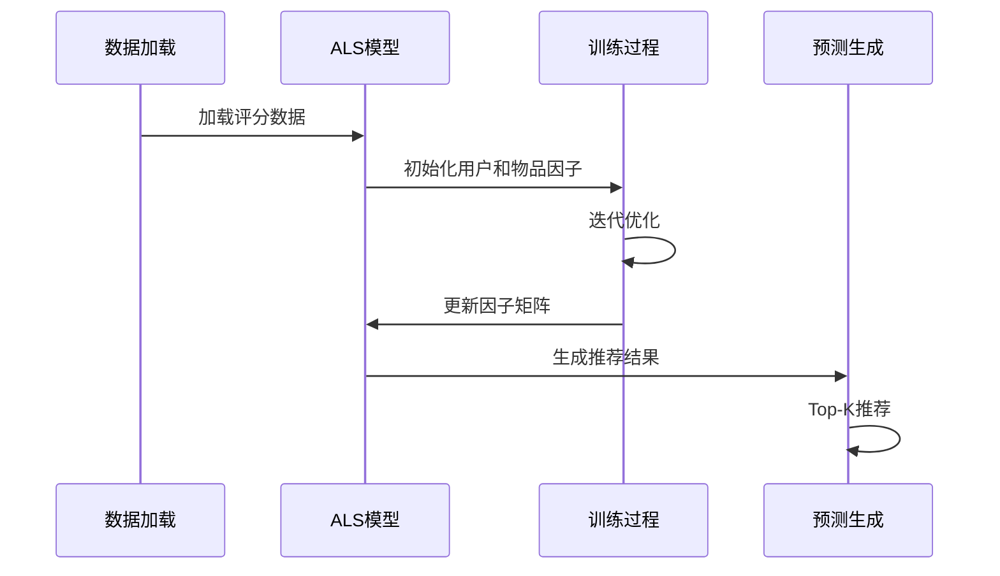

**图表来源**
- [CollaborativeFiltering.scala](file://src/main/java/com/sparrowrecsys/offline/spark/model/CollaborativeFiltering.scala#L29-L37)
- [CollaborativeFiltering.py](file://RecPySpark/src/com/sparrowrecsys/offline/pyspark/model/CollaborativeFiltering.py#L22-L24)

### 特征工程系统

项目提供了完整的特征工程流水线，包括：

- **用户特征提取**: 基于历史行为的统计特征
- **物品特征提取**: 基于内容的特征向量化
- **时间窗口特征**: 滞后特征和滚动统计
- **多热编码**: 处理分类变量的向量化

### 嵌入式模型

实现了多种嵌入式模型用于表示学习：

- **Word2Vec**: 电影序列的词嵌入
- **随机游走**: 图结构的随机游走采样
- **LSH近似最近邻**: 高维向量的快速检索

**章节来源**
- [CollaborativeFiltering.scala](file://src/main/java/com/sparrowrecsys/offline/spark/model/CollaborativeFiltering.scala#L1-L85)
- [CollaborativeFiltering.py](file://RecPySpark/src/com/sparrowrecsys/offline/pyspark/model/CollaborativeFiltering.py#L1-L51)
- [Embedding.scala](file://src/main/java/com/sparrowrecsys/offline/spark/embedding/Embedding.scala#L1-L287)

## 架构概览

SparrowRecSys采用分层架构设计，从底层的数据存储到上层的在线服务：

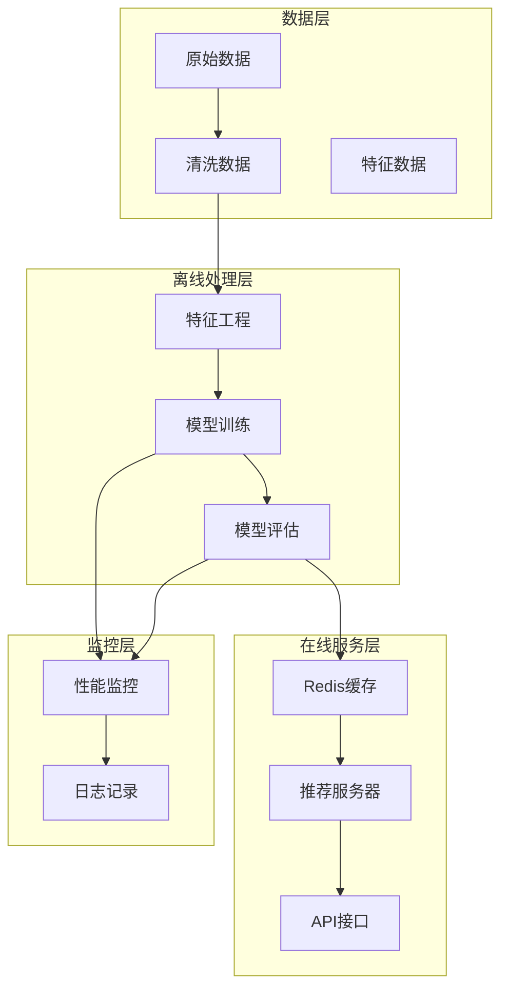

**图表来源**
- [FeatureEngForRecModel.scala](file://src/main/java/com/sparrowrecsys/offline/spark/featureeng/FeatureEngForRecModel.scala#L176-L188)
- [Evaluator.scala](file://src/main/java/com/sparrowrecsys/offline/spark/evaluate/Evaluator.scala#L7-L21)

## 详细组件分析

### 协同过滤ALS算法实现

ALS（Alternating Least Squares）是Spark MLlib提供的矩阵分解算法，专门用于协同过滤推荐：

#### 核心算法流程

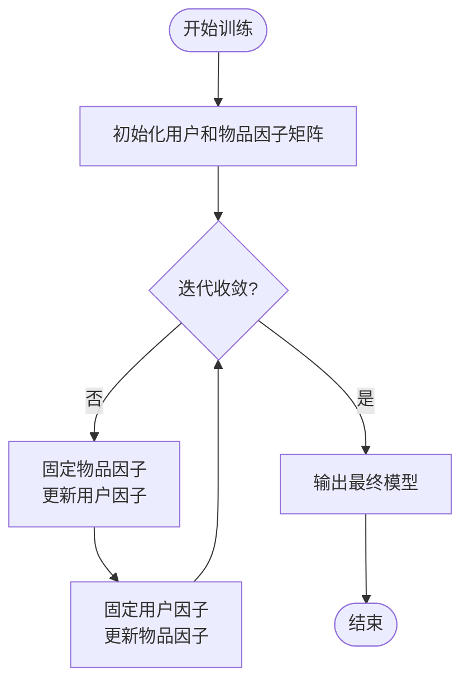

**图表来源**
- [CollaborativeFiltering.scala](file://src/main/java/com/sparrowrecsys/offline/spark/model/CollaborativeFiltering.scala#L29-L37)

#### 分布式训练机制

ALS算法通过以下方式实现分布式训练：

1. **数据分区**: 将用户和物品数据按哈希或范围分区
2. **并行优化**: 用户因子和物品因子的更新可以并行进行
3. **梯度聚合**: 在每次迭代中聚合梯度信息
4. **收敛判断**: 通过损失函数变化判断收敛

#### 关键参数配置

- **正则化参数**: 控制过拟合程度
- **隐式因子维度**: 决定模型复杂度
- **最大迭代次数**: 控制训练时长
- **收敛阈值**: 判断收敛的标准

**章节来源**
- [CollaborativeFiltering.scala](file://src/main/java/com/sparrowrecsys/offline/spark/model/CollaborativeFiltering.scala#L29-L52)
- [CollaborativeFiltering.py](file://RecPySpark/src/com/sparrowrecsys/offline/pyspark/model/CollaborativeFiltering.py#L22-L31)

### Spark SQL和DataFrame API应用

项目充分利用了Spark SQL的DataFrame API进行大规模数据处理：

#### 数据类型转换

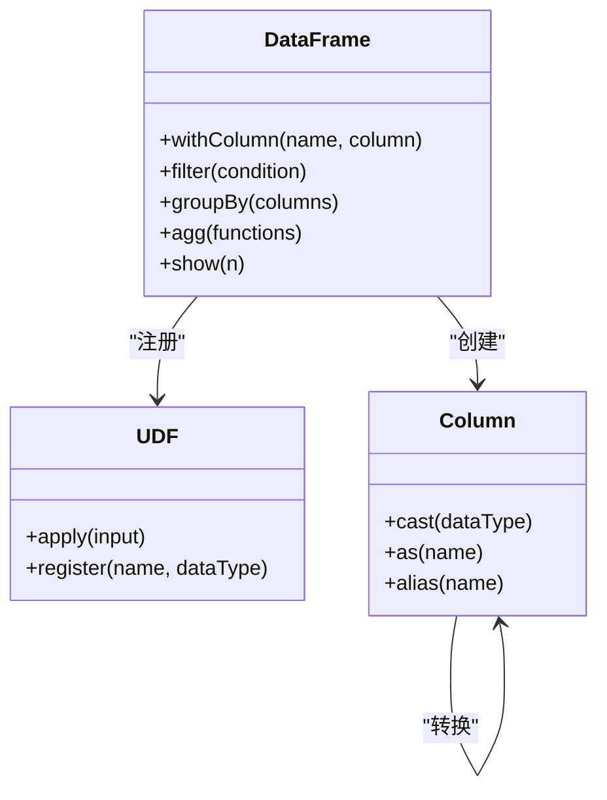

**图表来源**
- [FeatureEngForRecModel.scala](file://src/main/java/com/sparrowrecsys/offline/spark/featureeng/FeatureEngForRecModel.scala#L21-L29)
- [Embedding.scala](file://src/main/java/com/sparrowrecsys/offline/spark/embedding/Embedding.scala#L20-L25)

#### 窗口函数应用

项目使用窗口函数进行复杂的分析计算：

- **滚动统计**: 用户和物品的历史统计特征
- **时间序列分析**: 基于时间戳的特征计算
- **排名和分位数**: 排序和百分位数计算

**章节来源**
- [FeatureEngForRecModel.scala](file://src/main/java/com/sparrowrecsys/offline/spark/featureeng/FeatureEngForRecModel.scala#L86-L130)
- [FeatureEngineering.scala](file://src/main/java/com/sparrowrecsys/offline/spark/featureeng/FeatureEngineering.scala#L61-L90)

### 分布式机器学习工作机制

#### 数据分区策略

项目采用多种数据分区策略来优化分布式计算：

1. **哈希分区**: 基于键的哈希值进行分区
2. **范围分区**: 基于键值范围进行分区
3. **自定义分区**: 根据业务需求定制分区策略

#### 并行计算优化

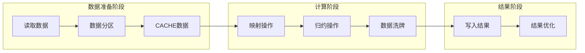

**图表来源**
- [Embedding.scala](file://src/main/java/com/sparrowrecsys/offline/spark/embedding/Embedding.scala#L186-L228)

#### 结果聚合策略

- **局部聚合**: 在每个分区内部先进行局部聚合
- **全局聚合**: 将分区结果合并到全局
- **增量聚合**: 支持增量更新和增量计算

**章节来源**
- [Embedding.scala](file://src/main/java/com/sparrowrecsys/offline/spark/embedding/Embedding.scala#L186-L228)

### Spark MLlib分布式算法实现

#### Word2Vec算法

项目实现了基于Spark的分布式Word2Vec算法：

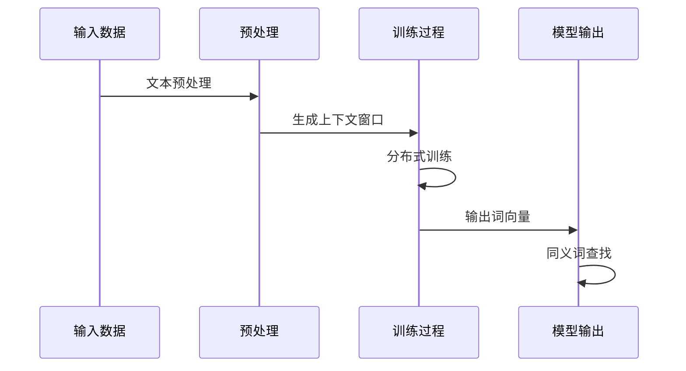

**图表来源**
- [Embedding.scala](file://src/main/java/com/sparrowrecsys/offline/spark/embedding/Embedding.scala#L103-L138)

#### LSH近似最近邻

项目实现了基于随机投影的LSH（局部敏感哈希）算法：

- **桶长度设置**: 控制搜索精度和性能平衡
- **哈希表数量**: 影响召回率和计算开销
- **向量归一化**: 提高相似度计算准确性

**章节来源**
- [Embedding.scala](file://src/main/java/com/sparrowrecsys/offline/spark/embedding/Embedding.scala#L230-L252)

### 内存管理和存储优化策略

#### 内存管理

项目采用了多种内存管理策略：

1. **缓存策略**: 使用`persist()`和`cache()`方法缓存热点数据
2. **序列化优化**: 使用Kryo序列化提高内存效率
3. **垃圾回收调优**: 配置合适的JVM参数

#### 存储优化

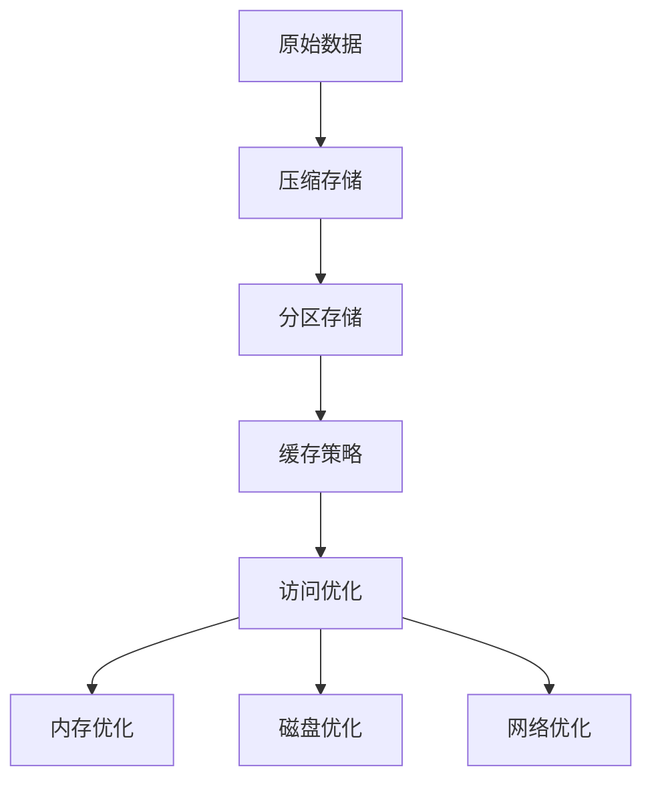

**图表来源**
- [FeatureEngForRecModel.scala](file://src/main/java/com/sparrowrecsys/offline/spark/featureeng/FeatureEngForRecModel.scala#L176-L188)

#### 大规模数据处理挑战

- **数据倾斜**: 通过重分区和Salting技术解决
- **内存溢出**: 使用流式处理和分块处理
- **网络瓶颈**: 通过数据本地化减少shuffle

**章节来源**
- [FeatureEngForRecModel.scala](file://src/main/java/com/sparrowrecsys/offline/spark/featureeng/FeatureEngForRecModel.scala#L176-L205)

## 依赖关系分析

项目的核心依赖关系如下：

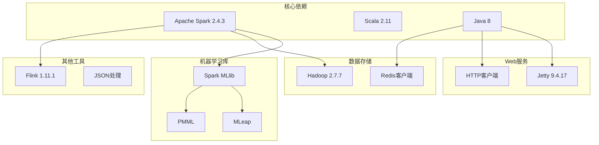

**图表来源**
- [pom.xml](file://pom.xml#L76-L227)

**章节来源**
- [pom.xml](file://pom.xml#L11-L227)

## 性能考虑

### 集群配置和资源调优

#### Executor数量配置

根据数据规模和硬件配置，建议以下Executor配置：

- **小规模数据** (10GB): 4-8个Executor
- **中规模数据** (100GB): 16-32个Executor  
- **大规模数据** (1TB+): 64-128个Executor

#### 内存分配策略

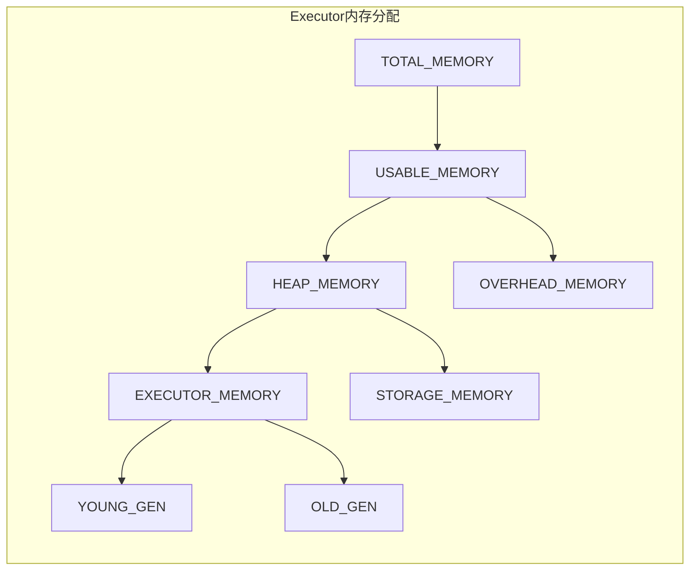

#### 并行度设置

- **默认并行度**: `spark.default.parallelism = 200`
- **分区数量**: `spark.sql.shuffle.partitions = 200`
- **广播变量**: 适用于小表广播

### 性能监控指标

#### 关键性能指标

- **任务执行时间**: 监控每个stage的任务执行时间
- **Shuffle读写**: 监控数据shuffle的读写量
- **内存使用率**: 监控Executor的内存使用情况
- **GC时间**: 监控垃圾回收的时间占比

#### 调优建议

1. **数据本地化**: 确保数据尽可能在本地节点处理
2. **分区优化**: 避免数据倾斜，合理设置分区数量
3. **缓存策略**: 对重复使用的数据进行缓存
4. **序列化优化**: 使用Kryo序列化替代Java序列化

## 故障排查指南

### 常见问题诊断

#### 内存相关问题

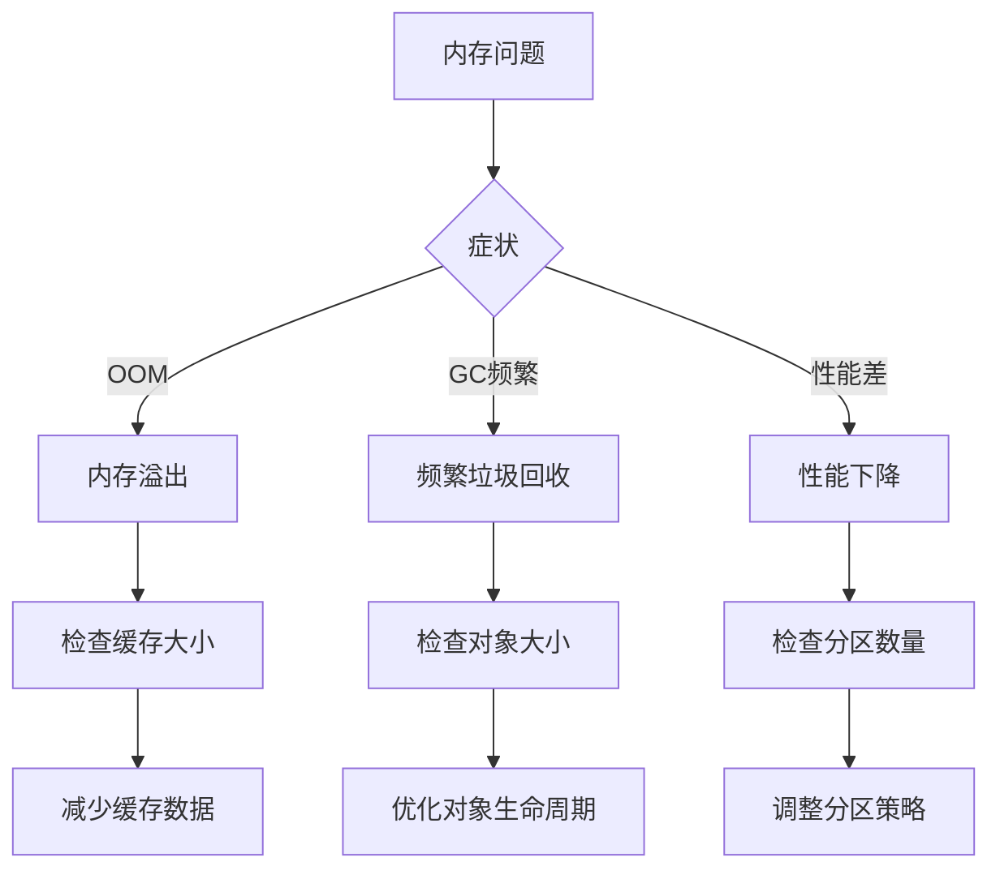

#### 数据倾斜问题

- **识别方法**: 检查任务执行时间差异
- **解决方案**: 使用Salting技术、重新分区、广播小表

#### 网络瓶颈问题

- **识别方法**: 检查shuffle读写量
- **解决方案**: 减少shuffle数据量、优化数据本地化

### 调试工具和方法

#### Spark UI监控

- **Application页面**: 查看作业执行状态
- **Jobs页面**: 分析任务执行详情
- **Storage页面**: 监控缓存使用情况
- **Environment页面**: 查看配置信息

#### 日志分析

- **Driver日志**: 查看应用程序日志
- **Executor日志**: 查看各个执行器的日志
- **错误堆栈**: 分析异常原因

**章节来源**
- [Evaluator.scala](file://src/main/java/com/sparrowrecsys/offline/spark/evaluate/Evaluator.scala#L7-L21)

## 结论

SparrowRecSys展示了Apache Spark在推荐系统中的强大能力，通过分布式计算实现了大规模数据处理和机器学习算法的高效执行。项目的主要优势包括：

1. **技术栈丰富**: 集成了Scala、Python、TensorFlow等多种技术
2. **算法完备**: 实现了多种推荐算法和特征工程技术
3. **架构清晰**: 从离线到在线的完整推荐系统架构
4. **可扩展性强**: 支持大规模数据和高并发场景

对于生产环境部署，建议重点关注以下方面：
- 合理的集群资源配置
- 数据分区和缓存策略优化
- 监控和故障排查机制
- 模型版本管理和A/B测试

## 附录

### 部署和配置指南

#### 单机模式配置

适用于开发和测试环境：

```bash
# 设置Spark配置
export SPARK_MASTER_URL=local[*]
export SPARK_DRIVER_MEMORY=4g
export SPARK_EXECUTOR_MEMORY=2g
export SPARK_EXECUTOR_CORES=2
```

#### 伪分布式配置

适用于小型集群：

```bash
# 配置主节点
export SPARK_MASTER_HOST=master-node
export SPARK_MASTER_PORT=7077

# 配置Worker节点
export SPARK_WORKER_MEMORY=8g
export SPARK_WORKER_CORES=4
export SPARK_WORKER_INSTANCES=2
```

#### 完全分布式配置

适用于生产环境：

```bash
# 配置YARN集群
export HADOOP_CONF_DIR=/etc/hadoop/conf
export YARN_CONF_DIR=/etc/hadoop/yarn-conf

# Spark配置
export SPARK_HOME=/opt/spark
export SPARK_CONF_DIR=/opt/spark/conf
```

### 环境要求

- **Java**: 8.0或更高版本
- **Scala**: 2.11.x
- **Python**: 3.6+
- **Apache Spark**: 2.4.3
- **TensorFlow**: 2.0+

### 依赖安装

```bash
# Maven依赖
mvn clean install

# Python依赖
pip install -r requirements.txt
```

**章节来源**
- [README.md](file://README.md#L7-L12)
- [requirements.txt](file://requirements.txt#L1-L4)
- [pom.xml](file://pom.xml#L11-L19)