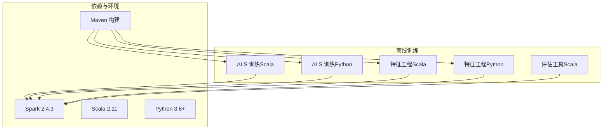
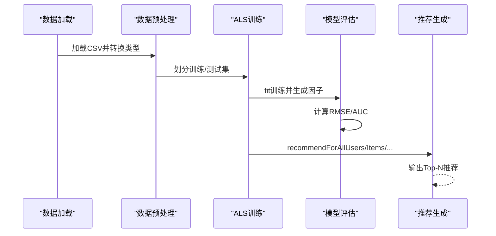
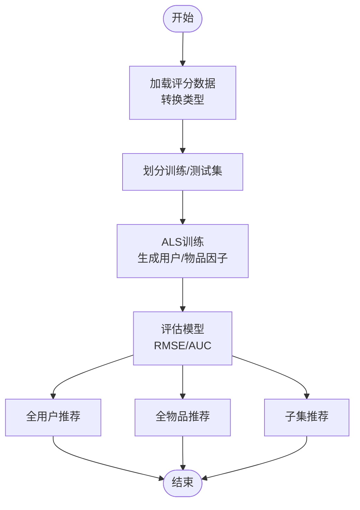
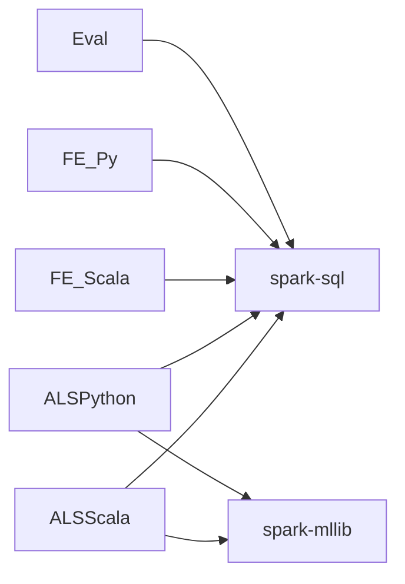

# 协同过滤ALS算法

<cite>
**本文引用的文件**
- [CollaborativeFiltering.scala](file://src/main/java/com/sparrowrecsys/offline/spark/model/CollaborativeFiltering.scala)
- [CollaborativeFiltering.py](file://RecPySpark/src/com/sparrowrecsys/offline/pyspark/model/CollaborativeFiltering.py)
- [Evaluator.scala](file://src/main/java/com/sparrowrecsys/offline/spark/evaluate/Evaluator.scala)
- [FeatureEngForRecModel.scala](file://src/main/java/com/sparrowrecsys/offline/spark/featureeng/FeatureEngForRecModel.scala)
- [FeatureEngForRecModel.py](file://RecPySpark/src/com/sparrowrecsys/offline/pyspark/featureeng/FeatureEngForRecModel.py)
- [pom.xml](file://pom.xml)
- [README.md](file://README.md)
</cite>

## 目录
1. [简介](#简介)
2. [项目结构](#项目结构)
3. [核心组件](#核心组件)
4. [架构总览](#架构总览)
5. [详细组件分析](#详细组件分析)
6. [依赖关系分析](#依赖关系分析)
7. [性能考量](#性能考量)
8. [故障排查指南](#故障排查指南)
9. [结论](#结论)
10. [附录](#附录)

## 简介
本文件围绕SparrowRecSys项目中的ALS（交替最小二乘法）协同过滤算法展开，结合仓库中提供的Scala与Python实现，系统阐述ALS矩阵分解的理论基础、Spark MLlib中ALS模型的关键参数配置、训练数据预处理流程、用户与物品因子矩阵生成机制、模型评估（RMSE）方法以及推荐生成（全用户/全物品/子集）的完整流程。同时对比Scala与Python两种实现方式的差异与性能特点，并给出参数调优策略与最佳实践建议。

## 项目结构
SparrowRecSys是一个混合语言的推荐系统项目，包含离线批处理（Spark）、在线服务（Jetty）、特征工程、模型训练与评估等模块。ALS协同过滤的离线训练与评估主要位于以下路径：
- Scala实现：src/main/java/com/sparrowrecsys/offline/spark/model/CollaborativeFiltering.scala
- Python实现：RecPySpark/src/com/sparrowrecsys/offline/pyspark/model/CollaborativeFiltering.py
- 特征工程（可选）：FeatureEngForRecModel.scala 与 FeatureEngForRecModel.py
- 模型评估工具：Evaluator.scala
- 项目依赖与版本：pom.xml

图表来源
- [CollaborativeFiltering.scala](file://src/main/java/com/sparrowrecsys/offline/spark/model/CollaborativeFiltering.scala#L1-L85)
- [CollaborativeFiltering.py](file://RecPySpark/src/com/sparrowrecsys/offline/pyspark/model/CollaborativeFiltering.py#L1-L51)
- [FeatureEngForRecModel.scala](file://src/main/java/com/sparrowrecsys/offline/spark/featureeng/FeatureEngForRecModel.scala#L1-L293)
- [FeatureEngForRecModel.py](file://RecPySpark/src/com/sparrowrecsys/offline/pyspark/featureeng/FeatureEngForRecModel.py#L1-L156)
- [Evaluator.scala](file://src/main/java/com/sparrowrecsys/offline/spark/evaluate/Evaluator.scala#L1-L22)
- [pom.xml](file://pom.xml#L11-L19)

章节来源
- [README.md](file://README.md#L1-L57)
- [pom.xml](file://pom.xml#L11-L19)

## 核心组件
- ALS模型与训练流程：在Scala与Python实现中均通过Spark MLlib的ALS构建与训练，完成用户-物品评分矩阵的分解，并输出用户因子与物品因子。
- 数据预处理：从CSV加载评分数据，进行类型转换与拆分训练/测试集；可选地进行特征工程（电影特征、用户特征提取与保存）。
- 模型评估：使用回归评估器计算RMSE；可选地使用二分类评估器计算AUC（ROC/PR）。
- 推荐生成：支持全用户/全物品/子集推荐，分别对应不同的recommendFor接口。

章节来源
- [CollaborativeFiltering.scala](file://src/main/java/com/sparrowrecsys/offline/spark/model/CollaborativeFiltering.scala#L12-L85)
- [CollaborativeFiltering.py](file://RecPySpark/src/com/sparrowrecsys/offline/pyspark/model/CollaborativeFiltering.py#L9-L51)
- [Evaluator.scala](file://src/main/java/com/sparrowrecsys/offline/spark/evaluate/Evaluator.scala#L7-L21)

## 架构总览
ALS在SparrowRecSys中的整体工作流如下：
- 数据准备：加载ratings.csv，进行类型转换与随机划分训练/测试集。
- 模型训练：使用ALS.fit对训练集进行矩阵分解，得到用户因子与物品因子。
- 模型评估：使用RegressionEvaluator计算RMSE；可选使用Evaluator计算AUC。
- 推荐生成：根据需求生成全用户/全物品/子集推荐列表。

图表来源
- [CollaborativeFiltering.scala](file://src/main/java/com/sparrowrecsys/offline/spark/model/CollaborativeFiltering.scala#L19-L85)
- [CollaborativeFiltering.py](file://RecPySpark/src/com/sparrowrecsys/offline/pyspark/model/CollaborativeFiltering.py#L15-L51)
- [Evaluator.scala](file://src/main/java/com/sparrowrecsys/offline/spark/evaluate/Evaluator.scala#L8-L21)

## 详细组件分析

### ALS模型与参数配置
- 最大迭代次数：通过setMaxIter设置，控制ALS优化过程的收敛步数。
- 正则化参数：通过setRegParam设置，平衡拟合误差与模型复杂度，防止过拟合。
- 用户/物品列映射：通过setUserCol、setItemCol、setRatingCol指定输入DataFrame中的列名。
- 冷启动策略：通过setColdStartStrategy("drop")避免对未知用户/物品产生NaN，确保评估指标稳定。

章节来源
- [CollaborativeFiltering.scala](file://src/main/java/com/sparrowrecsys/offline/spark/model/CollaborativeFiltering.scala#L30-L42)
- [CollaborativeFiltering.py](file://RecPySpark/src/com/sparrowrecsys/offline/pyspark/model/CollaborativeFiltering.py#L22-L23)

### 训练数据预处理流程
- CSV加载：从资源路径加载ratings.csv。
- 类型转换：将字符串类型的userId、movieId转换为整型，rating转换为浮点型。
- 训练/测试划分：按比例随机拆分训练与测试集，用于后续训练与评估。

章节来源
- [CollaborativeFiltering.scala](file://src/main/java/com/sparrowrecsys/offline/spark/model/CollaborativeFiltering.scala#L19-L27)
- [CollaborativeFiltering.py](file://RecPySpark/src/com/sparrowrecsys/offline/pyspark/model/CollaborativeFiltering.py#L15-L19)

### 用户因子矩阵与物品因子矩阵
- 用户因子矩阵：由ALS训练后生成，表示每个用户的潜在特征向量。
- 物品因子矩阵：由ALS训练后生成，表示每个物品的潜在特征向量。
- 展示与使用：在示例中展示了前若干条记录，实际应用中可用于相似度计算或推荐生成。

章节来源
- [CollaborativeFiltering.scala](file://src/main/java/com/sparrowrecsys/offline/spark/model/CollaborativeFiltering.scala#L44-L45)
- [CollaborativeFiltering.py](file://RecPySpark/src/com/sparrowrecsys/offline/pyspark/model/CollaborativeFiltering.py#L27-L28)

### 模型评估方法
- RMSE计算：使用RegressionEvaluator，以rating为标签列，prediction为预测列，计算均方根误差。
- 可选AUC评估：Evaluator类使用BinaryClassificationMetrics计算ROC与PR下的AUC值（适用于二分类场景）。

章节来源
- [CollaborativeFiltering.scala](file://src/main/java/com/sparrowrecsys/offline/spark/model/CollaborativeFiltering.scala#L47-L52)
- [CollaborativeFiltering.py](file://RecPySpark/src/com/sparrowrecsys/offline/pyspark/model/CollaborativeFiltering.py#L29-L31)
- [Evaluator.scala](file://src/main/java/com/sparrowrecsys/offline/spark/evaluate/Evaluator.scala#L8-L21)

### 推荐生成流程
- 全用户推荐：对所有用户生成Top-N电影推荐。
- 全物品推荐：对所有物品生成Top-N用户推荐。
- 子集推荐：对指定用户集合或物品集合生成Top-N推荐。

图表来源
- [CollaborativeFiltering.scala](file://src/main/java/com/sparrowrecsys/offline/spark/model/CollaborativeFiltering.scala#L54-L69)
- [CollaborativeFiltering.py](file://RecPySpark/src/com/sparrowrecsys/offline/pyspark/model/CollaborativeFiltering.py#L32-L45)

章节来源
- [CollaborativeFiltering.scala](file://src/main/java/com/sparrowrecsys/offline/spark/model/CollaborativeFiltering.scala#L54-L69)
- [CollaborativeFiltering.py](file://RecPySpark/src/com/sparrowrecsys/offline/pyspark/model/CollaborativeFiltering.py#L32-L45)

### 特征工程（可选）
- 标签生成：将评分转换为二分类标签（如≥3.5为正样本）。
- 电影特征：提取发行年份、标题、类型等，并聚合统计特征（评分计数、平均分、标准差）。
- 用户特征：基于窗口函数提取用户历史正向评分序列、评分计数、平均发行年份、类型偏好等。
- 数据保存：可将特征样本与训练/测试集保存为CSV，或将特征写入Redis供在线推理使用。

章节来源
- [FeatureEngForRecModel.scala](file://src/main/java/com/sparrowrecsys/offline/spark/featureeng/FeatureEngForRecModel.scala#L21-L130)
- [FeatureEngForRecModel.py](file://RecPySpark/src/com/sparrowrecsys/offline/pyspark/featureeng/FeatureEngForRecModel.py#L12-L113)

### 参数调优与交叉验证
- 参数网格：通过ParamGridBuilder添加regParam等超参数候选值。
- 交叉验证：使用CrossValidator在指定折数上进行模型选择，输出平均评估指标。

章节来源
- [CollaborativeFiltering.scala](file://src/main/java/com/sparrowrecsys/offline/spark/model/CollaborativeFiltering.scala#L71-L81)
- [CollaborativeFiltering.py](file://RecPySpark/src/com/sparrowrecsys/offline/pyspark/model/CollaborativeFiltering.py#L46-L49)

### Scala与Python实现对比
- 相同点
  - 均使用Spark MLlib ALS进行矩阵分解。
  - 均进行数据类型转换与训练/测试划分。
  - 均使用RegressionEvaluator计算RMSE。
- 差异点
  - SparkSession与UDF定义：Scala使用内置UDF与implicits，Python使用pyspark.sql.functions与udf。
  - 冷启动策略：Scala示例中显式设置冷启动策略，Python示例通过ALS构造函数参数设置。
  - 推荐接口：两者均支持全用户/全物品/子集推荐。
  - 性能特点：在相同硬件与数据规模下，二者性能相近，但具体表现受运行时JVM与Python解释器影响。

章节来源
- [CollaborativeFiltering.scala](file://src/main/java/com/sparrowrecsys/offline/spark/model/CollaborativeFiltering.scala#L19-L52)
- [CollaborativeFiltering.py](file://RecPySpark/src/com/sparrowrecsys/offline/pyspark/model/CollaborativeFiltering.py#L15-L31)

## 依赖关系分析
- Spark版本：项目使用Spark 2.4.3，配合Scala 2.11。
- 依赖范围：离线批处理依赖spark-core、spark-sql、spark-mllib等；在线服务依赖Jetty；特征工程与PMML导出依赖Jedis、JPMML等。

图表来源
- [pom.xml](file://pom.xml#L78-L96)

章节来源
- [pom.xml](file://pom.xml#L11-L19)

## 性能考量
- 数据规模与分区：合理设置DataFrame分区数量，避免数据倾斜；对大规模数据可考虑使用更高效的存储格式（如Parquet）。
- 迭代次数与正则化：较大的maxIter可能提升精度但增加训练时间；regParam过小可能导致欠拟合，过大可能导致过拟合。
- 冷启动处理：对未知用户/物品设置合理的冷启动策略，避免NaN导致的评估异常。
- 评估指标：RMSE适合回归任务，AUC适合二分类任务；根据业务目标选择合适的评估指标。

## 故障排查指南
- NaN评估指标：若出现NaN，检查是否正确设置冷启动策略或对未知用户/物品进行过滤。
- 列名不匹配：确保setUserCol、setItemCol、setRatingCol与DataFrame中的列名一致。
- 数据类型错误：确认userId、movieId为整型，rating为浮点型。
- 评估器配置：RegressionEvaluator需正确设置标签列与预测列。

章节来源
- [CollaborativeFiltering.scala](file://src/main/java/com/sparrowrecsys/offline/spark/model/CollaborativeFiltering.scala#L40-L52)
- [Evaluator.scala](file://src/main/java/com/sparrowrecsys/offline/spark/evaluate/Evaluator.scala#L12-L20)

## 结论
SparrowRecSys提供了ALS协同过滤的完整离线训练与评估流程，涵盖数据预处理、模型训练、因子矩阵生成、评估与推荐生成等关键环节。Scala与Python两种实现方式在功能上高度一致，可根据团队技术栈与运行环境选择。通过合理的参数调优与特征工程，ALS可在推荐系统中取得良好的效果。

## 附录
- 示例路径参考
  - ALS训练与评估（Scala）：[CollaborativeFiltering.scala](file://src/main/java/com/sparrowrecsys/offline/spark/model/CollaborativeFiltering.scala#L12-L85)
  - ALS训练与评估（Python）：[CollaborativeFiltering.py](file://RecPySpark/src/com/sparrowrecsys/offline/pyspark/model/CollaborativeFiltering.py#L9-L51)
  - 特征工程（Scala）：[FeatureEngForRecModel.scala](file://src/main/java/com/sparrowrecsys/offline/spark/featureeng/FeatureEngForRecModel.scala#L21-L130)
  - 特征工程（Python）：[FeatureEngForRecModel.py](file://RecPySpark/src/com/sparrowrecsys/offline/pyspark/featureeng/FeatureEngForRecModel.py#L12-L113)
  - 评估工具（Scala）：[Evaluator.scala](file://src/main/java/com/sparrowrecsys/offline/spark/evaluate/Evaluator.scala#L7-L21)
  - 项目依赖与版本：[pom.xml](file://pom.xml#L11-L19)