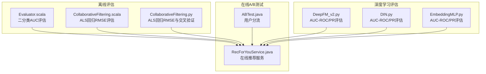
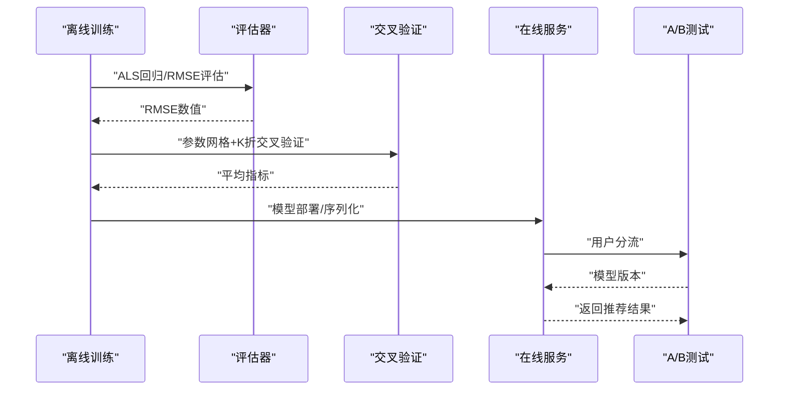
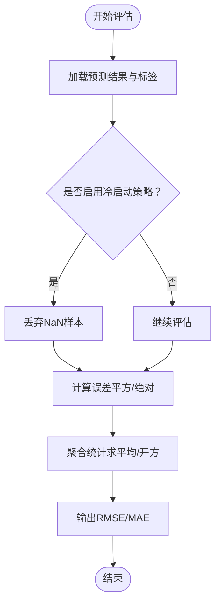
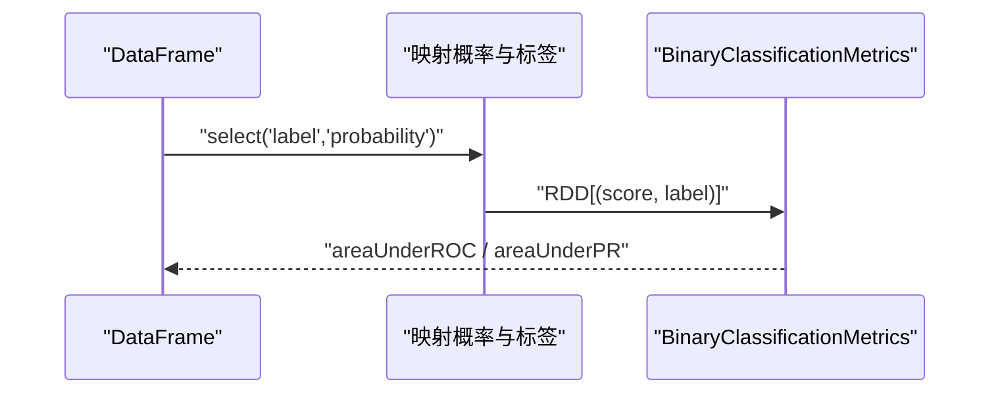
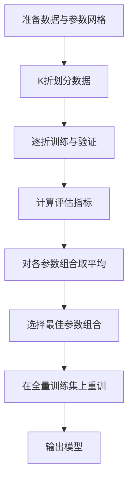
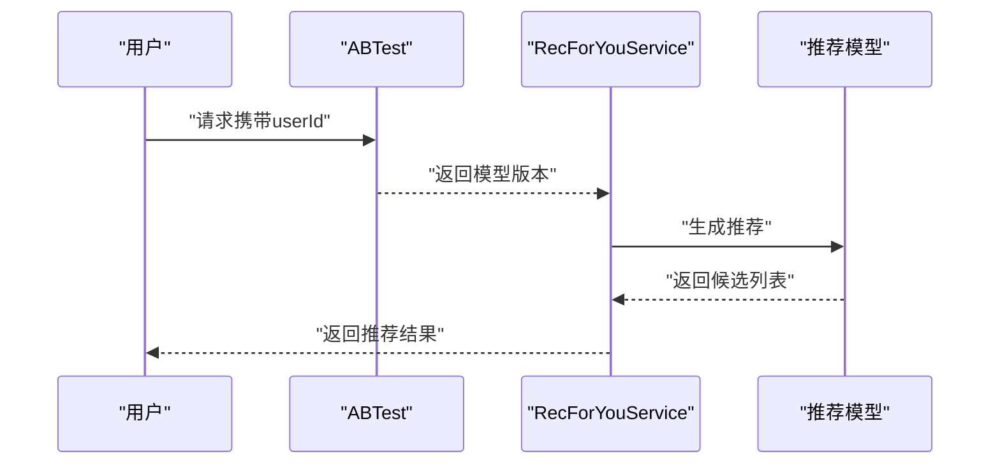
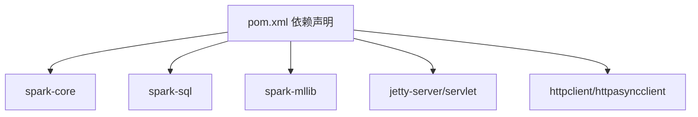

# 模型评估与指标

<cite>
**本文引用的文件**
- [Evaluator.scala](file://src/main/java/com/sparrowrecsys/offline/spark/evaluate/Evaluator.scala)
- [CollaborativeFiltering.scala](file://src/main/java/com/sparrowrecsys/offline/spark/model/CollaborativeFiltering.scala)
- [CollaborativeFiltering.py](file://RecPySpark/src/com/sparrowrecsys/offline/pyspark/model/CollaborativeFiltering.py)
- [ABTest.java](file://src/main/java/com/sparrowrecsys/online/util/ABTest.java)
- [RecForYouService.java](file://src/main/java/com/sparrowrecsys/online/service/RecForYouService.java)
- [DeepFM_v2.py](file://TFRecModel/src/com/sparrowrecsys/offline/tensorflow/DeepFM_v2.py)
- [DIN.py](file://TFRecModel/src/com/sparrowrecsys/offline/tensorflow/DIN.py)
- [EmbeddingMLP.py](file://TFRecModel/src/com/sparrowrecsys/offline/tensorflow/EmbeddingMLP.py)
- [README.md](file://README.md)
- [pom.xml](file://pom.xml)
</cite>

## 目录
1. [简介](#简介)
2. [项目结构](#项目结构)
3. [核心组件](#核心组件)
4. [架构总览](#架构总览)
5. [详细组件分析](#详细组件分析)
6. [依赖关系分析](#依赖关系分析)
7. [性能考量](#性能考量)
8. [故障排查指南](#故障排查指南)
9. [结论](#结论)
10. [附录](#附录)

## 简介
本文件面向SparrowRecSys的模型评估模块，系统性梳理推荐系统常用评估指标与方法，涵盖回归评估（RMSE、MAE）、二分类评估（AUC-ROC、AUC-PR）以及交叉验证（Cross Validation）的实现与参数调优策略。文档结合项目中Spark MLlib与TensorFlow/Keras的评估实现，给出冷启动问题的处理思路与评估挑战，并提供可直接参考的代码片段路径，帮助数据科学家在实际工程中选择合适的评估指标与策略，设计模型比较与A/B测试方案，建立性能基准与优化建议。

## 项目结构
SparrowRecSys采用多语言混合架构，包含离线Spark批处理、TensorFlow深度学习模型、在线服务与前端展示。与评估相关的关键模块如下：
- 离线Spark评估：使用BinaryClassificationMetrics进行AUC-ROC与AUC-PR评估；ALS回归评估使用RegressionEvaluator计算RMSE。
- TensorFlow/Keras评估：在多个深度学习模型中通过compile阶段设置metrics并在evaluate阶段输出损失与各类AUC。
- 在线A/B测试：通过ABTest工具按用户哈希分流，配合RecForYouService在线返回推荐结果。

图表来源
- [Evaluator.scala](file://src/main/java/com/sparrowrecsys/offline/spark/evaluate/Evaluator.scala#L1-L21)
- [CollaborativeFiltering.scala](file://src/main/java/com/sparrowrecsys/offline/spark/model/CollaborativeFiltering.scala#L1-L85)
- [CollaborativeFiltering.py](file://RecPySpark/src/com/sparrowrecsys/offline/pyspark/model/CollaborativeFiltering.py#L1-L51)
- [DeepFM_v2.py](file://TFRecModel/src/com/sparrowrecsys/offline/tensorflow/DeepFM_v2.py#L158-L170)
- [DIN.py](file://TFRecModel/src/com/sparrowrecsys/offline/tensorflow/DIN.py#L170-L174)
- [EmbeddingMLP.py](file://TFRecModel/src/com/sparrowrecsys/offline/tensorflow/EmbeddingMLP.py#L114-L117)
- [ABTest.java](file://src/main/java/com/sparrowrecsys/online/util/ABTest.java#L1-L28)
- [RecForYouService.java](file://src/main/java/com/sparrowrecsys/online/service/RecForYouService.java#L1-L39)

章节来源
- [README.md](file://README.md#L1-L57)
- [pom.xml](file://pom.xml#L76-L96)

## 核心组件
- Spark二分类评估器：Evaluator.scala使用BinaryClassificationMetrics对预测概率与标签进行AUC-ROC与AUC-PR评估。
- Spark回归评估器：CollaborativeFiltering.scala与CollaborativeFiltering.py使用RegressionEvaluator计算RMSE，ALS模型设置冷启动策略以避免NaN。
- TensorFlow/Keras评估：DeepFM_v2.py、DIN.py、EmbeddingMLP.py在compile阶段设置metrics，在evaluate阶段输出损失与AUC-ROC、AUC-PR。
- 在线A/B测试：ABTest.java按用户哈希将流量分配至不同模型，RecForYouService根据配置返回推荐结果。

章节来源
- [Evaluator.scala](file://src/main/java/com/sparrowrecsys/offline/spark/evaluate/Evaluator.scala#L7-L21)
- [CollaborativeFiltering.scala](file://src/main/java/com/sparrowrecsys/offline/spark/model/CollaborativeFiltering.scala#L47-L52)
- [CollaborativeFiltering.py](file://RecPySpark/src/com/sparrowrecsys/offline/pyspark/model/CollaborativeFiltering.py#L29-L31)
- [DeepFM_v2.py](file://TFRecModel/src/com/sparrowrecsys/offline/tensorflow/DeepFM_v2.py#L158-L170)
- [DIN.py](file://TFRecModel/src/com/sparrowrecsys/offline/tensorflow/DIN.py#L170-L174)
- [EmbeddingMLP.py](file://TFRecModel/src/com/sparrowrecsys/offline/tensorflow/EmbeddingMLP.py#L114-L117)
- [ABTest.java](file://src/main/java/com/sparrowrecsys/online/util/ABTest.java#L3-L26)
- [RecForYouService.java](file://src/main/java/com/sparrowrecsys/online/service/RecForYouService.java#L37-L39)

## 架构总览
下图展示了从离线训练到在线服务的整体评估流程，包括模型评估、AUC/AUC-PR输出、冷启动处理、参数网格搜索与交叉验证，以及在线A/B分流与推荐返回。

图表来源
- [CollaborativeFiltering.scala](file://src/main/java/com/sparrowrecsys/offline/spark/model/CollaborativeFiltering.scala#L47-L81)
- [CollaborativeFiltering.py](file://RecPySpark/src/com/sparrowrecsys/offline/pyspark/model/CollaborativeFiltering.py#L46-L49)
- [Evaluator.scala](file://src/main/java/com/sparrowrecsys/offline/spark/evaluate/Evaluator.scala#L12-L20)
- [ABTest.java](file://src/main/java/com/sparrowrecsys/online/util/ABTest.java#L11-L26)
- [RecForYouService.java](file://src/main/java/com/sparrowrecsys/online/service/RecForYouService.java#L37-L39)

## 详细组件分析

### 回归评估：RMSE与MAE
- RMSE（均方根误差）
  - 计算方式：对预测值与真实值差值平方求平均再开方。
  - 应用场景：衡量推荐评分的回归精度，对异常值敏感，适合关注整体误差幅度的任务。
  - 项目实现：ALS模型使用RegressionEvaluator(metricName='rmse')计算，冷启动策略设为drop避免NaN。
- MAE（平均绝对误差）
  - 计算方式：对预测值与真实值差值取绝对值后求平均。
  - 应用场景：对异常值不敏感，更稳健地反映平均偏差。
  - 项目实现：可在Spark MLlib中通过自定义评估器或扩展RegressionEvaluator实现。

图表来源
- [CollaborativeFiltering.scala](file://src/main/java/com/sparrowrecsys/offline/spark/model/CollaborativeFiltering.scala#L40-L52)
- [CollaborativeFiltering.py](file://RecPySpark/src/com/sparrowrecsys/offline/pyspark/model/CollaborativeFiltering.py#L21-L31)

章节来源
- [CollaborativeFiltering.scala](file://src/main/java/com/sparrowrecsys/offline/spark/model/CollaborativeFiltering.scala#L47-L52)
- [CollaborativeFiltering.py](file://RecPySpark/src/com/sparrowrecsys/offline/pyspark/model/CollaborativeFiltering.py#L29-L31)

### 二分类评估：AUC-ROC与AUC-PR
- AUC-ROC（曲线下面积-ROC曲线）
  - 定义：ROC曲线下面积，衡量TPR随FPR变化的能力，适用于正负样本相对平衡的场景。
  - 项目实现：Evaluator.scala使用BinaryClassificationMetrics计算areaUnderROC。
- AUC-PR（曲线下面积-Precision-Recall曲线）
  - 定义：PR曲线下面积，对正负样本不平衡更敏感，常用于隐式反馈推荐。
  - 项目实现：Evaluator.scala使用BinaryClassificationMetrics计算areaUnderPR。

图表来源
- [Evaluator.scala](file://src/main/java/com/sparrowrecsys/offline/spark/evaluate/Evaluator.scala#L12-L20)

章节来源
- [Evaluator.scala](file://src/main/java/com/sparrowrecsys/offline/spark/evaluate/Evaluator.scala#L7-L21)

### 交叉验证（Cross Validation）与参数调优
- 实现原理
  - 参数网格：通过ParamGridBuilder构建候选超参数组合。
  - K折划分：将数据分为K份，轮流以一份为验证集，其余为训练集。
  - 指标聚合：计算每组参数在各折上的指标，取平均作为该参数组合的评估结果。
- 项目实现
  - Spark ALS：CollaborativeFiltering.scala与CollaborativeFiltering.py分别演示了参数网格与10折交叉验证。
  - 调优策略
    - 网格范围：从较小范围起步，逐步扩大；优先尝试对模型影响较大的超参数（如正则项、迭代次数）。
    - 指标选择：回归任务用RMSE，二分类任务用AUC-ROC或AUC-PR。
    - 折数选择：K≥3，实践中常用5或10折；数据量大时可考虑分层抽样与时间序列分割。

图表来源
- [CollaborativeFiltering.scala](file://src/main/java/com/sparrowrecsys/offline/spark/model/CollaborativeFiltering.scala#L71-L81)
- [CollaborativeFiltering.py](file://RecPySpark/src/com/sparrowrecsys/offline/pyspark/model/CollaborativeFiltering.py#L46-L49)

章节来源
- [CollaborativeFiltering.scala](file://src/main/java/com/sparrowrecsys/offline/spark/model/CollaborativeFiltering.scala#L71-L81)
- [CollaborativeFiltering.py](file://RecPySpark/src/com/sparrowrecsys/offline/pyspark/model/CollaborativeFiltering.py#L46-L49)

### 冷启动问题的处理与评估挑战
- 处理方法
  - 用户冷启动：基于人口统计学特征、热门物品召回、内容相似度或轻量模型快速打分。
  - 物品冷启动：基于内容特征（如类别、年份）或流行度排序。
  - 数据冷启动：使用预热数据、迁移学习或对比学习。
- 评估挑战
  - 预测稀疏性：冷启动样本可能无标签或标签噪声大。
  - 指标失真：NaN或极端值会影响RMSE等指标稳定性。
  - 解决策略：在ALS中设置冷启动策略为drop，确保评估样本有效；对缺失预测进行过滤或填充。

章节来源
- [CollaborativeFiltering.scala](file://src/main/java/com/sparrowrecsys/offline/spark/model/CollaborativeFiltering.scala#L40-L42)
- [CollaborativeFiltering.py](file://RecPySpark/src/com/sparrowrecsys/offline/pyspark/model/CollaborativeFiltering.py#L21-L23)

### Spark MLlib评估器使用示例（代码片段路径）
- 二分类AUC评估
  - [Evaluator.scala](file://src/main/java/com/sparrowrecsys/offline/spark/evaluate/Evaluator.scala#L12-L20)
- ALS回归RMSE评估
  - [CollaborativeFiltering.scala](file://src/main/java/com/sparrowrecsys/offline/spark/model/CollaborativeFiltering.scala#L47-L52)
  - [CollaborativeFiltering.py](file://RecPySpark/src/com/sparrowrecsys/offline/pyspark/model/CollaborativeFiltering.py#L29-L31)
- 交叉验证与参数网格
  - [CollaborativeFiltering.scala](file://src/main/java/com/sparrowrecsys/offline/spark/model/CollaborativeFiltering.scala#L71-L81)
  - [CollaborativeFiltering.py](file://RecPySpark/src/com/sparrowrecsys/offline/pyspark/model/CollaborativeFiltering.py#L46-L49)

章节来源
- [Evaluator.scala](file://src/main/java/com/sparrowrecsys/offline/spark/evaluate/Evaluator.scala#L7-L21)
- [CollaborativeFiltering.scala](file://src/main/java/com/sparrowrecsys/offline/spark/model/CollaborativeFiltering.scala#L47-L81)
- [CollaborativeFiltering.py](file://RecPySpark/src/com/sparrowrecsys/offline/pyspark/model/CollaborativeFiltering.py#L29-L49)

### TensorFlow/Keras评估器使用示例（代码片段路径）
- DeepFM
  - [DeepFM_v2.py](file://TFRecModel/src/com/sparrowrecsys/offline/tensorflow/DeepFM_v2.py#L158-L170)
- DIN
  - [DIN.py](file://TFRecModel/src/com/sparrowrecsys/offline/tensorflow/DIN.py#L170-L174)
- EmbeddingMLP
  - [EmbeddingMLP.py](file://TFRecModel/src/com/sparrowrecsys/offline/tensorflow/EmbeddingMLP.py#L114-L117)

章节来源
- [DeepFM_v2.py](file://TFRecModel/src/com/sparrowrecsys/offline/tensorflow/DeepFM_v2.py#L158-L170)
- [DIN.py](file://TFRecModel/src/com/sparrowrecsys/offline/tensorflow/DIN.py#L170-L174)
- [EmbeddingMLP.py](file://TFRecModel/src/com/sparrowrecsys/offline/tensorflow/EmbeddingMLP.py#L114-L117)

### 模型比较与A/B测试设计
- 模型比较
  - 指标统一：在相同数据集与划分上比较RMSE（回归）或AUC-ROC/PR（二分类）。
  - 统计显著性：使用配对检验或Bootstrap评估差异显著性。
  - 可视化：绘制学习曲线、混淆矩阵、PR曲线等辅助判断。
- A/B测试
  - 流量分桶：ABTest.java按用户哈希将流量分配至不同模型版本。
  - 在线服务：RecForYouService根据配置选择模型并返回推荐结果。
  - 指标采集：记录点击率、转化率、停留时长等业务指标，进行显著性检验。

图表来源
- [ABTest.java](file://src/main/java/com/sparrowrecsys/online/util/ABTest.java#L11-L26)
- [RecForYouService.java](file://src/main/java/com/sparrowrecsys/online/service/RecForYouService.java#L37-L39)

章节来源
- [ABTest.java](file://src/main/java/com/sparrowrecsys/online/util/ABTest.java#L3-L26)
- [RecForYouService.java](file://src/main/java/com/sparrowrecsys/online/service/RecForYouService.java#L37-L39)

## 依赖关系分析
- Spark生态依赖：pom.xml中引入spark-core、spark-sql、spark-mllib等，支撑ALS与BinaryClassificationMetrics等评估组件。
- 在线服务依赖：Jetty、HTTP客户端等，支撑在线A/B测试与推荐服务。

图表来源
- [pom.xml](file://pom.xml#L76-L96)
- [pom.xml](file://pom.xml#L150-L189)

章节来源
- [pom.xml](file://pom.xml#L76-L96)
- [pom.xml](file://pom.xml#L150-L189)

## 性能考量
- 数据管道优化（TensorFlow/Keras）
  - 使用tf.data增强数据管道：shuffle、cache、prefetch，提升吞吐与稳定性。
  - 正则化与归一化：L2正则、BatchNormalization减少过拟合并加速收敛。
  - 学习率调度与早停：基于验证集loss的ReduceLROnPlateau与EarlyStopping。
- Spark评估性能
  - 冷启动策略：设置ALS冷启动策略为drop，避免NaN导致的评估不稳定。
  - 并行度与分区：合理设置Spark分区数与executor资源，提升大规模数据评估效率。
- 指标稳定性
  - 对于不平衡数据，优先使用AUC-PR；对于平衡数据，AUC-ROC与AUC-PR均可。
  - 交叉验证折数与参数网格规模需权衡评估成本与稳定性。

章节来源
- [EmbeddingMLP.py](file://TFRecModel/src/com/sparrowrecsys/offline/tensorflow/EmbeddingMLP.py#L13-L27)
- [EmbeddingMLP.py](file://TFRecModel/src/com/sparrowrecsys/offline/tensorflow/EmbeddingMLP.py#L119-L141)
- [CollaborativeFiltering.scala](file://src/main/java/com/sparrowrecsys/offline/spark/model/CollaborativeFiltering.scala#L40-L42)

## 故障排查指南
- 评估指标异常
  - NaN或无穷大：检查冷启动策略与缺失预测；确认标签与预测列类型一致。
  - 不稳定波动：增加交叉验证折数、扩大数据集或调整参数网格范围。
- Spark依赖问题
  - 缺少spark-mllib：确保pom.xml中已引入对应依赖。
  - 类型转换错误：确认DataFrame中标签与预测列的数据类型匹配。
- 在线A/B测试
  - 用户分流异常：检查ABTest的哈希取模与默认模型配置。
  - 推荐为空：确认模型版本与候选生成逻辑。

章节来源
- [Evaluator.scala](file://src/main/java/com/sparrowrecsys/offline/spark/evaluate/Evaluator.scala#L12-L20)
- [CollaborativeFiltering.scala](file://src/main/java/com/sparrowrecsys/offline/spark/model/CollaborativeFiltering.scala#L40-L42)
- [ABTest.java](file://src/main/java/com/sparrowrecsys/online/util/ABTest.java#L11-L26)
- [pom.xml](file://pom.xml#L76-L96)

## 结论
SparrowRecSys在离线与在线层面提供了完善的评估与A/B测试能力：离线侧通过Spark ALS回归与BinaryClassificationMetrics实现RMSE与AUC评估，并支持交叉验证参数调优；在线侧通过ABTest与RecForYouService实现模型版本分流与推荐返回。结合TensorFlow/Keras的AUC评估与数据管道优化，可进一步提升评估效率与稳定性。建议在实际工程中统一评估指标口径、严格控制数据质量与冷启动处理，并通过A/B测试持续验证业务指标的显著性与稳定性。

## 附录
- 评估指标选择建议
  - 回归评分：优先RMSE，关注整体误差；若存在异常值，可辅以MAE。
  - 二分类（隐式反馈）：优先AUC-PR；若正负样本均衡且关注整体判别力，可用AUC-ROC。
- 交叉验证参数建议
  - K折：5或10折；数据量大时可考虑分层或时间序列分割。
  - 网格范围：从粗到细，优先调参对模型影响大的超参数。
- A/B测试设计要点
  - 明确业务指标（点击率、转化率、留存等），设定显著性阈值。
  - 合理分桶与流量比例，避免对用户体验造成过大扰动。
  - 长期观察与统计检验，避免短期波动误导决策。