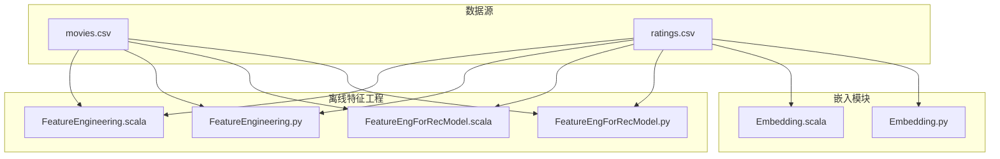
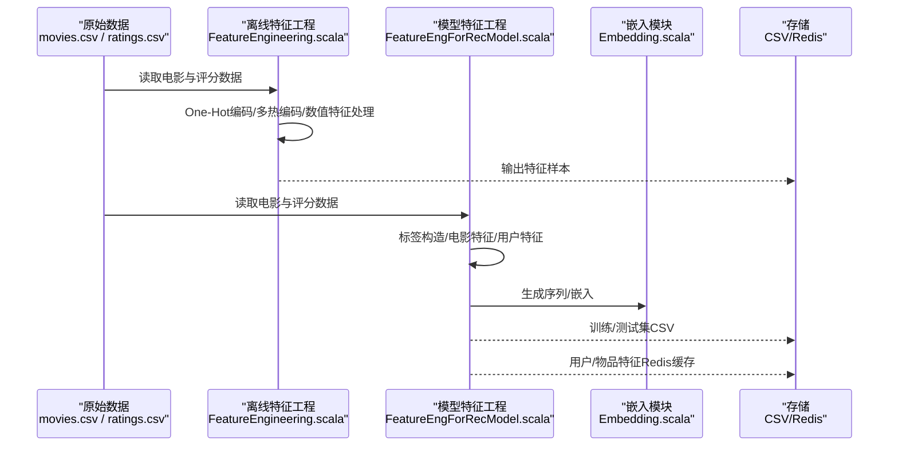
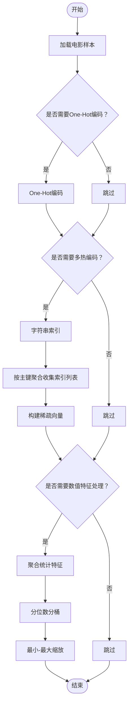
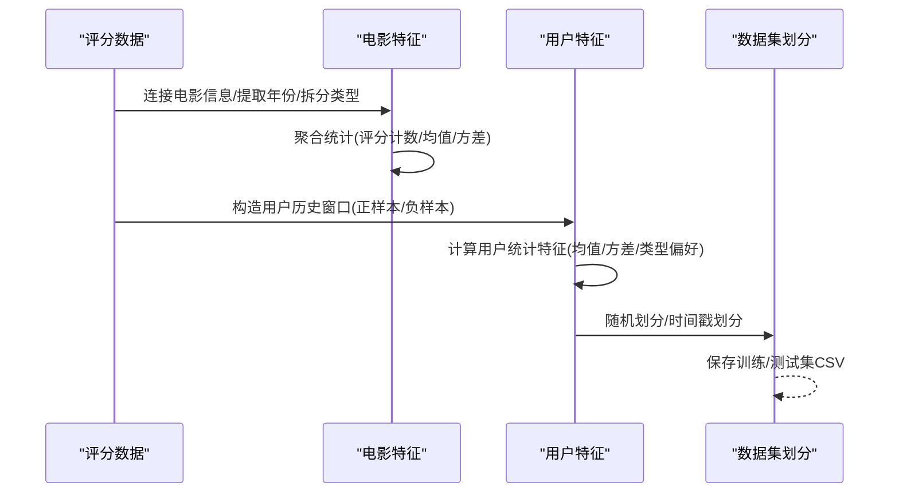
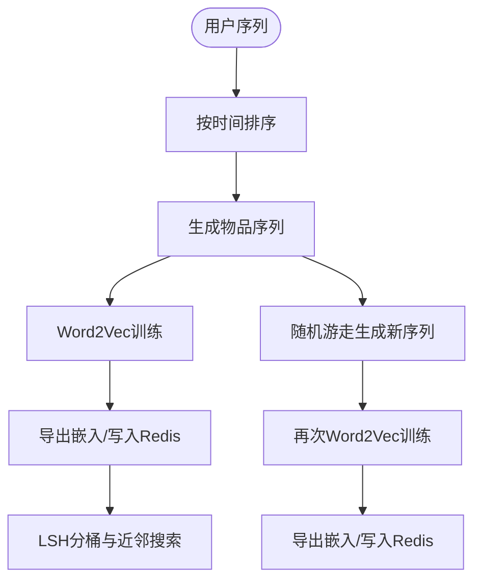
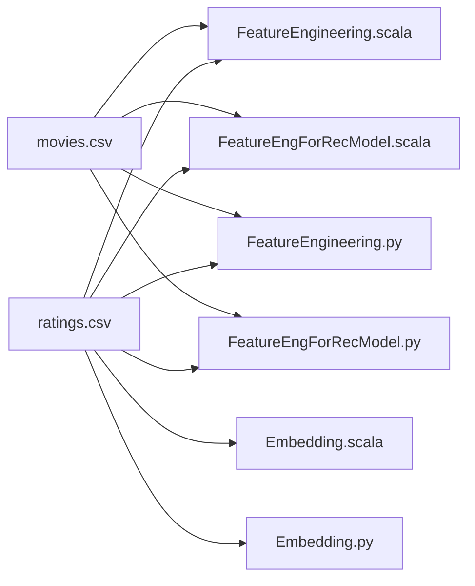

# 特征工程流水线

<cite>
**本文引用的文件**
- [FeatureEngineering.scala](file://src/main/java/com/sparrowrecsys/offline/spark/featureeng/FeatureEngineering.scala)
- [FeatureEngForRecModel.scala](file://src/main/java/com/sparrowrecsys/offline/spark/featureeng/FeatureEngForRecModel.scala)
- [FeatureEngineering.py](file://RecPySpark/src/com/sparrowrecsys/offline/pyspark/featureeng/FeatureEngineering.py)
- [FeatureEngForRecModel.py](file://RecPySpark/src/com/sparrowrecsys/offline/pyspark/featureeng/FeatureEngForRecModel.py)
- [Embedding.scala](file://src/main/java/com/sparrowrecsys/offline/spark/embedding/Embedding.scala)
- [Embedding.py](file://RecPySpark/src/com/sparrowrecsys/offline/pyspark/embedding/Embedding.py)
- [movies.csv](file://src/main/resources/webroot/sampledata/movies.csv)
- [ratings.csv](file://src/main/resources/webroot/sampledata/ratings.csv)
- [README.md](file://README.md)
</cite>

## 目录
1. [引言](#引言)
2. [项目结构](#项目结构)
3. [核心组件](#核心组件)
4. [架构总览](#架构总览)
5. [详细组件分析](#详细组件分析)
6. [依赖关系分析](#依赖关系分析)
7. [性能考量](#性能考量)
8. [故障排查指南](#故障排查指南)
9. [结论](#结论)
10. [附录：最佳实践与性能优化](#附录最佳实践与性能优化)

## 引言
本文件围绕SparrowRecSys的特征工程流水线展开，系统性阐述特征工程在推荐系统中的作用与实现路径。文档聚焦以下主题：
- 特征预处理：缺失值处理、异常值检测、数据标准化等
- 多热编码（One-Hot Encoding）与稀疏向量化
- 数值特征处理：归一化、标准化、分桶（Quantile Discretizer）
- 特征选择与特征组合策略
- Scala与Python两种实现方式的差异与适用场景
- 从原始数据到最终特征矩阵的完整转换流程
- 最佳实践与性能优化建议

## 项目结构
SparrowRecSys采用混合语言架构，包含Spark（Scala）与PySpark（Python）两套特征工程实现，以及离线嵌入生成与在线推理支持。特征工程相关代码主要位于：
- Spark（Scala）：离线批处理与管道化特征工程
- PySpark（Python）：轻量脚本化特征工程与快速原型验证
- 嵌入模块：基于序列的词向量与随机游走图嵌入

图表来源
- [FeatureEngineering.scala](file://src/main/java/com/sparrowrecsys/offline/spark/featureeng/FeatureEngineering.scala#L1-L120)
- [FeatureEngForRecModel.scala](file://src/main/java/com/sparrowrecsys/offline/spark/featureeng/FeatureEngForRecModel.scala#L1-L293)
- [FeatureEngineering.py](file://RecPySpark/src/com/sparrowrecsys/offline/pyspark/featureeng/FeatureEngineering.py#L1-L77)
- [FeatureEngForRecModel.py](file://RecPySpark/src/com/sparrowrecsys/offline/pyspark/featureeng/FeatureEngForRecModel.py#L1-L156)
- [Embedding.scala](file://src/main/java/com/sparrowrecsys/offline/spark/embedding/Embedding.scala#L1-L287)
- [Embedding.py](file://RecPySpark/src/com/sparrowrecsys/offline/pyspark/embedding/Embedding.py#L1-L202)

章节来源
- [README.md](file://README.md#L1-L57)

## 核心组件
- 特征工程入口与演示（Scala）：提供One-Hot编码、多热编码、数值特征处理的示例函数，展示从原始样本到特征向量的转换过程。
- 模型特征工程（Scala）：面向推荐建模的特征提取与拼接，包括电影基础特征、用户历史窗口统计、标签构造与数据集划分。
- 特征工程入口与演示（Python）：与Scala版本对应的功能实现，便于快速验证与原型开发。
- 模型特征工程（Python）：与Scala版本一致的特征工程流程，包含标签、电影特征、用户特征与数据集保存。
- 嵌入模块：基于序列的Item2Vec与随机游走图嵌入，用于生成物品与用户嵌入，支撑后续特征融合。

章节来源
- [FeatureEngineering.scala](file://src/main/java/com/sparrowrecsys/offline/spark/featureeng/FeatureEngineering.scala#L11-L118)
- [FeatureEngForRecModel.scala](file://src/main/java/com/sparrowrecsys/offline/spark/featureeng/FeatureEngForRecModel.scala#L15-L290)
- [FeatureEngineering.py](file://RecPySpark/src/com/sparrowrecsys/offline/pyspark/featureeng/FeatureEngineering.py#L11-L76)
- [FeatureEngForRecModel.py](file://RecPySpark/src/com/sparrowrecsys/offline/pyspark/featureeng/FeatureEngForRecModel.py#L12-L155)
- [Embedding.scala](file://src/main/java/com/sparrowrecsys/offline/spark/embedding/Embedding.scala#L22-L286)
- [Embedding.py](file://RecPySpark/src/com/sparrowrecsys/offline/pyspark/embedding/Embedding.py#L15-L201)

## 架构总览
特征工程流水线分为“离线特征工程”和“模型特征工程”两大阶段：
- 离线特征工程：对原始数据进行清洗、编码与数值特征处理，输出可直接用于建模的特征矩阵。
- 模型特征工程：结合业务规则与窗口统计，生成更丰富的上下文特征，并完成训练/测试集划分与持久化。

图表来源
- [FeatureEngineering.scala](file://src/main/java/com/sparrowrecsys/offline/spark/featureeng/FeatureEngineering.scala#L92-L118)
- [FeatureEngForRecModel.scala](file://src/main/java/com/sparrowrecsys/offline/spark/featureeng/FeatureEngForRecModel.scala#L261-L290)
- [Embedding.scala](file://src/main/java/com/sparrowrecsys/offline/spark/embedding/Embedding.scala#L268-L286)

## 详细组件分析

### 组件A：离线特征工程（Scala）
- One-Hot编码示例：将类别型ID转换为稠密或稀疏向量表示，便于后续模型处理。
- 多热编码示例：对多值类别字段（如电影类型）进行字符串索引与稀疏向量构建。
- 数值特征处理：计算评分均值、方差、计数等统计特征，并通过分位数分桶与最小-最大缩放进行归一化。

图表来源
- [FeatureEngineering.scala](file://src/main/java/com/sparrowrecsys/offline/spark/featureeng/FeatureEngineering.scala#L16-L90)

章节来源
- [FeatureEngineering.scala](file://src/main/java/com/sparrowrecsys/offline/spark/featureeng/FeatureEngineering.scala#L11-L118)

### 组件B：模型特征工程（Scala）
- 标签构造：根据评分阈值生成二分类标签，用于排序/点击率预测任务。
- 电影特征：提取电影评分计数、平均分、标准差等统计特征。
- 用户特征：基于滑动窗口统计用户历史评分、观看序列、类型偏好等。
- 数据集划分：支持随机划分与基于时间戳的划分，确保时序偏差控制。

图表来源
- [FeatureEngForRecModel.scala](file://src/main/java/com/sparrowrecsys/offline/spark/featureeng/FeatureEngForRecModel.scala#L21-L289)

章节来源
- [FeatureEngForRecModel.scala](file://src/main/java/com/sparrowrecsys/offline/spark/featureeng/FeatureEngForRecModel.scala#L15-L290)

### 组件C：离线特征工程（Python）
- 功能映射：与Scala版本一一对应，提供One-Hot编码、多热编码与数值特征处理的Python实现。
- 使用场景：适合快速原型、教学演示与小规模实验。

章节来源
- [FeatureEngineering.py](file://RecPySpark/src/com/sparrowrecsys/offline/pyspark/featureeng/FeatureEngineering.py#L11-L76)

### 组件D：模型特征工程（Python）
- 功能映射：与Scala版本一致，包含标签构造、电影特征与用户特征提取，以及数据集划分与保存。
- 使用场景：便于在Python生态中快速验证特征工程流程。

章节来源
- [FeatureEngForRecModel.py](file://RecPySpark/src/com/sparrowrecsys/offline/pyspark/featureeng/FeatureEngForRecModel.py#L12-L155)

### 组件E：嵌入模块（Scala/Python）
- 序列处理：基于评分时间对用户观看序列进行排序与拼接。
- Item2Vec训练：使用Word2Vec生成物品嵌入，并导出至文件或Redis。
- 随机游走图嵌入：基于转移概率矩阵与初始分布生成新序列，再训练嵌入。
- LSH近邻搜索：对嵌入进行分桶LSH，支持近似最近邻查询。

图表来源
- [Embedding.scala](file://src/main/java/com/sparrowrecsys/offline/spark/embedding/Embedding.scala#L27-L252)
- [Embedding.py](file://RecPySpark/src/com/sparrowrecsys/offline/pyspark/embedding/Embedding.py#L33-L163)

章节来源
- [Embedding.scala](file://src/main/java/com/sparrowrecsys/offline/spark/embedding/Embedding.scala#L22-L286)
- [Embedding.py](file://RecPySpark/src/com/sparrowrecsys/offline/pyspark/embedding/Embedding.py#L15-L201)

## 依赖关系分析
- 数据依赖：特征工程依赖movies.csv与ratings.csv；嵌入模块依赖ratings.csv生成序列。
- 工具库依赖：Spark ML（One-Hot、StringIndexer、QuantileDiscretizer、MinMaxScaler、Pipeline）、窗口函数、UDF、Redis客户端。
- 存储依赖：CSV文件与Redis键值存储，用于离线特征与在线推理。

图表来源
- [FeatureEngineering.scala](file://src/main/java/com/sparrowrecsys/offline/spark/featureeng/FeatureEngineering.scala#L100-L116)
- [FeatureEngForRecModel.scala](file://src/main/java/com/sparrowrecsys/offline/spark/featureeng/FeatureEngForRecModel.scala#L269-L289)
- [FeatureEngineering.py](file://RecPySpark/src/com/sparrowrecsys/offline/pyspark/featureeng/FeatureEngineering.py#L60-L76)
- [FeatureEngForRecModel.py](file://RecPySpark/src/com/sparrowrecsys/offline/pyspark/featureeng/FeatureEngForRecModel.py#L141-L155)
- [Embedding.scala](file://src/main/java/com/sparrowrecsys/offline/spark/embedding/Embedding.scala#L276-L285)
- [Embedding.py](file://RecPySpark/src/com/sparrowrecsys/offline/pyspark/embedding/Embedding.py#L186-L201)

章节来源
- [FeatureEngineering.scala](file://src/main/java/com/sparrowrecsys/offline/spark/featureeng/FeatureEngineering.scala#L1-L120)
- [FeatureEngForRecModel.scala](file://src/main/java/com/sparrowrecsys/offline/spark/featureeng/FeatureEngForRecModel.scala#L1-L293)
- [FeatureEngineering.py](file://RecPySpark/src/com/sparrowrecsys/offline/pyspark/featureeng/FeatureEngineering.py#L1-L77)
- [FeatureEngForRecModel.py](file://RecPySpark/src/com/sparrowrecsys/offline/pyspark/featureeng/FeatureEngForRecModel.py#L1-L156)
- [Embedding.scala](file://src/main/java/com/sparrowrecsys/offline/spark/embedding/Embedding.scala#L1-L287)
- [Embedding.py](file://RecPySpark/src/com/sparrowrecsys/offline/pyspark/embedding/Embedding.py#L1-L202)

## 性能考量
- 分桶与缩放：使用分位数分桶（QuantileDiscretizer）可减少极端值影响，配合最小-最大缩放（MinMaxScaler）提升数值稳定性。
- 稀疏向量：多热编码采用稀疏向量（Sparse Vector）降低内存占用与计算开销。
- 窗口统计：用户特征使用滑动窗口聚合，注意窗口大小与分区策略以平衡准确性与时延。
- 数据分区：写入CSV前进行重分区（repartition），避免小文件过多导致的调度开销。
- Redis缓存：特征写入Redis时设置合理TTL，避免长期占用内存。
- 嵌入导出：嵌入文件导出与Redis写入可按需开启，避免不必要的IO开销。

## 故障排查指南
- 缺失值处理：在聚合统计后使用填充（fillna）避免空值导致的模型训练失败。
- 类别不平衡：标签构造后检查各类别比例，必要时进行重采样或加权。
- 时间戳划分：基于近似分位数的时间划分可避免数据泄露，确保训练/测试时间顺序正确。
- UDF性能：UDF执行在JVM/Python之间切换可能带来性能损耗，尽量使用内置函数与向量化操作。
- 内存溢出：大规模聚合与窗口操作可能导致内存压力，可通过调优分区数与缓存策略缓解。

章节来源
- [FeatureEngForRecModel.scala](file://src/main/java/com/sparrowrecsys/offline/spark/featureeng/FeatureEngForRecModel.scala#L63-L63)
- [FeatureEngForRecModel.scala](file://src/main/java/com/sparrowrecsys/offline/spark/featureeng/FeatureEngForRecModel.scala#L116-L117)
- [FeatureEngForRecModel.scala](file://src/main/java/com/sparrowrecsys/offline/spark/featureeng/FeatureEngForRecModel.scala#L194-L198)
- [FeatureEngForRecModel.py](file://RecPySpark/src/com/sparrowrecsys/offline/pyspark/featureeng/FeatureEngForRecModel.py#L49-L49)
- [FeatureEngForRecModel.py](file://RecPySpark/src/com/sparrowrecsys/offline/pyspark/featureeng/FeatureEngForRecModel.py#L100-L100)
- [FeatureEngForRecModel.py](file://RecPySpark/src/com/sparrowrecsys/offline/pyspark/featureeng/FeatureEngForRecModel.py#L128-L132)

## 结论
SparrowRecSys的特征工程流水线通过Scala与Python双栈实现，覆盖了从原始数据到特征矩阵的关键步骤。离线特征工程侧重编码与数值处理，模型特征工程强调业务特征与窗口统计，嵌入模块则提供序列与图结构的表征能力。该流水线既适用于教学与原型验证，也可作为生产环境的基础组件进行扩展与优化。

## 附录：最佳实践与性能优化
- 数据质量
  - 缺失值：对数值特征使用均值/中位数填充，对类别特征使用众数或新增“未知”类别。
  - 异常值：基于分位数或箱线图识别并裁剪，避免极端值影响统计特征。
- 编码策略
  - One-Hot编码：适用于低基数类别；高基数类别优先考虑目标编码或嵌入。
  - 多热编码：对多值类别字段进行字符串索引与稀疏向量构建，减少维度灾难。
- 数值特征
  - 归一化：Min-Max缩放适合已知范围且无长尾分布的特征。
  - 标准化：Z-Score标准化适合近似正态分布的特征。
  - 分桶：QuantileDiscretizer可稳定分布并增强非线性表达能力。
- 特征选择与组合
  - 特征选择：基于卡方检验、互信息或模型系数筛选重要特征。
  - 特征组合：交叉特征、多项式特征与交互项可提升模型表达力，但需注意维度爆炸。
- 实现差异与适用场景
  - Scala（Spark ML）：适合大规模批处理与生产环境，具备更好的性能与容错能力。
  - Python（PySpark）：适合快速原型与教学演示，便于迭代与调试。
- 性能优化
  - 合理分区：根据数据规模调整分区数，避免数据倾斜。
  - 缓存策略：对重复使用的中间结果进行缓存（如索引器模型）。
  - 写入优化：重分区与单文件写入结合，减少小文件数量。
  - Redis参数：设置合理的TTL与批量写入策略，降低网络开销。