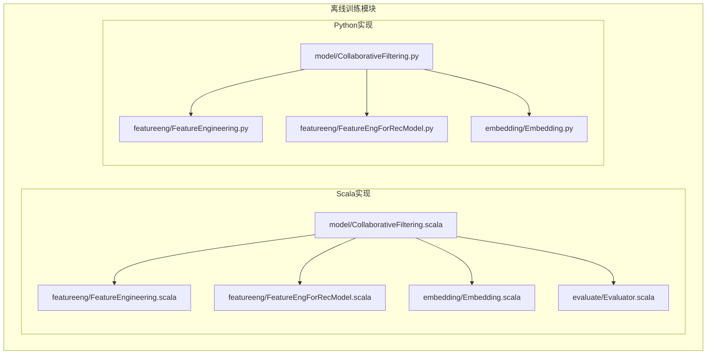
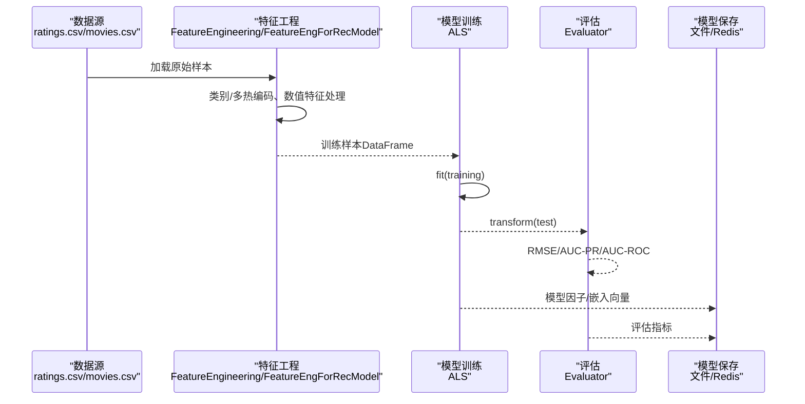
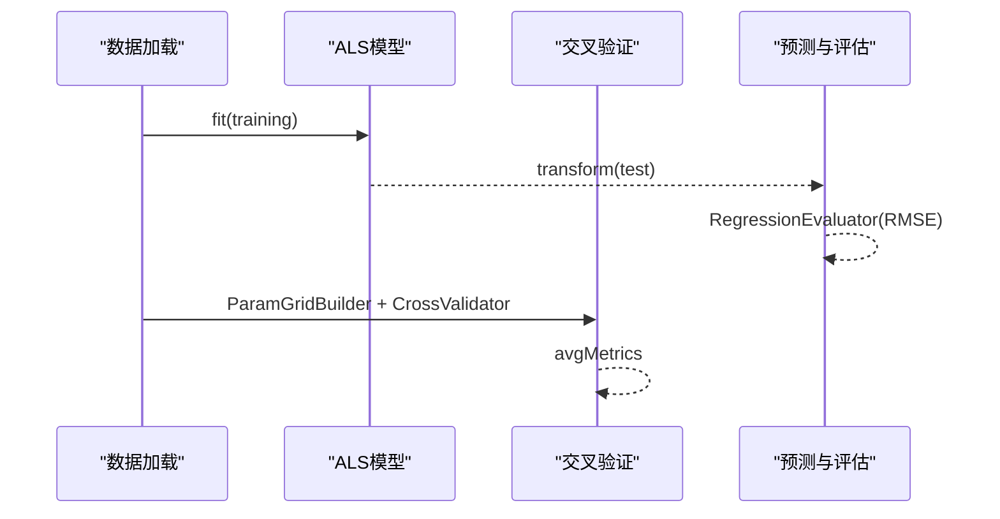
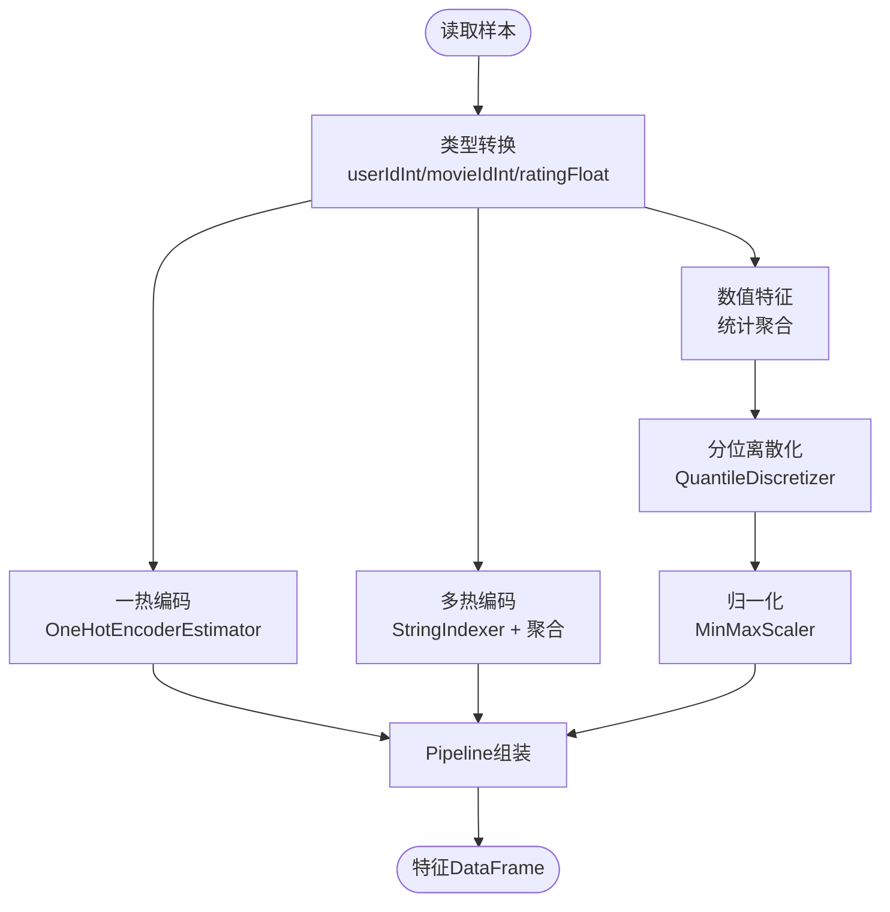
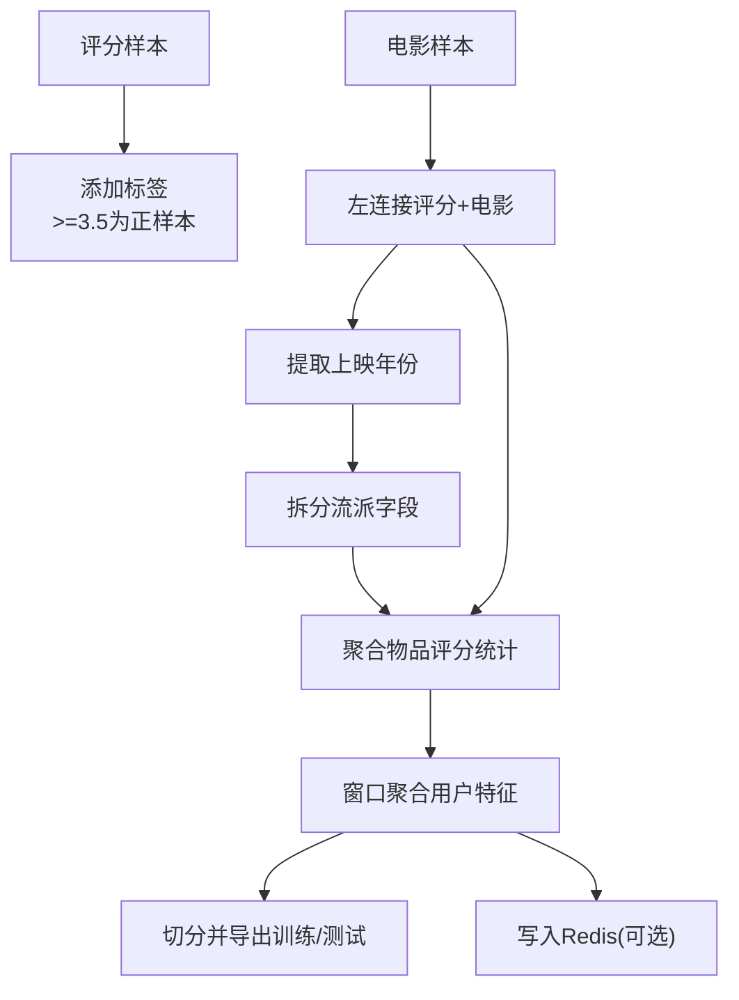
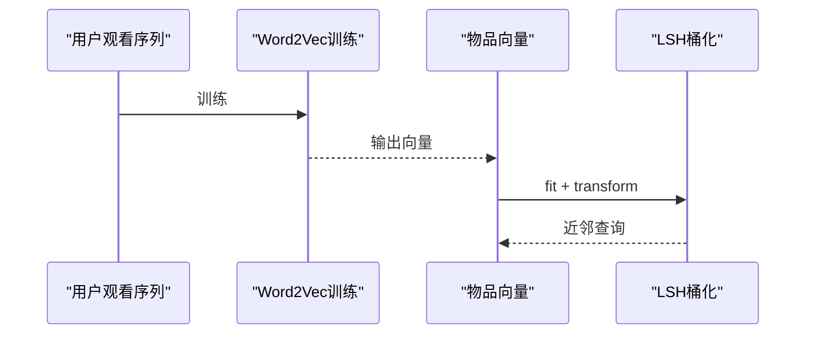
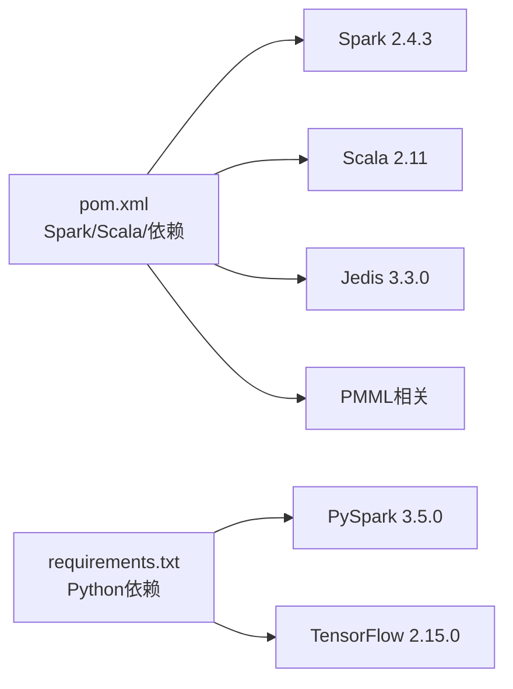

# 离线模型训练

<cite>
**本文引用的文件列表**
- [README.md](file://README.md)
- [pom.xml](file://pom.xml)
- [requirements.txt](file://requirements.txt)
- [CollaborativeFiltering.scala](file://src/main/java/com/sparrowrecsys/offline/spark/model/CollaborativeFiltering.scala)
- [FeatureEngineering.scala](file://src/main/java/com/sparrowrecsys/offline/spark/featureeng/FeatureEngineering.scala)
- [FeatureEngForRecModel.scala](file://src/main/java/com/sparrowrecsys/offline/spark/featureeng/FeatureEngForRecModel.scala)
- [Embedding.scala](file://src/main/java/com/sparrowrecsys/offline/spark/embedding/Embedding.scala)
- [Evaluator.scala](file://src/main/java/com/sparrowrecsys/offline/spark/evaluate/Evaluator.scala)
- [CollaborativeFiltering.py](file://RecPySpark/src/com/sparrowrecsys/offline/pyspark/model/CollaborativeFiltering.py)
- [FeatureEngineering.py](file://RecPySpark/src/com/sparrowrecsys/offline/pyspark/featureeng/FeatureEngineering.py)
- [FeatureEngForRecModel.py](file://RecPySpark/src/com/sparrowrecsys/offline/pyspark/featureeng/FeatureEngForRecModel.py)
- [Embedding.py](file://RecPySpark/src/com/sparrowrecsys/offline/pyspark/embedding/Embedding.py)
</cite>

## 目录
1. [简介](#简介)
2. [项目结构](#项目结构)
3. [核心组件](#核心组件)
4. [架构总览](#架构总览)
5. [详细组件分析](#详细组件分析)
6. [依赖关系分析](#依赖关系分析)
7. [性能与可扩展性](#性能与可扩展性)
8. [故障排查指南](#故障排查指南)
9. [结论](#结论)
10. [附录：完整训练流程与参数建议](#附录完整训练流程与参数建议)

## 简介
本文件面向数据科学家与算法工程师，系统化梳理SparrowRecSys离线模型训练模块，重点覆盖：
- 基于Apache Spark的分布式机器学习实现，以ALS协同过滤为例，说明训练流程、参数调优与评估。
- 特征工程流水线设计与实现，涵盖类别特征预处理、多热编码、数值特征处理等关键步骤。
- 模型评估机制与指标选择依据。
- 对比Scala与Python两种实现方式的差异与适用场景。
- 完整的模型训练流程，从数据准备到模型保存。
- 如何扩展新的推荐算法与特征工程方法。
- 提供可直接定位的代码片段路径与参数配置说明。

## 项目结构
SparrowRecSys采用混合语言架构，离线训练模块主要由两套实现组成：
- Scala实现：位于src/main/java/com/sparrowrecsys/offline/spark/…，使用Spark MLlib与Spark SQL。
- Python实现：位于RecPySpark/src/com/sparrowrecsys/offline/pyspark/…，使用PySpark ML与PySpark SQL。

图表来源
- [CollaborativeFiltering.scala](file://src/main/java/com/sparrowrecsys/offline/spark/model/CollaborativeFiltering.scala#L1-L85)
- [FeatureEngineering.scala](file://src/main/java/com/sparrowrecsys/offline/spark/featureeng/FeatureEngineering.scala#L1-L120)
- [FeatureEngForRecModel.scala](file://src/main/java/com/sparrowrecsys/offline/spark/featureeng/FeatureEngForRecModel.scala#L1-L293)
- [Embedding.scala](file://src/main/java/com/sparrowrecsys/offline/spark/embedding/Embedding.scala#L1-L287)
- [Evaluator.scala](file://src/main/java/com/sparrowrecsys/offline/spark/evaluate/Evaluator.scala#L1-L22)
- [CollaborativeFiltering.py](file://RecPySpark/src/com/sparrowrecsys/offline/pyspark/model/CollaborativeFiltering.py#L1-L51)
- [FeatureEngineering.py](file://RecPySpark/src/com/sparrowrecsys/offline/pyspark/featureeng/FeatureEngineering.py#L1-L77)
- [FeatureEngForRecModel.py](file://RecPySpark/src/com/sparrowrecsys/offline/pyspark/featureeng/FeatureEngForRecModel.py#L1-L156)
- [Embedding.py](file://RecPySpark/src/com/sparrowrecsys/offline/pyspark/embedding/Embedding.py#L1-L202)

章节来源
- [README.md](file://README.md#L1-L57)
- [pom.xml](file://pom.xml#L1-L228)
- [requirements.txt](file://requirements.txt#L1-L4)

## 核心组件
- 协同过滤训练器（ALS）：负责评分预测与推荐生成，支持交叉验证与参数网格搜索。
- 特征工程流水线：包含类别特征索引、多热编码、数值特征离散化与归一化。
- 嵌入式表示：Item2Vec、随机游走图嵌入、LSH近似最近邻检索。
- 评估器：提供回归与二分类指标（如RMSE、AUC-PR、AUC-ROC）。

章节来源
- [CollaborativeFiltering.scala](file://src/main/java/com/sparrowrecsys/offline/spark/model/CollaborativeFiltering.scala#L1-L85)
- [FeatureEngineering.scala](file://src/main/java/com/sparrowrecsys/offline/spark/featureeng/FeatureEngineering.scala#L1-L120)
- [FeatureEngForRecModel.scala](file://src/main/java/com/sparrowrecsys/offline/spark/featureeng/FeatureEngForRecModel.scala#L1-L293)
- [Embedding.scala](file://src/main/java/com/sparrowrecsys/offline/spark/embedding/Embedding.scala#L1-L287)
- [Evaluator.scala](file://src/main/java/com/sparrowrecsys/offline/spark/evaluate/Evaluator.scala#L1-L22)
- [CollaborativeFiltering.py](file://RecPySpark/src/com/sparrowrecsys/offline/pyspark/model/CollaborativeFiltering.py#L1-L51)
- [FeatureEngineering.py](file://RecPySpark/src/com/sparrowrecsys/offline/pyspark/featureeng/FeatureEngineering.py#L1-L77)
- [FeatureEngForRecModel.py](file://RecPySpark/src/com/sparrowrecsys/offline/pyspark/featureeng/FeatureEngForRecModel.py#L1-L156)
- [Embedding.py](file://RecPySpark/src/com/sparrowrecsys/offline/pyspark/embedding/Embedding.py#L1-L202)

## 架构总览
离线训练整体流程分为数据准备、特征工程、模型训练与评估、模型保存四个阶段。Scala与Python实现共享相同的数据源与目标格式，差异主要体现在API风格与工具库选择上。

图表来源
- [CollaborativeFiltering.scala](file://src/main/java/com/sparrowrecsys/offline/spark/model/CollaborativeFiltering.scala#L27-L52)
- [FeatureEngineering.scala](file://src/main/java/com/sparrowrecsys/offline/spark/featureeng/FeatureEngineering.scala#L61-L90)
- [FeatureEngForRecModel.scala](file://src/main/java/com/sparrowrecsys/offline/spark/featureeng/FeatureEngForRecModel.scala#L176-L205)
- [Evaluator.scala](file://src/main/java/com/sparrowrecsys/offline/spark/evaluate/Evaluator.scala#L8-L20)
- [CollaborativeFiltering.py](file://RecPySpark/src/com/sparrowrecsys/offline/pyspark/model/CollaborativeFiltering.py#L15-L31)
- [FeatureEngineering.py](file://RecPySpark/src/com/sparrowrecsys/offline/pyspark/featureeng/FeatureEngineering.py#L41-L57)
- [FeatureEngForRecModel.py](file://RecPySpark/src/com/sparrowrecsys/offline/pyspark/featureeng/FeatureEngForRecModel.py#L116-L138)

## 详细组件分析

### 协同过滤（ALS）训练与评估
- 数据准备：读取评分数据，转换类型为整数/浮点数，划分训练/测试集。
- 模型训练：设置正则化参数、迭代次数、用户/物品列名；冷启动策略设为丢弃以避免NaN。
- 评估：使用回归评估器计算RMSE；可选二分类评估（AUC-PR/AUC-ROC）。
- 推荐生成：为所有用户/物品生成Top-N推荐，或针对子集生成。
- 参数调优：使用交叉验证与参数网格搜索（示例中regParam为单值网格）。

图表来源
- [CollaborativeFiltering.scala](file://src/main/java/com/sparrowrecsys/offline/spark/model/CollaborativeFiltering.scala#L27-L81)
- [Evaluator.scala](file://src/main/java/com/sparrowrecsys/offline/spark/evaluate/Evaluator.scala#L8-L20)
- [CollaborativeFiltering.py](file://RecPySpark/src/com/sparrowrecsys/offline/pyspark/model/CollaborativeFiltering.py#L15-L48)

章节来源
- [CollaborativeFiltering.scala](file://src/main/java/com/sparrowrecsys/offline/spark/model/CollaborativeFiltering.scala#L12-L84)
- [CollaborativeFiltering.py](file://RecPySpark/src/com/sparrowrecsys/offline/pyspark/model/CollaborativeFiltering.py#L9-L50)
- [Evaluator.scala](file://src/main/java/com/sparrowrecsys/offline/spark/evaluate/Evaluator.scala#L7-L21)

### 特征工程流水线（类别/多热编码与数值特征）
- 一热编码：对类别ID进行索引与向量化输出。
- 多热编码：字符串类别先索引，再按物品聚合生成稀疏向量。
- 数值特征：统计聚合（计数、均值、方差），分位离散化（QuantileDiscretizer），归一化（MinMaxScaler），并以Pipeline串联。

图表来源
- [FeatureEngineering.scala](file://src/main/java/com/sparrowrecsys/offline/spark/featureeng/FeatureEngineering.scala#L16-L90)
- [FeatureEngineering.py](file://RecPySpark/src/com/sparrowrecsys/offline/pyspark/featureeng/FeatureEngineering.py#L11-L57)

章节来源
- [FeatureEngineering.scala](file://src/main/java/com/sparrowrecsys/offline/spark/featureeng/FeatureEngineering.scala#L16-L90)
- [FeatureEngineering.py](file://RecPySpark/src/com/sparrowrecsys/offline/pyspark/featureeng/FeatureEngineering.py#L11-L57)

### 针对推荐模型的特征工程（样本标签、用户/物品特征）
- 样本标签：将评分阈值转化为二分类标签（如≥3.5为正样本）。
- 物品特征：提取上映年份、标题、拆分流派，聚合评分统计特征。
- 用户特征：滑动窗口内正样本历史、评分计数、平均/标准差、偏好流派Top-K等。
- 数据切分：支持随机切分与按时间戳切分，导出训练/测试CSV。
- 在线特征落库：可选将最新特征写入Redis，便于在线推理。

图表来源
- [FeatureEngForRecModel.scala](file://src/main/java/com/sparrowrecsys/offline/spark/featureeng/FeatureEngForRecModel.scala#L21-L130)
- [FeatureEngForRecModel.py](file://RecPySpark/src/com/sparrowrecsys/offline/pyspark/featureeng/FeatureEngForRecModel.py#L12-L113)

章节来源
- [FeatureEngForRecModel.scala](file://src/main/java/com/sparrowrecsys/offline/spark/featureeng/FeatureEngForRecModel.scala#L21-L205)
- [FeatureEngForRecModel.py](file://RecPySpark/src/com/sparrowrecsys/offline/pyspark/featureeng/FeatureEngForRecModel.py#L12-L138)

### 嵌入式表示与相似度检索
- Item2Vec：基于用户观看序列的Word2Vec训练，输出物品向量并可导出至文件/Redis。
- 图嵌入：通过随机游走构建序列，统计转移概率矩阵，训练Item2Vec得到图嵌入。
- LSH近似最近邻：对物品向量进行桶化，快速检索近邻。

图表来源
- [Embedding.scala](file://src/main/java/com/sparrowrecsys/offline/spark/embedding/Embedding.scala#L103-L138)
- [Embedding.scala](file://src/main/java/com/sparrowrecsys/offline/spark/embedding/Embedding.scala#L230-L252)
- [Embedding.py](file://RecPySpark/src/com/sparrowrecsys/offline/pyspark/embedding/Embedding.py#L67-L81)
- [Embedding.py](file://RecPySpark/src/com/sparrowrecsys/offline/pyspark/embedding/Embedding.py#L48-L64)

章节来源
- [Embedding.scala](file://src/main/java/com/sparrowrecsys/offline/spark/embedding/Embedding.scala#L27-L138)
- [Embedding.py](file://RecPySpark/src/com/sparrowrecsys/offline/pyspark/embedding/Embedding.py#L33-L81)

### 评估机制与指标选择
- 回归评估：ALS默认使用RMSE评估评分预测误差。
- 二分类评估：使用二分类指标（AUC-PR、AUC-ROC）评估点击/偏好预测任务。
- 指标选择依据：RMSE用于评分预测；AUC-PR/AUC-ROC用于不平衡样本的排序任务。

章节来源
- [CollaborativeFiltering.scala](file://src/main/java/com/sparrowrecsys/offline/spark/model/CollaborativeFiltering.scala#L47-L52)
- [Evaluator.scala](file://src/main/java/com/sparrowrecsys/offline/spark/evaluate/Evaluator.scala#L8-L20)
- [CollaborativeFiltering.py](file://RecPySpark/src/com/sparrowrecsys/offline/pyspark/model/CollaborativeFiltering.py#L29-L31)

## 依赖关系分析
- Spark版本与Scala版本：pom.xml中定义了Spark 2.4.3与Scala 2.11。
- Python环境：requirements.txt声明了pyspark 3.5.0与tensorflow 2.15.0。
- 依赖范围：离线模块依赖spark-core、spark-sql、spark-mllib、Jedis（Redis客户端）、PMML相关库等。

图表来源
- [pom.xml](file://pom.xml#L11-L228)
- [requirements.txt](file://requirements.txt#L1-L4)

章节来源
- [pom.xml](file://pom.xml#L11-L228)
- [requirements.txt](file://requirements.txt#L1-L4)

## 性能与可扩展性
- 分布式执行：Spark将DataFrame与ML管道分布到集群节点，适合大规模数据。
- 特征工程优化：Pipeline串联可减少中间物化开销；多热编码使用稀疏向量降低内存占用。
- 评估与调参：交叉验证fold数应≥3；参数网格应结合业务预算与数据规模进行剪枝。
- 嵌入与检索：LSH桶长与哈希表数量影响召回质量与查询延迟，需权衡。
- 扩展新算法：新增算法时，保持统一的DataFrame接口与评估器抽象，便于替换与集成。

[本节为通用指导，不直接分析具体文件]

## 故障排查指南
- 冷启动问题：ALS冷启动策略设为丢弃可避免NaN；若仍出现异常，检查用户/物品ID映射与类型转换。
- 数据类型不匹配：确保userId、movieId、rating列已正确转换为整数/浮点类型。
- 评估指标异常：确认标签列与预测列名称一致；二分类评估需概率向量第二维作为正类分数。
- 特征工程失败：多热编码前需保证类别索引完成且indexSize正确；Pipeline需先fit再transform。
- 嵌入与Redis：确认Redis端口与连通性；导出向量时注意路径权限与文件存在性。

章节来源
- [CollaborativeFiltering.scala](file://src/main/java/com/sparrowrecsys/offline/spark/model/CollaborativeFiltering.scala#L41-L42)
- [Evaluator.scala](file://src/main/java/com/sparrowrecsys/offline/spark/evaluate/Evaluator.scala#L12-L14)
- [FeatureEngineering.scala](file://src/main/java/com/sparrowrecsys/offline/spark/featureeng/FeatureEngineering.scala#L35-L53)
- [Embedding.scala](file://src/main/java/com/sparrowrecsys/offline/spark/embedding/Embedding.scala#L230-L252)

## 结论
SparrowRecSys离线训练模块提供了完整的ALS协同过滤、特征工程与嵌入式表示方案，支持Scala与Python双栈实现。通过Pipeline化的特征工程与交叉验证参数调优，可在大规模数据上高效训练并评估推荐模型。建议在生产环境中结合业务指标与资源预算，持续迭代特征与算法参数，确保模型稳定性与可扩展性。

[本节为总结，不直接分析具体文件]

## 附录：完整训练流程与参数建议

### 完整训练流程（从数据准备到模型保存）
- 数据准备
  - 读取ratings.csv与movies.csv，进行类型转换与清洗。
  - 划分训练/测试集（随机或按时间戳）。
- 特征工程
  - 一热编码与多热编码：对类别特征进行索引与向量化。
  - 数值特征：统计聚合、分位离散化、归一化。
  - 组合用户/物品特征：滑动窗口聚合、标签构造。
- 模型训练
  - ALS训练：设置正则化参数、迭代次数、用户/物品列名。
  - 冷启动策略：drop以避免NaN。
- 模型评估
  - 回归：RMSE；二分类：AUC-PR/AUC-ROC。
- 模型保存
  - ALS模型因子与嵌入向量导出至文件或Redis。
  - 训练/测试样本导出为CSV以便复现与调试。

章节来源
- [CollaborativeFiltering.scala](file://src/main/java/com/sparrowrecsys/offline/spark/model/CollaborativeFiltering.scala#L27-L81)
- [FeatureEngineering.scala](file://src/main/java/com/sparrowrecsys/offline/spark/featureeng/FeatureEngineering.scala#L61-L90)
- [FeatureEngForRecModel.scala](file://src/main/java/com/sparrowrecsys/offline/spark/featureeng/FeatureEngForRecModel.scala#L176-L205)
- [Embedding.scala](file://src/main/java/com/sparrowrecsys/offline/spark/embedding/Embedding.scala#L103-L138)
- [CollaborativeFiltering.py](file://RecPySpark/src/com/sparrowrecsys/offline/pyspark/model/CollaborativeFiltering.py#L15-L48)
- [FeatureEngineering.py](file://RecPySpark/src/com/sparrowrecsys/offline/pyspark/featureeng/FeatureEngineering.py#L41-L57)
- [FeatureEngForRecModel.py](file://RecPySpark/src/com/sparrowrecsys/offline/pyspark/featureeng/FeatureEngForRecModel.py#L116-L138)
- [Embedding.py](file://RecPySpark/src/com/sparrowrecsys/offline/pyspark/embedding/Embedding.py#L67-L81)

### 参数调优建议
- ALS
  - 正则化参数：从较小值开始网格搜索（如0.01），观察过拟合与欠拟合。
  - 迭代次数：根据收敛情况与性能预算调整。
  - rank：通常在50~200之间，结合数据规模与内存预算。
- 特征工程
  - 分位离散化桶数：100较为稳健；可根据分布复杂度调整。
  - 归一化：MinMaxScaler适用于有界范围特征；标准化适用于高斯分布近似特征。
- 评估
  - 使用交叉验证与多折评估，关注稳定性与泛化能力。

章节来源
- [CollaborativeFiltering.scala](file://src/main/java/com/sparrowrecsys/offline/spark/model/CollaborativeFiltering.scala#L71-L81)
- [CollaborativeFiltering.py](file://RecPySpark/src/com/sparrowrecsys/offline/pyspark/model/CollaborativeFiltering.py#L46-L48)
- [FeatureEngineering.scala](file://src/main/java/com/sparrowrecsys/offline/spark/featureeng/FeatureEngineering.scala#L75-L84)

### Scala与Python实现差异与适用场景
- API风格
  - Scala：函数式风格，类型安全，Pipeline与UDF更贴近原生Spark API。
  - Python：易用性强，生态丰富，适合快速原型与实验。
- 工具库
  - Spark ML与MLlib在两套实现中功能一致，但Python侧可直接使用pyspark.sql.functions与UDF。
- 适用场景
  - Scala：生产级离线批处理、与现有Spark生态深度集成。
  - Python：数据科学探索、快速迭代与可视化。

章节来源
- [CollaborativeFiltering.scala](file://src/main/java/com/sparrowrecsys/offline/spark/model/CollaborativeFiltering.scala#L1-L85)
- [CollaborativeFiltering.py](file://RecPySpark/src/com/sparrowrecsys/offline/pyspark/model/CollaborativeFiltering.py#L1-L51)
- [FeatureEngineering.scala](file://src/main/java/com/sparrowrecsys/offline/spark/featureeng/FeatureEngineering.scala#L1-L120)
- [FeatureEngineering.py](file://RecPySpark/src/com/sparrowrecsys/offline/pyspark/featureeng/FeatureEngineering.py#L1-L77)
- [FeatureEngForRecModel.scala](file://src/main/java/com/sparrowrecsys/offline/spark/featureeng/FeatureEngForRecModel.scala#L1-L293)
- [FeatureEngForRecModel.py](file://RecPySpark/src/com/sparrowrecsys/offline/pyspark/featureeng/FeatureEngForRecModel.py#L1-L156)
- [Embedding.scala](file://src/main/java/com/sparrowrecsys/offline/spark/embedding/Embedding.scala#L1-L287)
- [Embedding.py](file://RecPySpark/src/com/sparrowrecsys/offline/pyspark/embedding/Embedding.py#L1-L202)

### 扩展新算法与特征工程方法
- 新算法接入
  - 实现统一的DataFrame接口（用户列、物品列、评分列）。
  - 提供fit/transform方法，支持交叉验证与评估器。
  - 将模型因子或嵌入导出为标准格式，便于在线服务消费。
- 新特征工程
  - 优先使用Pipeline串联，确保训练/预测一致性。
  - 对类别特征采用索引+编码策略；对文本/序列采用Word2Vec/随机游走等方法。
  - 评估特征有效性：A/B实验或离线指标对比。

[本节为通用指导，不直接分析具体文件]