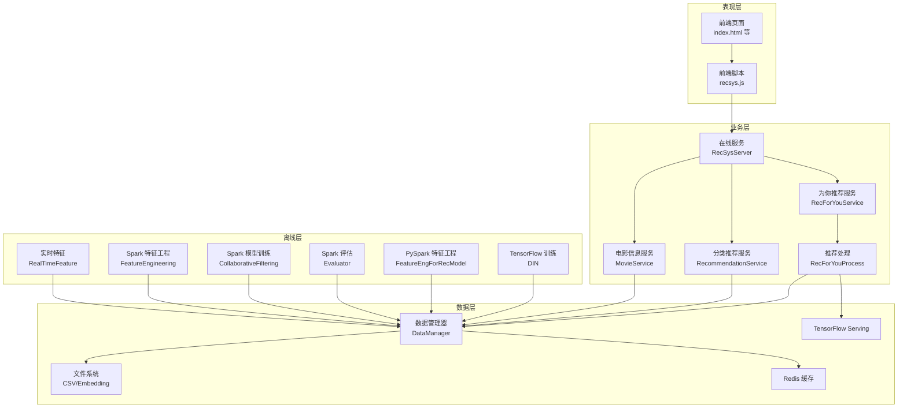
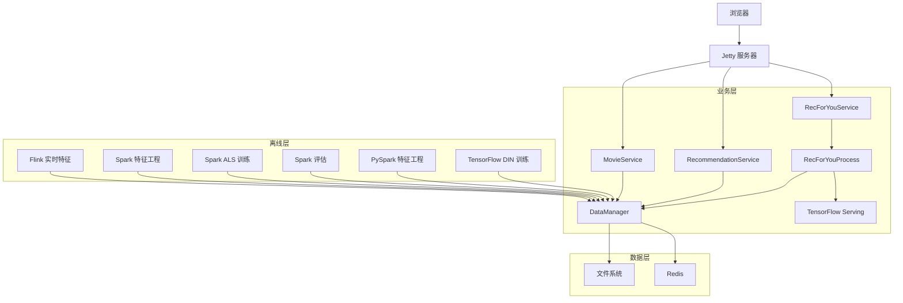
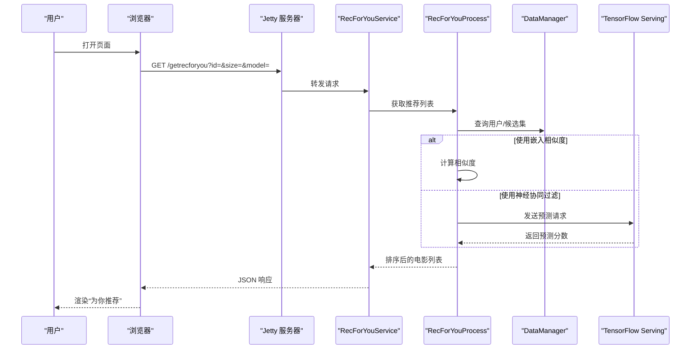
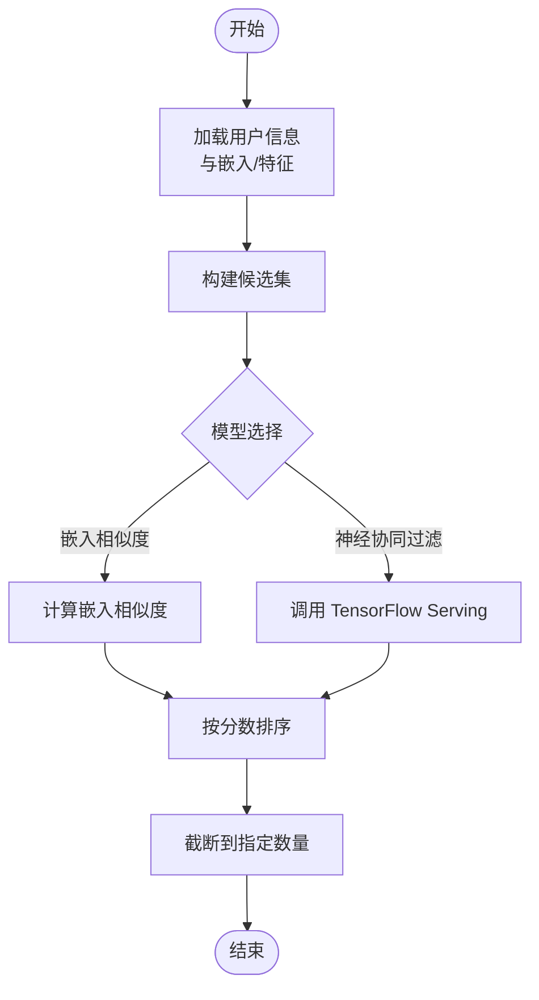
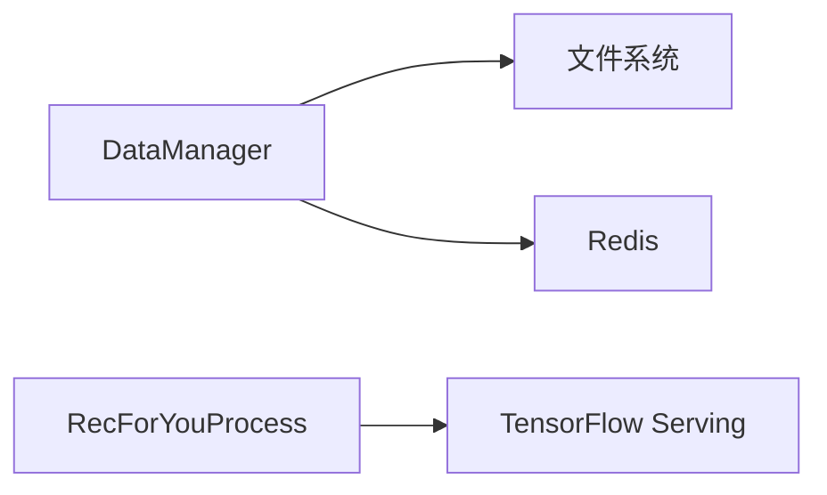
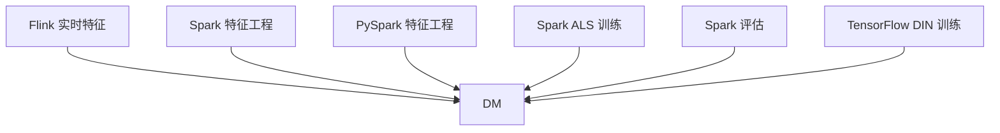
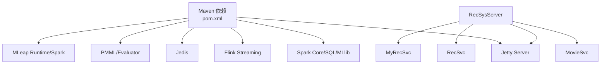

# 分层架构

<cite>
**本文引用的文件**
- [README.md](file://README.md)
- [pom.xml](file://pom.xml)
- [RecSysServer.java](file://src/main/java/com/sparrowrecsys/online/RecSysServer.java)
- [MovieService.java](file://src/main/java/com/sparrowrecsys/online/service/MovieService.java)
- [RecommendationService.java](file://src/main/java/com/sparrowrecsys/online/service/RecommendationService.java)
- [RecForYouService.java](file://src/main/java/com/sparrowrecsys/online/service/RecForYouService.java)
- [RecForYouProcess.java](file://src/main/java/com/sparrowrecsys/online/recprocess/RecForYouProcess.java)
- [DataManager.java](file://src/main/java/com/sparrowrecsys/online/datamanager/DataManager.java)
- [RealTimeFeature.java](file://src/main/java/com/sparrowrecsys/nearline/flink/RealTimeFeature.java)
- [Evaluator.scala](file://src/main/java/com/sparrowrecsys/offline/spark/evaluate/Evaluator.scala)
- [CollaborativeFiltering.scala](file://src/main/java/com/sparrowrecsys/offline/spark/model/CollaborativeFiltering.scala)
- [FeatureEngineering.scala](file://src/main/java/com/sparrowrecsys/offline/spark/featureeng/FeatureEngineering.scala)
- [FeatureEngForRecModel.py](file://RecPySpark/src/com/sparrowrecsys/offline/pyspark/featureeng/FeatureEngForRecModel.py)
- [DIN.py](file://TFRecModel/src/com/sparrowrecsys/offline/tensorflow/DIN.py)
- [recsys.js](file://src/main/resources/webroot/js/recsys.js)
</cite>

## 目录
1. [引言](#引言)
2. [项目结构](#项目结构)
3. [核心组件](#核心组件)
4. [架构总览](#架构总览)
5. [详细组件分析](#详细组件分析)
6. [依赖分析](#依赖分析)
7. [性能考量](#性能考量)
8. [故障排查指南](#故障排查指南)
9. [结论](#结论)
10. [附录](#附录)

## 引言
本文件围绕SparrowRecSys的分层架构设计展开，系统采用经典的工业级推荐系统分层：表现层（前端与HTTP服务）、业务层（在线服务与业务编排）、数据层（内存数据与外部存储）。通过该分层，系统实现了职责清晰、边界明确、可扩展性强的推荐服务组织方式。本文将从架构理念、职责划分、数据与控制流、优势与局限、最佳实践与扩展性等方面进行深入解析，并提供架构图与组件层次图以帮助理解。

## 项目结构
SparrowRecSys是一个混合语言的推荐系统，包含Java/Scala在线服务、Python PySpark离线特征工程、TensorFlow离线模型训练与推理、以及前端静态资源与脚本。项目采用Maven管理依赖，主入口为在线服务的Jetty服务器，负责绑定多个Servlet以提供REST风格的推荐接口；离线侧包含Spark与Flink流水线，支撑特征工程、模型训练与评估。

图表来源
- [RecSysServer.java](file://src/main/java/com/sparrowrecsys/online/RecSysServer.java#L64-L70)
- [MovieService.java](file://src/main/java/com/sparrowrecsys/online/service/MovieService.java#L16-L39)
- [RecommendationService.java](file://src/main/java/com/sparrowrecsys/online/service/RecommendationService.java#L18-L40)
- [RecForYouService.java](file://src/main/java/com/sparrowrecsys/online/service/RecForYouService.java#L20-L47)
- [RecForYouProcess.java](file://src/main/java/com/sparrowrecsys/online/recprocess/RecForYouProcess.java#L29-L60)
- [DataManager.java](file://src/main/java/com/sparrowrecsys/online/datamanager/DataManager.java#L13-L50)
- [RealTimeFeature.java](file://src/main/java/com/sparrowrecsys/nearline/flink/RealTimeFeature.java#L30-L68)
- [FeatureEngineering.scala](file://src/main/java/com/sparrowrecsys/offline/spark/featureeng/FeatureEngineering.scala#L11-L118)
- [CollaborativeFiltering.scala](file://src/main/java/com/sparrowrecsys/offline/spark/model/CollaborativeFiltering.scala#L10-L85)
- [Evaluator.scala](file://src/main/java/com/sparrowrecsys/offline/spark/evaluate/Evaluator.scala#L7-L21)
- [FeatureEngForRecModel.py](file://RecPySpark/src/com/sparrowrecsys/offline/pyspark/featureeng/FeatureEngForRecModel.py#L141-L156)
- [DIN.py](file://TFRecModel/src/com/sparrowrecsys/offline/tensorflow/DIN.py#L1-L190)
- [recsys.js](file://src/main/resources/webroot/js/recsys.js#L100-L178)

章节来源
- [README.md](file://README.md#L19-L21)
- [pom.xml](file://pom.xml#L39-L75)

## 核心组件
- 表现层
  - 在线服务入口：RecSysServer负责启动Jetty服务器、加载静态资源、注册Servlet端点。
  - 业务服务：MovieService、RecommendationService、RecForYouService分别提供电影详情、按类别推荐、个性化推荐等REST接口。
  - 前端脚本：recsys.js通过AJAX调用后端接口，渲染页面内容。
- 业务层
  - 数据管理器：DataManager统一加载与缓存电影、评分、链接、嵌入向量等数据，提供查询接口。
  - 推荐处理：RecForYouProcess封装个性化推荐的核心排序与候选生成逻辑，支持嵌入相似度与TensorFlow Serving推理。
- 数据层
  - 文件系统：movies.csv、links.csv、ratings.csv、embedding文件等。
  - Redis：存储嵌入向量与特征，供实时查询。
  - 外部推理：TensorFlow Serving提供模型预测能力。
- 离线层
  - 实时特征：Flink监控评分文件变化，计算用户最近观看等实时特征。
  - 特征工程：Spark与PySpark分别实现特征工程与样本构造。
  - 模型训练与评估：Spark ALS、Evaluator；TensorFlow DIN训练与评估脚本。

章节来源
- [RecSysServer.java](file://src/main/java/com/sparrowrecsys/online/RecSysServer.java#L27-L78)
- [MovieService.java](file://src/main/java/com/sparrowrecsys/online/service/MovieService.java#L16-L44)
- [RecommendationService.java](file://src/main/java/com/sparrowrecsys/online/service/RecommendationService.java#L18-L46)
- [RecForYouService.java](file://src/main/java/com/sparrowrecsys/online/service/RecForYouService.java#L20-L53)
- [RecForYouProcess.java](file://src/main/java/com/sparrowrecsys/online/recprocess/RecForYouProcess.java#L29-L138)
- [DataManager.java](file://src/main/java/com/sparrowrecsys/online/datamanager/DataManager.java#L13-L294)
- [RealTimeFeature.java](file://src/main/java/com/sparrowrecsys/nearline/flink/RealTimeFeature.java#L30-L72)
- [FeatureEngineering.scala](file://src/main/java/com/sparrowrecsys/offline/spark/featureeng/FeatureEngineering.scala#L11-L118)
- [CollaborativeFiltering.scala](file://src/main/java/com/sparrowrecsys/offline/spark/model/CollaborativeFiltering.scala#L10-L85)
- [Evaluator.scala](file://src/main/java/com/sparrowrecsys/offline/spark/evaluate/Evaluator.scala#L7-L21)
- [FeatureEngForRecModel.py](file://RecPySpark/src/com/sparrowrecsys/offline/pyspark/featureeng/FeatureEngForRecModel.py#L141-L156)
- [DIN.py](file://TFRecModel/src/com/sparrowrecsys/offline/tensorflow/DIN.py#L1-L190)
- [recsys.js](file://src/main/resources/webroot/js/recsys.js#L100-L178)

## 架构总览
SparrowRecSys采用分层架构，目标是将“如何展示”（表现层）、“如何处理业务逻辑”（业务层）与“如何访问与组织数据”（数据层）解耦。在线服务通过Servlet暴露REST接口，业务层通过数据管理器访问本地或Redis中的数据，必要时调用TensorFlow Serving进行推理，离线层通过Spark/Flink完成特征工程、模型训练与评估。

图表来源
- [RecSysServer.java](file://src/main/java/com/sparrowrecsys/online/RecSysServer.java#L64-L70)
- [MovieService.java](file://src/main/java/com/sparrowrecsys/online/service/MovieService.java#L18-L39)
- [RecommendationService.java](file://src/main/java/com/sparrowrecsys/online/service/RecommendationService.java#L18-L40)
- [RecForYouService.java](file://src/main/java/com/sparrowrecsys/online/service/RecForYouService.java#L20-L47)
- [RecForYouProcess.java](file://src/main/java/com/sparrowrecsys/online/recprocess/RecForYouProcess.java#L113-L138)
- [DataManager.java](file://src/main/java/com/sparrowrecsys/online/datamanager/DataManager.java#L40-L50)
- [RealTimeFeature.java](file://src/main/java/com/sparrowrecsys/nearline/flink/RealTimeFeature.java#L30-L68)
- [FeatureEngineering.scala](file://src/main/java/com/sparrowrecsys/offline/spark/featureeng/FeatureEngineering.scala#L92-L118)
- [CollaborativeFiltering.scala](file://src/main/java/com/sparrowrecsys/offline/spark/model/CollaborativeFiltering.scala#L12-L85)
- [Evaluator.scala](file://src/main/java/com/sparrowrecsys/offline/spark/evaluate/Evaluator.scala#L7-L21)
- [FeatureEngForRecModel.py](file://RecPySpark/src/com/sparrowrecsys/offline/pyspark/featureeng/FeatureEngForRecModel.py#L141-L156)
- [DIN.py](file://TFRecModel/src/com/sparrowrecsys/offline/tensorflow/DIN.py#L1-L190)

## 详细组件分析

### 表现层：前端与在线服务
- 在线服务入口
  - RecSysServer负责启动Jetty服务器，设置静态资源根目录，加载电影、评分、链接与嵌入数据至DataManager，注册多个Servlet端点以提供REST服务。
- 业务服务
  - MovieService：根据电影ID返回JSON格式的电影信息。
  - RecommendationService：按类别与排序策略返回电影列表。
  - RecForYouService：根据用户ID与模型参数返回个性化推荐列表。
- 前端脚本
  - recsys.js通过AJAX请求后端接口，动态渲染页面内容，如“为你推荐”、“相关电影”、“用户历史”等区域。

图表来源
- [RecForYouService.java](file://src/main/java/com/sparrowrecsys/online/service/RecForYouService.java#L20-L47)
- [RecForYouProcess.java](file://src/main/java/com/sparrowrecsys/online/recprocess/RecForYouProcess.java#L29-L138)
- [DataManager.java](file://src/main/java/com/sparrowrecsys/online/datamanager/DataManager.java#L285-L293)
- [recsys.js](file://src/main/resources/webroot/js/recsys.js#L157-L178)

章节来源
- [RecSysServer.java](file://src/main/java/com/sparrowrecsys/online/RecSysServer.java#L27-L78)
- [MovieService.java](file://src/main/java/com/sparrowrecsys/online/service/MovieService.java#L16-L44)
- [RecommendationService.java](file://src/main/java/com/sparrowrecsys/online/service/RecommendationService.java#L18-L46)
- [RecForYouService.java](file://src/main/java/com/sparrowrecsys/online/service/RecForYouService.java#L20-L53)
- [recsys.js](file://src/main/resources/webroot/js/recsys.js#L100-L178)

### 业务层：数据管理与推荐处理
- 数据管理器（DataManager）
  - 单例模式，负责加载电影、链接、评分、嵌入向量与特征数据，维护电影与用户映射、类型反向索引等，提供按类别筛选、排序与查询接口。
- 推荐处理（RecForYouProcess）
  - 生成候选集、加载用户嵌入与特征、根据模型（嵌入相似度或神经协同过滤）进行打分与排序，最终返回Top-N结果。
  - 当启用AB测试时，根据用户ID选择模型配置。

图表来源
- [RecForYouProcess.java](file://src/main/java/com/sparrowrecsys/online/recprocess/RecForYouProcess.java#L29-L92)
- [DataManager.java](file://src/main/java/com/sparrowrecsys/online/datamanager/DataManager.java#L252-L283)

章节来源
- [DataManager.java](file://src/main/java/com/sparrowrecsys/online/datamanager/DataManager.java#L13-L294)
- [RecForYouProcess.java](file://src/main/java/com/sparrowrecsys/online/recprocess/RecForYouProcess.java#L29-L138)

### 数据层：数据加载与存储
- 文件系统与Redis
  - DataManager支持从文件系统或Redis加载嵌入向量与特征，适配不同部署场景。
- 外部推理
  - RecForYouProcess通过HTTP调用TensorFlow Serving获取预测分数，实现在线推理与排序。

图表来源
- [DataManager.java](file://src/main/java/com/sparrowrecsys/online/datamanager/DataManager.java#L40-L50)
- [RecForYouProcess.java](file://src/main/java/com/sparrowrecsys/online/recprocess/RecForYouProcess.java#L113-L138)

章节来源
- [DataManager.java](file://src/main/java/com/sparrowrecsys/online/datamanager/DataManager.java#L89-L164)
- [RecForYouProcess.java](file://src/main/java/com/sparrowrecsys/online/recprocess/RecForYouProcess.java#L113-L138)

### 离线层：特征工程、模型训练与评估
- 实时特征（Flink）
  - 监控评分文件变化，按用户窗口化聚合，输出最新观看记录等实时特征。
- 特征工程（Spark/PySpark）
  - 构造标签、提取年份、拆分类型、统计评分特征、构造用户近期观影序列等，产出训练样本。
- 模型训练与评估（Spark/TensorFlow）
  - Spark ALS训练协同过滤模型并评估；Evaluator计算AUC；TensorFlow DIN训练深度模型并评估。

图表来源
- [RealTimeFeature.java](file://src/main/java/com/sparrowrecsys/nearline/flink/RealTimeFeature.java#L30-L68)
- [FeatureEngineering.scala](file://src/main/java/com/sparrowrecsys/offline/spark/featureeng/FeatureEngineering.scala#L92-L118)
- [FeatureEngForRecModel.py](file://RecPySpark/src/com/sparrowrecsys/offline/pyspark/featureeng/FeatureEngForRecModel.py#L141-L156)
- [CollaborativeFiltering.scala](file://src/main/java/com/sparrowrecsys/offline/spark/model/CollaborativeFiltering.scala#L12-L85)
- [Evaluator.scala](file://src/main/java/com/sparrowrecsys/offline/spark/evaluate/Evaluator.scala#L7-L21)
- [DIN.py](file://TFRecModel/src/com/sparrowrecsys/offline/tensorflow/DIN.py#L1-L190)

章节来源
- [RealTimeFeature.java](file://src/main/java/com/sparrowrecsys/nearline/flink/RealTimeFeature.java#L30-L72)
- [FeatureEngineering.scala](file://src/main/java/com/sparrowrecsys/offline/spark/featureeng/FeatureEngineering.scala#L11-L118)
- [FeatureEngForRecModel.py](file://RecPySpark/src/com/sparrowrecsys/offline/pyspark/featureeng/FeatureEngForRecModel.py#L141-L156)
- [CollaborativeFiltering.scala](file://src/main/java/com/sparrowrecsys/offline/spark/model/CollaborativeFiltering.scala#L10-L85)
- [Evaluator.scala](file://src/main/java/com/sparrowrecsys/offline/spark/evaluate/Evaluator.scala#L7-L21)
- [DIN.py](file://TFRecModel/src/com/sparrowrecsys/offline/tensorflow/DIN.py#L1-L190)

## 依赖分析
- 运行时依赖
  - 在线服务依赖Jetty Servlet容器与HTTP客户端；离线依赖Spark、Flink、Redis、PMML、MLeap等。
- 组件耦合
  - 业务层通过DataManager抽象访问数据，降低对具体存储的耦合；推荐处理与TensorFlow Serving之间通过HTTP接口解耦。
- 可能的循环依赖
  - 当前结构以DataManager为中心向外提供查询接口，未见明显循环依赖。

图表来源
- [pom.xml](file://pom.xml#L60-L226)
- [RecSysServer.java](file://src/main/java/com/sparrowrecsys/online/RecSysServer.java#L64-L70)

章节来源
- [pom.xml](file://pom.xml#L60-L226)

## 性能考量
- 数据访问优化
  - DataManager维护类型反向索引与用户/电影映射，减少扫描成本；嵌入向量与特征可从Redis读取，降低磁盘IO。
- 排序与候选集
  - RecForYouProcess先构建较大候选集再排序，避免过早裁剪导致遗漏高分项；支持多种排序策略。
- 推理与网络
  - TensorFlow Serving异步请求，建议在生产环境配置连接池与超时重试；对热点用户可做本地缓存。
- 离线批处理
  - Spark/Flink作业按分区与广播变量优化，特征工程尽量使用向量化操作与列式存储。

## 故障排查指南
- 服务启动失败
  - 检查RecSysServer是否正确加载静态资源路径与数据文件；确认端口占用与环境变量。
- 接口无响应
  - 检查Servlet映射与请求参数（id、size、model、sortby）；查看异常日志。
- 推荐为空
  - 确认DataManager已加载嵌入与特征；检查Redis键空间与TF Serving可用性。
- 实时特征不更新
  - 检查Flink监控路径与文件权限；确认窗口化与聚合逻辑。

章节来源
- [RecSysServer.java](file://src/main/java/com/sparrowrecsys/online/RecSysServer.java#L27-L78)
- [RecForYouService.java](file://src/main/java/com/sparrowrecsys/online/service/RecForYouService.java#L20-L53)
- [RecForYouProcess.java](file://src/main/java/com/sparrowrecsys/online/recprocess/RecForYouProcess.java#L113-L138)
- [RealTimeFeature.java](file://src/main/java/com/sparrowrecsys/nearline/flink/RealTimeFeature.java#L30-L72)

## 结论
SparrowRecSys的分层架构清晰地分离了表现、业务与数据职责，既满足了快速迭代的开发需求，也为后续扩展（如引入更多模型、增强实时特征、优化缓存策略）提供了良好基础。通过DataManager抽象与Servlet接口，系统在保持简洁的同时具备了较强的可维护性与可扩展性。

## 附录
- 最佳实践
  - 将数据访问集中到DataManager，避免在业务类中直接操作存储。
  - 对热点数据建立多级缓存（内存/Redis/CDN），降低延迟。
  - 推荐处理模块化，便于A/B测试与灰度发布。
  - 离线特征工程与模型训练与在线服务解耦，通过文件/消息队列同步。
- 扩展性考虑
  - 引入更复杂的排序模型（如DIN/ESMM）时，保持RecForYouProcess接口稳定。
  - 支持多源嵌入与特征融合，提升召回与精排质量。
  - 增强监控与日志，结合Prometheus/Grafana观测关键指标。