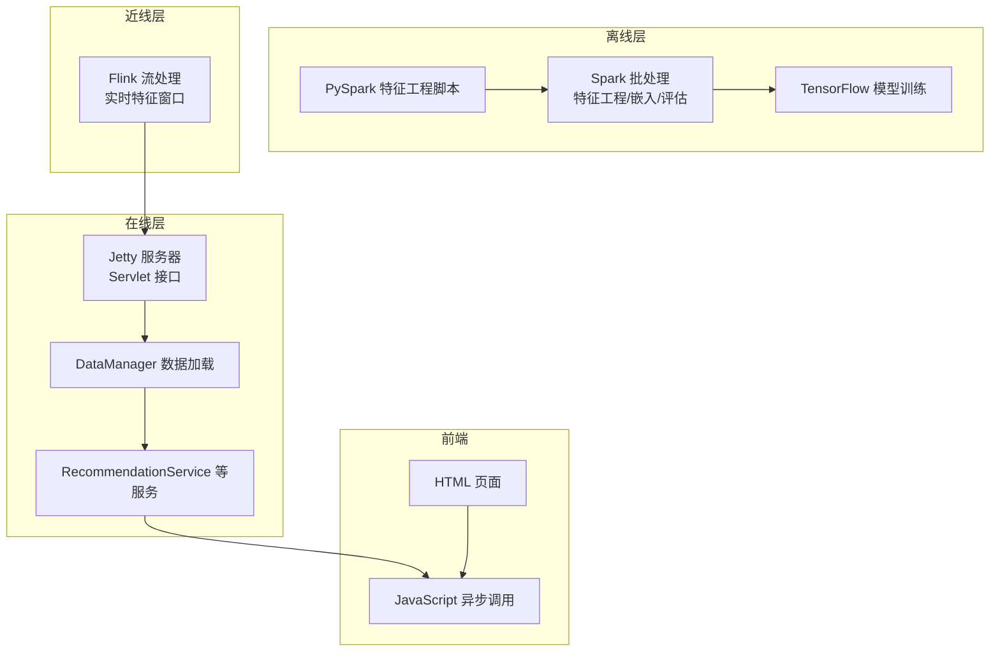
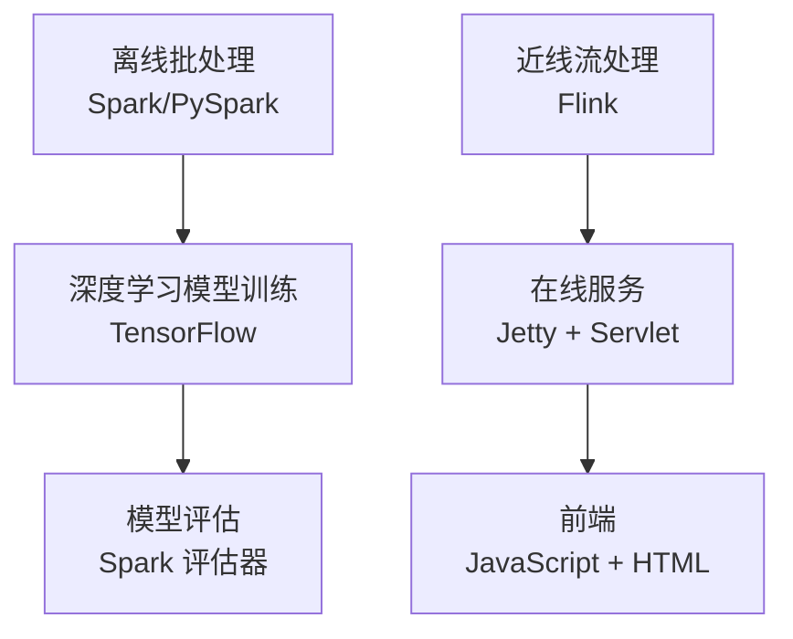
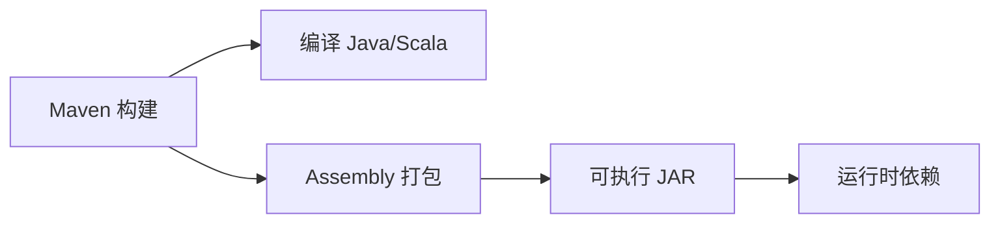
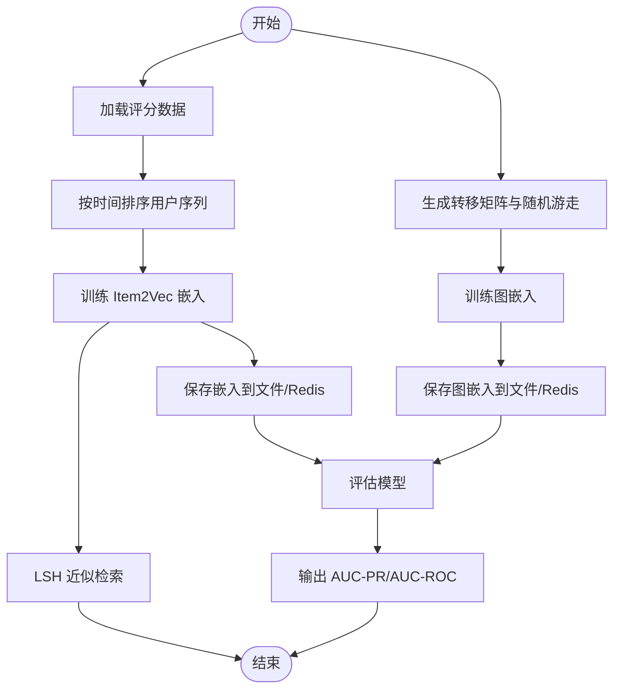
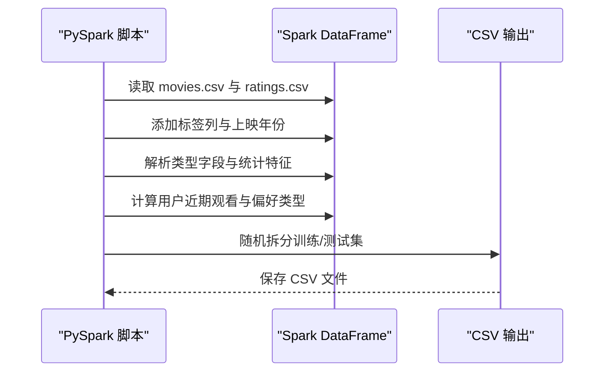
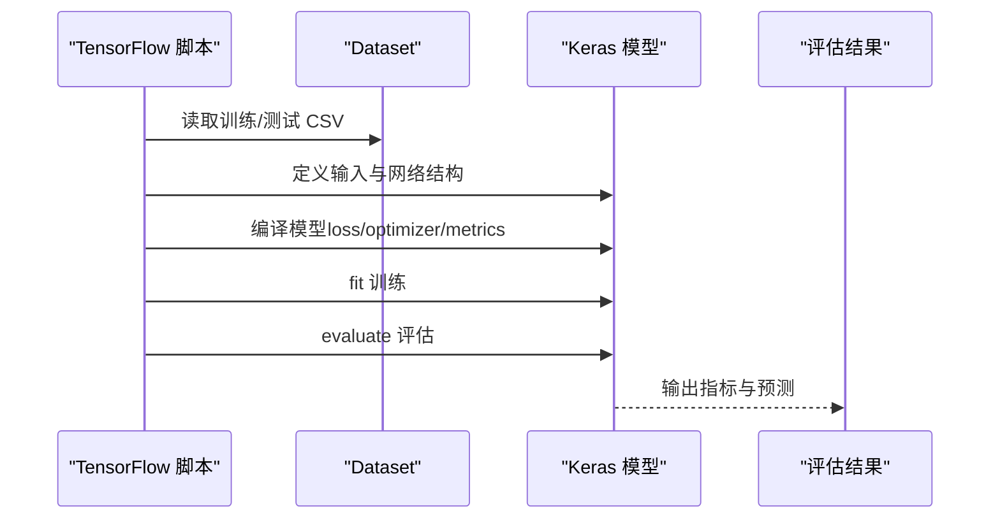
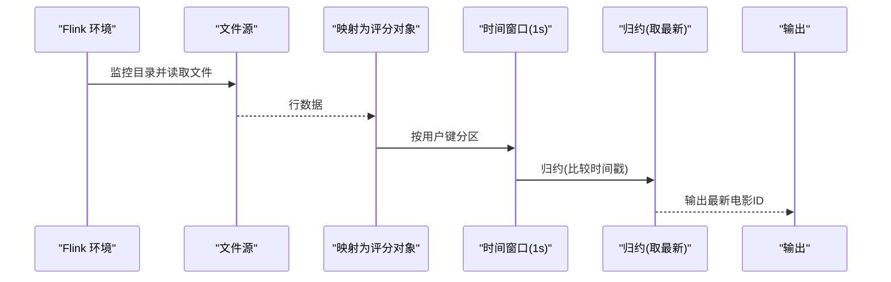
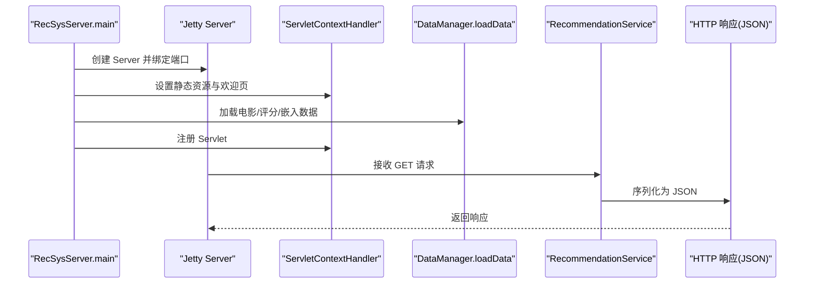
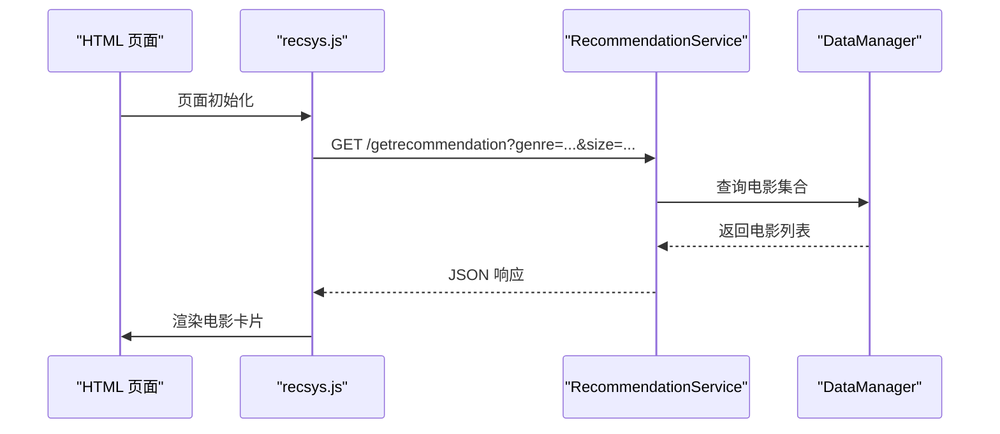
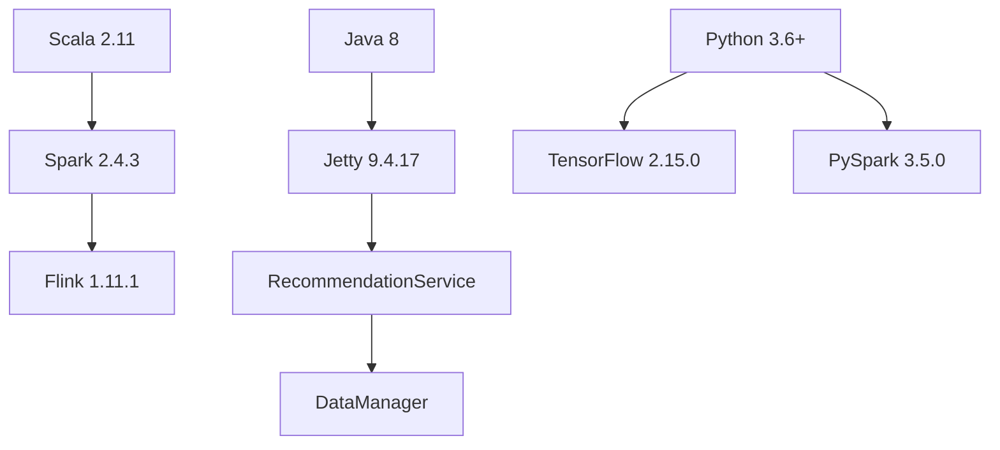

# 技术栈

<cite>
**本文引用的文件**
- [pom.xml](file://pom.xml)
- [requirements.txt](file://requirements.txt)
- [README.md](file://README.md)
- [RecSysServer.java](file://src/main/java/com/sparrowrecsys/online/RecSysServer.java)
- [Embedding.scala](file://src/main/java/com/sparrowrecsys/offline/spark/embedding/Embedding.scala)
- [Evaluator.scala](file://src/main/java/com/sparrowrecsys/offline/spark/evaluate/Evaluator.scala)
- [FeatureEngForRecModel.py](file://RecPySpark/src/com/sparrowrecsys/offline/pyspark/featureeng/FeatureEngForRecModel.py)
- [DIN.py](file://TFRecModel/src/com/sparrowrecsys/offline/tensorflow/DIN.py)
- [RealTimeFeature.java](file://src/main/java/com/sparrowrecsys/nearline/flink/RealTimeFeature.java)
- [DataManager.java](file://src/main/java/com/sparrowrecsys/online/datamanager/DataManager.java)
- [RecommendationService.java](file://src/main/java/com/sparrowrecsys/online/service/RecommendationService.java)
- [recsys.js](file://src/main/resources/webroot/js/recsys.js)
- [jquery-3.2.1.min.js](file://src/main/resources/webroot/js/jquery-3.2.1.min.js)
</cite>

## 目录
1. [简介](#简介)
2. [项目结构](#项目结构)
3. [核心组件](#核心组件)
4. [架构总览](#架构总览)
5. [详细组件分析](#详细组件分析)
6. [依赖关系分析](#依赖关系分析)
7. [性能考量](#性能考量)
8. [故障排查指南](#故障排查指南)
9. [结论](#结论)

## 简介
本项目是一个基于多语言混合架构的电影推荐系统，采用“离线特征工程与模型训练 + 近线实时特征 + 在线服务”的经典工业级推荐系统分层设计。技术栈覆盖 Java/Scala/Python/JavaScript，分别承担在线服务、离线批处理、深度学习模型训练与前端交互。核心目标是通过 Spark、Flink、TensorFlow 等框架完成大规模数据处理与模型训练，并通过 Jetty 提供高性能的在线服务接口，最终由前端 JavaScript 完成用户交互与数据展示。

## 项目结构
项目采用 Maven 多模块布局，包含以下关键目录与职责：
- 离线批处理（Spark）：特征工程、嵌入向量训练、模型评估
- 深度学习模型训练（TensorFlow）：多种推荐模型的训练脚本
- 实时近线处理（Flink）：基于流式窗口的实时特征计算
- 在线服务（Jetty + Java Servlet）：提供 REST 接口与静态资源
- 前端（JavaScript + HTML/CSS）：页面渲染与异步请求

图表来源
- [Embedding.scala](file://src/main/java/com/sparrowrecsys/offline/spark/embedding/Embedding.scala#L1-L287)
- [FeatureEngForRecModel.py](file://RecPySpark/src/com/sparrowrecsys/offline/pyspark/featureeng/FeatureEngForRecModel.py#L1-L156)
- [DIN.py](file://TFRecModel/src/com/sparrowrecsys/offline/tensorflow/DIN.py#L1-L190)
- [RealTimeFeature.java](file://src/main/java/com/sparrowrecsys/nearline/flink/RealTimeFeature.java#L1-L74)
- [RecSysServer.java](file://src/main/java/com/sparrowrecsys/online/RecSysServer.java#L1-L80)
- [DataManager.java](file://src/main/java/com/sparrowrecsys/online/datamanager/DataManager.java#L1-L295)
- [RecommendationService.java](file://src/main/java/com/sparrowrecsys/online/service/RecommendationService.java#L1-L48)
- [recsys.js](file://src/main/resources/webroot/js/recsys.js#L1-L297)

章节来源
- [pom.xml](file://pom.xml#L1-L228)
- [README.md](file://README.md#L1-L57)

## 核心组件
- Maven 构建与依赖管理：统一管理 Java/Scala 生态依赖，打包可执行 JAR 并内嵌依赖。
- Spark 离线批处理：负责特征工程、嵌入向量训练、模型评估。
- PySpark 特征工程：基于 Spark SQL 的特征提取与样本划分。
- TensorFlow 模型训练：提供多种推荐模型的训练与评估流程。
- Flink 近线流处理：基于窗口的实时特征聚合与输出。
- Jetty 在线服务：提供 REST 接口，承载静态资源与 JSON 返回。
- 前端 JavaScript：通过 AJAX 调用在线服务，渲染页面内容。

章节来源
- [pom.xml](file://pom.xml#L60-L226)
- [Embedding.scala](file://src/main/java/com/sparrowrecsys/offline/spark/embedding/Embedding.scala#L1-L287)
- [FeatureEngForRecModel.py](file://RecPySpark/src/com/sparrowrecsys/offline/pyspark/featureeng/FeatureEngForRecModel.py#L1-L156)
- [DIN.py](file://TFRecModel/src/com/sparrowrecsys/offline/tensorflow/DIN.py#L1-L190)
- [RealTimeFeature.java](file://src/main/java/com/sparrowrecsys/nearline/flink/RealTimeFeature.java#L1-L74)
- [RecSysServer.java](file://src/main/java/com/sparrowrecsys/online/RecSysServer.java#L1-L80)
- [DataManager.java](file://src/main/java/com/sparrowrecsys/online/datamanager/DataManager.java#L1-L295)
- [RecommendationService.java](file://src/main/java/com/sparrowrecsys/online/service/RecommendationService.java#L1-L48)
- [recsys.js](file://src/main/resources/webroot/js/recsys.js#L1-L297)

## 架构总览
系统采用“离线批处理 + 近线流处理 + 在线服务 + 前端”的分层架构。离线层产出特征与模型；近线层对实时行为进行窗口化聚合；在线层提供低延迟的推荐服务；前端负责用户交互与数据展示。

图表来源
- [Embedding.scala](file://src/main/java/com/sparrowrecsys/offline/spark/embedding/Embedding.scala#L1-L287)
- [Evaluator.scala](file://src/main/java/com/sparrowrecsys/offline/spark/evaluate/Evaluator.scala#L1-L22)
- [FeatureEngForRecModel.py](file://RecPySpark/src/com/sparrowrecsys/offline/pyspark/featureeng/FeatureEngForRecModel.py#L1-L156)
- [DIN.py](file://TFRecModel/src/com/sparrowrecsys/offline/tensorflow/DIN.py#L1-L190)
- [RealTimeFeature.java](file://src/main/java/com/sparrowrecsys/nearline/flink/RealTimeFeature.java#L1-L74)
- [RecSysServer.java](file://src/main/java/com/sparrowrecsys/online/RecSysServer.java#L1-L80)
- [recsys.js](file://src/main/resources/webroot/js/recsys.js#L1-L297)

## 详细组件分析

### Maven 构建与依赖管理
- 编译与打包：使用 Maven 编译 Java/Scala 源码，通过 Assembly 插件生成包含所有依赖的可执行 JAR。
- 依赖范围：
  - 在线服务：Jetty（服务器与 Servlet）
  - 离线批处理：Spark（Core/SQL/MLlib）、MLeap、PMML、Hadoop、Jedis（Redis）
  - 实时近线：Flink（Java/Streaming/Clients）
  - HTTP 客户端：Apache HttpClient/AsyncClient
  - JSON 工具：org.json
- 版本策略：集中定义属性（如 Spark/Flink/Scala/HTTP 客户端版本），确保一致性。

图表来源
- [pom.xml](file://pom.xml#L21-L58)
- [pom.xml](file://pom.xml#L60-L226)

章节来源
- [pom.xml](file://pom.xml#L11-L19)
- [pom.xml](file://pom.xml#L21-L58)
- [pom.xml](file://pom.xml#L60-L226)

### Spark 离线批处理与嵌入训练
- 功能要点：
  - 从 CSV 加载评分序列，按时间排序生成用户观看序列。
  - 使用 Word2Vec 训练物品嵌入（Item2Vec），并导出到文件或 Redis。
  - 基于随机游走生成转移矩阵，训练图嵌入（DeepWalk）。
  - 使用 LSH 进行近似最近邻搜索。
  - 评估器用于二分类指标（AUC-PR/AUC-ROC）。
- 关键类与方法：
  - Embedding.scala：嵌入训练、随机游走、LSH 近似检索。
  - Evaluator.scala：二分类指标评估。

图表来源
- [Embedding.scala](file://src/main/java/com/sparrowrecsys/offline/spark/embedding/Embedding.scala#L27-L138)
- [Embedding.scala](file://src/main/java/com/sparrowrecsys/offline/spark/embedding/Embedding.scala#L140-L266)
- [Evaluator.scala](file://src/main/java/com/sparrowrecsys/offline/spark/evaluate/Evaluator.scala#L8-L21)

章节来源
- [Embedding.scala](file://src/main/java/com/sparrowrecsys/offline/spark/embedding/Embedding.scala#L1-L287)
- [Evaluator.scala](file://src/main/java/com/sparrowrecsys/offline/spark/evaluate/Evaluator.scala#L1-L22)

### PySpark 特征工程
- 功能要点：
  - 为样本添加标签（评分阈值二值化）。
  - 从标题提取上映年份，解析类型字段。
  - 计算物品与用户的统计特征（均值、标准差、计数）。
  - 生成用户近期观看历史与偏好类型列表。
  - 将样本拆分为训练集与测试集（随机或按时间戳）。
- 关键流程：
  - 读取电影与评分数据，拼接特征。
  - 使用窗口函数计算用户近期行为统计。
  - 输出 CSV 文件供后续模型训练使用。

图表来源
- [FeatureEngForRecModel.py](file://RecPySpark/src/com/sparrowrecsys/offline/pyspark/featureeng/FeatureEngForRecModel.py#L12-L139)

章节来源
- [FeatureEngForRecModel.py](file://RecPySpark/src/com/sparrowrecsys/offline/pyspark/featureeng/FeatureEngForRecModel.py#L1-L156)

### TensorFlow 深度学习模型训练
- 功能要点：
  - 从本地 CSV 加载训练与测试数据集。
  - 定义输入特征（数值/类别/嵌入）与网络结构（DIN 示例）。
  - 编译模型（损失函数、优化器、评估指标）。
  - 训练与评估模型，输出指标与预测示例。
- 关键流程：
  - 数据集构建与预处理。
  - 模型定义与编译。
  - fit/evaluate 训练与评估。
  - 结果打印与可视化。

图表来源
- [DIN.py](file://TFRecModel/src/com/sparrowrecsys/offline/tensorflow/DIN.py#L14-L182)

章节来源
- [DIN.py](file://TFRecModel/src/com/sparrowrecsys/offline/tensorflow/DIN.py#L1-L190)

### Flink 近线流处理
- 功能要点：
  - 监控评分数据文件目录，持续读取新文件。
  - 将每行映射为评分对象，按用户键分区。
  - 基于时间窗口（1 秒）进行归约，输出最新电影 ID。
- 关键流程：
  - 设置执行环境与文件输入格式。
  - 映射为评分对象并按键分区。
  - 时间窗口归约与输出。

图表来源
- [RealTimeFeature.java](file://src/main/java/com/sparrowrecsys/nearline/flink/RealTimeFeature.java#L32-L68)

章节来源
- [RealTimeFeature.java](file://src/main/java/com/sparrowrecsys/nearline/flink/RealTimeFeature.java#L1-L74)

### Jetty 在线服务与 Servlet 接口
- 功能要点：
  - 启动 Jetty 服务器，绑定端口（支持环境变量 PORT）。
  - 加载静态资源（webroot），设置欢迎页。
  - 注册多个 Servlet，提供电影、用户、相似电影、推荐等接口。
  - 通过 Jackson 将对象序列化为 JSON 返回。
- 关键流程：
  - 初始化 Server 与 ServletContextHandler。
  - 绑定静态资源与默认 Servlet。
  - 注册业务 Servlet 并启动服务。

图表来源
- [RecSysServer.java](file://src/main/java/com/sparrowrecsys/online/RecSysServer.java#L20-L78)
- [RecommendationService.java](file://src/main/java/com/sparrowrecsys/online/service/RecommendationService.java#L18-L46)
- [DataManager.java](file://src/main/java/com/sparrowrecsys/online/datamanager/DataManager.java#L40-L50)

章节来源
- [RecSysServer.java](file://src/main/java/com/sparrowrecsys/online/RecSysServer.java#L1-L80)
- [RecommendationService.java](file://src/main/java/com/sparrowrecsys/online/service/RecommendationService.java#L1-L48)
- [DataManager.java](file://src/main/java/com/sparrowrecsys/online/datamanager/DataManager.java#L1-L295)

### 前端 JavaScript 与页面交互
- 功能要点：
  - 通过 jQuery 发起 JSONP/GET 请求，获取推荐、相似电影、用户历史等数据。
  - 将返回的电影数据渲染为卡片，支持点击跳转详情页。
  - 支持按类型筛选与排序。
- 关键流程：
  - 页面加载后调用服务端接口。
  - 解析 JSON 数据并动态拼装 HTML 片段。
  - 绑定点击事件跳转详情页。

图表来源
- [recsys.js](file://src/main/resources/webroot/js/recsys.js#L100-L107)
- [RecommendationService.java](file://src/main/java/com/sparrowrecsys/online/service/RecommendationService.java#L18-L46)
- [DataManager.java](file://src/main/java/com/sparrowrecsys/online/datamanager/DataManager.java#L252-L268)

章节来源
- [recsys.js](file://src/main/resources/webroot/js/recsys.js#L1-L297)
- [RecommendationService.java](file://src/main/java/com/sparrowrecsys/online/service/RecommendationService.java#L1-L48)
- [DataManager.java](file://src/main/java/com/sparrowrecsys/online/datamanager/DataManager.java#L1-L295)

## 依赖关系分析
- Maven 依赖：
  - Jetty：在线服务核心依赖。
  - Spark：离线批处理与评估。
  - Flink：近线流处理。
  - Jedis：与在线层的数据加载/缓存交互。
  - PMML/MLeap：模型导出与推理。
  - Hadoop：分布式存储与 MapReduce 客户端。
- Python 环境：
  - requirements.txt 指定 TensorFlow、PySpark、psutil 等版本。
- 版本兼容性：
  - Java 8、Scala 2.11、Python 3.6+、TensorFlow 2.0+。
  - Spark 2.4.3、Flink 1.11.1、Jetty 9.4.17。

图表来源
- [pom.xml](file://pom.xml#L11-L19)
- [pom.xml](file://pom.xml#L63-L225)
- [requirements.txt](file://requirements.txt#L1-L4)
- [README.md](file://README.md#L7-L12)

章节来源
- [pom.xml](file://pom.xml#L11-L19)
- [pom.xml](file://pom.xml#L60-L226)
- [requirements.txt](file://requirements.txt#L1-L4)
- [README.md](file://README.md#L7-L12)

## 性能考量
- Spark 层：
  - 使用广播/缓存热点表，减少重复计算。
  - 列式存储与向量化操作提升特征工程效率。
  - LSH 近似检索降低高维向量相似度计算成本。
- TensorFlow 层：
  - 使用 tf.data 加速数据管道，batch 与 prefetch 提升吞吐。
  - 合理设置嵌入维度与网络层数，避免过拟合。
- Flink 层：
  - 时间窗口大小与并行度平衡延迟与吞吐。
  - 使用 RocksDB 状态后端提升状态管理性能。
- Jetty 层：
  - 静态资源缓存与压缩，减少带宽消耗。
  - Servlet 异步处理与连接池配置，提升并发能力。
- 前端层：
  - jQuery 异步请求合并与去抖，减少请求次数。
  - 按需渲染与懒加载，提升首屏速度。

## 故障排查指南
- 在线服务无法启动：
  - 检查端口占用与环境变量 PORT 是否正确。
  - 确认 webroot 路径与静态资源是否存在。
- 数据加载异常：
  - 检查 CSV 文件路径与权限，确认列名与分隔符一致。
  - 若使用 Redis，确认连接参数与键前缀匹配。
- 推荐结果为空：
  - 检查标签与过滤条件是否合理。
  - 确认嵌入向量是否成功加载或导出。
- 模型训练失败：
  - 检查数据集路径与字段类型，确保数值/类别列正确。
  - 调整 batch size、学习率与评估指标。
- 流处理无输出：
  - 检查文件监控路径与权限，确认窗口大小与触发策略。
  - 查看日志定位归约逻辑与键分区问题。

章节来源
- [RecSysServer.java](file://src/main/java/com/sparrowrecsys/online/RecSysServer.java#L20-L78)
- [DataManager.java](file://src/main/java/com/sparrowrecsys/online/datamanager/DataManager.java#L40-L50)
- [RecommendationService.java](file://src/main/java/com/sparrowrecsys/online/service/RecommendationService.java#L18-L46)
- [DIN.py](file://TFRecModel/src/com/sparrowrecsys/offline/tensorflow/DIN.py#L14-L27)
- [RealTimeFeature.java](file://src/main/java/com/sparrowrecsys/nearline/flink/RealTimeFeature.java#L32-L68)

## 结论
本项目通过 Java/Scala/Python/JavaScript 的多语言协同，构建了从离线批处理到在线服务的完整推荐系统链路。Spark 与 PySpark 负责大规模特征工程与嵌入训练，TensorFlow 提供多样化的深度学习模型训练能力，Flink 实现近线实时特征处理，Jetty 提供稳定高效的在线服务接口，前端 JavaScript 完成用户交互与数据展示。该技术栈组合兼顾了性能、可扩展性与易维护性，适合在工业环境中落地与演进。