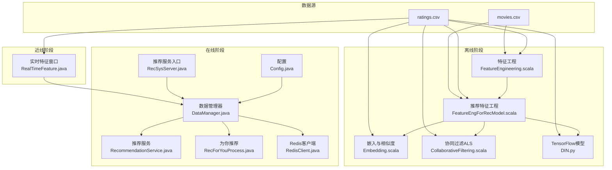
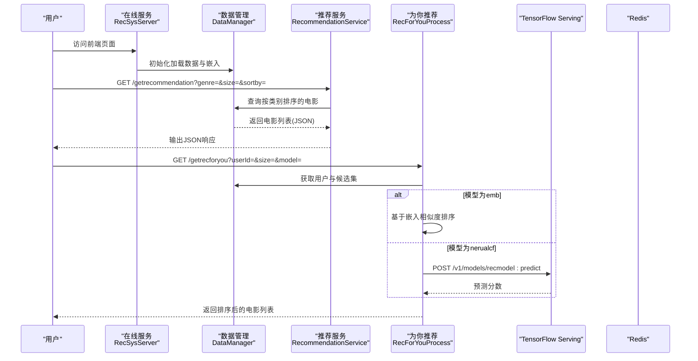
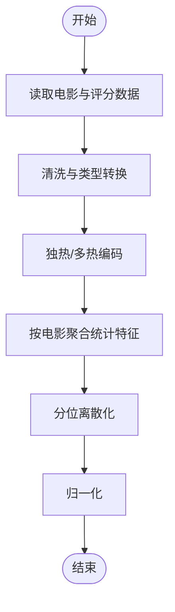
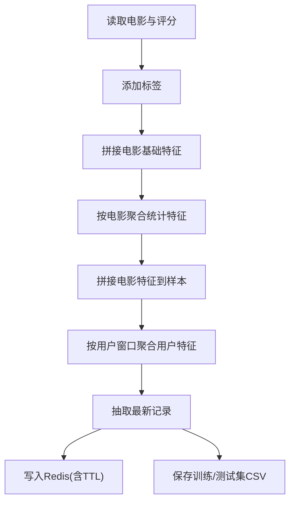
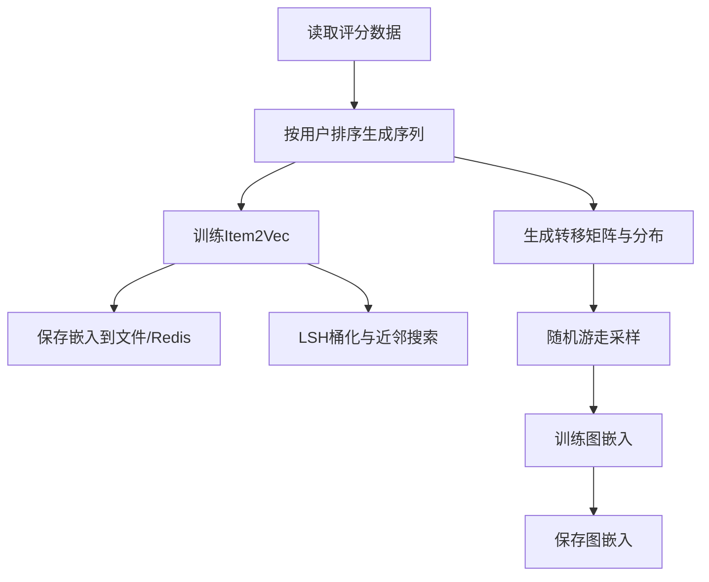
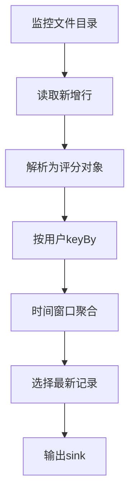
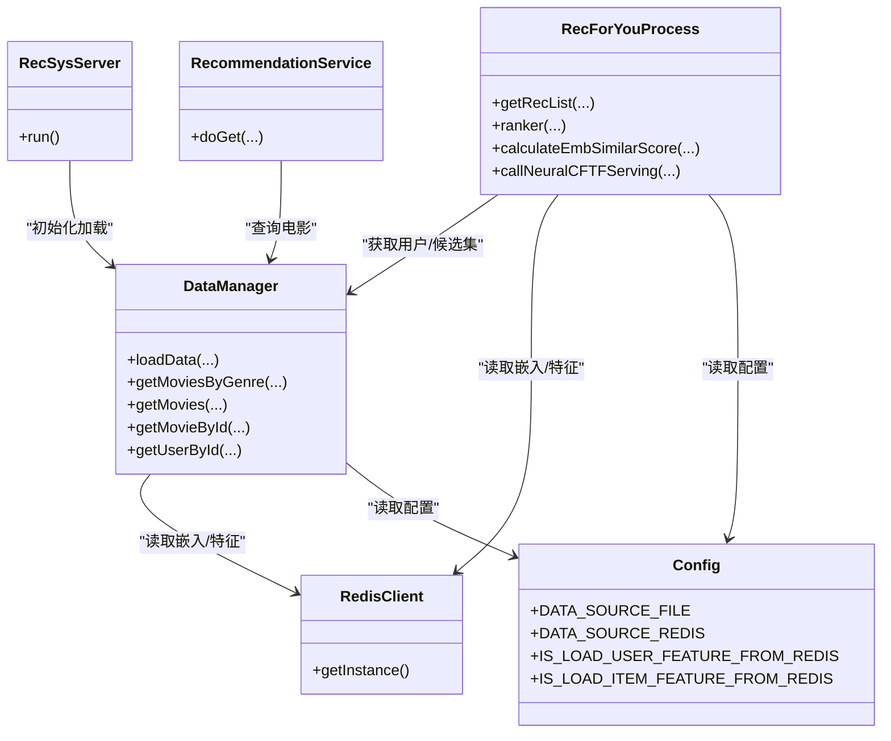
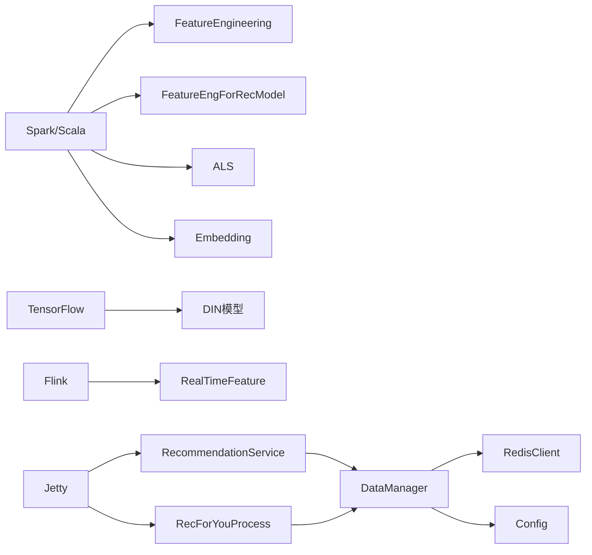

# 数据流

<cite>
**本文引用的文件**
- [README.md](file://README.md)
- [FeatureEngineering.scala](file://src/main/java/com/sparrowrecsys/offline/spark/featureeng/FeatureEngineering.scala)
- [FeatureEngForRecModel.scala](file://src/main/java/com/sparrowrecsys/offline/spark/featureeng/FeatureEngForRecModel.scala)
- [Embedding.scala](file://src/main/java/com/sparrowrecsys/offline/spark/embedding/Embedding.scala)
- [CollaborativeFiltering.scala](file://src/main/java/com/sparrowrecsys/offline/spark/model/CollaborativeFiltering.scala)
- [RealTimeFeature.java](file://src/main/java/com/sparrowrecsys/nearline/flink/RealTimeFeature.java)
- [RecSysServer.java](file://src/main/java/com/sparrowrecsys/online/RecSysServer.java)
- [DataManager.java](file://src/main/java/com/sparrowrecsys/online/datamanager/DataManager.java)
- [RecommendationService.java](file://src/main/java/com/sparrowrecsys/online/service/RecommendationService.java)
- [RecForYouProcess.java](file://src/main/java/com/sparrowrecsys/online/recprocess/RecForYouProcess.java)
- [RedisClient.java](file://src/main/java/com/sparrowrecsys/online/datamanager/RedisClient.java)
- [Config.java](file://src/main/java/com/sparrowrecsys/online/util/Config.java)
- [DIN.py](file://TFRecModel/src/com/sparrowrecsys/offline/tensorflow/DIN.py)
- [ratings.csv](file://src/main/resources/webroot/sampledata/ratings.csv)
- [movies.csv](file://src/main/resources/webroot/sampledata/movies.csv)
- [requirements.txt](file://requirements.txt)
</cite>

## 目录
1. [引言](#引言)
2. [项目结构](#项目结构)
3. [核心组件](#核心组件)
4. [架构总览](#架构总览)
5. [详细组件分析](#详细组件分析)
6. [依赖关系分析](#依赖关系分析)
7. [性能考量](#性能考量)
8. [故障排查指南](#故障排查指南)
9. [结论](#结论)
10. [附录](#附录)

## 引言
本文件围绕SparrowRecSys的数据流设计展开，系统性描述从原始数据输入到最终推荐结果输出的完整路径。内容涵盖离线数据处理阶段的特征工程与模型训练、近线流式处理、在线服务阶段的查询与推荐生成、缓存策略与实时更新机制，并提供数据流图与ETL流程图，解释一致性保障与错误处理策略，最后给出性能瓶颈识别与优化建议。

## 项目结构
SparrowRecSys采用多语言混合架构：离线特征工程与模型训练使用Spark与TensorFlow；近线流处理使用Flink；在线服务使用Jetty与Redis；前端通过静态页面与服务端接口交互。数据主要来源于示例CSV文件，离线阶段产出嵌入向量与特征，近线阶段进行实时窗口聚合，线上阶段结合文件与Redis两种数据源加载模型与特征。

图表来源
- [FeatureEngineering.scala](file://src/main/java/com/sparrowrecsys/offline/spark/featureeng/FeatureEngineering.scala#L1-L120)
- [FeatureEngForRecModel.scala](file://src/main/java/com/sparrowrecsys/offline/spark/featureeng/FeatureEngForRecModel.scala#L1-L293)
- [Embedding.scala](file://src/main/java/com/sparrowrecsys/offline/spark/embedding/Embedding.scala#L1-L287)
- [CollaborativeFiltering.scala](file://src/main/java/com/sparrowrecsys/offline/spark/model/CollaborativeFiltering.scala#L1-L85)
- [RealTimeFeature.java](file://src/main/java/com/sparrowrecsys/nearline/flink/RealTimeFeature.java#L1-L74)
- [RecSysServer.java](file://src/main/java/com/sparrowrecsys/online/RecSysServer.java#L1-L80)
- [DataManager.java](file://src/main/java/com/sparrowrecsys/online/datamanager/DataManager.java#L1-L295)
- [RecommendationService.java](file://src/main/java/com/sparrowrecsys/online/service/RecommendationService.java#L1-L48)
- [RecForYouProcess.java](file://src/main/java/com/sparrowrecsys/online/recprocess/RecForYouProcess.java#L1-L140)
- [RedisClient.java](file://src/main/java/com/sparrowrecsys/online/datamanager/RedisClient.java#L1-L26)
- [Config.java](file://src/main/java/com/sparrowrecsys/online/util/Config.java#L1-L14)
- [ratings.csv](file://src/main/resources/webroot/sampledata/ratings.csv#L1-L200)
- [movies.csv](file://src/main/resources/webroot/sampledata/movies.csv#L1-L200)

章节来源
- [README.md](file://README.md#L1-L57)
- [requirements.txt](file://requirements.txt#L1-L4)

## 核心组件
- 离线特征工程：对电影与评分数据进行清洗、编码、统计特征构造与归一化，形成可用于训练的样本集。
- 推荐特征工程：融合电影与用户历史行为，构造用户近期观影序列、用户画像特征与物品画像特征，并持久化至Redis或导出为CSV。
- 嵌入与相似度：基于用户观看序列训练Item2Vec，生成物品嵌入；可选训练图嵌入；支持LSH桶化加速近邻搜索。
- 协同过滤ALS：使用ALS进行矩阵分解，评估并生成推荐列表。
- TensorFlow模型：以DIN为代表的深度模型，输入用户画像、上下文与候选物品特征，输出点击/偏好概率。
- 近线流处理：基于Flink对评分流进行窗口聚合，提取最新行为用于实时特征。
- 在线服务：Jetty提供REST接口，DataManager负责加载电影、评分、嵌入与Redis特征，RecForYouProcess执行个性化排序与调用TensorFlow Serving。

章节来源
- [FeatureEngineering.scala](file://src/main/java/com/sparrowrecsys/offline/spark/featureeng/FeatureEngineering.scala#L11-L118)
- [FeatureEngForRecModel.scala](file://src/main/java/com/sparrowrecsys/offline/spark/featureeng/FeatureEngForRecModel.scala#L15-L290)
- [Embedding.scala](file://src/main/java/com/sparrowrecsys/offline/spark/embedding/Embedding.scala#L22-L286)
- [CollaborativeFiltering.scala](file://src/main/java/com/sparrowrecsys/offline/spark/model/CollaborativeFiltering.scala#L10-L84)
- [RealTimeFeature.java](file://src/main/java/com/sparrowrecsys/nearline/flink/RealTimeFeature.java#L30-L72)
- [RecSysServer.java](file://src/main/java/com/sparrowrecsys/online/RecSysServer.java#L18-L78)
- [DataManager.java](file://src/main/java/com/sparrowrecsys/online/datamanager/DataManager.java#L13-L294)
- [RecForYouProcess.java](file://src/main/java/com/sparrowrecsys/online/recprocess/RecForYouProcess.java#L20-L139)
- [RecommendationService.java](file://src/main/java/com/sparrowrecsys/online/service/RecommendationService.java#L18-L46)

## 架构总览
下图展示从数据采集到在线推荐的端到端数据流：

图表来源
- [RecSysServer.java](file://src/main/java/com/sparrowrecsys/online/RecSysServer.java#L49-L70)
- [DataManager.java](file://src/main/java/com/sparrowrecsys/online/datamanager/DataManager.java#L40-L50)
- [RecommendationService.java](file://src/main/java/com/sparrowrecsys/online/service/RecommendationService.java#L19-L40)
- [RecForYouProcess.java](file://src/main/java/com/sparrowrecsys/online/recprocess/RecForYouProcess.java#L29-L92)
- [RedisClient.java](file://src/main/java/com/sparrowrecsys/online/datamanager/RedisClient.java#L15-L24)

## 详细组件分析

### 离线特征工程（Spark ML）
- 功能要点
  - 对电影ID进行独热编码示例与多热编码示例，演示字符串索引与稀疏向量构建。
  - 对评分数据按电影聚合统计平均分、计数与方差，并进行分位离散化与归一化。
  - 主函数读取movies.csv与ratings.csv，依次输出示例结果。
- 复杂度与性能
  - 统计聚合复杂度与数据规模线性相关；分位离散化与归一化为O(n)。
  - 可通过广播变量与分区优化减少重复计算。
- 错误处理
  - 缺失值填充与类型转换失败时的容错需在生产环境补充日志与降级策略。

图表来源
- [FeatureEngineering.scala](file://src/main/java/com/sparrowrecsys/offline/spark/featureeng/FeatureEngineering.scala#L16-L90)

章节来源
- [FeatureEngineering.scala](file://src/main/java/com/sparrowrecsys/offline/spark/featureeng/FeatureEngineering.scala#L11-L118)

### 推荐特征工程（用户/物品特征与Redis落盘）
- 功能要点
  - 为评分样本添加标签（如评分阈值二分类）。
  - 融合电影基础信息（年份、标题处理、流派拆分）与电影侧统计特征。
  - 使用滑动窗口为用户构造近期观影历史、平均年份、平均评分、流派Top-N等特征。
  - 将最新物品与用户特征写入Redis，设置TTL，供线上快速拉取。
  - 支持按时间戳切分训练/测试集。
- 复杂度与性能
  - 窗口聚合与收集操作在大规模数据上可能成为瓶颈；建议使用预聚合与增量更新。
  - Redis批量写入采用逐条hset/set，可考虑pipeline提升吞吐。
- 一致性与错误处理
  - 写入前先去重取最新记录，避免过期数据污染。
  - 异常时记录批次与数量，确保可追踪与回放。

图表来源
- [FeatureEngForRecModel.scala](file://src/main/java/com/sparrowrecsys/offline/spark/featureeng/FeatureEngForRecModel.scala#L21-L205)

章节来源
- [FeatureEngForRecModel.scala](file://src/main/java/com/sparrowrecsys/offline/spark/featureeng/FeatureEngForRecModel.scala#L15-L290)

### 嵌入与相似度（Item2Vec/图嵌入/LSH）
- 功能要点
  - 依据评分序列生成用户-物品序列，训练Word2Vec得到物品嵌入。
  - 可选基于随机游走的图嵌入，生成转移矩阵与分布，再训练嵌入。
  - 使用BucketedRandomProjectionLSH进行近似最近邻搜索。
  - 将嵌入向量保存至文件或Redis，供线上相似度计算。
- 复杂度与性能
  - Word2Vec训练复杂度与序列长度与词汇表大小相关；LSH查询为近似O(logN)。
  - Redis存储建议设置合理TTL，避免冷启动与内存膨胀。
- 一致性与错误处理
  - 读取嵌入时若缺失则回退到默认策略或空向量，保证服务可用性。

图表来源
- [Embedding.scala](file://src/main/java/com/sparrowrecsys/offline/spark/embedding/Embedding.scala#L27-L266)

章节来源
- [Embedding.scala](file://src/main/java/com/sparrowrecsys/offline/spark/embedding/Embedding.scala#L22-L286)

### 协同过滤ALS（矩阵分解）
- 功能要点
  - 将userId、movieId、rating转为数值列，划分训练/测试集。
  - 使用ALS训练模型，评估RMSE，生成用户/物品推荐列表。
  - 参数网格与交叉验证用于超参搜索。
- 复杂度与性能
  - ALS迭代收敛与因子维度、正则化参数相关；建议分布式训练与参数调优。
- 一致性与错误处理
  - 冷启动策略设置为drop，避免NaN评估指标。

章节来源
- [CollaborativeFiltering.scala](file://src/main/java/com/sparrowrecsys/offline/spark/model/CollaborativeFiltering.scala#L10-L84)

### TensorFlow模型（DIN）
- 功能要点
  - 定义输入特征（用户画像、上下文、候选物品、近期观影序列）。
  - 构建激活单元与池化层，整合用户画像与上下文，输出二分类预测。
  - 加载训练/测试数据集，编译模型并训练评估。
- 复杂度与性能
  - 模型规模与嵌入维度、隐藏层宽度相关；批处理大小影响吞吐。
- 一致性与错误处理
  - 预测时注意实例格式与字段名一致，异常时返回空或默认值。

章节来源
- [DIN.py](file://TFRecModel/src/com/sparrowrecsys/offline/tensorflow/DIN.py#L14-L189)

### 近线流处理（Flink窗口聚合）
- 功能要点
  - 监控评分文件目录，持续读取新增行。
  - 按用户分组，基于时间窗口选择最新评分记录，输出最新影片ID。
- 复杂度与性能
  - 窗口聚合与状态管理随用户数与窗口大小增长；建议合理设置窗口与清理策略。
- 一致性与错误处理
  - 时间戳比较决定新旧记录，异常行跳过或记录日志。

图表来源
- [RealTimeFeature.java](file://src/main/java/com/sparrowrecsys/nearline/flink/RealTimeFeature.java#L32-L67)

章节来源
- [RealTimeFeature.java](file://src/main/java/com/sparrowrecsys/nearline/flink/RealTimeFeature.java#L30-L72)

### 在线服务（Jetty + DataManager + Redis）
- 功能要点
  - 启动Jetty服务，绑定多个Servlet，提供电影、用户、相似电影、推荐、为你推荐等接口。
  - DataManager负责加载电影、链接、评分、嵌入与Redis特征，维护反向索引。
  - RecForYouProcess根据模型选择（嵌入相似度或神经网络）生成排序列表。
  - RedisClient提供单例连接，Config控制数据源与开关。
- 复杂度与性能
  - 文件加载一次性完成；Redis访问为O(1)热点查询；排序复杂度取决于候选集大小。
- 一致性与错误处理
  - 未命中用户或嵌入为空时返回空列表或默认排序；异常捕获并返回空字符串。

图表来源
- [RecSysServer.java](file://src/main/java/com/sparrowrecsys/online/RecSysServer.java#L27-L70)
- [DataManager.java](file://src/main/java/com/sparrowrecsys/online/datamanager/DataManager.java#L40-L294)
- [RecommendationService.java](file://src/main/java/com/sparrowrecsys/online/service/RecommendationService.java#L18-L46)
- [RecForYouProcess.java](file://src/main/java/com/sparrowrecsys/online/recprocess/RecForYouProcess.java#L29-L139)
- [RedisClient.java](file://src/main/java/com/sparrowrecsys/online/datamanager/RedisClient.java#L15-L24)
- [Config.java](file://src/main/java/com/sparrowrecsys/online/util/Config.java#L3-L13)

章节来源
- [RecSysServer.java](file://src/main/java/com/sparrowrecsys/online/RecSysServer.java#L18-L78)
- [DataManager.java](file://src/main/java/com/sparrowrecsys/online/datamanager/DataManager.java#L13-L294)
- [RecommendationService.java](file://src/main/java/com/sparrowrecsys/online/service/RecommendationService.java#L18-L46)
- [RecForYouProcess.java](file://src/main/java/com/sparrowrecsys/online/recprocess/RecForYouProcess.java#L20-L139)
- [RedisClient.java](file://src/main/java/com/sparrowrecsys/online/datamanager/RedisClient.java#L1-L26)
- [Config.java](file://src/main/java/com/sparrowrecsys/online/util/Config.java#L1-L14)

## 依赖关系分析
- 技术栈依赖
  - Spark与Scala用于离线特征工程与ALS训练。
  - TensorFlow用于深度模型训练与推理。
  - Flink用于近线流式处理。
  - Jetty提供在线HTTP服务，Redis作为缓存与特征存储。
- 组件耦合
  - DataManager是在线服务的核心枢纽，耦合文件与Redis两套数据源。
  - RecForYouProcess依赖DataManager与RedisClient，同时可调用TensorFlow Serving。
  - FeatureEngForRecModel与Embedding分别产出CSV与Redis两类特征，Config控制加载策略。

图表来源
- [requirements.txt](file://requirements.txt#L1-L4)
- [RecSysServer.java](file://src/main/java/com/sparrowrecsys/online/RecSysServer.java#L64-L70)
- [DataManager.java](file://src/main/java/com/sparrowrecsys/online/datamanager/DataManager.java#L40-L50)
- [RecForYouProcess.java](file://src/main/java/com/sparrowrecsys/online/recprocess/RecForYouProcess.java#L113-L138)
- [FeatureEngForRecModel.scala](file://src/main/java/com/sparrowrecsys/offline/spark/featureeng/FeatureEngForRecModel.scala#L132-L174)
- [Embedding.scala](file://src/main/java/com/sparrowrecsys/offline/spark/embedding/Embedding.scala#L103-L137)

章节来源
- [requirements.txt](file://requirements.txt#L1-L4)
- [RecSysServer.java](file://src/main/java/com/sparrowrecsys/online/RecSysServer.java#L1-L80)

## 性能考量
- 离线阶段
  - 特征工程与ALS训练建议使用分布式Spark集群，合理设置分区与广播变量。
  - Item2Vec与图嵌入可异步离线生成，定期刷新Redis。
- 近线阶段
  - Flink窗口大小与状态清理策略需平衡延迟与内存占用。
- 在线阶段
  - Redis连接池与pipeline批量写入；对热门用户/物品建立本地缓存。
  - 排序候选集大小应限制在合理范围，避免O(n log n)排序开销。
- 模型推理
  - TensorFlow Serving需与模型版本管理配合，确保一致性与回滚能力。

## 故障排查指南
- 在线服务无法启动
  - 检查端口占用与环境变量PORT；确认webroot路径与静态资源存在。
- 推荐结果为空
  - 检查Config中数据源配置（文件/Redis）是否正确；确认Redis中对应键是否存在。
  - 用户无历史评分或嵌入为空时会返回空列表，需检查离线特征落库流程。
- TensorFlow Serving调用失败
  - 确认服务地址与模型名称一致；检查请求体字段与实例格式。
- Flink流处理无输出
  - 检查文件监控路径与权限；确认时间窗口内有新增数据。

章节来源
- [RecSysServer.java](file://src/main/java/com/sparrowrecsys/online/RecSysServer.java#L20-L78)
- [RecForYouProcess.java](file://src/main/java/com/sparrowrecsys/online/recprocess/RecForYouProcess.java#L113-L138)
- [DataManager.java](file://src/main/java/com/sparrowrecsys/online/datamanager/DataManager.java#L40-L50)
- [Config.java](file://src/main/java/com/sparrowrecsys/online/util/Config.java#L3-L13)

## 结论
SparrowRecSys通过离线特征工程与模型训练、近线流处理与在线服务的协同，实现了从原始数据到个性化推荐的完整数据流闭环。通过Redis缓存与文件双通道加载，兼顾了性能与灵活性；TensorFlow Serving提供了可扩展的深度模型推理能力。建议在生产环境中进一步完善一致性校验、异常恢复与容量规划，以支撑更大规模的数据与流量。

## 附录
- 数据文件位置
  - 电影数据：movies.csv
  - 评分数据：ratings.csv
- 关键配置
  - 数据源选择：文件或Redis
  - 是否加载用户/物品特征：可开关
  - 是否启用AB测试：可开关

章节来源
- [movies.csv](file://src/main/resources/webroot/sampledata/movies.csv#L1-L200)
- [ratings.csv](file://src/main/resources/webroot/sampledata/ratings.csv#L1-L200)
- [Config.java](file://src/main/java/com/sparrowrecsys/online/util/Config.java#L3-L13)