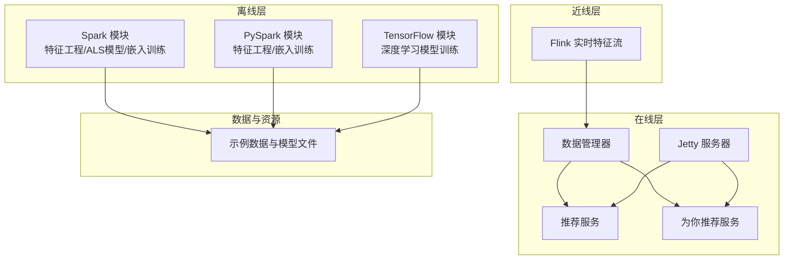
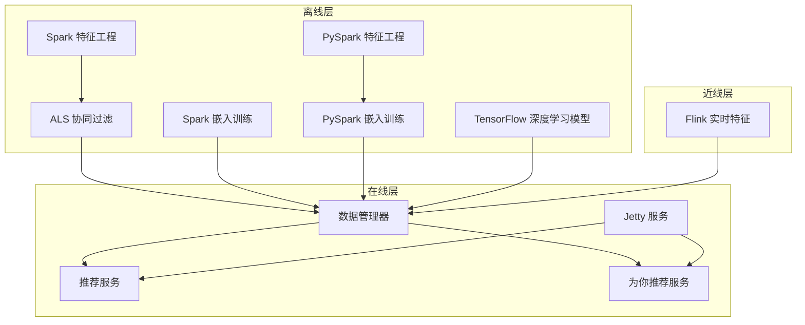
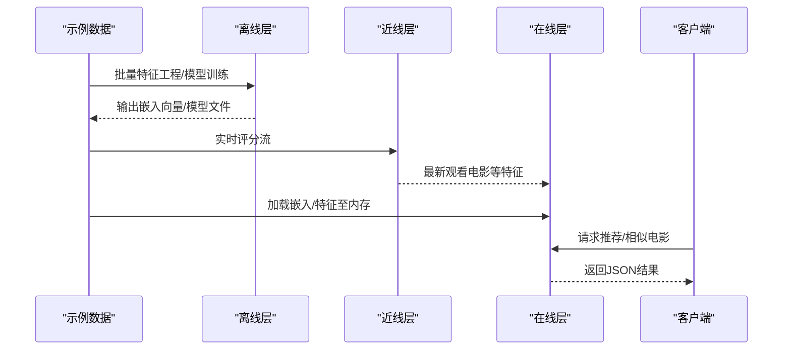
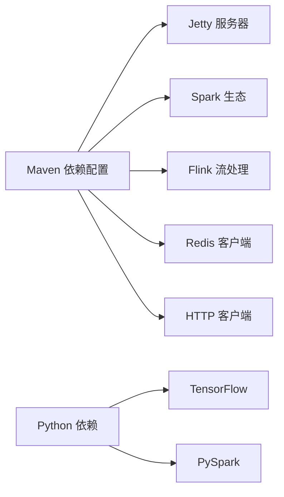

# 整体设计

<cite>
**本文引用的文件列表**
- [README.md](file://README.md)
- [pom.xml](file://pom.xml)
- [requirements.txt](file://requirements.txt)
- [RecPySpark/src/com/sparrowrecsys/offline/pyspark/featureeng/FeatureEngineering.py](file://RecPySpark/src/com/sparrowrecsys/offline/pyspark/featureeng/FeatureEngineering.py)
- [RecPySpark/src/com/sparrowrecsys/offline/pyspark/embedding/Embedding.py](file://RecPySpark/src/com/sparrowrecsys/offline/pyspark/embedding/Embedding.py)
- [src/main/java/com/sparrowrecsys/offline/spark/featureeng/FeatureEngineering.scala](file://src/main/java/com/sparrowrecsys/offline/spark/featureeng/FeatureEngineering.scala)
- [src/main/java/com/sparrowrecsys/offline/spark/model/CollaborativeFiltering.scala](file://src/main/java/com/sparrowrecsys/offline/spark/model/CollaborativeFiltering.scala)
- [src/main/java/com/sparrowrecsys/offline/spark/embedding/Embedding.scala](file://src/main/java/com/sparrowrecsys/offline/spark/embedding/Embedding.scala)
- [TFRecModel/src/com/sparrowrecsys/offline/tensorflow/DIN.py](file://TFRecModel/src/com/sparrowrecsys/offline/tensorflow/DIN.py)
- [src/main/java/com/sparrowrecsys/nearline/flink/RealTimeFeature.java](file://src/main/java/com/sparrowrecsys/nearline/flink/RealTimeFeature.java)
- [src/main/java/com/sparrowrecsys/online/RecSysServer.java](file://src/main/java/com/sparrowrecsys/online/RecSysServer.java)
- [src/main/java/com/sparrowrecsys/online/datamanager/DataManager.java](file://src/main/java/com/sparrowrecsys/online/datamanager/DataManager.java)
- [src/main/java/com/sparrowrecsys/online/service/RecommendationService.java](file://src/main/java/com/sparrowrecsys/online/service/RecommendationService.java)
- [src/main/java/com/sparrowrecsys/online/recprocess/RecForYouProcess.java](file://src/main/java/com/sparrowrecsys/online/recprocess/RecForYouProcess.java)
</cite>

## 目录
1. [引言](#引言)
2. [项目结构](#项目结构)
3. [核心组件](#核心组件)
4. [架构总览](#架构总览)
5. [详细组件分析](#详细组件分析)
6. [依赖关系分析](#依赖关系分析)
7. [性能考量](#性能考量)
8. [故障排查指南](#故障排查指南)
9. [结论](#结论)

## 引言
本文件面向SparrowRecSys的整体架构设计，系统采用三层架构理念：离线数据处理层、近线流处理层、在线服务层。该设计遵循工业级深度学习推荐系统实践，覆盖离线特征工程与模型训练、近线实时特征计算、在线服务与前端交互的完整生命周期。项目同时融合了Spark、TensorFlow、Flink、Jetty等主流技术栈，形成混合语言、多技术协同的推荐系统实现。

## 项目结构
项目采用多模块组织方式，按技术栈与职责划分：
- 离线数据处理与模型训练：Spark与Python PySpark实现特征工程与嵌入向量训练；TensorFlow实现深度学习模型训练。
- 近线流处理：Flink用于实时特征流式处理。
- 在线服务：Java + Jetty提供REST服务接口，前端通过静态页面调用后端接口。
- 资源与数据：webroot目录包含示例数据与模型输出文件。

图表来源
- [pom.xml](file://pom.xml#L60-L226)
- [requirements.txt](file://requirements.txt#L1-L4)
- [src/main/java/com/sparrowrecsys/offline/spark/featureeng/FeatureEngineering.scala](file://src/main/java/com/sparrowrecsys/offline/spark/featureeng/FeatureEngineering.scala#L1-L120)
- [src/main/java/com/sparrowrecsys/offline/spark/embedding/Embedding.scala](file://src/main/java/com/sparrowrecsys/offline/spark/embedding/Embedding.scala#L1-L287)
- [src/main/java/com/sparrowrecsys/nearline/flink/RealTimeFeature.java](file://src/main/java/com/sparrowrecsys/nearline/flink/RealTimeFeature.java#L1-L74)
- [src/main/java/com/sparrowrecsys/online/RecSysServer.java](file://src/main/java/com/sparrowrecsys/online/RecSysServer.java#L1-L80)
- [src/main/java/com/sparrowrecsys/online/datamanager/DataManager.java](file://src/main/java/com/sparrowrecsys/online/datamanager/DataManager.java#L1-L295)

章节来源
- [README.md](file://README.md#L1-L57)
- [pom.xml](file://pom.xml#L1-L228)
- [requirements.txt](file://requirements.txt#L1-L4)

## 核心组件
- 离线层
  - 特征工程：Spark与PySpark分别实现One-Hot、多热编码、数值特征归一化与离散化等流程。
  - 模型训练：ALS协同过滤、嵌入训练（Item2Vec、随机游走图嵌入）、深度学习模型（如DIN）。
- 近线层
  - Flink实时特征：读取评分流，按用户窗口聚合，输出最新观看电影等特征。
- 在线层
  - Jetty服务：启动HTTP服务，绑定多个REST接口，返回JSON结果。
  - 数据管理：加载电影、链接、评分、嵌入向量与特征，构建内存索引。
  - 推荐服务：根据类别与排序策略返回电影列表；为你推荐服务支持嵌入相似度与TensorFlow Serving推理。

章节来源
- [src/main/java/com/sparrowrecsys/offline/spark/featureeng/FeatureEngineering.scala](file://src/main/java/com/sparrowrecsys/offline/spark/featureeng/FeatureEngineering.scala#L1-L120)
- [RecPySpark/src/com/sparrowrecsys/offline/pyspark/featureeng/FeatureEngineering.py](file://RecPySpark/src/com/sparrowrecsys/offline/pyspark/featureeng/FeatureEngineering.py#L1-L77)
- [src/main/java/com/sparrowrecsys/offline/spark/embedding/Embedding.scala](file://src/main/java/com/sparrowrecsys/offline/spark/embedding/Embedding.scala#L1-L287)
- [RecPySpark/src/com/sparrowrecsys/offline/pyspark/embedding/Embedding.py](file://RecPySpark/src/com/sparrowrecsys/offline/pyspark/embedding/Embedding.py#L1-L202)
- [src/main/java/com/sparrowrecsys/nearline/flink/RealTimeFeature.java](file://src/main/java/com/sparrowrecsys/nearline/flink/RealTimeFeature.java#L1-L74)
- [src/main/java/com/sparrowrecsys/online/RecSysServer.java](file://src/main/java/com/sparrowrecsys/online/RecSysServer.java#L1-L80)
- [src/main/java/com/sparrowrecsys/online/datamanager/DataManager.java](file://src/main/java/com/sparrowrecsys/online/datamanager/DataManager.java#L1-L295)
- [src/main/java/com/sparrowrecsys/online/service/RecommendationService.java](file://src/main/java/com/sparrowrecsys/online/service/RecommendationService.java#L1-L48)
- [src/main/java/com/sparrowrecsys/online/recprocess/RecForYouProcess.java](file://src/main/java/com/sparrowrecsys/online/recprocess/RecForYouProcess.java#L1-L140)

## 架构总览
系统三层架构的设计目标是：
- 离线层：完成大规模数据批处理、特征工程与模型训练，产出可部署的模型与嵌入向量。
- 近线层：对实时事件流进行轻量聚合与特征提取，降低在线延迟。
- 在线层：提供低延迟、高可用的推荐服务，支撑前端交互。

图表来源
- [src/main/java/com/sparrowrecsys/offline/spark/featureeng/FeatureEngineering.scala](file://src/main/java/com/sparrowrecsys/offline/spark/featureeng/FeatureEngineering.scala#L1-L120)
- [RecPySpark/src/com/sparrowrecsys/offline/pyspark/featureeng/FeatureEngineering.py](file://RecPySpark/src/com/sparrowrecsys/offline/pyspark/featureeng/FeatureEngineering.py#L1-L77)
- [src/main/java/com/sparrowrecsys/offline/spark/embedding/Embedding.scala](file://src/main/java/com/sparrowrecsys/offline/spark/embedding/Embedding.scala#L1-L287)
- [RecPySpark/src/com/sparrowrecsys/offline/pyspark/embedding/Embedding.py](file://RecPySpark/src/com/sparrowrecsys/offline/pyspark/embedding/Embedding.py#L1-L202)
- [src/main/java/com/sparrowrecsys/nearline/flink/RealTimeFeature.java](file://src/main/java/com/sparrowrecsys/nearline/flink/RealTimeFeature.java#L1-L74)
- [src/main/java/com/sparrowrecsys/online/RecSysServer.java](file://src/main/java/com/sparrowrecsys/online/RecSysServer.java#L1-L80)
- [src/main/java/com/sparrowrecsys/online/datamanager/DataManager.java](file://src/main/java/com/sparrowrecsys/online/datamanager/DataManager.java#L1-L295)

## 详细组件分析

### 离线数据处理层
- 特征工程（Spark）
  - One-Hot与多热编码：对类别特征进行索引与向量化。
  - 数值特征：统计评分均值、方差，离散化与归一化。
  - 流程入口与示例：包含main方法，演示读取样本数据并执行特征转换。
  
  章节来源
  - [src/main/java/com/sparrowrecsys/offline/spark/featureeng/FeatureEngineering.scala](file://src/main/java/com/sparrowrecsys/offline/spark/featureeng/FeatureEngineering.scala#L1-L120)

- 特征工程（PySpark）
  - 与Spark版本类似，提供One-Hot、多热编码与数值特征处理的Python实现。
  
  章节来源
  - [RecPySpark/src/com/sparrowrecsys/offline/pyspark/featureeng/FeatureEngineering.py](file://RecPySpark/src/com/sparrowrecsys/offline/pyspark/featureeng/FeatureEngineering.py#L1-L77)

- 协同过滤模型（ALS）
  - 使用Spark ML训练ALS模型，评估RMSE并生成用户/物品推荐。
  
  章节来源
  - [src/main/java/com/sparrowrecsys/offline/spark/model/CollaborativeFiltering.scala](file://src/main/java/com/sparrowrecsys/offline/spark/model/CollaborativeFiltering.scala#L1-L85)

- 嵌入训练（Item2Vec/图嵌入）
  - Spark与PySpark均实现Item2Vec训练、随机游走生成转移矩阵、LSH近邻搜索等。
  
  章节来源
  - [src/main/java/com/sparrowrecsys/offline/spark/embedding/Embedding.scala](file://src/main/java/com/sparrowrecsys/offline/spark/embedding/Embedding.scala#L1-L287)
  - [RecPySpark/src/com/sparrowrecsys/offline/pyspark/embedding/Embedding.py](file://RecPySpark/src/com/sparrowrecsys/offline/pyspark/embedding/Embedding.py#L1-L202)

- 深度学习模型（TensorFlow）
  - 提供DIN等模型的训练脚本，定义输入特征、嵌入层、注意力机制与全连接层，训练并评估指标。
  
  章节来源
  - [TFRecModel/src/com/sparrowrecsys/offline/tensorflow/DIN.py](file://TFRecModel/src/com/sparrowrecsys/offline/tensorflow/DIN.py#L1-L190)

### 近线流处理层
- Flink实时特征
  - 读取评分数据流，按用户分组、时间窗口聚合，输出最新观看电影ID，便于在线侧做最近兴趣建模。
  
  章节来源
  - [src/main/java/com/sparrowrecsys/nearline/flink/RealTimeFeature.java](file://src/main/java/com/sparrowrecsys/nearline/flink/RealTimeFeature.java#L1-L74)

### 在线服务层
- Jetty服务
  - 启动HTTP服务，绑定多个Servlet，提供电影、用户、相似电影、推荐、为你推荐等REST接口。
  - 加载本地或Redis中的嵌入向量与特征，构建内存数据结构。
  
  章节来源
  - [src/main/java/com/sparrowrecsys/online/RecSysServer.java](file://src/main/java/com/sparrowrecsys/online/RecSysServer.java#L1-L80)
  - [src/main/java/com/sparrowrecsys/online/datamanager/DataManager.java](file://src/main/java/com/sparrowrecsys/online/datamanager/DataManager.java#L1-L295)

- 推荐服务
  - 根据类别与排序策略返回电影列表，支持按评分、年份等排序。
  
  章节来源
  - [src/main/java/com/sparrowrecsys/online/service/RecommendationService.java](file://src/main/java/com/sparrowrecsys/online/service/RecommendationService.java#L1-L48)

- 为你推荐服务
  - 支持嵌入相似度与TensorFlow Serving推理两种排序方式，结合候选集与用户画像进行重排。
  
  章节来源
  - [src/main/java/com/sparrowrecsys/online/recprocess/RecForYouProcess.java](file://src/main/java/com/sparrowrecsys/online/recprocess/RecForYouProcess.java#L1-L140)

### 数据流与生命周期

图表来源
- [src/main/java/com/sparrowrecsys/offline/spark/embedding/Embedding.scala](file://src/main/java/com/sparrowrecsys/offline/spark/embedding/Embedding.scala#L1-L287)
- [src/main/java/com/sparrowrecsys/nearline/flink/RealTimeFeature.java](file://src/main/java/com/sparrowrecsys/nearline/flink/RealTimeFeature.java#L1-L74)
- [src/main/java/com/sparrowrecsys/online/RecSysServer.java](file://src/main/java/com/sparrowrecsys/online/RecSysServer.java#L1-L80)
- [src/main/java/com/sparrowrecsys/online/service/RecommendationService.java](file://src/main/java/com/sparrowrecsys/online/service/RecommendationService.java#L1-L48)
- [src/main/java/com/sparrowrecsys/online/recprocess/RecForYouProcess.java](file://src/main/java/com/sparrowrecsys/online/recprocess/RecForYouProcess.java#L1-L140)

## 依赖关系分析
- 技术栈依赖
  - Maven集中管理：Jetty、Spark、Flink、HTTP客户端、Redis客户端、PMML等。
  - Python环境：TensorFlow、PySpark、psutil等。
- 组件耦合
  - 在线层通过DataManager统一加载数据，服务层解耦具体算法实现。
  - 近线层与在线层通过共享数据源（文件或Redis）衔接。

图表来源
- [pom.xml](file://pom.xml#L60-L226)
- [requirements.txt](file://requirements.txt#L1-L4)

章节来源
- [pom.xml](file://pom.xml#L1-L228)
- [requirements.txt](file://requirements.txt#L1-L4)

## 性能考量
- 离线层
  - Spark批处理适合大规模数据的特征工程与模型训练，建议使用分布式集群运行。
  - 嵌入训练可将结果写入文件或Redis，减少在线查询开销。
- 近线层
  - Flink窗口聚合应合理设置窗口大小与触发策略，避免过高的计算与内存压力。
- 在线层
  - DataManager将数据加载到内存，注意数据规模与内存占用；可结合Redis缓存热点数据。
  - 推荐服务与为你推荐服务应控制候选集规模，避免排序阶段的高复杂度。

## 故障排查指南
- 服务启动失败
  - 检查端口占用与环境变量；确认webroot路径正确。
  - 参考：[在线服务器启动流程](file://src/main/java/com/sparrowrecsys/online/RecSysServer.java#L20-L78)
- 数据加载异常
  - 确认CSV文件路径与字段格式；检查嵌入向量与特征文件是否存在。
  - 参考：[数据管理器加载逻辑](file://src/main/java/com/sparrowrecsys/online/datamanager/DataManager.java#L40-L164)
- 实时特征未更新
  - 检查Flink任务是否正常运行，监控文件目录变化与窗口聚合结果。
  - 参考：[Flink实时特征](file://src/main/java/com/sparrowrecsys/nearline/flink/RealTimeFeature.java#L30-L68)
- 推荐结果为空
  - 检查候选集大小、用户画像与嵌入向量是否加载成功；确认排序模型参数。
  - 参考：[为你推荐流程](file://src/main/java/com/sparrowrecsys/online/recprocess/RecForYouProcess.java#L29-L92)

章节来源
- [src/main/java/com/sparrowrecsys/online/RecSysServer.java](file://src/main/java/com/sparrowrecsys/online/RecSysServer.java#L20-L78)
- [src/main/java/com/sparrowrecsys/online/datamanager/DataManager.java](file://src/main/java/com/sparrowrecsys/online/datamanager/DataManager.java#L40-L164)
- [src/main/java/com/sparrowrecsys/nearline/flink/RealTimeFeature.java](file://src/main/java/com/sparrowrecsys/nearline/flink/RealTimeFeature.java#L30-L68)
- [src/main/java/com/sparrowrecsys/online/recprocess/RecForYouProcess.java](file://src/main/java/com/sparrowrecsys/online/recprocess/RecForYouProcess.java#L29-L92)

## 结论
SparrowRecSys通过三层架构实现了从离线批处理到在线服务的完整闭环：离线层负责高质量特征与模型产出，近线层提供轻量实时特征，在线层以低延迟响应前端请求。技术选型上，Spark承担大规模批处理与机器学习，TensorFlow用于深度学习模型训练，Flink处理实时特征流，Jetty提供稳定的服务端能力。该设计既满足教学与实践需求，也为后续扩展与生产化部署提供了清晰的演进路径。