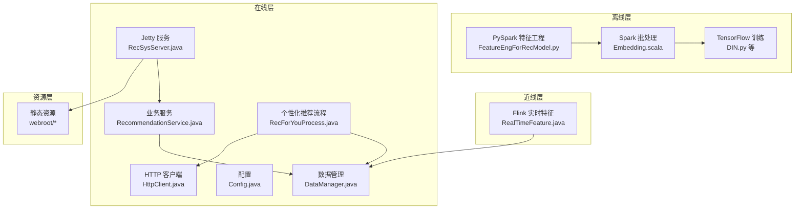
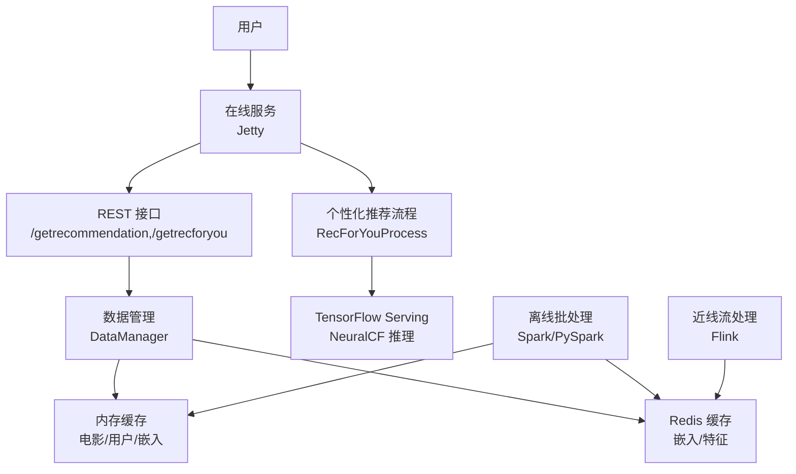
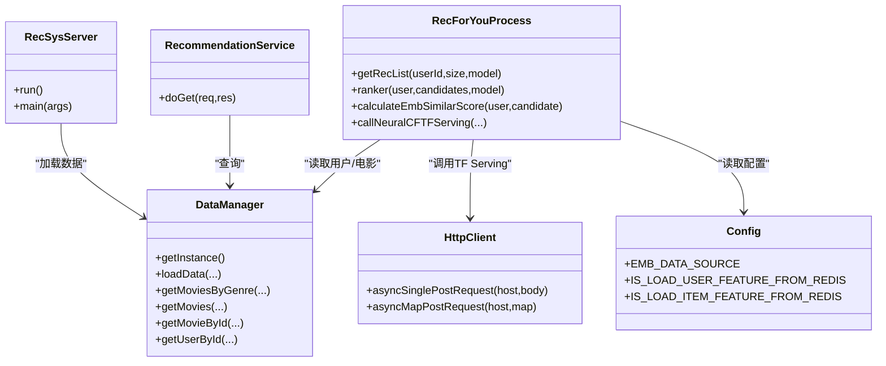
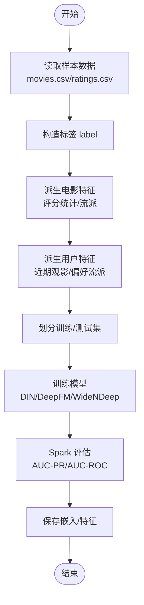
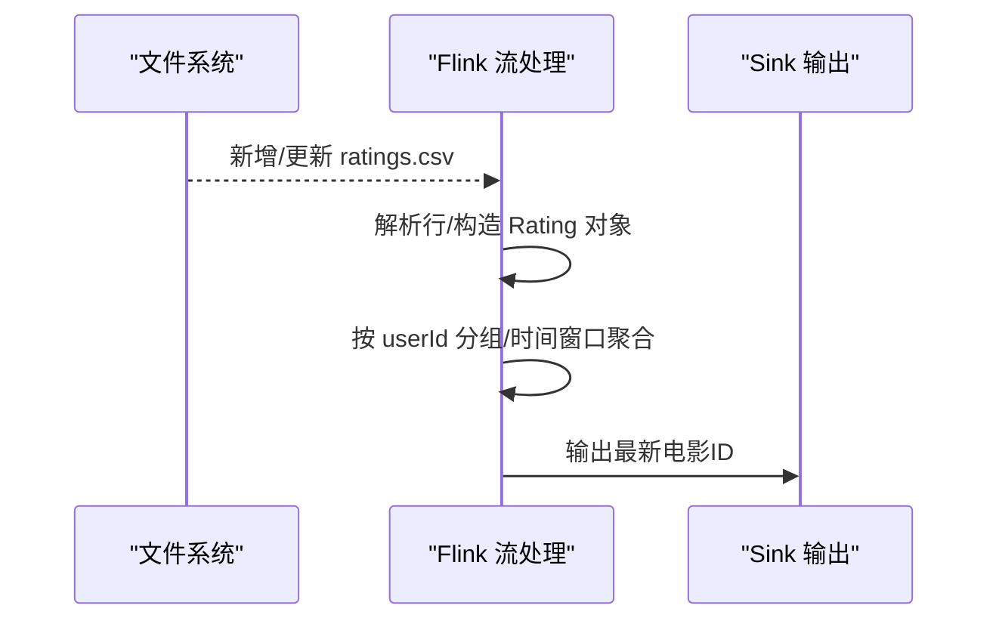
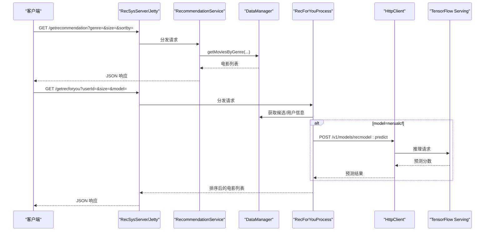
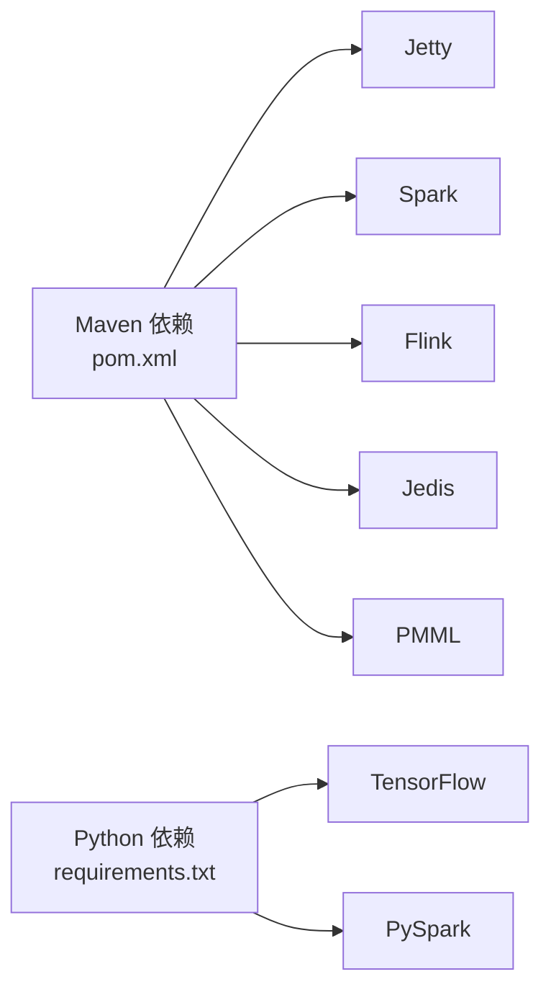

# 系统架构

<cite>
**本文引用的文件**
- [README.md](file://README.md)
- [pom.xml](file://pom.xml)
- [RecSysServer.java](file://src/main/java/com/sparrowrecsys/online/RecSysServer.java)
- [DataManager.java](file://src/main/java/com/sparrowrecsys/online/datamanager/DataManager.java)
- [RecommendationService.java](file://src/main/java/com/sparrowrecsys/online/service/RecommendationService.java)
- [RecForYouProcess.java](file://src/main/java/com/sparrowrecsys/online/recprocess/RecForYouProcess.java)
- [RealTimeFeature.java](file://src/main/java/com/sparrowrecsys/nearline/flink/RealTimeFeature.java)
- [Embedding.scala](file://src/main/java/com/sparrowrecsys/offline/spark/embedding/Embedding.scala)
- [Evaluator.scala](file://src/main/java/com/sparrowrecsys/offline/spark/evaluate/Evaluator.scala)
- [FeatureEngForRecModel.py](file://RecPySpark/src/com/sparrowrecsys/offline/pyspark/featureeng/FeatureEngForRecModel.py)
- [DIN.py](file://TFRecModel/src/com/sparrowrecsys/offline/tensorflow/DIN.py)
- [Config.java](file://src/main/java/com/sparrowrecsys/online/util/Config.java)
- [HttpClient.java](file://src/main/java/com/sparrowrecsys/online/util/HttpClient.java)
- [requirements.txt](file://requirements.txt)
</cite>

## 目录
1. [引言](#引言)
2. [项目结构](#项目结构)
3. [核心组件](#核心组件)
4. [架构总览](#架构总览)
5. [详细组件分析](#详细组件分析)
6. [依赖分析](#依赖分析)
7. [性能考虑](#性能考虑)
8. [故障排查指南](#故障排查指南)
9. [结论](#结论)
10. [附录](#附录)

## 引言
本文件面向开发者与架构师，系统化阐述SparrowRecSys的工业级推荐系统架构：离线数据处理、模型训练、近线流处理、线上服务与前端展示。文档聚焦分层设计与组件协作，解释数据从离线到在线的完整流转路径，并给出架构图与组件关系图，帮助快速理解系统设计思路与技术选型。

## 项目结构
SparrowRecSys采用多模块混合架构：
- 离线层：Spark批处理（Scala）、特征工程（PySpark）、模型训练（Python/TensorFlow）
- 近线层：Flink流处理（实时特征窗口聚合）
- 在线层：Jetty Web服务、Servlet路由、数据加载与缓存、推理调用
- 资源层：静态页面与样本数据（webroot）

图表来源
- [RecSysServer.java](file://src/main/java/com/sparrowrecsys/online/RecSysServer.java#L1-L80)
- [DataManager.java](file://src/main/java/com/sparrowrecsys/online/datamanager/DataManager.java#L1-L295)
- [RecommendationService.java](file://src/main/java/com/sparrowrecsys/online/service/RecommendationService.java#L1-L48)
- [RecForYouProcess.java](file://src/main/java/com/sparrowrecsys/online/recprocess/RecForYouProcess.java#L1-L140)
- [RealTimeFeature.java](file://src/main/java/com/sparrowrecsys/nearline/flink/RealTimeFeature.java#L1-L74)
- [Embedding.scala](file://src/main/java/com/sparrowrecsys/offline/spark/embedding/Embedding.scala#L1-L287)
- [FeatureEngForRecModel.py](file://RecPySpark/src/com/sparrowrecsys/offline/pyspark/featureeng/FeatureEngForRecModel.py#L1-L156)
- [DIN.py](file://TFRecModel/src/com/sparrowrecsys/offline/tensorflow/DIN.py#L1-L190)
- [Config.java](file://src/main/java/com/sparrowrecsys/online/util/Config.java#L1-L14)
- [HttpClient.java](file://src/main/java/com/sparrowrecsys/online/util/HttpClient.java#L1-L164)

章节来源
- [README.md](file://README.md#L1-L57)
- [pom.xml](file://pom.xml#L1-L228)

## 核心组件
- RecSysServer：在线服务入口，启动Jetty，绑定Servlet，加载本地或Redis中的样本数据与嵌入向量，提供REST接口。
- DataManager：单例数据管理器，负责加载电影、评分、链接、嵌入向量与特征，维护反向索引与内存缓存。
- RecommendationService：面向“按类别推荐”的业务服务，读取请求参数，调用DataManager查询并返回JSON。
- RecForYouProcess：个性化推荐流程，支持基于嵌入相似度与TensorFlow Serving推理两种排序策略。
- RealTimeFeature：基于Flink的实时特征流处理示例（最近观看电影窗口）。
- Embedding（Spark）：离线生成Item2Vec、随机游走图嵌入、LSH桶化等。
- FeatureEngForRecModel（PySpark）：特征工程流水线（标签构造、电影/用户特征派生、训练测试集划分）。
- Evaluator（Spark）：二分类指标评估（AUC-PR/AUC-ROC）。
- Config/HttpClient：运行期配置与异步HTTP客户端封装。

章节来源
- [RecSysServer.java](file://src/main/java/com/sparrowrecsys/online/RecSysServer.java#L1-L80)
- [DataManager.java](file://src/main/java/com/sparrowrecsys/online/datamanager/DataManager.java#L1-L295)
- [RecommendationService.java](file://src/main/java/com/sparrowrecsys/online/service/RecommendationService.java#L1-L48)
- [RecForYouProcess.java](file://src/main/java/com/sparrowrecsys/online/recprocess/RecForYouProcess.java#L1-L140)
- [RealTimeFeature.java](file://src/main/java/com/sparrowrecsys/nearline/flink/RealTimeFeature.java#L1-L74)
- [Embedding.scala](file://src/main/java/com/sparrowrecsys/offline/spark/embedding/Embedding.scala#L1-L287)
- [FeatureEngForRecModel.py](file://RecPySpark/src/com/sparrowrecsys/offline/pyspark/featureeng/FeatureEngForRecModel.py#L1-L156)
- [Evaluator.scala](file://src/main/java/com/sparrowrecsys/offline/spark/evaluate/Evaluator.scala#L1-L22)
- [Config.java](file://src/main/java/com/sparrowrecsys/online/util/Config.java#L1-L14)
- [HttpClient.java](file://src/main/java/com/sparrowrecsys/online/util/HttpClient.java#L1-L164)

## 架构总览
经典工业级推荐系统通常分为四层：
- 离线层：大规模数据处理与模型训练，产出嵌入、特征与模型。
- 近线层：流式特征计算与缓存更新，降低在线延迟。
- 在线层：低延迟服务，响应用户请求，完成召回与粗排/重排。
- 表现层：前端页面与可视化。

图表来源
- [RecSysServer.java](file://src/main/java/com/sparrowrecsys/online/RecSysServer.java#L64-L70)
- [RecommendationService.java](file://src/main/java/com/sparrowrecsys/online/service/RecommendationService.java#L18-L47)
- [DataManager.java](file://src/main/java/com/sparrowrecsys/online/datamanager/DataManager.java#L39-L50)
- [RecForYouProcess.java](file://src/main/java/com/sparrowrecsys/online/recprocess/RecForYouProcess.java#L29-L60)
- [Embedding.scala](file://src/main/java/com/sparrowrecsys/offline/spark/embedding/Embedding.scala#L103-L138)
- [FeatureEngForRecModel.py](file://RecPySpark/src/com/sparrowrecsys/offline/pyspark/featureeng/FeatureEngForRecModel.py#L116-L139)
- [RealTimeFeature.java](file://src/main/java/com/sparrowrecsys/nearline/flink/RealTimeFeature.java#L30-L68)

## 详细组件分析

### 在线服务与数据层
- RecSysServer：初始化Jetty，设置静态资源根目录，注册多个Servlet映射；启动时加载样本数据与嵌入向量，支持环境变量端口配置。
- DataManager：单例模式，负责加载电影、链接、评分、嵌入与特征；支持从文件或Redis加载；维护类型安全的内存结构与反向索引。
- RecommendationService：解析genre/size/sortby参数，调用DataManager获取结果并序列化为JSON返回。
- RecForYouProcess：根据用户ID与候选集，支持“嵌入相似度”与“NeuralCF推理”两种排序；可从Redis拉取用户嵌入与特征；通过HttpClient调用TensorFlow Serving。

图表来源
- [RecSysServer.java](file://src/main/java/com/sparrowrecsys/online/RecSysServer.java#L27-L78)
- [DataManager.java](file://src/main/java/com/sparrowrecsys/online/datamanager/DataManager.java#L13-L295)
- [RecommendationService.java](file://src/main/java/com/sparrowrecsys/online/service/RecommendationService.java#L18-L47)
- [RecForYouProcess.java](file://src/main/java/com/sparrowrecsys/online/recprocess/RecForYouProcess.java#L20-L140)
- [Config.java](file://src/main/java/com/sparrowrecsys/online/util/Config.java#L3-L14)
- [HttpClient.java](file://src/main/java/com/sparrowrecsys/online/util/HttpClient.java#L20-L84)

章节来源
- [RecSysServer.java](file://src/main/java/com/sparrowrecsys/online/RecSysServer.java#L1-L80)
- [DataManager.java](file://src/main/java/com/sparrowrecsys/online/datamanager/DataManager.java#L1-L295)
- [RecommendationService.java](file://src/main/java/com/sparrowrecsys/online/service/RecommendationService.java#L1-L48)
- [RecForYouProcess.java](file://src/main/java/com/sparrowrecsys/online/recprocess/RecForYouProcess.java#L1-L140)
- [Config.java](file://src/main/java/com/sparrowrecsys/online/util/Config.java#L1-L14)
- [HttpClient.java](file://src/main/java/com/sparrowrecsys/online/util/HttpClient.java#L1-L164)

### 离线数据处理与模型训练
- PySpark特征工程：构造标签、提取年份、拆分流派、派生用户/电影统计特征、划分训练/测试集。
- Spark嵌入：Item2Vec训练、随机游走图嵌入、LSH桶化检索。
- 模型训练：TensorFlow/Keras定义DIN等模型，读取CSV数据集进行训练与评估。
- 评估：Spark ML评估二分类指标。

图表来源
- [FeatureEngForRecModel.py](file://RecPySpark/src/com/sparrowrecsys/offline/pyspark/featureeng/FeatureEngForRecModel.py#L12-L139)
- [Embedding.scala](file://src/main/java/com/sparrowrecsys/offline/spark/embedding/Embedding.scala#L103-L138)
- [Evaluator.scala](file://src/main/java/com/sparrowrecsys/offline/spark/evaluate/Evaluator.scala#L7-L21)
- [DIN.py](file://TFRecModel/src/com/sparrowrecsys/offline/tensorflow/DIN.py#L14-L178)

章节来源
- [FeatureEngForRecModel.py](file://RecPySpark/src/com/sparrowrecsys/offline/pyspark/featureeng/FeatureEngForRecModel.py#L1-L156)
- [Embedding.scala](file://src/main/java/com/sparrowrecsys/offline/spark/embedding/Embedding.scala#L1-L287)
- [Evaluator.scala](file://src/main/java/com/sparrowrecsys/offline/spark/evaluate/Evaluator.scala#L1-L22)
- [DIN.py](file://TFRecModel/src/com/sparrowrecsys/offline/tensorflow/DIN.py#L1-L190)

### 近线流处理
- Flink实时特征：监控评分文件目录，按用户窗口聚合，输出最新观看电影ID，便于近线缓存更新。

图表来源
- [RealTimeFeature.java](file://src/main/java/com/sparrowrecsys/nearline/flink/RealTimeFeature.java#L30-L68)

章节来源
- [RealTimeFeature.java](file://src/main/java/com/sparrowrecsys/nearline/flink/RealTimeFeature.java#L1-L74)

### 线上服务调用链
- 请求路径：/getrecommendation → RecommendationService → DataManager（按类别筛选）→ JSON返回
- 个性化路径：/getrecforyou → RecForYouProcess → DataManager（候选集与用户特征）→ 可选调用TF Serving → 返回排序结果

图表来源
- [RecSysServer.java](file://src/main/java/com/sparrowrecsys/online/RecSysServer.java#L64-L70)
- [RecommendationService.java](file://src/main/java/com/sparrowrecsys/online/service/RecommendationService.java#L18-L47)
- [RecForYouProcess.java](file://src/main/java/com/sparrowrecsys/online/recprocess/RecForYouProcess.java#L29-L138)
- [HttpClient.java](file://src/main/java/com/sparrowrecsys/online/util/HttpClient.java#L21-L40)

章节来源
- [RecSysServer.java](file://src/main/java/com/sparrowrecsys/online/RecSysServer.java#L1-L80)
- [RecommendationService.java](file://src/main/java/com/sparrowrecsys/online/service/RecommendationService.java#L1-L48)
- [RecForYouProcess.java](file://src/main/java/com/sparrowrecsys/online/recprocess/RecForYouProcess.java#L1-L140)
- [HttpClient.java](file://src/main/java/com/sparrowrecsys/online/util/HttpClient.java#L1-L164)

## 依赖分析
- Maven依赖：Jetty（Web容器）、Spark（批处理/SQL/MLlib）、Flink（流处理）、Jedis（Redis）、PMML（模型导出）、HTTP组件等。
- Python依赖：TensorFlow、PySpark、psutil等。
- 组件耦合：在线服务通过DataManager统一访问数据；个性化流程通过HttpClient调用外部TF Serving；离线批处理与近线流处理通过文件/Redis与在线共享数据。

图表来源
- [pom.xml](file://pom.xml#L60-L227)
- [requirements.txt](file://requirements.txt#L1-L4)

章节来源
- [pom.xml](file://pom.xml#L1-L228)
- [requirements.txt](file://requirements.txt#L1-L4)

## 性能考虑
- 数据加载与缓存
  - 使用DataManager单例与内存结构（HashMap/反向索引）提升查询效率。
  - 支持从文件或Redis加载嵌入与特征，减少磁盘IO。
- 排序与候选集
  - RecForYouProcess设定候选规模上限，避免排序开销过大。
  - 嵌入相似度计算直接复用向量，推理调用按需触发。
- 并发与网络
  - HttpClient使用异步HTTP客户端，提高并发吞吐。
  - Jetty默认端口可由环境变量覆盖，便于容器化部署。
- 特征工程与模型
  - PySpark特征工程与Spark嵌入采用分布式计算，适合大规模数据。
  - TensorFlow Serving独立部署，隔离在线服务与推理负载。

[本节为通用指导，不直接分析具体文件]

## 故障排查指南
- 服务无法启动
  - 检查端口占用与环境变量PORT；确认webroot路径存在且包含样本数据。
- 推荐为空
  - 检查DataManager是否成功加载嵌入与特征；确认EMB_DATA_SOURCE与Redis开关配置。
- 个性化推荐异常
  - 检查TF Serving地址与端口；确认实例格式与字段一致；查看HttpClient返回内容。
- 实时特征未更新
  - 检查Flink监控目录与文件权限；确认窗口聚合逻辑与Sink输出。

章节来源
- [RecSysServer.java](file://src/main/java/com/sparrowrecsys/online/RecSysServer.java#L25-L78)
- [DataManager.java](file://src/main/java/com/sparrowrecsys/online/datamanager/DataManager.java#L39-L164)
- [RecForYouProcess.java](file://src/main/java/com/sparrowrecsys/online/recprocess/RecForYouProcess.java#L113-L138)
- [HttpClient.java](file://src/main/java/com/sparrowrecsys/online/util/HttpClient.java#L21-L84)
- [RealTimeFeature.java](file://src/main/java/com/sparrowrecsys/nearline/flink/RealTimeFeature.java#L30-L68)

## 结论
SparrowRecSys以清晰的分层架构实现了从离线到在线的完整推荐链路：离线批处理与特征工程产出高质量嵌入与特征，近线流处理补充实时信号，线上服务通过统一数据管理器与轻量排序满足低延迟需求。技术栈选择兼顾易用性与工业实践：Spark批处理、Flink流处理、Jetty Web容器、TensorFlow Serving推理，形成可扩展、可运维的推荐系统基础框架。

[本节为总结性内容，不直接分析具体文件]

## 附录
- 技术选型说明
  - Spark：批处理与机器学习生态成熟，适合大规模特征工程与嵌入训练。
  - PySpark：在JVM之上提供Python生态，便于快速迭代特征工程脚本。
  - TensorFlow：深度学习建模与Serving成熟，便于集成到线上。
  - Flink：事件时间窗口与高吞吐，适合近线实时特征。
  - Jetty：轻量嵌入式Web容器，适合内网服务与演示场景。
  - Redis：低延迟KV存储，承载嵌入与特征缓存。

章节来源
- [README.md](file://README.md#L19-L57)
- [pom.xml](file://pom.xml#L60-L227)
- [requirements.txt](file://requirements.txt#L1-L4)