# 组件交互

<cite>
**本文引用的文件**
- [RecSysServer.java](file://src/main/java/com/sparrowrecsys/online/RecSysServer.java)
- [DataManager.java](file://src/main/java/com/sparrowrecsys/online/datamanager/DataManager.java)
- [MovieService.java](file://src/main/java/com/sparrowrecsys/online/service/MovieService.java)
- [UserService.java](file://src/main/java/com/sparrowrecsys/online/service/UserService.java)
- [SimilarMovieService.java](file://src/main/java/com/sparrowrecsys/online/service/SimilarMovieService.java)
- [RecommendationService.java](file://src/main/java/com/sparrowrecsys/online/service/RecommendationService.java)
- [RecForYouService.java](file://src/main/java/com/sparrowrecsys/online/service/RecForYouService.java)
- [RecForYouProcess.java](file://src/main/java/com/sparrowrecsys/online/recprocess/RecForYouProcess.java)
- [SimilarMovieProcess.java](file://src/main/java/com/sparrowrecsys/online/recprocess/SimilarMovieProcess.java)
- [Config.java](file://src/main/java/com/sparrowrecsys/online/util/Config.java)
- [Utility.java](file://src/main/java/com/sparrowrecsys/online/util/Utility.java)
- [HttpClient.java](file://src/main/java/com/sparrowrecsys/online/util/HttpClient.java)
- [ABTest.java](file://src/main/java/com/sparrowrecsys/online/util/ABTest.java)
- [Embedding.java](file://src/main/java/com/sparrowrecsys/online/model/Embedding.java)
- [Movie.java](file://src/main/java/com/sparrowrecsys/online/datamanager/Movie.java)
</cite>

## 目录
1. [简介](#简介)
2. [项目结构](#项目结构)
3. [核心组件](#核心组件)
4. [架构总览](#架构总览)
5. [组件详细分析](#组件详细分析)
6. [依赖关系分析](#依赖关系分析)
7. [性能考量](#性能考量)
8. [故障排查指南](#故障排查指南)
9. [结论](#结论)
10. [附录](#附录)

## 简介
本文件聚焦于SparrowRecSys在线推荐服务的组件交互机制，系统通过嵌入式Jetty服务器对外提供REST风格的HTTP接口，核心在线组件包括RecSysServer（入口与上下文装配）、DataManager（数据加载与缓存）、各类Service（业务接口层）以及RecProcess（推荐算法流程）。文档将深入解析组件间的协作模式、依赖注入与控制反转思想的体现、数据在组件间的传递与状态管理、生命周期与初始化顺序，并给出关键交互的时序图与调用链图，帮助开发者快速理解并扩展系统。

## 项目结构
在线模块采用按职责分层的组织方式：
- 在线入口：RecSysServer负责启动Jetty、绑定静态资源与Servlet映射、完成数据加载与服务注册。
- 数据层：DataManager作为单例，负责从文件或Redis加载电影、用户、评分、嵌入向量等数据，并维护索引与查询能力。
- 接口层：各Servlet Service处理HTTP请求，解析参数，调用DataManager或RecProcess获取结果并返回JSON。
- 推荐流程层：RecForYouProcess与SimilarMovieProcess封装具体推荐策略（候选生成、排序、调用外部模型等）。
- 工具与配置：Config集中配置开关；Utility提供嵌入字符串解析；HttpClient封装异步HTTP调用；ABTest支持简单A/B流量切分；Embedding与Movie等模型类承载数据结构。

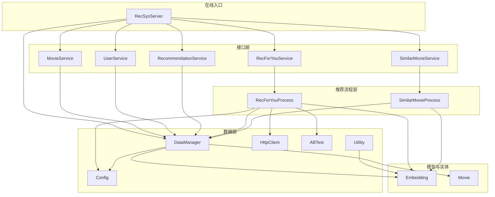

图表来源
- [RecSysServer.java](file://src/main/java/com/sparrowrecsys/online/RecSysServer.java#L27-L78)
- [DataManager.java](file://src/main/java/com/sparrowrecsys/online/datamanager/DataManager.java#L13-L50)
- [MovieService.java](file://src/main/java/com/sparrowrecsys/online/service/MovieService.java#L16-L45)
- [UserService.java](file://src/main/java/com/sparrowrecsys/online/service/UserService.java#L15-L44)
- [SimilarMovieService.java](file://src/main/java/com/sparrowrecsys/online/service/SimilarMovieService.java#L16-L45)
- [RecommendationService.java](file://src/main/java/com/sparrowrecsys/online/service/RecommendationService.java#L18-L47)
- [RecForYouService.java](file://src/main/java/com/sparrowrecsys/online/service/RecForYouService.java#L20-L54)
- [RecForYouProcess.java](file://src/main/java/com/sparrowrecsys/online/recprocess/RecForYouProcess.java#L20-L139)
- [SimilarMovieProcess.java](file://src/main/java/com/sparrowrecsys/online/recprocess/SimilarMovieProcess.java#L11-L173)
- [Config.java](file://src/main/java/com/sparrowrecsys/online/util/Config.java#L3-L13)
- [Utility.java](file://src/main/java/com/sparrowrecsys/online/util/Utility.java#L5-L14)
- [HttpClient.java](file://src/main/java/com/sparrowrecsys/online/util/HttpClient.java#L20-L83)
- [ABTest.java](file://src/main/java/com/sparrowrecsys/online/util/ABTest.java#L3-L27)
- [Embedding.java](file://src/main/java/com/sparrowrecsys/online/model/Embedding.java#L8-L48)
- [Movie.java](file://src/main/java/com/sparrowrecsys/online/datamanager/Movie.java#L15-L157)

章节来源
- [RecSysServer.java](file://src/main/java/com/sparrowrecsys/online/RecSysServer.java#L27-L78)
- [DataManager.java](file://src/main/java/com/sparrowrecsys/online/datamanager/DataManager.java#L13-L50)

## 核心组件
- RecSysServer：应用入口，负责端口监听、静态资源根路径设置、数据加载与Servlet绑定，形成“控制反转”的容器角色，将服务实例交由Jetty托管。
- DataManager：单例数据管理器，负责加载电影、链接、评分、嵌入向量与特征，构建反向索引，提供查询接口。
- Service层：各Servlet继承自HttpServlet，负责参数解析、响应格式化、异常兜底，依赖DataManager或RecProcess。
- RecProcess层：封装推荐候选生成与排序逻辑，支持多种模型（嵌入相似度、默认排序、NeuralCF TF Serving调用）。
- 工具与配置：Config集中配置项；Utility提供嵌入向量解析；HttpClient封装异步HTTP调用；ABTest进行简单流量切分；Embedding与Movie等模型类承载数据结构。

章节来源
- [RecSysServer.java](file://src/main/java/com/sparrowrecsys/online/RecSysServer.java#L18-L78)
- [DataManager.java](file://src/main/java/com/sparrowrecsys/online/datamanager/DataManager.java#L13-L294)
- [MovieService.java](file://src/main/java/com/sparrowrecsys/online/service/MovieService.java#L16-L45)
- [UserService.java](file://src/main/java/com/sparrowrecsys/online/service/UserService.java#L15-L44)
- [SimilarMovieService.java](file://src/main/java/com/sparrowrecsys/online/service/SimilarMovieService.java#L16-L45)
- [RecommendationService.java](file://src/main/java/com/sparrowrecsys/online/service/RecommendationService.java#L18-L47)
- [RecForYouService.java](file://src/main/java/com/sparrowrecsys/online/service/RecForYouService.java#L20-L54)
- [RecForYouProcess.java](file://src/main/java/com/sparrowrecsys/online/recprocess/RecForYouProcess.java#L20-L139)
- [SimilarMovieProcess.java](file://src/main/java/com/sparrowrecsys/online/recprocess/SimilarMovieProcess.java#L11-L173)
- [Config.java](file://src/main/java/com/sparrowrecsys/online/util/Config.java#L3-L13)
- [Utility.java](file://src/main/java/com/sparrowrecsys/online/util/Utility.java#L5-L14)
- [HttpClient.java](file://src/main/java/com/sparrowrecsys/online/util/HttpClient.java#L20-L83)
- [ABTest.java](file://src/main/java/com/sparrowrecsys/online/util/ABTest.java#L3-L27)
- [Embedding.java](file://src/main/java/com/sparrowrecsys/online/model/Embedding.java#L8-L48)
- [Movie.java](file://src/main/java/com/sparrowrecsys/online/datamanager/Movie.java#L15-L157)

## 架构总览
系统采用“入口装配 + 单例数据 + 流程封装 + 工具支撑”的架构。入口负责初始化与装配，数据层负责数据加载与查询，接口层负责请求处理，流程层负责推荐策略，工具层提供通用能力。

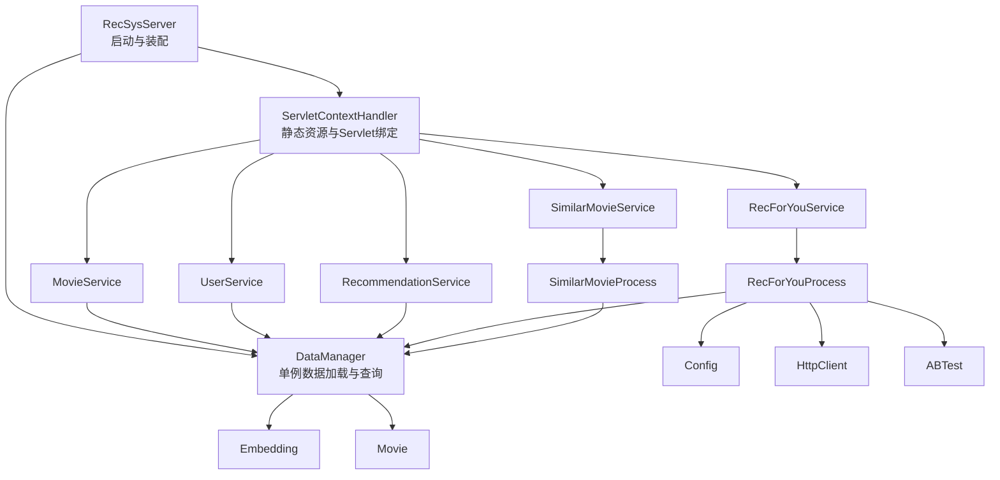

图表来源
- [RecSysServer.java](file://src/main/java/com/sparrowrecsys/online/RecSysServer.java#L56-L77)
- [DataManager.java](file://src/main/java/com/sparrowrecsys/online/datamanager/DataManager.java#L13-L50)
- [RecForYouProcess.java](file://src/main/java/com/sparrowrecsys/online/recprocess/RecForYouProcess.java#L20-L139)
- [SimilarMovieProcess.java](file://src/main/java/com/sparrowrecsys/online/recprocess/SimilarMovieProcess.java#L11-L173)
- [Config.java](file://src/main/java/com/sparrowrecsys/online/util/Config.java#L3-L13)
- [HttpClient.java](file://src/main/java/com/sparrowrecsys/online/util/HttpClient.java#L20-L83)
- [ABTest.java](file://src/main/java/com/sparrowrecsys/online/util/ABTest.java#L3-L27)
- [Embedding.java](file://src/main/java/com/sparrowrecsys/online/model/Embedding.java#L8-L48)
- [Movie.java](file://src/main/java/com/sparrowrecsys/online/datamanager/Movie.java#L15-L157)

## 组件详细分析

### RecSysServer：入口与装配
- 职责
  - 解析环境变量端口，创建Jetty Server。
  - 定位webroot路径，设置欢迎页与MIME映射。
  - 加载样本数据到DataManager（电影、链接、评分、嵌入向量、用户嵌入）。
  - 将各Service绑定到不同URL路径，交由ServletContextHandler管理。
- 控制反转与依赖注入
  - 通过构造Servlet实例并交由ServletHolder绑定，体现了对Servlet生命周期的托管，属于“控制反转”。
  - DataManager通过单例提供全局数据访问，避免在入口中直接耦合具体数据源。
- 初始化顺序
  - 先加载数据，再注册Servlet，最后启动Server，确保服务可用前数据已就绪。

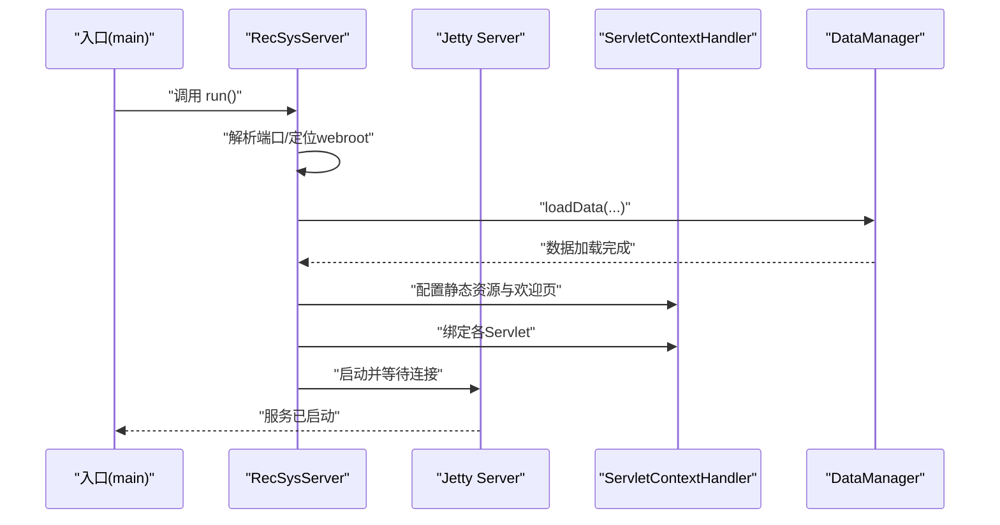

图表来源
- [RecSysServer.java](file://src/main/java/com/sparrowrecsys/online/RecSysServer.java#L27-L78)
- [DataManager.java](file://src/main/java/com/sparrowrecsys/online/datamanager/DataManager.java#L40-L50)

章节来源
- [RecSysServer.java](file://src/main/java/com/sparrowrecsys/online/RecSysServer.java#L27-L78)

### DataManager：数据加载与查询
- 职责
  - 单例模式提供全局数据访问。
  - 支持从文件或Redis加载电影、链接、评分、嵌入向量与特征。
  - 维护电影ID到对象映射、用户ID到对象映射、流派反向索引。
  - 提供按流派、评分、年份排序的查询方法。
- 数据结构与复杂度
  - 电影/用户映射：HashMap，查询O(1)。
  - 流派反向索引：HashMap<String, List<Movie>>，查询O(k)（k为该流派电影数）。
  - 评分聚合：在插入时维护平均分与Top评分列表，插入O(n)（n为Top列表长度）。
- 配置与数据源
  - 通过Config选择嵌入向量来源（文件/Redis），以及是否从Redis加载用户/物品特征。

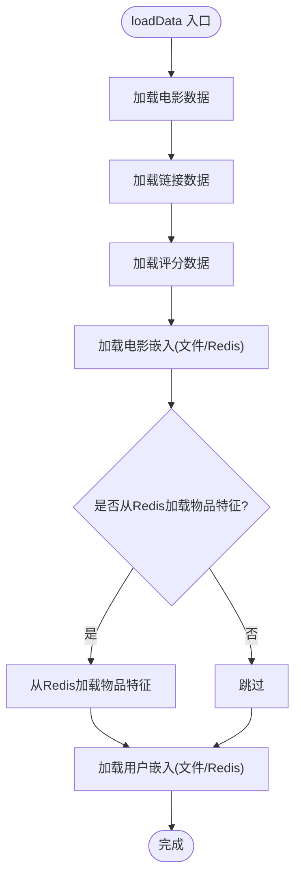

图表来源
- [DataManager.java](file://src/main/java/com/sparrowrecsys/online/datamanager/DataManager.java#L40-L164)
- [Config.java](file://src/main/java/com/sparrowrecsys/online/util/Config.java#L7-L11)

章节来源
- [DataManager.java](file://src/main/java/com/sparrowrecsys/online/datamanager/DataManager.java#L13-L294)
- [Config.java](file://src/main/java/com/sparrowrecsys/online/util/Config.java#L3-L13)

### MovieService：电影详情查询
- 请求处理
  - 解析id参数，调用DataManager.getMovieById获取电影对象。
  - 使用Jackson序列化为JSON并返回。
- 错误处理
  - 异常捕获并返回空字符串，保证接口健壮性。

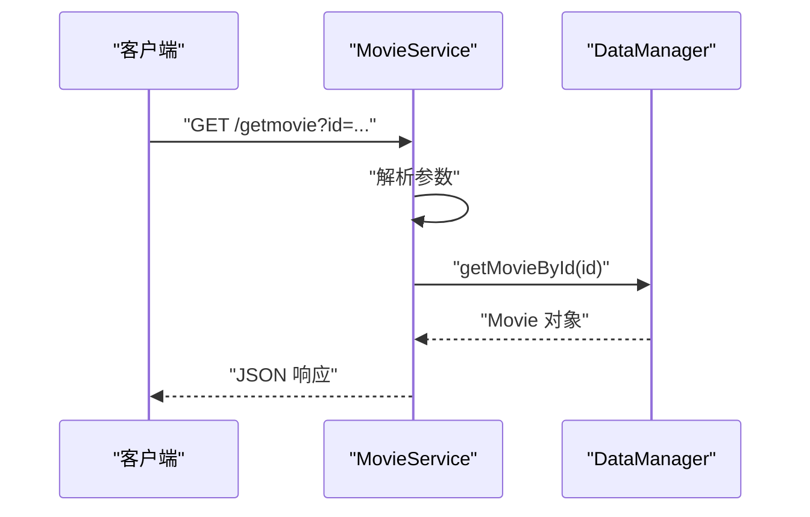

图表来源
- [MovieService.java](file://src/main/java/com/sparrowrecsys/online/service/MovieService.java#L16-L45)
- [DataManager.java](file://src/main/java/com/sparrowrecsys/online/datamanager/DataManager.java#L285-L293)

章节来源
- [MovieService.java](file://src/main/java/com/sparrowrecsys/online/service/MovieService.java#L16-L45)
- [DataManager.java](file://src/main/java/com/sparrowrecsys/online/datamanager/DataManager.java#L285-L293)

### UserService：用户详情查询
- 请求处理
  - 解析id参数，调用DataManager.getUserById获取用户对象。
  - 使用Jackson序列化为JSON并返回。
- 错误处理
  - 异常捕获并返回空字符串。

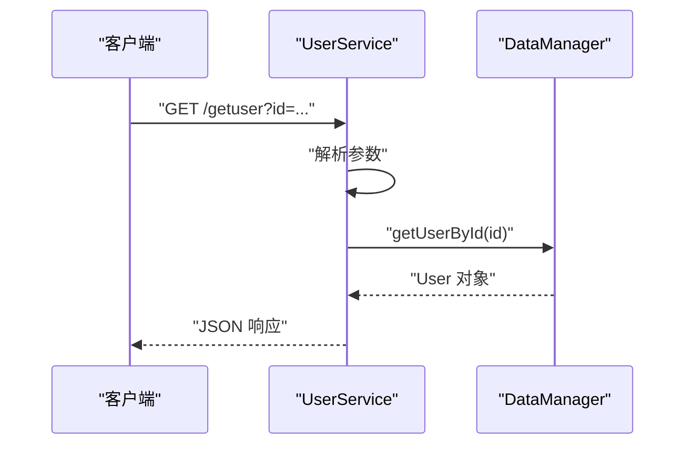

图表来源
- [UserService.java](file://src/main/java/com/sparrowrecsys/online/service/UserService.java#L15-L44)
- [DataManager.java](file://src/main/java/com/sparrowrecsys/online/datamanager/DataManager.java#L290-L293)

章节来源
- [UserService.java](file://src/main/java/com/sparrowrecsys/online/service/UserService.java#L15-L44)
- [DataManager.java](file://src/main/java/com/sparrowrecsys/online/datamanager/DataManager.java#L290-L293)

### RecommendationService：基于流派的推荐
- 请求处理
  - 解析genre、size、sortby参数，调用DataManager.getMoviesByGenre获取电影列表。
  - 使用Jackson序列化为JSON并返回。
- 排序策略
  - 支持按评分或上映年份排序，内部通过switch分支实现。

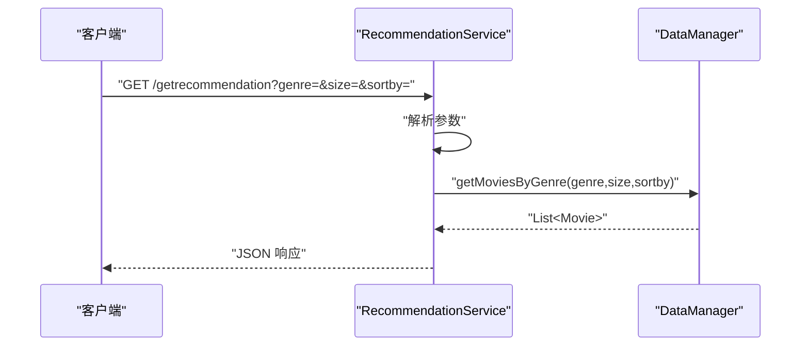

图表来源
- [RecommendationService.java](file://src/main/java/com/sparrowrecsys/online/service/RecommendationService.java#L18-L47)
- [DataManager.java](file://src/main/java/com/sparrowrecsys/online/datamanager/DataManager.java#L252-L283)

章节来源
- [RecommendationService.java](file://src/main/java/com/sparrowrecsys/online/service/RecommendationService.java#L18-L47)
- [DataManager.java](file://src/main/java/com/sparrowrecsys/online/datamanager/DataManager.java#L252-L283)

### SimilarMovieService：相似影片推荐
- 请求处理
  - 解析movieId、size、model参数，调用SimilarMovieProcess.getRecList生成候选并排序。
  - 使用Jackson序列化为JSON并返回。
- 模型选择
  - 支持emb（嵌入相似度）与其他默认相似度计算。

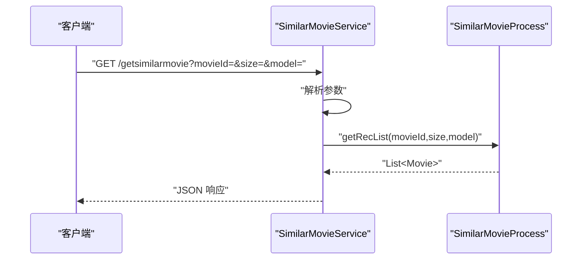

图表来源
- [SimilarMovieService.java](file://src/main/java/com/sparrowrecsys/online/service/SimilarMovieService.java#L16-L45)
- [SimilarMovieProcess.java](file://src/main/java/com/sparrowrecsys/online/recprocess/SimilarMovieProcess.java#L20-L137)

章节来源
- [SimilarMovieService.java](file://src/main/java/com/sparrowrecsys/online/service/SimilarMovieService.java#L16-L45)
- [SimilarMovieProcess.java](file://src/main/java/com/sparrowrecsys/online/recprocess/SimilarMovieProcess.java#L20-L137)

### RecForYouService：个性化推荐（为你推荐）
- 请求处理
  - 解析id、size、model参数。
  - 若启用AB测试，则根据userId分流到不同模型。
  - 调用RecForYouProcess.getRecList生成候选并排序。
  - 使用Jackson序列化为JSON并返回。
- AB测试与模型选择
  - 通过ABTest根据userId哈希分流到emb或neuralcf模型。

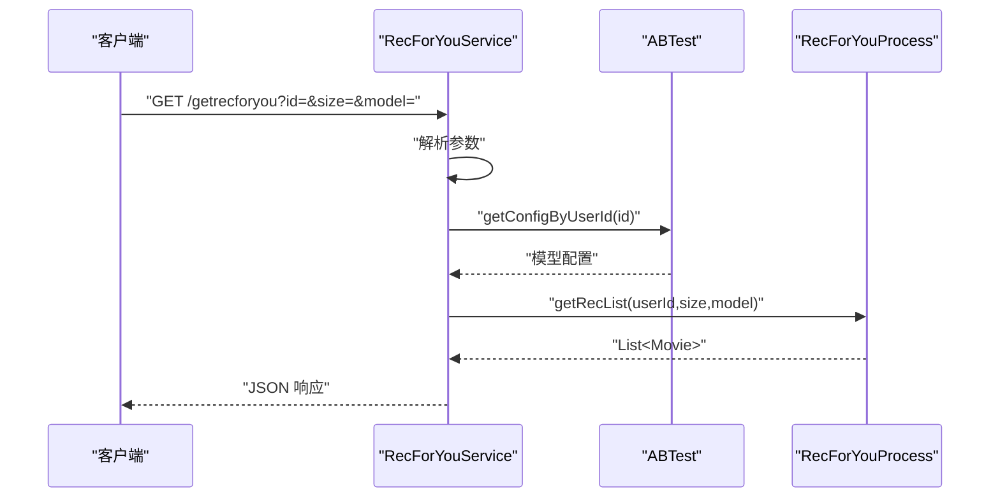

图表来源
- [RecForYouService.java](file://src/main/java/com/sparrowrecsys/online/service/RecForYouService.java#L20-L54)
- [ABTest.java](file://src/main/java/com/sparrowrecsys/online/util/ABTest.java#L11-L26)
- [RecForYouProcess.java](file://src/main/java/com/sparrowrecsys/online/recprocess/RecForYouProcess.java#L29-L60)

章节来源
- [RecForYouService.java](file://src/main/java/com/sparrowrecsys/online/service/RecForYouService.java#L20-L54)
- [ABTest.java](file://src/main/java/com/sparrowrecsys/online/util/ABTest.java#L11-L26)
- [RecForYouProcess.java](file://src/main/java/com/sparrowrecsys/online/recprocess/RecForYouProcess.java#L29-L60)

### RecForYouProcess：个性化推荐流程
- 关键流程
  - 获取用户与候选集（按评分取Top N）。
  - 根据配置从Redis加载用户嵌入与特征。
  - ranker根据模型选择：
    - emb：使用用户嵌入与候选电影嵌入计算余弦相似度。
    - neuralcf：构造实例数组，调用TF Serving获取预测分数。
    - 默认：按候选相对序排序。
  - 返回Top K结果。
- 外部依赖
  - HttpClient用于异步POST请求TF Serving。
  - Config控制数据源与特性加载开关。
  - Utility用于将字符串解析为Embedding。

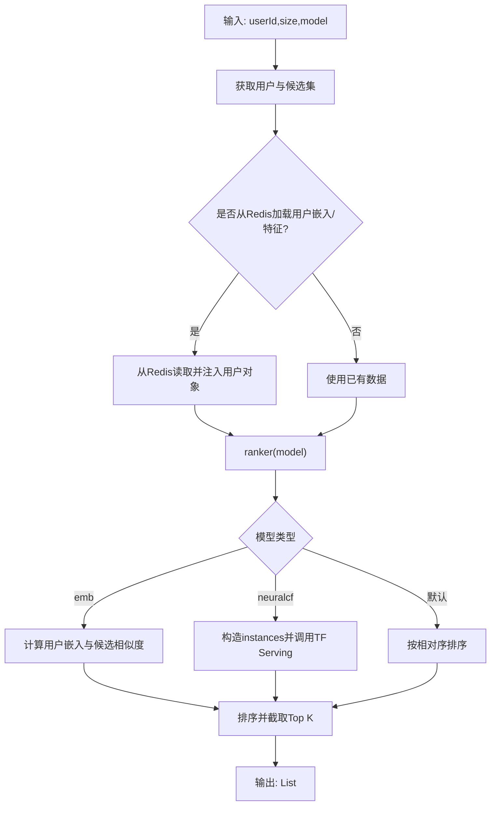

图表来源
- [RecForYouProcess.java](file://src/main/java/com/sparrowrecsys/online/recprocess/RecForYouProcess.java#L29-L138)
- [HttpClient.java](file://src/main/java/com/sparrowrecsys/online/util/HttpClient.java#L21-L40)
- [Config.java](file://src/main/java/com/sparrowrecsys/online/util/Config.java#L7-L11)
- [Utility.java](file://src/main/java/com/sparrowrecsys/online/util/Utility.java#L6-L13)

章节来源
- [RecForYouProcess.java](file://src/main/java/com/sparrowrecsys/online/recprocess/RecForYouProcess.java#L29-L138)
- [HttpClient.java](file://src/main/java/com/sparrowrecsys/online/util/HttpClient.java#L21-L40)
- [Config.java](file://src/main/java/com/sparrowrecsys/online/util/Config.java#L7-L11)
- [Utility.java](file://src/main/java/com/sparrowrecsys/online/util/Utility.java#L6-L13)

### SimilarMovieProcess：相似影片流程
- 关键流程
  - 从DataManager获取目标电影。
  - 候选生成：
    - 多检索：按电影流派取若干候选，叠加高分与最新候选，去重。
    - 嵌入检索：基于电影嵌入相似度生成候选池。
  - 排序：
    - emb：使用电影嵌入相似度。
    - 默认：综合同源数量与平均分加权。
- 复杂度
  - 候选生成涉及多次查询与集合操作，整体受候选规模影响。

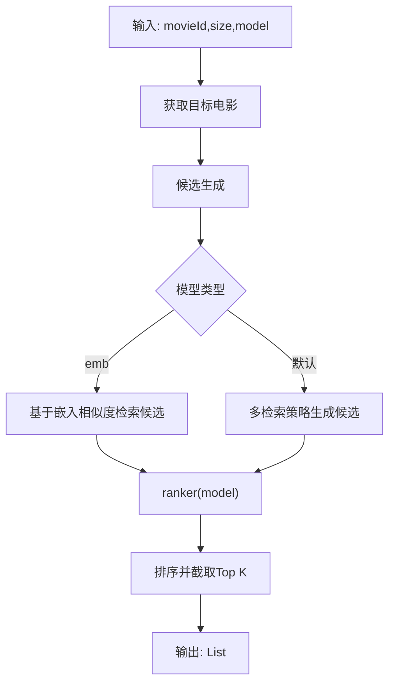

图表来源
- [SimilarMovieProcess.java](file://src/main/java/com/sparrowrecsys/online/recprocess/SimilarMovieProcess.java#L20-L173)

章节来源
- [SimilarMovieProcess.java](file://src/main/java/com/sparrowrecsys/online/recprocess/SimilarMovieProcess.java#L20-L173)

### 工具与配置：Config、Utility、HttpClient、ABTest
- Config：集中配置嵌入数据源、是否从Redis加载特征、是否启用AB测试等。
- Utility：将字符串解析为Embedding向量，供数据加载与相似度计算使用。
- HttpClient：封装异步HTTP客户端，统一处理请求与响应内容提取。
- ABTest：基于userId哈希进行简单流量切分，默认模型回退策略。

章节来源
- [Config.java](file://src/main/java/com/sparrowrecsys/online/util/Config.java#L3-L13)
- [Utility.java](file://src/main/java/com/sparrowrecsys/online/util/Utility.java#L5-L14)
- [HttpClient.java](file://src/main/java/com/sparrowrecsys/online/util/HttpClient.java#L20-L83)
- [ABTest.java](file://src/main/java/com/sparrowrecsys/online/util/ABTest.java#L3-L27)

### 模型与实体：Embedding、Movie
- Embedding：存储向量维度，提供余弦相似度计算。
- Movie：包含基础属性、评分聚合、嵌入与特征字段，支持Top评分列表序列化。

章节来源
- [Embedding.java](file://src/main/java/com/sparrowrecsys/online/model/Embedding.java#L8-L48)
- [Movie.java](file://src/main/java/com/sparrowrecsys/online/datamanager/Movie.java#L15-L157)

## 依赖关系分析
- 组件内聚与耦合
  - RecSysServer与各Service之间为低耦合绑定，通过Servlet映射解耦。
  - Service与DataManager之间为直接依赖，符合“面向接口（抽象）”的思路（通过单例接口访问数据）。
  - RecProcess与DataManager、Embedding、Config、HttpClient之间存在清晰的职责边界。
- 外部依赖
  - Jetty用于HTTP服务。
  - Jackson用于JSON序列化。
  - Apache HttpClient用于异步HTTP调用。
  - Redis（通过RedisClient）用于嵌入与特征的外部存储（代码中可见调用）。
- 循环依赖
  - 当前设计未见循环依赖，Service仅依赖DataManager或RecProcess，流程类仅依赖数据与工具。

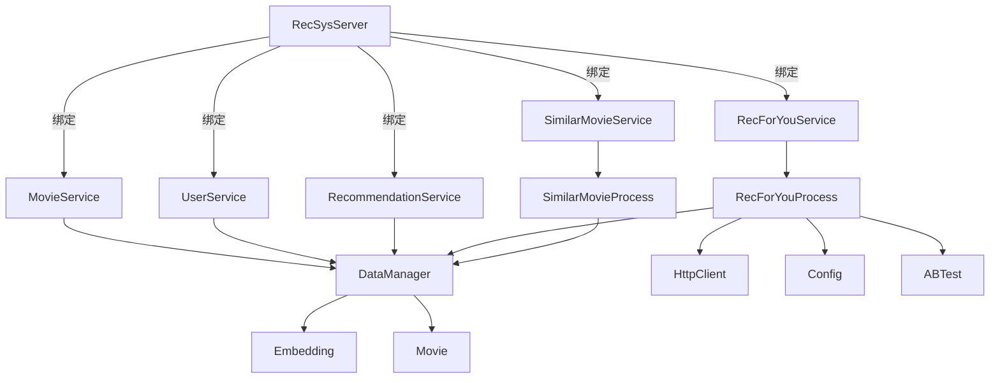

图表来源
- [RecSysServer.java](file://src/main/java/com/sparrowrecsys/online/RecSysServer.java#L63-L70)
- [MovieService.java](file://src/main/java/com/sparrowrecsys/online/service/MovieService.java#L16-L45)
- [UserService.java](file://src/main/java/com/sparrowrecsys/online/service/UserService.java#L15-L44)
- [RecommendationService.java](file://src/main/java/com/sparrowrecsys/online/service/RecommendationService.java#L18-L47)
- [SimilarMovieService.java](file://src/main/java/com/sparrowrecsys/online/service/SimilarMovieService.java#L16-L45)
- [RecForYouService.java](file://src/main/java/com/sparrowrecsys/online/service/RecForYouService.java#L20-L54)
- [RecForYouProcess.java](file://src/main/java/com/sparrowrecsys/online/recprocess/RecForYouProcess.java#L29-L138)
- [SimilarMovieProcess.java](file://src/main/java/com/sparrowrecsys/online/recprocess/SimilarMovieProcess.java#L20-L173)
- [DataManager.java](file://src/main/java/com/sparrowrecsys/online/datamanager/DataManager.java#L13-L294)
- [HttpClient.java](file://src/main/java/com/sparrowrecsys/online/util/HttpClient.java#L20-L83)
- [Config.java](file://src/main/java/com/sparrowrecsys/online/util/Config.java#L3-L13)
- [ABTest.java](file://src/main/java/com/sparrowrecsys/online/util/ABTest.java#L3-L27)
- [Embedding.java](file://src/main/java/com/sparrowrecsys/online/model/Embedding.java#L8-L48)
- [Movie.java](file://src/main/java/com/sparrowrecsys/online/datamanager/Movie.java#L15-L157)

## 性能考量
- 数据加载
  - 文件加载与Redis加载二选一，建议在生产环境中优先考虑Redis以降低I/O开销。
  - 嵌入向量与特征的按需加载（通过Config开关）可减少冷启动时间。
- 查询与排序
  - DataManager的HashMap查询为O(1)，流派反向索引查询为O(k)。
  - 推荐流程中的候选池大小（如CANDIDATE_SIZE）直接影响排序复杂度，建议结合业务阈值调整。
- 异步调用
  - TF Serving调用通过HttpClient异步执行，注意异常处理与超时控制。
- 序列化
  - Jackson序列化为JSON，建议在高频接口上关注序列化开销与压缩策略。

## 故障排查指南
- 启动失败
  - 检查webroot路径是否存在与可访问。
  - 确认环境变量PORT是否为有效整数。
- 数据加载异常
  - 检查CSV文件路径与格式，确认字段顺序与类型匹配。
  - 若使用Redis，确认RedisClient可用且键命名规范一致。
- 接口无响应或空结果
  - 检查参数解析（id、size、model、sortby）是否为空或非法。
  - 对于个性化推荐，确认用户是否存在且嵌入/特征是否加载成功。
- TF Serving调用失败
  - 检查服务地址与端口，确认instances构造正确。
  - 关注HttpClient异常日志与超时设置。

章节来源
- [RecSysServer.java](file://src/main/java/com/sparrowrecsys/online/RecSysServer.java#L27-L78)
- [DataManager.java](file://src/main/java/com/sparrowrecsys/online/datamanager/DataManager.java#L40-L164)
- [HttpClient.java](file://src/main/java/com/sparrowrecsys/online/util/HttpClient.java#L21-L40)

## 结论
SparrowRecSys通过RecSysServer实现“控制反转”的装配与托管，DataManager承担单例数据访问与索引维护，Service层与RecProcess层分别负责接口处理与推荐流程，工具与配置层提供通用能力与运行时开关。整体架构清晰、职责明确，具备良好的扩展性与可维护性。建议在生产环境中进一步完善异常监控、缓存策略与模型推理的可观测性。

## 附录
- 关键调用链参考
  - 个性化推荐：RecForYouService → RecForYouProcess → DataManager/Embedding/HttpClient → 返回JSON。
  - 相似影片：SimilarMovieService → SimilarMovieProcess → DataManager/Embedding → 返回JSON。
  - 电影/用户详情：MovieService/UserService → DataManager → 返回JSON。