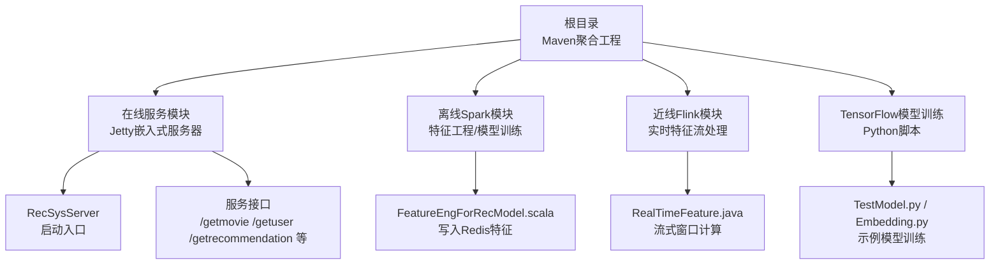
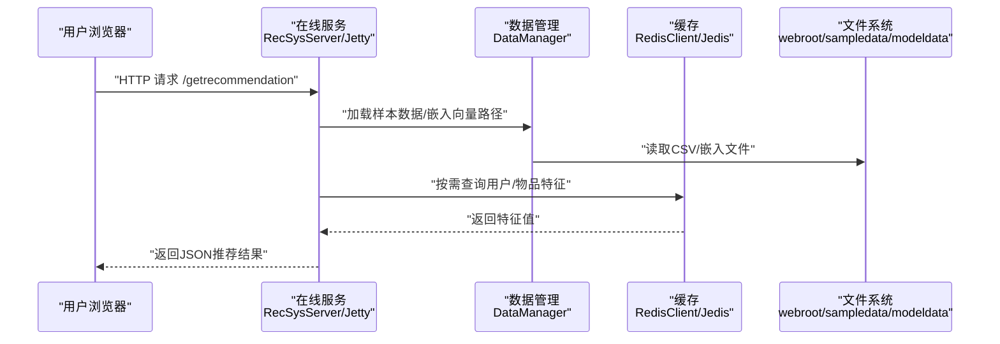
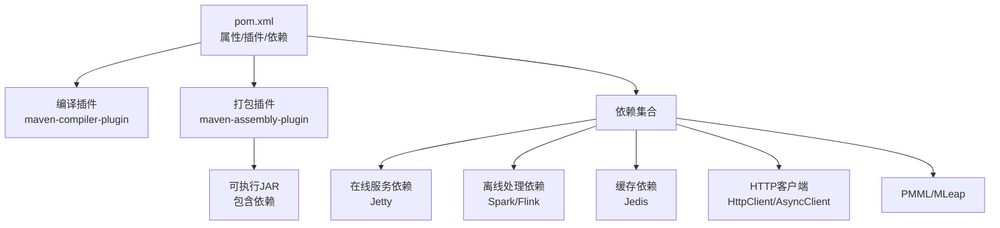
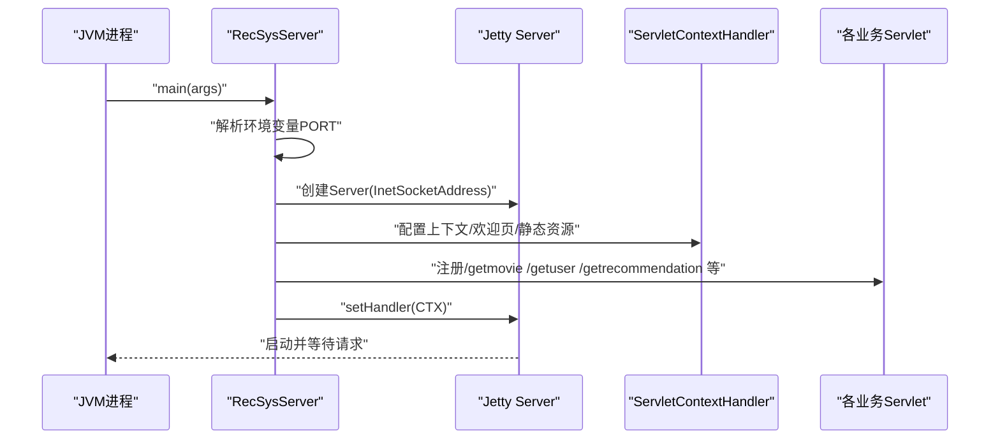
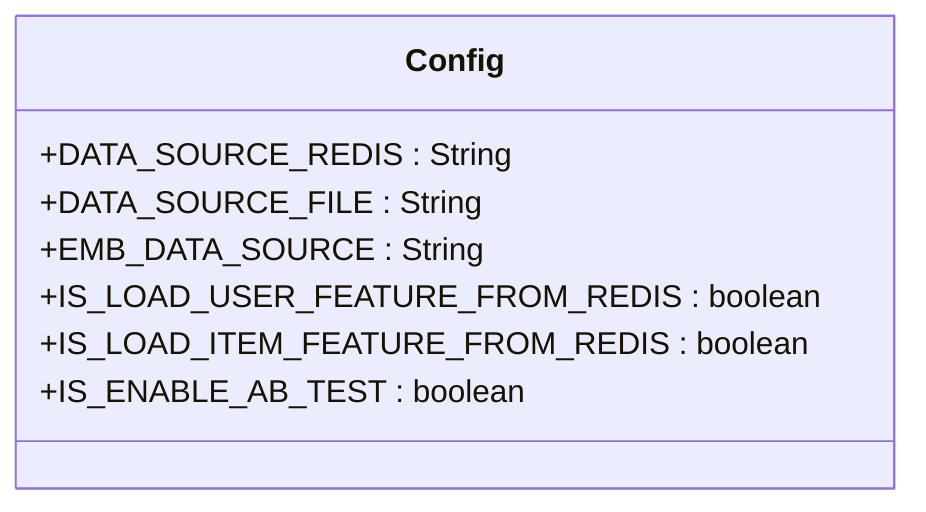
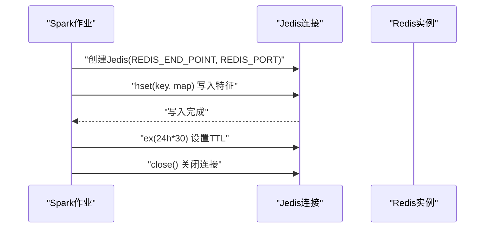
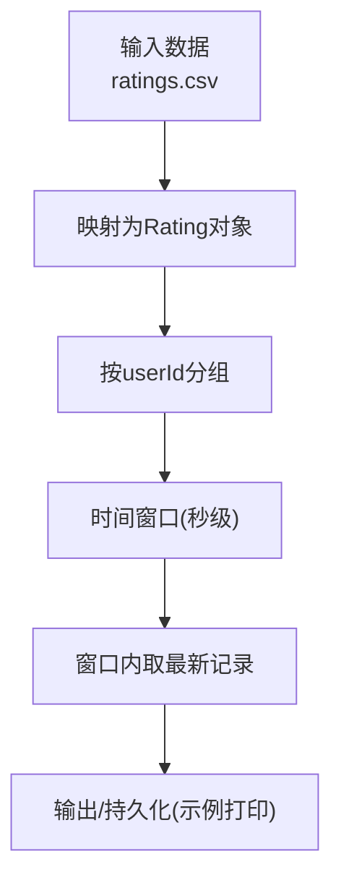
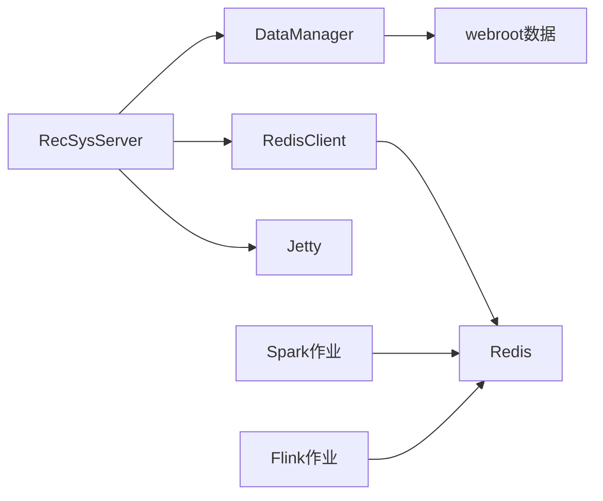

# 部署运维

<cite>
**本文引用的文件**
- [pom.xml](file://pom.xml)
- [README.md](file://README.md)
- [requirements.txt](file://requirements.txt)
- [_config.yml](file://_config.yml)
- [RecSysServer.java](file://src/main/java/com/sparrowrecsys/online/RecSysServer.java)
- [Config.java](file://src/main/java/com/sparrowrecsys/online/util/Config.java)
- [RedisClient.java](file://src/main/java/com/sparrowrecsys/online/datamanager/RedisClient.java)
- [RealTimeFeature.java](file://src/main/java/com/sparrowrecsys/nearline/flink/RealTimeFeature.java)
- [FeatureEngForRecModel.scala](file://src/main/java/com/sparrowrecsys/offline/spark/featureeng/FeatureEngForRecModel.scala)
</cite>

## 目录
1. [简介](#简介)
2. [项目结构](#项目结构)
3. [核心组件](#核心组件)
4. [架构总览](#架构总览)
5. [详细组件分析](#详细组件分析)
6. [依赖关系分析](#依赖关系分析)
7. [性能与监控](#性能与监控)
8. [故障排查指南](#故障排查指南)
9. [结论](#结论)
10. [附录：部署与运维实践](#附录：部署与运维实践)

## 简介
本指南面向运维工程师，围绕SparrowRecSys项目的构建、打包、配置管理、部署与运维进行系统化说明。内容涵盖：
- 基于Maven的项目构建与依赖管理
- 生产环境部署流程（打包、配置、环境变量）
- 配置管理机制（Config类与运行时参数）
- 性能监控与日志管理最佳实践
- 扩展性与水平扩展策略
- Docker容器化与Kubernetes部署建议
- 运维自动化与CI/CD流程参考

## 项目结构
SparrowRecSys采用多模块混合架构，包含在线服务、离线Spark/Flink处理、TensorFlow模型训练与推理等子模块。在线服务以Jetty嵌入式服务器对外提供REST接口；离线模块负责特征工程、模型训练与近线流处理。

**图表来源**
- [RecSysServer.java](file://src/main/java/com/sparrowrecsys/online/RecSysServer.java#L1-L80)
- [RealTimeFeature.java](file://src/main/java/com/sparrowrecsys/nearline/flink/RealTimeFeature.java#L1-L73)
- [FeatureEngForRecModel.scala](file://src/main/java/com/sparrowrecsys/offline/spark/featureeng/FeatureEngForRecModel.scala#L126-L248)

**章节来源**
- [README.md](file://README.md#L1-L57)

## 核心组件
- 在线服务入口：通过嵌入式Jetty启动，绑定端口并注册多个Servlet，提供推荐相关REST接口。
- 配置管理：集中于Config类，控制数据源、AB测试开关等行为。
- 缓存客户端：RedisClient封装Jedis连接，支持单例模式与默认主机端口。
- 近线流处理：Flink作业从资源路径读取数据，按用户分组做时间窗口聚合并输出。
- 离线特征工程：Spark作业提取最新用户/物品特征，写入Redis并设置TTL。

**章节来源**
- [RecSysServer.java](file://src/main/java/com/sparrowrecsys/online/RecSysServer.java#L1-L80)
- [Config.java](file://src/main/java/com/sparrowrecsys/online/util/Config.java#L1-L14)
- [RedisClient.java](file://src/main/java/com/sparrowrecsys/online/datamanager/RedisClient.java#L1-L26)
- [RealTimeFeature.java](file://src/main/java/com/sparrowrecsys/nearline/flink/RealTimeFeature.java#L1-L73)
- [FeatureEngForRecModel.scala](file://src/main/java/com/sparrowrecsys/offline/spark/featureeng/FeatureEngForRecModel.scala#L126-L248)

## 架构总览
下图展示从请求到特征加载、模型推理与响应的端到端流程，以及离线/近线模块对在线服务的支持。

**图表来源**
- [RecSysServer.java](file://src/main/java/com/sparrowrecsys/online/RecSysServer.java#L27-L78)
- [RedisClient.java](file://src/main/java/com/sparrowrecsys/online/datamanager/RedisClient.java#L1-L26)

## 详细组件分析

### Maven构建与依赖管理
- 聚合工程：pom.xml定义版本属性、编译插件与Assembly打包插件，生成包含所有依赖的可执行JAR。
- 关键依赖类别：
  - 在线服务：Jetty服务器与Servlet API
  - 离线处理：Spark Core/SQL/MLlib/Hive、Flink Java/Streaming/Clients
  - 缓存：Jedis
  - HTTP客户端：Apache HttpClient/AsyncClient/Mime
  - PMML与MLeap：用于模型评估与运行时
- 版本与兼容性：统一管理Scala 2.11、Java 8、Spark 2.4.3、Flink 1.11.1等版本，确保模块间兼容。

**图表来源**
- [pom.xml](file://pom.xml#L11-L58)
- [pom.xml](file://pom.xml#L60-L227)

**章节来源**
- [pom.xml](file://pom.xml#L1-L228)

### 在线服务启动与端口配置
- 启动入口：RecSysServer.main()创建Jetty Server，默认监听端口，可通过环境变量覆盖。
- 资源路径：从类路径webroot加载静态页面与样本数据，初始化DataManager。
- 接口映射：注册多个Servlet，分别处理电影、用户、相似影片、推荐、个性化推荐等请求。

**图表来源**
- [RecSysServer.java](file://src/main/java/com/sparrowrecsys/online/RecSysServer.java#L20-L78)

**章节来源**
- [RecSysServer.java](file://src/main/java/com/sparrowrecsys/online/RecSysServer.java#L1-L80)

### 配置管理机制
- Config类集中定义：
  - 数据源类型常量（文件/Redis）
  - 嵌入向量数据源选择
  - 是否从Redis加载用户/物品特征
  - AB测试开关
- 运行时影响：通过该类的静态字段控制在线服务的数据加载策略与实验分流能力。

**图表来源**
- [Config.java](file://src/main/java/com/sparrowrecsys/online/util/Config.java#L1-L14)

**章节来源**
- [Config.java](file://src/main/java/com/sparrowrecsys/online/util/Config.java#L1-L14)

### 缓存客户端与Redis集成
- RedisClient提供单例Jedis实例，默认连接本地6379端口。
- 离线特征工程将用户/物品特征写入Redis，设置TTL，供在线服务按需读取。

**图表来源**
- [RedisClient.java](file://src/main/java/com/sparrowrecsys/online/datamanager/RedisClient.java#L1-L26)
- [FeatureEngForRecModel.scala](file://src/main/java/com/sparrowrecsys/offline/spark/featureeng/FeatureEngForRecModel.scala#L146-L172)

**章节来源**
- [RedisClient.java](file://src/main/java/com/sparrowrecsys/online/datamanager/RedisClient.java#L1-L26)
- [FeatureEngForRecModel.scala](file://src/main/java/com/sparrowrecsys/offline/spark/featureeng/FeatureEngForRecModel.scala#L126-L248)

### 近线流处理（Flink）
- 实时特征流：从资源路径读取评分数据，按用户分组、时间窗口聚合，输出最新影片ID。
- 应用场景：为在线服务提供近实时的用户行为特征，提升推荐时效性。

**图表来源**
- [RealTimeFeature.java](file://src/main/java/com/sparrowrecsys/nearline/flink/RealTimeFeature.java#L30-L73)

**章节来源**
- [RealTimeFeature.java](file://src/main/java/com/sparrowrecsys/nearline/flink/RealTimeFeature.java#L1-L73)

## 依赖关系分析
- 组件耦合：
  - RecSysServer依赖DataManager加载数据，间接依赖webroot中的样本数据与嵌入文件。
  - 在线服务通过RedisClient访问Redis，离线模块（Spark/Flink）负责写入特征。
- 外部依赖：
  - Jetty用于嵌入式HTTP服务
  - Spark/Flink用于批处理与流处理
  - Jedis用于Redis访问
  - Apache HttpClient/AsyncClient用于网络请求
- 潜在风险：
  - 环境变量PORT未设置时回退默认端口，需在容器/平台中显式配置
  - Redis连接默认地址/端口硬编码，需通过环境变量或配置文件替换

**图表来源**
- [RecSysServer.java](file://src/main/java/com/sparrowrecsys/online/RecSysServer.java#L27-L78)
- [RedisClient.java](file://src/main/java/com/sparrowrecsys/online/datamanager/RedisClient.java#L1-L26)
- [FeatureEngForRecModel.scala](file://src/main/java/com/sparrowrecsys/offline/spark/featureeng/FeatureEngForRecModel.scala#L146-L172)
- [RealTimeFeature.java](file://src/main/java/com/sparrowrecsys/nearline/flink/RealTimeFeature.java#L30-L73)

**章节来源**
- [RecSysServer.java](file://src/main/java/com/sparrowrecsys/online/RecSysServer.java#L1-L80)
- [RedisClient.java](file://src/main/java/com/sparrowrecsys/online/datamanager/RedisClient.java#L1-L26)
- [FeatureEngForRecModel.scala](file://src/main/java/com/sparrowrecsys/offline/spark/featureeng/FeatureEngForRecModel.scala#L126-L248)
- [RealTimeFeature.java](file://src/main/java/com/sparrowrecsys/nearline/flink/RealTimeFeature.java#L1-L73)

## 性能与监控
- 关键指标建议：
  - 响应延迟：P50/P95/P99请求时延
  - 吞吐量：QPS、并发连接数
  - 错误率：HTTP 5xx、Redis连接失败、数据加载异常
  - 资源占用：CPU、内存、GC、磁盘IO
  - 缓存命中率：Redis命中/未命中计数
- 监控采集：
  - 使用APM工具（如Prometheus+Grafana）采集JVM指标与业务指标
  - 对Jetty与Redis操作埋点，统计慢请求与错误堆栈
- 日志管理：
  - 分层日志：访问日志、业务日志、错误日志分离
  - 结构化日志：统一字段（traceId、endpoint、status、duration）
  - 日志轮转与保留策略：按大小/时间滚动，保留7-30天
- 性能优化：
  - 预热嵌入向量与特征缓存，减少首次请求延迟
  - 合理设置窗口与批大小，平衡吞吐与时效
  - Redis连接池配置与超时重试策略

[本节为通用实践建议，不直接分析具体文件]

## 故障排查指南
- 启动失败（无法确定webroot路径）
  - 现象：启动时报错提示无法确定webroot URL位置
  - 排查：确认resources/webroot存在且包含index.html；检查打包是否包含资源
  - 参考路径：[RecSysServer.java](file://src/main/java/com/sparrowrecsys/online/RecSysServer.java#L38-L47)
- 端口冲突
  - 现象：端口被占用导致启动失败
  - 排查：通过环境变量PORT设置端口；确认容器/宿主防火墙放行
  - 参考路径：[RecSysServer.java](file://src/main/java/com/sparrowrecsys/online/RecSysServer.java#L25-L36)
- Redis连接异常
  - 现象：特征读取失败、连接超时
  - 排查：确认Redis服务可达、端口开放；检查RedisClient默认地址/端口是否需要替换
  - 参考路径：[RedisClient.java](file://src/main/java/com/sparrowrecsys/online/datamanager/RedisClient.java#L8-L9)
- 离线特征未写入
  - 现象：在线无实时特征或特征缺失
  - 排查：确认Spark作业成功执行、写入Redis、TTL设置合理
  - 参考路径：[FeatureEngForRecModel.scala](file://src/main/java/com/sparrowrecsys/offline/spark/featureeng/FeatureEngForRecModel.scala#L146-L172)
- 流处理未生效
  - 现象：实时特征未更新
  - 排查：确认Flink作业运行、输入路径正确、窗口参数合理
  - 参考路径：[RealTimeFeature.java](file://src/main/java/com/sparrowrecsys/nearline/flink/RealTimeFeature.java#L37-L47)

**章节来源**
- [RecSysServer.java](file://src/main/java/com/sparrowrecsys/online/RecSysServer.java#L25-L47)
- [RedisClient.java](file://src/main/java/com/sparrowrecsys/online/datamanager/RedisClient.java#L8-L9)
- [FeatureEngForRecModel.scala](file://src/main/java/com/sparrowrecsys/offline/spark/featureeng/FeatureEngForRecModel.scala#L146-L172)
- [RealTimeFeature.java](file://src/main/java/com/sparrowrecsys/nearline/flink/RealTimeFeature.java#L37-L47)

## 结论
SparrowRecSys提供了从离线特征工程、近线流处理到在线服务的完整链路。通过Maven统一构建与依赖管理，结合可执行JAR与嵌入式Jetty，可在生产环境中快速部署。运维侧应重点关注端口配置、Redis可用性、资源打包完整性与监控告警体系，确保系统稳定可靠。

[本节为总结性内容，不直接分析具体文件]

## 附录：部署与运维实践

### 基于Maven的构建与打包
- 构建命令（示例）：mvn clean package
- 产物：生成包含所有依赖的可执行JAR，Main类为在线服务入口
- 参考路径：[pom.xml](file://pom.xml#L21-L58)

**章节来源**
- [pom.xml](file://pom.xml#L21-L58)

### 生产环境部署流程
- 打包：执行构建命令生成可执行JAR
- 配置文件管理：将Config类相关行为通过环境变量或外部配置注入（当前代码以静态字段为主，建议改造为可注入配置）
- 环境变量：
  - PORT：服务监听端口
  - REDIS_HOST/REDIS_PORT：Redis连接参数（当前代码默认localhost:6379，建议通过环境变量替换）
- 静态资源：确保resources/webroot完整打包进JAR
- 参考路径：
  - [RecSysServer.java](file://src/main/java/com/sparrowrecsys/online/RecSysServer.java#L25-L36)
  - [RedisClient.java](file://src/main/java/com/sparrowrecsys/online/datamanager/RedisClient.java#L8-L9)

**章节来源**
- [RecSysServer.java](file://src/main/java/com/sparrowrecsys/online/RecSysServer.java#L25-L36)
- [RedisClient.java](file://src/main/java/com/sparrowrecsys/online/datamanager/RedisClient.java#L8-L9)

### 配置管理改进建议
- 将Config类改为可注入配置（如YAML/环境变量），支持动态切换数据源与开关
- 通过配置中心（如Consul/K8s ConfigMap）下发配置，避免修改代码重新打包
- 参考路径：[Config.java](file://src/main/java/com/sparrowrecsys/online/util/Config.java#L1-L14)

**章节来源**
- [Config.java](file://src/main/java/com/sparrowrecsys/online/util/Config.java#L1-L14)

### 性能监控与日志管理最佳实践
- 指标采集：JVM指标（堆、GC、线程）、业务指标（QPS、P95、错误率）、Redis命中率
- 日志规范：结构化字段、统一格式、按级别分离
- 参考路径：[RecSysServer.java](file://src/main/java/com/sparrowrecsys/online/RecSysServer.java#L73-L78)

**章节来源**
- [RecSysServer.java](file://src/main/java/com/sparrowrecsys/online/RecSysServer.java#L73-L78)

### 扩展性与水平扩展策略
- 水平扩展：多副本部署，结合负载均衡器分发流量
- 有状态与无状态：在线服务无状态，可自由扩缩；Redis作为共享缓存需考虑容量与延迟
- 参考路径：[RedisClient.java](file://src/main/java/com/sparrowrecsys/online/datamanager/RedisClient.java#L1-L26)

**章节来源**
- [RedisClient.java](file://src/main/java/com/sparrowrecsys/online/datamanager/RedisClient.java#L1-L26)

### Docker容器化部署
- 基础镜像：基于OpenJDK 8或11
- 容器入口：执行可执行JAR，暴露PORT端口
- 数据卷：挂载webroot或通过构建时复制资源
- 环境变量：PORT、REDIS_HOST、REDIS_PORT
- 参考路径：
  - [pom.xml](file://pom.xml#L21-L58)
  - [RecSysServer.java](file://src/main/java/com/sparrowrecsys/online/RecSysServer.java#L25-L36)
  - [RedisClient.java](file://src/main/java/com/sparrowrecsys/online/datamanager/RedisClient.java#L8-L9)

**章节来源**
- [pom.xml](file://pom.xml#L21-L58)
- [RecSysServer.java](file://src/main/java/com/sparrowrecsys/online/RecSysServer.java#L25-L36)
- [RedisClient.java](file://src/main/java/com/sparrowrecsys/online/datamanager/RedisClient.java#L8-L9)

### Kubernetes部署建议
- Deployment：无状态副本，健康检查（HTTP探针）
- Service：ClusterIP/LoadBalancer暴露端口
- ConfigMap：存放非敏感配置（如数据源、开关）
- Secret：存放Redis密码等敏感信息
- HPA：根据CPU/自定义指标自动扩缩
- 参考路径：[RecSysServer.java](file://src/main/java/com/sparrowrecsys/online/RecSysServer.java#L25-L36)

**章节来源**
- [RecSysServer.java](file://src/main/java/com/sparrowrecsys/online/RecSysServer.java#L25-L36)

### 运维自动化与CI/CD流程
- CI阶段：代码检出 → 单元测试（若存在） → Maven构建 → 生成可执行JAR
- CD阶段：推送镜像 → 发布到Kubernetes → 健康检查 → 灰度发布
- 参考路径：[pom.xml](file://pom.xml#L21-L58)

**章节来源**
- [pom.xml](file://pom.xml#L21-L58)

### Python依赖与离线训练
- TensorFlow版本与PySpark版本在requirements.txt中声明，用于离线模型训练与特征工程
- 参考路径：[requirements.txt](file://requirements.txt#L1-L4)

**章节来源**
- [requirements.txt](file://requirements.txt#L1-L4)

### GitHub Pages主题配置
- _config.yml用于GitHub Pages主题，不影响生产部署
- 参考路径：[_config.yml](file://_config.yml#L1-L1)

**章节来源**
- [_config.yml](file://_config.yml#L1-L1)