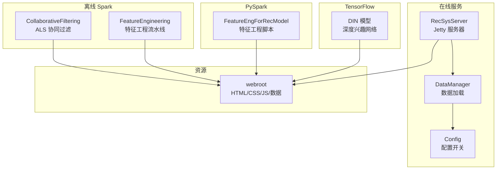
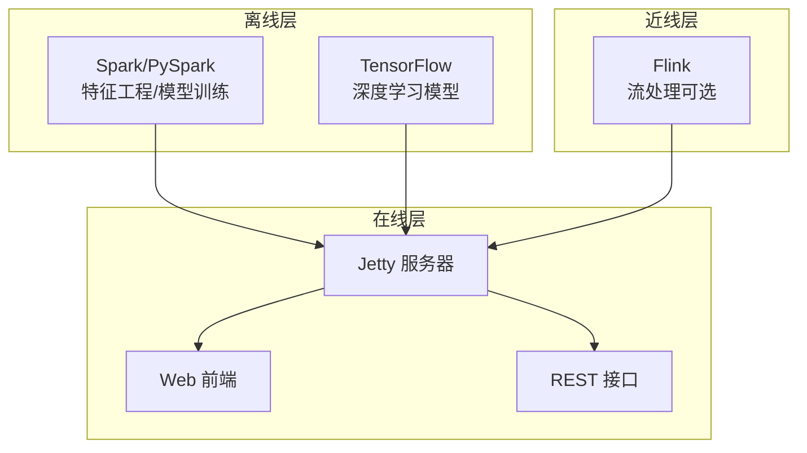
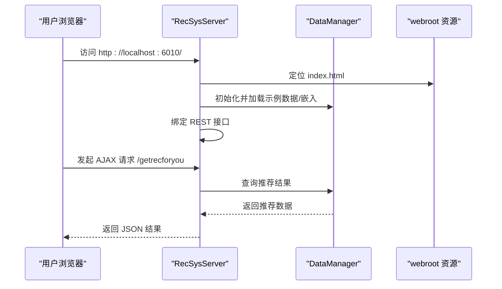
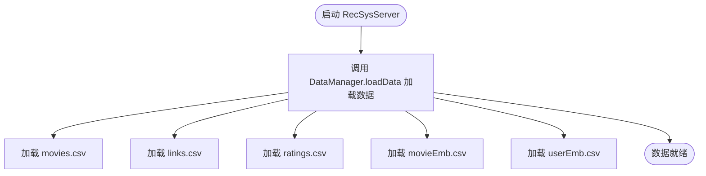
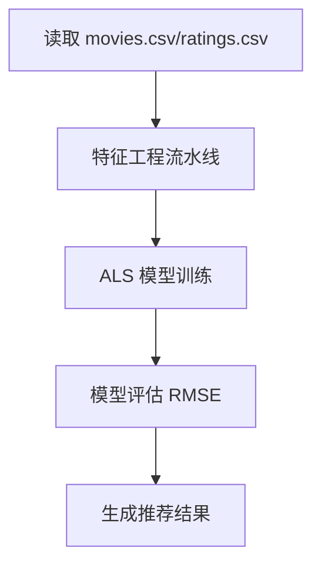
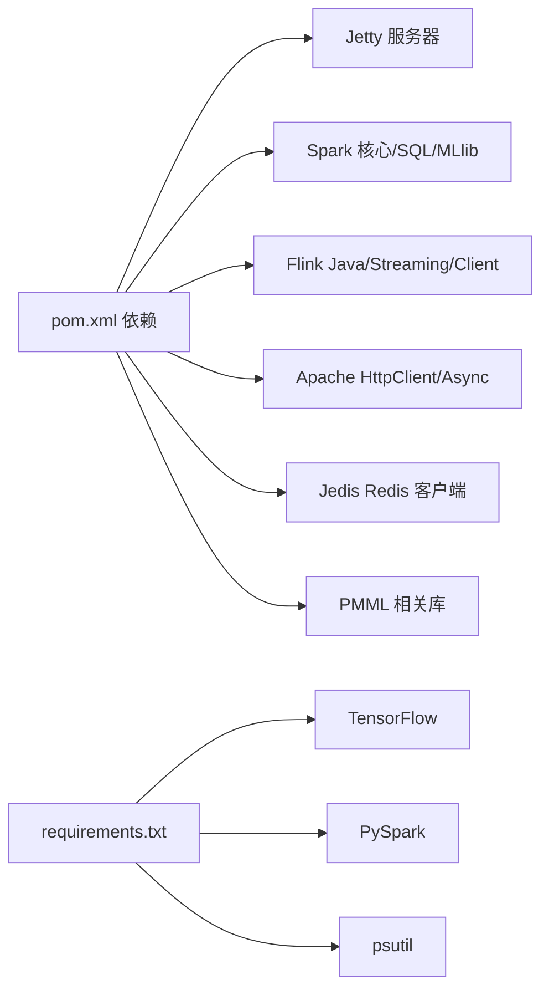

# 快速开始

<cite>
**本文引用的文件列表**
- [README.md](file://README.md)
- [pom.xml](file://pom.xml)
- [requirements.txt](file://requirements.txt)
- [RecSysServer.java](file://src/main/java/com/sparrowrecsys/online/RecSysServer.java)
- [index.html](file://src/main/resources/webroot/index.html)
- [Config.java](file://src/main/java/com/sparrowrecsys/online/util/Config.java)
- [CollaborativeFiltering.scala](file://src/main/java/com/sparrowrecsys/offline/spark/model/CollaborativeFiltering.scala)
- [FeatureEngineering.scala](file://src/main/java/com/sparrowrecsys/offline/spark/featureeng/FeatureEngineering.scala)
- [FeatureEngForRecModel.py](file://RecPySpark/src/com/sparrowrecsys/offline/pyspark/featureeng/FeatureEngForRecModel.py)
- [DIN.py](file://TFRecModel/src/com/sparrowrecsys/offline/tensorflow/DIN.py)
- [DataManager.java](file://src/main/java/com/sparrowrecsys/online/datamanager/DataManager.java)
</cite>

## 目录
1. [简介](#简介)
2. [项目结构](#项目结构)
3. [核心组件](#核心组件)
4. [架构总览](#架构总览)
5. [详细组件分析](#详细组件分析)
6. [依赖关系分析](#依赖关系分析)
7. [性能注意事项](#性能注意事项)
8. [故障排查指南](#故障排查指南)
9. [结论](#结论)
10. [附录](#附录)

## 简介
本指南面向首次接触 SparrowRecSys 的用户，帮助你在本地快速完成环境准备、项目克隆、依赖安装与构建，并通过 IDE 启动在线推荐服务，最终在浏览器中访问 Web 前端页面，体验推荐系统的效果。项目采用 Maven 构建，包含 Java、Scala、Python 以及 TensorFlow 深度学习模型，支持离线 Spark 特征工程与模型训练、在线 Jetty 服务与 Web 前端展示。

## 项目结构
SparrowRecSys 是一个混合语言的推荐系统项目，主要由以下模块构成：
- 在线服务：基于 Jetty 的 Web 服务器，提供 REST 接口与静态资源托管
- 离线 Spark：用于特征工程、模型训练与评估
- PySpark：基于 PySpark 的特征工程脚本
- TensorFlow：深度学习模型示例（如 DIN）
- 资源：Web 前端 HTML/CSS/JS 与示例数据

图表来源
- [RecSysServer.java](file://src/main/java/com/sparrowrecsys/online/RecSysServer.java#L1-L80)
- [DataManager.java](file://src/main/java/com/sparrowrecsys/online/datamanager/DataManager.java#L1-L200)
- [Config.java](file://src/main/java/com/sparrowrecsys/online/util/Config.java#L1-L14)
- [CollaborativeFiltering.scala](file://src/main/java/com/sparrowrecsys/offline/spark/model/CollaborativeFiltering.scala#L1-L85)
- [FeatureEngineering.scala](file://src/main/java/com/sparrowrecsys/offline/spark/featureeng/FeatureEngineering.scala#L1-L120)
- [FeatureEngForRecModel.py](file://RecPySpark/src/com/sparrowrecsys/offline/pyspark/featureeng/FeatureEngForRecModel.py#L1-L156)
- [DIN.py](file://TFRecModel/src/com/sparrowrecsys/offline/tensorflow/DIN.py#L1-L190)
- [index.html](file://src/main/resources/webroot/index.html#L1-L121)

章节来源
- [README.md](file://README.md#L1-L57)
- [pom.xml](file://pom.xml#L1-L228)

## 核心组件
- 在线服务入口：RecSysServer 使用 Jetty 启动 HTTP 服务器，默认监听 6010 端口，绑定静态资源与 REST 接口。
- 数据管理：DataManager 负责从 CSV 文件加载电影、评分、链接与嵌入向量等数据，并维护按类型索引的数据结构。
- 配置开关：Config 提供数据源选择、AB 测试开关等可配置项。
- 离线 Spark：CollaborativeFiltering 展示 ALS 协同过滤模型训练与评估；FeatureEngineering 展示特征工程流水线。
- PySpark：FeatureEngForRecModel 提供基于 PySpark 的特征工程示例。
- TensorFlow：DIN 示例展示如何加载 CSV 数据并训练深度兴趣网络模型。

章节来源
- [RecSysServer.java](file://src/main/java/com/sparrowrecsys/online/RecSysServer.java#L1-L80)
- [DataManager.java](file://src/main/java/com/sparrowrecsys/online/datamanager/DataManager.java#L1-L200)
- [Config.java](file://src/main/java/com/sparrowrecsys/online/util/Config.java#L1-L14)
- [CollaborativeFiltering.scala](file://src/main/java/com/sparrowrecsys/offline/spark/model/CollaborativeFiltering.scala#L1-L85)
- [FeatureEngineering.scala](file://src/main/java/com/sparrowrecsys/offline/spark/featureeng/FeatureEngineering.scala#L1-L120)
- [FeatureEngForRecModel.py](file://RecPySpark/src/com/sparrowrecsys/offline/pyspark/featureeng/FeatureEngForRecModel.py#L1-L156)
- [DIN.py](file://TFRecModel/src/com/sparrowrecsys/offline/tensorflow/DIN.py#L1-L190)

## 架构总览
SparrowRecSys 采用“离线-近线-在线”的分层架构：
- 离线：Spark/PySpark 进行大规模数据处理与模型训练
- 近线：Flink（在 Maven 中声明）可用于流式特征计算（本仓库未提供具体实现）
- 在线：Jetty 托管静态资源与 REST 接口，前端通过 AJAX 调用接口获取推荐结果

图表来源
- [pom.xml](file://pom.xml#L211-L225)
- [RecSysServer.java](file://src/main/java/com/sparrowrecsys/online/RecSysServer.java#L64-L70)

## 详细组件分析

### 在线服务启动流程（RecSysServer）
- 端口：默认 6010，可通过环境变量 PORT 覆盖
- 静态资源：从 classpath 下的 webroot 加载 HTML/CSS/JS
- 数据加载：初始化 DataManager 并加载示例数据与嵌入向量
- 接口绑定：注册 /getmovie、/getuser、/getsimilarmovie、/getrecommendation、/getrecforyou 等接口

图表来源
- [RecSysServer.java](file://src/main/java/com/sparrowrecsys/online/RecSysServer.java#L27-L78)
- [index.html](file://src/main/resources/webroot/index.html#L110-L120)
- [DataManager.java](file://src/main/java/com/sparrowrecsys/online/datamanager/DataManager.java#L40-L50)

章节来源
- [RecSysServer.java](file://src/main/java/com/sparrowrecsys/online/RecSysServer.java#L1-L80)
- [index.html](file://src/main/resources/webroot/index.html#L1-L121)

### 数据加载与配置（DataManager 与 Config）
- DataManager 支持从文件或 Redis 加载嵌入向量与特征，配置项由 Config 控制
- 默认使用文件数据源，可切换为 Redis

图表来源
- [DataManager.java](file://src/main/java/com/sparrowrecsys/online/datamanager/DataManager.java#L40-L50)
- [Config.java](file://src/main/java/com/sparrowrecsys/online/util/Config.java#L1-L14)

章节来源
- [DataManager.java](file://src/main/java/com/sparrowrecsys/online/datamanager/DataManager.java#L1-L200)
- [Config.java](file://src/main/java/com/sparrowrecsys/online/util/Config.java#L1-L14)

### 离线 Spark 模块
- ALS 协同过滤：使用 Spark ML 对评分数据进行训练与评估
- 特征工程：演示 One-Hot/Multi-Hot 编码、数值特征归一化与桶化等

图表来源
- [CollaborativeFiltering.scala](file://src/main/java/com/sparrowrecsys/offline/spark/model/CollaborativeFiltering.scala#L12-L84)
- [FeatureEngineering.scala](file://src/main/java/com/sparrowrecsys/offline/spark/featureeng/FeatureEngineering.scala#L92-L118)

章节来源
- [CollaborativeFiltering.scala](file://src/main/java/com/sparrowrecsys/offline/spark/model/CollaborativeFiltering.scala#L1-L85)
- [FeatureEngineering.scala](file://src/main/java/com/sparrowrecsys/offline/spark/featureeng/FeatureEngineering.scala#L1-L120)

### PySpark 特征工程
- 基于 PySpark 的特征工程示例，包含标签构造、电影与用户特征提取、训练/测试集划分等

章节来源
- [FeatureEngForRecModel.py](file://RecPySpark/src/com/sparrowrecsys/offline/pyspark/featureeng/FeatureEngForRecModel.py#L1-L156)

### TensorFlow 深度学习模型
- DIN 示例：定义输入特征列、候选物品与近期行为序列、注意力激活单元与池化层，编译并训练模型

章节来源
- [DIN.py](file://TFRecModel/src/com/sparrowrecsys/offline/tensorflow/DIN.py#L1-L190)

## 依赖关系分析
- Maven 构建：主 POM 定义了 Java 8 源目标、Jetty、Spark、Flink、HTTP 客户端、Redis 客户端等依赖
- Python 环境：requirements.txt 指定 TensorFlow、PySpark、psutil 等版本
- 在线服务打包：Assembly 插件生成包含所有依赖的可执行 JAR，入口类为 RecSysServer

图表来源
- [pom.xml](file://pom.xml#L60-L226)
- [requirements.txt](file://requirements.txt#L1-L4)

章节来源
- [pom.xml](file://pom.xml#L1-L228)
- [requirements.txt](file://requirements.txt#L1-L4)

## 性能注意事项
- 端口与环境变量：在线服务默认端口 6010，可通过环境变量 PORT 覆盖，便于容器化部署
- 数据加载策略：DataManager 支持从文件或 Redis 加载嵌入向量，生产环境建议使用 Redis 以提升查询性能
- Spark 本地模式：离线 Spark 示例使用 local 模式，适合开发调试；生产建议配置集群资源

章节来源
- [RecSysServer.java](file://src/main/java/com/sparrowrecsys/online/RecSysServer.java#L24-L32)
- [DataManager.java](file://src/main/java/com/sparrowrecsys/online/datamanager/DataManager.java#L90-L164)
- [CollaborativeFiltering.scala](file://src/main/java/com/sparrowrecsys/offline/spark/model/CollaborativeFiltering.scala#L14-L16)

## 故障排查指南
- 端口占用
  - 现象：启动失败提示端口被占用
  - 处理：修改环境变量 PORT 或停止占用 6010 的进程
  - 参考：[端口设置逻辑](file://src/main/java/com/sparrowrecsys/online/RecSysServer.java#L24-L32)
- 静态资源路径
  - 现象：页面空白或资源 404
  - 处理：确认 webroot 资源路径正确，确保 index.html 与静态资源存在
  - 参考：[资源定位与上下文配置](file://src/main/java/com/sparrowrecsys/online/RecSysServer.java#L38-L61)
- 数据加载异常
  - 现象：控制台报错无法确定 webroot 路径或找不到示例数据
  - 处理：检查 classpath 下的 webroot 是否包含 sampledata 与 modeldata 目录
  - 参考：[数据加载调用](file://src/main/java/com/sparrowrecsys/online/RecSysServer.java#L49-L54)
- Python/TensorFlow 环境
  - 现象：运行 TensorFlow 示例时报错或版本不兼容
  - 处理：使用 requirements.txt 安装指定版本，确保 Python 3.6+ 与 TensorFlow 2.0+
  - 参考：[环境要求](file://README.md#L7-L11)，[依赖清单](file://requirements.txt#L1-L4)
- Spark/Scala 版本
  - 现象：编译或运行时出现版本不匹配
  - 处理：确保使用 Java 8、Scala 2.11，Spark 2.4.3
  - 参考：[Maven 属性与依赖](file://pom.xml#L11-L18)，[Spark 依赖](file://pom.xml#L77-L96)

章节来源
- [RecSysServer.java](file://src/main/java/com/sparrowrecsys/online/RecSysServer.java#L24-L61)
- [README.md](file://README.md#L7-L11)
- [requirements.txt](file://requirements.txt#L1-L4)
- [pom.xml](file://pom.xml#L11-L18)

## 结论
通过本指南，你可以完成环境准备、项目构建与在线服务启动，并在浏览器中看到推荐系统的前端效果。若需扩展功能，可在离线层继续完善 Spark/PySpark 特征工程与模型训练，在线层可接入 Redis 存储与更多 REST 接口。

## 附录

### 环境准备与安装步骤
- Java 8
  - 安装 JDK 8，确保 JAVA_HOME 与 PATH 正确
  - 参考：[环境要求](file://README.md#L7-L11)
- Scala 2.11
  - 安装 Scala 2.11，确保编译器与运行时一致
  - 参考：[Maven 属性](file://pom.xml#L11-L18)
- Python 3.6+
  - 安装 Python 3.6+，创建虚拟环境
  - 参考：[环境要求](file://README.md#L7-L11)
- TensorFlow 2.0+
  - 使用 requirements.txt 安装指定版本
  - 参考：[依赖清单](file://requirements.txt#L1-L4)
- PySpark
  - 安装 PySpark，确保与 Spark 版本兼容
  - 参考：[依赖清单](file://requirements.txt#L3-L3)

章节来源
- [README.md](file://README.md#L7-L11)
- [requirements.txt](file://requirements.txt#L1-L4)
- [pom.xml](file://pom.xml#L11-L18)

### 项目克隆与依赖安装
- 克隆仓库
  - 使用 Git 克隆项目到本地
- Maven 依赖
  - 使用 Maven 安装依赖（可选）
  - 参考：[Maven 插件与依赖](file://pom.xml#L21-L58)
- Python 依赖
  - 在项目根目录执行 pip 安装
  - 参考：[requirements.txt](file://requirements.txt#L1-L4)

章节来源
- [pom.xml](file://pom.xml#L21-L58)
- [requirements.txt](file://requirements.txt#L1-L4)

### Maven 构建与运行
- 构建可执行 JAR
  - 使用 Maven Assembly 插件生成包含依赖的可执行 JAR
  - 参考：[Assembly 插件配置](file://pom.xml#L32-L56)
- 运行在线服务
  - 启动 RecSysServer，访问 http://localhost:6010/
  - 参考：[在线服务入口](file://src/main/java/com/sparrowrecsys/online/RecSysServer.java#L18-L22)

章节来源
- [pom.xml](file://pom.xml#L32-L56)
- [RecSysServer.java](file://src/main/java/com/sparrowrecsys/online/RecSysServer.java#L18-L22)

### IDE 配置建议（IntelliJ IDEA）
- 导入项目
  - 选择 Maven 项目导入，等待依赖解析完成
- 运行配置
  - 新建 Application 运行配置，主类为 RecSysServer
  - 参考：[入口类](file://src/main/java/com/sparrowrecsys/online/RecSysServer.java#L18-L22)
- 端口与参数
  - 如需自定义端口，可在 VM Options 中设置 -Dport=XXXX
  - 参考：[端口读取逻辑](file://src/main/java/com/sparrowrecsys/online/RecSysServer.java#L24-L32)

章节来源
- [RecSysServer.java](file://src/main/java/com/sparrowrecsys/online/RecSysServer.java#L24-L32)

### 启动 RecSysServer 并访问 Web 界面
- 启动服务
  - 在 IDE 中运行 RecSysServer，或使用命令行启动可执行 JAR
  - 参考：[运行入口](file://src/main/java/com/sparrowrecsys/online/RecSysServer.java#L18-L22)
- 访问地址
  - 在浏览器中打开 http://localhost:6010/
  - 参考：[默认端口](file://src/main/java/com/sparrowrecsys/online/RecSysServer.java#L25-L25)
- 预期效果
  - 页面展示推荐内容与交互区域，AJAX 请求调用 /getrecforyou 等接口
  - 参考：[前端脚本与请求](file://src/main/resources/webroot/index.html#L110-L120)

章节来源
- [RecSysServer.java](file://src/main/java/com/sparrowrecsys/online/RecSysServer.java#L25-L25)
- [index.html](file://src/main/resources/webroot/index.html#L110-L120)