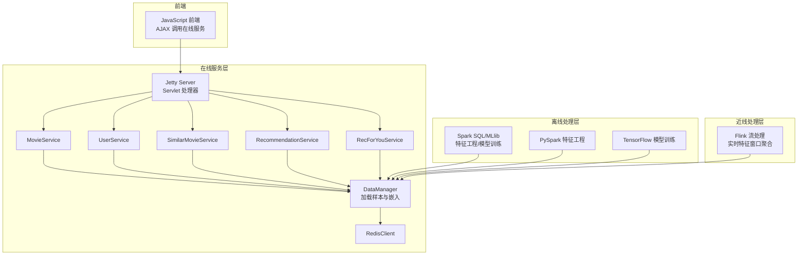
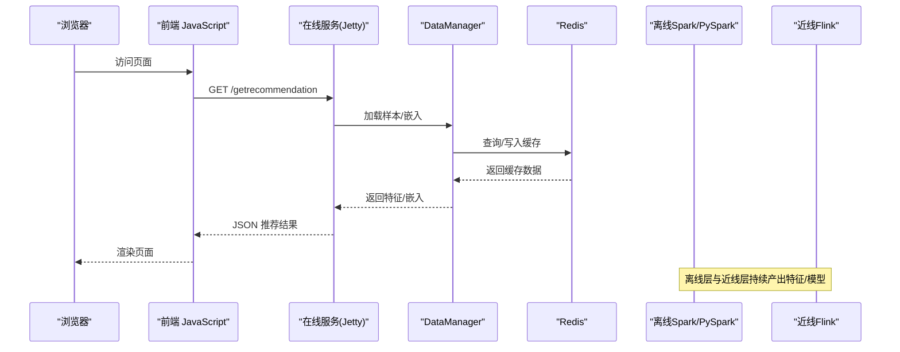
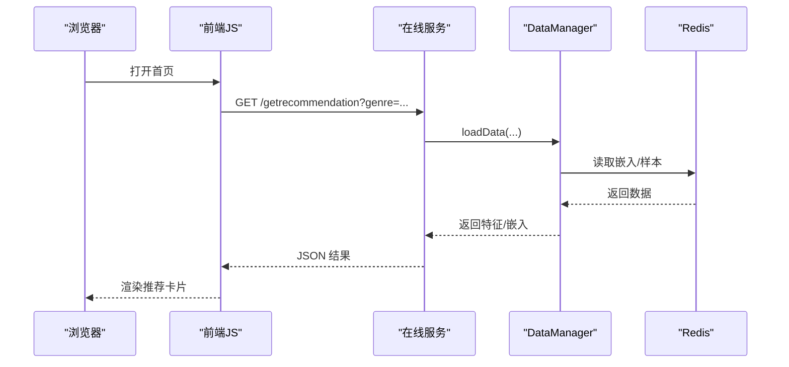
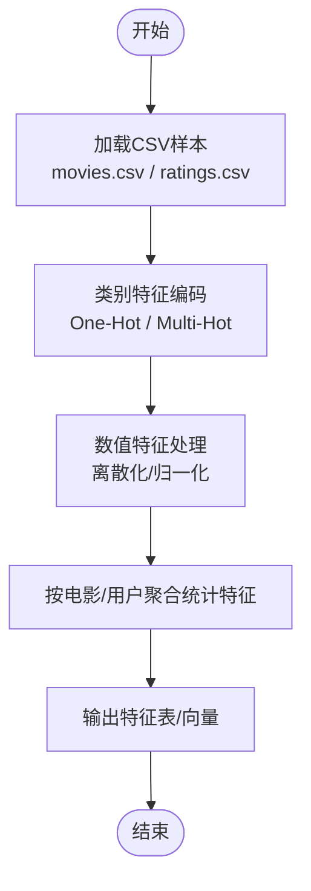
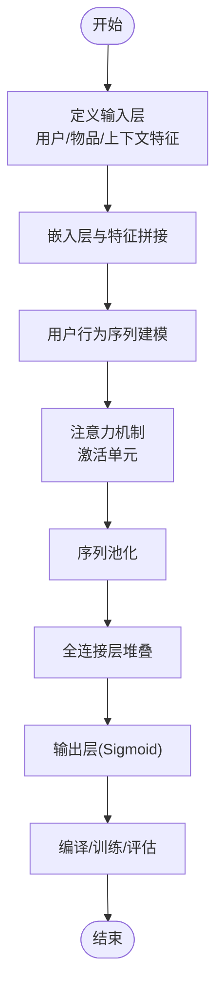
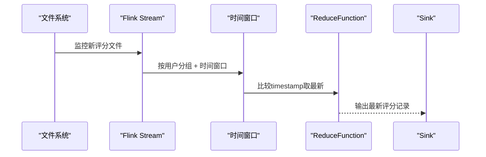
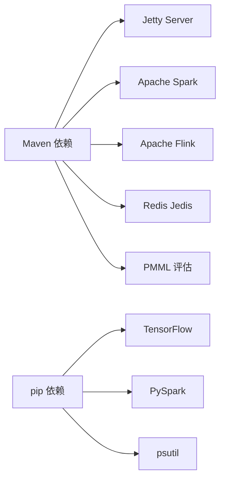

# 技术栈

<cite>
**本文引用的文件列表**
- [pom.xml](file://pom.xml)
- [requirements.txt](file://requirements.txt)
- [README.md](file://README.md)
- [RecSysServer.java](file://src/main/java/com/sparrowrecsys/online/RecSysServer.java)
- [recsys.js](file://src/main/resources/webroot/js/recsys.js)
- [FeatureEngineering.scala](file://src/main/java/com/sparrowrecsys/offline/spark/featureeng/FeatureEngineering.scala)
- [FeatureEngineering.py](file://RecPySpark/src/com/sparrowrecsys/offline/pyspark/featureeng/FeatureEngineering.py)
- [DIN.py](file://TFRecModel/src/com/sparrowrecsys/offline/tensorflow/DIN.py)
- [RealTimeFeature.java](file://src/main/java/com/sparrowrecsys/nearline/flink/RealTimeFeature.java)
- [RedisClient.java](file://src/main/java/com/sparrowrecsys/online/datamanager/RedisClient.java)
</cite>

## 目录
1. [简介](#简介)
2. [项目结构](#项目结构)
3. [核心组件](#核心组件)
4. [架构总览](#架构总览)
5. [详细组件分析](#详细组件分析)
6. [依赖关系分析](#依赖关系分析)
7. [性能与兼容性考量](#性能与兼容性考量)
8. [故障排查指南](#故障排查指南)
9. [结论](#结论)
10. [附录](#附录)

## 简介
本项目为一个多语言混合架构的电影推荐系统，采用“离线Spark/PySpark处理 + 近线Flink流处理 + 在线Java服务 + 前端JavaScript”的分层设计。通过统一的数据与模型流水线，实现从特征工程、模型训练到实时特征聚合与在线服务的闭环。技术栈覆盖Java（在线服务层）、Scala（离线Spark处理）、Python（PySpark数据处理）、JavaScript（前端界面），并集成Apache Spark、TensorFlow、Jetty Server、Flink、Redis等关键组件。

## 项目结构
项目采用按职责划分的多模块结构：
- 在线服务层（Java + Jetty）：提供REST接口与静态资源服务，承载推荐结果与前端交互。
- 离线处理层（Scala + Spark）：负责大规模特征工程与模型训练。
- 近线处理层（Java + Flink）：处理实时评分流，生成近线特征。
- 深度学习模型（Python + TensorFlow）：提供多种推荐模型实现与训练脚本。
- 前端界面（JavaScript + HTML/CSS）：通过AJAX调用在线服务接口，展示推荐结果。

图表来源
- [RecSysServer.java](file://src/main/java/com/sparrowrecsys/online/RecSysServer.java#L27-L78)
- [FeatureEngineering.scala](file://src/main/java/com/sparrowrecsys/offline/spark/featureeng/FeatureEngineering.scala#L11-L118)
- [FeatureEngineering.py](file://RecPySpark/src/com/sparrowrecsys/offline/pyspark/featureeng/FeatureEngineering.py#L60-L77)
- [DIN.py](file://TFRecModel/src/com/sparrowrecsys/offline/tensorflow/DIN.py#L1-L190)
- [RealTimeFeature.java](file://src/main/java/com/sparrowrecsys/nearline/flink/RealTimeFeature.java#L30-L73)
- [RedisClient.java](file://src/main/java/com/sparrowrecsys/online/datamanager/RedisClient.java#L5-L25)

章节来源
- [pom.xml](file://pom.xml#L11-L227)
- [README.md](file://README.md#L1-L57)

## 核心组件
- 在线服务（Java + Jetty）
  - 启动入口：[RecSysServer.java](file://src/main/java/com/sparrowrecsys/online/RecSysServer.java#L20-L22)
  - 静态资源与路由绑定：[RecSysServer.java](file://src/main/java/com/sparrowrecsys/online/RecSysServer.java#L56-L70)
  - 前端交互：[recsys.js](file://src/main/resources/webroot/js/recsys.js#L102-L106)、[recsys.js](file://src/main/resources/webroot/js/recsys.js#L125-L129)、[recsys.js](file://src/main/resources/webroot/js/recsys.js#L173-L177)
- 离线处理（Scala + Spark）
  - 特征工程示例：[FeatureEngineering.scala](file://src/main/java/com/sparrowrecsys/offline/spark/featureeng/FeatureEngineering.scala#L11-L118)
  - PySpark 特征工程：[FeatureEngineering.py](file://RecPySpark/src/com/sparrowrecsys/offline/pyspark/featureeng/FeatureEngineering.py#L60-L77)
- 深度学习模型（Python + TensorFlow）
  - DIN 模型示例：[DIN.py](file://TFRecModel/src/com/sparrowrecsys/offline/tensorflow/DIN.py#L1-L190)
- 近线处理（Java + Flink）
  - 实时特征窗口聚合：[RealTimeFeature.java](file://src/main/java/com/sparrowrecsys/nearline/flink/RealTimeFeature.java#L30-L73)
- 数据存储（Redis）
  - 单例客户端：[RedisClient.java](file://src/main/java/com/sparrowrecsys/online/datamanager/RedisClient.java#L5-L25)

章节来源
- [RecSysServer.java](file://src/main/java/com/sparrowrecsys/online/RecSysServer.java#L27-L78)
- [recsys.js](file://src/main/resources/webroot/js/recsys.js#L102-L177)
- [FeatureEngineering.scala](file://src/main/java/com/sparrowrecsys/offline/spark/featureeng/FeatureEngineering.scala#L11-L118)
- [FeatureEngineering.py](file://RecPySpark/src/com/sparrowrecsys/offline/pyspark/featureeng/FeatureEngineering.py#L60-L77)
- [DIN.py](file://TFRecModel/src/com/sparrowrecsys/offline/tensorflow/DIN.py#L1-L190)
- [RealTimeFeature.java](file://src/main/java/com/sparrowrecsys/nearline/flink/RealTimeFeature.java#L30-L73)
- [RedisClient.java](file://src/main/java/com/sparrowrecsys/online/datamanager/RedisClient.java#L5-L25)

## 架构总览
系统遵循“离线-近线-在线”的三层架构：
- 离线层：Spark/PySpark执行大规模特征工程与模型训练，输出可部署的模型或嵌入向量。
- 近线层：Flink对实时评分流进行窗口化聚合，生成近线特征供在线服务使用。
- 在线层：Jetty提供REST接口，前端通过AJAX调用，结合缓存与嵌入数据完成推荐展示。

图表来源
- [RecSysServer.java](file://src/main/java/com/sparrowrecsys/online/RecSysServer.java#L56-L70)
- [recsys.js](file://src/main/resources/webroot/js/recsys.js#L102-L177)
- [RedisClient.java](file://src/main/java/com/sparrowrecsys/online/datamanager/RedisClient.java#L5-L25)

## 详细组件分析

### 在线服务层（Java + Jetty）
- 服务启动与路由
  - 端口与环境变量支持：[RecSysServer.java](file://src/main/java/com/sparrowrecsys/online/RecSysServer.java#L25-L32)
  - 静态资源根路径与欢迎页：[RecSysServer.java](file://src/main/java/com/sparrowrecsys/online/RecSysServer.java#L38-L61)
  - 绑定多个Servlet处理器：[RecSysServer.java](file://src/main/java/com/sparrowrecsys/online/RecSysServer.java#L64-L70)
- 前端交互
  - 获取推荐、相似电影、用户信息等AJAX请求：[recsys.js](file://src/main/resources/webroot/js/recsys.js#L102-L177)

图表来源
- [RecSysServer.java](file://src/main/java/com/sparrowrecsys/online/RecSysServer.java#L56-L70)
- [recsys.js](file://src/main/resources/webroot/js/recsys.js#L102-L177)
- [RedisClient.java](file://src/main/java/com/sparrowrecsys/online/datamanager/RedisClient.java#L5-L25)

章节来源
- [RecSysServer.java](file://src/main/java/com/sparrowrecsys/online/RecSysServer.java#L25-L78)
- [recsys.js](file://src/main/resources/webroot/js/recsys.js#L102-L177)

### 离线处理层（Scala + Spark）
- 特征工程流程
  - One-Hot/Multi-Hot编码、数值特征归一化与离散化：[FeatureEngineering.scala](file://src/main/java/com/sparrowrecsys/offline/spark/featureeng/FeatureEngineering.scala#L16-L90)
  - 使用SparkSession加载本地资源并演示特征工程：[FeatureEngineering.scala](file://src/main/java/com/sparrowrecsys/offline/spark/featureeng/FeatureEngineering.scala#L92-L118)
- PySpark 特征工程
  - 与Scala版本等价的特征工程实现，便于在Python生态中扩展：[FeatureEngineering.py](file://RecPySpark/src/com/sparrowrecsys/offline/pyspark/featureeng/FeatureEngineering.py#L60-L77)

图表来源
- [FeatureEngineering.scala](file://src/main/java/com/sparrowrecsys/offline/spark/featureeng/FeatureEngineering.scala#L16-L90)
- [FeatureEngineering.py](file://RecPySpark/src/com/sparrowrecsys/offline/pyspark/featureeng/FeatureEngineering.py#L11-L58)

章节来源
- [FeatureEngineering.scala](file://src/main/java/com/sparrowrecsys/offline/spark/featureeng/FeatureEngineering.scala#L11-L118)
- [FeatureEngineering.py](file://RecPySpark/src/com/sparrowrecsys/offline/pyspark/featureeng/FeatureEngineering.py#L60-L77)

### 深度学习模型（Python + TensorFlow）
- 模型示例：DIN（Deep Interest Network）
  - 输入定义、用户行为序列建模、注意力激活单元与池化：[DIN.py](file://TFRecModel/src/com/sparrowrecsys/offline/tensorflow/DIN.py#L34-L167)
  - 数据集构建与训练评估：[DIN.py](file://TFRecModel/src/com/sparrowrecsys/offline/tensorflow/DIN.py#L14-L182)

图表来源
- [DIN.py](file://TFRecModel/src/com/sparrowrecsys/offline/tensorflow/DIN.py#L34-L167)

章节来源
- [DIN.py](file://TFRecModel/src/com/sparrowrecsys/offline/tensorflow/DIN.py#L1-L190)

### 近线处理层（Java + Flink）
- 实时评分流处理
  - 文件监控与流式读取，按用户窗口化取最新评分：[RealTimeFeature.java](file://src/main/java/com/sparrowrecsys/nearline/flink/RealTimeFeature.java#L37-L67)

图表来源
- [RealTimeFeature.java](file://src/main/java/com/sparrowrecsys/nearline/flink/RealTimeFeature.java#L37-L67)

章节来源
- [RealTimeFeature.java](file://src/main/java/com/sparrowrecsys/nearline/flink/RealTimeFeature.java#L30-L73)

### 数据存储（Redis）
- 单例Jedis客户端封装，提供在线服务访问嵌入与缓存数据的能力：[RedisClient.java](file://src/main/java/com/sparrowrecsys/online/datamanager/RedisClient.java#L5-L25)

章节来源
- [RedisClient.java](file://src/main/java/com/sparrowrecsys/online/datamanager/RedisClient.java#L5-L25)

## 依赖关系分析
- Maven 依赖（Java/Scala）
  - Jetty Server：用于在线HTTP服务
  - Apache Spark（Core/SQL/MLlib/Hive）：离线特征工程与模型训练
  - Flink（Java/Streaming/Clients）：近线流处理
  - Jedis：Redis客户端
  - PMML相关：模型导出与评估
  - HTTP组件：Apache HttpClient/Async
- Python 依赖
  - TensorFlow 2.15.0、PySpark 3.5.0、psutil

图表来源
- [pom.xml](file://pom.xml#L63-L226)
- [requirements.txt](file://requirements.txt#L1-L4)

章节来源
- [pom.xml](file://pom.xml#L60-L227)
- [requirements.txt](file://requirements.txt#L1-L4)

## 性能与兼容性考量
- 版本与兼容性
  - Java：JDK 8（源/目标版本均为1.8）
  - Scala：2.11（与Spark 2.4.3配套）
  - Spark：2.4.3（含MLlib、SQL、Hive）
  - Flink：1.11.1（Java/Streaming/Clients）
  - TensorFlow：2.15.0（用于模型训练与评估）
  - PySpark：3.5.0（与Python 3.6+配合）
- 性能建议
  - Spark侧：使用Pipeline与UDF优化特征工程；启用Hadoop MapReduce客户端以适配集群环境。
  - TensorFlow侧：使用tf.data数据管道优化（shuffle、cache、prefetch）提升训练吞吐。
  - 在线侧：合理利用Redis缓存热点数据，减少数据库压力；前端异步加载降低首屏延迟。
- 环境前置条件
  - Java 8、Scala 2.11、Python 3.6+、TensorFlow 2.0+、本地或远程Redis实例。

章节来源
- [pom.xml](file://pom.xml#L11-L19)
- [README.md](file://README.md#L7-L12)
- [requirements.txt](file://requirements.txt#L1-L4)

## 故障排查指南
- 在线服务无法启动
  - 检查端口占用与环境变量PORT是否正确设置：[RecSysServer.java](file://src/main/java/com/sparrowrecsys/online/RecSysServer.java#L25-L32)
  - 确认静态资源路径与webroot映射：[RecSysServer.java](file://src/main/java/com/sparrowrecsys/online/RecSysServer.java#L38-L61)
- 前端无数据返回
  - 检查AJAX请求URL与参数是否匹配在线服务路由：[recsys.js](file://src/main/resources/webroot/js/recsys.js#L102-L177)
  - 确认DataManager已正确加载样本与嵌入文件路径：[RecSysServer.java](file://src/main/java/com/sparrowrecsys/online/RecSysServer.java#L49-L54)
- Redis连接失败
  - 检查Redis端点与端口配置：[RedisClient.java](file://src/main/java/com/sparrowrecsys/online/datamanager/RedisClient.java#L8-L9)
- Spark/PySpark运行异常
  - 确认Scala版本与Spark版本匹配（2.11 + 2.4.3）：[pom.xml](file://pom.xml#L12-L14)
  - 检查本地资源路径与文件存在性：[FeatureEngineering.scala](file://src/main/java/com/sparrowrecsys/offline/spark/featureeng/FeatureEngineering.scala#L101-L105)
- Flink流处理未输出
  - 检查文件监控路径与权限：[RealTimeFeature.java](file://src/main/java/com/sparrowrecsys/nearline/flink/RealTimeFeature.java#L37-L47)
- TensorFlow模型训练报错
  - 确认数据集路径与CSV格式一致：[DIN.py](file://TFRecModel/src/com/sparrowrecsys/offline/tensorflow/DIN.py#L4-L10)

章节来源
- [RecSysServer.java](file://src/main/java/com/sparrowrecsys/online/RecSysServer.java#L25-L78)
- [recsys.js](file://src/main/resources/webroot/js/recsys.js#L102-L177)
- [RedisClient.java](file://src/main/java/com/sparrowrecsys/online/datamanager/RedisClient.java#L8-L9)
- [FeatureEngineering.scala](file://src/main/java/com/sparrowrecsys/offline/spark/featureeng/FeatureEngineering.scala#L101-L105)
- [RealTimeFeature.java](file://src/main/java/com/sparrowrecsys/nearline/flink/RealTimeFeature.java#L37-L47)
- [DIN.py](file://TFRecModel/src/com/sparrowrecsys/offline/tensorflow/DIN.py#L4-L10)

## 结论
本项目通过多语言混合架构实现了从离线到在线的完整推荐链路。Java在线服务以Jetty为核心，提供稳定高效的REST接口；Scala/Spark负责大规模特征工程与模型训练；Python/PySpark与TensorFlow支撑深度学习模型开发；Flink实现实时特征窗口化聚合；Redis作为在线缓存层提升响应性能。该架构具备良好的扩展性与工程落地价值。

## 附录
- 关键文件与职责概览
  - 在线服务：[RecSysServer.java](file://src/main/java/com/sparrowrecsys/online/RecSysServer.java#L27-L78)
  - 前端交互：[recsys.js](file://src/main/resources/webroot/js/recsys.js#L102-L177)
  - 离线特征工程（Scala）：[FeatureEngineering.scala](file://src/main/java/com/sparrowrecsys/offline/spark/featureeng/FeatureEngineering.scala#L11-L118)
  - 离线特征工程（PySpark）：[FeatureEngineering.py](file://RecPySpark/src/com/sparrowrecsys/offline/pyspark/featureeng/FeatureEngineering.py#L60-L77)
  - 深度学习模型（TensorFlow）：[DIN.py](file://TFRecModel/src/com/sparrowrecsys/offline/tensorflow/DIN.py#L1-L190)
  - 近线流处理（Flink）：[RealTimeFeature.java](file://src/main/java/com/sparrowrecsys/nearline/flink/RealTimeFeature.java#L30-L73)
  - 数据存储（Redis）：[RedisClient.java](file://src/main/java/com/sparrowrecsys/online/datamanager/RedisClient.java#L5-L25)
- 依赖清单
  - Maven：Jetty、Spark、Flink、Jedis、PMML、HTTP组件
  - pip：TensorFlow、PySpark、psutil