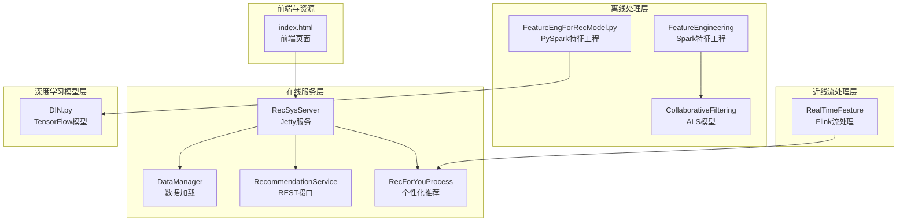
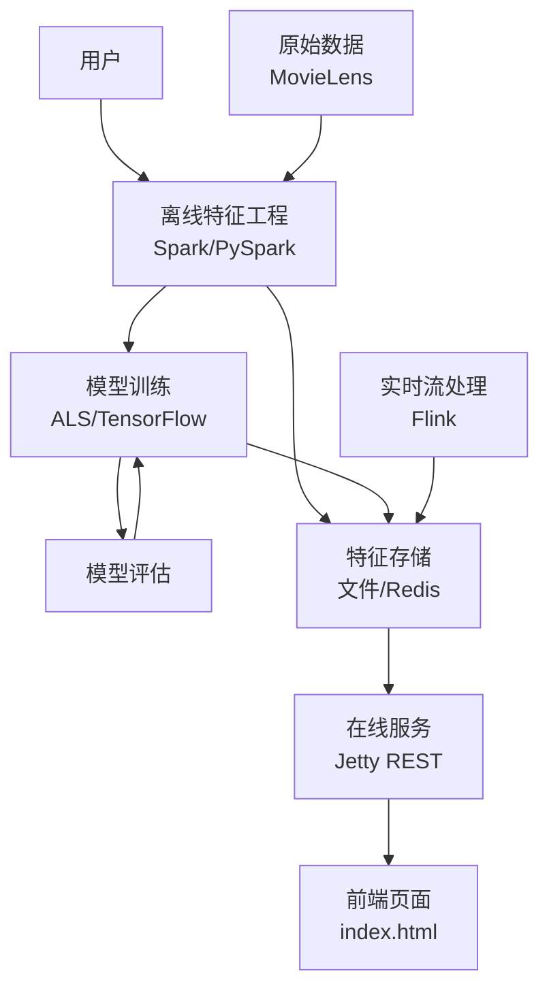
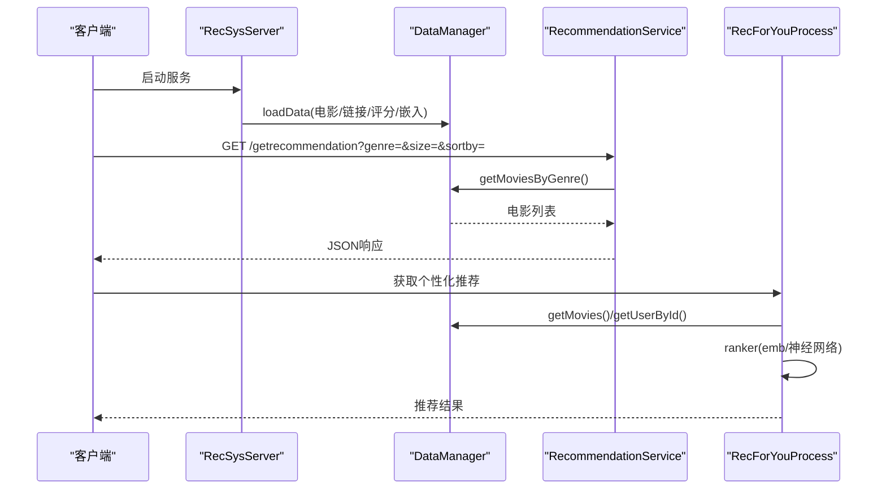
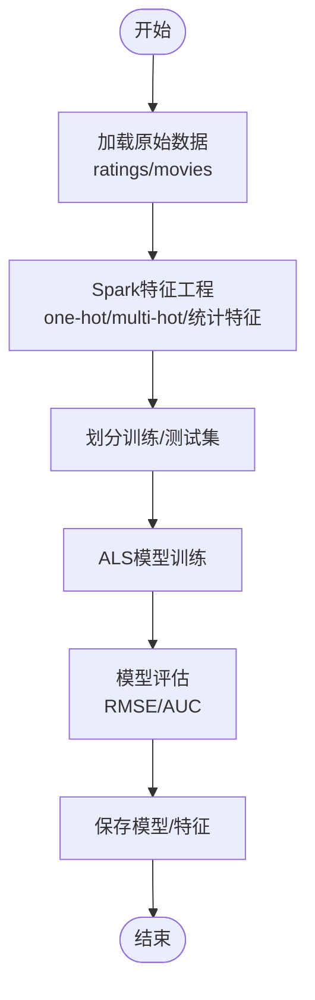
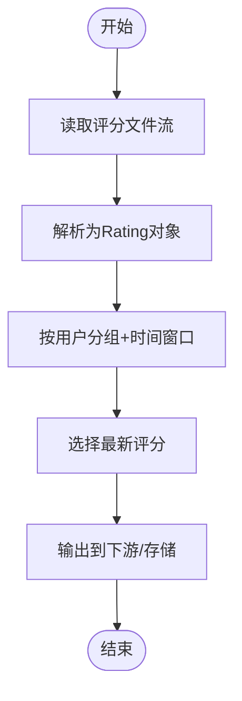
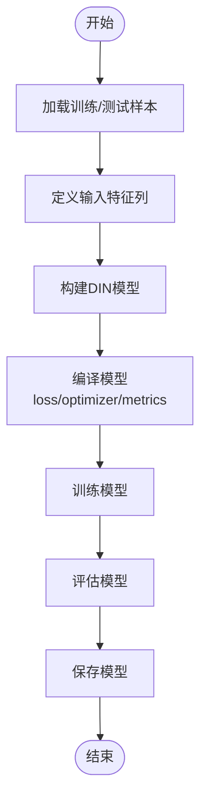
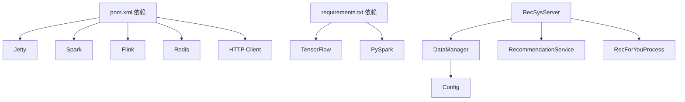

# 架构概览

<cite>
**本文档引用的文件**
- [README.md](file://README.md)
- [pom.xml](file://pom.xml)
- [requirements.txt](file://requirements.txt)
- [RecSysServer.java](file://src/main/java/com/sparrowrecsys/online/RecSysServer.java)
- [DataManager.java](file://src/main/java/com/sparrowrecsys/online/datamanager/DataManager.java)
- [RecommendationService.java](file://src/main/java/com/sparrowrecsys/online/service/RecommendationService.java)
- [RecForYouProcess.java](file://src/main/java/com/sparrowrecsys/online/recprocess/RecForYouProcess.java)
- [Config.java](file://src/main/java/com/sparrowrecsys/online/util/Config.java)
- [FeatureEngineering.scala](file://src/main/java/com/sparrowrecsys/offline/spark/featureeng/FeatureEngineering.scala)
- [CollaborativeFiltering.scala](file://src/main/java/com/sparrowrecsys/offline/spark/model/CollaborativeFiltering.scala)
- [RealTimeFeature.java](file://src/main/java/com/sparrowrecsys/nearline/flink/RealTimeFeature.java)
- [DIN.py](file://TFRecModel/src/com/sparrowrecsys/offline/tensorflow/DIN.py)
- [FeatureEngForRecModel.py](file://RecPySpark/src/com/sparrowrecsys/offline/pyspark/featureeng/FeatureEngForRecModel.py)
- [index.html](file://src/main/resources/webroot/index.html)
</cite>

## 目录
1. [简介](#简介)
2. [项目结构](#项目结构)
3. [核心组件](#核心组件)
4. [架构总览](#架构总览)
5. [详细组件分析](#详细组件分析)
6. [依赖关系分析](#依赖关系分析)
7. [性能考虑](#性能考虑)
8. [故障排查指南](#故障排查指南)
9. [结论](#结论)

## 简介
本项目是一个基于Maven的混合语言推荐系统，融合了Java/Scala、Python、TensorFlow与Apache Spark/Flink等技术栈，构建了经典的工业级深度学习推荐系统架构。系统包含离线数据处理、模型训练、近线流处理、线上服务与前端展示五大层次，覆盖从原始MovieLens数据到最终推荐结果的完整链路。

## 项目结构
项目采用分层与按技术栈混合组织的方式：
- 在线服务层：基于Jetty的Java Web服务，提供REST接口与静态页面
- 离线处理层：Spark SQL/ML与PySpark特征工程，ALS协同过滤模型
- 近线流处理层：Flink实时特征计算
- 深度学习模型层：TensorFlow/Keras模型训练与推理
- 资源与前端：HTML/CSS/JS与示例数据

图表来源
- [RecSysServer.java](file://src/main/java/com/sparrowrecsys/online/RecSysServer.java#L1-L80)
- [DataManager.java](file://src/main/java/com/sparrowrecsys/online/datamanager/DataManager.java#L1-L295)
- [RecommendationService.java](file://src/main/java/com/sparrowrecsys/online/service/RecommendationService.java#L1-L48)
- [RecForYouProcess.java](file://src/main/java/com/sparrowrecsys/online/recprocess/RecForYouProcess.java#L1-L140)
- [FeatureEngineering.scala](file://src/main/java/com/sparrowrecsys/offline/spark/featureeng/FeatureEngineering.scala#L1-L120)
- [CollaborativeFiltering.scala](file://src/main/java/com/sparrowrecsys/offline/spark/model/CollaborativeFiltering.scala#L1-L85)
- [RealTimeFeature.java](file://src/main/java/com/sparrowrecsys/nearline/flink/RealTimeFeature.java#L1-L74)
- [DIN.py](file://TFRecModel/src/com/sparrowrecsys/offline/tensorflow/DIN.py#L1-L190)
- [FeatureEngForRecModel.py](file://RecPySpark/src/com/sparrowrecsys/offline/pyspark/featureeng/FeatureEngForRecModel.py#L1-L156)
- [index.html](file://src/main/resources/webroot/index.html#L1-L121)

章节来源
- [pom.xml](file://pom.xml#L1-L228)
- [requirements.txt](file://requirements.txt#L1-L4)

## 核心组件
- 在线服务入口：启动Jetty服务器，绑定REST端点，加载本地示例数据
- 数据管理器：统一加载电影、评分、链接、嵌入向量与特征，支持文件与Redis两种数据源
- 推荐服务：提供按类型与排序的电影列表查询
- 个性化推荐处理器：基于候选集生成、相似度或深度学习模型打分、排序返回结果
- 离线特征工程：Spark与PySpark特征工程，ALS模型训练
- 实时流处理：Flink窗口聚合与最新行为提取
- 深度学习模型：DIN等模型的训练与推理脚本

章节来源
- [RecSysServer.java](file://src/main/java/com/sparrowrecsys/online/RecSysServer.java#L1-L80)
- [DataManager.java](file://src/main/java/com/sparrowrecsys/online/datamanager/DataManager.java#L1-L295)
- [RecommendationService.java](file://src/main/java/com/sparrowrecsys/online/service/RecommendationService.java#L1-L48)
- [RecForYouProcess.java](file://src/main/java/com/sparrowrecsys/online/recprocess/RecForYouProcess.java#L1-L140)
- [FeatureEngineering.scala](file://src/main/java/com/sparrowrecsys/offline/spark/featureeng/FeatureEngineering.scala#L1-L120)
- [CollaborativeFiltering.scala](file://src/main/java/com/sparrowrecsys/offline/spark/model/CollaborativeFiltering.scala#L1-L85)
- [RealTimeFeature.java](file://src/main/java/com/sparrowrecsys/nearline/flink/RealTimeFeature.java#L1-L74)
- [DIN.py](file://TFRecModel/src/com/sparrowrecsys/offline/tensorflow/DIN.py#L1-L190)
- [FeatureEngForRecModel.py](file://RecPySpark/src/com/sparrowrecsys/offline/pyspark/featureeng/FeatureEngForRecModel.py#L1-L156)

## 架构总览
系统遵循经典的工业级推荐系统分层架构：
- 离线数据处理：使用Spark与PySpark进行大规模特征工程与模型训练
- 模型训练：ALS协同过滤与TensorFlow模型（如DIN）训练
- 近线流处理：Flink对实时评分进行窗口化与最新行为提取
- 线上服务：Jetty提供REST接口，返回推荐结果
- 前端展示：静态页面通过AJAX调用后端接口渲染推荐内容

图表来源
- [FeatureEngineering.scala](file://src/main/java/com/sparrowrecsys/offline/spark/featureeng/FeatureEngineering.scala#L1-L120)
- [CollaborativeFiltering.scala](file://src/main/java/com/sparrowrecsys/offline/spark/model/CollaborativeFiltering.scala#L1-L85)
- [RealTimeFeature.java](file://src/main/java/com/sparrowrecsys/nearline/flink/RealTimeFeature.java#L1-L74)
- [RecSysServer.java](file://src/main/java/com/sparrowrecsys/online/RecSysServer.java#L1-L80)
- [index.html](file://src/main/resources/webroot/index.html#L1-L121)

## 详细组件分析

### 在线服务层
- 启动流程：解析环境变量端口，加载静态资源根路径，初始化数据管理器，注册REST端点
- 数据加载：从CSV文件加载电影、链接、评分与嵌入向量，支持从文件或Redis加载
- REST接口：提供电影、用户、相似电影、个性化推荐等接口
- 个性化推荐：候选集生成、相似度计算或调用TensorFlow Serving进行打分

图表来源
- [RecSysServer.java](file://src/main/java/com/sparrowrecsys/online/RecSysServer.java#L1-L80)
- [DataManager.java](file://src/main/java/com/sparrowrecsys/online/datamanager/DataManager.java#L1-L295)
- [RecommendationService.java](file://src/main/java/com/sparrowrecsys/online/service/RecommendationService.java#L1-L48)
- [RecForYouProcess.java](file://src/main/java/com/sparrowrecsys/online/recprocess/RecForYouProcess.java#L1-L140)

章节来源
- [RecSysServer.java](file://src/main/java/com/sparrowrecsys/online/RecSysServer.java#L1-L80)
- [RecommendationService.java](file://src/main/java/com/sparrowrecsys/online/service/RecommendationService.java#L1-L48)
- [RecForYouProcess.java](file://src/main/java/com/sparrowrecsys/online/recprocess/RecForYouProcess.java#L1-L140)
- [DataManager.java](file://src/main/java/com/sparrowrecsys/online/datamanager/DataManager.java#L1-L295)

### 离线数据处理与模型训练
- 特征工程：Spark实现one-hot、multi-hot编码，评分统计与归一化，管道化处理
- 协同过滤：ALS模型训练与交叉验证，输出用户/物品因子与预测结果
- PySpark特征工程：标签构造、电影与用户特征提取、样本划分保存

图表来源
- [FeatureEngineering.scala](file://src/main/java/com/sparrowrecsys/offline/spark/featureeng/FeatureEngineering.scala#L1-L120)
- [CollaborativeFiltering.scala](file://src/main/java/com/sparrowrecsys/offline/spark/model/CollaborativeFiltering.scala#L1-L85)
- [FeatureEngForRecModel.py](file://RecPySpark/src/com/sparrowrecsys/offline/pyspark/featureeng/FeatureEngForRecModel.py#L1-L156)

章节来源
- [FeatureEngineering.scala](file://src/main/java/com/sparrowrecsys/offline/spark/featureeng/FeatureEngineering.scala#L1-L120)
- [CollaborativeFiltering.scala](file://src/main/java/com/sparrowrecsys/offline/spark/model/CollaborativeFiltering.scala#L1-L85)
- [FeatureEngForRecModel.py](file://RecPySpark/src/com/sparrowrecsys/offline/pyspark/featureeng/FeatureEngForRecModel.py#L1-L156)

### 近线流处理
- 实时评分流：Flink监控评分文件目录，按用户窗口化聚合，输出最新评分记录
- 应用场景：实时特征更新、最近交互行为追踪

图表来源
- [RealTimeFeature.java](file://src/main/java/com/sparrowrecsys/nearline/flink/RealTimeFeature.java#L1-L74)

章节来源
- [RealTimeFeature.java](file://src/main/java/com/sparrowrecsys/nearline/flink/RealTimeFeature.java#L1-L74)

### 深度学习模型
- DIN模型：定义输入特征列、用户历史行为序列、注意力机制与池化层，编译并训练模型
- 训练数据：由PySpark特征工程生成的训练/测试样本

图表来源
- [DIN.py](file://TFRecModel/src/com/sparrowrecsys/offline/tensorflow/DIN.py#L1-L190)
- [FeatureEngForRecModel.py](file://RecPySpark/src/com/sparrowrecsys/offline/pyspark/featureeng/FeatureEngForRecModel.py#L1-L156)

章节来源
- [DIN.py](file://TFRecModel/src/com/sparrowrecsys/offline/tensorflow/DIN.py#L1-L190)
- [FeatureEngForRecModel.py](file://RecPySpark/src/com/sparrowrecsys/offline/pyspark/featureeng/FeatureEngForRecModel.py#L1-L156)

### 前端展示
- 静态页面：index.html通过脚本动态添加各类别推荐区域
- 数据来源：通过REST接口获取推荐结果并渲染

章节来源
- [index.html](file://src/main/resources/webroot/index.html#L1-L121)

## 依赖关系分析
- Maven依赖：Jetty、Spark、Flink、Redis、HTTP客户端、PMML等
- Python依赖：TensorFlow、PySpark、psutil
- 组件耦合：在线服务通过DataManager解耦数据源；推荐服务与个性化处理器通过统一接口访问数据；离线与近线通过文件/Redis与在线共享数据

图表来源
- [pom.xml](file://pom.xml#L1-L228)
- [requirements.txt](file://requirements.txt#L1-L4)
- [RecSysServer.java](file://src/main/java/com/sparrowrecsys/online/RecSysServer.java#L1-L80)
- [DataManager.java](file://src/main/java/com/sparrowrecsys/online/datamanager/DataManager.java#L1-L295)
- [Config.java](file://src/main/java/com/sparrowrecsys/online/util/Config.java#L1-L14)

章节来源
- [pom.xml](file://pom.xml#L1-L228)
- [requirements.txt](file://requirements.txt#L1-L4)
- [Config.java](file://src/main/java/com/sparrowrecsys/online/util/Config.java#L1-L14)

## 性能考虑
- 数据加载优化：DataManager支持从文件与Redis加载，可通过配置切换数据源，减少IO瓶颈
- 排序与候选集：个性化推荐先生成候选集再排序，控制复杂度
- 异步调用：调用TensorFlow Serving采用异步HTTP请求，避免阻塞
- 流处理窗口：Flink窗口大小与超时参数需根据实时性与吞吐权衡
- 模型评估：离线阶段使用交叉验证与评估指标，保证线上质量

## 故障排查指南
- 服务启动失败：检查端口占用与环境变量，确认静态资源路径正确
- 数据加载异常：确认CSV文件路径与字段顺序，检查文件权限
- 推荐为空：检查用户是否存在、嵌入向量是否加载成功、Redis连接状态
- TensorFlow Serving：确认服务端点可达、请求体格式正确
- Flink流处理：确认文件监控路径存在且可读，窗口参数合理

章节来源
- [RecSysServer.java](file://src/main/java/com/sparrowrecsys/online/RecSysServer.java#L1-L80)
- [DataManager.java](file://src/main/java/com/sparrowrecsys/online/datamanager/DataManager.java#L1-L295)
- [RecForYouProcess.java](file://src/main/java/com/sparrowrecsys/online/recprocess/RecForYouProcess.java#L1-L140)

## 结论
SparrowRecSys通过清晰的分层架构与多技术栈融合，实现了从离线特征工程、模型训练到近线流处理与线上服务的完整闭环。系统在保证可扩展性的同时，通过松耦合与高内聚的设计，为实际工业场景提供了可参考的推荐系统实现范式。