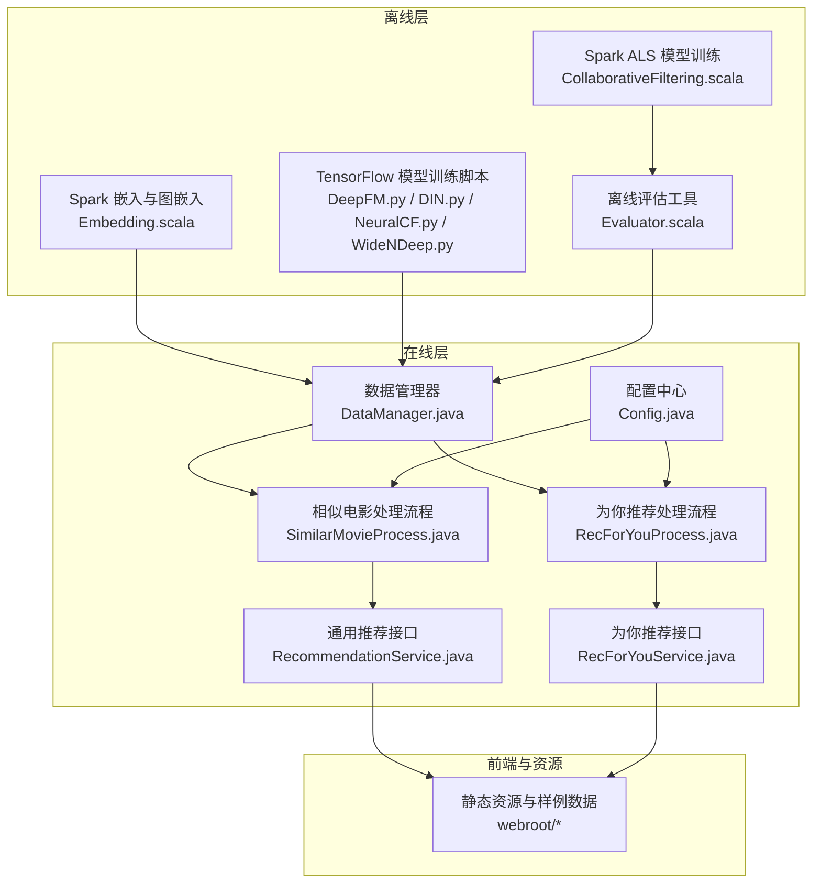
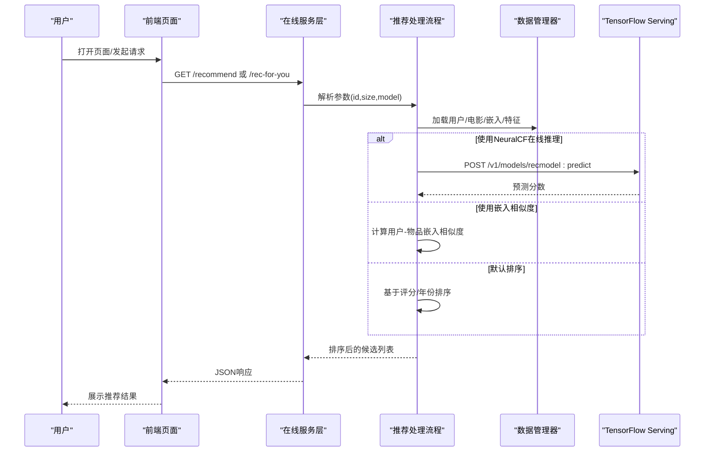
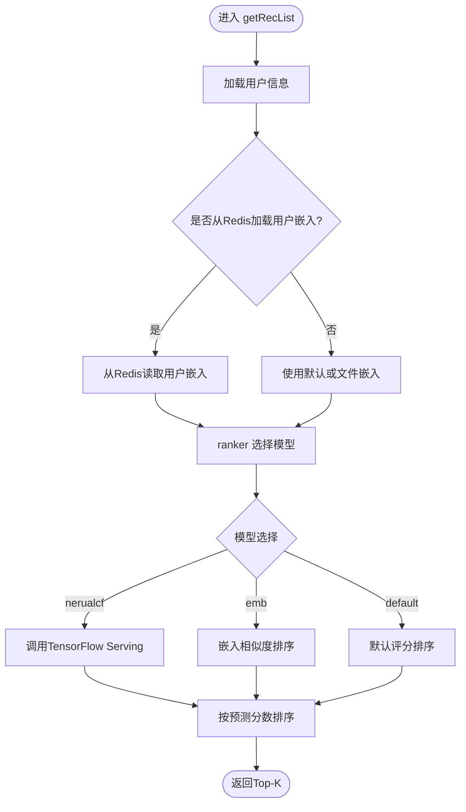
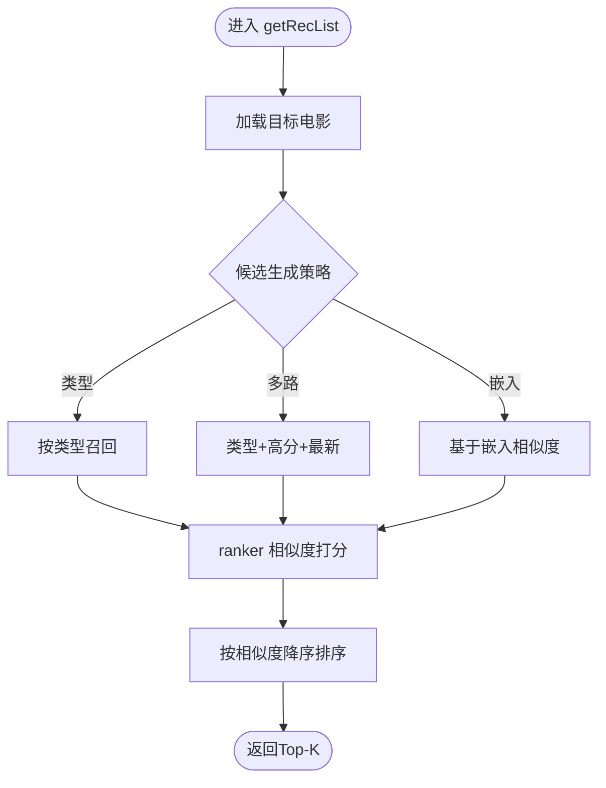
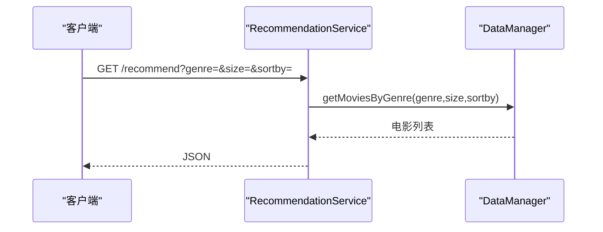
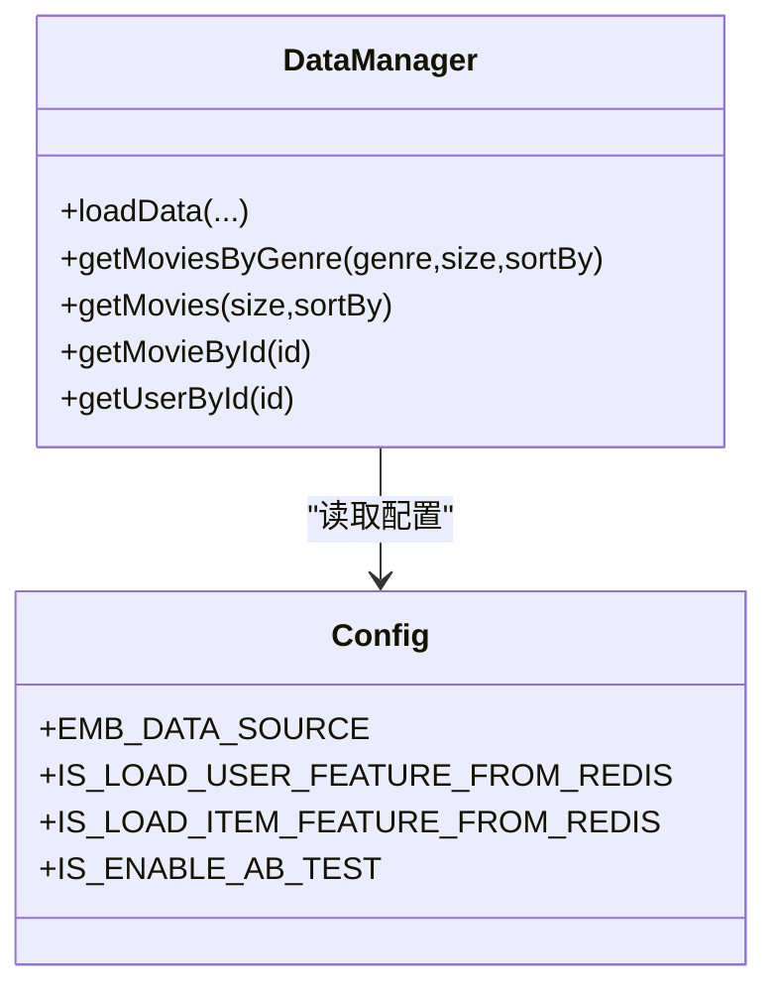
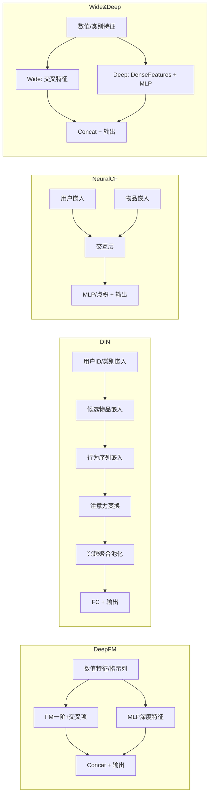
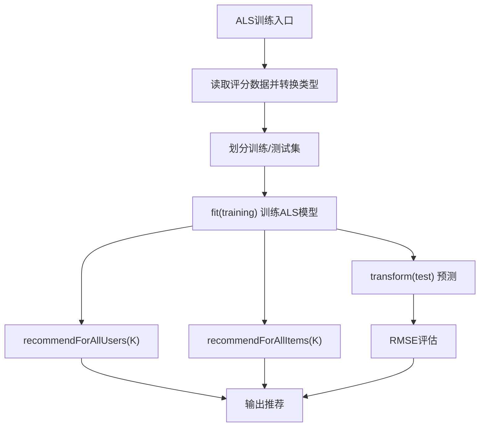
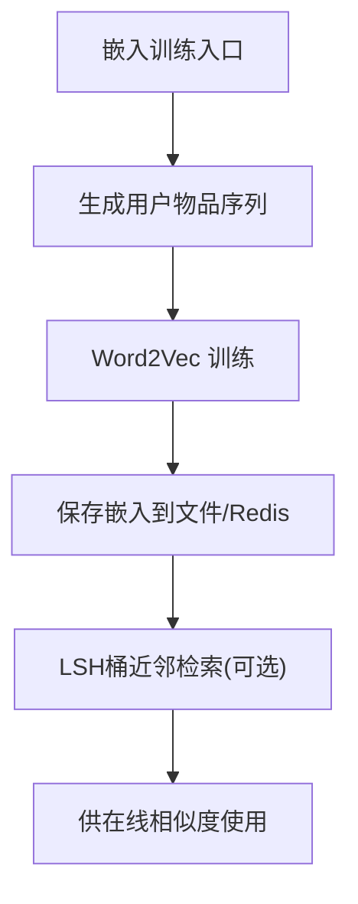
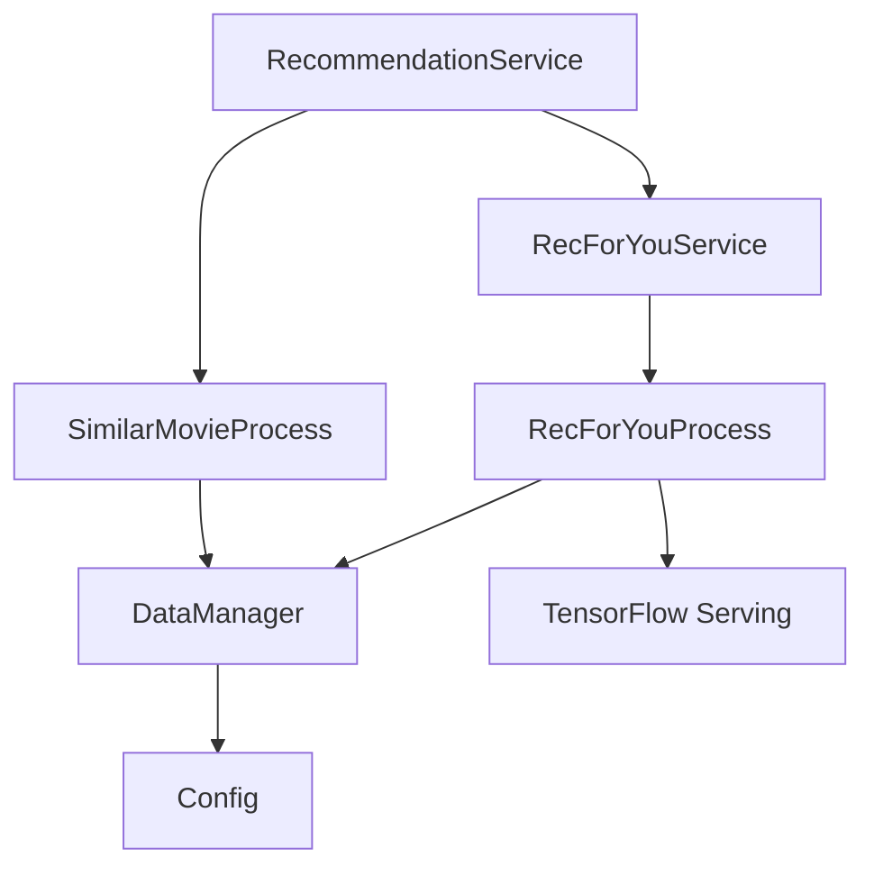

# 核心功能

<cite>
**本文引用的文件**
- [README.md](file://README.md)
- [RecForYouProcess.java](file://src/main/java/com/sparrowrecsys/online/recprocess/RecForYouProcess.java)
- [SimilarMovieProcess.java](file://src/main/java/com/sparrowrecsys/online/recprocess/SimilarMovieProcess.java)
- [RecommendationService.java](file://src/main/java/com/sparrowrecsys/online/service/RecommendationService.java)
- [RecForYouService.java](file://src/main/java/com/sparrowrecsys/online/service/RecForYouService.java)
- [DataManager.java](file://src/main/java/com/sparrowrecsys/online/datamanager/DataManager.java)
- [Config.java](file://src/main/java/com/sparrowrecsys/online/util/Config.java)
- [CollaborativeFiltering.scala](file://src/main/java/com/sparrowrecsys/offline/spark/model/CollaborativeFiltering.scala)
- [Embedding.scala](file://src/main/java/com/sparrowrecsys/offline/spark/embedding/Embedding.scala)
- [DeepFM.py](file://TFRecModel/src/com/sparrowrecsys/offline/tensorflow/DeepFM.py)
- [DIN.py](file://TFRecModel/src/com/sparrowrecsys/offline/tensorflow/DIN.py)
- [NeuralCF.py](file://TFRecModel/src/com/sparrowrecsys/offline/tensorflow/NeuralCF.py)
- [WideNDeep.py](file://TFRecModel/src/com/sparrowrecsys/offline/tensorflow/WideNDeep.py)
- [Evaluator.scala](file://src/main/java/com/sparrowrecsys/offline/spark/evaluate/Evaluator.scala)
</cite>

## 目录
1. [引言](#引言)
2. [项目结构](#项目结构)
3. [核心功能](#核心功能)
4. [架构总览](#架构总览)
5. [关键组件详解](#关键组件详解)
6. [依赖关系分析](#依赖关系分析)
7. [性能与可扩展性](#性能与可扩展性)
8. [故障排查指南](#故障排查指南)
9. [结论](#结论)
10. [附录](#附录)

## 引言
本文件面向SparrowRecSys项目的使用者与学习者，系统梳理项目提供的核心推荐能力与技术实现，包括个性化电影推荐、相似电影推荐、用户画像分析等；并介绍项目支持的深度学习推荐模型（如DeepFM、DIN、NeuralCF、Wide&Deep等）以及传统协同过滤ALS等经典算法。文档还覆盖特征工程、模型训练、在线推理等推荐系统关键环节，并给出典型使用场景与效果说明，帮助读者快速理解并应用该系统。

## 项目结构
SparrowRecSys采用混合语言架构，包含离线Spark批处理、TensorFlow模型训练、Jetty在线服务与前端展示等模块。整体结构如下：

图表来源
- [CollaborativeFiltering.scala](file://src/main/java/com/sparrowrecsys/offline/spark/model/CollaborativeFiltering.scala#L12-L84)
- [Embedding.scala](file://src/main/java/com/sparrowrecsys/offline/spark/embedding/Embedding.scala#L268-L286)
- [DeepFM.py](file://TFRecModel/src/com/sparrowrecsys/offline/tensorflow/DeepFM.py#L1-L135)
- [DIN.py](file://TFRecModel/src/com/sparrowrecsys/offline/tensorflow/DIN.py#L1-L190)
- [NeuralCF.py](file://TFRecModel/src/com/sparrowrecsys/offline/tensorflow/NeuralCF.py#L1-L106)
- [WideNDeep.py](file://TFRecModel/src/com/sparrowrecsys/offline/tensorflow/WideNDeep.py#L1-L130)
- [Evaluator.scala](file://src/main/java/com/sparrowrecsys/offline/spark/evaluate/Evaluator.scala#L1-L22)
- [DataManager.java](file://src/main/java/com/sparrowrecsys/online/datamanager/DataManager.java#L1-L295)
- [Config.java](file://src/main/java/com/sparrowrecsys/online/util/Config.java#L1-L14)
- [SimilarMovieProcess.java](file://src/main/java/com/sparrowrecsys/online/recprocess/SimilarMovieProcess.java#L1-L174)
- [RecForYouProcess.java](file://src/main/java/com/sparrowrecsys/online/recprocess/RecForYouProcess.java#L1-L140)
- [RecommendationService.java](file://src/main/java/com/sparrowrecsys/online/service/RecommendationService.java#L1-L48)
- [RecForYouService.java](file://src/main/java/com/sparrowrecsys/online/service/RecForYouService.java#L1-L55)

章节来源
- [README.md](file://README.md#L1-L57)

## 核心功能
- 个性化电影推荐（为你推荐）
  - 基于用户画像与候选池排序，支持多种排序策略：嵌入相似度、神经协同过滤（NeuralCF）在线推理、默认评分排序等。
  - 支持AB实验开关，按用户维度动态选择模型或策略。
- 相似电影推荐
  - 提供基于内容（类型、评分）与嵌入相似度的候选生成与重排策略，支持多路召回融合。
- 用户画像分析
  - 通过离线Word2vec/DeepWalk等生成物品嵌入，结合用户历史行为聚合得到用户嵌入，用于相似度计算与个性化排序。
- 深度学习推荐模型
  - 支持DeepFM、DIN、NeuralCF、Wide&Deep等模型的离线训练脚本，便于特征工程与模型评估。
- 传统协同过滤ALS
  - 使用Spark MLlib ALS进行矩阵分解训练与评估，输出用户/物品因子，支撑离线与在线推荐。

章节来源
- [RecForYouProcess.java](file://src/main/java/com/sparrowrecsys/online/recprocess/RecForYouProcess.java#L29-L92)
- [RecForYouService.java](file://src/main/java/com/sparrowrecsys/online/service/RecForYouService.java#L30-L42)
- [SimilarMovieProcess.java](file://src/main/java/com/sparrowrecsys/online/recprocess/SimilarMovieProcess.java#L20-L137)
- [DataManager.java](file://src/main/java/com/sparrowrecsys/online/datamanager/DataManager.java#L39-L50)
- [CollaborativeFiltering.scala](file://src/main/java/com/sparrowrecsys/offline/spark/model/CollaborativeFiltering.scala#L29-L64)
- [Embedding.scala](file://src/main/java/com/sparrowrecsys/offline/spark/embedding/Embedding.scala#L103-L138)

## 架构总览
SparrowRecSys遵循“离线特征与模型—近线/在线服务—前端展示”的分层架构。离线层负责数据预处理、嵌入与模型训练；在线层通过HTTP接口提供推荐服务；前端通过静态页面与AJAX调用在线服务。

图表来源
- [RecForYouService.java](file://src/main/java/com/sparrowrecsys/online/service/RecForYouService.java#L20-L54)
- [RecForYouProcess.java](file://src/main/java/com/sparrowrecsys/online/recprocess/RecForYouProcess.java#L113-L138)
- [DataManager.java](file://src/main/java/com/sparrowrecsys/online/datamanager/DataManager.java#L285-L293)

## 关键组件详解

### 个性化电影推荐（为你推荐）
- 功能概述
  - 输入用户ID、返回数量、排序模型（emb/nerualcf/default），输出个性化电影列表。
  - 支持从文件或Redis加载用户嵌入与特征，支持AB测试按用户分流。
- 处理流程
  - 读取用户信息与候选池（热门/高分/最新等）。
  - 根据模型选择排序策略：嵌入相似度、NeuralCF在线推理、默认评分排序。
  - 返回Top-K结果。
- 技术要点
  - 嵌入相似度：基于用户向量与物品向量的相似度计算。
  - NeuralCF在线推理：构造实例数组，调用本地TensorFlow Serving获取预测分数。
  - AB测试：根据用户ID动态选择模型配置。

图表来源
- [RecForYouProcess.java](file://src/main/java/com/sparrowrecsys/online/recprocess/RecForYouProcess.java#L29-L138)
- [RecForYouService.java](file://src/main/java/com/sparrowrecsys/online/service/RecForYouService.java#L30-L42)
- [Config.java](file://src/main/java/com/sparrowrecsys/online/util/Config.java#L1-L14)

章节来源
- [RecForYouProcess.java](file://src/main/java/com/sparrowrecsys/online/recprocess/RecForYouProcess.java#L29-L138)
- [RecForYouService.java](file://src/main/java/com/sparrowrecsys/online/service/RecForYouService.java#L20-L54)
- [Config.java](file://src/main/java/com/sparrowrecsys/online/util/Config.java#L1-L14)

### 相似电影推荐
- 功能概述
  - 输入电影ID、返回数量、相似度模型（emb/默认），输出相似电影列表。
  - 支持多路候选生成：同类型召回、高分/最新补充、嵌入相似度候选池。
- 处理流程
  - 生成候选池：按类型召回、高分/最新补充、嵌入相似度筛选。
  - 相似度打分：类型交集比、评分权重、嵌入相似度加权。
  - 排序返回Top-K。
- 技术要点
  - 类型相似度：Jaccard系数加权评分。
  - 嵌入相似度：基于物品嵌入的余弦相似度。

图表来源
- [SimilarMovieProcess.java](file://src/main/java/com/sparrowrecsys/online/recprocess/SimilarMovieProcess.java#L20-L137)

章节来源
- [SimilarMovieProcess.java](file://src/main/java/com/sparrowrecsys/online/recprocess/SimilarMovieProcess.java#L20-L174)

### 在线服务接口
- 通用推荐接口
  - 支持按类型与排序方式返回电影列表，便于首页/分类页展示。
- 为你推荐接口
  - 支持参数：用户ID、返回数量、模型类型；支持AB测试自动分流。

图表来源
- [RecommendationService.java](file://src/main/java/com/sparrowrecsys/online/service/RecommendationService.java#L18-L46)
- [DataManager.java](file://src/main/java/com/sparrowrecsys/online/datamanager/DataManager.java#L252-L268)

章节来源
- [RecommendationService.java](file://src/main/java/com/sparrowrecsys/online/service/RecommendationService.java#L18-L46)
- [RecForYouService.java](file://src/main/java/com/sparrowrecsys/online/service/RecForYouService.java#L20-L54)

### 数据与配置
- 数据管理器
  - 负责加载电影、链接、评分、嵌入与特征，构建类型索引，支持从文件或Redis加载。
- 配置中心
  - 控制嵌入数据源（文件/Redis）、是否从Redis加载用户/物品特征、是否启用AB测试等。

图表来源
- [DataManager.java](file://src/main/java/com/sparrowrecsys/online/datamanager/DataManager.java#L1-L295)
- [Config.java](file://src/main/java/com/sparrowrecsys/online/util/Config.java#L1-L14)

章节来源
- [DataManager.java](file://src/main/java/com/sparrowrecsys/online/datamanager/DataManager.java#L1-L295)
- [Config.java](file://src/main/java/com/sparrowrecsys/online/util/Config.java#L1-L14)

### 深度学习模型与训练
- DeepFM
  - 特征：用户/物品ID嵌入、类别特征嵌入、数值特征；FM一阶与交叉项 + MLP深度部分。
- DIN（Deep Interest Network）
  - 引入用户近期行为序列与候选物品的注意力机制，使用掩码与拼接变换计算兴趣表示。
- NeuralCF
  - 双塔结构：物品塔与用户塔分别编码后拼接或点积，再经MLP/激活输出。
- Wide&Deep
  - 宽模型（交叉特征）与深模型（密集特征）融合，兼顾记忆与泛化。

图表来源
- [DeepFM.py](file://TFRecModel/src/com/sparrowrecsys/offline/tensorflow/DeepFM.py#L29-L120)
- [DIN.py](file://TFRecModel/src/com/sparrowrecsys/offline/tensorflow/DIN.py#L33-L167)
- [NeuralCF.py](file://TFRecModel/src/com/sparrowrecsys/offline/tensorflow/NeuralCF.py#L37-L74)
- [WideNDeep.py](file://TFRecModel/src/com/sparrowrecsys/offline/tensorflow/WideNDeep.py#L75-L108)

章节来源
- [DeepFM.py](file://TFRecModel/src/com/sparrowrecsys/offline/tensorflow/DeepFM.py#L1-L135)
- [DIN.py](file://TFRecModel/src/com/sparrowrecsys/offline/tensorflow/DIN.py#L1-L190)
- [NeuralCF.py](file://TFRecModel/src/com/sparrowrecsys/offline/tensorflow/NeuralCF.py#L1-L106)
- [WideNDeep.py](file://TFRecModel/src/com/sparrowrecsys/offline/tensorflow/WideNDeep.py#L1-L130)

### 传统协同过滤ALS
- 功能概述
  - 使用ALS进行矩阵分解，输出用户/物品因子，支持RMSE评估与Top-K推荐生成。
- 关键步骤
  - 数据准备：转换字段类型、划分训练/测试集。
  - 模型训练：设置迭代次数、正则化参数。
  - 评估：回归评估器计算RMSE。
  - 推荐：为所有用户/物品生成Top-K推荐。

图表来源
- [CollaborativeFiltering.scala](file://src/main/java/com/sparrowrecsys/offline/spark/model/CollaborativeFiltering.scala#L12-L84)

章节来源
- [CollaborativeFiltering.scala](file://src/main/java/com/sparrowrecsys/offline/spark/model/CollaborativeFiltering.scala#L12-L84)

### 嵌入与图嵌入（Word2vec/DeepWalk）
- 功能概述
  - 基于用户观看序列生成物品序列，训练Word2vec得到物品嵌入；也可通过随机游走构造样本，训练图嵌入。
  - 支持LSH桶近邻检索，加速相似度计算。
- 关键步骤
  - 序列生成：按时间戳排序用户观看序列。
  - 模型训练：Word2Vec训练物品嵌入。
  - 结果落盘/Redis缓存，供在线服务使用。

图表来源
- [Embedding.scala](file://src/main/java/com/sparrowrecsys/offline/spark/embedding/Embedding.scala#L27-L138)
- [Embedding.scala](file://src/main/java/com/sparrowrecsys/offline/spark/embedding/Embedding.scala#L230-L252)

章节来源
- [Embedding.scala](file://src/main/java/com/sparrowrecsys/offline/spark/embedding/Embedding.scala#L27-L138)
- [Embedding.scala](file://src/main/java/com/sparrowrecsys/offline/spark/embedding/Embedding.scala#L230-L252)

## 依赖关系分析
- 组件耦合
  - 在线服务依赖推荐处理流程与数据管理器；推荐处理流程依赖数据管理器与可选的TensorFlow Serving。
  - 配置中心影响数据加载路径与AB测试策略。
- 外部依赖
  - Spark ML/MLlib用于ALS与嵌入训练。
  - TensorFlow Serving用于NeuralCF在线推理。
  - Redis用于嵌入与特征缓存。

图表来源
- [RecommendationService.java](file://src/main/java/com/sparrowrecsys/online/service/RecommendationService.java#L18-L46)
- [RecForYouService.java](file://src/main/java/com/sparrowrecsys/online/service/RecForYouService.java#L20-L54)
- [RecForYouProcess.java](file://src/main/java/com/sparrowrecsys/online/recprocess/RecForYouProcess.java#L113-L138)
- [SimilarMovieProcess.java](file://src/main/java/com/sparrowrecsys/online/recprocess/SimilarMovieProcess.java#L121-L137)
- [DataManager.java](file://src/main/java/com/sparrowrecsys/online/datamanager/DataManager.java#L1-L295)
- [Config.java](file://src/main/java/com/sparrowrecsys/online/util/Config.java#L1-L14)

章节来源
- [RecommendationService.java](file://src/main/java/com/sparrowrecsys/online/service/RecommendationService.java#L18-L46)
- [RecForYouService.java](file://src/main/java/com/sparrowrecsys/online/service/RecForYouService.java#L20-L54)
- [RecForYouProcess.java](file://src/main/java/com/sparrowrecsys/online/recprocess/RecForYouProcess.java#L113-L138)
- [SimilarMovieProcess.java](file://src/main/java/com/sparrowrecsys/online/recprocess/SimilarMovieProcess.java#L121-L137)
- [DataManager.java](file://src/main/java/com/sparrowrecsys/online/datamanager/DataManager.java#L1-L295)
- [Config.java](file://src/main/java/com/sparrowrecsys/online/util/Config.java#L1-L14)

## 性能与可扩展性
- 嵌入与缓存
  - 将物品/用户嵌入持久化至文件或Redis，减少在线时的IO与计算开销。
- 近线/在线分离
  - 离线批量生成嵌入与模型，线上仅做轻量级排序与推理，降低延迟。
- 模型推理
  - NeuralCF通过TensorFlow Serving异步推理，避免阻塞主线程。
- 可扩展建议
  - 候选池规模与排序策略可按AB实验动态调整。
  - 嵌入维度与LSH桶数可根据数据规模与查询延迟调优。

[本节为通用指导，无需列出章节来源]

## 故障排查指南
- 嵌入为空或未加载
  - 检查嵌入数据源配置（文件/Redis）与加载路径。
  - 确认Redis连接与键前缀一致。
- NeuralCF推理失败
  - 检查TensorFlow Serving端点可达性与模型版本。
  - 校验请求体格式与字段名。
- 排序异常或无结果
  - 检查候选池生成逻辑与排序权重。
  - 确认用户ID/电影ID有效且存在于数据集中。

章节来源
- [DataManager.java](file://src/main/java/com/sparrowrecsys/online/datamanager/DataManager.java#L90-L124)
- [RecForYouProcess.java](file://src/main/java/com/sparrowrecsys/online/recprocess/RecForYouProcess.java#L113-L138)
- [Config.java](file://src/main/java/com/sparrowrecsys/online/util/Config.java#L1-L14)

## 结论
SparrowRecSys提供了从离线特征与模型训练到在线服务与前端展示的完整推荐能力。通过个性化推荐、相似电影推荐与用户画像分析，结合深度学习与传统方法，满足多样化的业务需求。依托嵌入与缓存、近线/在线分离与可插拔的排序策略，系统具备良好的性能与可扩展性。

[本节为总结性内容，无需列出章节来源]

## 附录

### 使用场景与效果示例
- 场景一：首页/分类页
  - 使用通用推荐接口按类型与评分排序返回电影列表，提升曝光与点击。
- 场景二：为你推荐
  - 基于用户嵌入与NeuralCF在线推理，输出个性化Top-K，提高转化率。
- 场景三：相似电影
  - 基于类型与嵌入相似度生成候选池，提升长尾物品曝光与用户满意度。

[本节为概念性说明，无需列出章节来源]