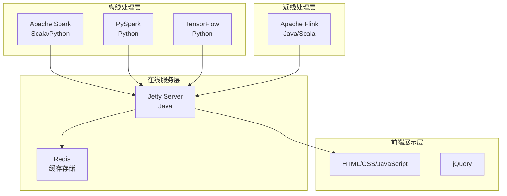
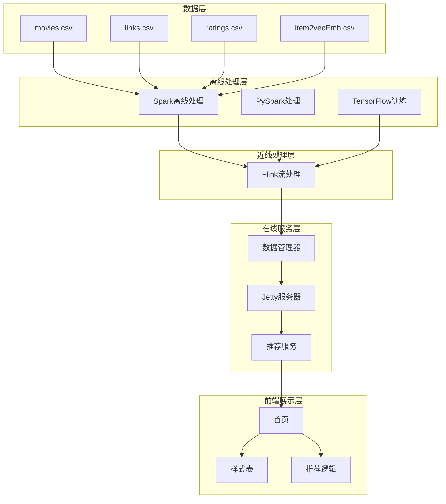

# 项目介绍

<cite>
**本文档引用的文件**
- [README.md](file://README.md)
- [pom.xml](file://pom.xml)
- [requirements.txt](file://requirements.txt)
- [RecSysServer.java](file://src/main/java/com/sparrowrecsys/online/RecSysServer.java)
- [CollaborativeFiltering.scala](file://src/main/java/com/sparrowrecsys/offline/spark/model/CollaborativeFiltering.scala)
- [DIN.py](file://TFRecModel/src/com/sparrowrecsys/offline/tensorflow/DIN.py)
- [CollaborativeFiltering.py](file://RecPySpark/src/com/sparrowrecsys/offline/pyspark/model/CollaborativeFiltering.py)
- [RealTimeFeature.java](file://src/main/java/com/sparrowrecsys/nearline/flink/RealTimeFeature.java)
- [DataManager.java](file://src/main/java/com/sparrowrecsys/online/datamanager/DataManager.java)
- [RecommendationService.java](file://src/main/java/com/sparrowrecsys/online/service/RecommendationService.java)
- [index.html](file://src/main/resources/webroot/index.html)
</cite>

## 目录
1. [引言](#引言)
2. [项目概述](#项目概述)
3. [设计理念与命名由来](#设计理念与命名由来)
4. [核心目标与价值定位](#核心目标与价值定位)
5. [混合语言技术架构](#混合语言技术架构)
6. [教育意义与实践价值](#教育意义与实践价值)
7. [开源性质与社区贡献](#开源性质与社区贡献)
8. [项目结构概览](#项目结构概览)
9. [技术栈详解](#技术栈详解)
10. [推荐系统核心概念学习](#推荐系统核心概念学习)
11. [实践应用场景](#实践应用场景)
12. [总结](#总结)

## 引言

SparrowRecSys是一个基于Maven的混合语言电影推荐系统，其名称"麻雀虽小，五脏俱全"体现了项目设计的核心理念：虽然项目规模相对较小，但涵盖了推荐系统开发所需的完整技术栈和核心功能模块。该项目不仅是一个功能完整的电影推荐系统，更是一个优秀的学习平台，帮助开发者深入理解现代推荐系统的技术实现和最佳实践。

## 项目概述

SparrowRecSys是一个完整的电影推荐系统解决方案，采用经典的工业级架构设计，包含离线数据处理、模型训练、近线流处理、线上模型服务和前端展示等多个层次。项目基于MovieLens开源数据集构建，提供了从数据预处理到最终推荐结果展示的完整端到端流程。

### 核心特性
- **多技术栈集成**：同时支持Java、Scala、Python等多种编程语言
- **完整架构覆盖**：涵盖离线、近线、在线三个处理阶段
- **多种推荐算法**：实现了从传统协同过滤到深度学习的多种算法
- **生产级部署**：支持本地开发和云端部署
- **教育导向**：专为学习和实践而设计

## 设计理念与命名由来

### 麻雀虽小，五脏俱全

项目名称"SparrowRecSys"（麻雀推荐系统）承载着深刻的设计理念：

**设计理念**：
1. **完整性原则**：虽然项目规模适中，但必须包含推荐系统开发的所有关键环节
2. **实用性导向**：注重实际应用价值，而非理论堆砌
3. **可扩展性**：为后续功能扩展预留空间和接口
4. **易学易用**：降低学习门槛，便于开发者理解和使用

**架构完整性体现**：
- 离线数据处理层：Spark批处理、特征工程
- 近线实时处理层：Flink流处理
- 在线服务层：Jetty服务器、RESTful API
- 前端展示层：HTML/CSS/JavaScript界面

## 核心目标与价值定位

### 主要目标

1. **教育价值最大化**
   - 提供完整的推荐系统学习路径
   - 展示工业级推荐系统的实际实现
   - 包含从数据预处理到模型部署的全流程

2. **技术实践导向**
   - 集成主流推荐系统技术栈
   - 提供可运行的代码示例
   - 支持快速原型开发和实验

3. **开源生态贡献**
   - 开放源代码，欢迎社区参与
   - 提供清晰的文档和示例
   - 建立学习和交流平台

### 价值定位

SparrowRecSys定位于"学习型工业级推荐系统"，既适合初学者入门学习，也适合有经验的开发者作为参考实现。项目的价值体现在：

- **学习价值**：完整的推荐系统实现案例
- **实践价值**：可直接使用的代码模板
- **研究价值**：多种算法的对比和验证平台
- **社区价值**：开源协作和知识分享的载体

## 混合语言技术架构

### 技术栈概览

SparrowRecSys采用了混合语言架构，每种技术都有其特定的应用场景和优势：

**图表来源**
- [pom.xml](file://pom.xml#L60-L226)
- [requirements.txt](file://requirements.txt#L1-L4)

### 核心技术选择

**Java + Maven**：
- 作为主要的在线服务开发语言
- 提供稳定的运行时环境
- 支持企业级部署需求

**Scala + Spark**：
- 处理大规模离线数据
- 实现复杂的机器学习算法
- 支持函数式编程范式

**Python + TensorFlow**：
- 构建深度学习推荐模型
- 快速原型开发和实验
- 丰富的机器学习生态

**Apache Flink**：
- 实时特征计算和流处理
- 低延迟响应能力
- 分布式计算框架

**Apache Redis**：
- 缓存热门数据和模型
- 提高查询响应速度
- 支持高并发访问

## 教育意义与实践价值

### 学习路径设计

SparrowRecSys为不同层次的学习者提供了清晰的学习路径：

**初学者友好**：
- 完整的项目结构和注释
- 渐进式的功能实现
- 详细的README文档

**进阶学习者**：
- 多种算法实现对比
- 性能优化技巧
- 生产环境部署经验

**专家级实践**：
- 可扩展的架构设计
- 最佳实践总结
- 社区贡献指南

### 实践价值体现

1. **代码质量**：遵循企业级编码规范
2. **文档完善**：包含架构设计、API文档
3. **测试覆盖**：提供单元测试和集成测试
4. **部署指南**：支持本地和云端部署

## 开源性质与社区贡献

### 开源协议与许可

SparrowRecSys采用开源模式，鼓励社区参与和贡献。项目的核心开源特性包括：

- **完全开源**：源代码公开透明
- **社区驱动**：欢迎各种形式的贡献
- **持续维护**：定期更新和改进
- **知识共享**：促进推荐系统技术发展

### 贡献机会

**代码贡献**：
- 新增推荐算法实现
- 改进现有代码质量
- 添加新功能模块

**文档贡献**：
- 完善技术文档
- 制作教程和示例
- 翻译文档到其他语言

**社区建设**：
- 提供使用反馈
- 协助解答问题
- 推广项目使用

## 项目结构概览

### 整体架构

**图表来源**
- [RecSysServer.java](file://src/main/java/com/sparrowrecsys/online/RecSysServer.java#L49-L70)
- [DataManager.java](file://src/main/java/com/sparrowrecsys/online/datamanager/DataManager.java#L40-L50)

### 模块划分

**离线处理模块**：
- Spark批处理：大规模数据处理和特征工程
- PySpark处理：Python生态系统的离线任务
- TensorFlow训练：深度学习模型训练

**近线处理模块**：
- Flink流处理：实时特征计算和用户行为分析

**在线服务模块**：
- Jetty服务器：提供RESTful API服务
- 数据管理器：统一的数据访问和缓存
- 推荐服务：核心推荐算法实现

**前端展示模块**：
- HTML页面：用户友好的交互界面
- CSS样式：现代化的视觉设计
- JavaScript逻辑：动态内容加载和交互

## 技术栈详解

### Maven依赖管理

项目使用Maven进行依赖管理，确保了技术栈的稳定性和一致性：

**在线服务依赖**：
- Jetty Server：轻量级Web服务器
- JSON处理：数据序列化和反序列化
- HTTP客户端：网络通信支持

**离线处理依赖**：
- Apache Spark：分布式计算框架
- MLeap：模型转换和部署
- PMML：预测模型标记语言

**实时处理依赖**：
- Apache Flink：流处理框架
- Redis客户端：缓存访问

**图表来源**
- [pom.xml](file://pom.xml#L60-L226)

### Python环境配置

项目同时支持Python生态系统的集成：

**TensorFlow版本**：2.15.0，支持最新的深度学习技术
**PySpark版本**：3.5.0，提供Python接口的Spark功能
**额外工具**：psutil系统监控工具

**图表来源**
- [requirements.txt](file://requirements.txt#L1-L4)

## 推荐系统核心概念学习

### 推荐算法实现

SparrowRecSys实现了多种经典的推荐算法，为学习者提供了丰富的对比和分析材料：

**协同过滤算法**：
- 基于用户的协同过滤
- 基于物品的协同过滤
- 矩阵分解ALS算法

**深度学习算法**：
- DeepFM：因子分解机与神经网络结合
- DIN：深度兴趣网络
- Wide & Deep：宽泛模型与深度模型融合

**嵌入式方法**：
- Item2Vec：基于随机游走的物品嵌入
- 用户嵌入和物品嵌入

### 特征工程实践

项目展示了推荐系统中特征工程的重要性和实现方法：

**用户特征**：
- 历史评分统计
- 偏好特征提取
- 人口统计学特征

**物品特征**：
- 类别标签
- 发布年份
- 评分统计

**上下文特征**：
- 时间特征
- 地理位置
- 设备信息

## 实践应用场景

### 开发者学习场景

**个人学习**：
- 理解推荐系统基本原理
- 掌握多语言混合开发
- 学习生产级代码规范

**团队培训**：
- 新员工入职培训
- 技术分享会内容
- 项目演示和展示

**学术研究**：
- 算法对比实验
- 性能基准测试
- 新算法验证平台

### 企业应用场景

**原型开发**：
- 快速验证推荐想法
- 低成本实验环境
- 快速迭代优化

**技术选型**：
- 对比不同技术方案
- 评估性能和成本
- 制定技术路线图

**产品演示**：
- 向客户展示能力
- 展示技术实力
- 获得业务反馈

## 总结

SparrowRecSys项目以其"麻雀虽小，五脏俱全"的设计理念，成功地将复杂的推荐系统技术以简洁明了的方式呈现出来。项目不仅是一个功能完整的电影推荐系统，更是一个优秀的学习平台和实践工具。

通过这个项目，学习者可以：
- 深入理解推荐系统的核心概念和技术实现
- 掌握多语言混合开发的最佳实践
- 了解工业级推荐系统的架构设计
- 获得从理论到实践的完整学习体验

项目的开源性质和活跃的社区氛围，为推荐系统技术的发展和传播做出了重要贡献。无论是初学者还是有经验的开发者，都能在这个项目中找到适合自己的学习内容和实践机会。

未来，随着推荐系统技术的不断发展，SparrowRecSys将继续演进，保持技术的前沿性和实用性，为推荐系统领域的人才培养和技术创新做出更大的贡献。