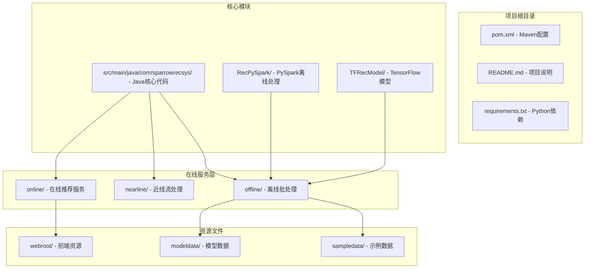
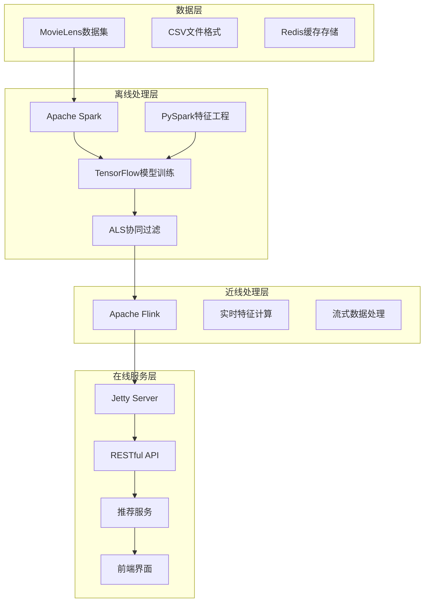
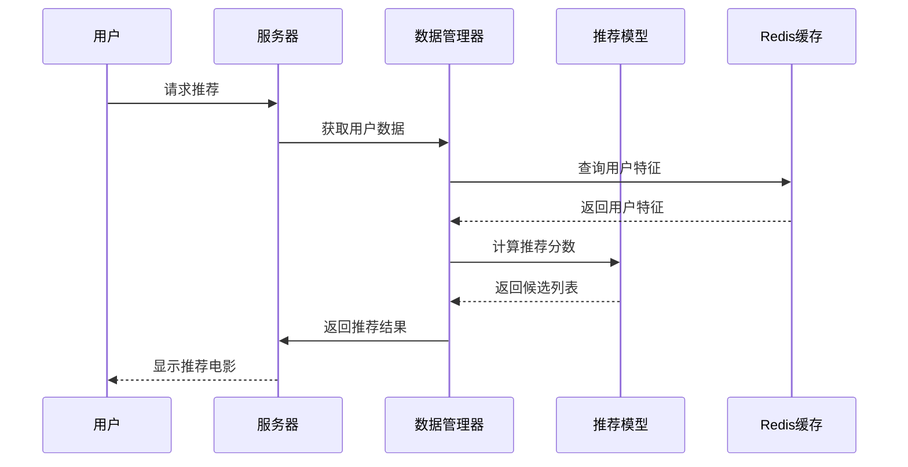
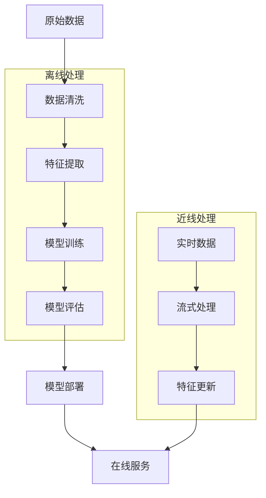
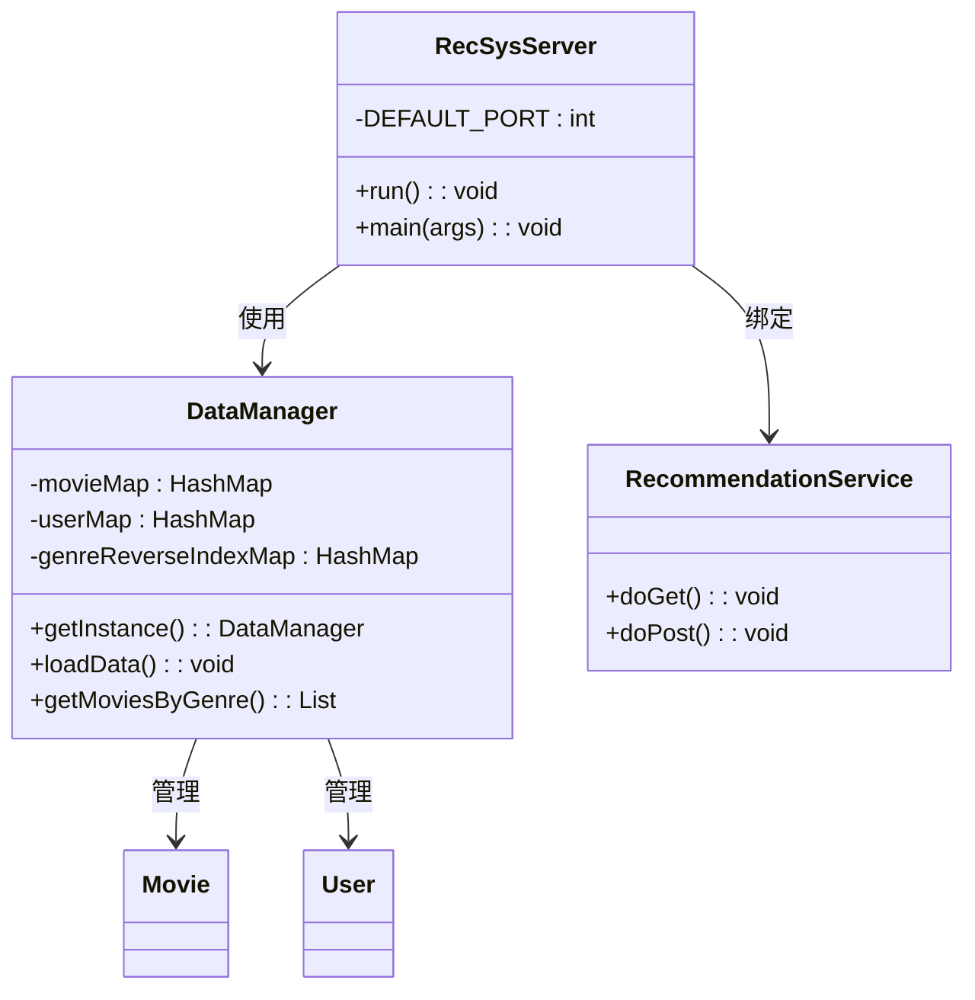
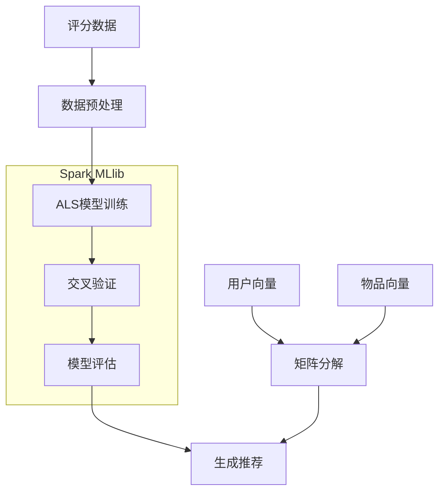
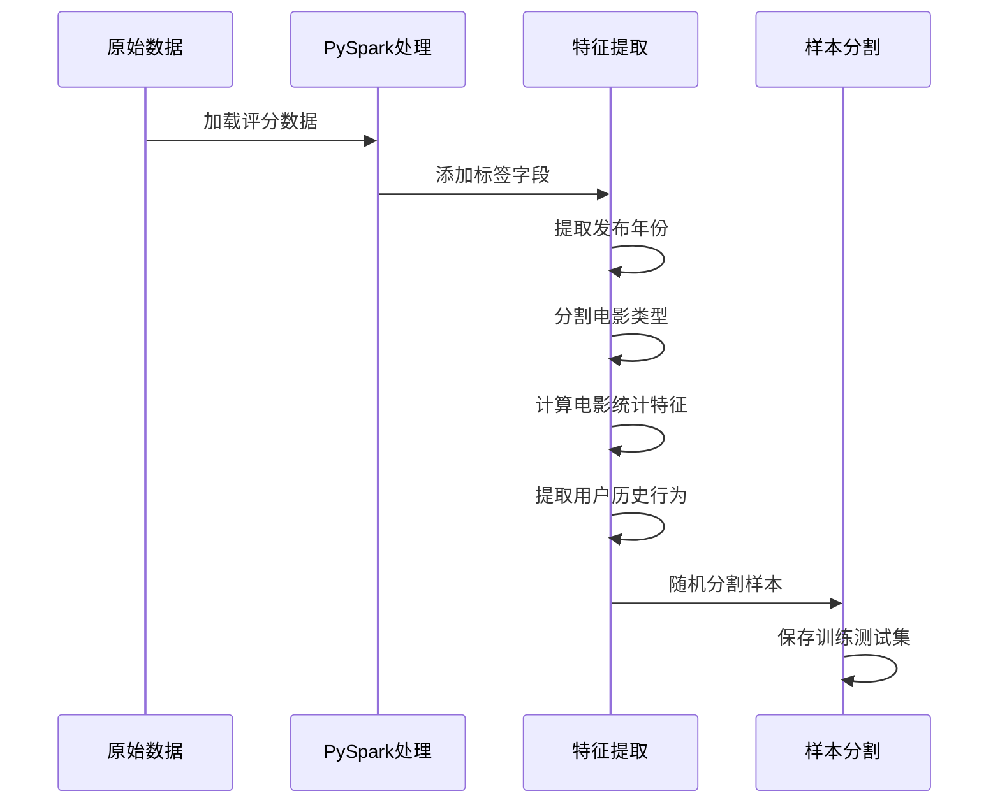
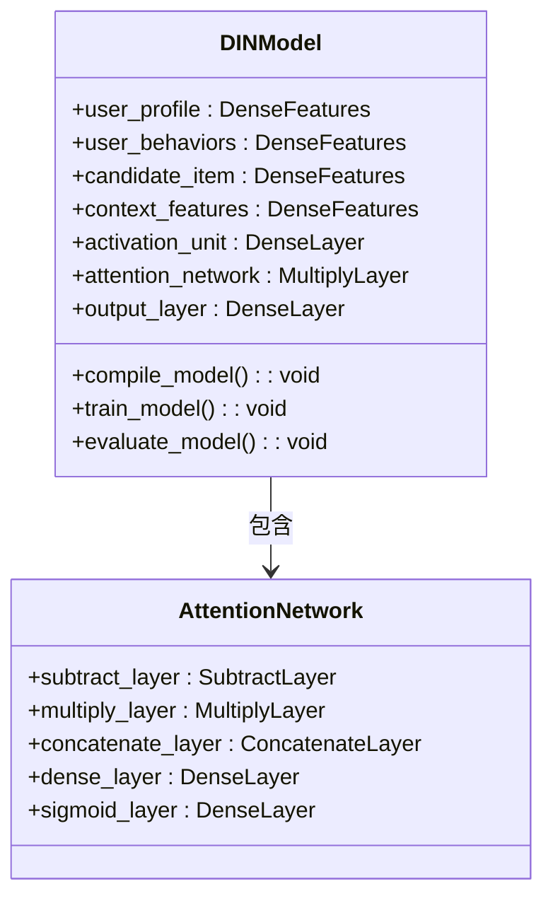
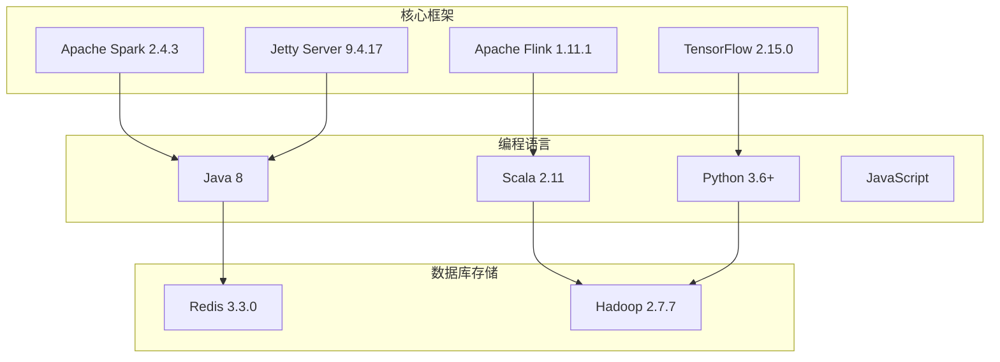

# 项目概述

<cite>
**本文档引用的文件**
- [README.md](file://README.md)
- [pom.xml](file://pom.xml)
- [requirements.txt](file://requirements.txt)
- [RecSysServer.java](file://src/main/java/com/sparrowrecsys/online/RecSysServer.java)
- [RecommendationService.java](file://src/main/java/com/sparrowrecsys/online/service/RecommendationService.java)
- [DataManager.java](file://src/main/java/com/sparrowrecsys/online/datamanager/DataManager.java)
- [CollaborativeFiltering.scala](file://src/main/java/com/sparrowrecsys/offline/spark/model/CollaborativeFiltering.scala)
- [FeatureEngForRecModel.py](file://RecPySpark/src/com/sparrowrecsys/offline/pyspark/featureeng/FeatureEngForRecModel.py)
- [DIN.py](file://TFRecModel/src/com/sparrowrecsys/offline/tensorflow/DIN.py)
- [RealTimeFeature.java](file://src/main/java/com/sparrowrecsys/nearline/flink/RealTimeFeature.java)
- [index.html](file://src/main/resources/webroot/index.html)
</cite>

## 目录
1. [简介](#简介)
2. [项目结构](#项目结构)
3. [核心组件](#核心组件)
4. [架构总览](#架构总览)
5. [详细组件分析](#详细组件分析)
6. [依赖关系分析](#依赖关系分析)
7. [性能考虑](#性能考虑)
8. [故障排除指南](#故障排除指南)
9. [结论](#结论)

## 简介

SparrowRecSys是一个基于maven的混合语言电影推荐系统，体现了"麻雀虽小，五脏俱全"的设计理念。该项目整合了多种现代推荐系统技术栈，包括Apache Spark、TensorFlow、Jetty Server、Flink等，构建了一个完整的工业级推荐系统解决方案。

### 项目目标
- 提供一个可运行的电影推荐系统原型
- 展示混合语言架构在推荐系统中的应用
- 教学和实践深度学习推荐系统的技术细节
- 覆盖从离线数据处理到线上服务的完整推荐流程

### 核心功能
- 基于内容的电影推荐
- 协同过滤推荐算法
- 深度学习模型推荐（DIN、DeepFM等）
- 实时特征计算和流处理
- 在线服务和API接口

## 项目结构

项目采用模块化设计，按照功能层次组织代码结构：

**图表来源**
- [pom.xml](file://pom.xml#L1-L228)
- [RecSysServer.java](file://src/main/java/com/sparrowrecsys/online/RecSysServer.java#L1-L80)

**章节来源**
- [pom.xml](file://pom.xml#L1-L228)
- [README.md](file://README.md#L1-L57)

## 核心组件

### 技术架构概览

项目采用了经典的工业级推荐系统架构，包含以下核心层次：

**图表来源**
- [pom.xml](file://pom.xml#L60-L226)
- [README.md](file://README.md#L19-L21)

### 混合语言架构设计

项目采用多语言协作的方式，每种语言负责其擅长的领域：

- **Java**: 主要的在线服务和核心业务逻辑
- **Scala**: Apache Spark MLlib的机器学习算法实现
- **Python**: 特征工程和数据预处理
- **JavaScript**: 前端交互和用户界面

这种混合架构的优势在于：
- 利用各语言的最佳特性
- 提高开发效率和性能
- 支持复杂的推荐算法实现

**章节来源**
- [pom.xml](file://pom.xml#L11-L19)
- [requirements.txt](file://requirements.txt#L1-L4)

## 架构总览

### 推荐系统生命周期

整个推荐系统遵循标准的机器学习生命周期：

**图表来源**
- [RecSysServer.java](file://src/main/java/com/sparrowrecsys/online/RecSysServer.java#L49-L54)
- [DataManager.java](file://src/main/java/com/sparrowrecsys/online/datamanager/DataManager.java#L39-L50)

### 数据处理流程

**图表来源**
- [FeatureEngForRecModel.py](file://RecPySpark/src/com/sparrowrecsys/offline/pyspark/featureeng/FeatureEngForRecModel.py#L116-L138)
- [CollaborativeFiltering.scala](file://src/main/java/com/sparrowrecsys/offline/spark/model/CollaborativeFiltering.scala#L12-L84)

## 详细组件分析

### 在线服务层

#### Jetty服务器架构

**图表来源**
- [RecSysServer.java](file://src/main/java/com/sparrowrecsys/online/RecSysServer.java#L18-L78)
- [DataManager.java](file://src/main/java/com/sparrowrecsys/online/datamanager/DataManager.java#L13-L37)

#### 推荐服务实现

推荐服务通过RESTful API提供多种推荐功能：

| 服务名称 | URL路径 | 功能描述 | 参数 |
|---------|---------|----------|------|
| 电影详情 | `/getmovie` | 获取电影详细信息 | `movieId` |
| 用户信息 | `/getuser` | 获取用户信息 | `userId` |
| 相似电影 | `/getsimilarmovie` | 获取相似电影推荐 | `movieId`, `size` |
| 通用推荐 | `/getrecommendation` | 基于类别的推荐 | `genre`, `size`, `sortby` |
| 个性化推荐 | `/getrecforyou` | 个性化推荐 | `userId`, `size` |

**章节来源**
- [RecSysServer.java](file://src/main/java/com/sparrowrecsys/online/RecSysServer.java#L63-L70)
- [RecommendationService.java](file://src/main/java/com/sparrowrecsys/online/service/RecommendationService.java#L18-L47)

### 离线处理层

#### Apache Spark协同过滤

**图表来源**
- [CollaborativeFiltering.scala](file://src/main/java/com/sparrowrecsys/offline/spark/model/CollaborativeFiltering.scala#L27-L64)

#### PySpark特征工程

特征工程是推荐系统的关键步骤，主要包含以下流程：

**图表来源**
- [FeatureEngForRecModel.py](file://RecPySpark/src/com/sparrowrecsys/offline/pyspark/featureeng/FeatureEngForRecModel.py#L12-L156)

**章节来源**
- [CollaborativeFiltering.scala](file://src/main/java/com/sparrowrecsys/offline/spark/model/CollaborativeFiltering.scala#L10-L85)
- [FeatureEngForRecModel.py](file://RecPySpark/src/com/sparrowrecsys/offline/pyspark/featureeng/FeatureEngForRecModel.py#L1-L156)

### 近线处理层

#### Apache Flink实时特征

**图表来源**
- [RealTimeFeature.java](file://src/main/java/com/sparrowrecsys/nearline/flink/RealTimeFeature.java#L32-L68)

**章节来源**
- [RealTimeFeature.java](file://src/main/java/com/sparrowrecsys/nearline/flink/RealTimeFeature.java#L30-L74)

### 深度学习模型

#### TensorFlow推荐模型

项目实现了多个深度学习推荐模型，其中DIN（Deep Interest Network）是最具代表性的：

**图表来源**
- [DIN.py](file://TFRecModel/src/com/sparrowrecsys/offline/tensorflow/DIN.py#L130-L169)

**章节来源**
- [DIN.py](file://TFRecModel/src/com/sparrowrecsys/offline/tensorflow/DIN.py#L1-L190)

## 依赖关系分析

### 技术栈依赖

项目使用了多种成熟的技术栈，形成了完整的推荐系统生态：

**图表来源**
- [pom.xml](file://pom.xml#L11-L19)
- [requirements.txt](file://requirements.txt#L1-L4)

### Maven依赖管理

项目通过Maven统一管理依赖关系，确保版本兼容性和构建一致性：

| 依赖类别 | 关键组件 | 版本 | 用途 |
|---------|---------|------|------|
| 在线服务 | jetty-server | 9.4.17 | Web服务器 |
| 离线处理 | spark-core | 2.4.3 | 批处理引擎 |
| 机器学习 | spark-mllib | 2.4.3 | 协同过滤 |
| 流处理 | flink-streaming | 1.11.1 | 实时计算 |
| 缓存存储 | jedis | 3.3.0 | Redis客户端 |
| HTTP客户端 | httpclient | 4.5.8 | 网络通信 |

**章节来源**
- [pom.xml](file://pom.xml#L60-L226)

## 性能考虑

### 数据加载优化

项目在数据加载方面采用了多种优化策略：

1. **单例模式**: DataManager使用双重检查锁定的单例模式，避免重复实例化
2. **内存映射**: 使用HashMap进行快速查找，支持O(1)时间复杂度的数据访问
3. **延迟加载**: 按需加载嵌入向量和特征数据，减少内存占用
4. **批量处理**: 支持批量数据读取和处理，提高I/O效率

### 推荐算法优化

- **ALS模型参数调优**: 通过交叉验证选择最优的正则化参数
- **特征工程优化**: 使用窗口函数计算用户和物品的统计特征
- **实时特征更新**: 通过Flink实现实时特征计算和更新

### 系统架构优化

- **异步处理**: 使用Jetty的异步特性提高并发处理能力
- **连接池管理**: 合理配置HTTP客户端连接池
- **缓存策略**: 结合Redis缓存热门数据和计算结果

## 故障排除指南

### 常见问题诊断

#### 服务器启动问题

**症状**: 无法启动推荐服务器
**可能原因**:
- 端口被占用
- 资源文件路径错误
- 依赖库缺失

**解决方法**:
1. 检查端口占用情况
2. 验证webroot路径配置
3. 运行`mvn clean install`重新构建

#### 数据加载失败

**症状**: 电影或用户数据无法加载
**可能原因**:
- CSV文件格式不正确
- 文件编码问题
- 路径配置错误

**解决方法**:
1. 检查CSV文件的列数和格式
2. 确认文件编码为UTF-8
3. 验证文件路径是否正确

#### 推荐结果异常

**症状**: 推荐结果不符合预期
**可能原因**:
- 特征工程问题
- 模型训练不足
- 参数设置不当

**解决方法**:
1. 检查特征工程输出
2. 增加训练数据量
3. 调整模型超参数

**章节来源**
- [RecSysServer.java](file://src/main/java/com/sparrowrecsys/online/RecSysServer.java#L20-L33)
- [DataManager.java](file://src/main/java/com/sparrowrecsys/online/datamanager/DataManager.java#L52-L87)

## 结论

SparrowRecSys项目成功展示了现代推荐系统的完整技术栈和实现方式。通过混合语言架构的设计，项目在保持代码质量的同时，充分发挥了各种技术的优势。

### 主要成就

1. **完整的推荐系统**: 从数据处理到在线服务的全流程覆盖
2. **多语言协作**: Java、Scala、Python、JavaScript的有效结合
3. **工业级架构**: 符合生产环境需求的技术选型
4. **教学价值**: 为学习者提供了完整的实践案例

### 技术特色

- **混合语言架构**: 每种语言专注于最适合的领域
- **模块化设计**: 清晰的功能分离和职责划分
- **可扩展性**: 支持添加新的推荐算法和数据源
- **易用性**: 提供直观的API和用户界面

### 应用场景

SparrowRecSys适用于以下场景：
- 推荐系统学习和研究
- 小规模推荐系统部署
- 机器学习项目原型开发
- 教育培训和演示

该项目为初学者提供了一个优秀的入门平台，帮助理解推荐系统的核心概念和实现方式，同时也为实际项目提供了可参考的架构模式。